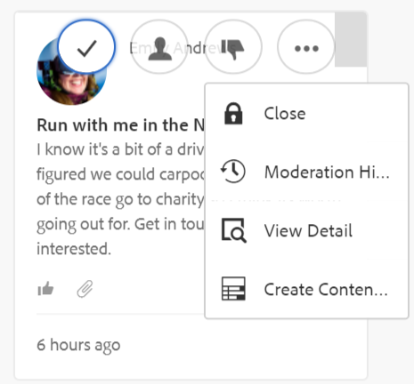

# 审核控制台 {#moderation-console}

在AEM Communities中，管理员和社区审查方（指定为审查方的受信任社区成员）可以在Author和Publish环境中对社区内容[&#128279;](/help/communities/moderate-ugc.md)进行批量审查。

管理员和社区审查方也可以在Publish环境中执行[上下文审核](/help/communities/in-context.md)。

所有[社区站点](/help/communities/sites-console.md)的一项功能是可供具有管理权限登录的用户使用的`Administration`菜单项。 `Administration`链接提供对审核控制台的访问权限。

在“审阅”控制台中，管理员和社区审阅人有权访问他们有权审阅的所有用户生成内容(UGC)。 如果允许审核多个网站，则可以查看所有网站的帖子或按选定的社区网站进行过滤。

有关详细信息，请访问[管理用户和用户组](/help/communities/users.md)。

“审核”控制台支持：

* 正在批量执行审核任务。
* 正在搜索UGC。
* 查看UGC详细信息。
* 查看UGC作者详细信息。

仅当以管理员或具有` [moderator permissions](/help/communities/in-context.md#identifyingtrustedmembers)`的成员身份登录时，才能执行审核任务。

## Publish环境访问 {#publish-environment-access}

要从已发布的社区站点访问审核控制台，需要通过管理链接；当社区审核者登录时，将显示该链接。

通过选择“管理”链接，将显示“审核”控制台：

## 创作环境访问权限 {#author-environment-access}

在创作环境中，用于访问审核控制台

* 从全局导航中，选择&#x200B;**[!UICONTROL 社区]** > **[!UICONTROL 审核]**。

仅当以管理员或具有[审查方权限](/help/communities/in-context.md#identifyingtrustedmembers)的成员身份登录时，才能执行审查任务。 显示的唯一社区内容是允许登录成员审核的内容。

>[!NOTE]
>
>仅当所选的SRP实施公用存储时，Publish环境中的UGC才对Author可见。 例如，默认情况下，存储为JSRP，这不是Author和Publish的常用存储。 查看[社区内容存储](/help/communities/working-with-srp.md)。

## 审核控制台UI {#moderation-console-ui}

除了左导航边栏(显示在创作实例上，但不显示在Publish上)外，审核UI包含以下主要区域：

* **[顶部导航栏](#top-navigation-bar)**
* **[工具栏](#toolbar)**
* **[内容区域](#content-area)**

### 顶部导航栏 {#top-navigation-bar}

对于所有控制台，顶部导航栏都是固定的。 有关详细信息，请参阅[基本处理](/help/sites-authoring/basic-handling.md)。

### 工具栏 {#toolbar}

工具栏位于顶部导航栏的下方，在左侧提供以下切换开关：

* [筛选器边栏](/help/communities/moderation.md#filterrail)
打开边栏，通过该边栏可选择要过滤内容的属性。

工具栏位于顶部导航栏的下方，在左侧提供以下切换开关：

[筛选器边栏](/help/communities/moderation.md#filterrail)
在选择搜索时打开边栏，通过该边栏可选择要筛选内容的属性。

### 内容区域 {#content-area}

内容区域包含有关已发布UGC的信息：

* UGC已发布
* 成员名称
* 成员头像
* 帖子位置
* 发布时间
* 回复帖子的数量
* 与帖子相关的[情绪](/help/communities/moderate-ugc.md#sentiment)
* 如果批准，将显示复选标记
* 如果有附件，则显示回形针

>[!NOTE]
> 
>内容区域具有&#x200B;*无限滚动*，这意味着您可以继续滚动直到内容结束。 即使在滚动时，工具栏仍保留在内容区域上方的固定可见位置。

### 筛选器边栏 {#ootbfilters}

侧面板图标可打开过滤器边栏。 显示在内容区域左侧的过滤器边栏提供了不同的过滤器，每个过滤器都会对内容区域中显示的引用UGC立即产生影响。

每个类别中的筛选器是&#x200B;**OR**，而不同类别中的筛选器是&#x200B;**AND**。

例如，如果同时检查&#x200B;**问题**&#x200B;和&#x200B;**答案**，您会看到内容是&#x200B;**问题** *或* **答案**。

但是，如果您检查&#x200B;**问题**&#x200B;和&#x200B;**待处理**，则您只能看到内容是&#x200B;**问题**&#x200B;和&#x200B;**待处理**。

>[!NOTE]
>
>社区审查方可以在审查控制台UI上将预定义过滤器加入书签。 由于这些过滤器附加到URL的末尾（作为查询字符串参数），审查方可以稍后返回已添加书签的过滤器，还可以共享这些链接。

打开过滤器边栏时，搜索图标可切换关闭的侧面板。 但是，要关闭过滤器边栏并仅查看用户生成的内容，请单击“搜索”图标，然后选择“仅内容”选项。

#### 内容路径 {#content-path}

内容路径将显示的引用UGC限制为放置在指定内容存储库中的帖子。

#### 文本搜索 {#text-search}

文本搜索将引用的UGC显示限制为包含输入文本的帖子。

#### 站点 {#site}

站点限制将引用的UGC显示给选定社区站点的帖子。 如果未选中任何站点，则会显示对UGC的所有引用。

>[!NOTE]
>
>管理员访问批量审核控制台时，将显示对UGC的所有引用，包括未使用[站点创建向导](/help/communities/sites-console.md)创建的站点，如Geometrixx示例。
>
>当受信任的社区成员在Publish上访问批量审阅控制台时，将仅显示对该成员有权审阅的社区站点所创建的UGC的引用。 此外，还可以使用“站点”过滤器来筛选它。

#### 内容类型 {#content-type}

内容类型将引用的UGC显示限制为所选资源类型的帖子。 可以选择以下一种或多种类型。 如果未选择任何类型，则会显示所有类型。

* **评论**
* **论坛主题**
* **论坛回复**
* **问题与解答问题**
* **问题与解答答案**
* **博客文章**
* **博客评论**
* **日历事件**
* **日历评论**
* **文件库文件夹**
* **文件库文档**
* **想法**
* **构思评论**

#### 其他内容类型 {#additional-content-types}

要添加要过滤的其他资源，请执行以下操作：

* 以管理员身份登录到您的创作实例。
* 打开[Web控制台](https://localhost:4502/system/console/configMgr)。
* 找到`AEM Communities Moderation Dashboard Filters`。
* 选择配置以便您可以在编辑模式下打开。
* 输入要筛选的组件的ResourceType：

   * 例如，要筛选包含的投票组件，请输入：

     `Voting=social/tally/components/hbs/voting`

  

* 选择“保存”。
* 刷新社区 — 审核控制台。

结果是`Content Type`筛选器组下的`Voting`的新可选筛选器。

选择该过滤器后，功能板的内容会显示与输入的任何资源类型均匹配的UGC。

#### 状态 {#status}

状态将引用的UGC限制为仅显示选定状态的帖子，这些状态可能为“待处理”、“已批准”、“已拒绝”或“已关闭”以及草稿或博客文章计划和QnA问题已回答或未回答中的一个或多个。 如果未选中任何项，则会显示所有项。

>[!NOTE]
>
>如果仅选择“未回答”状态，则审查方会看到已回答问题之外的所有内容（适用于所有内容类型）。 之所以会出现这种情况，是因为如果没有已回答的问题和其他内容（如论坛主题、博客文章或评论），则不存在负责已回答问题的属性。

#### 标记 {#flagging}

标记会将引用的UGC显示限制为已标记或隐藏的帖子。

标记一段内容后，它将保持标记状态，直到您再次选择&#x200B;**标记**&#x200B;按钮取消标记该段内容。 没有标记级别，例如重要级别或跟进级别。

#### 成员 {#members}

成员限制将引用的UGC显示给按输入的成员名称过帐的UGC。

#### 发布于前一 {#posted-in-the-last}

发布于最后限制引用的UGC显示于过去小时、天、周、月或年的帖子。

#### 情绪 {#sentiment}

[情绪](/help/communities/moderate-ugc.md#sentiment)将引用的UGC限制为显示情绪值为正数、负数或中性的帖子。

## 自定义过滤器 {#custom-filters}

除了[筛选器边栏](/help/communities/moderation.md#ootbfilters)中的现成筛选器之外，还可以将有关元数据的其他自定义筛选器添加到审核UI。 开发人员可以在GitHub中使用示例代码来扩展现有的审核UI过滤器。

GitHub上的[示例项目](https://github.com/Adobe-Marketing-Cloud/aem-communities-extensions/tree/main/aem-communities-moderation-filter)实施了标记过滤器，以根据特定标记是否应用于用户生成的内容来筛选UGC列表。 您可以遵循示例代码，并为其他类似的UGC元数据字段构建类似过滤器。

要安装“标记”过滤器的示例：

1. 在AEM创作(`https://[aem-author]:4502/crx/packmgr/index.jsp`)实例和AEM Publish (`https://[aem-publish]:4503/crx/packmgr/index.jsp`)实例上打开包管理器。
1. 从GitHub代码生成包`com.adobe.social.sample.moderation.filter.ui.apps-1.0-SNAPSHOT.zip`，并安装和启用该包。
1. 在AEM创作(`https://[aem-author]:4502/system/console/bundles`)实例和AEM Publish (`https://[aem-publish]:4503/system/console/bundles`)实例上打开包控制台。
1. 从GitHub生成包(`[com](https://sample-moderation-filter.com/).adobe.social.sample.moderation.filter.core-1.0-SNAPSHOT.jar`)，并安装和启用该包。
1. 转到AEM Author (`https://[aem-author]:4502/crx/de/index.jsp#/apps/social/moderation/facets`)和AEM Publish (`https://[aem-publish]:4502/crx/de/index.jsp#/apps/social/moderation/facets`)实例上的&#x200B;**/apps/social/moderation/facets**&#x200B;节点。
1. 添加具有`jcr:read`权限的技术用户&#x200B;**communities-utility-reader**。

要在现有社区网站上显示自定义过滤器，请执行以下操作：

1. 编辑现有审核页面`/content/we-retail/us/en/community/moderation/shell3/jcr:content/head/clientlibs.`的`Clientlibs`

   * 添加新类别`cq.social.hbs.moderation.v2.`

1. 转到`/content/we-retail/us/en/community/moderation/shell3/jcr:content/rails/searchWell/items/filters.`

   * 设置为新组件`sling:resourceType = social/moderation/v2/filters.`

1. 转到 `/content/we-retail/us/en/community/moderation/shell3/jcr:content/views/content/items/modcontainer`.

   * 设置为新组件`sling:resourceType = social/moderation/v2/modcontainer`。

## 审核操作 {#moderation-actions}

[可对在内容区域或查看内容详细信息时所做的一个或多个选择执行审核操作](/help/communities/moderate-ugc.md#moderation-actions)。

要批量审核帖子，请在内容区域中，单击帖子上的选择（）图标，该图标会出现在使用鼠标（桌面）将鼠标悬停在帖子上或按住手指（移动设备）时。 这样，您就可以进入多选模式，现在只需单击后续帖子即可对它们进行批量审阅。 使用工具栏上显示的按钮，以便您可以对所选帖子执行审核操作。 所有操作都会提示进行确认。

要在内容区域中审核单个帖子，请使用鼠标（桌面）将鼠标悬停在该帖子上，或者按住帖子（移动设备）上的手指，使按钮显示在帖子上。 对单个内容详细信息执行操作时，只有删除操作会提示进行确认。

### 审核多个帖子 {#moderating-multiple-posts}

单击帖子上的`Select`图标进入批量选择模式：

要退出批量选择模式，请选择工具栏上的取消(x)图标：

可以对多个帖子执行的审核操作包括：

* 拒绝
* 删除
* 关闭/重新打开帖子

仅在选择多个帖子时，工具栏上才会显示允许这些操作的图标。

### 审核单个帖子 {#moderating-a-single-post}

在单选模式下，可以：

* 通过选择用户名查看用户详细信息。
* 通过选择帖子的链接来查看上下文中的帖子。
* [回复](#reply)
* [允许](#allow)
* [拒绝](#deny)
* [删除](#delete)
* [关闭](#close)
* 查看[审核历史记录](#moderation-history)
* [查看详细信息](#viewdetails)

在信息卡视图中，审核操作图标上方显示的是帖子的文本，下方显示的是用于指示以下内容的数据：

* 如果它有回复，如果有的话，则前面的回复数为回复数
* 如果已标记
* 如果已批准
* 发布UGC的时间

#### 回复 {#reply}

处理单个帖子时，如果UGC类型支持回复且配置为允许回复，则会显示“回复”图标。

#### 允许 {#allow}

处理单个帖子时，当帖子被标记或拒绝时，会显示“允许”图标。 如果已标记，则选择“允许”将清除所有标记。

#### 拒绝 {#deny}

**拒绝**&#x200B;审核操作仅适用于已审核的内容，并且除了在多选模式下外，该操作不会出现在未审核的内容上。

未经审核的内容始终获得批准。

审核的内容最初进入待处理状态，但可以稍后进行修改以供批准或拒绝。

离开挂起状态的内容永远不能返回到挂起状态。 标记为“已批准”或“已拒绝”的内容可随时更改为其他状态。

#### 删除 {#delete}

在单选或批量模式下，可以选择项目并将其删除。 删除操作将生成确认对话框。 删除后，这些项目会立即从内容区域中消失。 **一旦删除UGC，它就会从存储库中永久删除，以后无法检索**。

#### 关闭 {#close}

处理单个帖子时，如果UGC类型支持防止该资源出现更多帖子的功能，则会显示“关闭”图标。

#### 审核历史记录 {#moderation-history}

处理单个帖子时，将鼠标悬停在该帖子上时，将显示“审核历史记录”图标。 选择该图标将显示一个窗格，其中包含针对UGC帖子采取的操作历史记录。

要返回到多个UGC帖子的内容区域显示，请选择视图详细信息窗格右上角的X 。

例如：

#### 查看详细信息 {#view-detail}

处理单个帖子时，可以通过在详细信息模式下打开UGC来查看更多详细信息。

为此，请将鼠标悬停在帖子上以显示`View Detail`图标，并将其选中以显示包含帖子更多详细信息的面板。

要返回到多个UGC帖子的内容区域显示，请选择视图详细信息窗格右上角的X 。

例如：

