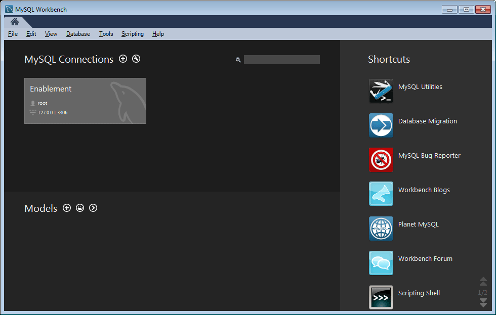

# 用于启用功能的MySQL配置 {#mysql-configuration-for-enablement-features}

MySQL是一个关系数据库，主要用于启用资源的SCORM跟踪和报告数据。 其中包含其他功能（如跟踪视频暂停/恢复）的表。

这些说明描述了如何连接到MySQL服务器、建立启用数据库以及使用初始数据填充数据库。

## 要求 {#requirements}

在配置MySQL for Communities的启用功能之前，请确保

* 安装 [MySQL服务器](https://dev.mysql.com/downloads/mysql/) Community Server版本5.6：
   * SCORM不支持版本5.7。
   * 可以与创作AEM实例相同的服务器。
* 在所有AEM实例上，安装官方的 [适用于MySQL的JDBC驱动程序](deploy-communities.md#jdbc-driver-for-mysql).
* 安装 [MySQL工作台](https://dev.mysql.com/downloads/tools/workbench/).
* 在所有AEM实例上，安装 [SCORM包](enablement.md#scorm).

## 安装MySQL {#installing-mysql}

应按照目标操作系统的说明下载和安装MySQL。

### 小写表名称 {#lower-case-table-names}

由于SQL不区分大小写，因此对于区分大小写的操作系统，必须包含设置为所有表名都使用小写。

例如，要在Linux操作系统上指定所有小写表名，请执行以下操作：

* 编辑文件 `/etc/my.cnf`
* 在 `[mysqld]` 部分，添加以下行： `lower_case_table_names = 1`

### UTF8字符集 {#utf-character-set}

要提供更好的多语言支持，必须使用UTF8字符集。

将MySQL更改为将UTF8作为其字符集：
* mysql >设置名称&#39;utf8&#39;；

将MySQL数据库更改为默认的UTF8：
* 编辑文件 `/etc/my.cnf`
* 在 `[client]` 部分，添加： `default-character-set=utf8`
* 在 `[mysqld]` 部分，添加： `character-set-server=utf8`

## 安装MySQL Workbench {#installing-mysql-workbench}

MySQL Workbench提供了一个用于执行安装架构和初始数据的SQL脚本的UI。

应按照针对目标操作系统的说明下载和安装MySQL Workbench。

## 启用连接 {#enablement-connection}

首次启动MySQL Workbench时，除非已将其用于其他目的，否则它尚未显示任何连接：

### 新连接设置 {#new-connection-settings}

1. 选择右侧的“+”图标 `MySQL Connections`.
1. 在对话框中 `Setup New Connection`，输入适用于您的平台的值以进行演示，并将创作AEM实例和MySQL放在同一服务器上：
   * 连接名称： `Enablement`
   * 连接方法： `Standard (TCP/IP)`
   * 主机名： `127.0.0.1`
   * 用户名: `root`
   * 密码: `no password by default`
   * 默认架构： `leave blank`
1. 选择 `Test Connection` 验证与正在运行的MySQL服务的连接。

**注释**:
* 默认端口为 `3306`.
* 此 `Connection Name` 已选择作为 `datasource` 中的名称 [JDBC OSGi配置](#configure-jdbc-connections).

#### 连接成功 {#successful-connection}

#### 新建启用连接 {#new-enablement-connection}

## 数据库设置 {#database-setup}

打开新的启用连接时，请注意存在测试架构和默认用户帐户。

### 获取SQL脚本 {#obtain-sql-scripts}

使用CRXDE Lite获取创作实例上的SQL脚本。 此 [SCORM包](deploy-communities.md#scorm) 必须安装：

1. 浏览到CRXDE Lite：
   * 例如， [http://localhost:4502/crx/de](http://localhost:4502/crx/de)
1. 展开 `/libs/social/config/scorm/` 文件夹
1. 下载 `database_scormengine.sql`
1. 下载 `database_scorm_integration.sql`

下载架构的一种方法是：

* 选择 `jcr:content` sql文件的节点。
* 请注意的值 `jcr:data` 属性是一个视图链接。
* 选择查看链接以将数据保存到本地文件。

### 创建SCORM数据库 {#create-scorm-database}

要创建的启用SCORM数据库是：

* name: `ScormEngineDB`
* 从脚本创建：
   * 架构: `database_scormengine.sql`
   * 数据： `database_scorm_integration.sql`
请按照以下步骤操作(
[open](#step-open-sql-file)， [执行](#step-execute-sql-script))以安装每个 [SQL脚本](#obtain-sql-scripts) . [刷新](#refresh) 查看脚本执行结果时。

在安装数据之前，请务必安装架构。

>[!CAUTION]
>
>如果更改了数据库名称，请确保在以下位置正确指定该名称：
>
>* [JDBC配置](#configure-jdbc-connections)
>* [SCORM配置](#configure-scorm)

#### 步骤1：打开SQL文件 {#step-open-sql-file}

在MySQL工作台中

* 从“文件”下拉菜单中
* 选择 `Open SQL Script ...`
* 按照此顺序，选择以下选项之一：
   1. `database_scormengine.sql`
   1. `database_scorm_integration.sql`

#### 步骤2：执行SQL脚本 {#step-execute-sql-script}

在Workbench窗口中，为在Step 1中打开的文件选择 `lightening (flash) icon` 执行脚本。

请注意，执行 `database_scormengine.sql` 创建SCORM数据库的脚本可能需要几分钟才能完成。

#### 刷新 {#refresh}

执行脚本后，必须刷新 `SCHEMAS` 部分 `Navigator` 以便查看新数据库。 使用“架构”右侧的刷新图标：

#### 结果：scormenginedb {#result-scormenginedb}

安装和刷新架构后， `scormenginedb` 将可见。

## 配置JDBC连接 {#configure-jdbc-connections}

的OSGi配置 **Day Commons JDBC连接池** 配置MySQL JDBC驱动程序。

所有发布和创作AEM实例都应指向同一个MySQL服务器。

当MySQL在与AEM不同的服务器上运行时，必须指定服务器主机名来代替JDBC连接器中的“localhost”(该连接器会填充 [ScormEngine](#configurescormengineservice) config)。

* 在每个创作和发布AEM实例上
* 以管理员权限登录
* 访问 [Web控制台](../../help/sites-deploying/configuring-osgi.md)
   * 例如， [http://localhost:4502/system/console/configMgr](http://localhost:4502/system/console/configMgr)
* 找到 `Day Commons JDBC Connections Pool`
* 选择 `+` 图标以创建新配置

   

* 输入以下值：
   * **[!UICONTROL JDBC驱动程序类]**： `com.mysql.jdbc.Driver`
   * **DBC连接URIJ**： `jdbc:mysql://localhost:3306/aem63reporting` 如果MySQL服务器与“此”AEM服务器不同，请指定服务器来代替localhost。
   * **[!UICONTROL 用户名]**：如果不是“root”，则为超级用户或输入为MySQL服务器配置的用户名。
   * **[!UICONTROL 密码]**：如果没有为MySQL设置密码，则清除此字段，否则为MySQL用户名输入配置的密码。
   * **[!UICONTROL 数据源名称]**：为输入的名称 [MySQL连接](#new-connection-settings)例如，“enablement”。
* 选择&#x200B;**[!UICONTROL 保存]**。

## 配置Scorm {#configure-scorm}

### AEM Communities ScormEngine服务 {#aem-communities-scormengine-service}

的OSGi配置 **AEM Communities ScormEngine服务** 配置SCORM以便支持社区使用MySQL服务器。

此配置存在于 [SCORM包](deploy-communities.md#scorm-package) 已安装。

所有发布实例和创作实例都指向同一个MySQL服务器。

当MySQL在与AEM不同的服务器上运行时，必须指定服务器主机名来代替ScormEngine服务中的“localhost”，后者通常通过 [JDBC连接](#configure-jdbc-connections) config.

* 在每个创作和发布AEM实例上
* 以管理员权限登录
* 访问 [Web控制台](../../help/sites-deploying/configuring-osgi.md)
   * 例如， [http://localhost:4502/system/console/configMgr](http://localhost:4502/system/console/configMgr)
* 找到 `AEM Communities ScormEngine Service`
* 选择编辑图标

   

* 验证以下参数值是否与 [JDBC连接](#configurejdbcconnectionspool) 配置：
   * **[!UICONTROL JDBC连接URI]**： `jdbc:mysql://localhost:3306/ScormEngineDB` *ScormEngineDB* 是SQL脚本中的缺省数据库名称
   * **[!UICONTROL 用户名]**：如果不是“root”，则为超级用户或输入为MySQL服务器配置的用户名
   * **[!UICONTROL 密码]**：如果没有为MySQL设置密码，则清除此字段，否则为MySQL用户名输入配置的密码
* 关于以下参数：
   * **[!UICONTROL Scorm用户密码]**：不编辑

      仅供内部使用：它供AEM Communities使用的特殊服务用户与scorm引擎通信。
* 选择 **[!UICONTROL 保存]**

### AdobeGranite CSRF筛选器 {#adobe-granite-csrf-filter}

要确保支持课程在所有浏览器中正常工作，需要将Mozilla添加为CSRF过滤器未检查的用户代理。

* 以管理员权限登录AEM发布实例。
* 访问 [Web控制台](../../help/sites-deploying/configuring-osgi.md)
   * 例如， [http://localhost:4503/system/console/configMgr](http://localhost:4503/system/console/configMgr)
* 查找 `Adobe Granite CSRF Filter`.
* 选择编辑图标。

   

* 选择 `[+]` 图标以添加安全用户代理。
* 输入 `Mozilla/*`.
* 选择&#x200B;**[!UICONTROL 保存]**。
