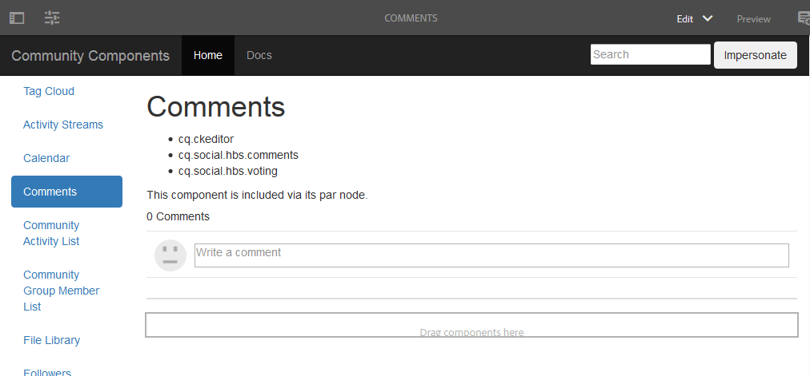

# “创建评论”页 {#create-comments-page}

**[⇐覆盖评论组件](overlay-comments.md) [创建节点⇒](overlay-create-nodes.md)**

## “评论”页面 {#comments-page}

通过[社区组件指南](components-guide.md)，您可以轻松体验覆盖评论组件的体验。

在创作实例上查看页面：

* [http://localhost:4502/editor.html/content/community-components/en/comments.html](http://localhost:4502/editor.html/content/community-components/en/comments.html)

**[⇐覆盖评论组件](overlay-comments.md) [创建节点⇒](overlay-create-nodes.md)**
