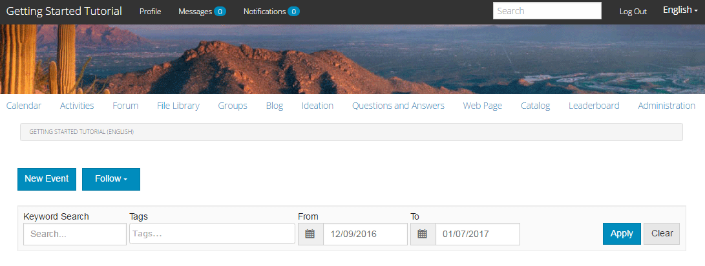
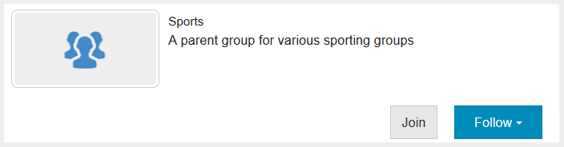
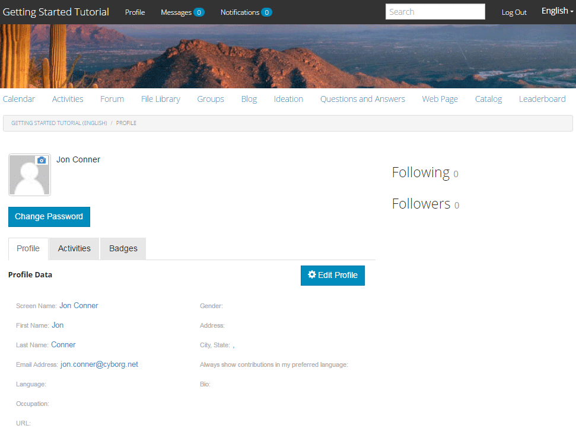

# 体验已发布的站点 {#experience-the-published-site}

## 在Publish上浏览到新站点 {#browse-to-new-site-on-publish}

现在，新创建的社区站点已发布，请浏览到创建站点时显示的URL，但在发布服务器上，例如：

* 作者URL = https://localhost:4502/content/sites/engage/en.html
* PUBLISH URL = https://localhost:4503/content/sites/engage/en.html

为了最大程度地减少有关哪个成员已登录创作和发布的混淆，建议为每个实例使用不同的浏览器。

首次访问已发布的网站时，该网站访客通常不会已经登录，并且将是匿名的。

`https://localhost:4503/content/sites/engage/en.html {#http-localhost-content-sites-engage-en-html}`

## 匿名网站访客 {#anonymous-site-visitor}

匿名网站访客在UI中看到以下内容：

* 站点标题（快速入门教程）
* 无配置文件链接
* 无消息链接
* 无通知链接
* 搜索字段
* 登录链接
* 品牌横幅
* 引用站点模板中包含的组件的菜单链接。

如果选择各种链接，您会发现它们处于只读模式。

### 阻止对JCR的匿名访问 {#prevent-anonymous-access-on-jcr}

已知限制可通过jcr内容和json向匿名访客公开社区网站内容，但已针对网站内容禁用&#x200B;**允许匿名访问**。 但是，可以使用Sling限制作为解决方法来控制此行为。

要保护您社区站点的内容不被匿名用户通过jcr内容和json访问，请执行以下步骤：

1. 在AEM创作实例上，转到https:// hostname：port/editor.html/content/site/sitename.html。

   >[!NOTE]
   >
   >不要转到本地化的网站。

1. 转到&#x200B;**页面属性**。

   

1. 转到&#x200B;**高级**&#x200B;选项卡。

1. 启用&#x200B;**身份验证要求**。

   

1. 添加登录页面的路径。 例如，**/content/......./GetStarted**。
1. Publish页面。

## 受信任的社区成员 {#trusted-community-member}

此体验假设[Aaron McDonald](/help/communities/tutorials.md#demo-users)被分配了[社区管理者和审查方](/help/communities/create-site.md#roles)的角色。 如果没有，请返回创作环境以[修改站点设置](/help/communities/sites-console.md#modifying-site-properties)，并选择Aaron McDonald作为社区管理者和审查方。

选择右上角的`Log in`，并使用用户名(aaron.mcdonald@mailinator.com)和密码(password)签名。 请注意能够使用Twitter或Facebook凭据登录。

以注册的社区成员身份登录后，请注意以下菜单项，以单击并浏览您的社区站点：

* **配置文件**&#x200B;选项允许您查看和编辑配置文件。
* [消息](/help/communities/configure-messaging.md)选项会将您定向到直接消息传送部分，您可以在其中执行以下操作：

   1. 查看您已收到（收件箱）、已发送（已发送项目）和已删除（垃圾桶）的私信。
   1. 撰写新的私信，以便发送给个人和群组。

* [通知](/help/communities/notifications.md)选项会将您转到通知部分，您可以在其中查看感兴趣的事件并编辑通知设置。
* 如果您具有审核权限，[管理](/help/communities/published-site.md#moderationlink)会将您定向到AEM Communities审核页面。

请注意，“日历”页面是主页，因为所选的参考站点模板首先包含日历功能，其次是活动流功能、论坛功能等。 此结构在[站点模板](/help/communities/sites.md#edit-site-template)控制台中可见，或在创作环境中修改站点属性时可见：

>[!NOTE]
>
>有关Communities组件和功能的更多信息，请访问：
>
>* [社区组件](/help/communities/author-communities.md)（针对作者）
>* [组件、函数和功能要点](/help/communities/essentials.md) （适用于开发人员）

### 论坛链接 {#forum-link}

通过选择论坛链接查看基本论坛功能。

成员可以发布新主题或关注主题。

网站访客能够查看帖子，并以各种方式对其进行排序。

### 组链接 {#groups-link}

由于Aaron是组管理员，因此选择“组”链接可让Aaron通过选择组模板、图像（无论组是打开的还是机密的）以及邀请成员来创建社区组。

这是在发布环境中创建组的示例。

还可以在创作环境中创建组，并在创作环境（[社区组控制台](/help/communities/groups.md)）的社区站点中进行管理。 本教程接下来介绍[在作者](/help/communities/nested-groups.md)上创建组的体验。

创建引用组：

1. 选择&#x200B;**新组**
1. **设置选项卡**

   * 组名称： `Sports`
   * 描述： `A parent group for various sporting groups`。
   * 组URL名称： `sports`
   * 选择`Open Group` （允许任何社区成员通过加入进行参与）

1. **模板选项卡**

   * 选择`Reference Group` （其结构中包含组函数以允许嵌套组）

1. 选择&#x200B;**创建群组**

   

创建新组后，**选择新的体育组**&#x200B;以在其内创建两个组（嵌套）。 由于站点结构不能以“组”功能开头，因此打开“体育”组后，需要选择“组”链接：

以`Blog`开头的第二组链接属于当前选定的组`Sports`组。 通过选择Sports的`Groups`链接，可以在Sports组中嵌套两个组。

例如，添加两个`new groups`。

* 一个名为`Baseball`

   * 将其保留设置为`Open Group`（必需成员资格）。
   * 在“模板”选项卡上，选择`Conversational Group`。

* 一个名为`Gymnastics`

   * 将其设置更改为`Member Only Group`（受限成员资格）。
   * 在“模板”选项卡上，选择`Conversational Group`。

**通知**：

* 在显示这两个组之前，可能需要刷新页面。
* 此模板&#x200B;*不*&#x200B;包含组函数，因此无法进一步嵌套组。
* 在作者上，[组控制台](/help/communities/groups.md)提供了第三个选择 — `Public Group`（可选成员资格）。

创建这两个组后，选择棒球组，即打开组，并注意其链接：

`Discussions` `What's New` `Members`

组的链接显示在主站点的链接下方，导致显示以下内容：

在作者上 — 具有管理权限，导航到[社区组控制台](/help/communities/members.md)并将Weston McCall添加到`Community Engage Gymnastics <uid> Members`组。

继续发布，以Aaron McDonald的身份注销，并以匿名网站访客身份查看体育团体中的团体：

* 从主页
* 选择`Groups`链接
* 选择`Sports`链接
* 选择“体育”`Groups`链接

仅棒球组可见。

以Weston McCall (weston.mccall@dodgit.com /密码)登录，并导航到同一位置。 请注意，Weston能够`Join`打开的`Baseball`组和`enter or Leave`私有`Gymnastics`组。

### 网页链接 {#web-page-link}

通过选择网页链接查看站点中包含的基本网页。 标准AEM创作工具可用于在创作环境中将内容添加到此页面。

例如，转到&#x200B;**作者**&#x200B;实例，在[社区站点控制台](/help/communities/sites-console.md)中打开`engage`文件夹，选择&#x200B;**打开站点**&#x200B;图标以进入作者编辑模式。 然后选择预览模式以便选择`Web Page`链接，然后选择编辑模式以添加标题和文本组件。 最后，仅重新发布页面或整个网站。

### 审核链接 {#moderationlink}

当社区成员具有审核权限时，审核链接可见。 选择链接将显示发布的社区内容，并允许该内容以类似于创作环境中的[审核控制台](/help/communities/moderation.md)的方式进行[审核](/help/communities/moderate-ugc.md)。

使用浏览器的“返回”按钮返回到已发布的站点。 大多数控制台无法从发布环境中的全局导航访问。

## 自助注册 {#self-registration}

注销后，可以创建用户注册。

* 选择`Log In`
* 选择`Sign up for a new account`

默认情况下，电子邮件地址是登录ID。 如果未选中，访客可以输入自己的登录ID（用户名）。 用户名在发布环境中必须是唯一的。

指定用户名、电子邮件和密码后，选择`Sign Up`将创建用户并启用他们进行签名。

登录后，显示的第一个页面是他们的`Profile`页面，他们可以对其进行个性化。

如果成员忘记了登录ID，则恢复操作可能会使用其电子邮件地址。

