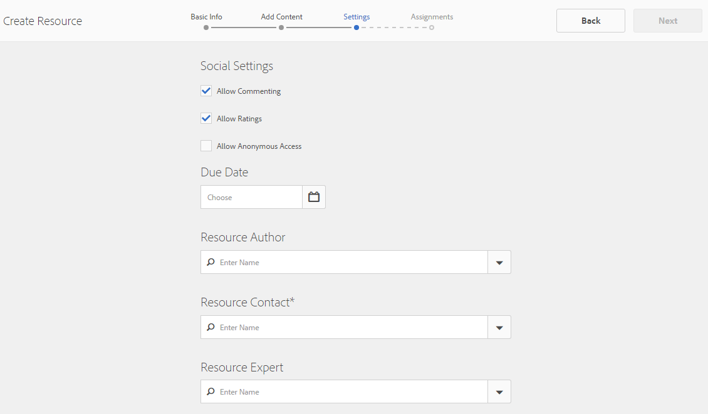

# 启用资源控制台 {#enablement-resources-console}

对于AEM Communities，“资源”控制台是 [启用管理器](users.md) 创建、管理资源并将其分配给支持社区站点的成员。

## 要求 {#requirements}

在为社区站点添加启用资源之前，必须正确配置AEM实例，包括：

* SCORM
* FFmpeg

有关详细信息，请参阅 [配置启用](enablement.md).

>[!CAUTION]
>
>如果在创建社区站点后安装了SCORM，则必须重新创建在安装SCORM之前存在的任何启用资源。

>[!NOTE]
>
>随着的发布 [AEM 6.3](deploy-communities.md#latestfeaturepack) 以及等效的Communities功能包 [AEM 6.2 FP3](deploy-communities.md#latestfeaturepack) 和 [AEM 6.1 FP7](https://docs.adobe.com/content/docs/en/aem/6-1/deploy/communities.html#Latest功能包)，该启用功能不再需要使用 [MySQL数据库](mysql.md).

## 术语 {#terminology}

### 资源 {#resource}

资源对于 [启用社区](overview.md#enablement-community). 这些是分配给成员的材料，使他们能够提高技能。

资源的特性：

* 可能属于以下类型：
   * 图像(JPG、PNG、GIF、BMP)
   * 视频(MP4)
   * Flash(SWF)
   * 文档(PDF)
   * 测试(SCORM)
* 可能从一个或多个学习路径引用。

### 学习路径 {#learning-path}

学习路径是分组在一起的支持资源的逻辑集，便于分配给成员。

### 成员组 {#members-group}

创建社区站点时，为该URL指定的站点名称会用于创建 [站点特定的用户组](users.md) 为各种角色配置了各种权限。 所有这些自动创建的组都带有前缀 `Community <site-name>`.

此类用户组之一是 `Community <site-name> Members` 组，用于将发布环境中的注册用户标识为社区成员。 请参阅教程 [AEM Communities启用入门](getting-started-enablement.md) 举个例子。

对象 [参与社区](overview.md#egagementcommunity)，合理地允许网站访客自行注册或使用社交登录，此时他们会自动添加到成员组中。

对象 [启用社区](overview.md#enablement-community)，建议将站点设为专用站点，这样便需要管理员将用户添加到成员组。

## 访问社区站点的支持资源 {#accessing-a-community-site-s-enablement-resources}

### 导航到社区资源 {#navigate-to-communities-resources}

在创作环境中，访问“资源”控制台

* 从全局导航： **[!UICONTROL 导航]** > **[!UICONTROL Communities]** > **[!UICONTROL 资源]**

   

### 选择社区站点 {#select-a-community-site}

社区资源控制台将显示所有社区站点。

在从“资源”控制台中选择特定社区站点后，将为该站点创建启用资源。

一旦选择了特定的社区站点，任何现有的启用资源和学习路径都可供管理和修改，并且可以创建新的启用资源和学习路径。

#### 搜索 {#search-features}

选择侧面板切换图标以搜索启用资源或学习路径。 选中后，控制台左侧会打开一个搜索面板，并提供一个文本框，可在其中输入搜索词。

#### 选择模式 {#selection-mode}

要选择多个启用资源，请将鼠标悬停在信息卡上并选择复选标记图标，以选择第一个启用资源。 选中后，选择任何其他卡片都会将其添加到选择组中。 再次选择将取消选择卡。

## 创建资源 {#create-a-resource}

向社区站点添加新启用资源

* 选择 `Create` 图标。
* 从显示的子菜单中，选择 **[!UICONTROL 资源]**.

这将启动以下分步流程：

* 描述资源（名称、卡片图像和文本）。
* 选择资源内容。
* 选择资源的封面图像。
* 标识资源联系人。
* 将资源分配给成员。

当资源是课程或学习路径的一部分时，应仅将成员分配给学习路径。 可以在创建启用资源后添加分配。

### 1个基本信息 {#basic-info}

* **[!UICONTROL 添加]**

   (*可选*)成员分配页面和“资源”控制台中启用资源的信息卡上显示的图像。 从服务器的本地文件系统中选择映像。 如果未提供图像，将为上传的资源生成缩略图。

   ***注释***：推荐的图像大小不仅仅是480 x 480像素。 由于卡片的响应式设计适用于各种浏览器尺寸，因此显示大小将从220 X 165像素到400 x 165像素不等。

* **[!UICONTROL 网站名称]**

   (*只读*)将资源添加到其中的社区站点。

* **[!UICONTROL 资源名称]**

   (*必需*)资源的显示名称。 从显示名称创建有效的节点名称。

* **[!UICONTROL 标记]**

   (*可选*&#x200B;可以选择一个或多个标记，这些标记将启用资源与一个或多个目录相关联。 参见 [标记启用资源](tag-resources.md).

* **[!UICONTROL 在目录中显示]**

   取消选中时，启用资源不会出现在任何目录中。 如果选中，则启用资源将显示在所有目录中，除非 [预过滤](catalog-developer-essentials.md#pre-filters) 或UI中的成员筛选器。 默认值为未选中。

* **[!UICONTROL 描述]**

   (*可选*)为启用资源显示的描述。

* **[!UICONTROL 较小的资产]**

   (*可选*)从AEM Assets中选择。 在发布环境（如目录）中表示资源的缩略图图像。

* **[!UICONTROL 较大的资产]**

   (*可选*)从AEM Assets中选择。 在发布环境中表示资源的大型图像，例如在资源的主页上。

* **[!UICONTROL 内容片段资产]**

   (*可选*)从AEM Assets中选择。 可在发布环境中引用，但默认情况下未使用的内容片段。

* 选择 **[!UICONTROL 下一个]**

### 2添加内容 {#add-content}

虽然看起来好像可以选择多个启用资源，但只允许一个资源。

选择 `'+' icon`，开始通过标识源来选择资源的过程。

* **[!UICONTROL 从我的本地文件上传]**

   从本地文件系统上传将使用本地文件浏览器选择和上传文件。 支持的文件类型包括SCORM.zip(HTML5或SWF)、MP4视频、SWF、PDF和图像类型(JPG、PNG、GIF、BMP)。 文件名将成为添加到资源库的资源的名称。

* **[!UICONTROL 浏览资产库]**

   从Assets Library中选择。 选择仅限于在社区站点中可见的那些内容。

* **[!UICONTROL 添加外部 URL]**

   输入学习内容的链接。

   在打开的对话框中，输入：

   * **[!UICONTROL 标题]**

      启用资源的资源的资源名称。

   * **[!UICONTROL URL]**

      资源的URL。

* **[!UICONTROL 添加 Adobe Connect URL]**

   输入指向Adobe Connect会话的链接。

   在打开的对话框中，输入：

   * **[!UICONTROL 标题]**

      启用资源的资源的资源名称。

   * **[!UICONTROL URL]**

      Adobe Connect会话的URL。

* **[!UICONTROL 定义外部资源]**

   输入显示材料的位置。 成功状态和得分的值是手动输入的(请参阅 [报告](reports.md))。 上传的封面图像可用于提供其他信息。

   在打开的对话框中，输入：

   * **[!UICONTROL 标题]**

      启用资源的资源的资源名称。

   * **[!UICONTROL 位置]**

      物理站点（如教室）的位置。

#### 添加的视频资源示例 {#example-of-an-added-video-resource}

* **[!UICONTROL 资源封面图像]**

   封面图像是第一次查看启用资源时要显示的图像。 例如，当视频资源尚未播放时，会显示封面图像。 如果未上传自定义图像，则会显示默认图像。 对于视频资源，可以 [生成缩略图](enablement.md#ffmpeg)，但仅限于上传时，而不适用于将视频引用为URL时。 对于位置资源，图像可用于提供其他信息。

   推荐的封面图像大小为640 x 360像素。

* 选择&#x200B;**[!UICONTROL 下一步]**。

### 3个设置 {#settings}

>[!NOTE]
>
>不应将学习者直接注册到要从学习路径引用的支持资源中。 学习者只需注册学习路径。
>
>如果成员同时注册了资源和引用该资源的学习路径，则其分配将同时显示单个资源和学习路径中的资源。

* **[!UICONTROL 社交设置]**

   这些设置控制学习者是否能够提供有关启用资源的输入。 此 [审核设置](sites-console.md#moderation) 是父社区站点的站点。

   * **[!UICONTROL 允许评论]**

      如果选中，则允许成员对资源进行评论。 默认值为已选中。

   * **[!UICONTROL 允许评级]**

      如果选中，则允许成员对资源进行评分。 默认值为已选中。

   * **[!UICONTROL 允许匿名访问]**

      如果选中，则当社区站点还允许匿名访问时，允许匿名站点访客查看目录中的资源。 默认值为未选中。

* **[!UICONTROL 到期日期]**

   *（可选）* 可选取应完成分配的日期。

* **[!UICONTROL 资源作者]**

   *（可选）* 启用资源的作者。 使用下拉菜单从成员用户中进行选择 [成员组](#members-group).

* **[!UICONTROL 资源联系人(&amp;A)；]**

   *（必需）* 成员可以联系的有关启用资源的人员。 使用下拉菜单从成员用户中进行选择 [成员组](#members-group).

* **[!UICONTROL 资源专家]**

   *（可选）* 成员可以联系的对启用资源具有专业知识的人员。 使用下拉菜单从属于以下成员的用户中进行选择 [成员组](#members-group).

### 4个任务 {#assignments}

* **[!UICONTROL 添加被分派人]**

   使用下拉菜单从中选择 [成员](#members-group)  — 将作为学习者注册的用户和用户组（以粗体字列出）。 当成员登录社区网站时，他们注册的启用资源（和学习路径）将显示在其中 [指定任务](functions.md#assignments-function) 页面。

* 选择&#x200B;**[!UICONTROL 创建]**。

   

成功创建启用资源后，将返回到资源控制台，并选中新创建的资源。 在此控制台中，可以 [管理资源](#managing-a-resource).

## 创建学习路径 {#create-a-learning-path}

向社区站点添加新学习路径

* 选择 `Create` 图标
* 从显示的子菜单中，选择 **[!UICONTROL 学习路径]**.

这将启动以下分步流程：

* 确定学习路径。
* 提供卡片图像以表示学习者的学习路径。
* 引用要包含在学习路径中的启用资源。
* （可选）对资源排序。
* （可选）确定必备的学习路径。
* 确定学习路径联系人。
* 正在注册成员。

对于学习路径中包含的启用资源，分配应仅针对学习路径，而不针对单个资源。

### 基本信息 {#basic-info-1}

* **[!UICONTROL 添加]**

   (*可选*)成员分配页面和“资源”控制台中学习路径的卡片上显示的图像。 从服务器的本地文件系统中选择映像。 如果未提供图像，将为上传的资源生成缩略图。

   ***注释***：推荐的图像大小不再只是480 x 480像素。 由于卡片的响应式设计适用于各种浏览器尺寸，因此显示大小将从220 X 165像素到400 x 165像素不等。

* **[!UICONTROL 网站名称]**

   (*只读*)将资源添加到其中的社区站点。

* **[!UICONTROL 学习路径名称]**

   (*必需*)学习路径的显示名称。 从显示名称创建有效的节点名称。

* **[!UICONTROL 标记]**

   (*可选*)可以选择一个或多个将学习路径与一个或多个目录关联的标记。 参见 [标记启用资源](tag-resources.md).

* **[!UICONTROL 在目录中显示]**

   取消选中时，学习路径不会出现在任何目录中。 如果选中，学习路径将显示在所有目录中，除非 [预过滤](catalog-developer-essentials.md#pre-filters) 或UI中的成员筛选器。 在目录中显示学习路径将间接授予其所有包含资源的读取权限。 默认值为未选中。

* **[!UICONTROL 描述]**

   (*可选*)为启用资源显示的描述。

* **[!UICONTROL 较小的资产]**

   (*可选*)从AEM Assets中选择。 在发布环境（如目录）中表示资源的缩略图图像。

* **[!UICONTROL 较大的资产]**

   (*可选*)从AEM Assets中选择。 在发布环境中表示资源的大型图像，例如在资源的主页上。

* **[!UICONTROL 内容片段资产]**

   (*可选*)从AEM Assets中选择。 可在发布环境中引用，但默认情况下未使用的内容片段。

* 选择&#x200B;**[!UICONTROL 下一步]**。

### 添加必备项 {#add-prerequisites}

* **[!UICONTROL 必要的学习路径]**

   (*可选*)选择其他已发布的学习路径时，必须先完成这些路径，学习者才能选择此学习路径。

* 选择&#x200B;**[!UICONTROL 下一步]**。

### 添加资源 {#add-resources}

* **[!UICONTROL 强制执行学习路径中的排序]**

   (*可选*)如果设置为On，则添加启用资源的顺序是要求学习者完成学习路径的顺序。 默认值为关闭。

* **[!UICONTROL 资源]**

   从以下资源中选择的一个或多个资源 *已发布* 为当前社区站点创建的启用资源。

>[!NOTE]
>
>您只能选择与学习路径处于同一级别的可用资源。 例如，对于在组中创建的学习路径，只有组级别的资源可用；对于在社区站点中创建的学习路径，该站点中的资源可用于添加到该学习路径中。

* 选择&#x200B;**[!UICONTROL 下一步]**。

### 设置 {#settings-1}

* **[!UICONTROL 添加注册]**

   使用下拉菜单从社区站点的成员和成员组（以粗体字列出）中进行选择 [成员组](#members-group). 首次创建学习路径时，无需添加分配。 学习路径属性可修改，以便稍后添加学习者。

* **[!UICONTROL 学习路径联系人&amp;ast；]**

   *（必需）* 成员可以联系的有关学习路径的人员。 使用下拉菜单从社区站点的成员用户中进行选择 [成员组](#members-group).

* 选择 **[!UICONTROL 创建]**

>[!NOTE]
>
>从学习路径引用的启用资源不应列出相同的被分配人（学习者）（如果有）。
>
>如果成员同时注册了启用资源和引用该资源的学习路径，则其分配将同时显示单个资源和学习路径中的资源。

## 管理资源 {#managing-a-resource}

要管理单个启用资源，请执行以下操作：

* 从 **[!UICONTROL 资源]** 控制台中，选择包含资源的社区站点。
* 选择资源。

对于选定的启用资源，可以：

* 查看属性（默认）
* 编辑属性
* 删除
* 发布
* 取消发布

要上传新版本的启用资源，建议创建一个新资源，然后从旧版本中取消注册成员并在新版本中注册这些成员。

### 编辑资源 {#edit-resource}

通过选择铅笔图标，显示的用于创建启用资源的步骤变得可用，以便可以修改提供的任何信息。

如果唯一的更改是修改“设置”步骤中的分配，则保存更改将导致发布修改。 如果进行了任何其他更改，则必须在保存后显式发布资源。

### 删除资源 {#delete-resource}

通过选择垃圾桶图标，启用资源将为 `Deleted` 确认之后。

### 发布 {#publish}

必须先发布分配的启用资源，然后学习者才能查看该资源：

* 选择world图标以 `Publish`.
* 在弹出的对话框中，选择 **[!UICONTROL Publish]** 再来一次。
* 选择 **[!UICONTROL 关闭]**.

尽管对话声明该操作已排入队列，但通常会立即发布。

### 取消发布 {#unpublish}

要暂时使发布环境中的成员无法访问启用资源而不删除它，请使用世界图标 `Unpublish` 资源。

### 报告 {#report}

通过报表图标，可访问当学习者与发布环境中其分配的启用资源交互时生成的报表。 该报告因资源类型而异。

对于所有学习路径，均可查看基于资源或学习者的报告( `User Report`.)

此报表专门针对当前启用资源或学习路径。 提供的报告深度取决于是否 [Adobe Analytics](analytics.md) 已获得许可并为社区站点启用。 此 [时间线](#timeline)， [查看器参与度](#viewer-engagement)、和 [按设备列出的参与](#engagement-by-device) Adobe Analytics报表是根据 [轮询间隔](analytics.md#report-importer).

对于所有启用资源，无论是否启用了Adobe Analytics，都会有相关报表 [被分派人状态](#assignee-status) 和 [评级](#ratings) 以及 [报告摘要](#report-summary) 表格。

#### 时间线 {#timeline}

“Analytics时间线”报表显示此启用资源随时间发生事件的时间：

* **视图**

   查看是指学习者访问资源详细信息页面时。

* **播放**

   播放是指学习者与资源进行交互时，例如播放视频或打开PDF。

* **评级**

   评分是指学习者为资源分配星级评分。

* **评论**

   注释是指学习者添加注释时。

垂直轴是事件数。

水平轴是日历时间。

[需要Adobe Analytics](sites-console.md#analytics).

#### 查看器参与度 {#viewer-engagement}

对于视频资源，Analytics Viewer Engagement报表会显示查看了资源的学习者数量，如果未播放到最后，还会显示学习者何时停止播放资源。

垂直轴是查看过此资源的学习者数量。

水平轴是此资源的持续时间。

[Marketing Cloud组织ID为必填项](sites-console.md#enablement).

#### 按设备划分的参与 {#engagement-by-device}

适用于视频资源的Analytics Engagement by Device报表描述了从桌面和移动设备播放的查看次数的百分比。

[Marketing Cloud组织ID为必填项](sites-console.md#enablement).

#### 被分派人状态 {#assignee-status}

“被分派人状态”报表根据学习者数量描述了有多少人

* **未开始**
* **进行中**
* **已完成**

#### 评级 {#ratings}

评级报表基于对支持资源进行评分的学习者数量，显示每个星级评分的数量，然后汇总评级总数和平均评分。

#### 报告摘要 {#report-summary}

对于启用资源，“报告概要”是一个表列表。

* 与资源交互的每个学习者
   * 他们的状态
   * 是否为他们分配了资源
      * 而不是在目录中查找资源
      * 发表的评论数
      * 给出的评级（如果有）

对于学习路径资源报告，报告摘要是一个表格列表

* 学习路径中包含的每个资源
   * 发布状态
   * 查看次数
   * 播放次数
   * 平均评分
   * 格式
   * 大小
   * 社区站点名称

对于学习路径用户报告，报告摘要是一个表格列表。

* 每个已分配到学习路径的学习者：
   * 已完成的资源数。
   * 他们的状态。

可以通过以下方式选择列来调整表的显示 `Show / hide columns` 选择器。

#### 以CSV格式下载报表 {#download-report-as-csv}

可以使用控制台顶部的按钮下载“报表摘要”表格（CSV格式）。

* 对于启用资源： `Download Resource Report as CSV` 按钮。
* 对于学习路径： `Download Learning Path Report as CSV` 按钮。

下载完整的“报告摘要”，而不考虑选择显示的列。
