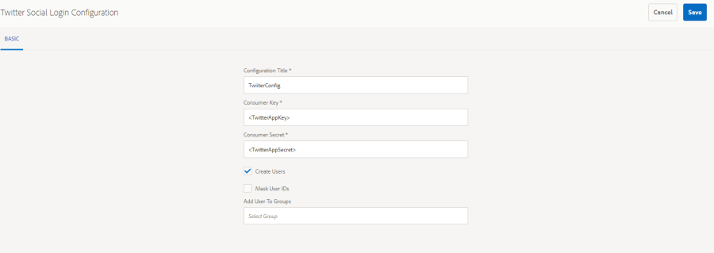

# 使用Facebook和Twitter进行社交登录 {#social-login-with-facebook-and-twitter}

社交登录是向网站访客展示使用其Facebook或Twitter帐户登录的选项。 因此，将允许的Facebook或Twitter数据包含在其AEM成员配置文件中。

## 社交登录概述 {#social-login-overview}

若要包含社交登录，则&#x200B;*需要*&#x200B;才能创建自定义Facebook和Twitter应用程序。

虽然We-Retail示例提供了示例Facebook和Twitter应用程序及云服务，但在[生产网站](../../help/sites-administering/production-ready.md)上不可用。

所需步骤为：

1. 在所有AEM发布实例上[启用OAuth身份验证](#adobe-granite-oauth-authentication-handler)。

   如果未启用OAuth，则登录尝试会失败。

1. **创建**&#x200B;社交应用程序和云服务。

   * 要支持使用Facebook登录，请执行以下操作：

      * 创建[Facebook应用](#create-a-facebook-app)。
      * 创建并发布[Facebook Connect云服务](#create-a-facebook-connect-cloud-service)。

   * 要支持使用Twitter登录，请执行以下操作：

      * 创建[Twitter应用](#create-a-twitter-app)。
      * 创建并发布[TwitterConnect云服务](#create-a-twitter-connect-cloud-service)。

1. 为社区站点&#x200B;[**启用**&#x200B;社交登录](#enable-social-login)。

有两个基本概念：

1. **作用域** （权限）指定允许应用程序请求的数据。

   * 默认情况下，Facebook和Twitter[AdobeGranite OAuth应用程序和提供程序](#adobe-granite-oauth-application-and-provider)实例在其作用域中包含基本应用程序权限。

1. **字段** （参数）指定使用URL参数请求的实际数据。

   * 这些字段在[AEM Communities Facebook OAuth提供程序](#aem-communities-facebook-oauth-provider)和[AEM CommunitiesTwitterOAuth提供程序](#aem-communities-twitter-oauth-provider)中指定。
   * 对于大多数用例，默认字段已足够，但可以修改。

## facebook登录 {#facebook-login}

### facebook API版本 {#facebook-api-version}

社交登录和We-Retail Facebook示例是在Facebook Graph API版本1.0时开发的。
截至AEM 6.4 GA和AEM 6.3 SP1社交登录已更新，可与较新版本的Facebook Graph API 2.5配合使用。

>[!NOTE]
>
>对于较旧的AEM版本，如果您在日志中遇到异常&#x200B;**无法从此**&#x200B;中提取令牌，请升级到该AEM版本的最新CFP。

有关Facebook Graph API版本信息，请参阅[Facebook API更改日志](https://developers.facebook.com/docs/apps/changelog)。

### 创建Facebook应用程序 {#create-a-facebook-app}

要启用Facebook社交登录，需要正确配置的Facebook应用程序。

要创建Facebook应用程序，请按照[https://developers.facebook.com/apps/](https://developers.facebook.com/apps/)上的Facebook说明操作。 对其说明所做的更改不会反映在以下信息中。

一般来说，从Facebook API v2.7开始：

* *添加新的Facebook应用程序*
   * 对于&#x200B;*平台*，请选择网站：
      * 对于&#x200B;*站点URL*，输入`  https://<server>:<port>.`
      * 对于&#x200B;*显示名称*，请输入一个标题以用作Facebook连接服务的标题。
      * 对于&#x200B;*类别*，建议为页面&#x200B;*选择*&#x200B;应用，但可以是任何内容。
      * *添加产品： Facebook登录名*
      * 对于&#x200B;*有效的OAuth重定向URI*，输入`  https://<server>:<port>.`

>[!NOTE]
>
>在开发方面，http://localhost:4503将起作用。

创建应用程序后，找到&#x200B;**[!UICONTROL 应用程序ID]**&#x200B;和&#x200B;**[!UICONTROL 应用程序密钥]**&#x200B;设置。 配置[Facebook云服务](#createafacebookcloudservice)时需要此信息。

### 创建Facebook ConnectCloud Service {#create-a-facebook-connect-cloud-service}

通过创建Cloud Service配置实例化的[AdobeGranite OAuth应用程序和提供程序](#adobe-granite-oauth-application-and-provider)实例标识Facebook应用程序以及添加新用户的成员组。

1. 在AEM创作实例上，使用管理员权限登录。
1. 从全局导航中，选择&#x200B;**[!UICONTROL 工具]** > **[!UICONTROL Cloud Service]** > **[!UICONTROL Facebook社交登录配置]**。
1. 选择配置&#x200B;**[!UICONTROL 上下文路径]**。

   **[!UICONTROL 上下文路径]**&#x200B;应与您在创建/编辑社区站点时选择的云配置路径相同。

1. 检查是否已启用上下文路径以在其下方创建云服务。
1. 转到&#x200B;**[!UICONTROL 工具]** > **[!UICONTROL 常规]** > **[!UICONTROL 配置浏览器]**。 选择上下文并编辑属性。 启用云配置（如果尚未启用）。

   

   * 有关详细信息，请参阅[配置浏览器](/help/sites-administering/configurations.md)文档。

1. **创建/编辑** Facebook云服务配置。

   

   * **[!UICONTROL 标题]** （*必需*）输入标识Facebook应用程序的显示标题。 使用与Facebook应用程序的&#x200B;*显示名称*&#x200B;输入的相同名称。
   * **[!UICONTROL 应用程序ID/API密钥]** （*必需*）输入Facebook应用程序的&#x200B;***应用程序ID***。 这标识了通过对话框创建的[AdobeGranite OAuth应用程序和提供程序](https://helpx.adobe.com/cn/experience-manager/6-3/communities/using/social-login.html#AdobeGraniteOAuthApplicationandProvider)实例。
   * **[!UICONTROL 应用程序密钥]** （*必需*）输入Facebook应用程序的&#x200B;***应用程序密钥***。
   * **[!UICONTROL 创建用户]**&#x200B;如果选中，使用Facebook帐户登录将创建AEM用户条目，并将它们作为成员添加到选定的用户组。  默认处于选中状态（强烈推荐）。
   * **[!UICONTROL 隐藏用户ID]**：保留为取消选择。
   * **[!UICONTROL 范围电子邮件]**：应从Facebook中获取用户的电子邮件ID。
   * **[!UICONTROL 添加到用户组]**&#x200B;选择“添加用户组”为要向其添加用户的社区站点选择一个或多个[成员组](https://helpx.adobe.com/cn/experience-manager/6-3/communities/using/users.html)。

   >[!NOTE]
   >
   >可以随时添加或删除组。 但现有用户的成员资格不受影响。 自动成员资格仅适用于此字段更新后创建的新用户。 对于禁用匿名用户的站点，选择将用户添加到对应于该已关闭社区站点的社区成员组。

   * 选择&#x200B;**[!UICONTROL 保存]**。
   * **[!UICONTROL Publish]**。

结果是[Adobe的Granite OAuth应用程序和提供程序](https://helpx.adobe.com/cn/experience-manager/6-3/communities/using/social-login.html#adobe-granite-oauth-application-and-provider)实例，除非添加其他作用域（权限），否则不需要进一步修改。 默认范围是Facebook登录的标准权限。 如果需要额外的范围，则需要直接编辑OSGI配置。 如果直接通过系统/控制台进行了修改，请避免从触屏UI编辑云服务配置以避免覆盖。

### AEM Communities Facebook OAuth提供程序 {#aem-communities-facebook-oauth-provider}

AEM Communities提供程序扩展[AdobeGranite OAuth应用程序和提供程序](#adobe-granite-oauth-application-and-provider)实例。

此提供程序需要编辑以：

* 允许用户更新
* 在范围[&#128279;](#adobe-granite-oauth-application-and-provider)中添加其他字段

   * 默认情况下，并不包括默认情况下允许的所有字段。

如果需要进行编辑，请在每个AEM发布实例上：

1. 使用管理员权限登录。
1. 导航到[Web控制台](../../help/sites-deploying/configuring-osgi.md)。 例如，http://localhost:4503/system/console/configMgr。
1. 找到AEM Communities Facebook OAuth提供程序。
1. 选择铅笔图标以打开进行编辑。

   

   * **[!UICONTROL OAuth提供程序ID]**

     （*必需*）默认值为&#x200B;*soco -facebook*。 请勿编辑。

   * **[!UICONTROL Cloud Service配置]**

     默认值为`/etc/  cloudservices /  facebookconnect`。 请勿编辑。

   * **[!UICONTROL OAuth提供程序服务配置]**

     默认值为`/apps/social/facebookprovider/config/`。 请勿编辑。

   * **[!UICONTROL 启用标记]**

     请勿编辑。

   * **[!UICONTROL 用户路径]**

     存储库中存储用户数据的位置。 对于社区站点，为确保成员能够查看彼此的配置文件，路径应为默认&#x200B;*/home/users/community*。

   * **[!UICONTROL 启用字段]**

     如果选中，则在向Facebook发出请求时指定列出的字段，以进行用户身份验证和获取信息。 默认值为取消选中。

   * **[!UICONTROL 字段]**

     启用字段后，在调用Facebook图形API时将包含以下字段。 这些字段必须在云服务配置中定义的范围内允许。 其他字段可能需要Facebook批准。 请参阅Facebook文档的Facebook登录权限部分。 添加为参数的默认字段包括：

      * id
      * name
      * 名字
      * last_name
      * 链接
      * 区域设置
      * 图片
      * 时区
      * 更新时间
      * 已验证
      * 电子邮件

   如果添加或更改了任何字段，请更新相应的默认同步处理程序配置以更正映射。

   * **[!UICONTROL 更新用户]**

     如果选中，会在每次登录时刷新存储库中的用户数据，以反映配置文件更改或请求的其他数据。 默认值为取消选中。

#### 后续步骤 {#next-steps}

facebook和Twitter的后续步骤相同：

* [Publish云服务配置](#publishcloudservices)
* [为社区站点启用](#enable-social-login)

## twitter登录 {#twitter-login}

### 创建Twitter应用程序 {#create-a-twitter-app}

需要配置的Twitter应用程序才能启用Twitter社交登录。

按照最新说明在[https://apps.twitter.com](https://apps.twitter.com/)创建Twitter应用程序。

一般而言：

1. 输入一个&#x200B;*Name*，该名称将向网站的用户标识您的Twitter应用程序。
1. 输入&#x200B;*描述*。
1. 对于&#x200B;*网站* — 输入`https://<server>`。
1. 对于&#x200B;*回调URL* — 输入`https://server`。

   >[!NOTE]
   >
   >无需指定端口。
   >
   >在开发方面，https://127.0.0.1/将起作用。

1. 创建应用程序后，找到&#x200B;**[!UICONTROL 使用者(API)密钥]**&#x200B;和&#x200B;**[!UICONTROL 使用者(API)密钥]**。 配置[Twitter云服务](#createatwittercloudservice)时需要此信息。

#### 权限 {#permissions}

在Twitter应用程序管理的权限部分中：

* **[!UICONTROL 访问]**：选择`Read only`。

   * 不支持其他选项

* **[!UICONTROL 其他权限]**：可以选择选择`Request email addresses from users`。

   * 如果未选择，则AEM中的用户配置文件将不会包含其电子邮件地址。
   * twitter的说明中说明了需要执行的其他步骤。

对社交登录发出的唯一REST请求是&#x200B;*[GET帐户/验证凭据](https://dev.twitter.com/rest/reference/get/account/verify_credentials)*。

### 创建Twitter连接Cloud Service {#create-a-twitter-connect-cloud-service}

通过创建Cloud Service配置实例化的[AdobeGranite OAuth应用程序和提供程序](#adobe-granite-oauth-application-and-provider)实例标识Twitter应用程序和新用户所添加到的成员组。

1. 在创作实例上，使用管理员权限登录。
1. 从全局导航中，选择&#x200B;**[!UICONTROL 工具]** > **[!UICONTROL Cloud Service]** > **[!UICONTROL Twitter社交登录配置]**。
1. 选择&#x200B;**[!UICONTROL 上下文路径]**&#x200B;配置。

   上下文路径应与您在创建/编辑社区站点时选择的云配置路径相同。

1. 检查是否已启用上下文路径以在其下方创建云服务。
1. 转到&#x200B;**[!UICONTROL 工具]** > **[!UICONTROL 常规]** > **[!UICONTROL 配置浏览器]**。 选择上下文并编辑属性。 启用云配置（如果尚未启用）。

   

   * 有关详细信息，请参阅[配置浏览器](/help/sites-administering/configurations.md)文档。

1. 创建/编辑Twitter云服务配置。

   

   * **[!UICONTROL 标题]**

     （*必需*）输入标识Twitter应用程序的显示标题。 使用与Twitter应用的&#x200B;*显示名称*&#x200B;输入的相同名称。

   * **[!UICONTROL 使用者密钥]**

     （*必需*）输入Twitter应用程序的&#x200B;**消费者(API)密钥**。 这标识了通过对话框创建的[AdobeGranite OAuth应用程序和提供程序](https://helpx.adobe.com/cn/experience-manager/6-3/communities/using/social-login.html#AdobeGraniteOAuthApplicationandProvider)实例。

   * **[!UICONTROL 使用者密码]**

     （*必需*）输入Twitter应用程序的&#x200B;***消费者(API)密码***。

   * **[!UICONTROL 创建用户]**

     如果选中，使用Twitter帐户登录将创建AEM用户条目，并将其作为成员添加到选定的用户组。 默认处于选中状态（强烈推荐）。

   * **[!UICONTROL 隐藏用户ID]**

     保持取消选中状态。

   * **[!UICONTROL 添加到用户组]**

     选择“添加用户组”为要向其添加用户的社区站点选择一个或多个[成员组](https://helpx.adobe.com/cn/experience-manager/6-3/communities/using/users.html)。

   >[!NOTE]
   >
   >可以随时添加或删除组。 但现有用户的成员资格不受影响。 自动成员资格仅适用于此字段更新后创建的新用户。 对于禁用匿名用户的站点，将用户添加到对应于该已关闭社区站点的社区成员组。
   >

1. 选择&#x200B;**[!UICONTROL 保存]**&#x200B;和&#x200B;**[!UICONTROL Publish]**。

结果是一个[Adobe的Granite OAuth应用程序和提供程序](https://helpx.adobe.com/cn/experience-manager/6-3/communities/using/social-login.html#adobe-granite-oauth-application-and-provider)实例，不需要进一步修改。 默认范围是Twitter登录的标准权限。

### AEM CommunitiesTwitterOAuth提供程序 {#aem-communities-twitter-oauth-provider}

AEM Communities配置扩展了[AdobeGranite OAuth应用程序和提供程序](#adobe-granite-oauth-application-and-provider)实例。 此提供程序需要编辑才能允许用户更新。

如果需要进行编辑，请在每个AEM发布实例上：

1. 使用管理员权限登录。
1. 导航到[Web控制台](../../help/sites-deploying/configuring-osgi.md)。

   例如，http://localhost:4503/system/console/configMgr。

1. 找到AEM CommunitiesTwitterOAuth提供程序。
1. 选择铅笔图标以打开进行编辑。

   

   * **[!UICONTROL OAuth提供程序ID]**

   （*必需*）默认值为&#x200B;*soco -twitter*。 请勿编辑。

   * **[!UICONTROL Cloud Service配置]**

     默认值为&#x200B;*conf。*&#x200B;不编辑。

   * **[!UICONTROL OAuth提供程序服务配置]**

     默认值为`/apps/social/twitterprovider/config/`。 请勿编辑。

   * **[!UICONTROL 用户路径]**

     存储库中存储用户数据的位置。 对于社区站点，为确保成员能够查看彼此的配置文件，路径应为默认`/home/users/community`。

   * **[!UICONTROL 启用参数]** — 不编辑
   * **[!UICONTROL URL参数]** — 不编辑
   * **[!UICONTROL 更新用户]**

     如果选中，会在每次登录时刷新存储库中的用户数据，以反映配置文件更改或请求的其他数据。 默认值为取消选中。

#### 后续步骤 {#next-steps-1}

facebook和Twitter的后续步骤相同：

* [Publish云服务配置](#publishcloudservices)
* [为社区站点启用](#enable-social-login)

## 启用社交登录 {#enable-social-login}

### AEM Communities Sites控制台 {#aem-communities-sites-console}

配置云服务后，可以在社区站点[创建](https://helpx.adobe.com/cn/experience-manager/6-3/communities/using/sites-console.html#SiteCreation)或[管理](https://helpx.adobe.com/cn/experience-manager/6-3/communities/using/sites-console.html#ModifyingSiteProperties)期间使用[用户管理](https://helpx.adobe.com/cn/experience-manager/6-3/communities/using/sites-console.html#USERMANAGEMENT)设置子面板为社区站点的相关社交登录设置启用该服务。

1. 选择保存社交登录配置的站点配置上下文。

1. 在常规选项卡上，设置云配置。

   

1. 在“设置”选项卡上，启用&#x200B;**[!UICONTROL 社交登录]**&#x200B;并保存。

   

## 测试社交登录 {#test-social-login}

* 确保已在所有发布实例上启用[AdobeGranite OAuth身份验证处理程序](#adobe-granite-oauth-authentication-handler)。
* 确保已发布云服务。
* 确保社区站点已发布。
* 在浏览器中启动已发布的站点。
例如， http://localhost:4503/content/sites/engage/en.html
* 选择&#x200B;**[!UICONTROL 登录]**。
* 选择&#x200B;**[!UICONTROL 使用Facebook登录]**&#x200B;或&#x200B;**[!UICONTROL 使用Twitter登录]**。
* 如果尚未登录Facebook或Twitter，请使用相应的凭据登录。
* 根据Facebook或Twitter应用程序显示的对话框，可能有必要授予权限。
* 请注意，页面顶部的工具栏已更新，以反映已成功登录。
* 选择&#x200B;**[!UICONTROL 个人资料]**：“个人资料”页显示用户的头像图像、名字和姓氏。 它还根据允许的字段/参数显示Facebook或Twitter配置文件中的信息。

## AEM平台OAuth配置 {#aem-platform-oauth-configurations}

### AdobeGranite OAuth身份验证处理程序 {#adobe-granite-oauth-authentication-handler}

默认情况下未启用`Adobe Granite OAuth Authentication Handler`，必须在所有AEM发布实例上启用&#x200B;***。***

要在发布时启用身份验证处理程序，只需打开OSGi配置并保存它即可：

* 使用管理员权限登录。
* 导航到[Web控制台](../../help/sites-deploying/configuring-osgi.md)。
例如， http://localhost:4503/system/console/configMgr
* 找到`Adobe Granite OAuth Authentication Handler`。
* 选择以打开配置进行编辑。
* 选择&#x200B;**[!UICONTROL 保存]**。

>[!CAUTION]
>
>请注意不要将身份验证处理程序与&#x200B;*AdobeGranite OAuthTwitter和提供程序*&#x200B;的Facebook或应用程序实例混淆。

### AdobeGranite OAuth应用程序和提供程序 {#adobe-granite-oauth-application-and-provider}

创建Facebook或Twitter的云服务时，将创建`Adobe Granite OAuth Authentication Handler`的实例。

要找到为Facebook或Twitter应用程序创建的实例，请执行以下操作：

1. 使用管理员权限登录。
1. 导航到[Web控制台](../../help/sites-deploying/configuring-osgi.md)。

   例如，http://localhost:4503/system/console/configMgr。

1. 找到AdobeGranite OAuth应用程序和提供程序。

   * 找到&#x200B;**[!UICONTROL 客户端ID]**&#x200B;与&#x200B;**[!UICONTROL 应用程序ID]**&#x200B;匹配的实例。

     

     除以下属性外，配置的其他属性保持不变：

   * **[!UICONTROL 配置ID]**

     （*必需*） OAuth配置ID必须是唯一的。 在创建云服务时自动生成。

   * **[!UICONTROL 客户端ID]**

     （*必需*）创建云服务时提供的应用程序ID。

   * **[!UICONTROL 客户端密码]**

     （*必需*）创建云服务时提供的应用程序密钥。

   * **[!UICONTROL 范围]**

     （*可选*）可以从提供程序请求其他允许的作用域。 默认范围包括提供社交身份验证和配置文件数据所需的权限。

   * **[!UICONTROL 提供程序ID]**

     （*必需*）在创建云服务时设置了AEM Communities的提供程序ID。 请勿编辑。 对于Facebook Connect，值为&#x200B;*soco -facebook*。 对于Twitter连接，值为&#x200B;*soco -twitter*。

   * **[!UICONTROL 组]**

     （*推荐*）将一个或多个已创建用户的成员组添加到其中。 对于AEM Communities，建议列出社区站点的成员组。

   * **[!UICONTROL 回调URL]**

     （*可选*） URL配置了OAuth提供程序，用于将客户端重定向回。 使用相对URL以使用原始请求的主机。 留空将改用最初请求的URL。 后缀“/callback/j_security_check”会自动附加到此URL 。

   >[!NOTE]
   >
   >回调的域必须向提供商(Facebook或Twitter)注册。

对于每个OAuth身份验证处理程序配置，在该实例中创建两个其他配置：

* Apache Jackrabbit Oak默认同步处理程序(org.apache.jackrabbit.oak.spi.security.authentication.external.impl.DefaultSyncHandler) — 无需进行编辑，但您可以查看用户字段映射如何将Facebook字段映射到CQ用户配置文件节点。 另请注意，“同步处理程序名称”与OAuth提供程序配置的配置ID匹配。
* Apache Jackrabbit Oak外部登录模块(org.apache.jackrabbit.oak.spi.security.authentication.external.impl.ExternalLoginModuleFactory) — 无需进行编辑，但您可能会注意到“身份提供程序名称”和“同步处理程序名称”相同，分别指向相应的OAuth和同步处理程序配置。

有关详细信息，请参阅[Authentication with Apache Oak外部登录模块](https://jackrabbit.apache.org/oak/docs/security/authentication/externalloginmodule.html)。

## OAuth用户遍历性能 {#oauth-user-traversal-performance}

对于有数十万用户使用其Facebook或Twitter登录名注册的社区网站，可以通过添加以下Oak索引来提高网站访客使用其社交登录名时执行的查询的遍历性能。

如果日志中出现遍历警告，建议添加此索引。

在创作实例上，使用管理权限登录：

1. 从全局导航中：选择&#x200B;**工具，[CRX/DE Lite](../../help/sites-developing/developing-with-crxde-lite.md).**
1. 从ntBaseLucene的副本创建一个名为ntBaseLucene-oauth的索引：

   * 在节点`/oak:index`下
   * 选择节点`ntBaseLucene`
   * 选择&#x200B;**[!UICONTROL 复制]**
   * 选择`/oak:index`
   * 选择&#x200B;**[!UICONTROL 粘贴]**
   * 将ntBaseLucene的副本重命名为`ntBaseLucene-oauth`

1. 修改node ntBaseLucene-oauth的属性：

   * **[!UICONTROL indexPath]**： `/oak:index/ntBaseLucene-oauth`
   * **[!UICONTROL 名称]**： `oauthid-123&#x200B;**&#x200B;**`
   * **[!UICONTROL 重新索引]**： `true`
   * **[!UICONTROL reindexCount]**： `1`

1. 在节点/oak：index/ntBaseLucene-oauth/indexRules/nt：base/properties下：

   * 删除除cqTags之外的所有子节点。
   * 将cqTags重命名为`oauthid-123**&#x200B;**`
   * 修改节点`oauthid-123**&#x200B;**`的属性

      * **[!UICONTROL 名称]**： `oauthid-123&#x200B;**&#x200B;**`

   * 选择&#x200B;**[!UICONTROL 全部保存]**。

* 对于&#x200B;**name** `oauthid-123`，请将&#x200B;*123*&#x200B;替换为Facebook ***应用程序ID***&#x200B;或Twitter ***消费者(API)密钥***，该密钥是[AdobeGranite OAuth应用程序和提供程序](social-login.md#adobe-granite-oauth-application-and-provider)配置中&#x200B;**客户端ID**&#x200B;的值。

  

有关其他信息和工具，请参阅[Oak查询和索引](../../help/sites-deploying/queries-and-indexing.md)。

## Dispatcher 配置 {#dispatcher-configuration}

请参阅[为社区配置Dispatcher](dispatcher.md)。
