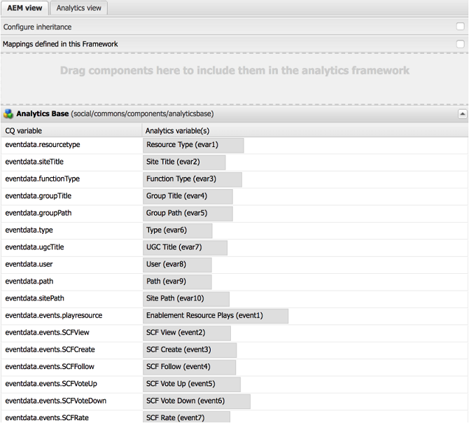

# AEM Communities中的用户和UGC管理服务 {#user-and-ugc-management-service-in-aem-communities}

>[!IMPORTANT]
>
>以下部分使用GDPR作为示例，但包含的详细信息适用于所有数据保护和隐私法规；例如GDPR、CCPA等。

AEM Communities提供现成的API来管理用户配置文件和批量管理用户生成的内容(UGC)。 启用后， **UserUgcManagement** 服务允许特权用户（社区管理员和审查方）禁用用户配置文件，以及批量删除或批量导出特定用户的UGC。 这些API还使客户数据的控制者和处理者能够遵守欧盟的《通用数据保护条例》(GDPR)和其他受GDPR启发的隐私法规。

欲知更多信息，请参见 [Adobe隐私中心的GDPR页面](https://www.adobe.com/privacy/general-data-protection-regulation.html).

>[!NOTE]
>
>如果您已配置 [AEM Communities中的Adobe Analytics](/help/communities/analytics.md) 之后，捕获的用户数据会被发送到Adobe Analytics服务器。 Adobe Analytics提供的API允许您访问、导出和删除用户数据，并符合GDPR。 有关更多信息，请参阅 [提交访问和删除请求](https://experienceleague.adobe.com/docs/analytics/admin/data-governance/gdpr-submit-access-delete.html).

要将这些API投入使用，您需要启用 `/services/social/ugcmanagement` 通过激活UserUgcManagement服务终结点。 要激活此服务，请安装 [示例servlet](https://github.com/Adobe-Marketing-Cloud/aem-communities-ugc-migration/tree/main/bundles/communities-ugc-management-servlet) 可用日期 [GitHub.com](https://github.com/Adobe-Marketing-Cloud/aem-communities-ugc-migration/tree/main/bundles/communities-ugc-management-servlet). 然后，使用http请求通过相应的参数点击社区站点发布实例上的端点，如下所示：

`https://localhost:port/services/social/ugcmanagement?user=<authorizable ID>&operation=<getUgc>`. 但是，您还可以构建UI（用户界面）来管理系统中的用户配置文件和用户生成的内容。

这些API允许执行以下功能。

## 检索用户的UGC {#retrieve-the-ugc-of-a-user}

**getUserUgc(ResourceResolver resourceResolver， String user， OutputStream outputStream)** 帮助从系统中导出用户的所有UGC。

* **用户**：用户的可授权ID。
* **outputstream**：结果作为输出流返回，这是一个zip文件，包含用户生成的内容（作为json文件）和附件（包含用户上传的图像或视频）。

例如，要导出名为Weston McCall的用户(该用户使用weston.mccall@dodgit.com作为可授权ID登录到communities站点)的UGC，您可以发送类似于以下内容的httpGET请求：

`https://localhost:port/services/social/ugcmanagement?user=weston.mccall@dodgit.com&operation=getUgc`

## 删除用户的UGC {#delete-the-ugc-of-a-user}

**deleteUserUgc(ResourceResolver resourceResolver， String user)** 帮助从系统中删除用户的所有UGC。

* **用户**：用户的可授权ID。

例如，要通过http-user请求删除具有可授权ID weston.mccall@dodgit.com的POST的UGC，请使用以下参数：

* 用户 = `weston.mccall@dodgit.com`
* 操作 = `deleteUgc`

### 从Adobe Analytics中删除UGC {#delete-ugc-from-adobe-analytics}

要从Adobe Analytics中删除用户数据，请按照 [GDPR分析工作流程](https://experienceleague.adobe.com/docs/analytics/admin/data-governance/an-gdpr-workflow.html)；由于API不会从Adobe Analytics中删除用户数据。

有关AEM Communities使用的Adobe Analytics变量映射，请参阅以下图像：

## 禁用用户帐户 {#disable-a-user-account}

**deleteUserAccount(ResourceResolver resourceResolver， String user)** 帮助禁用用户帐户。

* **用户**：用户的可授权ID。

>[!NOTE]
>
>禁用用户将删除用户在服务器上生成的所有内容。

例如，删除具有可授权ID的用户的配置文件 `weston.mccall@dodgit.com` 通过httpPOST请求，使用以下参数：

* 用户 = `weston.mccall@dodgit.com`
* 操作 = `deleteUser`

>[!NOTE]
>
>deleteUserAccount() API仅禁用系统中的用户配置文件，并删除UGC。 但是，要从系统中删除用户配置文件，请导航至 **CRXDE Lite**： [https://&lt;server>/crx/de](https://localhost:4502/crx/de)，找到用户节点并将其删除。
