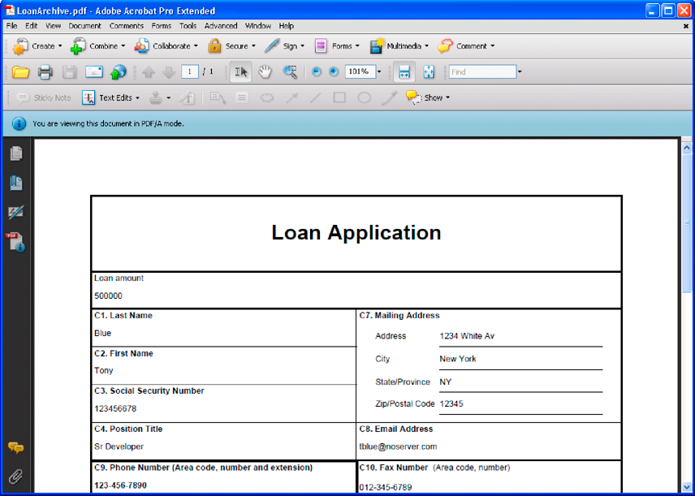

# 创建文档输出流  {#creating-document-output-streams}

**本文档中的示例和示例仅适用于JEE环境上的AEM Forms。**

**关于输出服务**

使用“输出”服务，可以将文档输出为PDF(包括PDF/A文档)、PostScript、打印机控制语言(PCL)以及以下标签格式：

* 斑马 — ZPL
* Intermec - IPL
* Datamax - DPL
* TecToshiba - TPCL

使用Output服务，您可以将XML表单数据与表单设计合并，并将文档输出到网络打印机或文件。

可通过两种方式将表单设计（XDP文件）传递到Output服务。 您可以将包含表单设计的`com.adobe.idp.Document`实例传递到Output服务。 或者，您可以传递一个用于指定表单设计位置的URI值。 这两种方法在&#x200B;*使用AEM forms*&#x200B;编程中进行了讨论。

>[!NOTE]
>
>Output服务不支持包含应用程序对象特定脚本的AcroformPDF文档。 包含应用程序对象特定脚本的AcroformPDF文档不会渲染。

以下部分将演示如何使用URI值将表单设计传递到Output服务：

* [创建PDF文档](creating-document-output-streams.md#creating-pdf-documents)
* [创建PDF/A文档](creating-document-output-streams.md#creating-pdf-a-documents)

以下部分说明如何在`com.adobe.idp.Document`实例中传递表单设计：

* [将Content Services中的文档（已弃用）传递到Output Service](creating-document-output-streams.md#passing-documents-located-in-content-services-deprecated-to-the-output-service)
* [使用片段创建PDF文档](creating-document-output-streams.md#creating-pdf-documents-using-fragments)

在决定使用哪种技术时，需要考虑的一个事项是，如果您从另一个AEM Forms服务获取表单设计，然后在`com.adobe.idp.Document`实例中传递它。 *将文档传递到输出服务*&#x200B;和&#x200B;*使用片段创建PDF文档*&#x200B;部分都显示了如何从另一个AEM Forms服务获取表单设计。 第一部分从内容服务中检索表单设计（已弃用）。 第二部分从Assembler服务检索窗体设计。

如果您从固定位置（如文件系统）获取窗体设计，则可以使用任一技术。 也就是说，您可以为XDP文件指定URI值或使用`com.adobe.idp.Document`实例。

要在创建PDF文档时传递指定表单设计位置的URI值，请使用`generatePDFOutput`方法。 同样，要在创建PDF文档时将`com.adobe.idp.Document`实例传递给Output服务，请使用`generatePDFOutput2`方法。

在将输出流发送到网络打印机时，也可以使用任一技术。 要通过传递包含表单设计的`com.adobe.idp.Document`实例将输出流发送到打印机，请使用`sendToPrinter2`方法。 要通过传递URI值将输出流发送到打印机，请使用`sendToPrinter`方法。 *将打印流发送到打印机*&#x200B;部分使用`sendToPrinter`方法。

您可以使用Output服务完成这些任务：

* [创建PDF文档](creating-document-output-streams.md#creating-pdf-documents)
* [创建PDF/A文档](creating-document-output-streams.md#creating-pdf-a-documents)
* [将Content Services中的文档（已弃用）传递到Output Service](creating-document-output-streams.md#passing-documents-located-in-content-services-deprecated-to-the-output-service)
* [使用片段创建PDF文档](creating-document-output-streams.md#creating-pdf-documents-using-fragments)
* [打印到文件](creating-document-output-streams.md#printing-to-files)
* [将打印流发送到打印机](creating-document-output-streams.md#sending-print-streams-to-printers)
* [创建多个输出文件](creating-document-output-streams.md#creating-multiple-output-files)
* [创建搜索规则](creating-document-output-streams.md#creating-search-rules)
* [拼合PDF文档](creating-document-output-streams.md#flattening-pdf-documents)

>[!NOTE]
>
>有关Output服务的详细信息，请参阅[AEM Forms的服务参考](https://www.adobe.com/go/learn_aemforms_services_63)。

## 创建PDF文档 {#creating-pdf-documents}

您可以使用Output服务创建基于表单设计和您提供的XML表单数据的PDF文档。 Output服务创建的PDF文档不是交互式PDF文档；用户无法输入或修改表单数据。

如果要创建用于长期存储的PDF文档，建议您创建一个PDF/A文档。 (请参阅[创建PDF/A文档](creating-document-output-streams.md#creating-pdf-a-documents)。)

要创建可让用户输入数据的交互式PDF表单，请使用Forms服务。 (请参阅[渲染交互式PDF forms](/help/forms/developing/rendering-forms.md#rendering-interactive-pdf-forms)。)

>[!NOTE]
>
>有关Output服务的详细信息，请参阅[AEM Forms的服务参考](https://www.adobe.com/go/learn_aemforms_services_63)。

### 步骤摘要 {#summary-of-steps}

要创建PDF文档，请执行以下步骤：

1. 包括项目文件。
1. 创建输出客户端对象。
1. 引用XML数据源。
1. 设置PDF运行时选项。
1. 设置渲染运行时选项。
1. 生成PDF文档。
1. 检索操作的结果。

**包含项目文件**

在开发项目中包含必要的文件。 如果使用Java创建客户端应用程序，请包含必要的JAR文件。 如果使用Web服务，请确保包含代理文件。

必须将以下JAR文件添加到项目的类路径中：

* adobe-livecycle-client.jar
* adobe-usermanager-client.jar
* adobe-output-client.jar
* adobe-utilities.jar (如果在JBoss上部署了AEM Forms，则此为必填字段)
* jbossall-client.jar(如果在JBoss上部署了AEM Forms，则此为必填字段)

如果将AEM Forms部署在受支持的J2EE应用程序服务器而不是JBoss上，则必须将adobe-utilities.jar和jbossall-client.jar文件替换为特定于已部署AEM Forms的J2EE应用程序服务器的JAR文件。

**创建输出客户端对象**

必须先创建输出服务客户端对象，然后才能以编程方式执行输出服务操作。 如果您使用的是Java API，请创建一个`OutputClient`对象。 如果您使用输出Web服务API，请创建一个`OutputServiceService`对象。

**引用XML数据源**

要将数据与表单设计合并，必须引用包含数据的XML数据源。 您计划使用数据填充的每个表单字段都必须存在XML元素。 XML元素名称必须与字段名称匹配。 如果XML元素与表单字段不对应，或者如果XML元素名称与字段名称不匹配，则忽略该元素。 如果指定了所有XML元素，则不必匹配XML元素的显示顺序。

考虑以下示例贷款申请表。


要将数据合并到此表单设计，必须创建与表单相对应的XML数据源。 以下XML表示与示例抵押应用程序表单相对应的XDP XML数据源。

```xml
 <?xml version="1.0" encoding="UTF-8" ?>
 - <xfa:datasets xmlns:xfa="https://www.xfa.org/schema/xfa-data/1.0/">
 - <xfa:data>
 - <data>
     - <Layer>
         <closeDate>1/26/2007</closeDate>
         <lastName>Johnson</lastName>
         <firstName>Jerry</firstName>
         <mailingAddress>JJohnson@NoMailServer.com</mailingAddress>
         <city>New York</city>
         <zipCode>00501</zipCode>
         <state>NY</state>
         <dateBirth>26/08/1973</dateBirth>
         <middleInitials>D</middleInitials>
         <socialSecurityNumber>(555) 555-5555</socialSecurityNumber>
         <phoneNumber>5555550000</phoneNumber>
     </Layer>
     - <Mortgage>
         <mortgageAmount>295000.00</mortgageAmount>
         <monthlyMortgagePayment>1724.54</monthlyMortgagePayment>
         <purchasePrice>300000</purchasePrice>
         <downPayment>5000</downPayment>
         <term>25</term>
         <interestRate>5.00</interestRate>
     </Mortgage>
 </data>
 </xfa:data>
 </xfa:datasets>
```

**设置PDF运行时选项**

创建PDF文档时设置文件URI选项。 此选项指定Output服务生成的PDF文件的名称和位置。

>[!NOTE]
>
>您可以用编程方式从输出服务返回的复杂数据类型检索PDF文档，而不是设置文件URI运行时选项。 但是，通过设置文件URI运行时选项，您无需创建以编程方式检索PDF文档的应用程序逻辑。

**设置渲染运行时选项**

创建PDF文档时，可以设置渲染运行时选项。 虽然这些选项不是必需的(与所需的PDF运行时选项不同)，但您可以执行诸如提高输出服务性能的任务。 例如，您可以缓存Output服务用于提高性能的表单设计。

如果您使用已标记的Acrobat表单作为输入，则无法使用输出服务Java或Web服务API来关闭已标记的设置。 如果您尝试以编程方式将此选项设置为`false`，则仍会标记结果PDF文档。

>[!NOTE]
>
>如果未指定渲染运行时选项，则使用默认值。 有关渲染运行时选项的信息，请参阅`RenderOptionsSpec`类引用。 (请参阅[AEM Forms API引用](https://www.adobe.com/go/learn_aemforms_javadocs_63_en))。

**生成PDF文档**

在引用包含表单数据的有效XML数据源并设置运行时选项后，可以调用Output服务，从而生成PDF文档。

在生成PDF文档时，您可以指定Output服务创建PDF文档所需的URI值。 窗体设计可以存储在服务器文件系统等位置或作为AEM Forms应用程序的一部分进行存储。 可以使用内容根URI值`repository:///`引用作为Forms应用程序一部分的表单设计（或其他资源，如图像文件）。 例如，考虑位于名为&#x200B;*Applications/FormsApplication*&#x200B;的Forms应用程序中的以下名为&#x200B;*Loan.xdp*&#x200B;的表单设计：


要访问上图所示的Loan.xdp文件，请将`repository:///Applications/FormsApplication/1.0/FormsFolder/`指定为传递给`OutputClient`对象的`generatePDFOutput`方法的第三个参数。 将表单名称(*Loan.xdp*)指定为传递给`OutputClient`对象的`generatePDFOutput`方法的第二个参数。

如果XDP文件包含图像（或其他资源，如片段），请将资源放置在与XDP文件相同的应用程序文件夹中。 AEM Forms使用内容根URI作为基本路径来解析对图像的引用。 例如，如果Loan.xdp文件包含图像，请确保将该图像放在`Applications/FormsApplication/1.0/FormsFolder/`中。

>[!NOTE]
>
>调用`OutputClient`对象的`generatePDFOutput`或`generatePrintedOutput`方法时，您可以引用Forms应用程序URI。

>[!NOTE]
>
>要查看通过引用Forms应用程序中的XDP来创建PDF文档的完整快速入门，请参阅[快速入门（EJB模式）：使用Java API基于应用程序XDP文件创建PDF文档](/help/forms/developing/output-service-java-api-quick.md#quick-start-soap-mode-creating-a-pdf-document-based-on-an-application-xdp-file-using-the-java-api)。

**检索操作的结果**

在Output服务执行操作之后，它会返回各种数据项，如指定操作是否成功的状态XML数据。

**另请参阅**

[使用Java API创建PDF文档](creating-document-output-streams.md#create-a-pdf-document-using-the-java-api)

[使用Web服务API创建PDF文档](creating-document-output-streams.md#create-a-pdf-document-using-the-web-service-api)

[包括AEM Forms Java库文件](/help/forms/developing/invoking-aem-forms-using-java.md#including-aem-forms-java-library-files)

[设置连接属性](/help/forms/developing/invoking-aem-forms-using-java.md#setting-connection-properties)

[输出服务API快速启动](/help/forms/developing/output-service-java-api-quick.md#output-service-java-api-quick-start-soap)

### 使用Java API创建PDF文档 {#create-a-pdf-document-using-the-java-api}

使用输出API (Java)创建PDF文档：

1. 包括项目文件。

   在您的Java项目的类路径中包含客户端JAR文件，例如adobe-output-client.jar。

1. 创建输出客户端对象。

   * 创建包含连接属性的`ServiceClientFactory`对象。
   * 使用构造函数创建`OutputClient`对象并传递`ServiceClientFactory`对象。

1. 引用XML数据源。

   * 创建一个`java.io.FileInputStream`对象，该对象表示用于填充PDF文档的XML数据源，方法是使用其构造函数并传递一个指定XML文件位置的字符串值。
   * 使用构造函数创建`com.adobe.idp.Document`对象。 传递`java.io.FileInputStream`对象。

1. 设置PDF运行时选项。

   * 使用构造函数创建`PDFOutputOptionsSpec`对象。
   * 通过调用`PDFOutputOptionsSpec`对象的`setFileURI`方法来设置文件URI选项。 传递一个字符串值，该值指定Output服务生成的PDF文件的位置。 文件URI选项相对于托管AEM Forms的J2EE应用程序服务器，而不是客户端计算机。

1. 设置渲染运行时选项。

   * 使用构造函数创建`RenderOptionsSpec`对象。
   * 通过调用`RenderOptionsSpec`对象的`setCacheEnabled`并传递`true`，缓存表单设计以提高输出服务的性能。

   >[!NOTE]
   >
   >如果输入文档是Acrobat表单(在Acrobat中创建的表单)或已签名或认证的XFA文档，则无法使用`RenderOptionsSpec`对象的`setPdfVersion`方法设置PDF文档的版本。 输出PDF文档保留原始PDF版本。 同样，如果输入文档是Acrobat表单或已签名或认证的XFA文档，则无法通过调用`RenderOptionsSpec`对象的`setTaggedPDF`方法来设置已标记的Adobe PDF选项。

   >[!NOTE]
   >
   >如果输入PDF文档经过验证或数字签名，则不能使用`RenderOptionsSpec`对象的`setLinearizedPDF`方法设置线性化PDF选项。 (请参阅[对PDF文档进行数字签名&#x200B;](/help/forms/developing/digitally-signing-certifying-documents.md#digitally-signing-pdf-documents)*。)*

1. 生成PDF文档。

   通过调用`OutputClient`对象的`generatePDFOutput`方法并传递以下值来创建PDF文档：

   * `TransformationFormat`枚举值。 要生成PDF文档，请指定`TransformationFormat.PDF`。
   * 一个字符串值，它指定窗体设计的名称。
   * 一个字符串值，它指定表单设计所在的内容根。
   * 包含PDF运行时选项的`PDFOutputOptionsSpec`对象。
   * 包含渲染运行时选项的`RenderOptionsSpec`对象。
   * 包含要与表单设计合并的数据的XML数据源的`com.adobe.idp.Document`对象。

   `generatePDFOutput`方法返回包含该操作结果的`OutputResult`对象。

   >[!NOTE]
   >
   >通过调用`generatePDFOutput`方法生成PDF文档时，不能将数据与已签署或已验证的XFAPDF表单合并。 （请参阅[对文档进行数字签名和认证&#x200B;](/help/forms/developing/digitally-signing-certifying-documents.md#digitally-signing-and-certifying-documents)*。）*

   >[!NOTE]
   >
   >`OutputResult`对象的`getRecordLevelMetaDataList`方法返回&#x200B;`null`*.*

   >[!NOTE]
   >
   >您还可以通过调用`OutputClient`对象的`generatePDFOutput2`方法创建PDF文档。 (请参阅[将Content Services中的文档（已弃用）传递给输出服务&#x200B;](creating-document-output-streams.md#passing-documents-located-in-content-services-deprecated-to-the-output-service)*。)*

1. 检索操作的结果。

   * 通过调用`OutputResult`对象的`getStatusDoc`方法，检索表示`generatePDFOutput`操作状态的`com.adobe.idp.Document`对象。 此方法返回指定操作是否成功的状态XML数据。
   * 创建包含操作结果的`java.io.File`对象。 确保文件扩展名为.xml。
   * 调用`com.adobe.idp.Document`对象的`copyToFile`方法以将`com.adobe.idp.Document`对象的内容复制到文件中（确保您使用`getStatusDoc`方法返回的`com.adobe.idp.Document`对象）。

   虽然Output服务将PDF文档写入传递到`PDFOutputOptionsSpec`对象的`setFileURI`方法的参数指定的位置，但可以通过调用`OutputResult`对象的`getGeneratedDoc`方法以编程方式检索PDF/A文档。

**另请参阅**

[步骤摘要](creating-document-output-streams.md#summary-of-steps)

[快速入门（EJB模式）：使用Java API创建PDF文档](/help/forms/developing/output-service-java-api-quick.md#quick-start-soap-mode-creating-a-pdf-document-using-the-java-api)

[快速入门(SOAP模式)：使用Java API创建PDF文档](/help/forms/developing/output-service-java-api-quick.md#quick-start-soap-mode-creating-a-pdf-document-using-the-java-api)

[包括AEM Forms Java库文件](/help/forms/developing/invoking-aem-forms-using-java.md#including-aem-forms-java-library-files)

[设置连接属性](/help/forms/developing/invoking-aem-forms-using-java.md#setting-connection-properties)

### 使用Web服务API创建PDF文档 {#create-a-pdf-document-using-the-web-service-api}

使用输出API（Web服务）创建PDF文档：

1. 包括项目文件。

   创建使用MTOM的Microsoft .NET项目。 确保使用以下WSDL定义： `http://localhost:8080/soap/services/OutputService?WSDL&lc_version=9.0.1`。

   >[!NOTE]
   >
   >将`localhost`替换为承载AEM Forms的服务器的IP地址。

1. 创建输出客户端对象。

   * 使用默认构造函数创建`OutputServiceClient`对象。
   * 使用`System.ServiceModel.EndpointAddress`构造函数创建`OutputServiceClient.Endpoint.Address`对象。 将指定WSDL的字符串值传递给AEM Forms服务（例如，`http://localhost:8080/soap/services/OutputService?blob=mtom`）。 您无需使用`lc_version`属性。 此属性在创建服务引用时使用。 但是，指定`?blob=mtom`以使用MTOM。
   * 通过获取`OutputServiceClient.Endpoint.Binding`字段的值创建一个`System.ServiceModel.BasicHttpBinding`对象。 将返回值强制转换为`BasicHttpBinding`。
   * 将`System.ServiceModel.BasicHttpBinding`对象的`MessageEncoding`字段设置为`WSMessageEncoding.Mtom`。 此值可确保使用MTOM。
   * 通过执行以下任务启用基本HTTP身份验证：

      * 将AEM表单用户名分配给字段`OutputServiceClient.ClientCredentials.UserName.UserName`。
      * 将相应的密码值分配给字段`OutputServiceClient.ClientCredentials.UserName.Password`。
      * 将常量值`HttpClientCredentialType.Basic`分配给字段`BasicHttpBindingSecurity.Transport.ClientCredentialType`。
      * 将常量值`BasicHttpSecurityMode.TransportCredentialOnly`分配给字段`BasicHttpBindingSecurity.Security.Mode`。

1. 引用XML数据源。

   * 使用构造函数创建`BLOB`对象。 `BLOB`对象用于存储将与PDF文档合并的XML数据。
   * 通过调用其构造函数并传递一个字符串值来创建一个`System.IO.FileStream`对象，该字符串值表示包含表单数据的XML文件的文件位置。
   * 创建用于存储`System.IO.FileStream`对象的内容的字节数组。 您可以通过获取`System.IO.FileStream`对象的`Length`属性来确定字节数组的大小。
   * 通过调用`System.IO.FileStream`对象的`Read`方法并传递要读取的字节数组、起始位置和流长度，使用流数据填充字节数组。
   * 使用字节数组的内容分配其`MTOM`字段以填充`BLOB`对象。

1. 设置PDF运行时选项

   * 使用构造函数创建`PDFOutputOptionsSpec`对象。
   * 通过分配一个字符串值来设置文件URI选项，该字符串值指定输出服务生成到`PDFOutputOptionsSpec`对象的`fileURI`数据成员的PDF文件的位置。 文件URI选项相对于托管AEM Forms的J2EE应用程序服务器，而不是客户端计算机。

1. 设置渲染运行时选项。

   * 使用构造函数创建`RenderOptionsSpec`对象。
   * 缓存表单设计以通过将`true`值分配给`RenderOptionsSpec`对象的`cacheEnabled`数据成员来提高Output服务的性能。

   >[!NOTE]
   >
   >如果输入文档是Acrobat表单(在Acrobat中创建的表单)或已签名或认证的XFA文档，则无法使用`RenderOptionsSpec`对象的`setPdfVersion`方法设置PDF文档的版本。 输出PDF文档保留原始PDF版本。 同样，如果输入文档是Acrobat表单或已签名或认证的XFA文档，则通过调用`RenderOptionsSpec`对象的`setTaggedPDF`*方法无法设置已标记Adobe PDF选项。*

   >[!NOTE]
   >
   >如果输入PDF文档经过认证或数字签名，则不能使用`RenderOptionsSpec`对象的`linearizedPDF`成员来设置线性化PDF选项。 (请参阅[对PDF文档进行数字签名&#x200B;](/help/forms/developing/digitally-signing-certifying-documents.md#digitally-signing-pdf-documents)*。)*

1. 生成PDF文档。

   通过调用`OutputServiceService`对象的`generatePDFOutput`方法并传递以下值来创建PDF文档：

   * `TransformationFormat`枚举值。 要生成PDF文档，请指定`TransformationFormat.PDF`。
   * 一个字符串值，它指定窗体设计的名称。
   * 一个字符串值，它指定表单设计所在的内容根。
   * 包含PDF运行时选项的`PDFOutputOptionsSpec`对象。
   * 包含渲染运行时选项的`RenderOptionsSpec`对象。
   * 包含要与表单设计合并的数据的XML数据源的`BLOB`对象。
   * 由`generatePDFOutput`方法填充的`BLOB`对象。 `generatePDFOutput`方法使用所生成的描述文档的元数据填充此对象。 （只有Web服务调用才需要此参数值）。
   * 由`generatePDFOutput`方法填充的`BLOB`对象。 `generatePDFOutput`方法使用结果数据填充此对象。 （只有Web服务调用才需要此参数值）。
   * 包含操作结果的`OutputResult`对象。 （只有Web服务调用才需要此参数值）。

   >[!NOTE]
   >
   >通过调用`generatePDFOutput`方法生成PDF文档时，不能将数据与已签署或已验证的XFAPDF表单合并。 （请参阅[对文档进行数字签名和认证&#x200B;](/help/forms/developing/digitally-signing-certifying-documents.md#digitally-signing-and-certifying-documents)*。）*

   >[!NOTE]
   >
   >您还可以通过调用`OutputClient`对象的`generatePDFOutput2`方法创建PDF文档。 (请参阅[将Content Services中的文档（已弃用）传递给输出服务&#x200B;](creating-document-output-streams.md#passing-documents-located-in-content-services-deprecated-to-the-output-service)*。)*

1. 检索操作的结果。

   * 通过调用其构造函数并传递表示包含结果数据的XML文件位置的字符串值来创建`System.IO.FileStream`对象。 确保文件扩展名为.xml。
   * 创建一个字节数组，用于存储`BLOB`对象的数据内容，该对象由`OutputServiceService`对象的`generatePDFOutput`方法（第八个参数）用结果数据填充。 通过获取`BLOB`对象的`MTOM` `field`的值填充字节数组。
   * 通过调用其构造函数并传递`System.IO.FileStream`对象来创建`System.IO.BinaryWriter`对象。
   * 通过调用`System.IO.BinaryWriter`对象的`Write`方法并传递字节数组，将字节数组的内容写入XML文件。

   另请参阅

[步骤摘要](creating-document-output-streams.md#summary-of-steps)

[使用MTOM调用AEM Forms](/help/forms/developing/invoking-aem-forms-using-web.md#invoking-aem-forms-using-mtom)

[使用SwaRef调用AEM Forms](/help/forms/developing/invoking-aem-forms-using-web.md#invoking-aem-forms-using-swaref)

   >[!NOTE]
   >
   >已弃用`OutputServiceService`对象的`generateOutput`方法。

## 创建PDF/A文档 {#creating-pdf-a-documents}

您可以使用Output服务创建PDF/A文档。 由于PDF/A是用于长期保存文档内容的存档格式，因此所有字体都将嵌入，并且文件是未压缩的。 因此，PDF/A 文档通常比标准 PDF 文档大。此外，PDF/文档不包含音频和视频内容。 与其他“输出”服务任务一样，提供表单设计和数据以与表单设计合并，以创建PDF/文档。

PDF/A-1规范包含两个一致性级别，即a和b。两者之间的主要区别在于对逻辑结构（辅助功能）的支持，一致性级别b不需要该支持。无论一致性级别如何，PDF/A-1都指示所有字体都嵌入到生成的PDF/A文档中。

尽管PDF/A是归档PDF文档的标准，但是如果标准PDF文档满足公司的需要，则不必使用PDF/A进行归档。 PDF/A标准的目的是建立一个PDF文件，它可以长期存储并且满足文档保存要求。 例如，无法将URL嵌入到PDF/A中，因为随着时间的推移，该URL可能会变得无效。

您的组织必须评估自己的需求、您打算保留文档的时间长度、文件大小考虑因素，并确定自己的归档策略。 您可以使用DocConverter服务以编程方式确定PDF文档是否符合PDF/A标准。 (请参阅[以编程方式确定PDF/合规性](/help/forms/developing/pdf-a-documents.md#programmatically-determining-pdf-a-compliancy)。)

PDF/文档必须使用在表单设计中指定的字体，且不能替换字体。 因此，如果位于PDF文档中的字体在主机操作系统(OS)上不可用，则会发生异常。

在Acrobat中打开PDF/A文档时，将显示一条消息，确认该文档为PDF/A文档，如下图所示。



>[!NOTE]
>
>AIIM网站有可在[https://www.loc.gov/preservation/digital/formats/fdd/fdd000125.shtml](https://www.loc.gov/preservation/digital/formats/fdd/fdd000125.shtml)访问的PDF/常见问题解答部分。

>[!NOTE]
>
>有关Output服务的详细信息，请参阅[AEM Forms的服务参考](https://www.adobe.com/go/learn_aemforms_services_65)。

### 步骤摘要 {#summary_of_steps-1}

要创建PDF/文档，请执行以下步骤：

1. 包括项目文件。
1. 创建输出客户端对象。
1. 引用XML数据源。
1. 设置PDF/A运行时选项。
1. 设置渲染运行时选项。
1. 生成PDF/文档。
1. 检索操作的结果。

**包含项目文件**

在开发项目中包含必要的文件。 如果要使用Java创建自定义应用程序，请包含必要的JAR文件。 如果使用Web服务，请确保包含代理文件。

必须将以下JAR文件添加到项目的类路径中：

* adobe-livecycle-client.jar
* adobe-usermanager-client.jar
* adobe-output-client.jar
* adobe-utilities.jar (如果在JBoss上部署了AEM Forms，则此为必填字段)
* jbossall-client.jar(如果在JBoss上部署了AEM Forms，则此为必填字段)

如果将AEM Forms部署在受支持的J2EE应用程序服务器而不是JBoss上，则必须将adobe-utilities.jar和jbossall-client.jar文件替换为特定于已部署AEM Forms的J2EE应用程序服务器的JAR文件。

**创建输出客户端对象**

必须先创建输出服务客户端对象，然后才能以编程方式执行输出服务操作。 如果您使用的是Java API，请创建一个`OutputClient`对象。 如果您使用输出Web服务API，请创建一个`OutputServiceService`对象。

**引用XML数据源**

要将数据与表单设计合并，必须引用包含数据的XML数据源。 要使用数据填充的每个表单字段都必须存在XML元素。 XML元素名称必须与字段名称匹配。 如果XML元素与表单字段不对应，或者如果XML元素名称与字段名称不匹配，则忽略该元素。 如果指定了所有XML元素，则不必匹配XML元素的显示顺序。

**设置PDF/A运行时选项**

创建PDF/A文档时，可以设置“文件URI”选项。 URI相对于托管AEM Forms的J2EE应用程序服务器。 也就是说，如果设置C:\Adobe ，文件将写入服务器上的文件夹，而不是客户端计算机。 URI指定Output服务生成的PDF/A文件的名称和位置。

**设置渲染运行时选项**

在创建PDF/A文档时，可以设置渲染运行时选项。 可以设置的两个PDF/A相关选项是`PDFAConformance`和`PDFARevisionNumber`值。 `PDFAConformance`值指的是PDF文档如何遵守指定保留长期电子文档的要求。 此选项的有效值为`A`和`B`。 有关级别a和b合规性的信息，请参阅标题为&#x200B;*ISO 19005-1 Document management*&#x200B;的PDF/A-1 ISO规范。

`PDFARevisionNumber`值是指PDF/A文档的修订号。 有关PDF/A文档的修订版本号的信息，请参阅标题为&#x200B;*ISO 19005-1 Document management*&#x200B;的PDF/A-1 ISO规范。

>[!NOTE]
>
>创建PDF/A 1A文档时，不能将已标记Adobe PDF选项设置为`false`。 PDF/A 1A将始终是带标签的PDF文档。 此外，在创建PDF/A 1B文档时，不能将已标记的Adobe PDF选项设置为`true`。 PDF/A 1B将始终是未标记的PDF文档。

**生成PDF/文档**

在引用包含表单数据的有效XML数据源并设置运行时选项后，可以调用输出服务，使其生成PDF/A文档。

**检索操作的结果**

在Output服务执行操作后，它会返回各种数据项，如指定操作是否成功的XML数据。

**另请参阅**

[使用Java API创建PDF/文档](creating-document-output-streams.md#create-a-pdf-a-document-using-the-java-api)

[使用Web服务API创建PDF/文档](creating-document-output-streams.md#create-a-pdf-a-document-using-the-web-service-api)

[包括AEM Forms Java库文件](/help/forms/developing/invoking-aem-forms-using-java.md#including-aem-forms-java-library-files)

[设置连接属性](/help/forms/developing/invoking-aem-forms-using-java.md#setting-connection-properties)

[输出服务API快速启动](/help/forms/developing/output-service-java-api-quick.md#output-service-java-api-quick-start-soap)

### 使用Java API创建PDF/文档 {#create-a-pdf-a-document-using-the-java-api}

使用输出API (Java)创建PDF/文档：

1. 包括项目文件。

   在您的Java项目的类路径中包含客户端JAR文件，例如adobe-output-client.jar。

1. 创建输出客户端对象。

   * 创建包含连接属性的`ServiceClientFactory`对象。
   * 使用构造函数创建`OutputClient`对象并传递`ServiceClientFactory`对象。

1. 引用XML数据源。

   * 创建一个`java.io.FileInputStream`对象，该对象表示用于填充PDF/A文档的XML数据源，方法是使用其构造函数并传递指定XML文件位置的字符串值。
   * 使用对象的构造函数创建`com.adobe.idp.Document`对象并传递`java.io.FileInputStream`对象。

1. 设置PDF/A运行时选项。

   * 使用构造函数创建`PDFOutputOptionsSpec`对象。
   * 通过调用`PDFOutputOptionsSpec`对象的`setFileURI`方法来设置文件URI选项。 传递一个字符串值，该值指定Output服务生成的PDF文件的位置。 文件URI选项相对于托管AEM Forms的J2EE应用程序服务器，而不是客户端计算机。

1. 设置渲染运行时选项。

   * 使用构造函数创建`RenderOptionsSpec`对象。
   * 通过调用`RenderOptionsSpec`对象的`setPDFAConformance`方法并传递指定一致性级别的`PDFAConformance`枚举值来设置`PDFAConformance`值。 例如，要指定一致性级别A，请传递`PDFAConformance.A`。
   * 通过调用`RenderOptionsSpec`对象的`setPDFARevisionNumber`方法并传递`PDFARevisionNumber.Revision_1`来设置`PDFARevisionNumber`值。

   >[!NOTE]
   >
   >PDF/A文档的PDF版本是1.4，无论您为`RenderOptionsSpec`对象的&#x200B;`setPdfVersion`*方法指定哪个值。*

1. 生成PDF/文档。

   通过调用`OutputClient`对象的`generatePDFOutput`方法并传递以下值来创建PDF/文档：

   * `TransformationFormat`枚举值。 要生成PDF/文档，请指定`TransformationFormat.PDFA`。
   * 一个字符串值，它指定窗体设计的名称。
   * 一个字符串值，它指定表单设计所在的内容根。
   * 包含PDF运行时选项的`PDFOutputOptionsSpec`对象。
   * 包含渲染运行时选项的`RenderOptionsSpec`对象。
   * 包含要与表单设计合并的数据的XML数据源的`com.adobe.idp.Document`对象。

   `generatePDFOutput`方法返回包含该操作结果的`OutputResult`对象。

   >[!NOTE]
   >
   >`OutputResult`对象的`getRecordLevelMetaDataList`方法返回`null`。

   >[!NOTE]
   >
   >您还可以通过调用`OutputClient`对象的`generatePDFOutput`2方法创建PDF/A文档。 (请参阅[将Content Services中的文档（已弃用）传递给输出服务](creating-document-output-streams.md#passing-documents-located-in-content-services-deprecated-to-the-output-service)。)

1. 检索操作的结果。

   * 通过调用`OutputResult`对象的`getStatusDoc`方法，创建表示`generatePDFOutput`方法状态的`com.adobe.idp.Document`对象。
   * 创建将包含操作结果的`java.io.File`对象。 确保文件扩展名为.xml。
   * 调用`com.adobe.idp.Document`对象的`copyToFile`方法以将`com.adobe.idp.Document`对象的内容复制到文件中（确保您使用`getStatusDoc`方法返回的`com.adobe.idp.Document`对象）。

   >[!NOTE]
   >
   >虽然Output服务将PDF/A文档写入传递给`PDFOutputOptionsSpec`对象的`setFileURI`方法的参数指定的位置，但可以通过调用`OutputResult`对象的`getGeneratedDoc`方法以编程方式检索PDF/A文档。

**另请参阅**

[步骤摘要](creating-document-output-streams.md#summary-of-steps)

[快速入门(SOAP模式)：使用Java API创建PDF/A文档](/help/forms/developing/output-service-java-api-quick.md#quick-start-soap-mode-creating-a-pdf-a-document-using-the-java-api)

[包括AEM Forms Java库文件](/help/forms/developing/invoking-aem-forms-using-java.md#including-aem-forms-java-library-files)

[正在设置连接属性](/help/forms/developing/invoking-aem-forms-using-java.md#setting-connection-properties)。

### 使用Web服务API创建PDF/文档 {#create-a-pdf-a-document-using-the-web-service-api}

使用输出API（Web服务）创建PDF/文档：

1. 包括项目文件。

   创建使用MTOM的Microsoft .NET项目。 确保使用以下WSDL定义： `http://localhost:8080/soap/services/OutputService?WSDL&lc_version=9.0.1`。

   >[!NOTE]
   >
   >将`localhost`替换为承载AEM Forms的服务器的IP地址。

1. 创建输出客户端对象。

   * 使用默认构造函数创建`OutputServiceClient`对象。
   * 使用`System.ServiceModel.EndpointAddress`构造函数创建`OutputServiceClient.Endpoint.Address`对象。 将指定WSDL的字符串值传递给AEM Forms服务（例如，`http://localhost:8080/soap/services/OutputService?blob=mtom`）。 您无需使用`lc_version`属性。 此属性在创建服务引用时使用。 但是，指定`?blob=mtom`以使用MTOM。
   * 通过获取`OutputServiceClient.Endpoint.Binding`字段的值创建一个`System.ServiceModel.BasicHttpBinding`对象。 将返回值强制转换为`BasicHttpBinding`。
   * 将`System.ServiceModel.BasicHttpBinding`对象的`MessageEncoding`字段设置为`WSMessageEncoding.Mtom`。 此值可确保使用MTOM。
   * 通过执行以下任务启用基本HTTP身份验证：

      * 将AEM表单用户名分配给字段`OutputServiceClient.ClientCredentials.UserName.UserName`。
      * 将相应的密码值分配给字段`OutputServiceClient.ClientCredentials.UserName.Password`。
      * 将常量值`HttpClientCredentialType.Basic`分配给字段`BasicHttpBindingSecurity.Transport.ClientCredentialType`。
      * 将常量值`BasicHttpSecurityMode.TransportCredentialOnly`分配给字段`BasicHttpBindingSecurity.Security.Mode`。

1. 引用XML数据源。

   * 使用构造函数创建`BLOB`对象。 `BLOB`对象用于存储将与PDF/A文档合并的数据。
   * 通过调用其构造函数并传递一个字符串值来创建一个`System.IO.FileStream`对象，该字符串值表示要加密的PDF文档的文件位置以及打开文件的模式。
   * 创建用于存储`System.IO.FileStream`对象的内容的字节数组。 您可以通过获取`System.IO.FileStream`对象的`Length`属性来确定字节数组的大小。
   * 通过调用`System.IO.FileStream`对象的`Read`方法并传递要读取的字节数组、起始位置和流长度，使用流数据填充字节数组。
   * 使用字节数组内容分配其`MTOM`字段以填充`BLOB`对象。

1. 设置PDF/A运行时选项。

   * 使用构造函数创建`PDFOutputOptionsSpec`对象。
   * 通过分配一个字符串值来设置文件URI选项，该字符串值指定输出服务生成到`PDFOutputOptionsSpec`对象的`fileURI`数据成员的PDF文件的位置。 文件URI选项相对于托管AEM Forms的J2EE应用程序服务器，而不是客户端计算机

1. 设置渲染运行时选项。

   * 使用构造函数创建`RenderOptionsSpec`对象。
   * 通过为`RenderOptionsSpec`对象的`PDFAConformance`数据成员分配`PDFAConformance`枚举值来设置`PDFAConformance`值。 例如，要指定一致性级别A，请将`PDFAConformance.A`分配给此数据成员。
   * 通过为`RenderOptionsSpec`对象的`PDFARevisionNumber`数据成员分配`PDFARevisionNumber`枚举值来设置`PDFARevisionNumber`值。 将`PDFARevisionNumber.Revision_1`分配给此数据成员。

   >[!NOTE]
   >
   >无论您指定哪个值，PDF/A文档的PDF版本均为1.4。

1. 生成PDF/文档。

   通过调用`OutputServiceService`对象的`generatePDFOutput`方法并传递以下值来创建PDF文档：

   * TransformationFormat枚举值。 要生成PDF文档，请指定`TransformationFormat.PDFA`。
   * 一个字符串值，它指定窗体设计的名称。
   * 一个字符串值，它指定表单设计所在的内容根。
   * 包含PDF运行时选项的`PDFOutputOptionsSpec`对象。
   * 包含渲染运行时选项的`RenderOptionsSpec`对象。
   * 包含要与表单设计合并的数据的XML数据源的`BLOB`对象。
   * 由`generatePDFOutput`方法填充的`BLOB`对象。 `generatePDFOutput`方法使用所生成的描述文档的元数据填充此对象。 （只有Web服务调用才需要此参数值。）
   * 由`generatePDFOutput`方法填充的`BLOB`对象。 `generatePDFOutput`方法使用结果数据填充此对象。 （只有Web服务调用才需要此参数值。）
   * 包含操作结果的`OutputResult`对象。 （只有Web服务调用才需要此参数值。）

   >[!NOTE]
   >
   >您还可以通过调用`OutputClient`对象的`generatePDFOutput`2方法创建PDF/A文档。 (请参阅[将Content Services中的文档（已弃用）传递给输出服务](creating-document-output-streams.md#passing-documents-located-in-content-services-deprecated-to-the-output-service)。)

1. 检索操作的结果。

   * 通过调用其构造函数并传递表示包含结果数据的XML文件位置的字符串值来创建`System.IO.FileStream`对象。 确保文件扩展名为.xml。
   * 创建一个字节数组，用于存储`BLOB`对象的数据内容，该对象由`OutputServiceService`对象的`generatePDFOutput`方法（第八个参数）用结果数据填充。 通过获取`BLOB`对象的`MTOM`字段的值填充字节数组。
   * 通过调用其构造函数并传递`System.IO.FileStream`对象来创建`System.IO.BinaryWriter`对象。
   * 通过调用`System.IO.BinaryWriter`对象的`Write`方法并传递字节数组，将字节数组的内容写入XML文件。

**另请参阅**

[步骤摘要](creating-document-output-streams.md#summary-of-steps)

[使用MTOM调用AEM Forms](/help/forms/developing/invoking-aem-forms-using-web.md#invoking-aem-forms-using-mtom)

[使用SwaRef调用AEM Forms](/help/forms/developing/invoking-aem-forms-using-web.md#invoking-aem-forms-using-swaref)

## 将Content Services中的文档（已弃用）传递到Output Service {#passing-documents-located-in-content-services-deprecated-to-the-output-service}

Output服务可呈现基于表单设计的非交互式PDF表单，该表单通常保存为XDP文件并在Designer中创建。 您可以将包含表单设计的`com.adobe.idp.Document`对象传递到Output服务。 然后，输出服务在`com.adobe.idp.Document`对象中呈现窗体设计。

将`com.adobe.idp.Document`对象传递给输出服务的好处是，其他AEM Forms服务操作返回`com.adobe.idp.Document`实例。 也就是说，您可以从另一个服务操作获取`com.adobe.idp.Document`实例并对其进行渲染。 例如，假设XDP文件存储在名为`/Company Home/Form Designs`的Content Services（已弃用）节点中，如下图所示。

您可以通过编程方式从内容服务（已弃用）检索Loan.xdp，并将XDP文件传递到`com.adobe.idp.Document`对象中的输出服务。

>[!NOTE]
>
>有关Forms服务的详细信息，请参阅[AEM Forms的服务参考](https://www.adobe.com/go/learn_aemforms_services_63)。

### 步骤摘要 {#summary_of_steps-2}

要将从Content Services（已弃用）获得的文档传递到输出服务，请执行以下任务：

1. 包括项目文件。
1. 创建输出和文档管理客户端API对象。
1. 从Content Services检索表单设计（已弃用）。
1. 呈现非交互式PDF表单。
1. 对数据流执行操作。

**包含项目文件**

将必要的文件包含到开发项目中。 如果使用Java创建客户端应用程序，请包含必要的JAR文件。 如果您使用的是Web服务，请包含代理文件。

**创建输出和文档管理客户端API对象**

在以编程方式执行输出服务API操作之前，请先创建输出客户端API对象。 此外，由于此工作流从内容服务中检索XDP文件（已弃用），因此请创建文档管理API对象。

**从内容服务检索表单设计（已弃用）**

使用Java或Web服务API从内容服务中检索XDP文件（已弃用）。 XDP文件在`com.adobe.idp.Document`实例（或者`BLOB`实例，如果您使用Web服务）中返回。 然后，您可以将`com.adobe.idp.Document`实例传递到输出服务。

**渲染非交互式PDF表单**

要呈现非交互式表单，请将从Content Services（已弃用）返回的`com.adobe.idp.Document`实例传递到输出服务。

>[!NOTE]
>
>名为`generatePDFOutput2`和g `eneratePrintedOutput2`的两个新方法接受包含表单设计的`com.adobe.idp.Document`对象。 在将打印流发送到网络打印机时，您还可以将包含表单设计的`com.adobe.idp.Document`传递到Output服务。

**对表单数据流执行操作**

您可以将非交互式表单另存为PDF文件。 该表单可在Adobe Reader或Acrobat中查看。

**另请参阅**

[使用Java API将文档传递到输出服务](creating-document-output-streams.md#pass-documents-to-the-output-service-using-the-java-api)

[使用Web服务API将文档传递到输出服务](creating-document-output-streams.md#pass-documents-to-the-output-service-using-the-web-service-api)

[包括AEM Forms Java库文件](/help/forms/developing/invoking-aem-forms-using-java.md#including-aem-forms-java-library-files)

[设置连接属性](/help/forms/developing/invoking-aem-forms-using-java.md#setting-connection-properties)

[输出服务API快速启动](/help/forms/developing/output-service-java-api-quick.md#output-service-java-api-quick-start-soap)

[使用片段创建PDF文档](creating-document-output-streams.md#creating-pdf-documents-using-fragments)

### 使用Java API将文档传递到输出服务 {#pass-documents-to-the-output-service-using-the-java-api}

使用输出服务和内容服务（已弃用）API (Java)传递从内容服务（已弃用）检索的文档：

1. 包括项目文件。

   在Java项目的类路径中包含客户端JAR文件，例如adobe-output-client.jar和adobe-contentservices-client.jar。

1. 创建输出和文档管理客户端API对象。

   * 创建包含连接属性的`ServiceClientFactory`对象。 （请参阅[设置连接属性](/help/forms/developing/invoking-aem-forms-using-java.md#setting-connection-properties)。）
   * 使用构造函数创建`OutputClient`对象并传递`ServiceClientFactory`对象。
   * 使用对象的构造函数创建`DocumentManagementServiceClientImpl`对象并传递`ServiceClientFactory`对象。

1. 从Content Services检索表单设计（已弃用）。

   调用`DocumentManagementServiceClientImpl`对象的`retrieveContent`方法并传递以下值：

   * 一个字符串值，它指定添加内容的存储。 默认存储为`SpacesStore`。 此值是必需参数。
   * 一个字符串值，它指定要检索的内容的完全限定路径（例如，`/Company Home/Form Designs/Loan.xdp`）。 此值是必需参数。
   * 指定版本的字符串值。 此值是一个可选参数，您可以传递空字符串。 在这种情况下，将检索最新版本。

   `retrieveContent`方法返回包含XDP文件的`CRCResult`对象。 通过调用`CRCResult`对象的`getDocument`方法检索`com.adobe.idp.Document`实例。

1. 呈现非交互式PDF表单。

   调用`OutputClient`对象的`generatePDFOutput2`方法并传递以下值：

   * `TransformationFormat`枚举值。 要生成PDF文档，请指定`TransformationFormat.PDF`。
   * 一个字符串值，它指定其他资源（如图像）所在的内容根。
   * 表示表单设计的`com.adobe.idp.Document`对象（使用`CRCResult`对象的`getDocument`方法返回的实例）。
   * 包含PDF运行时选项的`PDFOutputOptionsSpec`对象。
   * 包含渲染运行时选项的`RenderOptionsSpec`对象。
   * 包含要与表单设计合并的数据的XML数据源的`com.adobe.idp.Document`对象。

   `generatePDFOutput2`方法返回包含该操作结果的`OutputResult`对象。

1. 对表单数据流执行操作。

   * 通过调用`OutputResult`对象的`getGeneratedDoc`方法，检索表示非交互式表单的`com.adobe.idp.Document`对象。
   * 创建包含操作结果的`java.io.File`对象。 确保文件扩展名为.pdf。
   * 调用`com.adobe.idp.Document`对象的`copyToFile`方法以将`com.adobe.idp.Document`对象的内容复制到文件中（确保您使用`getGeneratedDoc`方法返回的`com.adobe.idp.Document`对象）。

**另请参阅**

[步骤摘要](creating-document-output-streams.md#summary-of-steps)

[快速启动（EJB模式）：使用Java API将文档传递到Output Service](/help/forms/developing/output-service-java-api-quick.md#quick-start-soap-mode-passing-documents-to-the-output-service-using-the-java-api)

[快速入门(SOAP模式)：使用Java API将文档传递到输出服务](/help/forms/developing/output-service-java-api-quick.md#quick-start-soap-mode-passing-documents-to-the-output-service-using-the-java-api)

[包括AEM Forms Java库文件](/help/forms/developing/invoking-aem-forms-using-java.md#including-aem-forms-java-library-files)

[设置连接属性](/help/forms/developing/invoking-aem-forms-using-java.md#setting-connection-properties)

### 使用Web服务API将文档传递到输出服务 {#pass-documents-to-the-output-service-using-the-web-service-api}

使用输出服务和内容服务（已弃用）API（Web服务）传递从内容服务（已弃用）检索的文档：

1. 包括项目文件。

   创建使用MTOM的Microsoft .NET项目。 由于此客户端应用程序调用两个AEM Forms服务，因此请创建两个服务引用。 为与输出服务关联的服务引用使用以下WSDL定义： `http://localhost:8080/soap/services/OutputService?WSDL&lc_version=9.0.1`。

   对与Document Management服务关联的服务引用使用以下WSDL定义： `http://localhost:8080/soap/services/DocumentManagementService?WSDL&lc_version=9.0.1`。

   由于`BLOB`数据类型对两个服务引用都是通用的，因此使用它时，请完全限定`BLOB`数据类型。 在相应的Web服务快速入门中，所有`BLOB`实例都是完全限定的。

   >[!NOTE]
   >
   >将`localhost`替换为承载AEM Forms的服务器的IP地址。

1. 创建输出和文档管理客户端API对象。

   * 使用默认构造函数创建`OutputServiceClient`对象。
   * 使用`System.ServiceModel.EndpointAddress`构造函数创建`OutputServiceClient.Endpoint.Address`对象。 将指定WSDL的字符串值传递给Forms服务（例如，`http://localhost:8080/soap/services/OutputService?blob=mtom`）。 您无需使用`lc_version`属性。 此属性在创建服务引用时使用。)
   * 通过获取`OutputServiceClient.Endpoint.Binding`字段的值创建一个`System.ServiceModel.BasicHttpBinding`对象。 将返回值强制转换为`BasicHttpBinding`。
   * 将`System.ServiceModel.BasicHttpBinding`对象的`MessageEncoding`字段设置为`WSMessageEncoding.Mtom`。 此值可确保使用MTOM。
   * 通过执行以下任务启用基本HTTP身份验证：

      * 将AEM表单用户名分配给字段`OutputServiceClient.ClientCredentials.UserName.UserName`。
      * 将相应的密码值分配给字段`OutputServiceClient.ClientCredentials.UserName.Password`。
      * 将常量值`HttpClientCredentialType.Basic`分配给字段`BasicHttpBindingSecurity.Transport.ClientCredentialType`。

   * 将常量值`BasicHttpSecurityMode.TransportCredentialOnly`分配给字段`BasicHttpBindingSecurity.Security.Mode`。

   >[!NOTE]
   >
   >对`DocumentManagementServiceClient`服务客户端重复这些步骤。

1. 从Content Services检索表单设计（已弃用）。

   通过调用`DocumentManagementServiceClient`对象的`retrieveContent`方法并传递以下值来检索内容：

   * 一个字符串值，它指定添加内容的存储。 默认存储为`SpacesStore`。 此值是必需参数。
   * 一个字符串值，它指定要检索的内容的完全限定路径（例如，`/Company Home/Form Designs/Loan.xdp`）。 此值是必需参数。
   * 指定版本的字符串值。 此值是一个可选参数，您可以传递空字符串。 在这种情况下，将检索最新版本。
   * 用于存储浏览链接值的字符串输出参数。
   * 用于存储内容的`BLOB`输出参数。 您可以使用此输出参数检索内容。
   * 用于存储内容属性的`ServiceReference1.MyMapOf_xsd_string_To_xsd_anyType`输出参数。
   * `CRCResult`输出参数。 您可以使用`BLOB`输出参数来检索内容，而不是使用此对象。

1. 呈现非交互式PDF表单。

   调用`OutputServiceClient`对象的`generatePDFOutput2`方法并传递以下值：

   * `TransformationFormat`枚举值。 要生成PDF文档，请指定`TransformationFormat.PDF`。
   * 一个字符串值，它指定其他资源（如图像）所在的内容根。
   * 表示表单设计的`BLOB`对象(使用内容服务返回的`BLOB`实例（已弃用）)。
   * 包含PDF运行时选项的`PDFOutputOptionsSpec`对象。
   * 包含渲染运行时选项的`RenderOptionsSpec`对象。
   * 包含要与表单设计合并的数据的XML数据源的`BLOB`对象。
   * 由`generatePDFOutput2`方法填充的输出`BLOB`对象。 `generatePDFOutput2`方法使用所生成的描述文档的元数据填充此对象。 （只有Web服务调用才需要此参数值）。
   * 包含操作结果的输出`OutputResult`对象。 （只有Web服务调用才需要此参数值）。

   `generatePDFOutput2`方法返回包含非交互式PDF表单的`BLOB`对象。

1. 对表单数据流执行操作。

   * 通过调用其构造函数创建`System.IO.FileStream`对象。 传递一个字符串值，该值表示交互式PDF文档的文件位置以及打开文件的模式。
   * 创建一个字节数组，用于存储从`generatePDFOutput2`方法检索的`BLOB`对象的内容。 通过获取`BLOB`对象的`MTOM`数据成员的值填充字节数组。
   * 通过调用其构造函数并传递`System.IO.FileStream`对象来创建`System.IO.BinaryWriter`对象。
   * 通过调用`System.IO.BinaryWriter`对象的`Write`方法并传递字节数组，将字节数组的内容写入PDF文件。

**另请参阅**

[步骤摘要](creating-document-output-streams.md#summary-of-steps)

[使用MTOM调用AEM Forms](/help/forms/developing/invoking-aem-forms-using-web.md#invoking-aem-forms-using-mtom)

## 将存储库中的文档传递到Output服务 {#passing-documents-located-in-the-repository-to-the-output-service}

Output服务可呈现基于表单设计的非交互式PDF表单，该表单通常保存为XDP文件并在Designer中创建。 您可以将包含表单设计的`com.adobe.idp.Document`对象传递到Output服务。 然后，输出服务在`com.adobe.idp.Document`对象中呈现窗体设计。

将`com.adobe.idp.Document`对象传递给输出服务的好处是，其他AEM Forms服务操作返回`com.adobe.idp.Document`实例。 也就是说，您可以从另一个服务操作获取`com.adobe.idp.Document`实例并对其进行渲染。 例如，假设XDP文件存储在AEM Forms存储库中，如下图所示。


*FormsFolder*&#x200B;文件夹是AEM Forms存储库中的用户定义的位置（此位置是一个示例，默认不存在）。 在此示例中，名为Loan.xdp的表单设计位于此文件夹中。 除了表单设计之外，还可以在此位置存储其他表单宣传资料，例如图像。 AEM Forms存储库中资源的路径为：

`Applications/Application-name/Application-version/Folder.../Filename`

您可以以编程方式从AEM Forms存储库检索Loan.xdp，并将其传递到`com.adobe.idp.Document`对象中的输出服务。

您可以使用以下两种方式之一，基于存储库中的XDP文件创建PDF。 您可以按引用传递XDP位置，也可以以编程方式从存储库检索XDP，并将其传递到XDP文件中的Output服务。

[快速入门（EJB模式）：使用Java API基于应用程序XDP文件创建PDF文档](/help/forms/developing/output-service-java-api-quick.md#quick-start-soap-mode-creating-a-pdf-document-based-on-an-application-xdp-file-using-the-java-api)（显示如何通过引用传递XDP文件的位置）。

[快速入门（EJB模式）：使用Java API将AEM Forms存储库中的文档传递到Output服务](/help/forms/developing/output-service-java-api-quick.md#quick-start-soap-mode-passing-a-document-located-in-the-repository-to-the-output-service-using-the-java-api)(显示如何以编程方式从AEM Forms存储库检索XDP文件并将其传递到`com.adobe.idp.Document`实例中的Output服务)。 （本节讨论如何执行此任务）

>[!NOTE]
>
>有关Forms服务的详细信息，请参阅[AEM Forms的服务参考](https://www.adobe.com/go/learn_aemforms_services_63)。

### 步骤摘要 {#summary_of_steps-3}

要将从AEM Forms存储库获得的文档传递到输出服务，请执行以下任务：

1. 包括项目文件。
1. 创建输出和文档管理客户端API对象。
1. 从AEM Forms存储库检索表单设计。
1. 呈现非交互式PDF表单。
1. 对数据流执行操作。

**包含项目文件**

将必要的文件包含到开发项目中。 如果使用Java创建客户端应用程序，请包含必要的JAR文件。 如果您使用的是Web服务，请包含代理文件。

**创建输出和文档管理客户端API对象**

在以编程方式执行输出服务API操作之前，请先创建输出客户端API对象。 此外，由于此工作流从内容服务中检索XDP文件（已弃用），因此请创建文档管理API对象。

**从AEM Forms存储库检索表单设计**

使用存储库API从AEM Forms存储库检索XDP文件。 （请参阅[正在读取资源](/help/forms/developing/aem-forms-repository.md#reading-resources)。）

XDP文件在`com.adobe.idp.Document`实例（或者`BLOB`实例，如果您使用Web服务）中返回。 然后，您可以将`com.adobe.idp.Document`实例传递到Output服务。

**渲染非交互式PDF表单**

要呈现非交互式表单，请传递使用AEM Forms存储库API返回的`com.adobe.idp.Document`实例。

>[!NOTE]
>
>名为`generatePDFOutput2`和`generatePrintedOutput2`的两个新方法接受包含表单设计的`com.adobe.idp.Document`对象。 在将打印流发送到网络打印机时，您还可以将包含表单设计的`com.adobe.idp.Document`传递到输出服务。

**对表单数据流执行操作**

您可以将非交互式表单另存为PDF文件。 该表单可在Adobe Reader或Acrobat中查看。

**另请参阅**

[使用Java API将存储库中的文档传递到输出服务](creating-document-output-streams.md#pass-documents-located-in-the-repository-to-the-output-service-using-the-java-api)

[包括AEM Forms Java库文件](/help/forms/developing/invoking-aem-forms-using-java.md#including-aem-forms-java-library-files)

[设置连接属性](/help/forms/developing/invoking-aem-forms-using-java.md#setting-connection-properties)

[输出服务API快速启动](/help/forms/developing/output-service-java-api-quick.md#output-service-java-api-quick-start-soap)

ResourceRepositoryClient

### 使用Java API将存储库中的文档传递到输出服务 {#pass-documents-located-in-the-repository-to-the-output-service-using-the-java-api}

使用输出服务和存储库API (Java)传递从存储库检索到的文档：

1. 包括项目文件。

   在您的Java项目的类路径中包含客户端JAR文件，例如adobe-output-client.jar和adobe-repository-client.jar。

1. 创建输出和文档管理客户端API对象。

   * 创建包含连接属性的`ServiceClientFactory`对象。 （请参阅[设置连接属性](/help/forms/developing/invoking-aem-forms-using-java.md#setting-connection-properties)。）
   * 使用构造函数创建`OutputClient`对象并传递`ServiceClientFactory`对象。
   * 使用对象的构造函数创建`DocumentManagementServiceClientImpl`对象并传递`ServiceClientFactory`对象。

1. 从AEM Forms存储库检索表单设计。

   调用`ResourceRepositoryClient`对象的`readResourceContent`方法，并将指定URI位置的字符串值传递给XDP文件。 例如，`/Applications/FormsApplication/1.0/FormsFolder/Loan.xdp`。此值为必填项。 此方法返回表示XDP文件的`com.adobe.idp.Document`实例。

1. 呈现非交互式PDF表单。

   调用`OutputClient`对象的`generatePDFOutput2`方法并传递以下值：

   * `TransformationFormat`枚举值。 要生成PDF文档，请指定`TransformationFormat.PDF`。
   * 一个字符串值，它指定其他资源（如图像）所在的内容根。 例如：`repository:///Applications/FormsApplication/1.0/FormsFolder/`。
   * 表示表单设计的`com.adobe.idp.Document`对象（使用`ResourceRepositoryClient`对象的`readResourceContent`方法返回的实例）。
   * 包含PDF运行时选项的`PDFOutputOptionsSpec`对象。
   * 包含渲染运行时选项的`RenderOptionsSpec`对象。
   * 包含要与表单设计合并的数据的XML数据源的`com.adobe.idp.Document`对象。

   `generatePDFOutput2`方法返回包含该操作结果的`OutputResult`对象。

1. 对表单数据流执行操作。

   * 通过调用`OutputResult`对象的`getGeneratedDoc`方法，检索表示非交互式表单的`com.adobe.idp.Document`对象。
   * 创建包含操作结果的`java.io.File`对象。 确保文件扩展名为.pdf。
   * 调用`com.adobe.idp.Document`对象的`copyToFile`方法以将`com.adobe.idp.Document`对象的内容复制到文件中（确保您使用`getGeneratedDoc`方法返回的`com.adobe.idp.Document`对象）。

**另请参阅**

[步骤摘要](creating-document-output-streams.md#summary-of-steps)

[快速入门（EJB模式）：使用Java API将AEM Forms存储库中的文档传递到Output服务](/help/forms/developing/output-service-java-api-quick.md#quick-start-soap-mode-passing-a-document-located-in-the-repository-to-the-output-service-using-the-java-api)

[包括AEM Forms Java库文件](/help/forms/developing/invoking-aem-forms-using-java.md#including-aem-forms-java-library-files)

[设置连接属性](/help/forms/developing/invoking-aem-forms-using-java.md#setting-connection-properties)

## 使用片段创建PDF文档 {#creating-pdf-documents-using-fragments}

您可以使用Output和Assembler服务创建基于片段的输出流，例如PDF文档。 Assembler服务基于多个XDP文件中的片段来组合XDP文档。 组装的XDP文档被传递到Output服务，该服务将创建一个PDF文档。 尽管此工作流显示正在生成的PDF文档，但“输出”服务可以为此工作流生成其他输出类型，如ZPL。 PDF文档仅用于讨论目的。

下图显示了此工作流。


在读取&#x200B;*使用片段*&#x200B;创建PDF文档之前，建议您熟悉使用Assembler服务来组合多个XDP文档。 （请参阅[汇编多个XDP片段](/help/forms/developing/assembling-pdf-documents.md#assembling-multiple-xdp-fragments)。）

>[!NOTE]
>
>您还可以将由Assembler服务组装的表单设计传递到Forms服务，而不是输出服务。 Output服务和Forms服务的主要区别在于Forms服务生成交互式PDF文档，而Output服务生成非交互式PDF文档。 此外，Forms服务无法生成ZPL等基于打印机的输出流。

>[!NOTE]
>
>有关Output服务的详细信息，请参阅[AEM Forms的服务参考](https://www.adobe.com/go/learn_aemforms_services_63)。

### 步骤摘要 {#summary_of_steps-4}

要基于片段创建PDF文档，请执行以下步骤：

1. 包括项目文件。
1. 创建Output and Assembler客户端对象。
1. 使用Assembler服务生成表单设计。
1. 使用Output服务生成PDF文档。
1. 将PDF文档另存为PDF文件。

**包含项目文件**

在开发项目中包含必要的文件。 如果使用Java创建客户端应用程序，请包含必要的JAR文件。 如果使用Web服务，请确保包含代理文件。

**创建输出和汇编程序客户端对象**

在以编程方式执行输出服务API操作之前，请先创建输出客户端API对象。 此外，由于此工作流调用Assembler服务来创建表单设计，因此请创建Assembler客户端API对象。

**使用Assembler服务生成窗体设计**

使用Assembler服务生成使用片段的表单设计。 Assembler服务返回包含窗体设计的`com.adobe.idp.Document`实例。

**使用输出服务生成PDF文档**

您可以使用Output服务使用Assembler服务创建的表单设计生成PDF文档。 传递Assembler服务返回到Output服务的`com.adobe.idp.Document`实例。

**将PDF文档另存为PDF文件**

在Output服务生成PDF文档之后，可以将其另存为PDF文件。

**另请参阅**

[使用Java API基于片段创建PDF文档](creating-document-output-streams.md#create-a-pdf-document-based-on-fragments-using-the-java-api)

[使用Web服务API基于片段创建PDF文档](creating-document-output-streams.md#create-a-pdf-document-based-on-fragments-using-the-web-service-api)

[包括AEM Forms Java库文件](/help/forms/developing/invoking-aem-forms-using-java.md#including-aem-forms-java-library-files)

[设置连接属性](/help/forms/developing/invoking-aem-forms-using-java.md#setting-connection-properties)

[输出服务API快速启动](/help/forms/developing/output-service-java-api-quick.md#output-service-java-api-quick-start-soap)

[组装多个XDP片段](/help/forms/developing/assembling-pdf-documents.md#assembling-multiple-xdp-fragments)

[创建PDF文档](creating-document-output-streams.md#creating-pdf-documents)

### 使用Java API基于片段创建PDF文档 {#create-a-pdf-document-based-on-fragments-using-the-java-api}

使用输出服务API和汇编程序服务API (Java)基于片段创建PDF文档：

1. 包括项目文件。

   在您的Java项目的类路径中包含客户端JAR文件，例如adobe-output-client.jar。

1. 创建Output and Assembler客户端对象。

   * 创建包含连接属性的`ServiceClientFactory`对象。
   * 使用构造函数创建`OutputClient`对象并传递`ServiceClientFactory`对象。
   * 使用构造函数创建`AssemblerServiceClient`对象并传递`ServiceClientFactory`对象。

1. 使用Assembler服务生成表单设计。

   调用`AssemblerServiceClient`对象的`invokeDDX`方法并传递以下必需值：

   * 表示要使用的DDX文档的`com.adobe.idp.Document`对象。
   * 包含输入XDP文件的`java.util.Map`对象。
   * 指定运行时选项（包括默认字体和作业日志级别）的`com.adobe.livecycle.assembler.client.AssemblerOptionSpec`对象。

   `invokeDDX`方法返回包含已装配XDP文档的`com.adobe.livecycle.assembler.client.AssemblerResult`对象。 要检索装配的XDP文档，请执行以下步骤：

   * 调用`AssemblerResult`对象的`getDocuments`方法。 此方法返回`java.util.Map`对象。
   * 反复查找`java.util.Map`对象，直到找到结果`com.adobe.idp.Document`对象。
   * 调用`com.adobe.idp.Document`对象的`copyToFile`方法以提取装配的XDP文档。

1. 使用Output服务生成PDF文档。

   调用`OutputClient`对象的`generatePDFOutput2`方法并传递以下值：

   * `TransformationFormat`枚举值。 要生成PDF文档，请指定`TransformationFormat.PDF`
   * 一个字符串值，它指定其他资源（如图像）所在的内容根
   * 表示表单设计的`com.adobe.idp.Document`对象（使用汇编程序服务返回的实例）
   * 包含PDF运行时选项的`PDFOutputOptionsSpec`对象
   * 包含渲染运行时选项的`RenderOptionsSpec`对象
   * 包含要与表单设计合并的数据的XML数据源的`com.adobe.idp.Document`对象

   `generatePDFOutput2`方法返回包含该操作结果的`OutputResult`对象

1. 将PDF文档另存为PDF文件。

   * 通过调用`OutputResult`对象的`getGeneratedDoc`方法，检索表示PDF文档的`com.adobe.idp.Document`对象。
   * 创建包含操作结果的`java.io.File`对象。 确保文件扩展名为.pdf。
   * 调用`com.adobe.idp.Document`对象的`copyToFile`方法以将`com.adobe.idp.Document`对象的内容复制到文件中。 （确保您使用`getGeneratedDoc`方法返回的`com.adobe.idp.Document`对象。）

**另请参阅**

[步骤摘要](creating-document-output-streams.md#summary-of-steps)

[快速入门（EJB模式）：使用Java API基于片段创建PDF文档](/help/forms/developing/output-service-java-api-quick.md#quick-start-soap-mode-creating-a-pdf-document-based-on-fragments-using-the-java-api)

[快速入门(SOAP模式)：使用Java API基于片段创建PDF文档](/help/forms/developing/output-service-java-api-quick.md#quick-start-soap-mode-creating-a-pdf-document-based-on-fragments-using-the-java-api)

[包括AEM Forms Java库文件](/help/forms/developing/invoking-aem-forms-using-java.md#including-aem-forms-java-library-files)

[正在设置连接属性](/help/forms/developing/invoking-aem-forms-using-java.md#setting-connection-properties)。

### 使用Web服务API基于片段创建PDF文档 {#create-a-pdf-document-based-on-fragments-using-the-web-service-api}

使用输出服务API和汇编程序服务API（Web服务），基于片段创建PDF文档：

1. 包括项目文件。

   创建使用MTOM的Microsoft .NET项目。 为与Output服务关联的服务引用使用以下WSDL定义：

   ```java
    http://localhost:8080/soap/services/OutputService?WSDL&lc_version=9.0.1.
   ```

   对与Assembler服务关联的服务引用使用以下WSDL定义：

   ```java
    http://localhost:8080/soap/services/AssemblerService?WSDL&lc_version=9.0.1.
   ```

   由于`BLOB`数据类型对两个服务引用都是通用的，因此使用它时，请完全限定`BLOB`数据类型。 在相应的Web服务快速入门中，所有`BLOB`实例都是完全限定的。

   >[!NOTE]
   >
   >将`localhost`替换为承载AEM Forms的服务器的IP地址。

1. 创建Output and Assembler客户端对象。

   * 使用默认构造函数创建`OutputServiceClient`对象。
   * 使用`System.ServiceModel.EndpointAddress`构造函数创建`OutputServiceClient.Endpoint.Address`对象。 将指定WSDL的字符串值传递给AEM Forms服务（例如，`http://localhost:8080/soap/services/OutputService?blob=mtom`）。 您无需使用`lc_version`属性。 此属性在创建服务引用时使用。 但是，指定`?blob=mtom`以使用MTOM。
   * 通过获取`OutputServiceClient.Endpoint.Binding`字段的值创建一个`System.ServiceModel.BasicHttpBinding`对象。 将返回值强制转换为`BasicHttpBinding`。
   * 将`System.ServiceModel.BasicHttpBinding`对象的`MessageEncoding`字段设置为`WSMessageEncoding.Mtom`。 此值可确保使用MTOM。
   * 通过执行以下任务启用基本HTTP身份验证：

      * 将AEM表单用户名分配给`OutputServiceClient.ClientCredentials.UserName.UserName`字段。
      * 将相应的密码值分配给`OutputServiceClient.ClientCredentials.UserName.Password`字段。
      * 将常量值`HttpClientCredentialType.Basic`分配给`BasicHttpBindingSecurity.Transport.ClientCredentialType`字段。

   * 将`BasicHttpSecurityMode.TransportCredentialOnly`常量值分配给`BasicHttpBindingSecurity.Security.Mode`字段。

   >[!NOTE]
   >
   >对`AssemblerServiceClient`对象重复这些步骤。

1. 使用Assembler服务生成表单设计。

   调用`AssemblerServiceClient`对象的`invokeDDX`方法并传递以下值：

   * 表示DDX文档的`BLOB`对象
   * 包含所需文件的`MyMapOf_xsd_string_To_xsd_anyType`对象
   * 指定运行时选项的`AssemblerOptionSpec`对象

   `invokeDDX`方法返回包含作业结果和发生的任何异常的`AssemblerResult`对象。 要获取新创建的XDP文档，请执行以下步骤：

   * 访问`AssemblerResult`对象的`documents`字段，该字段是包含生成PDF文档的`Map`对象。
   * 循环访问`Map`对象以检索组合表单设计。 将该数组成员的`value`强制转换为`BLOB`。 将此`BLOB`实例传递到输出服务。

1. 使用Output服务生成PDF文档。

   调用`OutputServiceClient`对象的`generatePDFOutput2`方法并传递以下值：

   * `TransformationFormat`枚举值。 要生成PDF文档，请指定`TransformationFormat.PDF`。
   * 一个字符串值，它指定其他资源（如图像）所在的内容根。
   * 表示表单设计的`BLOB`对象（使用汇编程序服务返回的`BLOB`实例）。
   * 包含PDF运行时选项的`PDFOutputOptionsSpec`对象。
   * 包含渲染运行时选项的`RenderOptionsSpec`对象。
   * 包含要与表单设计合并的数据的XML数据源的`BLOB`对象。
   * `generatePDFOutput2`方法填充的输出`BLOB`对象。 `generatePDFOutput2`方法使用所生成的描述文档的元数据填充此对象。 （只有Web服务调用才需要此参数值）。
   * 包含操作结果的输出`OutputResult`对象。 （只有Web服务调用才需要此参数值）。

   `generatePDFOutput2`方法返回包含非交互式PDF表单的`BLOB`对象。

1. 将PDF文档另存为PDF文件。

   * 通过调用其构造函数创建`System.IO.FileStream`对象。 传递一个字符串值，该值表示交互式PDF文档的文件位置以及打开文件的模式。
   * 创建一个字节数组，用于存储从`generatePDFOutput2`方法检索的`BLOB`对象的内容。 通过获取`BLOB`对象的`MTOM`数据成员的值填充字节数组。
   * 通过调用其构造函数并传递`System.IO.FileStream`对象来创建`System.IO.BinaryWriter`对象。
   * 通过调用`System.IO.BinaryWriter`对象的`Write`方法并传递字节数组，将字节数组的内容写入PDF文件。

**另请参阅**

[步骤摘要](creating-document-output-streams.md#summary-of-steps)

[使用MTOM调用AEM Forms](/help/forms/developing/invoking-aem-forms-using-web.md#invoking-aem-forms-using-mtom)

## 打印到文件 {#printing-to-files}

您可以使用Output服务将流(如PostScript、打印机控制语言(PCL)或以下标签格式打印到文件：

* 斑马 — ZPL
* Intermec - IPL
* Datamax - DPL
* TecToshiba - TPCL

使用Output服务，您可以将XML数据与表单设计合并，并将表单打印到文件。 下图显示了Output服务创建激光和标签文件。

>[!NOTE]
>
>有关将打印流发送到打印机的信息，请参阅[将打印流发送到打印机](creating-document-output-streams.md#sending-print-streams-to-printers)。

>[!NOTE]
>
>有关Output服务的详细信息，请参阅[AEM Forms的服务参考](https://www.adobe.com/go/learn_aemforms_services_63)。

### 步骤摘要 {#summary_of_steps-5}

要打印到文件，请执行以下步骤：

1. 包括项目文件。
1. 创建输出客户端对象。
1. 引用XML数据源。
1. 设置打印到文件所需的打印运行时选项。
1. 将打印流打印到文件。
1. 检索操作的结果。

**包含项目文件**

在开发项目中包含必要的文件。 如果使用Java创建客户端应用程序，请包含必要的JAR文件。 如果使用Web服务，请确保包含代理文件。

必须将以下JAR文件添加到项目的类路径中：

* adobe-livecycle-client.jar
* adobe-usermanager-client.jar
* adobe-output-client.jar
* adobe-utilities.jar(如果在JBoss上部署了AEM Forms，则此为必填字段)
* jbossall-client.jar(如果在JBoss上部署了AEM Forms，则此为必填字段)

如果将AEM Forms部署在受支持的J2EE应用程序服务器而不是JBoss上，则必须将adobe-utilities.jar和jbossall-client.jar文件替换为特定于已部署AEM Forms的J2EE应用程序服务器的JAR文件。 (请参阅[包括AEM Forms Java库文件](/help/forms/developing/invoking-aem-forms-using-java.md#including-aem-forms-java-library-files)。)

**创建输出客户端对象**

必须先创建输出服务客户端对象，然后才能以编程方式执行输出服务操作。 如果您使用的是Java API，请创建一个`OutputClient`对象。 如果您使用输出Web服务API，请创建一个`OutputServiceService`对象。

**引用XML数据源**

要打印包含数据的文档，您必须为要填充数据的每个表单字段引用包含XML元素的XML数据源。 XML元素名称必须与字段名称匹配。 如果XML元素与表单字段不对应，或者如果XML元素名称与字段名称不匹配，则忽略该元素。 如果指定了所有XML元素，则不必匹配XML元素的显示顺序。

**设置打印到文件所需的打印运行时选项**

要打印到文件，必须通过指定Output服务打印到的文件的位置和名称来设置File URI运行时选项。 例如，要指示输出服务将名为&#x200B;*MortgageForm.ps*&#x200B;的PostScript文件打印到C:\Adobe，请指定C:\Adobe\MortgageForm.ps。

>[!NOTE]
>
>您可以定义可选的运行时选项。 有关可设置的所有选项的信息，请参阅[AEM Forms API引用](https://www.adobe.com/go/learn_aemforms_javadocs_63_en)中的`PrintedOutputOptionsSpec`类引用。

**将打印流打印到文件**

在引用包含表单数据的有效XML数据源并设置打印运行时选项后，可以调用Output服务，使其打印文件。

**检索操作的结果**

在Output服务执行操作之后，它会返回各种数据项，例如XML数据，这些数据项指定操作是否成功。

**另请参阅**

[使用Java API打印到文件](creating-document-output-streams.md#print-to-files-using-the-java-api)

[使用Web服务API打印到文件](creating-document-output-streams.md#print-to-files-using-the-web-service-api)

[包括AEM Forms Java库文件](/help/forms/developing/invoking-aem-forms-using-java.md#including-aem-forms-java-library-files)

[设置连接属性](/help/forms/developing/invoking-aem-forms-using-java.md#setting-connection-properties)

[输出服务API快速启动](/help/forms/developing/output-service-java-api-quick.md#output-service-java-api-quick-start-soap)

### 使用Java API打印到文件 {#print-to-files-using-the-java-api}

使用输出API (Java)打印到文件：

1. 包括项目文件。

   将客户端JAR文件（如adobe-output-client.jar）包含在Java项目的类路径中。

1. 创建输出客户端对象。

   * 创建包含连接属性的`ServiceClientFactory`对象。
   * 使用构造函数创建`OutputClient`对象并传递`ServiceClientFactory`对象。

1. 引用XML数据源。

   * 创建一个`java.io.FileInputStream`对象，该对象通过使用文档的构造函数并传递指定XML文件位置的字符串值，来表示用于填充文档的XML数据源。
   * 使用对象的构造函数创建`com.adobe.idp.Document`对象并传递`java.io.FileInputStream`对象。

1. 设置打印到文件所需的打印运行时选项。

   * 使用构造函数创建`PrintedOutputOptionsSpec`对象。
   * 通过调用PrintedOutputOptionsSpec对象的`setFileURI`方法并传递表示文件名称和位置的字符串值来指定文件。 例如，如果您希望Output服务打印到C:\Adobe中名为MortgageForm.ps的PostScript文件，请指定C:\\Adobe\MortgageForm.ps。
   * 通过调用`PrintedOutputOptionsSpec`对象的`setCopies`方法并传递表示份数的整数值来指定要打印的份数。

1. 将打印流打印到文件。

   通过调用`OutputClient`对象的`generatePrintedOutput`方法并传递以下值来打印到文件：

   * 指定要创建的打印流格式的`PrintFormat`枚举值。 例如，要创建PostScript打印流，请传递`PrintFormat.PostScript`。
   * 一个字符串值，它指定窗体设计的名称。
   * 一个字符串值，它指定相关附属文件（如图像文件）的位置。
   * 一个字符串值，它指定要使用的XDC文件的位置（如果您使用`PrintedOutputOptionsSpec`对象指定要使用的XDC文件，则可以传递`null`）。
   * 包含打印到文件所需的运行时选项的`PrintedOutputOptionsSpec`对象。
   * 包含包含表单数据的XML数据源的`com.adobe.idp.Document`对象。

   `generatePrintedOutput`方法返回包含该操作结果的`OutputResult`对象。

   >[!NOTE]
   >
   >`OutputResult`对象的`getRecordLevelMetaDataList`方法返回`null`。

1. 检索操作的结果。

   * 通过调用`OutputResult`对象的`getStatusDoc`方法创建表示`generatePrintedOutput`方法状态的`com.adobe.idp.Document`对象（`generatePrintedOutput`方法返回了`OutputResult`对象）。
   * 创建将包含操作结果的`java.io.File`对象。 确保文件扩展名为XML。
   * 调用`com.adobe.idp.Document`对象的`copyToFile`方法以将`com.adobe.idp.Document`对象的内容复制到文件中（确保您使用`getStatusDoc`方法返回的`com.adobe.idp.Document`对象）。

**另请参阅**

[步骤摘要](creating-document-output-streams.md#summary-of-steps)

[快速入门(SOAP模式)：使用Java API打印到文件](/help/forms/developing/output-service-java-api-quick.md#quick-start-soap-mode-printing-to-a-file-using-the-java-api)

[包括AEM Forms Java库文件](/help/forms/developing/invoking-aem-forms-using-java.md#including-aem-forms-java-library-files)

[正在设置连接属性](/help/forms/developing/invoking-aem-forms-using-java.md#setting-connection-properties)。

### 使用Web服务API打印到文件 {#print-to-files-using-the-web-service-api}

使用输出API（Web服务）打印到文件：

1. 包括项目文件。

   创建使用MTOM的Microsoft .NET项目。 确保使用以下WSDL定义： `http://localhost:8080/soap/services/OutputService?WSDL&lc_version=9.0.1`。

   >[!NOTE]
   >
   >将`localhost`替换为承载AEM Forms的服务器的IP地址。

1. 创建输出客户端对象。

   * 使用默认构造函数创建`OutputServiceClient`对象。
   * 使用`System.ServiceModel.EndpointAddress`构造函数创建`OutputServiceClient.Endpoint.Address`对象。 将指定WSDL的字符串值传递给AEM Forms服务（例如，`http://localhost:8080/soap/services/OutputService?blob=mtom`）。 您无需使用`lc_version`属性。 此属性在创建服务引用时使用。 但是，指定`?blob=mtom`以使用MTOM。
   * 通过获取`OutputServiceClient.Endpoint.Binding`字段的值创建一个`System.ServiceModel.BasicHttpBinding`对象。 将返回值强制转换为`BasicHttpBinding`。
   * 将`System.ServiceModel.BasicHttpBinding`对象的`MessageEncoding`字段设置为`WSMessageEncoding.Mtom`。 此值可确保使用MTOM。
   * 通过执行以下任务启用基本HTTP身份验证：

      * 将AEM表单用户名分配给字段`OutputServiceClient.ClientCredentials.UserName.UserName`。
      * 将相应的密码值分配给字段`OutputServiceClient.ClientCredentials.UserName.Password`。
      * 将常量值`HttpClientCredentialType.Basic`分配给字段`BasicHttpBindingSecurity.Transport.ClientCredentialType`。
      * 将常量值`BasicHttpSecurityMode.TransportCredentialOnly`分配给字段`BasicHttpBindingSecurity.Security.Mode`。

1. 引用XML数据源。

   * 使用构造函数创建`BLOB`对象。 `BLOB`对象用于存储表单数据。
   * 通过调用其构造函数并传递一个字符串值（指定包含表单数据的XML文件的位置）创建`System.IO.FileStream`对象。
   * 创建用于存储`System.IO.FileStream`对象的内容的字节数组。 您可以通过获取`System.IO.FileStream`对象的`Length`属性来确定字节数组的大小。
   * 通过调用`System.IO.FileStream`对象的`Read`方法并传递要读取的字节数组、起始位置和流长度，使用流数据填充字节数组。
   * 使用字节数组的内容指定其`binaryData`属性以填充`BLOB`对象。

1. 设置打印到文件所需的打印运行时选项。

   * 使用构造函数创建`PrintedOutputOptionsSpec`对象。
   * 通过为`PrintedOutputOptionsSpec`对象的`fileURI`数据成员分配代表文件位置和名称的字符串值来指定文件。 例如，如果希望输出服务打印到C:\Adobe中名为&#x200B;*MortgageForm.ps*&#x200B;的PostScript文件，请指定C:\\Adobe\MortgageForm.ps。
   * 通过为`PrintedOutputOptionsSpec`对象的`copies`数据成员分配一个表示份数的整数值，指定要打印的份数。

1. 将打印流打印到文件。

   通过调用`OutputServiceService`对象的`generatePrintedOutput`方法并传递以下值来打印到文件：

   * 指定要创建的打印流格式的`PrintFormat`枚举值。 例如，要创建PostScript打印流，请传递`PrintFormat.PostScript`。
   * 一个字符串值，它指定窗体设计的名称。
   * 一个字符串值，它指定相关附属文件（如图像文件）的位置。
   * 一个字符串值，它指定要使用的XDC文件的位置（如果您使用`PrintedOutputOptionsSpec`对象指定要使用的XDC文件，则可以传递`null`）。
   * 包含打印到文件所需的打印运行时选项的`PrintedOutputOptionsSpec`对象。
   * 包含包含表单数据的XML数据源的`BLOB`对象。
   * 由`generatePDFOutput`方法填充的`BLOB`对象。 `generatePDFOutput`方法使用所生成的描述文档的元数据填充此对象。 （只有Web服务调用才需要此参数值。）
   * 由`generatePDFOutput`方法填充的`BLOB`对象。 `generatePDFOutput`方法使用结果数据填充此对象。 （只有Web服务调用才需要此参数值。）
   * 包含操作结果的`OutputResult`对象。 （只有Web服务调用才需要此参数值。）

1. 检索操作的结果。

   * 通过调用其构造函数并传递表示包含结果数据的XML文件位置的字符串值来创建`System.IO.FileStream`对象。 确保文件扩展名为XML。
   * 创建一个字节数组，用于存储`BLOB`对象的数据内容，该对象由`OutputServiceService`对象的`generatePDFOutput`方法（第八个参数）用结果数据填充。 通过获取`BLOB`对象的`MTOM`数据成员的值填充字节数组。
   * 通过调用其构造函数并传递`System.IO.FileStream`对象来创建`System.IO.BinaryWriter`对象。
   * 通过调用`System.IO.BinaryWriter`对象的`Write`方法并传递字节数组，将字节数组的内容写入XML文件。

**另请参阅**

[步骤摘要](creating-document-output-streams.md#summary-of-steps)

[使用MTOM调用AEM Forms](/help/forms/developing/invoking-aem-forms-using-web.md#invoking-aem-forms-using-mtom)

[使用SwaRef调用AEM Forms](/help/forms/developing/invoking-aem-forms-using-web.md#invoking-aem-forms-using-swaref)

## 将打印流发送到打印机 {#sending-print-streams-to-printers}

您可以使用Output服务将打印流(如PostScript、打印机控制语言(PCL)或以下标签格式)发送到网络打印机：

* 斑马 — ZPL
* Intermec - IPL
* Datamax - DPL
* TecToshiba - TPCL

使用Output服务，您可以将XML数据与表单设计合并，并将表单作为打印流输出。 例如，您可以创建PostScript打印流并将其发送到网络打印机。 下图显示了Output服务将打印流发送到网络打印机。

>[!NOTE]
>
>为了演示如何将打印流发送到网络打印机，本节使用SharedPrinter打印机协议将PostScript打印流发送到网络打印机。

>[!NOTE]
>
>有关Output服务的详细信息，请参阅[AEM Forms的服务参考](https://www.adobe.com/go/learn_aemforms_services_63)。

### 步骤摘要 {#summary_of_steps-6}

要将打印流发送到网络打印机，请执行以下步骤：

1. 包括项目文件。
1. 创建输出客户端对象。
1. 引用XML数据源。
1. 设置打印运行时选项
1. 检索要打印的文档。
1. 将文档发送到网络打印机。

**包含项目文件**

在开发项目中包含必要的文件。 如果使用Java创建客户端应用程序，请包含必要的JAR文件。 如果使用Web服务，请确保包含代理文件。

必须将以下JAR文件添加到项目的类路径中：

* adobe-livecycle-client.jar
* adobe-usermanager-client.jar
* adobe-output-client.jar
* adobe-utilities.jar (如果在JBoss上部署了AEM Forms，则此为必填字段)
* jbossall-client.jar(如果在JBoss上部署了AEM Forms，则此为必填字段)

如果将AEM Forms部署在受支持的J2EE应用程序服务器而不是JBoss上，则必须将adobe-utilities.jar和jbossall-client.jar文件替换为特定于已部署AEM Forms的J2EE应用程序服务器的JAR文件。

**创建输出客户端对象**

在以编程方式执行输出服务操作之前，请先创建输出服务客户端对象。 如果您使用的是Java API，请创建一个`OutputClient`对象。 如果您使用输出Web服务API，请创建一个`OutputServiceClient`对象。

**引用XML数据源**

要打印包含数据的文档，您必须为要填充数据的每个表单字段引用包含XML元素的XML数据源。 XML元素名称必须与字段名称匹配。 如果XML元素与表单字段不对应，或者如果XML元素名称与字段名称不匹配，则忽略该元素。 如果指定了所有XML元素，则不必匹配XML元素的显示顺序。

**设置打印运行时选项**

在向打印机发送打印流时，可以设置运行时选项，包括以下选项：

* **份数**：指定要发送到打印机的份数。 默认值为 1。
* **装订**：使用装订器时设置了XCI选项。 此选项可通过装订元素在配置模型中指定，仅用于PS和PCL打印机。
* **OutputJog**：当输出页应进行角拐（在输出托盘中物理移位）时，设置了XCI选项。 此选项仅适用于PS和PCL打印机。
* **OutputBin**： XCI值，用于使打印驱动程序选择适当的输出纸盒。

>[!NOTE]
>
>有关可设置的所有运行时选项的信息，请参阅`PrintedOutputOptionsSpec`类引用。

**检索要打印的文档**

检索要发送到打印机的打印流。 例如，您可以检索PostScript文件并将其发送到打印机。

如果打印机支持PDF，则可以选择发送PDF文件。 但是，向打印机发送PDF文档的问题是每个打印机制造商对PDF解释器的实现方式不同。 也就是说，有些打印制造商使用Adobe PDF的解释，但具体取决于打印机。 其他打印机有自己的PDF解释器。 因此，打印结果可能会有所不同。

将PDF文档发送到打印机的另一个限制是它只能打印；它不能访问双面打印、纸盒选择和装订，除非通过打印机上的设置。

要检索要打印的文档，请使用`generatePrintedOutput`方法。 下表指定在使用`generatePrintedOutput`方法时为给定打印流设置的内容类型。

<table>
 <thead>
  <tr>
   <th><p>打印格式 </p></th>
   <th><p>描述</p></th>
  </tr>
 </thead>
 <tbody>
  <tr>
   <td><p>DPL </p></td>
   <td><p>默认或自定义xdc输出流创建dpl203.xdc。</p></td>
  </tr>
  <tr>
   <td><p>DPL300DPI </p></td>
   <td><p>创建DPL 300 DPI输出流。</p></td>
  </tr>
  <tr>
   <td><p>DPL406DPI </p></td>
   <td><p>创建DPL 400 DPI输出流。</p></td>
  </tr>
  <tr>
   <td><p>DPL600DPI </p></td>
   <td><p>创建DPL 600 DPI输出流。</p></td>
  </tr>
  <tr>
   <td><p>GenericColorPCL </p></td>
   <td><p>创建通用颜色PCL (5c)输出流。</p></td>
  </tr>
  <tr>
   <td><p>GenericPSLevel3 </p></td>
   <td><p>创建通用PostScript Level 3输出流。</p></td>
  </tr>
  <tr>
   <td><p>IPL </p></td>
   <td><p>创建自定义IPL输出流。</p></td>
  </tr>
  <tr>
   <td><p>IPL300DPI </p></td>
   <td><p>创建IPL 300 DPI输出流。</p></td>
  </tr>
  <tr>
   <td><p>IPL400DPI </p></td>
   <td><p>创建IPL 400 DPI输出流。</p></td>
  </tr>
  <tr>
   <td><p>PCL </p></td>
   <td><p>创建通用单色PCL (5e)输出流。</p></td>
  </tr>
  <tr>
   <td><p>PostScript </p></td>
   <td><p>创建通用PostScript Level 2输出流。</p></td>
  </tr>
  <tr>
   <td><p>TPCL </p></td>
   <td><p>创建自定义TPCL输出流。</p></td>
  </tr>
  <tr>
   <td><p>TPCL305DPI </p></td>
   <td><p>创建TPCL 305 DPI输出流。</p></td>
  </tr>
  <tr>
   <td><p>TPCL600DPI </p></td>
   <td><p>创建TPCL 600 DPI输出流。</p></td>
  </tr>
  <tr>
   <td><p>ZPL </p></td>
   <td><p>创建ZPL 203 DPI输出流。</p></td>
  </tr>
  <tr>
   <td><p>ZPL300DPI </p></td>
   <td><p>创建ZPL 300 DPI输出流。</p></td>
  </tr>
 </tbody>
</table>

>[!NOTE]
>
>您还可以使用`generatePrintedOutput2`方法将打印流发送到打印机。 但是，与“将打印流发送到打印机”部分关联的快速启动使用`generatePrintedOutput`方法。

**将打印流发送到网络打印机**

检索要打印的文档后，可以调用Output服务，使其向网络打印机发送打印流。 要使输出服务成功找到打印机，必须指定打印服务器和打印机名称。 此外，还必须指定打印协议。

>[!NOTE]
>
>如果PDFG安装在Forms Server上并且服务器在Windows Server 2008上运行，则无法使用SharedPrinter属性。 在这种情况下，请使用不同的打印机协议。

>[!NOTE]
>
>如果您使用的是网络打印机，并且访问机制为SharedPrinter，则需要指定打印机的完整网络路径。使用Java API将打印流发送到网络打印机

使用输出API (Java)将打印流发送到网络打印机：

1. 包括项目文件。

   将客户端JAR文件（如adobe-output-client.jar）包含在Java项目的类路径中。

1. 创建输出客户端对象

   * 创建包含连接属性的`ServiceClientFactory`对象。
   * 使用构造函数创建`OutputClient`对象并传递`ServiceClientFactory`对象。

1. 引用XML数据源

   * 创建一个`java.io.FileInputStream`对象，该对象通过使用文档的构造函数并传递指定XML文件位置的字符串值，来表示用于填充文档的XML数据源。
   * 使用对象的构造函数创建`com.adobe.idp.Document`对象并传递`java.io.FileInputStream`对象。

1. 设置打印运行时选项

   创建表示打印运行时选项的`PrintedOutputOptionsSpec`对象。 例如，您可以通过调用`PrintedOutputOptionsSpec`对象的`setCopies`方法来指定要打印的份数。

   >[!NOTE]
   >
   >如果要生成ZPL打印流，则无法使用`PrintedOutputOptionsSpec`对象的`setPagination`方法设置分页值。 同样，不能为ZPL打印流设置下列选项： OutputJog、PageOffset和Staple。 `setPagination`方法对于PostScript生成无效。 它仅对PCL生成有效。

1. 检索要打印的文档

   * 通过调用`OutputClient`对象的`generatePrintedOutput`方法并传递以下值来检索要打印的文档：

      * 指定打印流的`PrintFormat`枚举值。 例如，要创建PostScript打印流，请传递`PrintFormat.PostScript`。
      * 一个字符串值，它指定窗体设计的名称。
      * 一个字符串值，它指定相关附属文件（如图像文件）的位置。
      * 一个字符串值，它指定要使用的XDC文件的位置。
      * 包含打印到文件所需的运行时选项的`PrintedOutputOptionsSpec`对象。
      * 表示包含要与表单设计合并的表单数据的XML数据源的`com.adobe.idp.Document`对象。

     此方法返回包含操作结果的`OutputResult`对象。

   * 通过调用`OutputResult`对象的`getGeneratedDoc`方法创建要发送到打印机的`com.adobe.idp.Document`对象。 此方法返回`com.adobe.idp.Document`对象。

1. 将打印流发送到网络打印机

   通过调用`OutputClient`对象的`sendToPrinter`方法并传递以下值，将打印流发送到网络打印机：

   * 表示要发送到打印机的打印流的`com.adobe.idp.Document`对象。
   * 指定要使用的打印机协议的`PrinterProtocol`枚举值。 例如，若要指定SharedPrinter协议，请传递`PrinterProtocol.SharedPrinter`。
   * 一个字符串值，它指定打印服务器的名称。 例如，假定打印服务器的名称为PrintSever1，请传递`\\\PrintSever1`。
   * 指定打印机名称的字符串值。 例如，假定打印机的名称为Printer1，请传递`\\\PrintSever1\Printer1`。

   >[!NOTE]
   >
   >`sendToPrinter`方法已添加到8.2.1版的AEM Forms API中。

### 使用Web服务API将打印流发送到打印机 {#send-a-print-stream-to-a-printer-using-the-web-service-api}

使用输出API（Web服务）将打印流发送到网络打印机：

1. 包括项目文件。

   创建使用MTOM的Microsoft .NET项目。 确保使用以下WSDL定义： `http://localhost:8080/soap/services/OutputService?WSDL&lc_version=9.0.1`。

   >[!NOTE]
   >
   >将`localhost`替换为承载AEM Forms的服务器的IP地址。

1. 创建输出客户端对象。

   * 使用默认构造函数创建`OutputServiceClient`对象。
   * 使用`System.ServiceModel.EndpointAddress`构造函数创建`OutputServiceClient.Endpoint.Address`对象。 将指定WSDL的字符串值传递给AEM Forms服务（例如，`http://localhost:8080/soap/services/OutputService?blob=mtom`）。 您无需使用`lc_version`属性。 此属性在创建服务引用时使用。 但是，指定`?blob=mtom`以使用MTOM。
   * 通过获取`OutputServiceClient.Endpoint.Binding`字段的值创建一个`System.ServiceModel.BasicHttpBinding`对象。 将返回值强制转换为`BasicHttpBinding`。
   * 将`System.ServiceModel.BasicHttpBinding`对象的`MessageEncoding`字段设置为`WSMessageEncoding.Mtom`。 此值可确保使用MTOM。
   * 通过执行以下任务启用基本HTTP身份验证：

      * 将AEM表单用户名分配给字段`OutputServiceClient.ClientCredentials.UserName.UserName`。
      * 将相应的密码值分配给字段`OutputServiceClient.ClientCredentials.UserName.Password`。
      * 将常量值`HttpClientCredentialType.Basic`分配给字段`BasicHttpBindingSecurity.Transport.ClientCredentialType`。
      * 将常量值`BasicHttpSecurityMode.TransportCredentialOnly`分配给字段`BasicHttpBindingSecurity.Security.Mode`。

1. 引用XML数据源。

   * 使用构造函数创建`BLOB`对象。 `BLOB`对象用于存储表单数据。
   * 通过调用其构造函数创建`System.IO.FileStream`对象。 传递一个字符串值，该值指定包含表单数据的XML文件的位置。
   * 创建用于存储`System.IO.FileStream`对象的内容的字节数组。 通过获取`System.IO.FileStream`对象的`Length`属性来确定字节数组长度。
   * 通过调用`System.IO.FileStream`对象的`Read`方法并传递要读取的字节数组、起始位置和流长度，使用流数据填充字节数组。
   * 使用字节数组的内容分配其`MTOM`字段以填充`BLOB`对象。

1. 设置打印运行时选项。

   使用构造函数创建`PrintedOutputOptionsSpec`对象。 例如，通过为`PrintedOutputOptionsSpec`对象的`copies`数据成员分配一个表示份数的整数值，您可以指定要打印的份数。

   >[!NOTE]
   >
   >如果要生成ZPL打印流，则无法使用`PrintedOutputOptionsSpec`对象的`pagination`数据成员设置分页值。 同样，不能为ZPL打印流设置以下选项：OutputJog、PageOffset和Staple。 `pagination`数据成员对于PostScript生成无效。 它仅对PCL生成有效。

1. 检索要打印的文档。

   * 通过调用`OutputServiceService`对象的`generatePrintedOutput`方法并传递以下值来检索要打印的文档：

      * 指定打印流的`PrintFormat`枚举值。 例如，要创建PostScript打印流，请传递`PrintFormat.PostScript`。
      * 一个字符串值，它指定窗体设计的名称。
      * 一个字符串值，它指定相关附属文件（如图像文件）的位置。
      * 一个字符串值，它指定要使用的XDC文件的位置。
      * 包含向网络打印机发送打印流时使用的打印运行时选项的`PrintedOutputOptionsSpec`对象。
      * 包含包含表单数据的XML数据源的`BLOB`对象。
      * 由`generatePrintedOutput`方法填充的`BLOB`对象。 `generatePrintedOutput`方法使用所生成的描述文档的元数据填充此对象。 （只有Web服务调用才需要此参数值。）
      * 由`generatePrintedOutput`方法填充的`BLOB`对象。 `generatePrintedOutput`方法使用结果数据填充此对象。 （只有Web服务调用才需要此参数值。）
      * 包含操作结果的`OutputResult`对象。 （只有Web服务调用才需要此参数值。）

   * 通过获取`OutputResult`对象的`generatedDoc`方法的值，创建要发送到打印机的`BLOB`对象。 此方法返回一个包含`generatePrintedOutput`方法返回的PostScript数据的`BLOB`对象。

1. 将打印流发送到网络打印机。

   通过调用`OutputClient`对象的`sendToPrinter`方法并传递以下值，将打印流发送到网络打印机：

   * 表示要发送到打印机的打印流的`BLOB`对象。
   * 指定要使用的打印机协议的`PrinterProtocol`枚举值。 例如，若要指定SharedPrinter协议，请传递`PrinterProtocol.SharedPrinter`。
   * 一个`bool`值，它指定是否使用上一个参数值。 传递值`true`。 （只有Web服务调用才需要此参数值。）
   * 一个字符串值，它指定打印服务器的名称。 例如，假定打印服务器的名称为PrintSever1，请传递`\\\PrintSever1`。
   * 指定打印机名称的字符串值。 例如，假定打印机的名称为Printer1，请传递`\\\PrintSever1\Printer1`。

   >[!NOTE]
   >
   >`sendToPrinter`方法已添加到8.2.1版的AEM Forms API中。

## 创建多个输出文件 {#creating-multiple-output-files}

Output服务可以为XML数据源内的每个记录创建单独的文档，也可以为包含所有记录的单个文件创建单独的文档（此功能是默认设置）。 例如，假设有10条记录位于XML数据源中，并且您指示输出服务使用输出服务API为每个记录创建单独的PDF文档（或其他类型的输出）。 因此，Output服务会生成十份PDF文档。 （您可以向打印机发送多个打印流，而不是创建文档。）

下图还显示了处理包含多个记录的XML数据文件的Output服务。 但是，假定您指示Output服务创建包含所有数据记录的单个PDF文档。 在这种情况下，Output服务会生成一个包含所有记录的文档。

下图显示了处理包含多个记录的XML数据文件的Output服务。 假设您指示Output服务为每个数据记录创建一个单独的PDF文档。 在这种情况下，Output服务将为每个数据记录生成单独的PDF文档。


以下XML数据显示了包含三个数据记录的数据文件的示例。

```xml
 <?xml version="1.0" encoding="UTF-8"?>
 <batch>
 <LoanRecord>
     <mortgageAmount>500000</mortgageAmount>
     <lastName>Blue</lastName>
     <firstName>Tony</firstName>
     <SSN>555666777</SSN>
     <PositionTitle>Product Manager</PositionTitle>
     <Address>555 No Where Dr</Address>
     <City>New York</City>
     <StateProv>New York</StateProv>
     <ZipCode>51256</ZipCode>
     <Email>TBlue@NoMailServer.com</Email>
     <PhoneNum>555-7418</PhoneNum>
     <FaxNum>555-9981</FaxNum>
     <Description>Buy a home</Description>
 </LoanRecord>
 <LoanRecord>
     <mortgageAmount>300000</mortgageAmount>
     <lastName>White</lastName>
     <firstName>Sam</firstName>
     <SSN>555666222</SSN>
     <PositionTitle>Program Manager</PositionTitle>
     <Address>557 No Where Dr</Address>
     <City>New York</City>
     <StateProv>New York</StateProv>
     <ZipCode>51256</ZipCode>
     <Email>SWhite@NoMailServer.com</Email>
     <PhoneNum>555-7445</PhoneNum>
     <FaxNum>555-9986</FaxNum>
     <Description>Buy a home</Description>
 </LoanRecord>
 <LoanRecord>
     <mortgageAmount>700000</mortgageAmount>
     <lastName>Green</lastName>
     <firstName>Steve</firstName>
     <SSN>55566688</SSN>
     <PositionTitle>Project Manager</PositionTitle>
     <Address>445 No Where Dr</Address>
     <City>New York</City>
     <StateProv>New York</StateProv>
     <ZipCode>51256</ZipCode>
     <Email>SGreeb@NoMailServer.com</Email>
     <PhoneNum>555-2211</PhoneNum>
     <FaxNum>555-2221</FaxNum>
     <Description>Buy a home</Description>
 </LoanRecord>
 </batch>
```

请注意，每个数据记录的开始和结束的XML元素为`LoanRecord`。 此XML元素由生成多个文件的应用程序逻辑引用。

>[!NOTE]
>
>有关Output服务的详细信息，请参阅[AEM Forms的服务参考](https://www.adobe.com/go/learn_aemforms_services_63)。

### 步骤摘要 {#summary_of_steps-7}

要基于XML数据源创建多个PDF文件，请执行以下步骤：

1. 包括项目文件。
1. 创建输出客户端对象。
1. 引用XML数据源。
1. 设置PDF运行时选项。
1. 设置渲染运行时选项。
1. 生成多个PDF文件。
1. 检索操作的结果。

**包含项目文件**

在开发项目中包含必要的文件。 如果要使用Java创建客户端应用程序，请包含必要的JAR文件。 如果使用Web服务，请确保包含代理文件。

必须将以下JAR文件添加到项目的类路径中：

* adobe-livecycle-client.jar
* adobe-usermanager-client.jar
* adobe-output-client.jar
* adobe-utilities.jar(如果在JBoss上部署了AEM Forms，则此为必填字段)
* jbossall-client.jar(如果在JBoss上部署了AEM Forms，则此为必填字段)

如果将AEM Forms部署在受支持的J2EE应用程序服务器而不是JBoss上，则必须将adobe-utilities.jar和jbossall-client.jar文件替换为特定于已部署AEM Forms的J2EE应用程序服务器的JAR文件。

**创建输出客户端对象**

必须先创建输出服务客户端对象，然后才能以编程方式执行输出服务操作。 如果您使用的是Java API，请创建一个`OutputClient`对象。 如果您使用输出Web服务API，请创建一个`OutputServiceService`对象。

**引用XML数据源**

引用包含多个记录的XML数据源。 必须使用XML元素来分隔数据记录。 例如，在本节前面显示的示例XML数据源中，用于分隔数据记录的XML元素名为`LoanRecord`。

要使用数据填充的每个表单字段都必须存在XML元素。 XML元素名称必须与字段名称匹配。 如果XML元素与表单字段不对应，或者如果XML元素名称与字段名称不匹配，则忽略该元素。 如果指定了所有XML元素，则不必匹配XML元素的显示顺序。

**设置PDF运行时选项**

为Output服务设置以下运行时选项，以基于XML数据源成功创建多个文件：

* **许多文件**：指定输出服务是创建单个文档还是创建多个文档。 您可以指定true或false。 要为XML数据源中的每个数据记录创建单独的文档，请指定true。
* **文件URI**：指定输出服务生成的文件的位置。 例如，假设您指定了C:\\Adobe\forms\Loan.pdf。 在这种情况下，Output服务会创建一个名为Loan.pdf的文件，并将该文件放在C:\\Adobe\forms文件夹中。 如果有多个文件，其文件名将为Loan0001.pdf、Loan0002.pdf、Loan0003.pdf等。 如果指定文件位置，则文件将放置在服务器上，而不是客户端计算机上。
* **记录名称**：指定数据源中用于分隔数据记录的XML元素名称。 例如，在本节前面显示的示例XML数据源中，用于分隔数据记录的XML元素称为`LoanRecord`。 (您可以设置记录级别，而不是设置记录名称运行时选项，方法是为其指定一个数字值，该值表示包含数据记录的元素级别。 但是，您只能设置“记录名称”或“记录级别”。 不能同时设置这两个值。)

**设置渲染运行时选项**

您可以在创建多个文件时设置渲染运行时选项。 虽然这些选项不是必需的（与所需的输出运行时选项不同），但您可以执行诸如提高输出服务性能的任务。 例如，您可以缓存Output服务用于提高性能的表单设计。

当Output服务处理批处理记录时，它会以增量方式读取包含多个记录的数据。 也就是说，Output服务将数据读取到内存中，并在处理记录批次时释放数据。 在设置了两个运行时选项之一时，输出服务会以增量方式加载数据。 如果设置记录名运行时选项，则输出服务将以增量方式读取数据。 同样，如果将“记录级别”运行时选项设置为2或更大，输出服务将以增量方式读取数据。

您可以使用`PDFOutputOptionsSpec`或`PrintedOutputOptionSpec`对象的`setLazyLoading`方法控制输出服务是否执行增量加载。 您可以将值`false`传递到此方法，此方法将关闭增量加载。

**生成多个PDF文件**

在引用包含多个数据记录的有效XML数据源并设置运行时选项后，可以调用Output服务，这会使其生成多个文件。 生成多个记录时，`OutputResult`对象的`getGeneratedDoc`方法返回`null`。

**检索操作的结果**

Output服务执行操作后，会返回用于指定操作是否成功的XML数据。 Output服务返回以下XML。 在这种情况下，Output服务产生了42份文件。

```xml
 <?xml version="1.0" encoding="UTF-8"?>
 <printResult>
 <status>0</status>
 <requestId>4ad85f9e2</requestId>
 <context/>
 <messages>
 <message>Printed all 42 records successfully.</message>
 </messages>
 <printSpec>
 <input>
 <validated>true</validated>
 <dataFile recordIdField="" recordLevel="0" recordName="LoanRecord"/>
 <sniffRules lookAhead="300"/>
 <formDesign>Loan.xdp</formDesign>
 <contentRoot>C:\Adobe</contentRoot>
 <metadata-spec record="false"/>
 </input>
 <output>
 <format>PDF</format>
 <fileURI>C:\Adobe\forms\Loan.pdf</fileURI>
 <optionString>cacheenabled=true&padebug=false&linearpdf=false&pdfarevisionnumber=1&pdfaconformance=A&taggedpdf=false&TransactionTimeOut=180</optionString>
 <waitForResponse>true</waitForResponse>
 <outputStream>multiple</outputStream>
 </output>
 </printSpec>
 </printResult>
```

**另请参阅**

[包括AEM Forms Java库文件](/help/forms/developing/invoking-aem-forms-using-java.md#including-aem-forms-java-library-files)

[设置连接属性](/help/forms/developing/invoking-aem-forms-using-java.md#setting-connection-properties)

[输出服务API快速启动](/help/forms/developing/output-service-java-api-quick.md#output-service-java-api-quick-start-soap)

### 使用Java API创建多个PDF文件 {#create-multiple-pdf-files-using-the-java-api}

使用输出API (Java)创建多个PDF文件：

1. 包括项目文件”

   在您的Java项目的类路径中包含客户端JAR文件，例如adobe-output-client.jar。

1. 创建输出客户端对象

   * 创建包含连接属性的`ServiceClientFactory`对象。
   * 使用构造函数创建`OutputClient`对象并传递`ServiceClientFactory`对象。

1. 引用XML数据源

   * 通过使用其构造函数并传递指定XML文件位置的字符串值，创建表示包含多个记录的XML数据源的`java.io.FileInputStream`对象。
   * 使用对象的构造函数创建`com.adobe.idp.Document`对象并传递`java.io.FileInputStream`对象。

1. 设置PDF运行时选项

   * 使用构造函数创建`PDFOutputOptionsSpec`对象。
   * 通过调用`PDFOutputOptionsSpec`对象的`setGenerateManyFiles`方法设置“多个文件”选项。 例如，传递值`true`以指示输出服务为XML数据源中的每个记录创建单独的PDF文件。 (如果传递`false`，输出服务将生成包含所有记录的单个PDF文档)。
   * 通过调用`PDFOutputOptionsSpec`对象的`setFileUri`方法并传递指定输出服务生成的文件位置的字符串值来设置文件URI选项。 文件URI选项相对于托管AEM Forms的J2EE应用程序服务器，而不是客户端计算机。
   * 通过调用`OutputOptionsSpec`对象的`setRecordName`方法并传递一个字符串值来设置“记录名称”选项，该字符串值指定数据源中用于分隔数据记录的XML元素名称。 (例如，请考虑本节前面显示的XML数据源。 用于分隔数据记录的XML元素的名称为LoanRecord)。

1. 设置渲染运行时选项

   * 使用构造函数创建`RenderOptionsSpec`对象。
   * 通过调用`RenderOptionsSpec`对象的`setCacheEnabled`并传递`true`的`Boolean`值，缓存表单设计以提高输出服务的性能。

1. 生成多个PDF文件

   通过调用`OutputClient`对象的`generatePDFOutput`方法并传递以下值来生成多个PDF文件：

   * `TransformationFormat`枚举值。 要生成PDF文档，请指定`TransformationFormat.PDF`。
   * 一个字符串值，它指定窗体设计的名称。
   * 一个字符串值，它指定表单设计所在的内容根。
   * 包含PDF运行时选项的`PDFOutputOptionsSpec`对象。
   * 包含渲染运行时选项的`RenderOptionsSpec`对象。
   * 包含要与表单设计合并的数据的XML数据源的`com.adobe.idp.Document`对象。

   `generatePDFOutput`方法返回包含该操作结果的`OutputResult`对象。

1. 检索操作的结果

   * 创建一个`java.io.File`对象，该对象表示将包含`generatePDFOutput`方法结果的XML文件。 确保文件扩展名为.xml。
   * 调用`com.adobe.idp.Document`对象的`copyToFile`方法以将`com.adobe.idp.Document`对象的内容复制到文件中（确保您使用`applyUsageRights`方法返回的`com.adobe.idp.Document`对象）。

**另请参阅**

[步骤摘要](creating-document-output-streams.md#summary-of-steps)

[快速入门（EJB模式）：使用Java API创建多个PDF文件](/help/forms/developing/output-service-java-api-quick.md#quick-start-soap-mode-creating-multiple-pdf-files-using-the-java-api)

[包括AEM Forms Java库文件](/help/forms/developing/invoking-aem-forms-using-java.md#including-aem-forms-java-library-files)

[设置连接属性](/help/forms/developing/invoking-aem-forms-using-java.md#setting-connection-properties)

### 使用Web服务API创建多个PDF文件 {#create-multiple-pdf-files-using-the-web-service-api}

使用输出API（Web服务）创建多个PDF文件：

1. 包括项目文件。

   创建使用MTOM的Microsoft .NET项目。 确保使用以下WSDL定义： `http://localhost:8080/soap/services/OutputService?WSDL&lc_version=9.0.1`。

   >[!NOTE]
   >
   >将`localhost`替换为承载AEM Forms的服务器的IP地址。

1. 创建输出客户端对象。

   * 使用默认构造函数创建`OutputServiceClient`对象。
   * 使用`System.ServiceModel.EndpointAddress`构造函数创建`OutputServiceClient.Endpoint.Address`对象。 将指定WSDL的字符串值传递给AEM Forms服务（例如，`http://localhost:8080/soap/services/OutputService?blob=mtom`）。 您无需使用`lc_version`属性。 此属性在创建服务引用时使用。 但是，指定`?blob=mtom`以使用MTOM。
   * 通过获取`OutputServiceClient.Endpoint.Binding`字段的值创建一个`System.ServiceModel.BasicHttpBinding`对象。 将返回值强制转换为`BasicHttpBinding`。
   * 将`System.ServiceModel.BasicHttpBinding`对象的`MessageEncoding`字段设置为`WSMessageEncoding.Mtom`。 此值可确保使用MTOM。
   * 通过执行以下任务启用基本HTTP身份验证：

      * 将AEM表单用户名分配给字段`OutputServiceClient.ClientCredentials.UserName.UserName`。
      * 将相应的密码值分配给字段`OutputServiceClient.ClientCredentials.UserName.Password`。
      * 将常量值`HttpClientCredentialType.Basic`分配给字段`BasicHttpBindingSecurity.Transport.ClientCredentialType`。
      * 将常量值`BasicHttpSecurityMode.TransportCredentialOnly`分配给字段`BasicHttpBindingSecurity.Security.Mode`。

1. 引用XML数据源。

   * 使用构造函数创建`BLOB`对象。 `BLOB`对象用于存储包含多个记录的表单数据。
   * 通过调用其构造函数创建`System.IO.FileStream`对象。 传递一个字符串值，该值表示包含多个记录的XML文件的文件位置。
   * 创建用于存储`System.IO.FileStream`对象的内容的字节数组。 您可以通过获取`System.IO.FileStream`对象的`Length`属性来确定字节数组的大小。
   * 通过调用`System.IO.FileStream`对象的`Read`方法并传递要读取的字节数组、起始位置和流长度，使用流数据填充字节数组。
   * 使用字节数组的内容分配其`MTOM`字段以填充`BLOB`对象。

1. 设置PDF运行时选项。

   * 使用构造函数创建`PDFOutputOptionsSpec`对象。
   * 通过为`OutputOptionsSpec`对象的`generateManyFiles`数据成员分配布尔值来设置“多个文件”选项。 例如，将值`true`分配给此数据成员，以指示输出服务为XML数据源中的每个记录创建单独的PDF文件。 (如果将`false`分配给此数据成员，则Output服务将生成包含所有记录的单个PDF)。
   * 通过分配一个字符串值来设置文件URI选项，该字符串值指定输出服务向`OutputOptionsSpec`对象的`fileURI`数据成员生成的文件的位置。 文件URI选项相对于托管AEM Forms的J2EE应用程序服务器，而不是客户端计算机。
   * 通过分配一个字符串值来设置记录名称选项，该字符串值指定数据源中的XML元素名称，该数据源将数据记录与`OutputOptionsSpec`对象的`recordName`数据成员分开。
   * 通过指定一个整数值来设置副本选项，该值指定输出服务向`OutputOptionsSpec`对象的`copies`数据成员生成的副本数。

1. 设置渲染运行时选项。

   * 使用构造函数创建`RenderOptionsSpec`对象。
   * 缓存表单设计以通过将`true`值分配给`RenderOptionsSpec`对象的`cacheEnabled`数据成员来提高Output服务的性能。

1. 生成多个PDF文件。

   通过调用`OutputServiceService`对象的`generatePDFOutput`方法并传递以下值来创建多个PDF文件：

   * TransformationFormat枚举值。 要生成PDF文档，请指定`TransformationFormat.PDF`。
   * 一个字符串值，它指定窗体设计的名称。
   * 一个字符串值，它指定表单设计所在的内容根。
   * 包含PDF运行时选项的`PDFOutputOptionsSpec`对象。
   * 包含渲染运行时选项的`RenderOptionsSpec`对象。
   * 包含要与表单设计合并的数据的XML数据源的`BLOB`对象。
   * 由`generatePDFOutput`方法填充的`BLOB`对象。 `generatePDFOutput`方法使用所生成的描述文档的元数据填充此对象。
   * 由`generatePDFOutput`方法填充的`BLOB`对象。 `generatePDFOutput`方法使用结果数据填充此对象。
   * 包含操作结果的`OutputResult`对象。

1. 检索操作的结果

   * 通过调用其构造函数并传递表示包含结果数据的XML文件位置的字符串值来创建`System.IO.FileStream`对象。 确保文件扩展名为.xml。
   * 创建一个字节数组，用于存储`BLOB`对象的数据内容，该对象由`OutputServiceService`对象的`generatePDFOutput`方法（第八个参数）用结果数据填充。 通过获取`BLOB`对象的`binaryData`数据成员的值填充字节数组。
   * 通过调用其构造函数并传递`System.IO.FileStream`对象来创建`System.IO.BinaryWriter`对象。
   * 通过调用`System.IO.BinaryWriter`对象的`Write`方法并传递字节数组，将字节数组的内容写入XML文件。

**另请参阅**

[步骤摘要](creating-document-output-streams.md#summary-of-steps)

[使用MTOM调用AEM Forms](/help/forms/developing/invoking-aem-forms-using-web.md#invoking-aem-forms-using-mtom)

[使用SwaRef调用AEM Forms](/help/forms/developing/invoking-aem-forms-using-web.md#invoking-aem-forms-using-swaref)

## 创建搜索规则 {#creating-search-rules}

您可以创建搜索规则，以导致Output服务检查输入数据并根据数据内容使用不同的表单设计来生成输出。 例如，如果文本&#x200B;*mortgage*&#x200B;位于输入数据中，则输出服务可以使用名为Mortgage.xdp的表单设计。 同样，如果文本&#x200B;*automobile*&#x200B;在输入数据中，则Output服务可使用保存为AutomobileLoan.xdp的表单设计。 尽管Output服务可以生成不同的输出类型，但本节假定Output服务生成一个PDF文件。 下图显示了通过处理XML数据文件并使用多种表单设计之一来生成PDF文件的Output服务。

此外，输出服务能够生成文档包，其中在数据集中提供了多个记录，并且每个记录与表单设计匹配，并且单个文档由多个表单设计组成。


>[!NOTE]
>
>有关Output服务的详细信息，请参阅[AEM Forms的服务参考](https://www.adobe.com/go/learn_aemforms_services_63)。

### 步骤摘要 {#summary_of_steps-8}

要指示Output服务在生成文档时使用搜索规则，请执行以下步骤：

1. 包括项目文件。
1. 创建输出客户端对象。
1. 引用XML数据源。
1. 定义搜索规则。
1. 设置PDF运行时选项。
1. 设置渲染运行时选项。
1. 生成PDF文档。
1. 检索操作的结果。

**包含项目文件**

在开发项目中包含必要的文件。 如果要使用Java创建客户端应用程序，请包含必要的JAR文件。 如果您使用的是Web服务，请确保包含代理文件。

必须将以下JAR文件添加到项目的类路径中：

* adobe-livecycle-client.jar
* adobe-usermanager-client.jar
* adobe-output-client.jar
* adobe-utilities.jar (如果在JBoss上部署了AEM Forms，则此为必填字段)
* jbossall-client.jar(如果在JBoss上部署了AEM Forms，则此为必填字段)

如果AEM Forms部署在受支持的J2EE应用程序服务器（不是JBoss）上，则必须将adobe-utilities.jar和jbossall-client.jar替换为特定于部署AEM Forms的J2EE应用程序服务器的JAR文件。

**创建输出客户端对象**

必须先创建输出服务客户端对象，然后才能以编程方式执行输出服务操作。

**引用XML数据源**

要使用数据填充的每个表单字段都必须存在XML元素。 XML元素名称必须与字段名称匹配。 如果XML元素与表单字段不对应，或者如果XML元素名称与字段名称不匹配，则忽略该元素。 只要指定了所有XML元素，就不必匹配XML元素的显示顺序。

**定义搜索规则**

要定义搜索规则，您可以定义Output服务在输入数据中搜索的一个或多个文本模式。 对于您定义的每个文本模式，指定在找到文本模式时所使用的相应表单设计。 如果找到文本模式，则Output服务将使用相应的表单设计来生成输出。 文本模式的示例为&#x200B;*按揭*。

>[!NOTE]
>
>如果找不到文本模式，则使用默认表单。 确保使用的所有表单设计都位于内容根中。

**设置PDF运行时选项**

设置以下PDF运行时选项，以便Output服务基于多个表单设计成功创建PDF文档：

* **文件URI**：指定输出服务生成的PDF文件的名称和位置。
* **规则**：指定您定义的规则。
* **LookAHead**：指定从输入数据文件的开头开始要用于扫描所定义的文本模式的字节数。 缺省值为500字节。

**设置渲染运行时选项**

可以在创建PDF文件时设置渲染运行时选项。 虽然这些选项不是必需的(与PDF运行时选项不同)，但您可以执行诸如提高Output服务性能之类的任务。 例如，您可以缓存Output服务用于提高性能的表单设计。

**生成PDF文档**

在引用有效的XML数据源并设置运行时选项后，可以调用Output服务，从而生成PDF文档。 如果Output服务在输入数据中找到指定的文本模式，则它使用相应的表单设计。 如果未使用文本模式，则Output服务将使用默认表单设计。

**检索操作的结果**

Output服务执行操作后，会返回用于指定操作是否成功的XML数据。

**另请参阅**

[包括AEM Forms Java库文件](/help/forms/developing/invoking-aem-forms-using-java.md#including-aem-forms-java-library-files)

[设置连接属性](/help/forms/developing/invoking-aem-forms-using-java.md#setting-connection-properties)

[输出服务API快速启动](/help/forms/developing/output-service-java-api-quick.md#output-service-java-api-quick-start-soap)

### 使用Java API创建搜索规则 {#create-search-rules-using-the-java-api}

使用输出API (Java)创建搜索规则：

1. 包括项目文件。

   在您的Java项目的类路径中包含客户端JAR文件，例如adobe-output-client.jar。

1. 创建输出客户端对象。

   * 创建包含连接属性的`ServiceClientFactory`对象。
   * 使用构造函数创建`OutputClient`对象并传递`ServiceClientFactory`对象。

1. 引用XML数据源。

   * 创建一个`java.io.FileInputStream`对象，该对象表示用于填充PDF文档的XML数据源，方法是使用其构造函数并传递一个指定XML文件位置的字符串值。
   * 使用对象的构造函数创建`com.adobe.idp.Document`对象并传递`java.io.FileInputStream`对象。

1. 定义搜索规则。

   * 使用构造函数创建`Rule`对象。
   * 通过调用`Rule`对象的`setPattern`方法并传递指定文本模式的字符串值来定义文本模式。
   * 通过调用`Rule`对象的`setForm`方法定义相应的表单设计。 传递一个指定窗体设计名称的字符串值。

   >[!NOTE]
   >
   >对于要定义的每个文本模式，重复前三个子步骤。

   * 使用`java.util.ArrayList`构造函数创建`java.util.List`对象。
   * 对于您创建的每个`Rule`对象，调用`java.util.List`对象的`add`方法并传递`Rule`对象。

1. 设置PDF运行时选项。

   * 使用构造函数创建`PDFOutputOptionsSpec`对象。
   * 指定输出服务通过调用`PDFOutputOptionsSpec`对象的`setFileURI`方法生成的PDF文件的名称和位置。 传递一个指定PDF文件位置的字符串值。 文件URI选项相对于托管AEM Forms的J2EE应用程序服务器，而不是客户端计算机。
   * 通过调用`PDFOutputOptionsSpec`对象的`setRules`方法设置您定义的规则。 传递包含`Rule`对象的`java.util.List`对象。
   * 通过调用`PDFOutputOptionsSpec`对象的`setLookAhead`方法，设置要扫描的已定义文本模式的字节数。 传递一个表示字节数的整数值。

1. 设置渲染运行时选项。

   * 使用构造函数创建`RenderOptionsSpec`对象。
   * 通过调用`RenderOptionsSpec`对象的`setCacheEnabled`并传递`true`，缓存表单设计以提高输出服务的性能。

1. 生成PDF文档。

   通过调用`OutputClient`对象的`generatePDFOutput`方法并传递以下值，生成基于多个表单设计的PDF文档：

   * `TransformationFormat`枚举值。 要生成PDF文档，请指定`TransformationFormat.PDF`。
   * 一个字符串值，它指定默认表单设计的名称。 也就是说，在找不到文本图案时所使用的窗体设计。
   * 一个字符串值，它指定表单设计所在的内容根。
   * 包含PDF运行时选项的`PDFOutputOptionsSpec`对象。
   * 包含渲染运行时选项的`RenderOptionsSpec`对象。
   * 包含由输出服务针对定义的文本模式搜索的表单数据的`com.adobe.idp.Document`对象。

   `generatePDFOutput`方法返回包含该操作结果的`OutputResult`对象。

1. 检索操作的结果。

   * 通过调用`OutputResult`对象的`getStatusDoc`方法，创建表示`generatePDFOutput`方法状态的`com.adobe.idp.Document`对象。
   * 创建将包含操作结果的`java.io.File`对象。 确保文件扩展名为.xml。
   * 调用`com.adobe.idp.Document`对象的`copyToFile`方法以将`com.adobe.idp.Document`对象的内容复制到文件中（确保您使用`getStatusDoc`方法返回的`com.adobe.idp.Document`对象）。

**另请参阅**

[步骤摘要](creating-document-output-streams.md#summary-of-steps)

[快速入门（EJB模式）：使用Java API创建搜索规则](/help/forms/developing/output-service-java-api-quick.md#quick-start-soap-mode-creating-search-rules-using-the-java-api)

[快速入门(SOAP模式)：使用Java API创建搜索规则](/help/forms/developing/output-service-java-api-quick.md#quick-start-soap-mode-creating-search-rules-using-the-java-api)

[包括AEM Forms Java库文件](/help/forms/developing/invoking-aem-forms-using-java.md#including-aem-forms-java-library-files)

[设置连接属性](/help/forms/developing/invoking-aem-forms-using-java.md#setting-connection-properties)

### 使用Web服务API创建搜索规则 {#create-search-rules-using-the-web-service-api}

使用输出API（Web服务）创建搜索规则：

1. 包括项目文件。

   创建使用MTOM的Microsoft .NET项目。 确保使用以下WSDL定义： `http://localhost:8080/soap/services/OutputService?WSDL&lc_version=9.0.1`。

   >[!NOTE]
   >
   >将`localhost`替换为承载AEM Forms的服务器的IP地址。

1. 创建输出客户端对象。

   * 使用默认构造函数创建`OutputServiceClient`对象。
   * 使用`System.ServiceModel.EndpointAddress`构造函数创建`OutputServiceClient.Endpoint.Address`对象。 将指定WSDL的字符串值传递给AEM Forms服务（例如，`http://localhost:8080/soap/services/OutputService?blob=mtom`）。 您无需使用`lc_version`属性。 此属性在创建服务引用时使用。 但是，指定`?blob=mtom`以使用MTOM。
   * 通过获取`OutputServiceClient.Endpoint.Binding`字段的值创建一个`System.ServiceModel.BasicHttpBinding`对象。 将返回值强制转换为`BasicHttpBinding`。
   * 将`System.ServiceModel.BasicHttpBinding`对象的`MessageEncoding`字段设置为`WSMessageEncoding.Mtom`。 此值可确保使用MTOM。
   * 通过执行以下任务启用基本HTTP身份验证：

      * 将AEM表单用户名分配给字段`OutputServiceClient.ClientCredentials.UserName.UserName`。
      * 将相应的密码值分配给字段`OutputServiceClient.ClientCredentials.UserName.Password`。
      * 将常量值`HttpClientCredentialType.Basic`分配给字段`BasicHttpBindingSecurity.Transport.ClientCredentialType`。
      * 将常量值`BasicHttpSecurityMode.TransportCredentialOnly`分配给字段`BasicHttpBindingSecurity.Security.Mode`。

1. 引用XML数据源。

   * 使用构造函数创建`BLOB`对象。 `BLOB`对象用于存储将与PDF文档合并的数据。
   * 通过调用其构造函数并传递一个字符串值来创建一个`System.IO.FileStream`对象，该字符串值表示要加密的PDF文档的文件位置以及打开文件的模式。
   * 创建用于存储`System.IO.FileStream`对象的内容的字节数组。 您可以通过获取`System.IO.FileStream`对象的`Length`属性来确定字节数组的大小。
   * 通过调用`System.IO.FileStream`对象的`Read`方法并传递要读取的字节数组、起始位置和流长度，使用流数据填充字节数组。
   * 使用字节数组的内容分配其`MTOM`字段以填充`BLOB`对象。

1. 定义搜索规则。

   * 使用构造函数创建`Rule`对象。
   * 通过为`Rule`对象的`pattern`数据成员指定指定文本模式的字符串值来定义文本模式。
   * 通过为`Rule`对象的`form`数据成员指定指定窗体设计的字符串值来定义相应的窗体设计。

   >[!NOTE]
   >
   >对于要定义的每个文本模式，重复前三个子步骤。

   * 创建用于存储规则的`MyArrayOf_xsd_anyType`对象。
   * 将每个`Rule`对象分配给`MyArrayOf_xsd_anyType`数组的某个元素。 为每个`Rule`对象调用`MyArrayOf_xsd_anyType`对象的`Add`方法。

1. 设置PDF运行时选项

   * 使用构造函数创建`PDFOutputOptionsSpec`对象。
   * 通过分配一个字符串值来设置文件URI选项，该字符串值指定输出服务生成到`PDFOutputOptionsSpec`对象的`fileURI`数据成员的PDF文件的位置。 文件URI选项相对于托管AEM Forms的J2EE应用程序服务器，而不是客户端计算机。
   * 通过指定一个整数值来设置副本选项，该值指定输出服务向`PDFOutputOptionsSpec`对象的`copies`数据成员生成的副本数。
   * 将存储规则的`MyArrayOf_xsd_anyType`对象分配给`PDFOutputOptionsSpec`对象的`rules`数据成员，以设置您定义的规则。
   * 通过为`PDFOutputOptionsSpec`对象的`lookAhead`数据方法指定一个表示要扫描的字节数的整数值，来设置要扫描的已定义文本模式的字节数。

1. 设置渲染运行时选项

   * 使用构造函数创建`RenderOptionsSpec`对象。
   * 缓存表单设计以通过将`true`值分配给`RenderOptionsSpec`对象的`cacheEnabled`数据成员来提高Output服务的性能。

   >[!NOTE]
   >
   >如果输入文档是Acrobat表单，则无法使用`RenderOptionsSpec`对象的`pdfVersion`成员来设置PDF文档的版本。 输出PDF文档保留Acrobat表单的PDF版本。 同样，如果输入PDF是Acrobat表单，则无法使用`RenderOptionsSpec`对象的`taggedPDF`方法设置标记文档选项。

   >[!NOTE]
   >
   >如果输入PDF文档经过认证或数字签名，则不能使用`RenderOptionsSpec`对象的`linearizedPDF`成员来设置线性化PDF选项。 有关信息，请参阅[对PDF文档进行数字签名](/help/forms/developing/digitally-signing-certifying-documents.md#digitally-signing-pdf-documents)。

1. 生成PDF文档

   通过调用`OutputServiceService`对象的`generatePDFOutput`方法并传递以下值来创建PDF文档：

   * `TransformationFormat`枚举值。 要生成PDF文档，请指定`TransformationFormat.PDF`。
   * 一个字符串值，它指定窗体设计的名称。
   * 一个字符串值，它指定表单设计所在的内容根。
   * 包含PDF运行时选项的`PDFOutputOptionsSpec`对象。
   * 包含渲染运行时选项的`RenderOptionsSpec`对象。
   * 包含要与表单设计合并的数据的XML数据源的`BLOB`对象。
   * 由`generatePDFOutput`方法填充的`BLOB`对象。 `generatePDFOutput`方法使用所生成的描述文档的元数据填充此对象。 （只有Web服务调用才需要此参数值）。
   * 由`generatePDFOutput`方法填充的`BLOB`对象。 `generatePDFOutput`方法使用结果数据填充此对象。 （只有Web服务调用才需要此参数值）。
   * 包含操作结果的`OutputResult`对象。 （只有Web服务调用才需要此参数值）。

   >[!NOTE]
   >
   >通过调用`generatePDFOutput`方法生成PDF文档时，不能将数据与已签名、已验证或包含使用权限的XFAPDF表单合并。 有关使用权限的信息，请参阅[将使用权限应用于PDF文档](/help/forms/developing/assigning-usage-rights.md#applying-usage-rights-to-pdf-documents)。

1. 检索操作的结果

   * 通过调用其构造函数并传递表示包含结果数据的XML文件位置的字符串值来创建`System.IO.FileStream`对象。 确保文件扩展名为XML。
   * 创建一个字节数组，用于存储`BLOB`对象的数据内容，该对象由`OutputServiceService`对象的`generatePDFOutput`方法（第八个参数）用结果数据填充。 通过获取`BLOB`对象的`MTOM`数据成员的值填充字节数组。
   * 通过调用其构造函数并传递`System.IO.FileStream`对象来创建`System.IO.BinaryWriter`对象。
   * 通过调用`System.IO.BinaryWriter`对象的`Write`方法并传递字节数组，将字节数组的内容写入XML文件。

**另请参阅**

[步骤摘要](creating-document-output-streams.md#summary-of-steps)

[使用MTOM调用AEM Forms](/help/forms/developing/invoking-aem-forms-using-web.md#invoking-aem-forms-using-mtom)

[使用SwaRef调用AEM Forms](/help/forms/developing/invoking-aem-forms-using-web.md#invoking-aem-forms-using-swaref)

## 拼合PDF文档 {#flattening-pdf-documents}

可以使用Output服务将交互式PDF文档转换为非交互式PDF。 交互式PDF文档允许用户输入或修改PDF文档字段中的数据。 将交互式PDF文档转换为非交互式PDF文档的过程称为&#x200B;*拼合*。 当PDF文档被拼合时，用户无法修改文档字段中的数据。 拼合PDF文档的一个原因是确保无法修改数据。

您可以拼合以下类型的PDF文档：

* 交互式XFAPDF文档
* Acrobat Forms

尝试拼合非交互式PDFPDF会导致异常。

>[!NOTE]
>
>有关Output服务的详细信息，请参阅[AEM Forms的服务参考](https://www.adobe.com/go/learn_aemforms_services_63)。

### 步骤摘要 {#summary_of_steps-9}

要将交互式PDF文档拼合为非交互式PDF文档，请执行以下步骤：

1. 包括项目文件。
1. 创建输出客户端对象。
1. 检索交互式PDF文档。
1. 转换PDF文档。
1. 将非交互式PDF文档另存为PDF文件。

**包含项目文件**

在开发项目中包含必要的文件。 如果使用Java创建客户端应用程序，请包含必要的JAR文件。 如果正在使用Web服务，请确保包含代理文件。

必须将以下JAR文件添加到项目的类路径中：

* adobe-livecycle-client.jar
* adobe-usermanager-client.jar
* adobe-output-client.jar
* adobe-utilities.jar(如果在JBoss上部署了AEM Forms，则此为必填字段)
* jbossall-client.jar(如果在JBoss上部署了AEM Forms，则此为必填字段)

如果将AEM Forms部署在受支持的J2EE应用程序服务器而不是JBoss上，则必须将adobe-utilities.jar和jbossall-client.jar文件替换为特定于已部署AEM Forms的J2EE应用程序服务器的JAR文件。 有关所有AEM Forms JAR文件位置的信息，请参阅[包括AEM Forms Java库文件](/help/forms/developing/invoking-aem-forms-using-java.md#including-aem-forms-java-library-files)。

**创建输出客户端对象**

必须先创建输出服务客户端对象，然后才能以编程方式执行输出服务操作。 如果您使用的是Java API，请创建一个`OutputClient`对象。 如果您使用输出Web服务API，请创建一个`OutputServiceService`对象。

**检索交互式PDF文档**

检索要转换为非交互式PDF文档的交互式PDF文档。 尝试转换非交互式PDF文档会导致异常。

**转换PDF文档**

检索交互式PDF文档后，可将其转换为非交互式PDF文档。 Output服务返回非交互式PDF文档。

**将非交互式PDF文档另存为PDF文件**

可以将非交互式PDF文档另存为PDF文件。

**另请参阅**

[使用Java API拼合PDF文档](creating-document-output-streams.md#flatten-a-pdf-document-using-the-java-api)

[使用Web服务API拼合PDF文档](creating-document-output-streams.md#flatten-a-pdf-document-using-the-web-service-api)

[包括AEM Forms Java库文件](/help/forms/developing/invoking-aem-forms-using-java.md#including-aem-forms-java-library-files)

[设置连接属性](/help/forms/developing/invoking-aem-forms-using-java.md#setting-connection-properties)

[输出服务API快速启动](/help/forms/developing/output-service-java-api-quick.md#output-service-java-api-quick-start-soap)

### 使用Java API拼合PDF文档 {#flatten-a-pdf-document-using-the-java-api}

使用输出API (Java)将交互式PDF文档拼合为非交互式PDF文档：

1. 包括项目文件。

   在您的Java项目的类路径中包含客户端JAR文件，例如adobe-output-client.jar。

1. 创建输出客户端对象。

   * 创建包含连接属性的`ServiceClientFactory`对象。
   * 使用构造函数创建`OutputClient`对象并传递`ServiceClientFactory`对象。

1. 检索交互式PDF文档。

   * 创建一个`java.io.FileInputStream`对象，该对象表示要转换的交互式PDF文档，方法是使用其构造函数并传递一个指定交互式PDF文件位置的字符串值。
   * 使用对象的构造函数创建`com.adobe.idp.Document`对象并传递`java.io.FileInputStream`对象。

1. 转换PDF文档。

   通过调用`OutputServiceService`对象的`transformPDF`方法并传递以下值，将交互式PDF文档转换为非交互式PDF文档：

   * 包含交互式PDF文档的`com.adobe.idp.Document`对象。
   * `TransformationFormat`枚举值。 要生成非交互式PDF文档，请指定`TransformationFormat.PDF`。
   * 指定修订号的`PDFARevisionNumber`枚举值。 由于此参数适用于PDF/文档，因此您可以指定`null`。
   * 表示修订编号和年份的字符串值，用冒号分隔。 由于此参数适用于PDF/文档，因此您可以指定`null`。
   * 表示PDF/A合规性级别的`PDFAConformance`枚举值。 由于此参数适用于PDF/文档，因此您可以指定`null`。

   `transformPDF`方法返回包含非交互式PDF文档的`com.adobe.idp.Document`对象。

1. 将非交互式PDF文档另存为PDF文件。

   * 创建`java.io.File`对象并确保文件扩展名为.pdf。
   * 调用`Document`对象的`copyToFile`方法以将`Document`对象的内容复制到文件中（确保您使用`transformPDF`方法返回的`Document`对象）。

**另请参阅**

[步骤摘要](creating-document-output-streams.md#summary-of-steps)

[快速入门（EJB模式）：使用Java API转换PDF文档](/help/forms/developing/output-service-java-api-quick.md#quick-start-soap-mode-transforming-a-pdf-document-using-the-java-api)

[快速入门(SOAP模式)：使用Java API转换PDF文档](/help/forms/developing/output-service-java-api-quick.md#quick-start-soap-mode-transforming-a-pdf-document-using-the-java-api)

[包括AEM Forms Java库文件](/help/forms/developing/invoking-aem-forms-using-java.md#including-aem-forms-java-library-files)

[设置连接属性](/help/forms/developing/invoking-aem-forms-using-java.md#setting-connection-properties)

### 使用Web服务API拼合PDF文档 {#flatten-a-pdf-document-using-the-web-service-api}

使用输出API（Web服务）将交互式PDF文档拼合为非交互式PDF文档：

1. 包括项目文件。

   创建使用MTOM的Microsoft .NET项目。 确保使用以下WSDL定义： `http://localhost:8080/soap/services/OutputService?WSDL&lc_version=9.0.1`。

   >[!NOTE]
   >
   >将`localhost`替换为承载AEM Forms的服务器的IP地址。

1. 创建输出客户端对象。

   * 使用默认构造函数创建`OutputServiceClient`对象。
   * 使用`System.ServiceModel.EndpointAddress`构造函数创建`OutputServiceClient.Endpoint.Address`对象。 将指定WSDL的字符串值传递给AEM Forms服务（例如，`http://localhost:8080/soap/services/OutputService?blob=mtom`）。 您无需使用`lc_version`属性。 此属性在创建服务引用时使用。 但是，指定`?blob=mtom`以使用MTOM。
   * 通过获取`OutputServiceClient.Endpoint.Binding`字段的值创建一个`System.ServiceModel.BasicHttpBinding`对象。 将返回值强制转换为`BasicHttpBinding`。
   * 将`System.ServiceModel.BasicHttpBinding`对象的`MessageEncoding`字段设置为`WSMessageEncoding.Mtom`。 此值可确保使用MTOM。
   * 通过执行以下任务启用基本HTTP身份验证：

      * 将AEM表单用户名分配给字段`OutputServiceClient.ClientCredentials.UserName.UserName`。
      * 将相应的密码值分配给字段`OutputServiceClient.ClientCredentials.UserName.Password`。
      * 将常量值`HttpClientCredentialType.Basic`分配给字段`BasicHttpBindingSecurity.Transport.ClientCredentialType`。
      * 将常量值`BasicHttpSecurityMode.TransportCredentialOnly`分配给字段`BasicHttpBindingSecurity.Security.Mode`。

1. 检索交互式PDF文档。

   * 使用构造函数创建`BLOB`对象。 `BLOB`对象用于存储交互式PDF文档。
   * 通过调用其构造函数并传递表示交互式PDF文档的文件位置的字符串值来创建`System.IO.FileStream`对象。
   * 创建用于存储`System.IO.FileStream`对象的内容的字节数组。 您可以通过获取`System.IO.FileStream`对象的`Length`属性来确定字节数组的大小。
   * 通过调用`System.IO.FileStream`对象的`Read`方法并传递要读取的字节数组、起始位置和流长度，使用流数据填充字节数组。
   * 使用字节数组的内容指定其`MTOM`属性以填充`BLOB`对象。

1. 转换PDF文档。

   通过调用`OutputClient`对象的`transformPDF`方法并传递以下值，将交互式PDF文档转换为非交互式PDF文档：

   * 包含交互式PDF文档的`BLOB`对象。
   * `TransformationFormat`枚举值。 要生成非交互式PDF文档，请指定`TransformationFormat.PDF`。
   * 指定修订号的`PDFARevisionNumber`枚举值。
   * 一个布尔值，它指定是否使用`PDFARevisionNumber`枚举值。 由于此参数适用于PDF/文档，因此您可以指定`false`。
   * 表示修订编号和年份的字符串值，用冒号分隔。 由于此参数适用于PDF/文档，因此您可以指定`null`。
   * 表示PDF/A合规性级别的`PDFAConformance`枚举值。
   * 指定是否使用`PDFAConformance`枚举值的布尔值。 由于此参数适用于PDF/文档，因此您可以指定`false`。

   `transformPDF`方法返回包含非交互式PDF文档的`BLOB`对象。

1. 将非交互式PDF文档另存为PDF文件。

   * 通过调用其构造函数并传递表示非交互式PDF文档的文件位置的字符串值来创建`System.IO.FileStream`对象。
   * 创建一个字节数组，用于存储`transformPDF`方法返回的`BLOB`对象的数据内容。 通过获取`BLOB`对象的`MTOM`数据成员的值填充字节数组。
   * 通过调用其构造函数并传递`System.IO.FileStream`对象来创建`System.IO.BinaryWriter`对象。
   * 通过调用`System.IO.BinaryWriter`对象的`Write`方法并传递字节数组，将字节数组的内容写入PDF文件。

**另请参阅**

[步骤摘要](creating-document-output-streams.md#summary-of-steps)

[使用MTOM调用AEM Forms](/help/forms/developing/invoking-aem-forms-using-web.md#invoking-aem-forms-using-mtom)

[使用SwaRef调用AEM Forms](/help/forms/developing/invoking-aem-forms-using-web.md#invoking-aem-forms-using-swaref)
