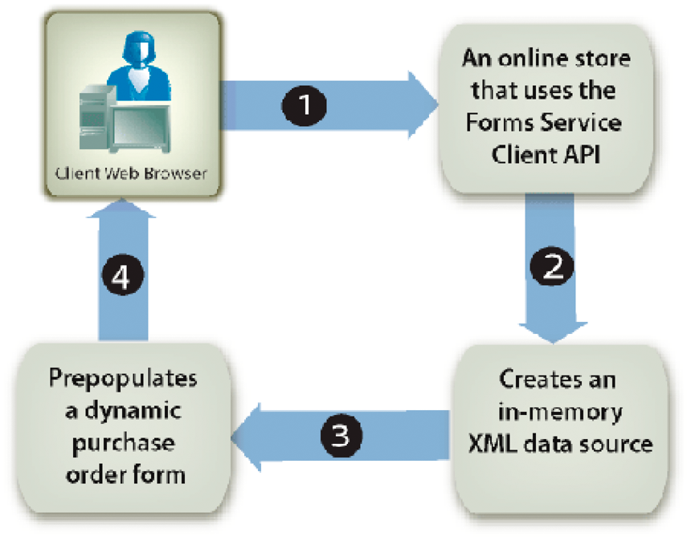

# 使用可流式布局预填充Forms {#prepopulating-forms-with-flowable-layouts1}

## 使用可流式布局预填充Forms {#prepopulating-forms-with-flowable-layouts2}

预填表单可向用户显示呈现的表单中的数据。 例如，假定用户使用用户名和密码登录到网站。 如果身份验证成功，客户端应用程序将查询数据库以获取用户信息。 数据将合并到表单中，然后表单呈现给用户。 因此，用户能够在表单中视图个性化数据。

预填表单具有以下优点：

* 允许用户视图表单中的自定义数据。
* 减少用户填写表单时的键入量。
* 通过控制放置数据的位置来确保数据完整性。

以下两个XML数据源可以预填充表单：

* 一个XDP数据源，它是符合XFA语法(或XFDF数据以预填充使用Acrobat创建的表单)的XML。
* 一个任意XML数据源，其中包含与表单的字段名称匹配的名称/值对（本节中的示例使用一个任意XML数据源）。

要预填充的每个表单域都必须存在XML元素。 XML元素名称必须与字段名称匹配。 如果XML元素与表单域不对应，或XML元素名称与域名称不匹配，则忽略该元素。 只要指定了所有XML元素，就不必与XML元素的显示顺序匹配。

预填充已包含数据的表单时，必须指定XML数据源中已显示的数据。 假设一个包含10个字段的表单在四个字段中包含数据。 接下来，假设您要预填充其余六个字段。 在这种情况下，必须在用于预填充表单的XML数据源中指定10个XML元素。 如果仅指定六个元素，则原始的四个字段为空。

例如，您可以预填表单，如示例确认表单。 (请参阅[渲染交互式PDF forms](/help/forms/developing/rendering-interactive-pdf-forms.md)中的“确认表单”。)

要预填充示例确认表单，您必须创建一个XML数据源，该数据源包含三个与表单中三个字段匹配的XML元素。 此表单包含以下三个字段：`FirstName`、`LastName`和`Amount`。 第一步是创建一个XML数据源，它包含与表单设计中的字段相匹配的XML元素。 下一步是向XML元素分配数据值，如以下XML代码所示。

```xml
     <Untitled>
         <FirstName>Jerry</FirstName>
         <LastName>Johnson</LastName>
         <Amount>250000</Amount>
     </Untitled>
```

在您用此XML数据源预填充确认表单，然后渲染表单后，将显示您分配给XML元素的数据值，如下图所示。


### 使用可流式布局{#prepopulating_forms_with_flowable_layouts-1}预填表单

具有可流式布局的Forms对于向用户显示未确定数量的数据很有用。 由于表单的布局会根据合并后的数据量自动调整，因此您无需像处理具有固定布局的表单那样为表单预先确定固定布局或页数。

表单通常填充在运行时获取的数据。 因此，您可以通过创建内存中的XML数据源并将数据直接放入内存中的XML数据源来预填充表单。

考虑一个基于Web的应用程序，如在线商店。 在线购物者完成购买项目后，所有购买的项目将放入用于预填充表单的内存中XML数据源中。 下图显示了此过程，如图后的表中所述。



下表介绍了此图中的步骤。

<table>
 <thead>
  <tr>
   <th><p>步骤</p></th>
   <th><p>描述</p></th>
  </tr>
 </thead>
 <tbody>
  <tr>
   <td><p>1</p></td>
   <td><p>用户从基于Web的在线商店购买商品。 </p></td>
  </tr>
  <tr>
   <td><p>2</p></td>
   <td><p>用户完成购买项目并单击“提交”按钮后，将创建内存中的XML数据源。 购买的物品和用户信息将放入内存中的XML数据源中。 </p></td>
  </tr>
  <tr>
   <td><p>3</p></td>
   <td><p>XML数据源用于预填充采购订单表单（此表格下方显示了此表单的示例）。 </p></td>
  </tr>
  <tr>
   <td><p>4</p></td>
   <td><p>采购订单表将呈现给客户端Web浏览器。 </p></td>
  </tr>
 </tbody>
</table>

下图显示了采购订单表单的示例。 表中的信息可以根据XML数据中的记录数进行调整。


>[!NOTE]
>
>表单可以预先填充来自其他来源（如企业数据库或外部应用程序）的数据。

### 表单设计注意事项{#form-design-considerations}

Forms具有可流动布局，它基于在Designer中创建的表单设计。 表单设计指定一组布局、表示和数据捕获规则，包括基于用户输入计算值。 将数据输入表单时，将应用规则。 添加到表单的字段是表单设计中的子表单。 例如，在上一图中显示的采购订单表单中，每行都是子表单。 有关创建包含子表单的表单设计的信息，请参阅[创建具有可流式布局的采购订单表单](https://www.adobe.com/go/learn_aemforms_qs_poformflowable_9)。

### 了解数据子组{#understanding-data-subgroups}

XML数据源用于用固定布局和可流式布局预填充表单。 但是，区别在于，用可流式布局预填充表单的XML数据源包含重复的XML元素，这些元素用于预填充表单中重复的子表单。 这些重复的XML元素称为数据子组。

用于预填充上图中所示的采购订单表单的XML数据源包含四个重复数据子组。 每个数据子组对应于购买的项目。 购买的物品包括显示器、台灯、电话和通讯簿。

以下XML数据源用于预填充采购订单表单。

```xml
     <header>
         <!-- XML elements used to prepopulate non-repeating fields such as address
         <!and city
         <txtPONum>8745236985</txtPONum>
         <dtmDate>2004-02-08</dtmDate>
         <txtOrderedByCompanyName>Any Company Name</txtOrderedByCompanyName>
         <txtOrderedByAddress>555, Any Blvd.</txtOrderedByAddress>
         <txtOrderedByCity>Any City</txtOrderedByCity>
         <txtOrderedByStateProv>ST</txtOrderedByStateProv>
         <txtOrderedByZipCode>12345</txtOrderedByZipCode>
         <txtOrderedByCountry>Any Country</txtOrderedByCountry>
         <txtOrderedByPhone>(123) 456-7890</txtOrderedByPhone>
         <txtOrderedByFax>(123) 456-7899</txtOrderedByFax>
         <txtOrderedByContactName>Contact Name</txtOrderedByContactName>
         <txtDeliverToCompanyName>Any Company Name</txtDeliverToCompanyName>
         <txtDeliverToAddress>7895, Any Street</txtDeliverToAddress>
         <txtDeliverToCity>Any City</txtDeliverToCity>
         <txtDeliverToStateProv>ST</txtDeliverToStateProv>
         <txtDeliverToZipCode>12346</txtDeliverToZipCode>
         <txtDeliverToCountry>Any Country</txtDeliverToCountry>
         <txtDeliverToPhone>(123) 456-7891</txtDeliverToPhone>
         <txtDeliverToFax>(123) 456-7899</txtDeliverToFax>
         <txtDeliverToContactName>Contact Name</txtDeliverToContactName>
     </header>
     <detail>
         <!-- A data subgroup that contains information about the monitor>
         <txtPartNum>00010-100</txtPartNum>
         <txtDescription>Monitor</txtDescription>
         <numQty>1</numQty>
         <numUnitPrice>350.00</numUnitPrice>
     </detail>
     <detail>
         <!-- A data subgroup that contains information about the desk lamp>
         <txtPartNum>00010-200</txtPartNum>
         <txtDescription>Desk lamps</txtDescription>
         <numQty>3</numQty>
         <numUnitPrice>55.00</numUnitPrice>
     </detail>
     <detail>
         <!-- A data subgroup that contains information about the Phone>
             <txtPartNum>00025-275</txtPartNum>
             <txtDescription>Phone</txtDescription>
             <numQty>5</numQty>
             <numUnitPrice>85.00</numUnitPrice>
     </detail>
     <detail>
         <!-- A data subgroup that contains information about the address book>
         <txtPartNum>00300-896</txtPartNum>
         <txtDescription>Address book</txtDescription>
         <numQty>2</numQty>
         <numUnitPrice>15.00</numUnitPrice>
     </detail>
```

请注意，每个数据子组都包含四个与此信息对应的XML元素：

* 物料部件号
* 项目说明
* 物料数量
* 单价

数据子组的父XML元素的名称必须与位于表单设计中的子表单的名称匹配。 例如，在上一图中，请注意数据子组的父XML元素的名称是`detail`。 这与采购订单表单所基于的表单设计中子表单的名称相对应。 如果数据子组的父XML元素的名称与子表单不匹配，则不预填充服务器端表单。

每个数据子组必须包含与子表单中的字段名称匹配的XML元素。 位于表单设计中的`detail`子表单包含以下字段：

* txtPartNum
* txtDescription
* numQty
* numUnitPrice

>[!NOTE]
>
>如果尝试用包含重复XML元素的数据源预填充表单，并将`RenderAtClient`选项设置为`No`，则只有第一个数据记录合并到表单中。 要确保所有数据记录都合并到表单中，请将`RenderAtClient`设置为`Yes`。 有关`RenderAtClient`选项的信息，请参阅在Client](/help/forms/developing/rendering-forms-client.md)上渲染Forms。[

>[!NOTE]
>
>有关Forms服务的详细信息，请参阅[AEM Forms](https://www.adobe.com/go/learn_aemforms_services_63)的服务参考。

### 步骤{#summary-of-steps}的摘要

要使用可流式布局预填充表单，请执行以下任务:

1. 包括项目文件。
1. 创建内存中的XML数据源。
1. 转换XML数据源。
1. 渲染预填充的表单。

**包括项目文件**

在开发项目中包含必要的文件。 如果要使用Java创建客户端应用程序，请包含必要的JAR文件。 如果您使用Web服务，请确保包含代理文件。

**包括项目文件**

在开发项目中包含必要的文件。 如果要使用Java创建客户端应用程序，请包含必要的JAR文件。 如果您使用Web服务，请确保包含代理文件。

**创建内存中的XML数据源**

可以使用`org.w3c.dom`类创建内存中的XML数据源，以使用可流式布局预填充表单。 必须将数据放入符合表单的XML数据源中。 有关具有可流式布局的表单与XML数据源之间关系的信息，请参阅[了解数据子组](#understanding-data-subgroups)。

**转换XML数据源**

使用`org.w3c.dom`类创建的内存中XML数据源可以转换为`com.adobe.idp.Document`对象，然后才能用于预填充表单。 内存中的XML数据源可以使用Java XML转换类进行转换。

>[!NOTE]
>
>如果使用Forms服务的WSDL预填充表单，则必须将`org.w3c.dom.Document`对象转换为`BLOB`对象。

**渲染预填充的表单**

您渲染预填充的表单就像渲染其他表单一样。 唯一的区别是您使用包含XML数据源的`com.adobe.idp.Document`对象预填充表单。

**另请参阅**

[包括AEM Forms Java库文件](/help/forms/developing/invoking-aem-forms-using-java.md#including-aem-forms-java-library-files)

[设置连接属性](/help/forms/developing/invoking-aem-forms-using-java.md#setting-connection-properties)

[Forms Service API快速开始](/help/forms/developing/forms-service-api-quick-starts.md#forms-service-api-quick-starts)

[渲染交互式PDF forms](/help/forms/developing/rendering-interactive-pdf-forms.md)

[创建渲染Forms的Web 应用程序](/help/forms/developing/creating-web-applications-renders-forms.md)

### 使用Java API {#prepopulating-forms-using-the-java-api}预填表单

要使用Forms API(Java)预填充具有可流式布局的表单，请执行以下步骤：

1. 包括项目文件

   在Java项目的类路径中包含客户端JAR文件，如adobe-forms-client.jar。 有关这些文件位置的信息，请参阅[包括AEM Forms Java库文件](/help/forms/developing/invoking-aem-forms-using-java.md#including-aem-forms-java-library-files)。

1. 创建内存中的XML数据源

   * 通过调用`DocumentBuilderFactory`类`newInstance`方法创建Java `DocumentBuilderFactory`对象。
   * 通过调用`DocumentBuilderFactory`对象的`newDocumentBuilder`方法创建Java `DocumentBuilder`对象。
   * 调用`DocumentBuilder`对象的`newDocument`方法来实例化`org.w3c.dom.Document`对象。
   * 通过调用`org.w3c.dom.Document`对象的`createElement`方法创建XML数据源的根元素。 这将创建一个表示根元素的`Element`对象。 将表示元素名称的字符串值传递给`createElement`方法。 将返回值转换为`Element`。 接下来，通过调用`Document`对象的`appendChild`方法将根元素追加到文档，并将根元素对象作为参数传递。 以下几行代码显示此应用程序逻辑：

      ` Element root = (Element)document.createElement("transaction");  document.appendChild(root);`

   * 通过调用`Document`对象的`createElement`方法，创建XML数据源的头元素。 将表示元素名称的字符串值传递给`createElement`方法。 将返回值转换为`Element`。 接下来，通过调用`root`对象的`appendChild`方法将头元素追加到根元素，并将头元素对象作为参数传递。 附加到标题元素的XML元素与表单的静态部分相对应。 以下几行代码显示此应用程序逻辑：

      ` Element header = (Element)document.createElement("header");  root.appendChild(header);`

   * 通过调用`Document`对象的`createElement`方法创建属于标题元素的子元素，并传递一个表示元素名称的字符串值。 将返回值转换为`Element`。 接下来，通过调用子元素的`appendChild`方法为其设置值，并将`Document`对象的`createTextNode`方法作为参数传递。 指定显示为子元素值的字符串值。 最后，通过调用标题元素的`appendChild`方法将子元素追加到标题元素，并将子元素对象作为参数传递。 以下几行代码显示此应用程序逻辑：

      ` Element poNum= (Element)document.createElement("txtPONum");  poNum.appendChild(document.createTextNode("8745236985"));  header.appendChild(LastName);`


   * 通过重复表单静态部分中显示的每个字段的最后一个子步骤，将所有剩余元素添加到标题元素(在XML数据源图中，这些字段显示在A节中。（请参阅[了解数据子组](#understanding-data-subgroups)）。
   * 通过调用`Document`对象的`createElement`方法，创建XML数据源的detail元素。 将表示元素名称的字符串值传递给`createElement`方法。 将返回值转换为`Element`。 接下来，通过调用`root`对象的`appendChild`方法将detail元素追加到根元素，并将detail元素对象作为参数传递。 附加到detail元素的XML元素与表单的动态部分相对应。 以下几行代码显示此应用程序逻辑：

      ` Element detail = (Element)document.createElement("detail");  root.appendChild(detail);`

   * 通过调用`Document`对象的`createElement`方法创建属于detail元素的子元素，并传递一个表示元素名称的字符串值。 将返回值转换为`Element`。 接下来，通过调用子元素的`appendChild`方法为其设置值，并将`Document`对象的`createTextNode`方法作为参数传递。 指定显示为子元素值的字符串值。 最后，通过调用detail元素的`appendChild`方法将子元素追加到detail元素，并将子元素对象作为参数传递。 以下几行代码显示此应用程序逻辑：

      ` Element txtPartNum = (Element)document.createElement("txtPartNum");  txtPartNum.appendChild(document.createTextNode("00010-100"));  detail.appendChild(txtPartNum);`

   * 对所有XML元素重复最后一个子步骤，以附加到detail元素。 要正确创建用于填充采购订单表单的XML数据源，您必须将以下XML元素附加到详细信息元素：`txtDescription`、`numQty`和`numUnitPrice`。
   * 对用于预填充表单的所有数据项重复最后两个子步骤。

1. 转换XML数据源

   * 通过调用`javax.xml.transform.Transformer`对象的静态`newInstance`方法创建`javax.xml.transform.Transformer`对象。
   * 通过调用`TransformerFactory`对象的`newTransformer`方法创建`Transformer`对象。
   * 使用`ByteArrayOutputStream`对象的构造函数创建对象。
   * 使用`javax.xml.transform.dom.DOMSource`对象的构造函数并传递在步骤1中创建的`org.w3c.dom.Document`对象，创建对象。
   * 使用`javax.xml.transform.dom.DOMSource`对象的构造函数并传递`ByteArrayOutputStream`对象，创建对象。
   * 通过调用`javax.xml.transform.Transformer`对象的`transform`方法并传递`javax.xml.transform.dom.DOMSource`和`javax.xml.transform.stream.StreamResult`对象，填充Java `ByteArrayOutputStream`对象。
   * 创建一个字节数组，并将`ByteArrayOutputStream`对象的大小分配给字节数组。
   * 通过调用`ByteArrayOutputStream`对象的`toByteArray`方法填充字节数组。
   * 使用`com.adobe.idp.Document`对象的构造函数并传递字节数组，创建对象。

1. 渲染预填充的表单

   调用`FormsServiceClient`对象的`renderPDFForm`方法并传递以下值：

   * 一个字符串值，它指定表单设计名称，包括文件扩展名。
   * `com.adobe.idp.Document`对象，其中包含要与表单合并的数据。 确保使用在步骤1和步骤2中创建的`com.adobe.idp.Document`对象。
   * 存储运行时选项的`PDFFormRenderSpec`对象。
   * `URLSpec`对象，其中包含Forms服务所需的URI值。
   * 存储文件附件的`java.util.HashMap`对象。 这是可选参数，如果不想将文件附加到表单，可以指定`null`。

   `renderPDFForm`方法返回一个`FormsResult`对象，该对象包含必须写入客户端Web浏览器的表单数据流。

   * 创建一个`javax.servlet.ServletOutputStream`对象，用于将表单数据流发送到客户端Web浏览器。
   * 通过调用`FormsResult`对象&#39;s `getOutputContent`方法创建`com.adobe.idp.Document`对象。
   * 通过调用`com.adobe.idp.Document`对象的`getInputStream`方法创建`java.io.InputStream`对象。
   * 通过调用`InputStream`对象的`read`方法并将字节数组作为参数传递，创建一个用表单数据流填充它的字节数组。
   * 调用`javax.servlet.ServletOutputStream`对象的`write`方法，将表单数据流发送到客户端Web浏览器。 将字节数组传递给`write`方法。


**另请参阅**

[快速开始（SOAP模式）：使用Java API使用可流式布局预填充Forms](/help/forms/developing/forms-service-api-quick-starts.md#quick-start-soap-mode-prepopulating-forms-with-flowable-layouts-using-the-java-api)

[包括AEM Forms Java库文件](/help/forms/developing/invoking-aem-forms-using-java.md#including-aem-forms-java-library-files)

[设置连接属性](/help/forms/developing/invoking-aem-forms-using-java.md#setting-connection-properties)

### 使用Web服务API {#prepopulating-forms-using-the-web-service-api}预填表单

要使用Forms API（Web服务）使用可流式布局预填充表单，请执行以下步骤：

1. 包括项目文件

   * 创建使用Forms服务WSDL的Java代理类。 （请参阅[使用Apache Axis](/help/forms/developing/invoking-aem-forms-using-web.md#creating-java-proxy-classes-using-apache-axis)创建Java代理类。）
   * 将Java代理类包含到类路径中。

1. 创建内存中的XML数据源

   * 通过调用`DocumentBuilderFactory`类`newInstance`方法创建Java `DocumentBuilderFactory`对象。
   * 通过调用`DocumentBuilderFactory`对象的`newDocumentBuilder`方法创建Java `DocumentBuilder`对象。
   * 调用`DocumentBuilder`对象的`newDocument`方法来实例化`org.w3c.dom.Document`对象。
   * 通过调用`org.w3c.dom.Document`对象的`createElement`方法创建XML数据源的根元素。 这将创建一个表示根元素的`Element`对象。 将表示元素名称的字符串值传递给`createElement`方法。 将返回值转换为`Element`。 接下来，通过调用`Document`对象的`appendChild`方法将根元素追加到文档，并将根元素对象作为参数传递。 以下几行代码显示此应用程序逻辑：

      ` Element root = (Element)document.createElement("transaction");  document.appendChild(root);`

   * 通过调用`Document`对象的`createElement`方法，创建XML数据源的头元素。 将表示元素名称的字符串值传递给`createElement`方法。 将返回值转换为`Element`。 接下来，通过调用`root`对象的`appendChild`方法将头元素追加到根元素，并将头元素对象作为参数传递。 附加到标题元素的XML元素与表单的静态部分相对应。 以下几行代码显示此应用程序逻辑：

      ` Element header = (Element)document.createElement("header");  root.appendChild(header);`

   * 通过调用`Document`对象的`createElement`方法创建属于标题元素的子元素，并传递一个表示元素名称的字符串值。 将返回值转换为`Element`。 接下来，通过调用子元素的`appendChild`方法为其设置值，并将`Document`对象的`createTextNode`方法作为参数传递。 指定显示为子元素值的字符串值。 最后，通过调用标题元素的`appendChild`方法将子元素追加到标题元素，并将子元素对象作为参数传递。 以下几行代码显示此应用程序逻辑：

      ` Element poNum= (Element)document.createElement("txtPONum");  poNum.appendChild(document.createTextNode("8745236985"));  header.appendChild(LastName);`

   * 通过重复表单静态部分中显示的每个字段的最后一个子步骤，将所有剩余元素添加到标题元素(在XML数据源图中，这些字段显示在A节中。（请参阅[了解数据子组](#understanding-data-subgroups)）。
   * 通过调用`Document`对象的`createElement`方法，创建XML数据源的detail元素。 将表示元素名称的字符串值传递给`createElement`方法。 将返回值转换为`Element`。 接下来，通过调用`root`对象的`appendChild`方法将detail元素追加到根元素，并将detail元素对象作为参数传递。 附加到detail元素的XML元素与表单的动态部分相对应。 以下几行代码显示此应用程序逻辑：

      ` Element detail = (Element)document.createElement("detail");  root.appendChild(detail);`

   * 通过调用`Document`对象的`createElement`方法创建属于detail元素的子元素，并传递一个表示元素名称的字符串值。 将返回值转换为`Element`。 接下来，通过调用子元素的`appendChild`方法为其设置值，并将`Document`对象的`createTextNode`方法作为参数传递。 指定显示为子元素值的字符串值。 最后，通过调用detail元素的`appendChild`方法将子元素追加到detail元素，并将子元素对象作为参数传递。 以下几行代码显示此应用程序逻辑：

      ` Element txtPartNum = (Element)document.createElement("txtPartNum");  txtPartNum.appendChild(document.createTextNode("00010-100"));  detail.appendChild(txtPartNum);`

   * 对所有XML元素重复最后一个子步骤，以附加到detail元素。 要正确创建用于填充采购订单表单的XML数据源，您必须将以下XML元素附加到详细信息元素：`txtDescription`、`numQty`和`numUnitPrice`。
   * 对用于预填充表单的所有数据项重复最后两个子步骤。

1. 转换XML数据源

   * 通过调用`javax.xml.transform.Transformer`对象的静态`newInstance`方法创建`javax.xml.transform.Transformer`对象。
   * 通过调用`TransformerFactory`对象的`newTransformer`方法创建`Transformer`对象。
   * 使用`ByteArrayOutputStream`对象的构造函数创建对象。
   * 使用`javax.xml.transform.dom.DOMSource`对象的构造函数并传递在步骤1中创建的`org.w3c.dom.Document`对象，创建对象。
   * 使用`javax.xml.transform.dom.DOMSource`对象的构造函数并传递`ByteArrayOutputStream`对象，创建对象。
   * 通过调用`javax.xml.transform.Transformer`对象的`transform`方法并传递`javax.xml.transform.dom.DOMSource`和`javax.xml.transform.stream.StreamResult`对象，填充Java `ByteArrayOutputStream`对象。
   * 创建一个字节数组，并将`ByteArrayOutputStream`对象的大小分配给字节数组。
   * 通过调用`ByteArrayOutputStream`对象的`toByteArray`方法填充字节数组。
   * 使用`BLOB`对象的构造函数创建一个`setBinaryData`对象，并调用其方法并传递字节数组。

1. 渲染预填充的表单

   调用`FormsService`对象的`renderPDFForm`方法并传递以下值：

   * 一个字符串值，它指定表单设计名称，包括文件扩展名。
   * `BLOB`对象，其中包含要与表单合并的数据。 确保使用在步骤1和步骤2中创建的`BLOB`对象。
   * 存储运行时选项的`PDFFormRenderSpecc`对象。 有关详细信息，请参阅[AEM Forms API参考](https://www.adobe.com/go/learn_aemforms_javadocs_63_en)。
   * `URLSpec`对象，其中包含Forms服务所需的URI值。
   * 存储文件附件的`java.util.HashMap`对象。 这是可选参数，如果不想将文件附加到表单，可以指定`null`。
   * 由方法填充的空`com.adobe.idp.services.holders.BLOBHolder`对象。 用于存储渲染后的PDF表单。
   * 由方法填充的空`javax.xml.rpc.holders.LongHolder`对象。 （此参数将存储表单中的页数）。
   * 由方法填充的空`javax.xml.rpc.holders.StringHolder`对象。 （此参数将存储区域设置值）。
   * 将包含此操作结果的空`com.adobe.idp.services.holders.FormsResultHolder`对象。

   `renderPDFForm`方法使用必须写入客户端Web浏览器的表单数据流填充作为最后一个参数值传递的`com.adobe.idp.services.holders.FormsResultHolder`对象。

   * 通过获取`com.adobe.idp.services.holders.FormsResultHolder`对象的`value`数据成员的值，创建`FormResult`对象。
   * 通过调用`FormsResult`对象的`getOutputContent`方法，创建一个包含表单数据的`BLOB`对象。
   * 通过调用`getContentType`方法获取`BLOB`对象的内容类型。
   * 通过调用`setContentType`方法并传递`BLOB`对象的内容类型，设置`javax.servlet.http.HttpServletResponse`对象的内容类型。
   * 通过调用`javax.servlet.http.HttpServletResponse`对象的`getOutputStream`方法，创建一个用于将表单数据流写入客户端Web浏览器的`javax.servlet.ServletOutputStream`对象。
   * 创建一个字节数组，并通过调用`BLOB`对象的`getBinaryData`方法填充它。 此任务将`FormsResult`对象的内容分配给字节数组。
   * 调用`javax.servlet.http.HttpServletResponse`对象的`write`方法，将表单数据流发送到客户端Web浏览器。 将字节数组传递给`write`方法。

   >[!NOTE]
   >
   >`renderPDFForm`方法使用必须写入客户端Web浏览器的表单数据流填充作为最后一个参数值传递的`com.adobe.idp.services.holders.FormsResultHolder`对象。

**另请参阅**

[使用Base64编码调用AEM Forms](/help/forms/developing/invoking-aem-forms-using-web.md#invoking-aem-forms-using-base64-encoding)

