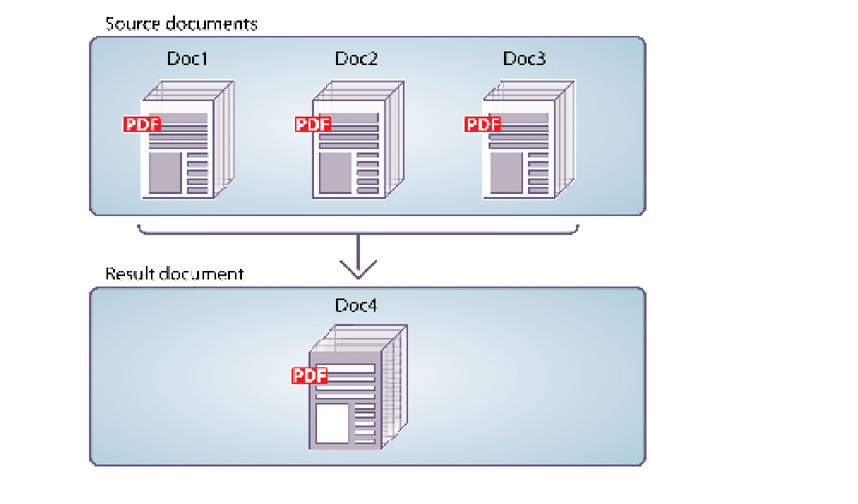

# 以编程方式组合PDF文档 {#programmatically-assembling-pdf-documents}

**本文档中的示例和示例仅适用于JEE环境上的AEM Forms。**

您可以使用Assembler服务API将多个PDF文档组合到单个PDF文档中。 下图显示三个PDF文档合并到单个PDF文档中。



要将两个或多个PDF文档组合为单个PDF文档，您需要一个DDX文档。 DDX文档描述了Assembler服务生成的PDF文档。 即，DDX文档会指示Assembler服务要执行的操作。

为了进行此讨论，假定使用以下DDX文档。

```xml
 <?xml version="1.0" encoding="UTF-8"?>
 <DDX xmlns="https://ns.adobe.com/DDX/1.0/">
     <PDF result="out.pdf">
         <PDF source="map.pdf" />
         <PDF source="directions.pdf" />
     </PDF>
 </DDX>
```

此DDX文档将两个名为&#x200B;*map.pdf*&#x200B;和&#x200B;*directions.pdf*&#x200B;的PDF文档合并为一个PDF文档。

>[!NOTE]
>
>要查看可拆分PDF文档的DDX文档，请参阅[以编程方式拆分PDF文档](/help/forms/developing/programmatically-disassembling-pdf-documents.md#programmatically-disassembling-pdf-documents)。

>[!NOTE]
>
>有关Assembler服务的详细信息，请参阅[AEM Forms的服务参考](https://www.adobe.com/go/learn_aemforms_services_63)。

>[!NOTE]
>
>有关DDX文档的更多信息，请参阅[汇编程序服务和DDX引用](https://www.adobe.com/go/learn_aemforms_ddx_63)。

## 使用Web服务调用Assembler服务时的注意事项 {#considerations-when-invoking-assembler-service-using-web-services}

在组合大型文档期间添加页眉和页脚时，可能会遇到`OutOfMemory`错误，并且无法组合文件。 为了减少出现此问题的可能性，请向您的DDX文档添加`DDXProcessorSetting`元素，如以下示例所示。

`<DDXProcessorSetting name="checkpoint" value="2000" />`

您可以添加此元素作为`DDX`元素的子元素或`PDF result`元素的子元素。 此设置的默认值为0（零），这将关闭检查点，并且DDX的行为就像不存在`DDXProcessorSetting`元素一样。 如果您遇到`OutOfMemory`错误，您可能需要将值设置为整数，通常介于500和5000之间。 较小的检查点值会导致更频繁的检查点操作。

## 步骤摘要 {#summary-of-steps}

要从多个PDF文档组合单个PDF文档，请执行以下任务：

1. 包括项目文件。
1. 创建PDF汇编程序客户端。
1. 引用现有DDX文档。
1. 引用输入PDF文档。
1. 设置运行时选项。
1. 组合输入PDF文档。
1. 提取结果。

**包含项目文件**

在开发项目中包含必要的文件。 如果使用Java创建客户端应用程序，请包含必要的JAR文件。 如果使用Web服务，请确保包含代理文件。

必须将以下JAR文件添加到项目的类路径中：

* adobe-livecycle-client.jar
* adobe-usermanager-client.jar
* adobe-assembler-client.jar
* adobe-utilities.jar(如果在JBoss上部署了AEM Forms，则此为必填字段)
* jbossall-client.jar(如果在JBoss上部署了AEM Forms，则此为必填字段)

如果AEM Forms部署在除JBoss之外的受支持J2EE应用程序服务器上，则必须将adobe-utilities.jar和jbossall-client.jar文件替换为特定于部署AEM Forms的J2EE应用程序服务器的JAR文件。

**创建PDF汇编程序客户端**

您必须先创建一个Assembler客户端，然后才能以编程方式执行Assembler操作。

**引用现有DDX文档**

要组合PDF文档，必须引用DDX文档。 例如，考虑本节介绍的DDX文档。 此DDX文档指示Assembler服务将两个PDF文档合并为一个PDF文档。

**参考输入PDF文档**

引用要传递到Assembler服务的输入PDF文档。 例如，如果要传递两个名为“映射”和“方向”的输入PDF文档，则必须传递相应的PDF文件。

map.pdf文件和directions.pdf文件都必须放置在集合对象中。 密钥的名称必须与DDX文档中PDF源属性的值匹配。 如果DDX文档中的键和源属性匹配，则PDF文件的名称无关紧要。

>[!NOTE]
>
>调用`invokeDDX`操作时返回包含集合对象的`AssemblerResult`对象。 将两个或多个输入PDF文档传递到Assembler服务时，将使用此操作。 但是，如果只将一个输入PDF传递到Assembler服务并且只期望有一个返回文档，则调用`invokeOneDocument`操作。 调用此操作时，将返回单个文档。 有关使用此操作的信息，请参阅[汇编加密的PDF文档](/help/forms/developing/assembling-encrypted-pdf-documents.md#assembling-encrypted-pdf-documents)。

**设置运行时选项**

您可以设置运行时选项，以控制Assembler服务执行作业时的行为。 例如，您可以设置一个选项，在遇到错误时指示Assembler服务继续处理作业。 有关可设置的运行时选项的信息，请参阅[AEM Forms API引用](https://www.adobe.com/go/learn_aemforms_javadocs_63_en)中的`AssemblerOptionSpec`类引用。

**汇编输入PDF文档**

在创建服务客户端、引用DDX文件、创建存储输入PDF文档的集合对象并设置运行时选项之后，可以调用DDX操作。 使用本节中指定的DDX文档时，map.pdf和direction.pdf文件将合并到一个PDF文档中。

**提取结果**

Assembler服务返回一个`java.util.Map`对象，该对象可以从`AssemblerResult`对象中获取，并且包含操作结果。 返回的`java.util.Map`对象包含结果文档和任何异常。

下表汇总了在返回的`java.util.Map`对象中可以包含的一些键值和对象类型。

<table>
 <thead>
  <tr>
   <th><p>键值</p></th>
   <th><p>对象类型</p></th>
   <th><p>描述</p></th>
  </tr>
 </thead>
 <tbody>
  <tr>
   <td><p><code><i>documentName</i></code></p></td>
   <td><p><code>com.adobe.idp.Document</code></p></td>
   <td><p>包含在DDX生成元素中指定的生成文档</p></td>
  </tr>
  <tr>
   <td><p><code><i>documentName</i></code></p></td>
   <td><p><code>Exception</code></p></td>
   <td><p>包含文档的任何例外</p></td>
  </tr>
  <tr>
   <td><p><code>OutputMapConstants.LOG_NAME</code></p></td>
   <td><p><code>com.adobe.idp.Documen</code></p></td>
   <td><p>包含作业日志</p></td>
  </tr>
 </tbody>
</table>

**另请参阅**

[包括AEM Forms Java库文件](/help/forms/developing/invoking-aem-forms-using-java.md#including-aem-forms-java-library-files)

[设置连接属性](/help/forms/developing/invoking-aem-forms-using-java.md#setting-connection-properties)

[以编程方式拆分PDF文档](/help/forms/developing/programmatically-disassembling-pdf-documents.md#programmatically-disassembling-pdf-documents)

## 使用Java API组合PDF文档 {#assemble-pdf-documents-using-the-java-api}

使用Assembler服务API (Java)组合PDF文档：

1. 包括项目文件。

   在您的Java项目的类路径中包含客户端JAR文件，例如adobe-assembler-client.jar。

1. 创建PDF汇编程序客户端。

   * 创建包含连接属性的`ServiceClientFactory`对象。
   * 使用构造函数创建`AssemblerServiceClient`对象并传递`ServiceClientFactory`对象。

1. 引用现有DDX文档。

   * 通过使用其构造函数并传递指定DDX文件位置的字符串值，创建表示DDX文档的`java.io.FileInputStream`对象。
   * 使用对象的构造函数创建`com.adobe.idp.Document`对象并传递`java.io.FileInputStream`对象。

1. 引用输入PDF文档。

   * 使用`HashMap`构造函数创建用于存储输入PDF文档的`java.util.Map`对象。
   * 对于每个输入PDF文档，使用其构造函数并传递输入PDF文档的位置来创建一个`java.io.FileInputStream`对象。
   * 对于每个输入PDF文档，创建一个`com.adobe.idp.Document`对象并传递包含PDF文档的`java.io.FileInputStream`对象。
   * 对于每个输入文档，通过调用其`put`方法并传递以下参数，向`java.util.Map`对象添加一个条目：

      * 表示键名的字符串值。 此值必须与DDX文档中指定的PDF源元素的值匹配。
      * 包含源PDF文档的`com.adobe.idp.Document`对象（或指定多个文档的`java.util.List`对象）。

1. 设置运行时选项。

   * 使用构造函数创建存储运行时选项的`AssemblerOptionSpec`对象。
   * 通过调用属于`AssemblerOptionSpec`对象的方法，设置运行时选项以满足您的业务要求。 例如，要指示Assembler服务在发生错误时继续处理作业，请调用`AssemblerOptionSpec`对象的`setFailOnError`方法并传递`false`。

1. 组合输入PDF文档。

   调用`AssemblerServiceClient`对象的`invokeDDX`方法并传递以下必需值：

   * 表示要使用的DDX文档的`com.adobe.idp.Document`对象
   * 包含要汇编的输入PDF文件的`java.util.Map`对象
   * 指定运行时选项（包括默认字体和作业日志级别）的`com.adobe.livecycle.assembler.client.AssemblerOptionSpec`对象

   `invokeDDX`方法返回包含作业结果和发生的任何异常的`com.adobe.livecycle.assembler.client.AssemblerResult`对象。

1. 提取结果。

   要获取新创建的PDF文档，请执行下列操作：

   * 调用`AssemblerResult`对象的`getDocuments`方法。 这将返回`java.util.Map`对象。
   * 反复查找`java.util.Map`对象，直到找到结果`com.adobe.idp.Document`对象。 (可以使用DDX文档中指定的PDF结果元素来获取文档。)
   * 调用`com.adobe.idp.Document`对象的`copyToFile`方法来提取PDF文档。

   >[!NOTE]
   >
   >如果将`LOG_LEVEL`设置为生成日志，则可以使用`AssemblerResult`对象的`getJobLog`方法提取日志。

**另请参阅**

[快速入门(SOAP模式)：使用Java API组合PDF文档](/help/forms/developing/assembler-service-java-api-quick.md#quick-start-soap-mode-assembling-a-pdf-document-using-the-java-api)

[包括AEM Forms Java库文件](/help/forms/developing/invoking-aem-forms-using-java.md#including-aem-forms-java-library-files)

[设置连接属性](/help/forms/developing/invoking-aem-forms-using-java.md#setting-connection-properties)

## 使用Web服务API组合PDF文档 {#assemble-pdf-documents-using-the-web-service-api}

使用Assembler服务API（Web服务）组合PDF文档：

1. 包括项目文件。

   创建使用MTOM的Microsoft .NET项目。 确保使用以下WSDL定义： `http://localhost:8080/soap/services/AssemblerService?WSDL&lc_version=9.0.1`。

   >[!NOTE]
   >
   >将`localhost`替换为承载AEM Forms的服务器的IP地址。

1. 创建PDF汇编程序客户端。

   * 使用默认构造函数创建`AssemblerServiceClient`对象。
   * 使用`System.ServiceModel.EndpointAddress`构造函数创建`AssemblerServiceClient.Endpoint.Address`对象。 将指定WSDL的字符串值传递给AEM Forms服务（例如，`http://localhost:8080/soap/services/AssemblerService?blob=mtom`）。 您无需使用`lc_version`属性。 此属性在创建服务引用时使用。
   * 通过获取`AssemblerServiceClient.Endpoint.Binding`字段的值创建一个`System.ServiceModel.BasicHttpBinding`对象。 将返回值强制转换为`BasicHttpBinding`。
   * 将`System.ServiceModel.BasicHttpBinding`对象的`MessageEncoding`字段设置为`WSMessageEncoding.Mtom`。 此值可确保使用MTOM。
   * 通过执行以下任务启用基本HTTP身份验证：

      * 将AEM表单用户名分配给字段`AssemblerServiceClient.ClientCredentials.UserName.UserName`。
      * 将相应的密码值分配给字段`AssemblerServiceClient.ClientCredentials.UserName.Password`。
      * 将常量值`HttpClientCredentialType.Basic`分配给字段`BasicHttpBindingSecurity.Transport.ClientCredentialType`。
      * 将常量值`BasicHttpSecurityMode.TransportCredentialOnly`分配给字段`BasicHttpBindingSecurity.Security.Mode`。

1. 引用现有DDX文档。

   * 使用构造函数创建`BLOB`对象。 `BLOB`对象用于存储DDX文档。
   * 通过调用其构造函数并传递一个字符串值来创建一个`System.IO.FileStream`对象，该字符串值表示DDX文档的文件位置以及打开文件的模式。
   * 创建用于存储`System.IO.FileStream`对象的内容的字节数组。 您可以通过获取`System.IO.FileStream`对象的`Length`属性来确定字节数组的大小。
   * 通过调用`System.IO.FileStream`对象的`Read`方法并传递要读取的字节数组、起始位置和流长度，使用流数据填充字节数组。
   * 使用字节数组的内容指定其`MTOM`属性以填充`BLOB`对象。

1. 引用输入PDF文档。

   * 对于每个输入PDF文档，使用其构造函数创建一个`BLOB`对象。 `BLOB`对象用于存储输入PDF文档。
   * 通过调用其构造函数并传递一个字符串值来创建一个`System.IO.FileStream`对象，该字符串值表示输入PDF文档的文件位置以及打开文件的模式。
   * 创建用于存储`System.IO.FileStream`对象的内容的字节数组。 您可以通过获取`System.IO.FileStream`对象的`Length`属性来确定字节数组的大小。
   * 通过调用`System.IO.FileStream`对象的`Read`方法，使用流数据填充字节数组。 传递字节数组、起始位置和要读取的流长度。
   * 使用字节数组的内容分配其`MTOM`字段以填充`BLOB`对象。
   * 创建`MyMapOf_xsd_string_To_xsd_anyType`对象。 此收藏集对象用于存储输入PDF文档。
   * 对于每个输入PDF文档，创建一个`MyMapOf_xsd_string_To_xsd_anyType_Item`对象。 例如，如果使用两个输入PDF文档，则创建两个`MyMapOf_xsd_string_To_xsd_anyType_Item`对象。
   * 将表示键名的字符串值分配给`MyMapOf_xsd_string_To_xsd_anyType_Item`对象的`key`字段。 此值必须与DDX文档中指定的PDF源元素的值匹配。 (为每个输入PDF文档执行此任务。)
   * 将存储PDF文档的`BLOB`对象分配给`MyMapOf_xsd_string_To_xsd_anyType_Item`对象的`value`字段。 (为每个输入PDF文档执行此任务。)
   * 将`MyMapOf_xsd_string_To_xsd_anyType_Item`对象添加到`MyMapOf_xsd_string_To_xsd_anyType`对象。 调用`MyMapOf_xsd_string_To_xsd_anyType`对象的`Add`方法并传递`MyMapOf_xsd_string_To_xsd_anyType`对象。 (为每个输入PDF文档执行此任务。)

1. 设置运行时选项。

   * 使用构造函数创建存储运行时选项的`AssemblerOptionSpec`对象。
   * 通过为属于`AssemblerOptionSpec`对象的数据成员分配值，设置运行时选项以满足您的业务要求。 例如，要指示Assembler服务在发生错误时继续处理作业，请将`false`分配给`AssemblerOptionSpec`对象的`failOnError`数据成员。

1. 组合输入PDF文档。

   调用`AssemblerServiceClient`对象的`invoke`方法并传递以下值：

   * 表示DDX文档的`BLOB`对象。
   * 包含输入PDF文档的`mapItem`数组。 其键必须与PDF源文件的名称匹配，其值必须是与这些文件对应的`BLOB`对象。
   * 指定运行时选项的`AssemblerOptionSpec`对象。

   `invoke`方法返回一个包含作业结果和可能已发生的任何异常的`AssemblerResult`对象。

1. 提取结果。

   要获取新创建的PDF文档，请执行下列操作：

   * 访问`AssemblerResult`对象的`documents`字段，该字段是包含结果PDF文档的`Map`对象。
   * 循环访问`Map`对象，直到找到与结果文档名称匹配的键。 然后将该数组成员的`value`强制转换为`BLOB`。
   * 通过访问其`BLOB`对象的`MTOM`属性，提取表示PDF文档的二进制数据。 这会返回一个字节数组，您可以将该字节写出到PDF文件中。

   >[!NOTE]
   >
   >如果将`LOG_LEVEL`设置为生成日志，则可以通过获取`AssemblerResult`对象的`jobLog`数据成员的值来提取日志。

**另请参阅**

[使用MTOM调用AEM Forms](/help/forms/developing/invoking-aem-forms-using-web.md#invoking-aem-forms-using-mtom)
