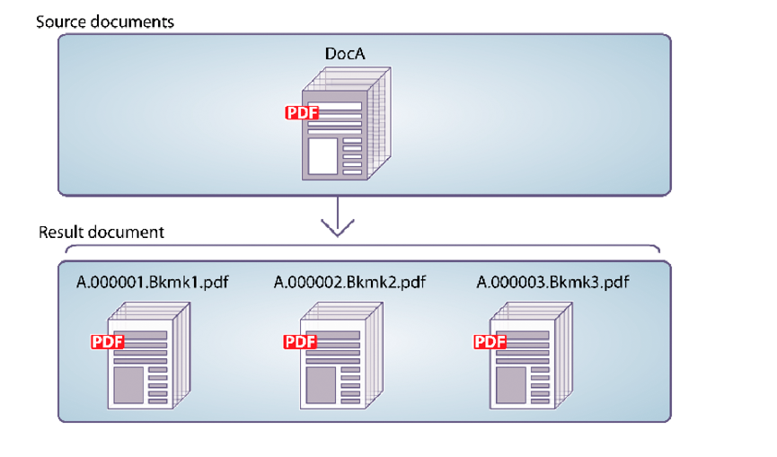

# 以编程方式拆分PDF文档 {#programmatically-disassembling-pdf-documents}

**本文档中的示例和示例仅适用于JEE环境上的AEM Forms。**

通过将PDF文档传递给Assembler服务，可以分解文档。 通常，当PDF文档最初由许多单个文档（如语句集合）创建时，此任务非常有用。 在下图中，DocA被划分为多个结果文档，其中页面上的第一个级别1书签标识了新结果文档的开始。



要拆分PDF文档，请确保`PDFsFromBookmarks`元素位于DDX文档中。 `PDFsFromBookmarks`元素是结果元素，只能是`DDX`元素的子元素。 它没有`result`属性，因为它可能导致生成多个文档。

`PDFsFromBookmarks`元素导致为源文档中的每个1级书签生成单个文档。

为了进行此讨论，假定使用以下DDX文档。

```xml
 <?xml version="1.0" encoding="UTF-8"?>
 <DDX xmlns="https://ns.adobe.com/DDX/1.0/">
      <PDFsFromBookmarks prefix="stmt">
     <PDF source="AssemblerResultPDF.pdf"/>
 </PDFsFromBookmarks>
 </DDX>
```

>[!NOTE]
>
>在阅读本节之前，建议您熟悉使用Assembler服务组合PDF文档。 (请参阅[以编程方式组合PDF文档](/help/forms/developing/programmatically-assembling-pdf-documents.md)。)

>[!NOTE]
>
>将单个PDF文档传递到Assembler服务并取回单个文档时，您可以调用`invokeOneDocument`操作。 但是，要拆分PDF文档，请使用`invokeDDX`操作，因为尽管一个输入PDF文档被传递到Assembler服务，但Assembler服务返回包含一个或多个文档的集合对象。

>[!NOTE]
>
>有关Assembler服务的详细信息，请参阅[AEM Forms的服务参考](https://www.adobe.com/go/learn_aemforms_services_63)。

>[!NOTE]
>
>有关DDX文档的更多信息，请参阅[汇编程序服务和DDX引用](https://www.adobe.com/go/learn_aemforms_ddx_63)。

## 步骤摘要 {#summary-of-steps}

要拆分PDF文档，请执行以下任务：

1. 包括项目文件。
1. 创建PDF汇编程序客户端。
1. 引用现有DDX文档。
1. 参照要拆解的PDF文档。
1. 设置运行时选项。
1. 拆分PDF文档。
1. 保存已拆解的PDF文档。

**包含项目文件**

在开发项目中包含必要的文件。 如果使用Java创建客户端应用程序，请包含必要的JAR文件。 如果使用Web服务，请确保包含代理文件。

必须将以下JAR文件添加到项目的类路径中：

* adobe-livecycle-client.jar
* adobe-usermanager-client.jar
* adobe-assembler-client.jar
* adobe-utilities.jar(如果在JBoss上部署了AEM Forms，则此为必填字段)
* jbossall-client.jar(如果在JBoss上部署了AEM Forms，则此为必填字段)

如果将AEM Forms部署在受支持的J2EE应用程序服务器（不是JBoss）上，则必须将adobe-utilities.jar和jbossall-client.jar替换为特定于部署AEM Forms的J2EE应用程序服务器的JAR文件。

**创建PDF汇编程序客户端**

您必须先创建一个Assembler服务客户端，然后才能以编程方式执行Assembler操作。

**引用现有DDX文档**

要拆分PDF文档，必须引用DDX文档。 此DDX文档必须包含`PDFsFromBookmarks`元素。

**引用PDF文档进行拆分**

要拆分PDF文档，请引用表示要拆分PDF文档的PDF文件。 当传递到Assembler服务时，将为文档中的每个1级书签返回一个单独的PDF文档。

**设置运行时选项**

您可以设置运行时选项，以控制Assembler服务执行作业时的行为。 例如，您可以设置一个选项，在遇到错误时指示Assembler服务继续处理作业。

**拆分PDF文档**

在创建Assembler服务客户端、引用DDX文档、引用PDF文档进行拆分，并设置运行时选项之后，可以通过调用`invokeDDX`方法来拆分PDF文档。 只要DDX文档包含拆卸PDF文档的指令，Assembler服务就会返回收集对象中的拆卸PDF文档。

**保存已拆解的PDF文档**

所有已拆解的PDF文档都会在集合对象中返回。 循环访问收藏集对象并将每个PDF文档另存为PDF文件。

**另请参阅**

[包括AEM Forms Java库文件](/help/forms/developing/invoking-aem-forms-using-java.md#including-aem-forms-java-library-files)

[设置连接属性](/help/forms/developing/invoking-aem-forms-using-java.md#setting-connection-properties)

[以编程方式组合PDF文档](/help/forms/developing/programmatically-assembling-pdf-documents.md)

## 使用Java API拆分PDF文档 {#disassemble-a-pdf-document-using-the-java-api}

使用Assembler服务API (Java)拆分PDF文档：

1. 包括项目文件。

   在您的Java项目的类路径中包含客户端JAR文件，例如adobe-assembler-client.jar。

1. 创建PDF汇编程序客户端。

   * 创建包含连接属性的`ServiceClientFactory`对象。
   * 使用构造函数创建`AssemblerServiceClient`对象并传递`ServiceClientFactory`对象。

1. 引用现有DDX文档。

   * 通过使用其构造函数并传递指定DDX文件位置的字符串值，创建表示DDX文档的`java.io.FileInputStream`对象。
   * 使用对象的构造函数创建`com.adobe.idp.Document`对象并传递`java.io.FileInputStream`对象。

1. 参照要拆解的PDF文档。

   * 使用`HashMap`构造函数创建用于存储输入PDF文档的`java.util.Map`对象。
   * 使用对象的构造函数创建`java.io.FileInputStream`对象，并传递要拆解的PDF文档的位置。
   * 创建一个`com.adobe.idp.Document`对象，并将包含PDF文档的`java.io.FileInputStream`对象传递给拆分。
   * 通过调用其`put`方法并传递以下参数，向`java.util.Map`对象添加一个条目：

      * 表示键名的字符串值。 此值必须与DDX文档中指定的PDF源元素的值匹配。
      * 包含要拆解的PDF文档的`com.adobe.idp.Document`对象。

1. 设置运行时选项。

   * 使用构造函数创建存储运行时选项的`AssemblerOptionSpec`对象。
   * 通过调用属于`AssemblerOptionSpec`对象的方法，设置运行时选项以满足您的业务要求。 例如，要指示Assembler服务在发生错误时继续处理作业，请调用`AssemblerOptionSpec`对象的`setFailOnError`方法并传递`false`。

1. 拆分PDF文档。

   调用`AssemblerServiceClient`对象的`invokeDDX`方法并传递以下必需值：

   * 表示要使用的DDX文档的`com.adobe.idp.Document`对象
   * 包含要拆解的PDF文档的`java.util.Map`对象
   * 指定运行时选项（包括默认字体和作业日志级别）的`com.adobe.livecycle.assembler.client.AssemblerOptionSpec`对象

   `invokeDDX`方法返回一个`com.adobe.livecycle.assembler.client.AssemblerResult`对象，该对象包含已拆解的PDF文档以及发生的任何异常。

1. 保存已拆解的PDF文档。

   要获取已拆解的PDF文档，请执行以下步骤：

   * 调用`AssemblerResult`对象的`getDocuments`方法。 这将返回`java.util.Map`对象。
   * 反复查找`java.util.Map`对象，直到找到结果`com.adobe.idp.Document`对象。
   * 调用`com.adobe.idp.Document`对象的`copyToFile`方法来提取PDF文档。

**另请参阅**

[以编程方式拆分PDF文档](#programmatically-disassembling-pdf-documents)

[快速入门(SOAP模式)：使用Java API拆分PDF文档](/help/forms/developing/assembler-service-java-api-quick.md#quick-start-soap-mode-disassembling-a-pdf-document-using-the-java-api)

[包括AEM Forms Java库文件](/help/forms/developing/invoking-aem-forms-using-java.md#including-aem-forms-java-library-files)

[设置连接属性](/help/forms/developing/invoking-aem-forms-using-java.md#setting-connection-properties)

## 使用Web服务API拆分PDF文档 {#disassemble-a-pdf-document-using-the-web-service-api}

使用Assembler服务API（Web服务）拆分PDF文档：

1. 包括项目文件。

   创建使用MTOM的Microsoft .NET项目。 确保在设置服务引用时使用以下WSDL定义： `http://localhost:8080/soap/services/AssemblerService?WSDL&lc_version=9.0.1`。

   >[!NOTE]
   >
   >将`localhost`替换为承载AEM Forms的服务器的IP地址。

1. 创建PDF汇编程序客户端。

   * 使用默认构造函数创建`AssemblerServiceClient`对象。
   * 使用`System.ServiceModel.EndpointAddress`构造函数创建`AssemblerServiceClient.Endpoint.Address`对象。 将指定WSDL的字符串值传递给AEM Forms服务（例如，`http://localhost:8080/soap/services/AssemblerService?blob=mtom`）。 您无需使用`lc_version`属性。 此属性在创建服务引用时使用。
   * 通过获取`AssemblerServiceClient.Endpoint.Binding`字段的值创建一个`System.ServiceModel.BasicHttpBinding`对象。 将返回值强制转换为`BasicHttpBinding`。
   * 将`System.ServiceModel.BasicHttpBinding`对象的`MessageEncoding`字段设置为`WSMessageEncoding.Mtom`。 此值可确保使用MTOM。
   * 通过执行以下任务启用基本HTTP身份验证：

      * 将AEM表单用户名分配给字段`AssemblerServiceClient.ClientCredentials.UserName.UserName`。
      * 将相应的密码值分配给字段`AssemblerServiceClient.ClientCredentials.UserName.Password`。
      * 将常量值`HttpClientCredentialType.Basic`分配给字段`BasicHttpBindingSecurity.Transport.ClientCredentialType`。
      * 将常量值`BasicHttpSecurityMode.TransportCredentialOnly`分配给字段`BasicHttpBindingSecurity.Security.Mode`。

1. 引用现有DDX文档。

   * 使用构造函数创建`BLOB`对象。 `BLOB`对象用于存储DDX文档。
   * 通过调用其构造函数创建`System.IO.FileStream`对象。 传递一个字符串值，该值表示DDX文档的文件位置以及打开文件的模式。
   * 创建用于存储`System.IO.FileStream`对象的内容的字节数组。 您可以通过获取`System.IO.FileStream`对象的`Length`属性来确定字节数组的大小。
   * 通过调用`System.IO.FileStream`对象的`Read`方法并传递要读取的字节数组、起始位置和流长度，使用流数据填充字节数组。
   * 使用字节数组的内容指定其`MTOM`属性以填充`BLOB`对象。

1. 参照要拆解的PDF文档。

   * 使用构造函数创建`BLOB`对象。 `BLOB`对象用于存储输入PDF文档。 此`BLOB`对象作为参数传递给`invokeOneDocument`。
   * 通过调用其构造函数并传递一个字符串值来创建一个`System.IO.FileStream`对象，该字符串值表示输入PDF文档的文件位置以及打开文件的模式。
   * 创建用于存储`System.IO.FileStream`对象的内容的字节数组。 您可以通过获取`System.IO.FileStream`对象的`Length`属性来确定字节数组的大小。
   * 通过调用`System.IO.FileStream`对象的`Read`方法并传递要读取的字节数组、起始位置和流长度，使用流数据填充字节数组。
   * 通过将`MTOM`字段分配给字节数组的内容来填充`BLOB`对象。
   * 创建`MyMapOf_xsd_string_To_xsd_anyType`对象。 此集合对象用于存储要拆解的PDF。
   * 创建`MyMapOf_xsd_string_To_xsd_anyType_Item`对象。
   * 将表示键名的字符串值分配给`MyMapOf_xsd_string_To_xsd_anyType_Item`对象的`key`字段。 此值必须与DDX文档中指定的PDF源元素的值匹配。
   * 将存储PDF文档的`BLOB`对象分配给`MyMapOf_xsd_string_To_xsd_anyType_Item`对象的`value`字段。
   * 将`MyMapOf_xsd_string_To_xsd_anyType_Item`对象添加到`MyMapOf_xsd_string_To_xsd_anyType`对象。 调用`MyMapOf_xsd_string_To_xsd_anyType`对象&#39; `Add`方法并传递`MyMapOf_xsd_string_To_xsd_anyType`对象。

1. 设置运行时选项。

   * 使用构造函数创建存储运行时选项的`AssemblerOptionSpec`对象。
   * 通过为属于`AssemblerOptionSpec`对象的数据成员分配值，设置运行时选项以满足您的业务要求。 例如，要指示Assembler服务在发生错误时继续处理作业，请将`false`分配给`AssemblerOptionSpec`对象的`failOnError`字段。

1. 拆分PDF文档。

   调用`AssemblerServiceClient`对象的`invokeDDX`方法并传递以下值：

   * 一个`BLOB`对象，表示拆卸PDF文档的DDX文档
   * 包含要拆解的PDF文档的`MyMapOf_xsd_string_To_xsd_anyType`对象
   * 指定运行时选项的`AssemblerOptionSpec`对象

   `invokeDDX`方法返回包含作业结果和发生的任何异常的`AssemblerResult`对象。

1. 保存已拆解的PDF文档。

   要获取新创建的PDF文档，请执行以下步骤：

   * 访问`AssemblerResult`对象的`documents`字段，该字段是包含已拆卸PDF文档的`Map`对象。
   * 对`Map`对象进行迭代以获取每个结果文档。 然后，将该数组成员的`value`强制转换为`BLOB`。
   * 通过访问其`BLOB`对象的`MTOM`属性，提取表示PDF文档的二进制数据。 这会返回一个字节数组，您可以将该字节写出到PDF文件中。

**另请参阅**

[以编程方式拆分PDF文档](#programmatically-disassembling-pdf-documents)

[使用MTOM调用AEM Forms](/help/forms/developing/invoking-aem-forms-using-web.md#invoking-aem-forms-using-mtom)
