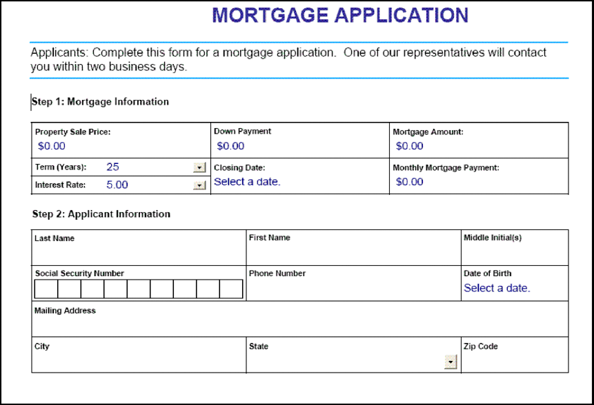

# 呈现交互式PDF forms {#rendering-interactive-pdf-forms}

**本文档中的示例和示例仅适用于JEE环境中的AEM Forms。**

Forms服务可向客户端设备（通常是Web浏览器）提供交互式PDF forms，以从用户那里收集信息。 呈现交互式表单后，用户可以在表单字段中输入数据，然后单击表单上的提交按钮以将信息发送回Forms服务。 Adobe Reader或Acrobat必须安装在托管客户端web浏览器的计算机上，才能显示交互式PDF表单。

>[!NOTE]
>
>在使用Forms服务渲染表单之前，请先创建表单设计。 通常，表单设计在Designer中创建并另存为XDP文件。 有关创建表单设计的信息，请参阅 [Forms Designer](https://www.adobe.com/go/learn_aemforms_designer_63).

**贷款申请示例**

引入了一个贷款应用程序示例，以演示Forms服务如何使用交互式表单从用户那里收集信息。 此应用程序允许用户在表格中填写保证贷款安全所需的数据，然后向Forms服务提交数据。 下图显示了贷款应用程序的逻辑流程。


下表介绍了此图中的步骤。

<table>
 <thead>
  <tr>
   <th><p>步骤</p></th>
   <th><p>描述</p></th>
  </tr>
 </thead>
 <tbody>
  <tr>
   <td><p>1</p></td>
   <td><p>的 <code>GetLoanForm</code> Java Servlet可从HTML页中调用。 </p></td>
  </tr>
  <tr>
   <td><p>2</p></td>
   <td><p>的 <code>GetLoanForm</code> Java Servlet使用Forms服务客户端API将贷款表单渲染到客户端Web浏览器。 (请参阅 <a href="#render-an-interactive-pdf-form-using-the-java-api">使用Java API渲染交互式PDF表单</a>.)</p></td>
  </tr>
  <tr>
   <td><p>3</p></td>
   <td><p>用户填写贷款表单并单击提交按钮后，数据会提交到 <code>HandleData</code> Java Servlet。 (请参阅 <i>"贷款表"</i>.)</p></td>
  </tr>
  <tr>
   <td><p>4</p></td>
   <td><p>的 <code>HandleData</code> Java Servlet使用Forms服务客户端API处理表单提交并检索表单数据。 然后，数据将存储在企业数据库中。 (请参阅 <a href="/help/forms/developing/handling-submitted-forms.md#handling-submitted-forms">处理已提交的Forms</a>.)</p></td>
  </tr>
  <tr>
   <td><p>5</p></td>
   <td><p>确认表单会呈现回Web浏览器。 呈现表单之前，会将用户的名字和姓氏等数据与表单合并。 (请参阅 <a href="/help/forms/developing/prepopulating-forms-flowable-layouts.md">使用可流动布局预填充Forms</a>.)</p></td>
  </tr>
 </tbody>
</table>

**贷款表**

此交互式贷款表由示例贷款申请的 `GetLoanForm` Java Servlet。



**确认表单**

此表格由贷款申请的示例 `HandleData` Java Servlet。


的 `HandleData` Java Servlet使用用户的名字和姓氏以及金额预填充此表单。 预填充表单后，会将其发送到客户端Web浏览器。 (请参阅 [使用可流动布局预填充Forms](/help/forms/developing/prepopulating-forms-flowable-layouts.md))

**Java Servlet**

示例贷款应用程序是作为Java Servlet存在的Forms服务应用程序的示例。 Java Servlet是在J2EE应用程序服务器（如WebSphere）上运行的Java程序，包含Forms服务客户端API代码。

以下代码显示名为GetLoanForm的Java Servlet的语法：

```java
     public class GetLoanForm extends HttpServlet implements Servlet {
         public void doGet(HttpServletRequest req, HttpServletResponse resp
         throws ServletException, IOException {

         }
         public void doPost(HttpServletRequest req, HttpServletResponse resp
         throws ServletException, IOException {

             }
```

通常，不会将Forms服务客户端API代码放置在Java Servlet的 `doGet` 或 `doPost` 方法。 最好的编程做法是将此代码放置在单独的类中，从中实例化该类 `doPost` 方法(或 `doGet` 方法)，并调用相应的方法。 但是，对于代码简短性，此部分中的代码示例将保持为最小值，并且代码示例位于 `doPost` 方法。

>[!NOTE]
>
>有关Forms服务的更多信息，请参阅 [AEM Forms服务参考](https://www.adobe.com/go/learn_aemforms_services_63).

**步骤摘要**

要渲染交互式PDF表单，请执行以下任务：

1. 包括项目文件。
1. 创建Forms客户端API对象。
1. 指定URI值。
1. 将文件附加到表单（可选）。
1. 呈现交互式PDF表单。
1. 将表单数据流写入客户端Web浏览器。

**包含项目文件**

在开发项目中包含必需的文件。 如果您使用Java创建客户端应用程序，请包含必需的JAR文件。 如果您使用的是Web服务，请确保包含代理文件。

**创建Forms客户端API对象**

您必须先创建一个Forms客户端API对象，然后才能以编程方式执行Forms服务客户端API操作。 如果您使用的是Java API，请创建 `FormsServiceClient` 对象。 如果您使用的是Forms Web服务API，请创建 `FormsService` 对象。

**指定URI值**

您可以指定Forms服务渲染表单所需的URI值。 可以使用内容根URI值引用另存为Forms应用程序一部分的表单设计 `repository:///`. 例如，请考虑以下名为 *Loan.xdp* 位于名为的Forms应用程序内 *FormsApplication*:


要访问此表单设计，请指定 `Applications/FormsApplication/1.0/FormsFolder/Loan.xdp` 作为表单名称(传递到 `renderPDFForm` 方法)和 `repository:///` 作为内容根URI值。

>[!NOTE]
>
>有关使用Workbench创建Forms应用程序的信息，请参阅 [Workbench帮助](https://www.adobe.com/go/learn_aemforms_workbench_63).

位于Forms应用程序中的资源路径是：

`Applications/Application-name/Application-version/Folder.../Filename`

以下值显示一些URI值示例：

* Applications/AppraisalReport/1.0/Forms/FullForm.xdp
* Applications/AnotherApp/1.1/Assets/picture.jpg
* Applications/SomeApp/2.0/Resources/Data/XSDs/MyData.xsd

在渲染交互式表单时，您可以定义URI值，如将表单数据发布到的目标URL。 可以通过以下方式之一定义目标URL:

* 在Designer中设计表单设计时的“提交”按钮
* 使用Forms服务客户端API

如果目标URL是在表单设计中定义的，请不要使用Forms服务客户端API覆盖它。 也就是说，使用Forms API设置目标URL时，会将表单设计中指定的URL重置为使用API指定的URL。 如果您希望将PDF表单提交到表单设计中指定的目标URL，请以编程方式将目标URL设置为空字符串。

如果您的表单包含提交按钮和计算按钮（具有在服务器上运行的相应脚本），则可以以编程方式定义表单发送到的URL以执行脚本。 使用表单设计中的提交按钮可指定将表单数据发布到的URL。 (请参阅 [计算表单数据](/help/forms/developing/calculating-form-data.md).)

>[!NOTE]
>
>您还可以传递的不是指定引用XDP文件的URL值 `com.adobe.idp.Document` 实例到Forms服务。 的 `com.adobe.idp.Document` 实例包含表单设计。 (请参阅 [将文档传递到Forms服务](/help/forms/developing/passing-documents-forms-service.md).)

**将文件附加到表单**

您可以将文件附加到表单。 在渲染带有文件附件的PDF表单时，用户可以使用文件附件窗格在Acrobat中检索文件附件。 您可以将不同的文件类型附加到表单（如文本文件），或附加到二进制文件(如JPG文件)。

>[!NOTE]
>
>将文件附件附加到表单是可选的。

**渲染交互式PDF表单**

要渲染表单，请使用在Designer中创建并另存为XDP或PDF文件的表单设计。 此外，您还可以渲染使用Acrobat创建并另存为PDF文件的表单。 要渲染交互式PDF表单，请调用 `FormsServiceClient` 对象 `renderPDFForm` 方法或 `renderPDFForm2` 方法。

的 `renderPDFForm` 使用 `URLSpec` 对象。 XDP文件的内容根目录将通过 `URLSpec` 对象 `setContentRootURI` 方法。 表单设计名称( `formQuery`)作为单独的参数值传递。 将连接这两个值，以获取对表单设计的绝对引用。

的 `renderPDFForm2` 方法接受 `com.adobe.idp.Document` 包含要渲染的XDP或PDF文档的实例。

>[!NOTE]
>
>如果输入文档是PDF文档，则无法设置标记的PDF运行时选项。 如果输入文件是XDP文件，则可以设置标记的PDF选项。

## 使用Java API渲染交互式PDF表单 {#render-an-interactive-pdf-form-using-the-java-api}

使用Forms API(Java)呈现交互式PDF表单：

1. 包含项目文件

   在Java项目的类路径中包含客户端JAR文件，如adobe-forms-client.jar。

1. 创建Forms客户端API对象

   * 创建 `ServiceClientFactory` 包含连接属性的对象。
   * 创建 `FormsServiceClient` 对象，并使用其构造函数进行传递 `ServiceClientFactory` 对象。

1. 指定URI值

   * 创建 `URLSpec` 使用其构造函数存储URI值的对象。
   * 调用 `URLSpec` 对象 `setApplicationWebRoot` 方法，并传递表示应用程序web根的字符串值。
   * 调用 `URLSpec` 对象 `setContentRootURI` 方法，并传递指定内容根URI值的字符串值。 确保表单设计位于内容根URI中。 如果没有，则Forms服务会引发异常。 要引用存储库，请指定 `repository:///`.
   * 调用 `URLSpec` 对象 `setTargetURL` 方法，并传递一个字符串值，该值指定将表单数据发布到的目标URL值。 如果在表单设计中定义目标URL，则可以传递一个空字符串。 您还可以指定将表单发送到的URL，以执行计算。

1. 将文件附加到表单

   * 创建 `java.util.HashMap` 对象来使用其构造函数存储文件附件。
   * 调用 `java.util.HashMap` 对象 `put` 方法，以将每个文件附加到渲染的表单。 将以下值传递到此方法：

      * 一个字符串值，用于指定文件附件的名称，包括文件扩展名。
   * A `com.adobe.idp.Document` 包含文件附件的对象。

   >[!NOTE]
   >
   >对要附加到表单的每个文件重复此步骤。 此步骤是可选的，您可以通过 `null` 如果您不想发送文件附件。

1. 渲染交互式PDF表单

   调用 `FormsServiceClient` 对象 `renderPDFForm` 方法并传递以下值：

   * 指定表单设计名称（包括文件扩展名）的字符串值。 如果您引用的表单设计是Forms应用程序的一部分，请确保指定完整路径，例如 `Applications/FormsApplication/1.0/FormsFolder/Loan.xdp`.
   * A `com.adobe.idp.Document` 包含要与表单合并的数据的对象。 如果不想合并数据，请传递一个空 `com.adobe.idp.Document` 对象。
   * A `PDFFormRenderSpec` 用于存储运行时选项的对象。 这是一个可选参数，您可以指定 `null` 如果您不想指定运行时选项，请执行以下操作：
   * A `URLSpec` 包含Forms服务所需URI值的对象。
   * A `java.util.HashMap` 用于存储文件附件的对象。 这是一个可选参数，您可以指定 `null` 如果您不想将文件附加到表单。

   的 `renderPDFForm` 方法返回 `FormsResult` 包含必须写入客户端web浏览器的表单数据流的对象。

1. 将表单数据流写入客户端Web浏览器

   * 创建 `com.adobe.idp.Document` 对象 `FormsResult` 对象s `getOutputContent` 方法。
   * 获取的内容类型 `com.adobe.idp.Document` 通过调用对象 `getContentType` 方法。
   * 设置 `javax.servlet.http.HttpServletResponse` 对象的内容类型(通过调用 `setContentType` 方法和传递 `com.adobe.idp.Document` 对象。
   * 创建 `javax.servlet.ServletOutputStream` 用于通过调用将表单数据流写入客户端web浏览器的对象 `javax.servlet.http.HttpServletResponse` 对象 `getOutputStream` 方法。
   * 创建 `java.io.InputStream` 对象 `com.adobe.idp.Document` 对象 `getInputStream` 方法。
   * 通过调用 `InputStream` 对象 `read` 方法并将字节数组作为参数进行传递。
   * 调用 `javax.servlet.ServletOutputStream` 对象 `write` 将表单数据流发送到客户端web浏览器的方法。 将字节数组传递到 `write` 方法。

## 使用Web服务API渲染交互式PDF表单 {#render-an-interactive-pdf-form-using-the-web-service-api}

使用Forms API（Web服务）呈现交互式PDF表单：

1. 包含项目文件

   * 创建使用Forms服务WSDL的Java代理类。
   * 将Java代理类包含到类路径中。

1. 创建Forms客户端API对象

   创建 `FormsService` 对象，并设置身份验证值。

1. 指定URI值

   * 创建 `URLSpec` 使用其构造函数存储URI值的对象。
   * 调用 `URLSpec` 对象 `setApplicationWebRoot` 方法，并传递表示应用程序web根的字符串值。
   * 调用 `URLSpec` 对象 `setContentRootURI` 方法，并传递指定内容根URI值的字符串值。 确保表单设计位于内容根URI中。 如果没有，则Forms服务会引发异常。 要引用存储库，请指定 `repository:///`.
   * 调用 `URLSpec` 对象 `setTargetURL` 方法，并传递一个字符串值，该值指定将表单数据发布到的目标URL值。 如果在表单设计中定义目标URL，则可以传递一个空字符串。 您还可以指定将表单发送到的URL，以执行计算。

1. 将文件附加到表单

   * 创建 `java.util.HashMap` 对象来使用其构造函数存储文件附件。
   * 调用 `java.util.HashMap` 对象 `put` 方法，以将每个文件附加到渲染的表单。 将以下值传递到此方法：

      * 一个字符串值，用于指定文件附件的名称，包括文件扩展名
   * A `BLOB` 包含文件附件的对象

   >[!NOTE]
   >
   >对要附加到表单的每个文件重复此步骤。

1. 渲染交互式PDF表单

   调用 `FormsService` 对象 `renderPDFForm` 方法并传递以下值：

   * 指定表单设计名称（包括文件扩展名）的字符串值。 如果您引用的表单设计是Forms应用程序的一部分，请确保指定完整路径，例如 `Applications/FormsApplication/1.0/FormsFolder/Loan.xdp`.
   * A `BLOB` 包含要与表单合并的数据的对象。 如果不想合并数据，请传递 `null`.
   * A `PDFFormRenderSpec` 用于存储运行时选项的对象。 这是一个可选参数，您可以指定 `null` 如果您不想指定运行时选项，请执行以下操作：
   * A `URLSpec` 包含Forms服务所需URI值的对象。
   * A `java.util.HashMap` 用于存储文件附件的对象。 这是一个可选参数，您可以指定 `null` 如果您不想将文件附加到表单。
   * 空 `com.adobe.idp.services.holders.BLOBHolder` 由方法填充的对象。 用于存储呈现的PDF表单。
   * 空 `javax.xml.rpc.holders.LongHolder` 由方法填充的对象。 （此参数将以表单存储页数。）
   * 空 `javax.xml.rpc.holders.StringHolder` 由方法填充的对象。 （此参数将存储区域设置值。）
   * 空 `com.adobe.idp.services.holders.FormsResultHolder` 包含此操作结果的对象。

   的 `renderPDFForm` 方法填充 `com.adobe.idp.services.holders.FormsResultHolder` 作为最后一个参数值传递的对象，表单数据流必须写入客户端web浏览器。

1. 将表单数据流写入客户端Web浏览器

   * 创建 `FormResult` 对象，方法是获取 `com.adobe.idp.services.holders.FormsResultHolder` 对象 `value` 数据成员。
   * 创建 `BLOB` 通过调用包含表单数据的对象 `FormsResult` 对象 `getOutputContent` 方法。
   * 获取的内容类型 `BLOB` 通过调用对象 `getContentType` 方法。
   * 设置 `javax.servlet.http.HttpServletResponse` 对象的内容类型(通过调用 `setContentType` 方法和传递 `BLOB` 对象。
   * 创建 `javax.servlet.ServletOutputStream` 用于通过调用将表单数据流写入客户端web浏览器的对象 `javax.servlet.http.HttpServletResponse` 对象 `getOutputStream` 方法。
   * 创建一个字节数组，并通过调用 `BLOB` 对象 `getBinaryData` 方法。 此任务分配 `FormsResult` 对象。
   * 调用 `javax.servlet.http.HttpServletResponse` 对象 `write` 将表单数据流发送到客户端web浏览器的方法。 将字节数组传递到 `write` 方法。

**将表单数据流写入客户端Web浏览器**

当Forms服务呈现表单时，它会返回一个必须写入客户端Web浏览器的表单数据流。 写入客户端Web浏览器时，用户可以看到该表单。
