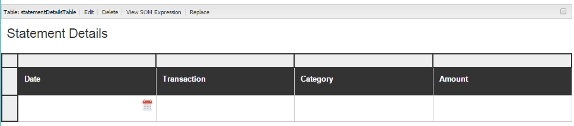

# 自适应表单图表 {#af-charts}


图表或图形是数据的可视化表示形式。 它允许您将大量信息压缩为易于理解的视觉格式，使您能够更好地可视化、解释和分析复杂数据。
AEM Forms附加组件包提供了一个现成的Chart组件。 您可以在自适应表单和文档中使用来在中可视化表示二维数据 **可重复面板** 和 **表**. 图表组件允许您添加和配置以下类型的图表：

1. 饼图
1. 列
1. 环形
1. 长条
1. 线条
1. 线和点
1. 点
1. 区域

图表组件支持并提供内置的统计函数（总和、平均值、最大值、最小值、模式、中间值、范围和频率），用于计算和绘制图表上的值。 除了开箱即用的函数之外，您还可以编写自己的自定义函数，并在图表中使用它们。

现在，我们来看看如何添加和配置图表组件：

## 添加图表 {#add-chart}

默认情况下，图表组件在AEM侧边栏中可用。 您可以在创作模式下将图表组件从AEM侧栏拖放到自适应表单或文档。 删除组件时，它将为图表创建占位符。

## 配置图表 {#configure-chart}

>[!NOTE]
> 
> 在配置图表之前，请确保要为其配置图表的面板或表行设置为可重复。 您可以在“编辑组件”对话框的“重复设置”选项卡中，指定可重复面板或表格行的最小和最大计数。

要配置图表，请单击图表组件，然后单击  以打开“编辑图表”对话框。 该对话框包括“标题”和“文本”、“配置”、“高级选项”和“样式”选项卡，允许您配置图表。

### 基本 {#basic}

在“基本”选项卡中，可以配置以下属性：


* **元素名称**：JCR内容结构中图表元素的标识符。 它在图表上不可见，但在从其他组件、脚本和SOM表达式引用元素时很有用。
* **图表类型**：指定要生成的图表类型。 可用的选项有“饼图”、“圆环图”、“条形图”、“列”、“直线”、“线和点”、“点”和“区域”。 在本例中，图表类型为“列”。
* **重复数据源的行名称或面板名称**：指定作为数据来源的表行或可重复面板的元素名称。 在此示例中， statementDetails是“语句详细信息”表中可重复行的元素名称。
* **X轴>标题**：指定X轴的标题。 在本例中，X轴的标题为“类别”。
* **X轴>字段**：指定要绘制在X轴上的字段（或表中的单元格）的元素名称。 在此示例中，类别在X轴上配置。 在示例表的“类别”列中，表单元格的元素名称为category。
* **X轴>使用函数**：指定用于计算X轴上值的统计函数。 在本例中，选定的选项为“无”。 有关函数的更多信息，请参阅在图表中使用函数。
* **Y轴>标题**：指定Y轴的标题。 在本例中，Y轴的标题为“费用”。
* **Y轴>字段**：指定要绘制在Y轴上的字段（或表中的单元格）的元素名称。 在本例中，在Y轴上配置数量。 在示例表的Amount列中，表单元格的元素名称是amount。
* **Y轴>使用函数**：指定用于计算Y轴上值的统计函数。 在此示例中，添加每个类别中的逗留量，并将计算值绘制在Y轴上。 因此，请从Use function下拉列表中选择Sum。 有关函数的更多信息，请参阅在图表中使用函数。
* **图例位置**：指定图例相对于图表的位置。 可用的选项有“右”、“左”、“上”和“下”。
* **显示图例**：在启用时显示图表的图例。
* **工具提示**：指定工具提示在图表中数据点的悬停鼠标时显示的格式。 默认值为 **\${x}(\${y})**. 根据图表类型，当您将鼠标指向图表中的点、条形或切片时，变量 **\${x}** 和 **\${y}** 会动态替换为X轴和Y轴上的相应值，并显示在刀尖中。 如下面的示例所示，工具提示显示为 **零售店(5870)** 当鼠标指向“Retails Stores（零售店）”列时。 要禁用工具提示，请将工具提示字段留空。 此选项不适用于折线图和面积图。
* **特定于图表的配置**：除了常见配置之外，还提供以下特定于图表的配置：
* **内径**：可用于圆环图，以指定图表中内圆的半径（以像素为单位）。
* **线条颜色**：可用于折线图、折线图、点图和面积图，以指定图表中线条的颜色的十六进制值。
* **点颜色**：适用于点、线和点图表，用于指定图表中点的颜色的十六进制值。
* **区域颜色**：可用于面积图，以指定图表线下区域的颜色的十六进制值。
* **CSS类**：在CSS类字段中指定CSS类的名称，以向图表应用自定义样式。

### 配置 {#configuration}

在“基本”选项卡中，您可以定义图表类型、包含数据的源面板或表行、要绘制在图表的X轴和Y轴上的值，还可以选择定义统计函数来计算要在图表上绘制的值。

让我们详细了解一下此选项卡中的信息，请参考信用卡对帐单中的可重复表示例。 假设您要生成一个图表，以描述信用卡对帐单的对帐单详细信息部分中不同类别的总费用并进行关联，如下所示。

要完成此操作，您需要在X轴上绘制类别，并在Y轴上绘制每个类别的总支出。


本示例中使用的信用卡对帐单是自适应表单文档，对帐单详细信息部分是一个表，该表在创作模式下如下所示。



让我们考虑一下生成图表的以下要求和条件：

* 该图表在“对帐单详细信息”表中显示每个类别的总费用。
* 图表类型为“列”，但您可以根据需要选择任何其他图表类型。
* “语句详细资料”表中的“表”行是可重复的。 您可以在表行属性的重复设置字段中对其进行配置。
* 行的元素名称为Statement Details。 您可以在表行属性中对其进行配置。
* “类别”列中表单元格的元素名称为category。 您可以内联指定它。 选择单元格并点按编辑按钮。
* “金额”列中表单元格的元素名称为amount。 此外，“金额”列中的表单元格是一个数字框。
* 使用指定的配置，示例中的列图表将显示如下。 每种颜色表示一个类别，并且类别的单个行项目或金额会合计到图表中。

  

图例和工具提示如下所示。


### 样式 {#styling}

在“样式”模式下，您可以配置图表的宽度（以表单或文档中可用总宽度的百分比表示）和高度（以像素为单位）。 其他选项包括文本、背景、边框、效果和CSS覆盖。

要切换到样式模式，请在页面工具栏中， **点按>>样式**.


## 在图表中使用函数 {#use-functions}

您可以配置图表以使用统计函数计算源数据的值，以便在图表上绘图。 虽然图表组件具有一些内置函数，但您可以编写自己的函数，并在图表配置中使用它们。

>[!NOTE]
>
> 可使用函数计算图表中X轴或Y轴的值。

### 默认函数 {#default-functions}

默认情况下，以下函数可用于图表组件：

* **平均值（平均）**：返回另一轴上给定值的X或Y轴上的值的平均值。
* **总和**：返回X轴或Y轴上给定值在其他轴上的所有值之和。
* **最大值**：返回另一轴上给定值的X轴或Y轴上的值的最大值。
* **频率**：返回另一轴上给定值的X轴或Y轴上的值数。
* **Range**：返回另一轴上给定值的X轴或Y轴上的最大值和最小值之间的差值。
* **中间值**：返回将另一轴上给定值在X或Y轴上一半的高值和低值分开的值。
* **最小值**：返回另一轴上给定值的X轴或Y轴上的值最小值。
* **模式**：返回另一轴上给定值在X或Y轴上出现次数最多的值

### 自定义函数 {#custom-functions}

除了在图表中使用默认函数外，您还可以编写 [自定义函数](/help/forms/using/rule-editor.md#custom-functions-in-rule-editor-custom-functions) 在JavaScript中，并在图表组件的函数列表中提供它们。

函数将一个或多个值和类别名称作为输入并返回一个值。 例如：

```
Multiply(valueArray, category) {
    var val = 1;
    _.each(valueArray, function(value) {
        val = val * value;
    });
    return val;
}
```

编写自定义函数后，请执行以下操作以使其可用于图表配置：

1. 在与自适应表单或文档关联的客户端库中添加自定义函数。
1. 在CRXDE Lite中，在apps文件夹中创建一个nt：unstructured节点，该节点具有以下属性：
   * 将guideComponentType设置为fd/af/reducer。 （必填）
   * 将值设置为自定义JavaScript函数的完全限定名称。 （必填）
   * 将jcr：description设置为有意义的名称。 它显示在 **使用函数** 下拉列表。 例如， **乘**.
   * 将qtip设置为函数的简短说明。 将鼠标指针悬停在“使用函数”下拉列表中的函数名称上时，它会显示为工具提示。
   * 单击 **全部保存** 以保存配置。
   * 函数现在可用于图表中。


## 自动刷新图表 {#auto-refresh-chart}

当用户执行以下操作之一时，图表会自动刷新：
* 添加或删除数据源面板或表行的实例。
* 更改数据源面板或表行中X轴或Y轴上绘制的任何值。
* 更改图表类型。

## 在自适应表单规则中使用图表类型 {#chart-in-rules}

chartType属性指定图表的类型。 可能的值为饼图、圆环图、条形图、折线图、线点、点和区域。 它是一个可编写脚本的属性，这意味着您可以在以下位置使用它 [自适应表单规则](/help/forms/using/rule-editor.md) 操作图表配置。 让我们通过一个示例来了解它。

假定您配置了柱状图。 但是，您还希望为用户提供一个选项，以便从下拉列表中选择不同的图表类型并重新绘制图表。 您可以使用规则中的chartType属性实现此目的，如下所示：

1. 从自适应表单的AEM侧边栏中拖放下拉列表组件。
1. 选择组件并点按 .
1. 指定下拉列表的标题。 例如，选择图表类型。
1. 在项部分中添加支持的图表类型以填充下拉列表。 单击&#x200B;**完成**。
   

1. 选择下拉组件并点击 . 在规则编辑器中，在可视规则编辑器中编写规则，如下所示。
   

   在此示例中，图表组件的元素名称为 **我的图表**.

   或者，您可以在代码编辑器中编写以下规则。

   

   有关编写规则的更多信息，请参阅 [规则编辑器](/help/forms/using/rule-editor.md)

1. 单击完成以保存规则。

现在，您可以从下拉列表中选择图表类型，然后单击刷新以重新绘制图表。
