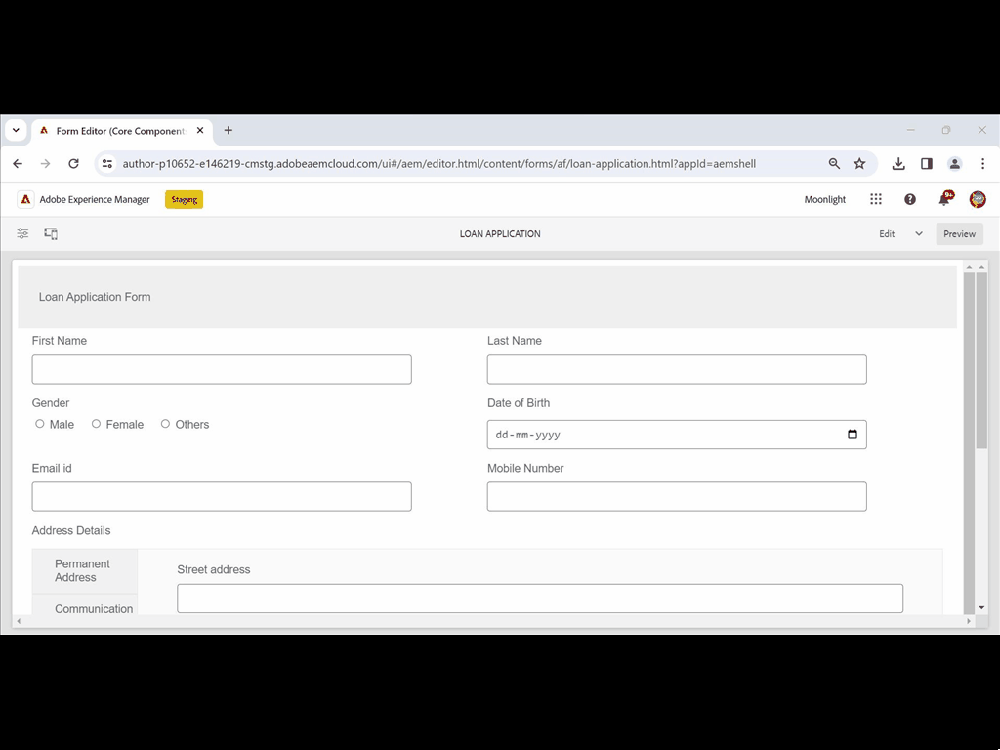

# 在基于核心组件的自适应表单中创建和使用自适应表单片段 {#adaptive-form-fragments}

| 版本 | 文章链接 |
| -------- | ---------------------------- |
| AEM 6.5 | 本文 |
| AEM as a Cloud Service | [单击此处](https://experienceleague.adobe.com/docs/experience-manager-cloud-service/content/forms/adaptive-forms-authoring/authoring-adaptive-forms-core-components/create-an-adaptive-form-on-forms-cs/adaptive-form-fragments-core-components.html) |

虽然每个表单都针对特定目的而设计，但大多数表单中都存在一些通用区段，例如提供个人详细信息，如姓名和地址、家庭详细信息、收入详细信息。 每次创建新表单时，表单开发人员都需要创建这些常用区段。

自适应Forms提供了一种便捷的机制，只需像创建面板或一组字段一样创建表单片段一次，即可在自适应Forms中重复使用。 这些可重用的独立区段称为自适应表单片段。

表单片段无缝集成到多个表单中，从而简化了创建一致且具有专业外观的表单的过程。 利用“一次更改，随处反映”功能，表单片段确保实现可重用性、标准化和品牌一致性。由于在一处作出的更新自动传播到所有利用这些片段的表单，因此可体验到更高的可维护性和效率。

您可以将片段多次添加到文档，并使用其组件的数据绑定属性将其绑定到不同的数据源或架构。 例如，您可以将相同的地址片段用于永久地址、通信地址和账单地址，并将它连接到数据源或架构的其他字段。

>[!NOTE]
>
> 您可以使用轻松为用户自定义片段体验 [表单片段组件的“配置”对话框和“设计”对话框](https://experienceleague.adobe.com/docs/experience-manager-core-components/using/adaptive-forms/adaptive-forms-components/form-fragment.html).

## 创建表单片段 {#create-a-fragment}

您可以从头开始创建自适应表单片段，或将现有自适应表单中的面板另存为片段。 要创建表单片段，请执行以下操作：

1. 登录您的AEM Forms实例，网址为https://[*主机名*]：[*端口*]/aem/forms.html.
1. 单击 **创建>自适应表单片段**.
1. 指定片段的标题、名称、描述和标记。 请确保为片段指定唯一的名称。 如果存在具有相同名称的其他片段，则无法创建该片段。
1. 选择表单模板。 您可以为基于核心组件的自适应Forms或基于基础组件的自适应Forms创建表单片段。
   * 要为基于核心组件的表单创建表单片段，请选择一个基于核心组件的模板。
   * 要为基于基础组件的表单创建表单片段，请选择一个基础组件模板。 例如，/libs/fd/af/templateForFragment/defaultFragmentTemplate。

   为基于核心组件的表单创建表单片段时，使用选择表单主题选项选择基于核心组件的主题。

1. 单击以打开 **表单模型** 选项卡，然后从 **选择自** 下拉菜单，为片段选择以下模型之一：

   

   * **无**：指定从头开始创建片段，而不使用任何表单模型。

     >[!NOTE]
     >
     > 在自适应Forms中，您可以多次使用单个表单片段（基于核心组件）。 它支持基于无和基于架构的表单片段。

   * **架构**：指定使用上传到 AEM 表单的 XML 或 JSON 架构创建片段。 您可以上传或从可用的XML或JSON架构中选择作为片段的表单模型。 选择XML架构时，您还可以通过从中选择所选架构中存在的complexType来创建自适应表单片段。 **[!UICONTROL XML结构描述复杂类型]** 下拉框。 选择JSON架构时，您还可以通过从中选择所选架构中存在的架构定义来创建自适应表单片段。 **[!UICONTROL JSON架构定义]** 下拉框。
   * **表单数据模型**：指定使用表单数据模型创建片段。 您可以仅基于表单数据模型中的一个数据模型对象创建自适应表单片段。 展开表单数据模型定义下拉列表。 它列出了指定表单数据模型中的所有数据模型对象。 从列表中选择数据模型对象。

   

1. 单击“创建&#x200B;**”，然后单击“打开”****，以在编辑模式下使用默认模板打开**&#x200B;片段。在编辑模式下，您可以将任何自适应表单组件添加到片段。

<!-- For information about Adaptive Form components, see [Introduction to authoring Adaptive Forms](../../forms/using/introduction-forms-authoring.md). --> 此外，如果您选择了 XML 架构或 XDP 表单模板作为片段的表单模型，则内容查找器中将显示一个显示表单模型层次结构的新选项卡。 它可让您将表单模型元素拖放到片段上。 添加的表单模型元素被转换为表单组件，同时保留关联XDP或XSD的原始属性。

创建基于架构或表单数据模型的自适应表单片段后，表单数据模型或架构元素会显示在自适应表单编辑器的内容浏览器的数据源选项卡中。 您可以将表单模型元素拖放到片段上。 添加的表单模型元素转换为表单组件，同时保留关联架构中的原始属性。

## 将片段添加到自适应表单 {#insert-a-fragment-in-an-adaptive-form}

要将自适应表单片段添加到自适应表单：

1. 在编辑模式下打开自适应表单。
1. 添加 **自适应表单片段** 组件添加到表单。
1. 单击 **资产** 内容浏览器侧栏。 在资产浏览器的路径下，选择 **自适应表单片段** 选项。 您的表单可用的所有自适应Forms片段都会显示，具体取决于表单的模型。

   

1. 将自适应表单片段拖放到 **自适应表单片段** 自适应表单上的组件。

   >[!NOTE]
   >
   >自适应表单片段没有启用在自适应表单中进行创作。 此外，在基于JSON的自适应表单中不能以相反的方式使用基于XSD的片段。

自适应表单片段是通过引用自适应表单添加的，并与独立的自适应表单片段保持同步。 这意味着对自适应表单片段所做的任何修改都会在片段合并到自适应Forms的所有实例中镜像。

### 在自适应表单中嵌入片段 {#embed-a-fragment-in-adaptive-form}

您可以选择将自适应表单片段嵌入到自适应表单中，方法是单击  ”图标（所添加片段的面板工具栏）

嵌入的片段不再与独立片段链接。 您可以在自适应表单中编辑嵌入片段中的组件。

<!-- 
## Configure fragment appearance {#configure-fragment-appearance}

Any fragment you insert in Adaptive Forms appears as a placeholder image. The placeholder displays titles of up to a maximum of ten child panels in the fragment. You can configure AEM Forms to show the complete fragment instead of the placeholder image.

Perform the following steps to show complete fragments in forms:

1. Go to AEM web console configuration page at https:[*host*]:[*port*]/system/console/configMgr.

1. Search and click **[!UICONTROL Adaptive Form and Interactive Communication Web Channel Configuration]** to open it in edit mode.
1. Disable **[!UICONTROL Enable Placeholder in place of Fragment]** checkbox to show complete fragments rather than the placeholder image.

-->

### 在片段中使用片段 {#using-fragments-within-fragments}

您可以创建嵌套式自适应表单片段，这意味着您可以将片段拖放到另一个片段中，并且可以具有嵌套式片段结构。

### 在自适应表单中多次使用表单片段 {#using-form-fragment-mutiple-times-in-af}

您可以在自适应表单中多次使用无基于和基于架构的表单片段，以便为每个表单片段字段唯一保存数据。 例如，您可以使用地址表单片段在贷款申请表中收集永久地址、通信地址和当前居住地址的详细信息。

## 自动映射用于数据绑定的片段 {#auto-mapping-of-fragments-for-data-binding}

当您使用 XFA 表单模板或 XSD 复杂类型创建自适应表单片段并将该片段拖放到自适应表单时，XFA 片段或 XSD 复杂类型将自动替换为相应的自适应表单片段，其片段模型根映射到 XFA 片段或 XSD 复杂类型。

您可以通过编辑组件对话框更改片段资源及其绑定。

您还可以从AEM内容查找器中的自适应表单片段库拖放绑定的自适应表单片段，并从自适应表单片段面板的“编辑组件”对话框中提供正确的绑定引用。

## 管理片段 {#manage-fragments}

您可以使用AEM Forms UI对自适应表单片段执行多项操作。

1. 转到 `https://[hostname]/aem/forms.html`.

1. 单击 **选择** 在AEM Forms UI工具栏中，选择一个自适应表单片段。 工具栏显示您可以对选定的自适应表单片段执行的以下操作。

<table>
 <tbody>
  <tr>
   <td>
<strong>操作</strong>
 </td>
   <td>
<strong>描述</strong>
 </td>
  </tr>
  <tr>
   <td>
编辑
 </td>
   <td>
在编辑模式下打开选定的自适应表单片段。    
 </td>
  </tr>
  <tr>
   <td>
属性
 </td>
   <td>
打开属性面板。 从“属性”面板中，您可以查看和编辑属性、生成预览并上传所选片段的缩略图图像。 有关更多信息，请参阅 <a>管理元数据</a>.    
 </td>
  </tr>
  <tr>
   <td>
复制
 </td>
   <td>
复制选定的片段。 工具栏中会显示“粘贴”按钮。    
 </td>
  </tr>
  <tr>
   <td>
下载
 </td>
   <td>
下载选定的片段。    
 </td>
  </tr>
  <tr>
   <td>
预览
 </td>
   <td>
提供选项，用于将XML文件中的数据与片段合并，以HTML形式预览片段或自定义预览。 有关更多信息，请参阅 <a>预览表单</a>.    
 </td>
  </tr>
  <tr>
   <td>
开始审核/管理审核
 </td>
   <td>
允许启动和管理对所选片段的审核。 有关更多信息，请参阅 <a>创建和管理审阅</a>.    
 </td>
  </tr>
  <tr>
   <td>
新增字典
 </td>
   <td>
生成用于本地化所选片段的字典。 有关更多信息，请参阅 <a>本地化自适应Forms</a>.    
 </td>
  </tr>
  <tr>
   <td>
发布/取消发布
 </td>
   <td>
发布/取消发布选定的片段。    
 </td>
  </tr>
  <tr>
   <td>
删除
 </td>
   <td>
删除选定的片段。    
 </td>
  </tr>
 </tbody>
</table>

## 使用片段时要记住的要点 {#key-points-to-remember-when-working-with-fragments}

* 确保片段名称是唯一的。 如果存在具有相同名称的现有片段，则创建片段失败。
* 在基于XDP的自适应表单中，如果您将面板另存为包含其他XDP片段的片段，则生成的片段将自动绑定到子XDP片段。 在基于XSD的自适应表单中，生成的片段将绑定到架构根。
* 创建自适应表单片段时，会在CRXDE Lite中创建片段节点，该节点与自适应表单的guideContainer节点类似。
* 不支持自适应表单中使用其他表单数据模型的片段。 例如，基于XDP的片段在基于XSD的自适应表单中不受支持，反之亦然。
* 自适应表单片段可通过AEM内容查找器中的自适应表单片段选项卡使用。
* 通过引用插入或嵌入自适应表单中的独立自适应表单片段中的任何表达式、脚本或样式都会保留。
* 您无法从自适应表单中编辑通过引用插入的自适应表单片段。 要编辑，您需要编辑独立的自适应表单片段或将片段嵌入自适应表单中。
* 发布自适应表单时，您需要发布在自适应表单中通过引用插入的独立自适应表单片段。
* 当您重新发布更新的自适应表单片段时，更改会反映在使用片段的自适应表单的已发布实例中。
* 包含Verify组件的自适应表单不支持匿名用户。 此外，不建议在自适应表单片段中使用验证组件。
* （**仅限** Mac）为确保表单片段功能在所有场景中都能完美运行，请将以下条目添加到 /private/etc/hosts 文件中：
  `127.0.0.1 <Host machine>` **主机**：部署AEM Forms的Apple Mac计算机。

## 引用片段 {#reference-fragments}

引用可用于创建表单的自适应表单片段。
<!-- For more information, see [Reference Fragments](../../forms/using/reference-adaptive-form-fragments.md). -->

## 另请参阅 {#see-also}

* [创建基于核心组件的自适应表单](create-an-adaptive-form-core-components.md)
* [使用规则编辑器向表单添加动态行为](rule-editor.md)
* [为基于核心组件的自适应表单创建或自定义主题](create-or-customize-themes-for-adaptive-forms-core-components.md)
* [为基于核心组件的自适应表单创建模板](template-editor.md)
* [创建自适应表单或将自适应表单添加到 AEM 站点页面或体验片段](create-or-add-an-adaptive-form-to-aem-sites-page.md)
* [主题模板和表单数据模型示例](https://experienceleague.adobe.com/docs/experience-manager-core-components/using/adaptive-forms/sample-themes-templates-form-data-models-core-components.html)