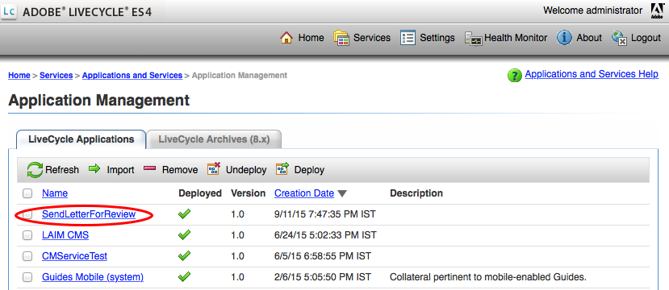

# 在创建通信UI中添加自定义操作按钮 {#add-custom-action-button-in-create-correspondence-ui}

## 概述 {#overview}

通信管理解决方案允许您向“创建通信”用户界面添加自定义操作。

本文档中的方案说明如何在“创建通信”用户界面中创建按钮，以将信件共享为附加到电子邮件的审核PDF。

### 前提条件 {#prerequisites}

要完成此方案，您需要满足以下条件：

* 了解CRX和JavaScript
* LiveCycle服务器

## 方案：在“创建通信”用户界面中创建按钮以发送信件以供复查 {#scenario-create-the-button-in-the-create-correspondence-user-interface-to-send-a-letter-for-review}

向“创建通信”用户界面添加带有操作（此处发送书信以供审阅）的按钮包括：

1. 将按钮添加到“创建通信”用户界面
1. 向按钮添加操作处理
1. 添加LiveCycle进程以启用操作处理

### 将按钮添加到“创建通信”用户界面 {#add-the-button-to-the-create-correspondence-user-interface}

1. 转到 `https://'[server]:[port]'/[ContextPath]/crx/de` 并以管理员身份登录。
1. 在apps文件夹中，创建一个名为 `defaultApp` 路径/结构与defaultApp文件夹（位于config文件夹）类似。 使用以下步骤可创建文件夹：

   1. 右键单击 **defaultapp** 文件夹并选中 **覆盖节点**：

      /libs/fd/cm/config/defaultApp/

      

   1. 确保“覆盖节点”对话框具有以下值：

      **路径：** /libs/fd/cm/config/defaultApp/

      **叠加位置：** /apps/

      **匹配节点类型：** 已选中

      

   1. 单击&#x200B;**确定**。
   1. 单击 **全部保存**.

1. 复制/apps分支下的acmExtensionsConfig.xml文件（存在于/libs分支下）。

   1. 转到“/libs/fd/cm/config/defaultApp/acmExtensionsConfig.xml”

   1. 右键单击acmExtensionsConfig.xml文件并选择 **复制**.

      

   1. 右键单击 **defaultapp** 文件夹中的“/apps/fd/cm/config/defaultApp/”，然后选择 **粘贴**.
   1. 单击 **全部保存**.

1. 双击您在apps文件夹中新创建的acmExtentionsConfig.xml的副本。 将打开文件以进行编辑。
1. 找到以下代码：

   ```xml
   <?xml version="1.0" encoding="utf-8"?>
   <extensionsConfig>
       <modelExtensions>
           <modelExtension type="LetterInstance">
     <customAction name="Preview" label="loc.letterInstance.preview.label" tooltip="loc.letterInstance.preview.tooltip" styleName="previewButton"/>
               <customAction name="Submit" label="loc.letterInstance.submit.label" tooltip="loc.letterInstance.submit.tooltip" styleName="submitButton" permissionName="forms-users"/>
               <customAction name="SaveAsDraft" label="loc.letterInstance.saveAsDraft.label" tooltip="loc.letterInstance.saveAsDraft.tooltip" styleName="submitButton" permissionName="forms-users"/>
               <customAction name="Close" label="loc.letterInstance.close.label" tooltip="loc.letterInstance.close.tooltip" styleName="closeButton"/>
           </modelExtension>
       </modelExtensions>
   </extensionsConfig>
   ```

1. 若要通过电子邮件发送信件，您可以使用LiveCycleForms Workflow。 在acmExtensionsConfig.xml的modelExtension标记下添加customAction标记，如下所示：

   ```xml
    <customAction name="Letter Review" label="Letter Review" tooltip="Letter Review" styleName="" permissionName="forms-users" actionHandler="CM.domain.CCRCustomActionHandler">
         <serviceName>Forms Workflow -> SendLetterForReview/SendLetterForReviewProcess</serviceName>
       </customAction>
   ```

   

   modelExtension标记包含一组customAction子标记，用于配置操作、权限和操作按钮的外观。 以下是customAction配置标记的列表：

   | **名称** | **描述** |
   |---|---|
   | name | 要执行的操作的字母数字名称。 此标记的值是必需的，必须是唯一的（在modelExtension标记内），并且必须以字母开头。 |
   | 标签 | 要在操作按钮上显示的标签 |
   | 工具提示 | 按钮的工具提示文本，当用户将鼠标悬停在该按钮上时显示。 |
   | 样式名称 | 应用于操作按钮的自定义样式的名称。 |
   | permissionName | 仅当用户具有permissionName指定的权限时，才会显示相应的操作。 当您将permissionName指定为 `forms-users`，则所有用户都有权访问此选项。 |
   | actionHandler | 用户单击按钮时调用的ActionHandler类的完全限定名称。 |

   除了上述参数之外，还可以有与customAction关联的其他配置。 这些其他配置可通过CustomAction对象供处理程序使用。

   | **名称** | **描述** |
   |---|---|
   | serviceName | 如果customAction包含名为serviceName的子标记，则单击相关按钮/链接时，将调用一个进程，其名称由serviceName标记表示。 确保此进程与信件后处理具有相同的签名。 在服务名称中添加“Forms Workflow->”前缀。 |
   | 标记名称中包含cm_前缀的参数 | 如果customAction包含以名称cm_开头的子标记，则在后处理中（无论是信件后处理还是由serviceName标记表示的特殊处理），这些参数在相关标记（删除了cm_前缀）下的输入XML代码中可用。 |
   | actionName | 每当因点击而需进行后处理时，提交的XML都将在标记下包含名为的特殊标记，该标记带有用户操作的名称。 |

1. 单击 **全部保存**.

#### 在/apps分支中创建具有属性文件的区域设置文件夹 {#create-a-locale-folder-with-properties-file-in-the-apps-branch}

ACMExtensionsMessages.properties文件包含“创建通信”用户界面中各个字段的标签和工具提示消息。 要使自定义操作/按钮正常工作，请在/apps分支中制作此文件的副本。

1. 右键单击 **区域设置** 文件夹并选中 **覆盖节点**：

   /libs/fd/cm/config/defaultApp/locale

1. 确保“覆盖节点”对话框具有以下值：

   **路径：** /libs/fd/cm/config/defaultApp/locale

   **叠加位置：** /apps/

   **匹配节点类型：** 已选中

1. 单击&#x200B;**确定**。
1. 单击 **全部保存**.
1. 右键单击以下文件并选择 **复制**：

   `/libs/fd/cm/config/defaultApp/locale/ACMExtensionsMessages.properties`

1. 右键单击 **区域设置** 文件夹并选中 **粘贴**：

   `/apps/fd/cm/config/defaultApp/locale/`

   ACMExtensionsMessages.properties文件复制到区域设置文件夹中。

1. 要将新添加的自定义操作/按钮的标签本地化，请为中的相关区域设置创建ACMExtensionsMessages.properties文件 `/apps/fd/cm/config/defaultApp/locale/`.

   例如，要本地化本文中创建的自定义操作/按钮，请使用以下条目创建一个名为ACMExtensionsMessages_fr.properties的文件：

   `loc.letterInstance.letterreview.label=Revue De Lettre`

   同样，您可以在此文件中添加更多属性，如工具提示和样式属性。

1. 单击 **全部保存**.

#### 重新启动Adobe资源编辑器构建基块捆绑包 {#restart-the-adobe-asset-composer-building-block-bundle}

完成每个服务器端更改后，重新启动Adobe资源编辑器构建基块捆绑包。 在此方案中，将编辑服务器端的acmExtensionsConfig.xml和ACMExtensionsMessages.properties文件，因此Adobe资源编辑器构建基块捆绑包需要重新启动。

>[!NOTE]
>
>您可能需要清除浏览器缓存。

1. 转到 `https://[host]:'port'/system/console/bundles`. 如有必要，请以管理员身份登录。

1. 找到Adobe资源编辑器构建基块捆绑包。 重新启动捆绑包：单击“停止”，然后单击“启动”。

   

重新启动Adobe资源编辑器构建基块捆绑包后，“创建通信”用户界面中会显示“自定义”按钮。 您可以在创建通信用户界面中打开信件以预览自定义按钮。

### 将操作处理添加到按钮 {#add-action-handling-to-the-button}

默认情况下，“创建通信”用户界面在cm.domain.js文件中的以下位置实施了ActionHandler：

/libs/fd/cm/ccr/gui/components/admin/clientlibs/ccr/js/cm.domain.js

对于自定义操作处理，请在CRX的/apps分支中创建cm.domain.js文件的叠加。

处理单击操作/按钮时的操作/按钮包括以下内容的逻辑：

* 使新添加的操作可见/不可见：通过覆盖actionVisible()函数来完成。
* 启用/禁用新添加的操作：通过覆盖actionEnabled()函数来完成。
* 用户单击按钮时的实际操作处理：通过覆盖handleAction()函数的实现来完成。

1. 转到 `https://'[server]:[port]'/[ContextPath]/crx/de`. 如有必要，请以管理员身份登录。

1. 在apps文件夹中，创建一个名为 `js` 在CRX的/apps分支中，其结构与以下文件夹类似：

   `/libs/fd/cm/ccr/gui/components/admin/clientlibs/ccrui/js`

   使用以下步骤可创建文件夹：

   1. 右键单击 **js** 文件夹并选中 **覆盖节点**：

      `/libs/fd/cm/ccr/gui/components/admin/clientlibs/ccrui/js`

   1. 确保“覆盖节点”对话框具有以下值：

      **路径：** /libs/fd/cm/ccr/gui/components/admin/clientlibs/crui/js

      **叠加位置：** /apps/

      **匹配节点类型：** 已选中

   1. 单击&#x200B;**确定**。
   1. 单击 **全部保存**.

1. 在js文件夹中，创建一个名为ccrcustomization.js的文件，该文件包含以下步骤的按钮操作处理代码：

   1. 右键单击 **js** 文件夹并选中 **“创建”>“创建文件”**：

      `/apps/fd/cm/ccr/gui/components/admin/clientlibs/ccrui/js`

      将文件命名为ccrcustomization.js。

   1. 双击ccrcustomization.js文件以在CRX中将其打开。
   1. 在文件中，粘贴以下代码并单击 **全部保存**：

      ```javascript
      /* for adding and handling custom actions in Extensible Toolbar.
        * One instance of handler will be created for each action.
        * CM.domain.CCRCustomActionHandler is actionHandler class.
        */
      var CCRCustomActionHandler;
          CCRCustomActionHandler = CM.domain.CCRCustomActionHandler = new Class({
              className: 'CCRCustomActionHandler',
              extend: CCRDefaultActionHandler,
              construct : function(action,model){
              }
          });
          /**
           * Called when user user click an action
           * @param extraParams additional arguments that may be passed to handler (For future use)
           */
          CCRCustomActionHandler.prototype.handleAction = function(extraParams){
              if (this.action.name == CCRCustomActionHandler.SEND_FOR_REVIEW) {
                  var sendForReview = function(){
                      var serviceName = this.action.actionConfig["serviceName"];
                      var inputParams = {};
                      inputParams["dataXML"] = this.model.iccData.data;
                      inputParams["letterId"] = this.letterVO.id;
                      inputParams["letterName"] = this.letterVO.name;
                      inputParams["mailId"] = $('#email').val();
                      /*function to invoke the LivecyleService */
                      ServiceDelegate.callJSONService(this,"lc.icc.renderlib.serviceInvoker.json","invokeProcess",[serviceName,inputParams],this.onProcessInvokeComplete,this.onProcessInvokeFail);
                      $('#ccraction').modal("hide");
                  }
                  if($('#ccraction').length == 0){
                      /*For first click adding popup & setting letterName.*/
                      $("body").append(popUp);
                      $("input[id*='letterName']").val(this.letterVO.name);
                      $(document).on('click',"#submitLetter",$.proxy( sendForReview, this ));
                  }
                  $('#ccraction').modal("show");
              }
          };
          /**
           * Should the action be enabled in toolbar
           * @param extraParams additional arguements that may be passed to handler (For future use)
           * @return flag indicating whether the action should be enabled
           */
         CCRCustomActionHandler.prototype.actionEnabled = function(extraParams){
                  /*can be customized as per user requirement*/
                  return true;
          };
          /**
           * Should the action be visible in toolbar
           * @param extraParams additional arguments that may be passed to handler (For future use)
           * @return flag indicating whether the action should be enabled
           */
          CCRCustomActionHandler.prototype.actionVisible = function(extraParams){
              /*Check can be enabled for Non-Preview Mode.*/
              return true;
          };
          /*SuccessHandler*/
          CCRCustomActionHandler.prototype.onProcessInvokeComplete = function(response) {
              ErrorHandler.showSuccess("Letter Sent for Review");
          };
          /*FaultHandler*/
          CCRCustomActionHandler.prototype.onProcessInvokeFail = function(event) {
              ErrorHandler.showError(event.message);
          };
          CCRCustomActionHandler.SEND_FOR_REVIEW  = "Letter Review";
      /*For PopUp*/
          var popUp = '<div class="modal fade" id="ccraction" tabindex="-1" role="dialog" aria-hidden="true">'+
          '<div class="modal-dialog modal-sm">'+
              '<div class="modal-content">' +
                  '<div class="modal-header">'+
                      '<button type="button" class="close" data-dismiss="modal" aria-label="Close"><span aria-hidden="true">&times;</code></button>'+
                      '<h4 class="modal-title"> Send Review </h4>'+
                  '</div>'+
                  '<div class="modal-body">'+
                      '<form>'+
                          '<div class="form-group">'+
                              '<label class="control-label">Email Id</label>'+
                              '<input type="text" class="form-control" id="email">'+
                          '</div>'+
                          '<div class="form-group">'+
                              '<label  class="control-label">Letter Name</label>'+
                              '<input id="letterName" type="text" class="form-control" readonly>'+
                          '</div>'+
                          '<div class="form-group">'+
                              '<input id="letterData" type="text" class="form-control hide" readonly>'+
                          '</div>'+
                      '</form>'+
                  '</div>'+
                  '<div class="modal-footer">'+
                     '<button type="button" class="btn btn-default" data-dismiss="modal"> Cancel </button>'+
                     '<button type="button" class="btn btn-primary" id="submitLetter"> Submit </button>'+
                  '</div>'+
              '</div>'+
          '</div>'+
      '</div>';
      ```

### 添加LiveCycle进程以启用操作 <span class="acrolinxCursorMarker"></code>处理 {#add-the-livecycle-process-to-enable-action-span-class-acrolinxcursormarker-span-handling}

在此方案中，启用以下组件，这些组件是附加的components.zip文件的一部分：

* DSC组件jar (DSCSample.jar)
* 发送书信以供审阅流程LCA (SendLetterForReview.lca)

下载并解压缩components.zip文件以获取DSCSample.jar和SendLetterForReview.lca文件。 按照以下步骤中的指定，使用这些文件。
[获取文件](assets/components.zip)

#### 配置LiveCycle服务器以运行LCA进程 {#configure-the-livecycle-server-to-run-the-lca-process}

>[!NOTE]
>
>只有在设置了OSGI并且所实施的自定义类型需要LC集成时，才需要执行此步骤。

LCA进程在LiveCycle服务器上运行，需要服务器地址和登录凭据。

1. 转到 `https://'[server]:[port]'/system/console/configMgr` 并以管理员身份登录。
1. 找到AdobeLiveCycle客户端SDK配置，然后单击 **编辑** （编辑图标）。 将打开“配置”面板。

1. 输入以下详细信息并单击 **保存**：

   * **服务器Url**：操作处理程序代码使用其“发送以供审阅”服务的LC服务器的URL。
   * **用户名**：LC服务器的管理员用户名
   * **密码**：管理员用户名的密码

   

#### 安装LiveCycle存档(LCA) {#install-livecycle-archive-lca}

启用电子邮件服务流程所需的LiveCycle流程。

>[!NOTE]
>
>要查看此流程的作用，或者创建您自己的类似流程，您需要安装Workbench。

1. 以管理员身份登录LiveCycle®Server adminui，网址为 `https:/[lc server]/:[lc port]/adminui`.

1. 导航到 **主页>服务>应用程序和服务>应用程序管理**.

1. 如果SendLetterForReview应用程序已存在，请跳过此过程中的其余步骤，否则继续后续步骤。

   

1. 单击 **导入**.

1. 单击 **选择文件** 并选择SendLetterForReview.lca。

   

1. 单击 **预览**.

1. 选择 **导入完成后将资源部署到运行时**.

1. 单击 **导入**.

#### 允许列表将ServiceName添加到服务列表 {#adding-servicename-to-the-allowlist-service-list}

在Experience Manager服务器中提及要访问Experience Manager服务器的LiveCycle服务。

1. 以管理员身份登录 `https:/[host]:'port'/system/console/configMgr`.

1. 找到并单击 **AdobeLiveCycle客户端SDK配置**. 此时将显示AdobeLiveCycle客户端SDK配置面板。
1. 在服务名称列表中，单击+图标并添加服务名称 **SendLetterForReview/SendLetterForReviewProcess**.

1. 单击“**保存**”。

#### 配置电子邮件服务 {#configure-the-email-service}

在此方案中，为了使通信管理能够发送电子邮件，请在LiveCycle服务器中配置电子邮件服务。

1. 使用管理员凭据登录LiveCycle服务器管理ui，网址为 `https:/[lc server]:[lc port]/adminui`.

1. 导航到 **主页>服务>应用程序和服务>服务管理**.

1. 找到并单击 **电子邮件服务**.

1. In **SMTP主机**，配置电子邮件服务。

1. 单击“**保存**”。

#### 配置DSC服务 {#configure-the-dsc-service}

要使用通信管理API，请下载DSCSample.jar（作为components.zip的一部分附在此文档中）并将其上传到LiveCycle服务器。 将DSCSample.jar文件上传到LiveCycle服务器后，Experience Manager服务器使用DSCSample.jar文件访问renderLetter API。

有关更多信息，请参阅 [将AEM Forms与AdobeLiveCycle连接](/help/forms/using/aem-livecycle-connector.md).

1. 在DSCSample.jar中更新cmsa.properties中的Experience Manager服务器URL，该服务器位于以下位置：

   DSCSample.jar\com\adobe\livecycle\cmsa.properties

1. 在配置文件中提供以下参数：

   * **crx.serverUrl**=https:/host:port/[上下文路径]/[AEM URL]
   * **crx.username**=Experience Manager用户名
   * **crx.password**=Experience Manager密码
   * **crx.appRoot**=/content/apps/cm

   >[!NOTE]
   >
   >每次在服务器端进行更改时，请重新启动LiveCycle服务器。

   DSCSample.jar文件使用renderLetter API。 有关renderLetter API的更多信息，请参阅 [接口LetterRenderService](https://www.adobe.io/experience-manager/reference-materials/6-5/forms/javadocs/index.html?com/adobe/icc/ddg/api/LetterRenderService.html).

#### 将DSC导入LiveCycle {#import-dsc-to-livecyle}

DSCSample.jar文件使用renderLetter API从DSC提供作为输入的XML数据将书信渲染为PDF字节。 有关renderLetter和其他API的更多信息，请参阅 [书信渲染服务](https://www.adobe.io/experience-manager/reference-materials/6-5/forms/javadocs/index.html?com/adobe/icc/ddg/api/LetterRenderService.html).

1. 启动Workbench并登录。
1. 选择 **“窗口”>“显示视图”>“组件”**. “组件”视图将添加到Workbench ES2。

1. 右键单击 **组件** 并选择 **安装组件**.

1. 选择 **DSCSample.jar** 通过文件浏览器创建文件并单击 **打开**.
1. 右键单击 **RenderWrapper** 并选择 **启动组件**. 如果组件启动，则组件名称旁边会显示一个绿色箭头。

## 发送书信以供审阅 {#send-letter-for-review}

配置用于发送书信以供审阅的操作和按钮后：

1. 清除浏览器缓存。

1. 在创建通信UI中单击 **书信审核** 和指定审阅者的电子邮件ID。

1. 单击 **提交**.


审阅者会收到来自系统的电子邮件，其中包含作为PDF附件的信件。
