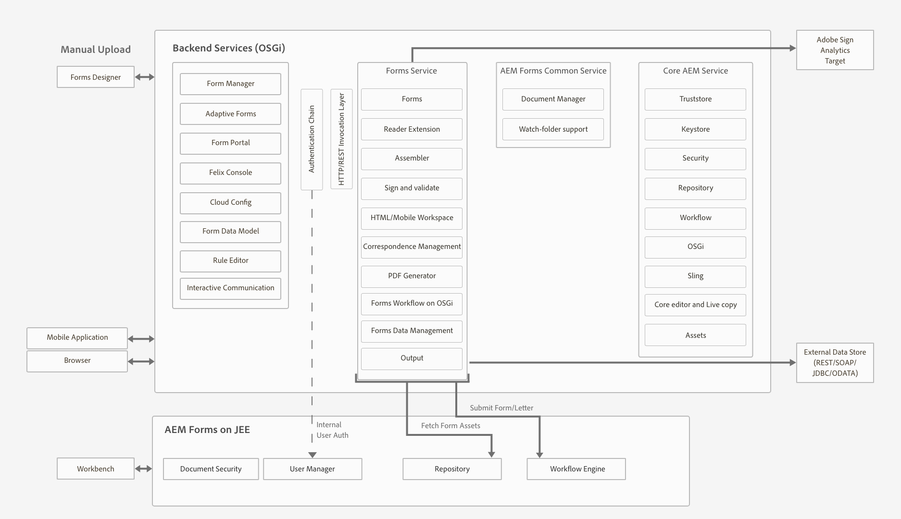

# AEM Forms {#architecture-and-deployment-topologies-for-aem-forms}的架构和部署拓扑

## 架构 {#architecture}

AEM Forms是作为AEM包部署到AEM中的应用程序。 该包称为AEM Forms附加组件包。 AEM Forms附加组件包包含部署到AEM OSGi容器中的服务（API提供程序）和由AEM Sling框架管理的Servlet或JSP（提供前端和REST API功能）。 下图描述了此设置：

AEM Forms的架构包括以下组件：

* **核心AEM服务：** AEM为已部署的应用程序提供的基本服务。这些服务包括符合JCR的内容存储库、OSGI服务容器、工作流引擎、信任存储、密钥存储等。 这些服务可用于AEM Forms应用程序，但不由AEM Forms包提供。 这些服务是整个AEM堆栈中必不可少的一部分，而AEM Forms的各种组件都使用这些服务。
* **Forms服务：** 提供与表单相关的功能，例如创建、组合、分发和存档PDF文档，添加数字签名以限制对文档的访问，以及对条形码表单进行解码。这些服务可通过在AEM中共同部署的自定义代码公开使用。
* **Web层：** JSP或Servlet，基于常用服务和表单服务构建，可提供以下功能：

   * **创作前端**:用于创作和管理表单的表单创作和表单管理用户界面。
   * **表单呈现和提交前端**:面向最终用户的界面，供AEM Forms的最终用户（例如，公民访问政府网站）使用。这提供了表单呈现（在Web浏览器中显示表单）和提交功能。
   * **REST API**:JSP和Servlet导出Forms服务的子集，以供基于HTTP的客户端（如Forms Mobile SDK）远程使用。

**AEM Forms on OSGi:** OSGi环境中的AEM Forms是标准的AEM创作或部署在其上的AEM发布包及AEM Forms包。您可以在[单个服务器环境、场和群集设置](/help/sites-deploying/recommended-deploys.md)的OSGi上运行AEM Forms。 群集设置仅适用于AEM创作实例。

**AEM Forms on JEE:** JEE上的AEM Forms是在JEE堆栈上运行的AEM Forms服务器。它将AEM Author与AEM Forms附加组件包一起部署，并在应用程序服务器上运行的单个JEE堆栈上共同部署其他AEM Forms JEE功能。 您可以在JEE上以单服务器和群集设置运行AEM Forms。 AEM Forms on JEE仅在运行文档安全、流程管理和LiveCycle客户升级到AEM Forms时才需要使用。 以下是要在JEE上使用AEM Forms的一些其他方案：

* **HTML工作区支持（适用于使用HTML工作区的客户）：** JEE上的AEM Forms支持通过处理实例进行单点登录，提供处理实例中呈现的某些资产，并处理HTML工作区中呈现的表单提交。
* **高级附加表单/交互式通信数据处理**:AEM Forms on JEE可用于在需要高级流程管理功能的复杂用例中，额外处理表单/交互式通信数据（并将结果保存到适当的数据存储中）。

AEM Forms on JEE还为AEM组件提供以下支持服务：

* **集成用户管理：** 允许将JEE上AEM Forms的用户识别为OSGi用户上的AEM表单，并帮助为OSGi和JEE用户启用单点登录。如果需要在OSGi上的AEM表单与JEE上的AEM Forms表单之间进行单点登录（例如，HTML工作区），则需要使用此参数。
* **资产托管：** JEE上的AEM Forms可以为OSGi上的AEM Forms上呈现的资产（例如，HTML5表单）提供服务。

AEM Forms创作用户界面不支持创建记录文档(DOR)、PDF forms和HTML5 Forms。 此类资产是使用独立的Forms Designer应用程序设计的，并单独上传到AEM Forms Manager。 或者，对于JEE上的AEM Forms，可以将表单设计为应用程序(在AEM Forms Workbench中)资产，并将其部署到JEE服务器上的AEM Forms中。

AEM Forms on OSGi和AEM Forms on JEE都具有工作流功能。 您可以在OSGi上的AEM表单上快速构建和部署各种任务的基本工作流，而无需在JEE上安装AEM Forms的完整流程管理功能。 在OSGi上的AEM Forms上以表单为中心的工作流的[功能与在JEE上的AEM Forms的“流程管理”功能有一些不同。](capabilities-osgi-jee-workflows.md) 在OSGi上开发和管理AEM Forms上以表单为中心的工作流时，会使用熟悉的AEM工作流和AEM收件箱功能。

## 术语 {#terminologies}

下图显示了典型的AEM Form服务器部署中使用的各种AEM Forms表单服务器配置及其组件：

**作者：** 创作实例是在标准“创作”运行模式下运行的AEM Forms服务器。它可以是JEE上的AEM Forms或OSGi环境中的AEM Forms。 它面向内部用户、表单和交互式通信设计人员和开发人员。 它支持以下功能：

* **创作和管理表单和交互式通信：** 设计人员和开发人员可以创建和编辑自适应表单和交互式通信，上传外部创建的其他类型的表单，例如在AdobeForms Designer中创建的表单，以及使用Forms Manager控制台管理这些资产。
* **表单和交互式通信发布：** 在创作实例上托管的资产可以发布到发布实例以执行运行时操作。资产发布使用AEM复制功能。 Adobe建议在所有创作实例上配置复制代理以手动将已发布表单推送到处理实例，并在处理实例上配置另一个复制代理，并启用&#x200B;*On Receive*&#x200B;触发器以自动将收到的表单复制到发布实例。

**发布：** 发布实例是在标准“发布”运行模式下运行的AEM Forms服务器。发布实例适用于基于表单的应用程序的最终用户，例如访问公共网站和提交表单的用户。 它支持以下功能：

* 为最终用户呈现和提交Forms。
* 将原始提交的表单数据传输到处理实例，以便在最终记录系统中进一步处理和存储。 AEM Forms中提供的默认实施使用AEM的反向复制功能来实现此目的。 还提供了另一种实施方法，用于将表单数据直接推送到处理服务器，而不是先在本地保存（后者是进行反向复制以激活的先决条件）。 如果客户担心发布实例上可能存在的敏感数据的存储，则可以加入此[替代实施](/help/forms/using/configuring-draft-submission-storage.md)，因为处理实例通常位于更安全的区域中。
* 呈现和提交交互式通信和信件：在发布实例上呈现交互式通信和信件，并将相应数据提交到处理实例以用于存储和后处理。 数据可以保存在发布实例上的本地，稍后可以反向复制到处理实例（默认选项），也可以直接推送到处理实例，而不保存在发布实例上。 后一种实施对于注重安全的客户非常有用。

**处理：** 在“创作”运行模式下运行的AEM Forms实例，未将用户分配到表单管理器组。您可以在JEE上部署AEM Forms，也可以在OSGi上部署AEM Forms作为处理实例。 未为用户分配用户以确保表单创作和管理活动不会在处理实例上执行，而只会在创作实例上执行。 处理实例启用以下功能：

* **处理来自发布实例的原始表单数据：** 这主要在通过AEM工作流的处理实例上实现，当数据到达时，会触发该工作流。工作流可以使用现成提供的表单数据模型步骤，将数据或文档存档到适当的数据存储中。
* **表单数据的安全存储**:处理为与用户隔离的原始表单数据提供了防火墙后的存储库。创作实例上的表单设计者和发布实例上的最终用户都无法访问此存储库。

   >[!NOTE]
   >
   > Adobe建议使用第三方数据存储来保存最终处理的数据，而不是使用AEM存储库。

* **对从发布实例到达的通信数据进行存储和后处理：** AEM工作流对相应信件定义执行可选的后处理。这些工作流可以将最终处理的数据保存到适当的外部数据存储中。

* **HTML工作区托管**:处理实例托管HTML工作区的前端。HTML工作区为相关任务/组分配提供了UI，以供审核和审批流程使用。

处理实例配置为在创作运行模式下运行，因为：

* 它支持从发布实例反向复制原始表单数据。 默认数据存储处理程序需要反向复制功能。
* AEM工作流是处理从发布实例到达的原始表单数据的主要方法，建议在创作样式系统上运行。

## JEE上AEM Forms的示例物理拓扑{#sample-physical-topologies-for-aem-forms-on-jee}

下面推荐的JEE上的AEM Forms拓扑主要适用于从JEE上的LiveCycle或旧版AEM Forms升级的客户。 Adobe建议在OSGi上使用AEM Forms进行新安装。 仅建议在JEE上新安装AEM Forms，以便使用文档安全和流程管理功能。

### 使用文档服务或文档安全功能的拓扑{#topology-for-using-document-services-or-document-security-capabilities}

AEM Forms客户计划仅使用文档服务或文档安全功能，其拓扑可能与下面显示的拓扑类似。 此拓扑建议使用单个AEM Forms实例。 您还可以根据需要创建AEM Forms服务器的群集或场。 当大多数用户以编程方式访问AEM Forms服务器的功能并且通过用户界面进行干预的次数最少时，建议使用此拓扑。 该拓扑有助于文档服务的批处理操作。 例如，使用输出服务每天创建数百个不可编辑的PDF文档。

尽管AEM Forms允许您从单个服务器设置并运行所有功能，但您应该执行容量规划、负载平衡，并为生产环境中的特定功能设置专用服务器。 例如，对于使用PDF生成器服务的环境，如果要每天转换数千页并添加数字签名以限制对文档的访问，请为PDF生成器服务和数字签名功能分别设置单独的AEM Forms服务器。 它有助于提供最佳性能，并可以相互独立地扩展服务器。

### 使用AEM Forms进程管理{#topology-for-using-aem-forms-process-management}的拓扑

AEM Forms客户计划使用AEM Forms流程管理功能，例如，HTML工作区的拓扑可能与下面显示的拓扑类似。 JEE服务器上的AEM Forms可以位于单个服务器或群集配置中。

如果您从LiveCycleES4进行升级，则此拓扑会与您在LiveCycle中已有的内容紧密地镜像，除了将AEM创作内置到JEE上的AEM Forms之外。 此外，对于执行升级的客户，群集要求没有变化。 如果您在群集环境中使用AEM Forms，则可以在AEM 6.5 Forms中继续使用。 对于新安装的JEE AEM Forms以使用HTML工作区，还需要在JEE环境中运行内置的AEM创作实例。

表单数据存储是用于存储表单最终处理数据和交互式通信的第三方数据存储。 这是拓扑中的一个可选元素。 您还可以根据需要选择设置处理实例并使用其存储库作为最终记录系统。

对于计划在JEE服务器上使用AEM Forms实现流程管理功能（HTML工作区）的客户，建议您使用此拓扑，而无需使用任何后处理、自适应表单、HTML5表单和交互式通信功能。

### 使用自适应表单、HTML5表单、交互式通信功能的拓扑{#topology-for-using-adaptive-forms-html-forms-interactive-communication-capabilities}

AEM Forms客户计划使用AEM Forms数据捕获功能(例如，自适应表单、HTML5 Forms、PDF forms)，其拓扑可能与下面显示的拓扑类似。 此拓扑还建议使用AEM Forms的交互式通信功能。

您可以对上述拓扑进行以下更改/自定义：

* 使用HTML工作区和AEM Forms应用程序需要AEM创作或处理实例。 您可以使用JEE服务器上内置到AEM Forms的AEM创作实例，而不是设置其他外部AEM创作服务器。
* 只有在OSGi、自适应表单、表单门户和交互式通信上以Forms为中心的工作流中，才需要AEM创作或处理实例。
* 交互式通信代理UI通常在组织内运行。 因此，您可以将代理UI的发布服务器保留在专用网络中。
* OSGi实例上内置到JEE服务器上AEM Forms的AEM表单还可以在OSGi和已监视文件夹上运行以Forms为中心的工作流。

## 在OSGi {#sample-physical-topologies-for-using-aem-forms-on-osgi}上使用AEM Forms的示例物理拓扑

### OSGi功能{#topology-for-data-capture-interactive-communication-form-centric-workflow-on-osgi-capabilities}上的数据捕获、交互式通信、以表单为中心的工作流拓扑

AEM Forms客户计划使用AEM Forms数据捕获功能(例如，自适应表单、HTML5 Forms、PDF forms)，其拓扑可能与下面显示的拓扑类似。 此拓扑还建议对OSGi功能使用交互式通信和以Forms为中心的工作流，例如，将AEM收件箱和AEM Forms应用程序用于业务流程工作流。

### 用于使用监视文件夹功能进行脱机批处理的拓扑{#topology-for-using-watched-folder-capabilities-for-offline-batch-processing}

AEM Forms客户计划使用“监视文件夹”进行批处理时，其拓扑可能与下面显示的拓扑类似。 拓扑显示群集环境，但您决定使用单个实例或AEM Forms服务器群，具体取决于负载。 第三方数据源是您自己的记录系统。 它用作监视文件夹的输入源。 拓扑还以打印文件的形式显示输出。 您还可以将输出内容存储到文件系统、通过电子邮件发送，以及使用其他自定义方法使用输出。

### 使用文档服务功能进行基于API的离线处理的拓扑{#topology-for-using-document-services-capabilities-for-offline-api-based-processing}

AEM Forms客户计划仅使用文档服务功能的拓扑可以与下面显示的拓扑类似。 此拓扑建议在OSGi服务器上使用AEM Forms群集。 当大多数用户以编程方式（使用API）访问AEM Forms服务器的功能以及通过用户界面进行干预的次数最少时，建议使用此拓扑。 该拓扑在多种软件客户端场景中非常有用。 例如，多个客户使用PDF生成器服务按需创建PDF文档。

尽管AEM Forms允许您从单个服务器设置并运行所有功能，但您应该执行容量规划、负载平衡，并为生产环境中的特定功能设置专用服务器。 例如，对于使用PDF生成器服务来转换每天数千页的环境和用于捕获数据的多个自适应表单，为PDF生成器服务和自适应表单功能分别设置单独的AEM Forms服务器。 它有助于提供最佳性能，并可以相互独立地扩展服务器。

