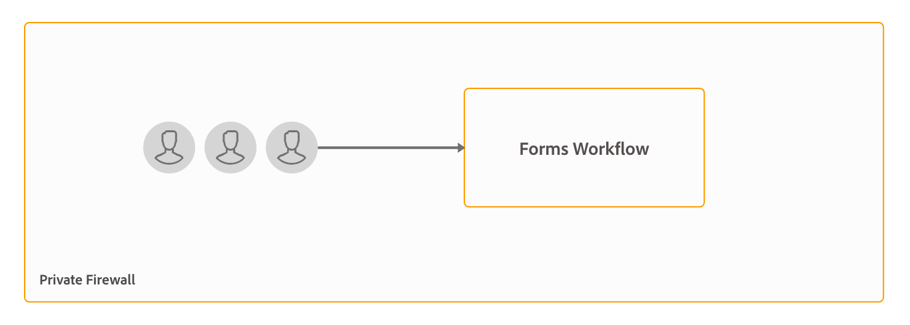

# AEM Forms{#architecture-and-deployment-topologies-for-aem-forms}的架构和部署拓扑

## 架构 {#architecture}

AEM Forms是部署到AEM(作为AEM包)的应用程序。 该包装称为AEM Forms附加包。 AEM Forms加载项包包含部署到AEM OSGi容器的服务（API提供程序）和部署到AEM OSGi的servlet或JSP（提供前端和REST API功能）,JSP由Sling框架管理。 下图描述了此设置：

AEM Forms的架构包括以下组件：

* **核心AEM服务：** AEM为部署的应用程序提供的基本服务。这些服务包括符合JCR的内容存储库、OSGI服务容器、工作流引擎、信任存储、密钥存储等。 这些服务可用于AEM Forms应用程序，但不由AEM Forms软件包提供。 这些服务是整个AEM堆栈的一个组成部分，而AEM Forms各组件使用这些服务。
* **Forms服** 务：提供与表单相关的功能，如创建、组合、分发和存档PDF文档，添加数字签名以限制对文档的访问，以及对条形码表单进行解码。这些服务可通过在AEM中共同部署的自定义代码公开使用。
* **Web层：基** 于常用和表单服务构建的JSP或Servlet，它们提供以下功能：

   * **创作前端**:用于创作和管理表单的表单创作和表单管理用户界面。
   * **表单再现和提交前端**:面向最终用户的界面，供AEM Forms的最终用户（例如，公民访问政府网站）使用。这提供表单再现（在Web浏览器中显示表单）和提交功能。
   * **REST API**:JSP和Servlet导出表单服务子集，供基于HTTP的客户端（如表单移动SDK）远程使用。

**AEM Forms在OSGi上：** AEM Forms在OSGi环境上是标准AEM作者或AEM发布，其上部署了AEM Forms包。您可以在[单个服务器环境、场和群集设置](/help/sites-deploying/recommended-deploys.md)中在OSGi上运行AEM Forms。 群集设置仅适用于AEM作者实例。

**AEM Forms在JEE上：** AEM Forms在JEE上是运行在JEE堆栈上的AEM Forms服务器。它具有AEM Author和AEM Forms加载项包以及在应用程序服务器上运行的单个JEE堆栈上共同部署的其他AEM FormsJEE功能。 您可以在单服务器和群集设置中在JEE上运行AEM Forms。 AEM Forms的JEE要求仅运行文档安全、流程管理以及升级到AEM Forms的LiveCycle客户。 以下是在JEE上使用AEM Forms的一些其他情况：

* **HTML工作区支持（针对使用HTML工作区的客户）:** JEE上的AEM Forms支持使用处理实例进行单一登录，为处理实例上呈现的某些资产提供服务，并处理HTML工作区中呈现的表单的提交。
* **高级附加表单／交互式通信数据处理**:AEM FormsJEE系统可以在需要高级流程管理功能的复杂情况下，用于额外处理表单／交互式通信数据（并将结果保存到合适的数据存储中）。

AEM FormsJEE还向AEM部分提供以下支助服务：

* **集成用户管** 理：允许JEE上的AEM Forms用户在OSGi用户上被识别为AEM表单，并帮助OSGi和JEE用户启用SSO。在需要在OSGi上的AEM表单和JEE上的AEM Forms表单之间单点登录（例如，HTML工作区）的情况下，这是必需的。
* **资产托管：** JEE上的AEM Forms可以为OSGi上的AEM Forms呈现的资产（例如，HTML5表单）提供服务。

AEM Forms创作用户界面不支持创建记录文档(DOR)、PDF forms和HTML5Forms。 此类资产使用独立的Forms设计器应用程序进行设计，并单独上传到AEM Forms经理。 或者，对于JEE上的AEM Forms，表单可以设计为应用程序(在AEM Forms工作台中)资源并部署到JEE服务器上的AEM Forms。

AEM FormsOSGi和AEM FormsJEE都有工作流功能。 您可以在OSGi上为AEM表单快速构建和部署基本工作流，无需在JEE上安装AEM Forms全面的流程管理功能。 在AEM Forms的OSGi上以表单为中心的工作流的[功能和AEM Forms在JEE上的流程管理功能方面存在一些差异。 ](capabilities-osgi-jee-workflows.md)在OSGi上开发和管理AEM Forms上以表单为中心的工作流，使用熟悉的AEM工作流和AEM收件箱功能。

## 术语{#terminologies}

下图显示了典型AEM Forms部署中使用的各种AEM Form服务器配置及其组件：

**作者：** 作者实例是在标准“作者”运行模式下运行的AEM Forms服务器。可以是AEM Forms在JEE上，也可以是AEM Forms在OSGi环境上。 它面向内部用户、表单和交互式通信设计人员和开发人员。 它启用以下功能：

* **创作和管理表单和交互式通信：设** 计人员和开发人员可以创建和编辑自适应表单和交互式通信，上传在外部创建的其他类型的表单，如在AdobeForms设计人员中创建的表单，以及使用Forms管理器控制台管理这些资产。
* **表单和交互式通信发布：** 在创作实例上托管的资产可以发布到发布实例以执行运行时操作。资产发布使用AEM的复制功能。 Adobe建议在所有作者实例上配置一个复制代理，以将已发布的表单手动推送到处理实例，并在处理实例上配置另一个复制代理，启用&#x200B;*接收时*&#x200B;触发器，以自动将已接收的表单复制到发布实例。

**发布：发** 布实例是在标准发布运行模式下运行的AEM Forms服务器。Publish实例适用于基于表单的应用程序的最终用户，例如访问公共网站和提交表单的用户。 它启用以下功能：

* 为最终用户渲染和提交Forms。
* 将原始提交的表单数据传输到处理实例，以便在最终记录系统中进一步处理和存储。 在AEM Forms提供的默认实施使用AEM的反向复制功能实现这一点。 还有一种替代实现，用于直接将表单数据推送到处理服务器，而不是先在本地保存它（后者是进行反向复制以激活的先决条件）。 对发布实例上可能敏感数据的存储存在疑虑的客户可以加入此[替代实施](/help/forms/using/configuring-draft-submission-storage.md)，因为处理实例通常位于更安全的区域中。
* 呈现和提交交互式通信和信件：在发布实例上呈现交互通信和字母，并将相应数据提交到处理实例以进行存储和后处理。 数据可以在发布实例上本地保存并反向复制到处理实例（默认选项），也可以直接推送到处理实例而不保存到发布实例。 后一种实施对注重安全的客户很有用。

**处理：** 在“作者”运行模式下运行的AEM Forms的实例，未将用户分配到表单管理器组。您可以将AEM Forms部署到JEE上，或将AEM Forms部署到OSGi上作为处理实例。 未分配这些用户是为了确保表单创作和管理活动不在处理实例上执行，并且仅在创作实例上执行。 处理实例启用以下功能：

* **处理来自发布实例的原始表单数据：这** 主要是通过AEM工作流在数据到达时触发的处理实例实现的。工作流可以使用现成提供的表单数据模型步骤将数据或文档存档到适当的数据存储。
* **安全存储表单数据**:处理为与用户隔离的原始表单数据提供防火墙后的存储库。作者实例上的表单设计者和发布实例上的最终用户都不能访问此存储库。

   >[!NOTE]
   >
   > Adobe建议使用第三方数据存储来保存最终处理的数据，而不要使用AEM存储库。

* **存储和后处理从Publish实例到达的对应：** AEM工作流执行相应字母定义的可选后处理。这些工作流可以将最终处理的数据保存到合适的外部数据存储中。

* **HTML工作区托管**:处理实例承载HTML Workspace的前端。HTML工作区为相关的任务/组分配提供UI，供审阅和审批过程使用。

处理实例配置为在作者运行模式下运行，因为：

* 它支持从发布实例反向复制原始表单数据。 默认数据存储处理函数需要反向复制功能。
* AEM工作流是处理来自发布实例的原始表单数据的主要手段，建议在作者风格的系统上运行。

## JEE上AEM Forms的示例物理拓扑{#sample-physical-topologies-for-aem-forms-on-jee}

以下建议的AEM FormsJEE拓扑主要针对从JEE上的LiveCycle或旧版AEM Forms升级的客户。 Adobe建议在OSGi上使用AEM Forms进行新安装。 在JEE上新安装AEM Forms仅建议使用文档安全和流程管理功能。

### 使用文档服务或文档安全功能的拓扑{#topology-for-using-document-services-or-document-security-capabilities}

AEM Forms客户计划只使用文档服务或文档安全功能，其拓扑类似于下面所示的拓扑。 此拓扑建议使用AEM Forms的单个实例。 如有必要，您还可以创建AEM Forms服务器的群集或群。 当大多数用户以编程方式访问AEM Forms服务器的功能并且通过用户界面进行干预达到最小时，建议使用此拓扑。 该拓扑对文档业务的批处理操作有一定帮助。 例如，使用输出服务每天创建数百个不可编辑的PDF文档。

尽管AEM Forms允许您从单台服务器设置和运行所有功能，但您应该执行容量规划、负载平衡，并为生产环境中的特定功能设置专用服务器。 例如，对于使用PDF Generator服务的环境，每天转换数千页并添加数字签名以限制对文档的访问，请为PDF Generator服务和数字签名功能设置单独的AEM Forms服务器。 它有助于提供最佳性能并独立扩展服务器。

### 使用AEM Forms进程管理{#topology-for-using-aem-forms-process-management}的拓扑

AEM Forms客户计划使用AEM Forms流程管理功能，例如，HTML Workspace的拓扑可以与下面显示的拓扑类似。 JEE服务器上的AEM Forms可以是单台服务器或群集配置。

如果您是从LiveCycleES4升级，则此拓扑与您已具有的LiveCycle密切镜像，除了在JEE上将AEM作者内置到AEM Forms之外。 此外，对于执行升级的客户，群集要求没有变化。 如果您在集群环境中使用AEM Forms，则可在AEM 6.5Forms继续使用。 对于使用HTML Workspace的JEE的AEM Forms的全新安装，将AEM作者实例内置到JEE环境是另外一项要求。

表单数据存储是第三方数据存储，用于存储表单的最终处理数据和交互式通信。 这是拓扑中的可选元素。 如有必要，还可以选择设置处理实例并将其存储库用作最终的记录系统。

对于计划在JEE服务器上使用AEM Forms进行流程管理功能(HTML Workspace)的客户，建议使用此拓扑，而无需使用任何后处理、自适应表单、HTML5表单和交互通信功能。

### 使用自适应表单的拓扑、HTML5表单、交互通信功能{#topology-for-using-adaptive-forms-html-forms-interactive-communication-capabilities}

AEM Forms客户计划使用AEM Forms数据捕获功能，例如自适应表单、HTML5Forms、PDF forms，其拓扑类似于下面显示的拓扑。 此拓扑还建议使用AEM Forms的交互通信功能。

您可以对上述拓扑进行以下更改／自定义：

* 使用HTML Workspace和AEM Forms应用程序需要AEM作者或处理实例。 您可以在JEE服务器上使用内置到AEM Forms的AEM作者实例，而不是设置其他外部AEM作者服务器。
* AEM作者或处理实例仅对OSGi上以Forms为中心的工作流、自适应表单、表单门户和交互式通信是必需的。
* 交互式通信代理UI通常在组织内运行。 因此，您可以将代理UI的发布服务器保留在专用网络中。
* AEM表单在OSGi实例上内置到JEE服务器上的AEM Forms，还可以在OSGi和监视文件夹上运行以Forms为中心的工作流。

## 在OSGi {#sample-physical-topologies-for-using-aem-forms-on-osgi}上使用AEM Forms的示例物理拓扑

### OSGi功能{#topology-for-data-capture-interactive-communication-form-centric-workflow-on-osgi-capabilities}上用于数据捕获、交互式通信、以表单为中心的工作流的拓扑

AEM Forms客户计划使用AEM Forms数据捕获功能，例如自适应表单、HTML5Forms、PDF forms，其拓扑类似于下面显示的拓扑。 此拓扑还建议在OSGi功能上使用交互通信和以Forms为中心的工作流，例如，将AEM收件箱和AEM Forms应用程序用于业务流程工作流。

### 使用监视文件夹功能进行脱机批处理{#topology-for-using-watched-folder-capabilities-for-offline-batch-processing}的拓扑

AEM Forms客户计划使用“监视文件夹”进行批处理，其拓扑类似于下面显示的拓扑。 拓扑显示群集环境，但您决定根据负载使用单个实例或AEM Forms服务器群。 第三方数据源是您自己的记录系统。 它用作监视文件夹的输入源。 拓扑还以打印文件的形式显示输出。 您还可以将输出内容存储到文件系统、通过电子邮件发送以及使用其他自定义方法使用输出。

### 使用文档服务功能进行基于API的脱机处理{#topology-for-using-document-services-capabilities-for-offline-api-based-processing}的拓扑

AEM Forms客户计划只使用文档服务功能，其拓扑类似于下面所示的拓扑。 此拓扑建议在OSGi服务器上使用AEM Forms群集。 当大多数用户以编程方式（使用API）访问AEM Forms服务器的功能以及通过用户界面进行的干预达到最小时，建议使用此拓扑。 该拓扑在多种软件客户端场景中非常有用。 例如，多个客户端使用PDF Generator服务按需创建PDF文档。

尽管AEM Forms允许您从单台服务器设置和运行所有功能，但您应该执行容量规划、负载平衡，并为生产环境中的特定功能设置专用服务器。 例如，对于使用PDF Generator服务环境每天转换数千页和多个自适应表单以捕获数据，请为PDF Generator服务和自适应表单功能设置单独的AEM Forms服务器。 它有助于提供最佳性能并独立扩展服务器。

