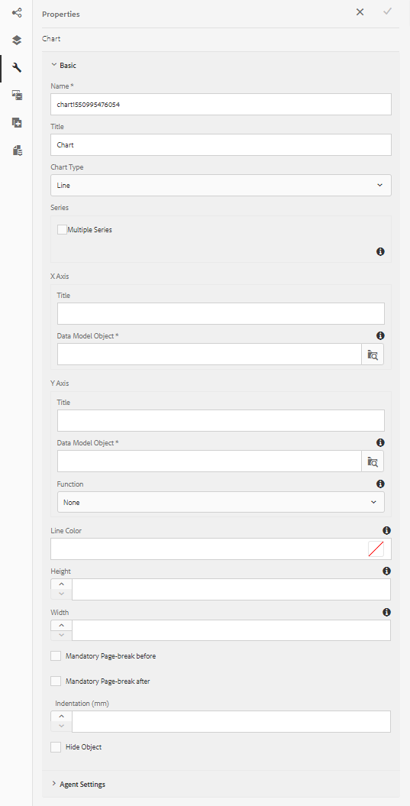

# 在交互式通信中使用图表{#using-charts-in-interactive-communications}

图表或图表是数据的可视表示形式。 它将大量信息浓缩为易于理解的可视格式，使交互式通信的收件人能够更好地可视化、解释和分析复杂数据。

在创建交互式通信时，可以添加图表以直观地表示来自交互式通信表单数据模型的二维数据。 图表组件允许您添加和配置以下类型的图表：饼图、列、圆环图、条形图、折线图、折线图和点、点、面积图和象限图。

## 在交互式通信中添加和配置图表 {#add-and-configure-chart-in-an-interactive-communication}

执行以下步骤以在交互式通信中添加和配置图表：

1. 点按 **组件** 的Sidekick中。
1. 拖放 **图表** 组件添加到以下组件之一：

   * 打印渠道：目标区域或图像字段
   * Web渠道：面板或目标区域

1. 在交互式通信编辑器中点按图表组件，然后选择 **[!UICONTROL 配置(]** )。

   图表属性将显示在左窗格中。

   

   打印渠道中线型图表的基本属性

   

   Web渠道中折线图的基本属性

1. 配置 [图表属性](../../forms/using/chart-component-interactive-communications.md#configure-chart-properties) 基于渠道类型。
1. （仅限打印渠道）在 **[!UICONTROL 代理设置]**，指定代理是否必须使用此图表。 如果 **[!UICONTROL 工程师必须使用此图表]** 选项，则座席可以点按 **[!UICONTROL 内容]** 选项卡，以显示或隐藏图表。

   

1. 点按  以保存图表属性。

   点按 **[!UICONTROL 预览]** 查看与图表关联的外观和数据。 点按 **[!UICONTROL 编辑]** 以重新配置图表的属性。

## 配置图表属性 {#configure-chart-properties}

在为打印和Web渠道创建图表时配置以下属性：

<table>
 <tbody>
  <tr>
   <td>字段</td>
   <td>描述</td>
   <td>渠道类型</td>
  </tr>
  <tr>
   <td>名称</td>
   <td>图表元素的标识符。 在此字段中指定的图表名称在图表上不可见。 当引用来自其他组件、脚本和SOM表达式的元素时，会使用此参数。</td>
   <td>打印和Web</td>
  </tr>
  <tr>
   <td>图表类型</td>
   <td>要生成的图表类型。 可用选项包括饼图、列、圆环、条形图、折线图、折线图和点、点和区域。</td>
   <td>打印和Web</td>
  </tr>
  <tr>
   <td>系列&gt;多个系列</td>
   <td>选择以为在X轴和Y轴上绘制的表单数据模型集合项添加多个系列。</td>
   <td>打印和Web</td>
  </tr>
  <tr>
   <td>系列&gt;数据模型对象</td>
   <td>用于向图表添加多个系列的表单数据模型集合项目的名称。<br /> 为X轴和Y轴上绘制的属性选择父表单数据模型对象属性，以形成有意义的系列。 您绑定的数据模型对象必须是Number、String或Date类型。</td>
   <td>打印和Web</td>
  </tr>
  <tr>
   <td>显示排列</td>
   <td>选择将各系列的数值排列程序。</td>
   <td>打印和Web</td>
  </tr>
  <tr>
   <td>X轴&gt;标题</td>
   <td>X轴的标题。</td>
   <td>打印和Web</td>
  </tr>
  <tr>
   <td>X轴&gt;数据模型对象</td>
   <td><p>要在X轴上绘制的表单数据模型集合项的名称。</p> <p>选择相同父数据模型对象的两个集合/数组类型属性，这些属性彼此有意义，以在图表的X轴和Y轴上绘制。 您绑定的数据模型对象必须是Number、String或Date类型。</p> </td>
   <td>打印和Web</td>
  </tr>
  <tr>
   <td>Y轴&gt;标题</td>
   <td>Y轴的标题。 </td>
   <td>打印和Web</td>
  </tr>
  <tr>
   <td>Y轴&gt;数据模型对象</td>
   <td><p>要在Y轴上绘制的表单数据模型收集项。 在打印通道中，Y轴的数据模型对象应为Number类型。</p> <p>选择相同父数据模型对象的两个集合/数组类型属性，这些属性彼此有意义，以在图表的X轴和Y轴上绘制。 </p> </td>
   <td>打印和Web</td>
  </tr>
  <tr>
   <td>Y轴&gt;函数</td>
   <td>用于计算y轴上值的统计/自定义函数。</td>
   <td>打印和Web</td>
  </tr>
  <tr>
   <td>隐藏对象</td>
   <td>选择以在最终输出中隐藏图表。</td>
   <td>打印和Web</td>
  </tr>
  <tr>
   <td>标题</td>
   <td>图表的标题。 </td>
   <td>打印</td>
  </tr>
  <tr>
   <td>高度</td>
   <td>图表的高度（以像素为单位）。</td>
   <td>打印</td>
  </tr>
  <tr>
   <td>宽度</td>
   <td>图表的宽度（以像素为单位）。您可以使用样式层或通过应用主题来控制Web渠道中图表的宽度。</td>
   <td>打印</td>
  </tr>
  <tr>
   <td>之前的必需分页</td>
   <td>选择以在图表之前添加强制的分页符，并将图表置于新页面的顶部。 </td>
   <td>打印</td>
  </tr>
  <tr>
   <td>之后的强制分页</td>
   <td>选择以在图表之后添加强制的分页符，并将内容放在图表之后的新页面顶部。 </td>
   <td>打印</td>
  </tr>
  <tr>
   <td>缩进</td>
   <td>图表从页面左侧缩进。 </td>
   <td>打印</td>
  </tr>
  <tr>
   <td>工具提示</td>
   <td><p>工具提示在Web渠道图表中数据点上的鼠标悬停时显示的格式。 默认值为${x}(${y})。 根据图表类型，当您将鼠标指向图表中的点、条或切片时，变量${x}和${y}将动态地替换为X轴和Y轴上的相应值，并显示在工具提示中。</p> <p>要禁用工具提示，请将 <span class="uicontrol">工具提示</code> 字段。 此选项不适用于折线图和面积图。 例如，请参阅 <a href="#chartoutputprintweb">示例1:打印和Web中的图表输出</a>.</code></p> </td>
   <td>Web</td>
  </tr>
  <tr>
   <td>特定于图表的配置</td>
   <td><p>除了常见配置外，还提供以下特定于图表的配置：</p>
    <ul>
     <li><strong>显示图例： </strong>显示饼图或圆环图的图例（启用时）。</li>
     <li><strong>图例位置： </strong>指定图例相对于图表的位置。 可用选项包括“右”、“左”、“上”和“下”。 建议在打印渠道中使用右侧图例。</li>
     <li><strong>内半径</strong>:可用于圆环图以指定图表中内圆的半径（以像素为单位）。</li>
     <li><strong>线条颜色</strong>:可用于折线图、折线图、点图和面积图以指定图表中折线的颜色。</li>
     <li><strong>点颜色</strong>:点图、折线图和点图可用于指定图表中点的颜色。<br /> </li>
     <li><strong>区域颜色</strong>:面积图可用于指定图表中折线下方区域的颜色。</li>
     <li><strong>引用点&gt;绑定类型： </strong>可用于象限图表以<strong> </strong>为引用点指定绑定类型。 使用静态文本或数据模型对象属性来定义引用点的值。</li>
     <li><strong>参照点&gt; X轴： </strong>如果选择 <span class="uicontrol">静态</code> 从“绑定类型”(Binding Type)下拉列表中为参照点指定X轴值。</code></li>
     <li><strong>参照点&gt; Y轴： </strong>如果选择 <span class="uicontrol">静态</code> 从“绑定类型”(Binding Type)下拉列表中为参照点指定Y轴值。</code></li>
     <li><strong>系列的引用点&gt;数据模型对象： </strong>如果选择 <span class="uicontrol">数据模型对象</code> 从“绑定类型”下拉列表中。 定义表单数据模型对象属性以确定参考点的系列. </code></li>
     <li><strong>系列的引用点&gt;数据模型对象值： </strong>如果选择 <span class="uicontrol">数据模型对象</code> 从“绑定类型”下拉列表中。 使用序列的表单数据模型对象属性和此字段中定义的值，以标识参考点的系列。</code></li>
     <li><strong>参照点&gt;参照点的数据模型对象： </strong>如果选择 <span class="uicontrol">数据模型对象</code> 从“绑定类型”下拉列表中。 定义表单数据模型对象属性，该属性是在X轴和Y轴上绘制的属性的同级属性。 此外，对于多个系列，定义数据模型对象属性，该属性是为该系列定义的数据模型对象属性的子实体。</code></li>
     <li><strong>引用点&gt;引用点的数据模型对象值： </strong>如果选择 <span class="uicontrol">数据模型对象</code> 从“绑定类型”下拉列表中。 使用表单数据模型对象属性作为参考点，并使用此字段中定义的值来标识图表的参考点。<br /> <strong>象限标签&gt;左上角：</strong> 可用于象限图表以指定左上象限的名称。</code></li>
     <li><strong>象限标签&gt;右上方：</strong> 可用于象限图表，以指定右上方象限的名称。</li>
     <li><strong>象限标签&gt;右下： </strong>可用于象限图表，以指定右下方象限的名称。</li>
     <li><strong>象限标签&gt;左下： </strong>可用于象限图以指定左下方象限的名称。</li>
    </ul> </td>
   <td>打印和Web</td>
  </tr>
 </tbody>
</table>

## 在图表中使用函数 {#use-functions-in-chart}

您可以将图表配置为使用统计函数从源数据计算值，以便在图表上绘制。 通过在图表中应用函数，可以绘制表单数据模型不直接提供的数据。


虽然图表组件附带一些内置函数，但您可以编写 [自定义函数](#customfunctionsweb) ，并使其可在web渠道的图表配置中使用。

图表组件默认提供以下函数：

**平均值（平均值）** 返回X轴或Y轴上另一个轴上给定值的平均值。

**总和** 返回X轴或Y轴上另一个轴上给定值的所有值的总和。

**最大值** 返回X轴或Y轴上另一轴上给定值的最大值。

**频率** 返回X轴或Y轴上另一轴上给定值的值数。

**范围** 返回X轴或Y轴上给定值的最大值与最小值之间的差值。

**中间值** 返回在X轴或Y轴上分隔较高值和较低值的值，该值在另一个轴上分隔给定值。

**最小** 返回X轴或Y轴上另一轴上给定值的最小值。

**模式** 返回在X轴或Y轴上出现次数最多的值，该值对应于另一个轴上的给定值。

有关更多信息，请参阅 [示例2:和频函数在折线图中的应用](#applicationsumfrequency).

### Web渠道中的自定义函数 {#customfunctionsweb}

除了在图表中使用默认函数外，您还可以在JavaScript™中编写自定义函数，并在图表组件中用于Web渠道的函数列表中提供这些函数。

函数以数组或值以及类别名称作为输入并返回值。 例如：

```javascript
Multiply(valueArray, category) {
 var val = 1;
 _.each(valueArray, function(value) {
 val = val * value;
 });
 return val;
}
```

编写自定义函数后，请执行以下操作以使其可在图表配置中使用：

1. 在与相关交互式通信关联的客户端库中添加自定义函数。 有关更多信息，请参阅 [配置提交操作](/help/forms/using/configuring-submit-actions.md) 和 [使用客户端库](/help/sites-developing/clientlibs.md).

1. 要在“函数”下拉菜单中显示自定义函数，请在CRXDe Lite中，创建 `nt:unstructured` 节点，其中包含以下属性：

   * 添加属性 `guideComponentType` 值为 `fd/af/reducer`. (mandatory)

   * 添加属性 `value` 到自定义JavaScript™函数的完全限定名称。 （必需）并将其值设置为自定义函数的名称，如Multiply。
   * 添加属性 `jcr:description` 其中，要显示为“函数”下拉列表中自定义函数名称的值。 例如， **乘**.

   * 添加属性 `qtip` 值将简短地描述自定义函数。 将指针悬停在 **函数** 下拉列表。

1. 单击 **全部保存** 以保存配置。

函数现在可在图表中使用。

## 示例1:打印和Web中的图表输出 {#chartoutputprintweb}

在“基本”选项卡中，您可以定义图表类型、包含数据的源表单数据模型属性、要在图表的X轴和Y轴上绘制的标签，以及（可选）用于计算图表上绘制的值的统计函数。

让我们借助使用交互式通信生成的卡语句，详细了解基本属性中所需的最低信息。 假设您要生成一个图表来描述报表中不同费用的金额。 要使用不同类型的图表来打印和输出交互式通信。

### 打印的列图 {#columnchartprint}

要完成此操作，请指定以下属性：

* **[!UICONTROL 名称]**  — 指定图表的名称。
* **[!UICONTROL 图表类型]**  — 选择 **列** 从下拉列表中。
* **[!UICONTROL 标题]**  — 为X轴指定费用类型，为Y轴指定事务处理金额。
* **[!UICONTROL 数据模型对象]**  — 选择数据模型对象属性，为X轴（费用类型）和Y轴（事务金额）创建数据绑定。


交互式通信打印渠道中的列图

### Web圆环图 {#donutchartweb}

要完成此操作，请指定以下属性：

* **[!UICONTROL 名称]**  — 指定图表的名称。
* **[!UICONTROL 图表类型]**  — 选择 **[!UICONTROL 圆环]** 从下拉列表中。
* **[!UICONTROL 数据模型对象]**  — 选择数据模型对象属性，为X轴（费用类型）和Y轴（事务金额）创建数据绑定。
* **[!UICONTROL 内半径]**  — 将“内半径”值指定为150，以指定图表中内圆的半径（以像素为单位）。
* **[!UICONTROL 工具提示]**  — 使用${x}(${y})默认格式显示工具提示。 工具提示显示为：费用类型（事务处理金额）。 示例：比特币的借记(10000)。


交互式通信Web渠道中的圆环图

## 示例2:和频函数在折线图中的应用 {#applicationsumfrequency}

通过在图表中应用函数，可以绘制表单数据模型不直接提供的数据。 在本例中，我们使用信用卡对帐单示例来了解如何将总和和频率函数应用于图表。


没有两笔“AirBnB借记”交易功能的折线图

### 求和函数 {#sum-function}

您可以应用sum函数来累加同一数据属性的多个实例的值，并只显示一次。 例如，在下图中，在Y轴上应用求和函数，以累计AirBnB交易（2050和1050）的两个借记金额，并仅显示一个交易(3100)。

当您想要对同一数据属性的多个实例进行汇总和显示总和时，总和函数可以使图表更有用。


### 频率函数 {#frequency-function}

Frequency函数返回另一个轴上给定值的Y轴值数。 通过在Y轴（交易金额）上应用“频率”函数，该图表显示AirBnB交易有两次借记，其余交易类型有一次借记。


## 示例3:Web中的多系列象限图 {#example-multi-series-quadrant-chart-in-web}

图表绘制在特定日期范围内执行的事务处理的金额。 象限图表提供了将图表区域划分为四个标记部分的功能。 该字符对X轴和Y轴使用静态参考点。 使用多系列功能根据银行名称来分隔数据。

要完成此操作，请指定以下属性：

* **名称：** 指定图表的名称。
* **图表类型：** 选择 **象限** 从下拉列表中。

* 选择 **多系列** 复选框。
* **数据模型对象**:为系列指定数据模型对象属性。 银行名称的数据模型对象属性是在X轴和Y轴中绘制的数据模型对象属性的父项。
* **数据模型对象：** 选择数据模型对象属性，以创建X轴（交易日期）和Y轴（交易金额）的数据绑定。
* 在 **参考点** 选择 **静态** 作为绑定类型。

* 指定X轴和Y轴参照点的值。
* 指定左上、右上、右下和左下象限的象限标签。
* 选择 **显示图例** 复选框以显示银行名称的颜色代码。


