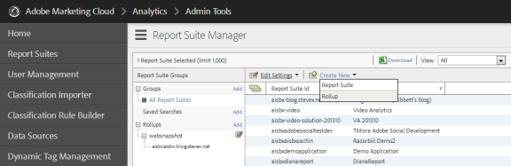

# 使用Cloud Service框架进行分析 {#analyticsusingcloudframework}

AEM Forms与Analytics集成，允许您捕获和跟踪已发布表单和文档的性能指标。 分析这些量度背后的目的是，根据有关提高表单或文档可用性的更改数据做出明智的决策。

>[!NOTE]
>
>AEM Forms中的分析功能作为AEM Forms附加组件包的一部分提供。 有关安装附加组件包的信息，请参阅[安装和配置AEM Forms](../../forms/using/installing-configuring-aem-forms-osgi.md)。
>
>除了附加组件包之外，您还需要Adobe Analytics帐户和AEM实例管理员权限。 有关解决方案的信息，请参阅[Adobe Analytics](https://www.adobe.com/solutions/digital-analytics.html)。

您还可以使用Adobe启动项执行分析。 有关如何将AEM Forms与Adobe启动项集成的详细信息，请参阅[使用Adobe启动项的Analytics](/help/forms/using/integrate-aem-forms-with-adobe-analytics.md)。

## 概述 {#overview}

您可以使用Adobe Analytics发现用户在使用自适应表单、HTML5表单和交互式通信时面临的交互模式和问题。 Adobe分析开箱即用地跟踪和存储有关以下参数的信息：

* **平均填写时间**：填写表单所花费的平均时间。
* **呈现版本**：表单被打开的次数。
* **草稿**：表单在草稿状态下保存的次数。
* **提交次数**：提交表单的次数。
* **中止**：用户未完成表单而离开的次数。

您可以自定义Adobe Analytics以添加/删除更多参数。 除上述信息外，此报表还包含有关HTML5和自适应表单各个面板的以下信息：

* **时间**：在面板和面板的字段上花费的时间。
* **错误**：在面板和面板的字段中遇到的错误数。
* **帮助**：用户打开面板帮助和面板字段的次数。

## 创建报表包 {#creating-report-suite}

Analytics数据存储在特定于客户的存储库（称为报表包）中。 要创建报表包并使用Adobe Analytics，您必须拥有有效的Adobe Marketing Cloud帐户。 执行以下步骤之前，请确保您拥有有效的Adobe Marketing Cloud帐户。

执行以下步骤可创建报表包。

1. 在[https://sc.omniture.com/login/](https://sc.omniture.com/login/)登录
1. 在Marketing Cloud中，选择&#x200B;**管理员** > **Admin Console** > **报表包**。
1. 在报表包管理器中选择&#x200B;**新建** > **报表包**。

   

   创建新报表包

1. 确保第一个下拉列表设置为&#x200B;**从模板创建**，然后选择&#x200B;**Commerce**。
1. 找到&#x200B;**报表包ID**&#x200B;字段并添加新的报表包ID。 例如，JJEsquire。 报表包ID显示在报表包ID字段的下方。 它包括一个自动前缀，通常是公司名称。
1. 添加新&#x200B;**站点标题**。 例如，JJEsquire Getting Started Suite。 此标题在Analytics UI中使用。 在代码中使用报表包ID。
1. 从下拉列表中选择&#x200B;**时区**。 进入此报表包的所有数据都会根据定义的时区进行记录。
1. 将&#x200B;**基本URL**&#x200B;和&#x200B;**默认页面**&#x200B;字段保留为空。 这两个值只能从Adobe Marketing Cloud界面用于链接到您的网站。
1. 将&#x200B;**上线日期**&#x200B;保留为今天。 上线日期决定激活报表包的日期。
1. 在&#x200B;**预计每日页面查看次数**&#x200B;字段中，键入100。 使用此字段可估计您预计网站每天的页面查看次数。 此估算允许Adobe安装适当数量的硬件来处理您将收集的数据。
1. 从下拉列表中选择&#x200B;**基本货币**。 进入此报表包的所有货币数据都将转换并存储为此货币格式。
1. 单击&#x200B;**创建报表**&#x200B;包。 您应该会在页面刷新中看到一条消息，指出您的报表包已成功创建。
1. 选择新创建的报表包。 导航到&#x200B;**编辑设置** > **常规** > **常规帐户设置**。

   

   一般帐户设置

1. 在“常规帐户设置”屏幕中，启用&#x200B;**地理报表**，然后单击&#x200B;**保存。**
1. 导航到&#x200B;**编辑设置** > **流量** > **流量变量**。
1. 在报表包中，配置并启用以下流量变量。

   * **formName**：自适应表单的标识符。
   * **formInstance**：自适应表单实例的标识符。 为此变量启用路径报表。
   * **字段名**：自适应表单字段的标识符。 为此变量启用路径报表。
   * **panelName**：自适应表单面板的标识符。 为此变量启用路径报表。
   * **formTitle**：表单标题。
   * **fieldTitle**：表单字段标题。
   * **panelTitle**：表单面板的标题。
   * **analyticsVersion**：表单分析的版本。

1. 导航到&#x200B;**编辑设置** > **转化** > **成功事件**。 定义并启用以下成功事件：

   | 成功事件 | 类型 |
   |---|---|
   | 放弃 | 计数器 |
   | 渲染 | 计数器 |
   | panelVisit | 计数器 |
   | fieldVisit | 计数器 |
   | 保存 | 计数器 |
   | 错误 | 计数器 |
   | 帮助 | 计数器 |
   | 提交 | 计数器 |
   | 逗留时间 | 数字 |

   >[!NOTE]
   >
   >用于配置AEM Forms Analytics的事件编号和Prop编号必须不同于[AEM Analytics](/help/sites-administering/adobeanalytics.md)配置中使用的事件编号和Prop编号。

1. 注销Adobe Marketing Cloud帐户。

## 创建Cloud Service配置 {#creating-cloud-service-configuration}

Cloud Service配置是有关Adobe Analytics帐户的信息。 通过配置，Adobe Experience Manager (AEM)可以连接到Adobe Analytics。 为您使用的每个Analytics帐户创建单独的配置。

1. 以管理员身份登录到您的AEM创作实例。
1. 单击左上角的&#x200B;**Adobe Experience Manager** > **工具**  > **Cloud Service** > **旧版Cloud Service**。
1. 找到&#x200B;**Adobe Analytics**&#x200B;图标。 单击&#x200B;**显示配置**，然后继续单击&#x200B;**[+]**&#x200B;以添加新配置。

   如果您是首次使用的用户，请单击&#x200B;**立即配置**。

1. 向新配置添加标题（填写名称字段是可选的）。 例如，我的分析配置。 单击&#x200B;**创建**。

1. 在配置页面上打开“编辑”面板时，请填写以下字段：

   * **公司**：你公司在Adobe Analytics中列出的名称。
   * **用户名**：用于登录到Adobe Analytics的名称。
   * **密码**：上述帐户的Adobe Analytics密码。
   * **数据中心**： Adobe Analytics帐户的数据中心。

1. 单击&#x200B;**连接到Analytics**。 将出现一个对话框，并显示连接成功的消息。 单击&#x200B;**确定**。

## 创建Cloud Service框架 {#creating-cloud-service-framework}

Adobe Analytics框架是Adobe Analytics变量与AEM变量之间的一组映射。 使用框架配置表单如何将数据填充到Adobe Analytics报表中。 框架与Adobe Analytics配置相关联。 您可以为每个配置创建多个框架。

1. 在AEM Cloud Services控制台的Adobe Analytics下，单击&#x200B;**显示配置**。
1. 单击Analytics配置旁边的&#x200B;**[+]**&#x200B;链接。

   

   Adobe Analytics配置

1. 为框架键入&#x200B;**Title**&#x200B;和&#x200B;**Name**，选择&#x200B;**Adobe Analytics** Framework，然后单击&#x200B;**创建**。 此时将打开框架进行编辑。
1. 在侧面板的报表包部分中，单击&#x200B;**添加项**，然后使用下拉菜单选择与框架交互的报表包ID（例如，JJEsquire）。
1. 在报表包ID旁边，选择要将信息发送到报表包的服务器实例。

   

1. 将&#x200B;**other**&#x200B;类别中的&#x200B;**Form Analytics组件**&#x200B;从Sidekick拖动到框架上。
1. 要通过组件中定义的变量来映射Analytics变量，请将变量从AEM内容查找器拖动到跟踪组件上的字段。

   

1. 使用sidekick中的&#x200B;**页面选项卡**&#x200B;激活框架，单击&#x200B;**激活框架**。

## 配置AEM Forms Analytics配置服务 {#configuring-aem-forms-analytics-configuration-service}

1. 在创作实例上，打开`https://<server>:<port>;/system/console/configMgr`处的AEM Web控制台配置管理器。
1. 查找并打开AEM Forms Analytics配置

   

   AEM Forms Analytics配置服务

1. 为以下字段指定适当的值，然后单击&#x200B;**保存**。

   * **SiteCatalyst框架**：选择您在设置跟踪框架部分中定义的框架/配置。
   * **字段时间跟踪基线**：以秒为单位指定必须跟踪字段访问的持续时间。 默认值为 0。如果该值大于0（零），则会向Adobe Analytics服务器发送两个单独的跟踪事件。 第一个事件会指示Analytics服务器停止跟踪已退出的字段。 第二个事件在指定的持续时间过后发送。 第二个事件会指示Analytics服务器开始跟踪已访问的字段。 使用两个不同的事件有助于准确测量在字段上逗留的时间。 当值为0（零）时，单个跟踪事件将发送到Adobe Analytics服务器。

   * **Analytics报告同步cron**：指定用于从Adobe Analytics获取报告的cron表达式。 默认值为0 0 2 ？&#42; &#42;。

   * **获取报告超时：**&#x200B;指定等待服务器响应分析报告的持续时间（以秒为单位）。 默认时间为120秒。

   >[!NOTE]
   >
   >超时报表获取操作可能需要多达10秒，而不是指定的秒数。

1. 在发布实例上重复步骤1-3以配置analytics。

现在，您可以为表单启用分析并生成分析报表。

## 为表单或文档启用分析 {#enabling-analytics-for-a-form-or-document}

1. 在`https://[hostname]:'port'`登录AEM门户。
1. 单击&#x200B;**Forms > Forms &amp; Documents**，选择表单或文档，然后单击&#x200B;**启用Analytics**。 已启用Analytics。

   

   为表单启用分析

   **A.**&#x200B;启用Analytics按钮&#x200B;**B.**&#x200B;选定表单

   有关查看表单分析报表的详细信息，请参阅[查看和了解AEM Forms Analytics报表](../../forms/using/view-understand-aem-forms-analytics-reports.md)。
