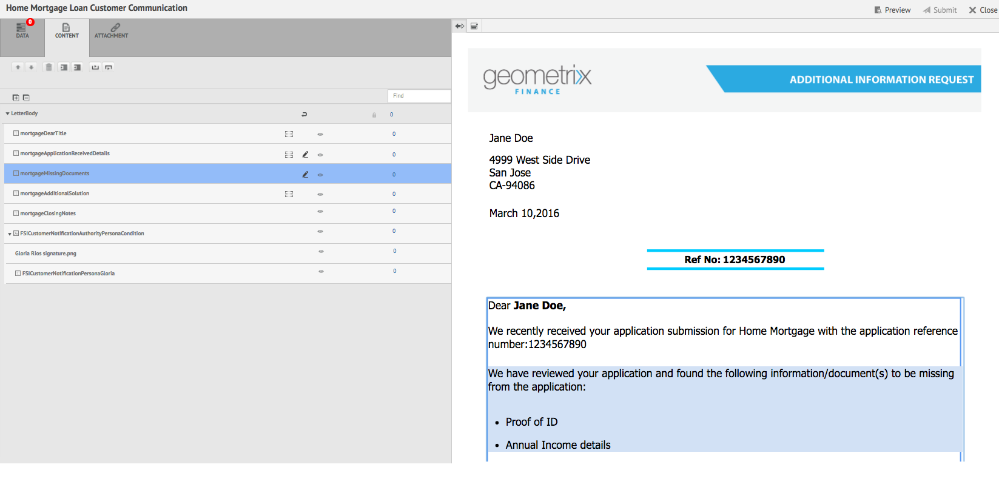

# 创建对应{#create-correspondence}

## 在“创建对应”用户界面中创建对应 {#create-correspondence-in-the-create-correspondence-user-interface}

在“通信 [管理”中创建信函模板后](../../forms/using/create-letter.md)，最终用户／代理／索赔调整器可以在“创建通信”用户界面中打开信函并通过输入数据、设置内容和管理附件来创建通信。 最后，报销申请调整者或代理人可以在预览模式下管理内容并提交信函。

### 预览对应内容 {#preview-a-correspondence}

使用以下步骤选择要预览的字母：

1. 在“字母”页面上，点按 **选择**。
1. 点击相应的字母以选择它。

   

   选择字母

1. 对于基于数据字典的字母，选择“预 **览** ”>“ **预览**”。 或者，对于非基于数据字典的字母，选择“预 **览”**。 您还可以将鼠标悬停在字母上（无需选择它），然后点按字母预览图标以预览它。

   >[!NOTE]
   >
   >如果数据字典与字母不关联，则打开字母预览。 否则，如果字母是基于数据字典的，则“对应管理”会在“预览”菜单中显示“预览”和“自定义”选项，您可以选择两个选项之一。 还可以将测试数据与数据字典相关联。 当“数 [据字典”有关联的测试数据时](../../forms/using/data-dictionary.md#p-working-with-test-data-p)，在选择预览选项时，将打开常规预览并填充测试数据。

1. 要在预览通信时渲染通信，您应是管理员或以下某个用户组的一部分：

   * 表单用户（在创作实例上预览）
   * cm-agent-users（用于发布实例上的再现）
   如果您不具备所需的权限，请向管理员请求相应的访问权限。 有关创建用户并将其添加到用户组的详细信息，请 [参阅将用户或用户组添加到用户组](/help/sites-administering/security.md)。 如果您尝试在没有相应权限的情况下渲染通信，将显示404错误页面。

1. 如果已选择“预 **览** ”>“ **自定义**”，则会打开对话框。 在对话框中，选择与数据字典相对应的数据文件以预览字母，然后选择“预 **览”**。 基于特定字母的数据字典创建数据文件。 有关数据文件的详细信息，请参阅 [数据字典](../../forms/using/data-dictionary.md#p-working-with-test-data-p)。

   

1. 默认情况下，将打开字母HTML预览（移动表单预览），其中“数据”选项卡处于焦点。

   有关移动表单及其支持的功能的更多信息，请参 [阅移动表单与PDF表单的功能区分](https://helpx.adobe.com/livecycle/help/mobile-forms/feature-differentiation-mobile-forms-pdf.html)。

   有三个选项卡：数据、内容和附件。 如果没有数据元素（占位符变量和布局字段），则在中直接打开字母，并显示“内容”选项卡。 只有在存在附件或启用了库访问时，“附件”选项卡才可用。

   >[!NOTE]

   >有关在字母预览的HTML或PDF再现模式之间切换的详细信息，请参 [阅更改字母的再现模式](#changerenditionmode)。 有关Correponse Management和AEM中PDF支持的更多信息，请参阅 [Distinuation of NPAPI browser plug-ins and its](https://helpx.adobe.com/aem-forms/kb/discontinuation-of-npapi-plugins-impact-on-aem-forms.html) and [PDF Forms to HTML5 Forms](https://helpx.adobe.com/aem-forms/kb/pdf-forms-to-html5-forms.html)。

### Enter data {#enterdata}

在“数据”选项卡中，填写可用的布局字段和占位符。

1. 根据需要在字段中输入数据和内容变量。 填写标有星号(*)的所有必填字段，以启用“提 **交** ”按钮。

   点按HTML字母预览中的数据字段值，以在“数据”选项卡中高亮显示相应的数据字段。

   

### 管理内容 {#managecontent}

在内容选项卡中，管理字母中的文档片段和内容变量等内容。

1. Select **Content**. “对应管理”显示信函的内容选项卡。

   

1. 根据需要，在“内容”选项卡中编辑内容模块。 要将焦点放在内容层次结构中的相关内容模块中，您可以点按字母预览中的相关行或段落，或直接点按内容层次结构中的内容模块。

   例如，行“我们已审阅……“ ”在下图中被选中，而相关内容模块则在“内容”选项卡中被选中。

   

   在“内容”或“数据”选项卡中，通过点按HTML字母预览左上角的“高亮显示选定的模块”( )，可以禁用或启用在字母预览中选择相关文本、段落或数据字段时转至内容／数据模块的功能。

   有关“创建对应”用户界面中各个模块可用的操作的详细信息，请参阅“创建对应 [”用户界面中的“操作”和“信息”](../../forms/using/create-letter.md#main-pars-header-9)。

1. 要定位内容模块，请使用“查找”字段。 输入内容模块的完整或部分名称或标题，以在相应模块中搜索它。
1. 点按列表、文 、条件或目标区域前面的显示图标（显示），以在字母中显示或隐藏它。
1. 要编辑内联或可编辑的文本模块，请点按相关的 **“编辑** ”图标( )，或在字母预览中双击相关文本模块。

   系统显示一个文本编辑器以编辑文本并设置其格式。

   浏览器中的默认拼写检查器在文本编辑器中检查拼写。 要管理拼写和语法检查，您可以编辑浏览器的拼写检查器设置或安装浏览器插件／加载项来检查拼写和语法。

   您还可以使用文本编辑器中的各种键盘快捷键管理、编辑文本和设置文本格式。 有关“对应管理键 [盘快捷键](/help/forms/using/keyboard-shortcuts.md#correspondence-management) ”中的文本编辑器键盘快捷键的详细信息。

   

   您可能希望重复使用文档另一个应用程序中存在的多个文本段落之一。 您可以直接复制和粘贴文本，如从MS Word、HTML页面或任何其他应用程序复制和粘贴文本。

   您可以在可编辑的文本模块中复制和粘贴一个或多个文本段落。 例如，您的MS word文档可能包含可接受的居住校样的项目符号列表，如下所示：

   

   您可以直接将MS word文档中的文本复制并粘贴到可编辑的文本模块中。 文本模块中将保留项目符号列表、字体和文本颜色等格式。

   

   >[!NOTE]
   >
   >但是，粘贴文本的格式有一些 [限制](https://helpx.adobe.com/aem-forms/kb/cm-copy-paste-text-limitations.html)。

   您可以使用Tab键缩进字母中的文本和数字。 例如，可以使用Tab键将列表中的多列文本对齐为表格格式。

   

   示例：使用Tab键将多列文本对齐为表格式格式

   >[!NOTE]
   >
   >有关为文本模块和字母设置制表符间距的详细信息，请参 [阅有关使用制表符间距排列文本的更多信息](https://helpx.adobe.com/aem-forms/kb/cm-tab-spacing-limitations.html)。

1. 如果需要，在对应中插入特殊字符。 例如，您可以使用“特殊字符”调板插入：

   * 货币符号，如€、¥和英镑
   * 诸如∑、√、gratab和^等数学符号
   * 标点符号，‟如和
   

   通信管理内置了210个特殊字符。 管理员可以 [通过自定义添加对更多／自定义特殊字符的支持](../../forms/using/custom-special-characters.md)。

1. 要在可编辑的内联模块中突出显示\突出显示部分文本，请选择该文本，然后点按高亮颜色。

   

   您可以直接点按“基本颜色”调板中存在的基本颜色 **[A]** ，或在使用滑块 **B后点按“选择”****[]** ，以选择相应的颜色阴影。

   或者，您也可以转到高级选项卡以选择适当的色相、亮度和饱和度 **[C]** ，以创建精确的颜色，然后点按选择 **[D]** 以应用颜色以高亮显示文本。

   

1. 进行适当的内容和格式更改，然后点按 **保存**。 点按( )可在可编辑的文本模块之间移动，或点按 **保存并下一步** ，可保存更改并移到下一个可编辑的文本模块。
1. 系统还显示每个分支的未填充变量。 当没有未填充的变量时，未填充的变量将显示为0。 如果存在未填充的变量，您可以点按分支以展开它并找到未填充的变量。 使用内容工具栏可删除内容、增加／减少内容缩进以及在内容前后插入分页符。

   您可以在数据模块上方和下方插入分页符，即使它们是列表和条件的一部分也是如此。

1. 点按打开／关闭内容变量( )以打开内容变量并相应地填充它们。
1. 正确填充未填充变量后，未填充变量的计数将设置为0。

   在“创建对应”用户界面中，未填充的变量计数显示在包含至少一个变量的任何模块的层次结构的每个级别。 如果模块包含未填充的变量，则计数将显示在变量、模块、目标区域和字母模板级别。

   未填充的变量计数包括：

   * 仅不受保护的数据字典和占位符变量。 变量计数不包括布局或受保护的数据字典变量。
   * 必填字段。
   * 布局字段（如果这些字段为必填字段）并绑定到用户。
   * 仅唯一变量实例。 如果模块、目标区域或字母模板包含同一变量的两个或多个实例，则计数将显示为1(1)。 但是，对于每个实例，计数显示为1。
   未填充的变量计数不包括取消选择的模块。 如果某个模块包含在字母模板中，但不在字母中，则不会显示此模块中未填充变量的计数。

   对于目标区域、模块和变量，计数显示在字母模板中每个对象的右侧。 但是，对于完整模板，计数会显示在“创建对应”状态栏中。

   字母模板中的模块显示未填充的变量计数，如下所述：

   * **文本** 显示文本模块中包含的唯一未填充占位符变量和数据字典元素的总和。
   * **条件** ：显示条件中包含的唯一未填充条件变量和生成模块中包含的变量的总和。
   * **列表** 显示分配给列表的模块中包含的所有唯一未填充变量的总和。
   * **目标区域** 显示分配给目标区域的模块中包含的所有唯一未填充变量的总和。
   请注意以下关于具有默认值的变量的注意事项：

   * 布尔变量字段默认为 *false*。 但是，该变量被视为未填充。 这意味着变量计数包括所有值为false的布尔变量 *字段*。

   * 数字变量字段默认为 *0（零）*。 但是，该变量被视为未填充。 这意味着变量计数包括所有值为 *0（零）的数字变量字段*。

#### “创建对应内容”选项卡中的可用操作和信息 {#actions-and-info-available-in-the-create-correspondence-content-tab}

**目标区域**

* 插入空行：插入新的空行。
* 插入内联文本：插入新文本模块。
* 订单锁定（信息）:指示内容的顺序无法更改。
* 未填充值（信息）:指示目标区域中未填充变量的数量。

**模块**

* 选择（眼睛图标）:包含／排除字母中的模块。
* 跳过项目符号（适用于列表模块及其子模块）:在特定模块中跳过项目符号。
* 分页前（适用于目标区域的子模块）:在模块前插入分页符。
* 分页后（适用于目标区域的子模块）:在模块前插入分页符。
* 未填充值（信息）:指示目标区域中未填充变量的数量。
* 编辑（仅限文本模块）:打开富文本编辑器以编辑文本模块。
* 数据面板（文本和条件模块）:打开模块的所有变量。

**列表模块**

* 插入空行：插入新的空行。
* 内容库：打开内容库以向列表添加模块。
* 列表设置（仅限嵌套列表）:
* 订单锁定（信息）:指示无法更改列表项目的顺序。

### 管理附件 {#manage-attachments}

1. 选择 **附件**。 “对应管理”按创建信函模板时的设置显示可用的附件。
1. 通过点按视图图标，您可以选择不提交附件和字母，也可以点按附件中的叉号，将其从字母中删除。 对于指定的附件，在创建字母模板时，视图和删除图标将作为“必需”禁用。
1. 点按库访问(库访 )图标以访问内容库，以将DAM资产作为附件插入。

   >[!NOTE]
   >
   >“库访问”图标可用，但在创作字母时仅启用了库访问。

1. 如果创建对应时未锁定附件的顺序，则可以通过选择附件并点按向下和向上箭头来重新排序附件。

   有关详细信息，请参阅 [附件交付](#attachmentdelivery)。

### 在预览中管理内容并提交信函 {#manage-content-in-preview-and-submit-the-letter}

您可以进行布局和内容相关更改，以确保信件的外观符合您的意图，并提交到各种后续流程。

1. 要高亮显示字母中的所有可编辑内容，请点按高亮显 **示可编辑部分**。

   字母的可编辑内容以灰色背景高亮显示。

   

1. 根据需要，在“内容”选项卡中编辑内容模块。 要将焦点放在内容层次结构中的相关内容模块中，您可以点按字母预览中的相关行或段落，或直接点按内容层次结构中的内容模块。

   例如，行“允许我们访问……” 在下图中选择，并在“内容”选项卡中选择相应的内容模块。

   通过点按内容中的高亮显示选定模块( )，您可以禁用或启用功能，以在字母预览中点击相关文本、段落或数据字段时，高亮显示“内容”选项卡中的内容模块。

   有关“创建对应”用户界面中各个模块可用的操作的详细信息，请参阅“创建对应 [”用户界面中的“操作”和“信息”](../../forms/using/create-letter.md#main-pars-header-9)。

1. 要向字母中添加分页符，请点按要插入分页符的位置，然后选择“分页符修改前”或“分页符修改后”( )。

   将在字母中插入显式分页符占位符。 要查看显式分页符对字母的影响，请参阅拼合的PDF预览。

   >[!NOTE]
   >
   >由于移动表单不支持分页，因此页眉和页脚只显示一次。 但是，您可以在布局（每页）中显式设置页眉和页脚以显示在移动表单预览中。 此外，字母中的空白页面（如果有）不会显示在移动表单预览中。

   

1. 要将字母另存为草稿（您可以在以后继续处理该草稿），请点按另存为草稿。 要使用此选项，您的信件需要发 [布](../../forms/using/publishing-unpublishing-forms.md#publishanasset)。 有关详细信息，请参阅保存草稿和提 [交字母实例下的草稿实例](#savingdrafts)。

   

   将出现“起草字母名称”对话框，其中带有字母实例id。 您可以（可选）编辑此ID。 记下字母Id，然后点按完 **成**。 您以后可以使用此ID重 [新加载草稿字母](../../forms/using/submit-letter-topostprocess.md#main-pars-header-1)。

1. 要以拼合的PDF形式预览字母，并在提交时具有精确的布局和分页符，请点按(预 )预览。

   该字母显示为拼合的PDF。 拼合的PDF是字母的精确表示形式，因为它将使用字母的正确字体、分隔符和布局提交。

   >[!NOTE]
   >
   >如果您使用的是Mozilla Firefox和HTML再现类型，要将字母预览为拼合PDF，请确保使用本机浏览器插件，而不是Acrobat插件。 要选择本机浏览器插件，请转到Mozilla Firefox的设置，对于内容类型PDF，选择“在Firefox中预览”。

1. 如果您认为拼合的PDF预览令人满意，请点按“提 **交** ”以提交该字母。 或者，要更改字母，请点按退出预 **览** ，返回至字母的创建对应UI预览以更改字母。 点按提交时，如果Publish实例上启用了管理信函实例配置，则会生成提交信函实例。

   有关详细信息，请参阅保存草稿和提交书信实例下的草稿实例。

   您还可以将字母另存为草稿，以便以后对字母进行更改。

   进行所需的更改后，您可以从HTML5预览提交字母，或再次点按预览以查看拼合的PDF输出。

   有关HTML5表单与PDF表单之间差异的信息，请参阅HTML5表 [单与PDF表单之间的功能区分](../../forms/using/feature-differentiation-html5-forms-pdf-forms.md)。

## 保存草稿和提交书信实例 {#savingdrafts}

在“创建对应”用户界面中呈现字母后，可以将该字母保存为被查看。

可以保存两种类型的字母实例：草稿实例和提交实例。

* **草稿实例**:草稿实例捕获您预览的字母的当前状态。 要保存草稿实例，请首先确保字母和字母引用的所有资产处于“已发布”状态。 有关发布信函的信息，请参阅 [发布资产](../../forms/using/publishing-unpublishing-forms.md#publishanasset)。 您需要先发布一个字母，然后才能将其保存为草稿，因为当您发布字母时，您会创建该字母的某个版本、其从属资产以及该版本的数据。 您或其他用户无法编辑信件的已发布版本，稍后可以恢复该信件，而不会与已发布版本发生任何意外差异。 您以后可以返回到此实例，并从离开的位置继续。

* **提交实例**:提交实例会在提交时捕获字母的状态。 提交实例存储在信函实例在后期处理后的PDF状态以及用户在创建对应用户界面中输入的数据。

只有在发布实例上查看字母时，才能保存此类实例。 默认情况下，保存实例时关闭。 要启用字母实例的保存，请执行以下步骤。

1. 在AEM中，使用以下URL打开服务器的Adobe Experience Manager Web Console配置：https://&lt;server>:&lt;port>/&lt;contextpath>/system/console/configMgr
1. 找到 **[!UICONTROL 对应管理配置]** ，然后单击它。
1. 选中“ **[!UICONTROL 管理发布配置上的字母实例]** ”，然后单击“ **[!UICONTROL 保存”]**。

打开保存字母实例时，您可以选择保存字母实例的位置。 保存字母实例有两种选项：本地保存或远程保存。

### 本地保存 {#local-save}

字母实例保存在发布实例上，并在作者实例上反向复制。

### 远程保存 {#remote-save}

对于在发布实例上保存用户数据有顾虑的用户，此选项存在，通常情况下，在公司防火墙之外。 打开远程保存后，字母实例不会保存在发布实例上，但会在通过LiveCycle Client SDK配置指定的处理作者处远程保存。

#### 启用远程保存 {#enable-remote-save}

1. 在AEM中，使用以下URL打开服务器的Adobe Experience Manager Web Console配置： `https://<server>:<port>/<contextpath>/system/console/configMgr`
1. 搜索“ **[!UICONTROL 对应管理配置]** ”并单击它。
1. 找到“ **[!UICONTROL 远程保存]** ”配置，选中它，然后单击“ **[!UICONTROL 保存”]**。

#### 指定处理创作设置 {#specify-processing-author-settings}

1. 在AEM中，使用以下URL打开服务器的Adobe Experience Manager Web Console配置： `https://<server>:<port>/<contextpath>/system/console/configMgr`

   

1. 在此页上，找到Adobe liveCycle Client SDK配置，然后单击它以展开它。

1. 在“处理服务器URL”中，输入LiveCycle服务器的名称，提供登录信息，然后单击“保 **存”**。

   

1. 如有必要，请设置要用来访问服务器的用户名和密码。

#### 附件递送 {#attachmentdelivery}

* 在PDF中，信件附件是可用的后期处理，后者是在提交信件后创建的。
* 当使用服务器端API将书信渲染为交互式或非交互式PDF时，渲染的PDF将包含附件作为PDF附件。
* 当使用“创建对应”用户界面将与字母模板关联的后处理作为“提交”或“完成对应”操作的一部分加载时，附件将作为AttachmentDocs参数中的List&lt;com.adobe.idp.Document>传递。
* 开箱即用的交付机制（如电子邮件和打印）也会提供附件以及生成的通信的PDF。

## 字母预览的再现模式：移动表单预览和PDF预览 {#rendition-modes-of-letter-preview-mobile-forms-preview-and-pdf-preview}

AEM Forms Commentering Management在“创建对应UI”中将字母显示为HTML。 但是，“对应管理”仍支持还原到PDF预览，而不是HTML预览。 有关在HTML和PDF预览模式之间切换的详细信息，请参 [阅更改字母再现模式](#changerenditionmode)。

以下是HTML和PDF预览中提供的优势和功能。

**移动表单/HTML预览的优势**

* **点按数据字段值以高亮显示相应的数据字段**:在创建对应用户界面中，您可以点按字母中的数据字段值，以高亮显示“数据”选项卡中的相应数据字段。 有关详细信息，请参 [阅输入数据](#enterdata)。

* **浏览器支持**:浏览器逐渐支持NPAPI的退出，这会影响字母的PDF预览。 HTML/移动表单预览字母不受此影响。
* **突出显示字母中的可编辑内容**:在“创建对应内容”用户界面中，您可以点按“高亮显示可编辑内容”以灰色突出显示字母中的所有可编辑内容。 有关详细信息，请参阅 [管理内容](#managecontent)。

`<li>` `<li>Benefits of HTML preview  <ul>   <li>Right to left</li>   <li>NPAPI</li>   <li>Highlight Editable Content</li>  </ul> </li>``<li>Benefits of PDF preview  <ul>   <li>Page Break</li>   <li>Final Preview</li>  </ul> </li>``<li>` PDF预 `<li>Benefits of HTML preview  <ul>   <li>Right to left</li>   <li>NPAPI</li>   <li>Highlight Editable Content</li>  </ul> </li>``<li>Benefits of PDF preview  <ul>   <li>Page Break</li>   <li>Final Preview</li>  </ul> </li>`**览的优势**

* **分页符**:在PDF预览中，您可以准确查看字母中的分页对其输出的影响。
* **最终预览**:在PDF预览中，您可以查看字母在输出中显示时的格式和外观。

有关PDF表单中脚本支持的信息，请参阅脚 [本支持](https://help.adobe.com/en_US/livecycle/11.0/ScriptingSupport/index.html)。

有关HTML5表单中脚本支持的更多信息，请参 [阅HTML5表单脚本支持](/help/forms/using/scripting-support.md)。

### 更改字母的再现模式 {#changerenditionmode}

默认情况下，“创建对应UI”使用HTML或移动表单来渲染字母预览。 移动表单预览在任何浏览器中呈现时都没有问题，因为它使用浏览器的本机插件，并且不需要任何其他插件。 您可以将字母预览模式更改为PDF。 但是，浏览器限制可能会为字母的交互式PDF预览的不同功能创建问题。

有关浏览器与字母预览兼容性的更多信息，请 [参阅停止NPAPI浏览器插件及其影响](https://helpx.adobe.com/aem-forms/kb/discontinuation-of-npapi-plugins-impact-on-aem-forms.html)。

要更改字母的预览模式，请完成以下步骤：

1. 如有必 `https://[system]:[port]/system/console/configMgr` 要，请转到并以管理员身份登录。
1. 转到“对应 **[!UICONTROL 管理配置]** ”>“再现 **[!UICONTROL 类型”]** ，然后选择“ **HTML再现** （默认）”或“ **** PDF再现”。
1. 单击&#x200B;**[!UICONTROL 保存]**。

