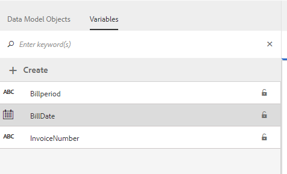

# 教程：创建文档片段{#tutorial-create-document-fragments}

本教程是[创建您的第一个交互式通信](/help/forms/using/create-your-first-interactive-communication.md)系列中的步骤。 Adobe建议您按照时间顺序跟踪系列，以了解、执行和演示完整的教程用例。

文档片段是用于构成交互式通信的通信的可重用组件。 文档片段具有以下类型：

* 文本 — 文本资产是由一个或多个文本段落组成的一段内容。 段落可以是静态的或动态的。
* 列表 — 列表是一组文档片段，包括文本、列表、条件和图像。
* 条件 — 利用条件，可根据从表单数据模型收到的数据定义要包含在交互式通信中的内容。

本教程将指导您完成基于[规划交互式通信](/help/forms/using/planning-interactive-communications.md)节中提供的解剖结构创建多个文本文档片段的步骤。 在本教程结束时，您应该能够执行以下操作：

* 创建文档片段
* 创建变量
* 创建和应用规则

以下是本教程中创建的文档片段列表：

* [帐单详细信息](../../forms/using/create-document-fragments.md#step-create-bill-details-text-document-fragment)
* [客户详细信息](../../forms/using/create-document-fragments.md#step-create-customer-details-text-document-fragment)
* [账单摘要](../../forms/using/create-document-fragments.md#step-create-bill-summary-text-document-fragment)
* [费用汇总](../../forms/using/create-document-fragments.md#step-create-summary-of-charges-text-document-fragment)

每个文档片段都包含带有静态文本的字段、从表单数据模型接收的数据，以及使用代理UI输入的数据。 所有这些字段已在[规划交互式通信](/help/forms/using/planning-interactive-communications.md)节中描述。

在本教程中创建文档片段时，将使用代理UI为接收数据的字段创建变量。

在本教程中，使用&#x200B;**FDM_Create_First_IC**（如[创建表单数据模型](../../forms/using/create-form-data-model0.md)部分中所述）作为表单数据模型来创建文档片段。

## 步骤1：创建清单详细信息文本文档片段 {#step-create-bill-details-text-document-fragment}

账单详细信息文档片段包含以下字段：

| 字段 | 数据源 |
|---|---|
| 发票编号 | 代理 UI |
| 帐单期间 | 代理 UI |
| 记帐日期 | 代理 UI |
| 您的计划 | 表单数据模型 |

要为将代理UI作为数据源的字段创建变量、创建静态文本并在文档片段中使用表单数据模型元素，请执行以下操作：

1. 选择&#x200B;**[!UICONTROL Forms]** > **[!UICONTROL 文档片段]**。

1. 选择&#x200B;**创建** > **文本**。
1. 指定以下信息：

   1. 在&#x200B;**标题**&#x200B;字段中输入&#x200B;**bill_details_first_ic**&#x200B;作为名称。 标题会自动填充到&#x200B;**名称**&#x200B;字段中。

   1. 从&#x200B;**数据模型**&#x200B;部分中选择&#x200B;**表单数据模型**。

   1. 选择&#x200B;**FDM_Create_First_IC**&#x200B;作为表单数据模型并选择&#x200B;**选择**。

   1. 选择&#x200B;**下一步**。

1. 在左窗格中选择&#x200B;**变量**&#x200B;选项卡，然后选择&#x200B;**创建**。
1. 在&#x200B;**创建变量**&#x200B;部分中：

   1. 输入&#x200B;**Invoicenumber**&#x200B;作为变量的名称。
   1. 选择&#x200B;**字符串**&#x200B;作为类型。
   1. 选择&#x200B;**创建**。

   

   重复步骤4和5以创建以下变量：

   * 计费周期：字符串类型
   * 帐单日期：日期类型

   

1. 使用右窗格为以下字段创建静态文本：

   * 发票编号
   * 帐单期间
   * 记帐日期
   * 您的计划

   

1. 将光标置于&#x200B;**Invoice No**&#x200B;字段旁边，并在左窗格的&#x200B;**变量**&#x200B;选项卡中双击&#x200B;**InvoiceNumber**&#x200B;变量。
1. 将光标置于&#x200B;**Bill Period**&#x200B;字段旁边，并双击&#x200B;**Billperiod**&#x200B;变量。
1. 将光标置于&#x200B;**记帐日期**&#x200B;字段旁边，并双击&#x200B;**记帐日期**&#x200B;变量。
1. 在左窗格中选择&#x200B;**数据模型对象**&#x200B;选项卡。
1. 将光标置于&#x200B;**计划**&#x200B;字段旁边，并双击&#x200B;**客户** > **客户计划**&#x200B;属性。

   

1. 单击&#x200B;**保存**&#x200B;以创建账单详细信息文本文档片段。

## 步骤2：创建客户详细信息文本文档片段 {#step-create-customer-details-text-document-fragment}

客户详细信息文档片段包含以下字段：

| 字段 | 数据源 |
|---|---|
| 客户名称 | 表单数据模型 |
| 地址 | 表单数据模型 |
| 供应地点 | 代理 UI |
| 州代码 | 代理 UI |
| 手机号码 | 表单数据模型 |
| 备用联系电话 | 表单数据模型 |
| 关系编号 | 表单数据模型 |
| 连接数 | 代理 UI |

要为将代理UI作为数据源的字段创建变量、创建静态文本并在文档片段中使用表单数据模型元素，请执行以下操作：

1. 选择&#x200B;**[!UICONTROL Forms]** > **[!UICONTROL 文档片段]**。
1. 选择&#x200B;**创建** > **文本**。
1. 指定以下信息：

   1. 在&#x200B;**Title**&#x200B;字段中输入&#x200B;**customer_details_first_ic**&#x200B;作为名称。 标题会自动填充到&#x200B;**名称**&#x200B;字段中。

   1. 从&#x200B;**数据模型**&#x200B;部分中选择&#x200B;**表单数据模型**。

   1. 选择&#x200B;**FDM_Create_First_IC**&#x200B;作为表单数据模型并选择&#x200B;**选择**。

   1. 选择&#x200B;**下一步**。

1. 在左窗格中选择&#x200B;**变量**&#x200B;选项卡，然后选择&#x200B;**创建**。
1. 在&#x200B;**创建变量**&#x200B;部分中：

   1. 输入&#x200B;**Placesupply**&#x200B;作为变量的名称。
   1. 选择&#x200B;**字符串**&#x200B;作为类型。
   1. 选择&#x200B;**创建**。

   重复步骤4和5以创建以下变量：

   * 状态码：数字类型
   * Numberconnections：数字类型

1. 选择&#x200B;**数据模型对象**&#x200B;选项卡，将光标放在右窗格中，然后双击&#x200B;**customer** > **name**&#x200B;属性。
1. 按Enter键将光标移动到下一行，然后双击&#x200B;**customer** > **address**&#x200B;属性。
1. 使用右窗格为以下字段创建静态文本：

   * 手机号码
   * 备用联系电话
   * 供应地点
   * 关系编号
   * 州代码
   * 连接数

   

1. 将光标置于&#x200B;**Mobile Number**&#x200B;字段旁边，并双击&#x200B;**customer** > **mobilenum**&#x200B;属性。
1. 将光标置于&#x200B;**备用联系电话**&#x200B;字段旁边，并双击** customer** > **alternatemobilenumber**&#x200B;属性。
1. 将光标置于&#x200B;**Relationship Number**&#x200B;字段旁边，并双击&#x200B;**customer** > **relationshipnumber**&#x200B;属性。
1. 选择&#x200B;**变量**&#x200B;选项卡，将光标放置在&#x200B;**Place of Supply**&#x200B;字段旁边，并双击&#x200B;**Placessupply**&#x200B;变量。
1. 将光标置于&#x200B;**状态代码**&#x200B;字段旁边，并双击&#x200B;**状态代码**&#x200B;变量。
1. 将光标置于&#x200B;**Number of Connections**&#x200B;字段旁边，并双击&#x200B;**Numberconnections**&#x200B;变量。

   

1. 单击&#x200B;**保存**&#x200B;以创建客户详细信息文本文档片段。

## 步骤3：创建账单摘要文本文档片段 {#step-create-bill-summary-text-document-fragment}

账单汇总单据片段包含以下字段：

| 字段 | 数据源 |
|---|---|
| 上一余额 | 代理 UI |
| 支付 | 代理 UI |
| 调整 | 代理 UI |
| 费用当前帐单期间 | 表单数据模型 |
| 应付金额 | 代理 UI |
| 到期日期 | 代理 UI |

要为将代理UI作为数据源的字段创建变量、创建静态文本并在文档片段中使用表单数据模型元素，请执行以下操作：

1. 选择&#x200B;**[!UICONTROL Forms]** > **[!UICONTROL 文档片段]**。
1. 选择&#x200B;**创建** > **文本**。
1. 指定以下信息：

   1. 在&#x200B;**标题**&#x200B;字段中输入&#x200B;**bill_summary_first_ic**&#x200B;作为名称。 标题会自动填充到&#x200B;**名称**&#x200B;字段中。

   1. 从&#x200B;**数据模型**&#x200B;部分中选择&#x200B;**表单数据模型**。

   1. 选择&#x200B;**FDM_Create_First_IC**&#x200B;作为表单数据模型并选择&#x200B;**选择**。

   1. 选择&#x200B;**下一步**。

1. 在左窗格中选择&#x200B;**变量**&#x200B;选项卡，然后选择&#x200B;**创建**。
1. 在&#x200B;**创建变量**&#x200B;部分中：

   1. 输入&#x200B;**Previousbalance**&#x200B;作为变量的名称。
   1. 选择&#x200B;**数字**&#x200B;作为类型。
   1. 选择&#x200B;**创建**。

   重复步骤4和5以创建以下变量：

   * 付款：编号类型
   * 调整：数字类型
   * 金额：数字类型
   * 日期：日期类型

1. 使用右窗格为以下字段创建静态文本：

   * 上一余额
   * 支付
   * 调整
   * 费用当前帐单期间
   * 应付金额
   * 到期日期
   * 到期日期之后的延迟付款费用为20美元

   

1. 将光标置于&#x200B;**Previous Balance**&#x200B;字段旁边，并双击&#x200B;**Previousbalance**&#x200B;变量。
1. 将光标置于&#x200B;**付款**&#x200B;字段旁边，并双击&#x200B;**付款**&#x200B;变量。
1. 将光标置于&#x200B;**Adjustments**&#x200B;字段旁边，并双击&#x200B;**Adjustments**&#x200B;变量。
1. 将光标置于&#x200B;**到期金额**&#x200B;字段旁边，并双击&#x200B;**到期金额**&#x200B;变量。
1. 将光标置于&#x200B;**截止日期**&#x200B;字段旁边，并双击&#x200B;**Duedate**&#x200B;变量。
1. 选择&#x200B;**数据模型对象**&#x200B;选项卡，将光标放在右窗格中的&#x200B;**计费当前计费周期**&#x200B;字段旁边，然后双击&#x200B;**计费** > **使用计费**&#x200B;属性。

   

1. 单击&#x200B;**保存**&#x200B;以创建客户详细信息文本文档片段。

## 步骤4：创建费用摘要文本文档片段 {#step-create-summary-of-charges-text-document-fragment}

费用单据片段的摘要包含以下字段：

| 字段 | 数据源 |
|---|---|
| 呼叫费用 | 表单数据模型 |
| 电话会议费用 | 表单数据模型 |
| 短信费用 | 表单数据模型 |
| 移动互联网费用 | 表单数据模型 |
| 国家漫游费用 | 表单数据模型 |
| 国际漫游费用 | 表单数据模型 |
| 增值服务费用 | 表单数据模型 |
| 总费用 | 表单数据模型 |
| 应付总额 | 表单数据模型 |

要创建静态文本并在文档片段中使用表单数据模型元素，请执行以下操作：

1. 选择&#x200B;**[!UICONTROL Forms]** > **[!UICONTROL 文档片段]**。
1. 选择&#x200B;**创建** > **文本**。
1. 指定以下信息：

   1. 在&#x200B;**标题**&#x200B;字段中输入&#x200B;**summary_charges_first_ic**&#x200B;作为名称。 标题将自动填充到“名称”字段中。

   1. 从&#x200B;**数据模型**&#x200B;部分中选择&#x200B;**表单数据模型**。

   1. 选择&#x200B;**FDM_Create_First_IC**&#x200B;作为表单数据模型并选择&#x200B;**选择**。

   1. 选择&#x200B;**下一步**。

1. 使用右窗格为以下字段创建静态文本：

   * 呼叫费用
   * 电话会议费用
   * 短信费用
   * 移动互联网费用
   * 国家漫游费用
   * 国际漫游费用
   * 增值服务费用
   * 总费用
   * 应付总额

   

1. 选择&#x200B;**数据模型对象**&#x200B;选项卡。
1. 将光标置于&#x200B;**呼叫费用**&#x200B;字段旁边，并双击&#x200B;**帐单** > **呼叫费用**&#x200B;属性。
1. 将光标置于&#x200B;**电话会议费用**&#x200B;字段旁边，并双击&#x200B;**帐单** > **confcallcharges**&#x200B;属性。
1. 将光标置于&#x200B;**SMS Charges**&#x200B;字段旁边，并双击&#x200B;**bills** > **smscharges**&#x200B;属性。
1. 将光标置于&#x200B;**移动互联网费用**&#x200B;字段旁边，并双击&#x200B;**帐单** > **互联网费用**&#x200B;属性。
1. 将光标置于&#x200B;**National Roaming Charges**&#x200B;字段旁边，并双击&#x200B;**bills** > **roamingnational**&#x200B;属性。
1. 将光标置于&#x200B;**国际漫游费用**&#x200B;字段旁边，并双击&#x200B;**帐单** > **roamingintnl**&#x200B;属性。
1. 将光标置于&#x200B;**Value Added Services Charges**&#x200B;字段旁边，并双击&#x200B;**bills** > **vas**&#x200B;属性。
1. 将光标置于&#x200B;**Total Charges**&#x200B;字段旁边，并双击&#x200B;**bills** > **usagecharges**&#x200B;属性。
1. 将光标置于&#x200B;**TOTAL PAYABLE**&#x200B;字段旁边，并双击&#x200B;**bills** > **usagecharges**&#x200B;属性。

   

1. 选择&#x200B;**Value Added Services Charges**&#x200B;行中的文本并选择&#x200B;**创建规则**&#x200B;以创建在交互式通信中显示该行的条件：
1. 在&#x200B;**创建规则**&#x200B;弹出窗口中：

   1. 选择&#x200B;**数据模型和变量**，然后选择&#x200B;**清单** > **调用费用**。

   1. 选择&#x200B;**小于**&#x200B;作为运算符。
   1. 选择&#x200B;**数字**&#x200B;并输入值为&#x200B;**60**。

   根据此条件，仅当“呼叫费用”字段的值小于60时，才会显示“增值服务费用”行。

   

1. 单击&#x200B;**保存**&#x200B;以创建费用摘要文本文档片段。
