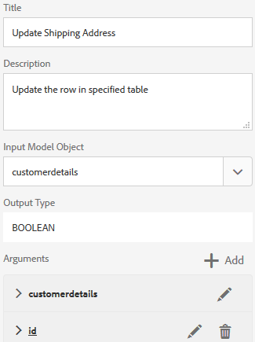

# 教程：创建表单数据模型 {#tutorial-create-form-data-model}

本教程是[创建您的第一个自适应表单](../../forms/using/create-your-first-adaptive-form.md)系列中的步骤。 Adobe建议您按照时间顺序跟踪系列，以了解、执行和演示完整的教程用例。

## 关于教程 {#about-the-tutorial}

AEM [!DNL Forms]数据集成模块允许您从不同的后端数据源(如AEM用户配置文件、RESTful Web服务、基于SOAP的Web服务、OData服务和关系数据库)创建表单数据模型。 您可以在表单数据模型中配置数据模型对象和服务，并将其与自适应表单关联。 自适应表单字段绑定到数据模型对象属性。 这些服务使您能够预填充自适应表单并将提交的表单数据写回数据模型对象。

有关表单数据集成和表单数据模型的详细信息，请参阅[AEM Forms数据集成](../../forms/using/data-integration.md)。

本教程将指导您完成准备、创建、配置表单数据模型并将其与自适应表单关联的步骤。 在本教程结束时，您将能够：

* [将MySQL数据库配置为数据源](#config-database)
* [使用MySQL数据库创建表单数据模型](#create-fdm)
* [配置表单数据模型](#config-fdm)
* [测试表单数据模型](#test-fdm)

表单数据模型将类似于以下内容：

**A.**&#x200B;已配置数据源&#x200B;**B.**&#x200B;数据源架构&#x200B;**C.**&#x200B;可用服务&#x200B;**D.**&#x200B;数据模型对象&#x200B;**E.**&#x200B;已配置服务

## 先决条件 {#prerequisites}

在开始之前，请确保您具备以下条件：

* [!DNL MySQL]数据库，包含示例数据，如[创建第一个自适应表单](../../forms/using/create-your-first-adaptive-form.md)的先决条件部分所述
* [!DNL MySQL] JDBC驱动程序的OSGi捆绑包，如[捆绑JDBC数据库驱动程序](/help/sites-developing/jdbc.md#bundling-the-jdbc-database-driver)中所述
* 自适应表单，如第一个教程[创建自适应表单](/help/forms/using/create-adaptive-form.md)中所述

## 步骤1：将MySQL数据库配置为数据源 {#config-database}

您可以配置不同类型的数据源来创建表单数据模型。 在本教程中，您将配置已配置并填充了示例数据的MySQL数据库。 有关其他受支持数据源以及如何配置它们的信息，请参阅[AEM Forms数据集成](../../forms/using/data-integration.md)。

执行以下操作以配置您的[!DNL MySQL]数据库：

1. 将数据库的 [!DNL MySQL] JDBC 驱动程序作为 OSGi 捆绑包安装：

   1. [!DNL MySQL]从 下载 `http://www.java2s.com/ref/jar/download-orgosgiservicejdbc100jar-file.html`JDBC 驱动程序 OSGi 捆绑包。<!-- This URL is an insecure link but using https is not possible -->
   1. 以管理员身份登录AEM [!DNL Forms]创作实例，然后转到AEM Web控制台包。 默认URL为[https://localhost:4502/system/console/bundles](https://localhost:4502/system/console/bundles)。

   1. 选择&#x200B;**[!UICONTROL 安装/更新]**。 出现[!UICONTROL 上载/安装包]对话框。

   1. 选择&#x200B;**[!UICONTROL 选择文件]**&#x200B;浏览并选择[!DNL MySQL] JDBC驱动程序OSGi包。 选择&#x200B;**[!UICONTROL 启动包]**&#x200B;和&#x200B;**[!UICONTROL 刷新包]**，然后选择&#x200B;**[!UICONTROL 安装或更新]**。 [!DNL Oracle Corporation's]确保 的 [!DNL MySQL] JDBC 驱动程序处于活动状态。驱动程序已安装。

1. 将数据库配置为 [!DNL MySQL] 数据源：

   1. 转到位于 https://localhost:4502/system/console/configMgr[&#128279;](https://localhost:4502/system/console/configMgr) 的 AEM Web 控制台。
   1. 找到 **Apache Sling 连接池数据源** 配置。 选择此项可在编辑模式下打开配置。
   1. 在配置对话框中，指定以下详细信息：

      * **数据源名称：**&#x200B;您可以指定任意名称。 例如，指定&#x200B;**WeRetailMySQL**。
      * **数据源服务属性名称**：指定包含数据源名称的服务属性的名称。 在将数据源实例注册为OSGi服务时指定它。 例如，**datasource.name**。
      * **JDBC驱动程序类**：指定JDBC驱动程序的Java™类名。 对于[!DNL MySQL]数据库，请指定&#x200B;**com.mysql.jdbc.Driver**。
      * **JDBC 连接 URI：**&#x200B;指定数据库的连接 URL。 对于 [!DNL MySQL] 在端口 3306 和 `weretail`架构上运行的数据库，URL 为： `jdbc:mysql://'server':3306/weretail?autoReconnect=true&useUnicode=true&characterEncoding=utf-8`

      >[!NOTE]
      >
      > [!DNL MySQL]当数据库位于防火墙后面时，数据库主机名不是公共 DNS。必须将数据库的 IP 地址添加到 *AEM 主机的 /etc/hosts* 文件中。

      * **用户名：**&#x200B;数据库用户名。 需要启用 JDBC 驱动程序才能与数据库建立连接。
      * **密码：**&#x200B;数据库的密码。 必须启用JDBC驱动程序才能与数据库建立连接。

      >[!NOTE]
      >
      >AEM Forms不支持[!DNL MySQL]的NT身份验证。 转到 https://localhost:4502/system/console/configMgr[&#128279;](https://localhost:4502/system/console/configMgr) 的AEM Web控制台，然后搜索“Apache Sling连接池数据源”。对于“JDBC 连接 URI”属性，请将“integratedSecurity”的值设置为 False，并使用创建的用户名和密码与数据库连接 [!DNL MySQL] 。

      * **借用时测试：** 启用 **[!UICONTROL 借用]** 时测试选项。
      * **退货时测试：**&#x200B;启用退货&#x200B;**&#x200B;**&#x200B;时测试选项。
      * **验证查询：**&#x200B;指定SQL SELECT查询以验证池中的连接。 查询必须至少返回一行。 例如，**从customerdetails**&#x200B;中选择&#42;。
      * **事务隔离**：将该值设置为&#x200B;**READ_COMMITTED**。

        保留具有默认[值](https://tomcat.apache.org/tomcat-7.0-doc/jdbc-pool.html)的其他属性并选择&#x200B;**[!UICONTROL 保存]**。

        将创建类似于以下内容的配置。

        

## 步骤2：创建表单数据模型 {#create-fdm}

AEM [!DNL Forms]提供了一个直观的用户界面，用于[从配置的数据源](data-integration.md)创建表单数据模型。 您可以在表单数据模型中使用多个数据源。 对于此用例，您可以使用配置的[!DNL MySQL]数据源。

执行以下操作以创建表单数据模型：

1. 在AEM创作实例中，导航到&#x200B;**[!UICONTROL Forms]** > **[!UICONTROL 数据集成]**。
1. 选择&#x200B;**[!UICONTROL 创建]** > **[!UICONTROL 表单数据模型]**。
1. 在“创建表单数据模型”对话框中，为表单数据模型指定&#x200B;**名称**。 例如，**customer-shipping-billing-details**。 选择&#x200B;**[!UICONTROL 下一步]**。
1. 选择数据源屏幕列出了所有已配置的数据源。 选择&#x200B;**WeRetailMySQL**&#x200B;数据源，然后选择&#x200B;**[!UICONTROL 创建]**。

   

已创建&#x200B;**customer-shipping-billing-details**&#x200B;表单数据模型。

## 步骤3：配置表单数据模型 {#config-fdm}

配置表单数据模型涉及：

* 添加数据模型对象和服务
* 配置数据模型对象的读写服务

执行以下操作以配置表单数据模型：

1. 在AEM创作实例上，导航到&#x200B;**[!UICONTROL Forms]** > **[!UICONTROL 数据集成]**。 默认URL为[https://localhost:4502/aem/forms.html/content/dam/formsanddocuments-fdm](https://localhost:4502/aem/forms.html/content/dam/formsanddocuments-fdm)。
1. 此处列出了您之前创建的&#x200B;**customer-shipping-billing-details**&#x200B;表单数据模型。 在编辑模式下将其打开。

   已在表单数据模型中配置所选数据源&#x200B;**WeRetailMySQL**。

   

1. 展开WeRailMySQL数据源树。 从&#x200B;**weretail** > **customerdetails**&#x200B;架构中选择以下数据模型对象和服务，以便您可以形成数据模型：

   * **数据模型对象**：

      * id
      * name
      * shippingAddress
      * 城市
      * 州/省
      * 邮政编码

   * **服务：**

      * get
      * 更新

   选择&#x200B;**添加选定项**&#x200B;以将选定数据模型对象和服务添加到表单数据模型。

   

   >[!NOTE]
   >
   >为JDBC数据源提供的默认get、update和insert服务是现成的表单数据模型。

1. 配置数据模型对象的读取和写入服务。

   1. 选择&#x200B;**customerdetails**&#x200B;数据模型对象并选择&#x200B;**[!UICONTROL 编辑属性]**。
   1. 从读取服务下拉列表中选择&#x200B;**[!UICONTROL get]**。 将自动添加&#x200B;**id**&#x200B;参数，该参数是customerdetails数据模型对象中的主键。 选择并按如下方式配置参数。

      

   1. 同样，选择&#x200B;**[!UICONTROL 更新]**&#x200B;作为写入服务。 **customerdetails**&#x200B;对象会自动添加为参数。 参数的配置如下所示。

      

      按如下方式添加和配置 **id** 参数。

      

   1. 选择“完成&#x200B;**”**&#x200B;以保存数据模型对象属性。然后，选择 **[!UICONTROL 保存]** 以保存表单数据模型。

      **[!UICONTROL get]**&#x200B;和&#x200B;**[!UICONTROL update]**&#x200B;服务已添加为数据模型对象的默认服务。

      

1. 转到&#x200B;**[!UICONTROL 服务]**&#x200B;选项卡并配置&#x200B;**[!UICONTROL get]**&#x200B;和&#x200B;**[!UICONTROL 更新]**&#x200B;服务。

   1. 选择&#x200B;**[!UICONTROL get]**&#x200B;服务并选择&#x200B;**[!UICONTROL 编辑属性]**。 将打开属性对话框。
   1. 在“编辑属性”对话框中指定以下内容：

      * **标题**：指定服务的标题。 例如：检索送货地址。
      * **描述**：指定包含服务的详细功能的描述。 例如：

        此服务从[!DNL MySQL]数据库中检索送货地址和其他客户详细信息

      * **输出模型对象**：选择包含客户数据的架构。 例如：

        customerdetail架构

      * **返回数组**：禁用&#x200B;**返回数组**&#x200B;选项。
      * **参数**：选择名为&#x200B;**ID**&#x200B;的参数。

      选择&#x200B;**[!UICONTROL 完成]**。 用于从MySQL数据库检索客户详细信息的服务已配置。

      

   1. 选择&#x200B;**[!UICONTROL 更新]**&#x200B;服务，然后选择&#x200B;**[!UICONTROL 编辑属性]**。 将打开属性对话框。

   1. 在[!UICONTROL 编辑属性]对话框中指定以下内容：

      * **标题**：指定服务的标题。 例如，更新送货地址。
      * **描述**：指定包含服务的详细功能的描述。 例如：

        此服务更新MySQL数据库中的送货地址和相关字段

      * **输入模型对象**：选择包含客户数据的架构。 例如：

        customerdetail架构

      * **输出类型**：选择&#x200B;**布尔值**。

      * **参数**：选择参数名称&#x200B;**ID**&#x200B;和&#x200B;**customerdetails**。

      选择&#x200B;**[!UICONTROL 完成]**。 已配置&#x200B;**[!UICONTROL 更新]**&#x200B;服务以更新[!DNL MySQL]数据库中的客户详细信息。

      

配置表单数据模型中的数据模型对象和服务。 您现在可以测试表单数据模型。

## 步骤4：测试表单数据模型 {#test-fdm}

您可以测试数据模型对象和服务，以验证是否正确配置了表单数据模型。

执行以下操作以运行测试：

1. 转到&#x200B;**[!UICONTROL 模型]**&#x200B;选项卡，选择&#x200B;**customerdetails**&#x200B;数据模型对象，然后选择&#x200B;**[!UICONTROL 测试模型对象]**。
1. 在[!UICONTROL 测试模型/服务]窗口中，从&#x200B;**[!UICONTROL 选择模型/服务]**&#x200B;下拉列表中选择&#x200B;**[!UICONTROL 读取模型对象]**。
1. 在&#x200B;**customerdetails**&#x200B;部分中，为已配置的[!DNL MySQL]数据库中存在的&#x200B;**id**&#x200B;参数指定一个值，然后选择&#x200B;**[!UICONTROL 测试]**。

   将获取与指定ID关联的客户详细信息，并将其显示在&#x200B;**[!UICONTROL 输出]**&#x200B;部分中，如下所示。

   

1. 同样，您可以测试Write模型对象和服务。

   在以下示例中，更新服务成功地更新了数据库中ID 7102715的地址详细信息。

   

   现在，如果您再次测试id 7107215的读取模型服务，它将获取并显示更新的客户详细信息，如下所示。

   

>[!NOTE]
>
> 您可以使用自适应表单中的表单数据模型创建和使用SharePoint列表配置，以在SharePoint列表中保存数据或生成的记录文档。 有关详细步骤，请参阅[将自适应表单连接到Microsoft® SharePoint列表](/help/forms/using/configuring-submit-actions.md#create-a-sharepoint-list-configuration)。