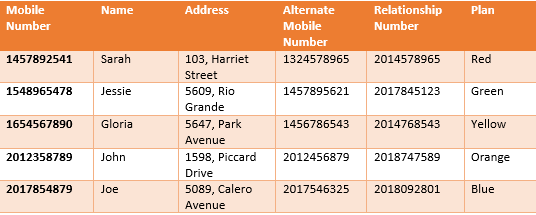
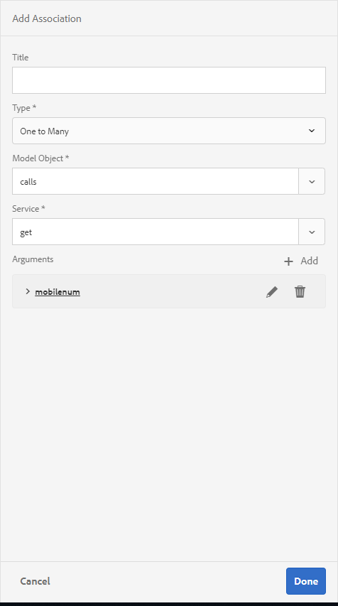
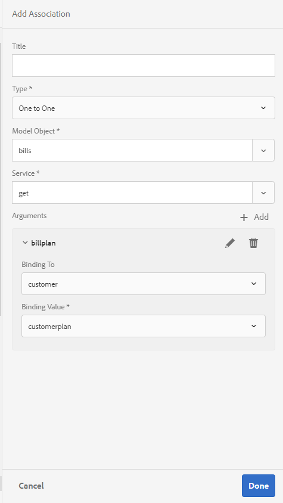

# 教程：在AEM Forms中创建表单数据模型{#tutorial-create-form-data-model}


本教程是[创建您的第一个交互式通信](/help/forms/using/create-your-first-interactive-communication.md)系列中的步骤。 建议按时间顺序跟踪系列，以了解、执行和演示完整的教程用例。

## 关于教程 {#about-the-tutorial}

AEM Forms数据集成模块允许您从不同的后端数据源(如AEM用户配置文件、RESTful Web服务、基于SOAP的Web服务、OData服务和关系数据库)创建表单数据模型。 您可以在表单数据模型中配置数据模型对象和服务，并将其与自适应表单关联。 自适应表单字段绑定到数据模型对象属性。 这些服务使您能够预填充自适应表单并将提交的表单数据写回数据模型对象。

有关表单数据集成和表单数据模型的详细信息，请参阅[AEM Forms数据集成](https://helpx.adobe.com/experience-manager/6-3/forms/using/data-integration.html)。

本教程将指导您完成准备、创建、配置表单数据模型并将其与交互式通信关联的步骤。 在本教程结束时，您将能够：

* [设置数据库](../../forms/using/create-form-data-model0.md#step-set-up-the-database)
* [将MySQL数据库配置为数据源](../../forms/using/create-form-data-model0.md#step-configure-mysql-database-as-data-source)
* [创建表单数据模型](../../forms/using/create-form-data-model0.md#step-create-form-data-model)
* [配置表单数据模型](../../forms/using/create-form-data-model0.md#step-configure-form-data-model)
* [测试表单数据模型](../../forms/using/create-form-data-model0.md#step-test-form-data-model-and-services)

表单数据模型类似于以下内容：


**A.**&#x200B;已配置数据源&#x200B;**B.**&#x200B;数据源架构&#x200B;**C.**&#x200B;可用服务&#x200B;**D.**&#x200B;数据模型对象&#x200B;**E.**&#x200B;已配置服务

## 先决条件 {#prerequisites}

在开始之前，请确保您具备以下条件：

* 包含示例数据的MySQL数据库，如[设置数据库](../../forms/using/create-form-data-model0.md#step-set-up-the-database)部分中所述。
* MySQL JDBC驱动程序的OSGi捆绑包，如[捆绑JDBC数据库驱动程序](https://helpx.adobe.com/experience-manager/6-3/help/sites-developing/jdbc.html#bundling-the-jdbc-database-driver)中所述

## 步骤1：设置数据库 {#step-set-up-the-database}

数据库是创建交互式通信所必需的。 本教程使用数据库来显示表单数据模型和交互式通信的持久性功能。 设置包含客户、清单和调用表的数据库。
下图说明了customer表的示例数据：



使用以下DDL语句在数据库中创建&#x200B;**customer**&#x200B;表。

```sql
CREATE TABLE `customer` (
   `mobilenum` int(11) NOT NULL,
   `name` varchar(45) NOT NULL,
   `address` varchar(45) NOT NULL,
   `alternatemobilenumber` int(11) DEFAULT NULL,
   `relationshipnumber` int(11) DEFAULT NULL,
   `customerplan` varchar(45) DEFAULT NULL,
   PRIMARY KEY (`mobilenum`),
   UNIQUE KEY `mobilenum_UNIQUE` (`mobilenum`)
 ) ENGINE=InnoDB DEFAULT CHARSET=utf8
```

使用以下DDL语句在数据库中创建&#x200B;**bills**&#x200B;表。

```sql
CREATE TABLE `bills` (
   `billplan` varchar(45) NOT NULL,
   `latepayment` decimal(4,2) NOT NULL,
   `monthlycharges` decimal(4,2) NOT NULL,
   `billdate` date NOT NULL,
   `billperiod` varchar(45) NOT NULL,
   `prevbal` decimal(4,2) NOT NULL,
   `callcharges` decimal(4,2) NOT NULL,
   `confcallcharges` decimal(4,2) NOT NULL,
   `smscharges` decimal(4,2) NOT NULL,
   `internetcharges` decimal(4,2) NOT NULL,
   `roamingnational` decimal(4,2) NOT NULL,
   `roamingintnl` decimal(4,2) NOT NULL,
   `vas` decimal(4,2) NOT NULL,
   `discounts` decimal(4,2) NOT NULL,
   `tax` decimal(4,2) NOT NULL,
   PRIMARY KEY (`billplan`)
 ) ENGINE=InnoDB DEFAULT CHARSET=utf8
```

使用以下DDL语句在数据库中创建&#x200B;**调用**&#x200B;表。

```sql
CREATE TABLE `calls` (
   `mobilenum` int(11) DEFAULT NULL,
   `calldate` date DEFAULT NULL,
   `calltime` varchar(45) DEFAULT NULL,
   `callnumber` int(11) DEFAULT NULL,
   `callduration` varchar(45) DEFAULT NULL,
   `callcharges` decimal(4,2) DEFAULT NULL,
   `calltype` varchar(45) DEFAULT NULL
 ) ENGINE=InnoDB DEFAULT CHARSET=utf8
```

**呼叫**&#x200B;表包含呼叫详细信息，如呼叫日期、呼叫时间、呼叫号码、呼叫持续时间和呼叫费用。 使用“手机号码(mobilenum)”字段将&#x200B;**customer**&#x200B;表链接到呼叫表。 对于&#x200B;**customer**&#x200B;表中列出的每个手机号码，**调用**&#x200B;表中都有多个记录。 例如，您可以通过引用&#x200B;**呼叫**&#x200B;表检索&#x200B;**1457892541**&#x200B;手机号码的呼叫详细信息。

**账单**&#x200B;表包括账单详细信息，如账单日期、账单期间、每月费用和呼叫费用。 使用“记帐计划”字段将&#x200B;**customer**&#x200B;表链接到&#x200B;**帐单**&#x200B;表。 **customer**&#x200B;表中有一个与每个客户关联的计划。 **帐单**&#x200B;表包含所有现有计划的定价详细信息。 例如，您可以从&#x200B;**customer**&#x200B;表中检索&#x200B;**Sarah**&#x200B;的计划详细信息，并使用这些详细信息从&#x200B;**bills**&#x200B;表中检索定价详细信息。

## 步骤2：将MySQL数据库配置为数据源 {#step-configure-mysql-database-as-data-source}

您可以配置不同类型的数据源来创建表单数据模型。 在本教程中，您将配置已配置并填充了示例数据的MySQL数据库。 有关其他受支持数据源以及如何配置它们的信息，请参阅[AEM Forms数据集成](https://helpx.adobe.com/experience-manager/6-3/forms/using/data-integration.html)。

执行以下操作以配置MySQL数据库：

1. 以OSGi捆绑包形式安装MySQL数据库的JDBC驱动程序：

   1. 以管理员身份登录AEM Forms创作实例，然后转到AEM Web控制台包。 默认URL为[https://localhost:4502/system/console/bundles](https://localhost:4502/system/console/bundles)。
   1. 选择&#x200B;**安装/更新**。 出现&#x200B;**上载/安装包**&#x200B;对话框。

   1. 选择&#x200B;**选择文件**&#x200B;浏览并选择MySQL JDBC驱动程序OSGi包。 选择&#x200B;**启动包**&#x200B;和&#x200B;**刷新包**，然后选择&#x200B;**安装**&#x200B;或&#x200B;**更新**。 确保Oracle公司的MySQL JDBC驱动程序处于活动状态。 已安装驱动程序。

1. 将MySQL数据库配置为数据源：

   1. 转到[https://localhost:4502/system/console/configMgr](https://localhost:4502/system/console/configMgr)处的AEM Web控制台。
   1. 找到&#x200B;**Apache Sling Connection Pooled DataSource**&#x200B;配置。 选择以在编辑模式下打开配置。
   1. 在配置对话框中，指定以下详细信息：

      * **数据源名称：**&#x200B;您可以指定任意名称。 例如，指定&#x200B;**MySQL**。

      * **数据源服务属性名称**：指定包含数据源名称的服务属性的名称。 在将数据源实例注册为OSGi服务时指定它。 例如，**datasource.name**。

      * **JDBC驱动程序类**：指定JDBC驱动程序的Java类名。 对于MySQL数据库，请指定&#x200B;**com.mysql.jdbc.Driver**。

      * **JDBC连接URI**：指定数据库的连接URL。 对于在端口3306和模式teleca上运行的MySQL数据库，URL为： `jdbc:mysql://'server':3306/teleca?autoReconnect=true&useUnicode=true&characterEncoding=utf-8`
      * **用户名：**&#x200B;数据库用户名。 必须启用JDBC驱动程序才能与数据库建立连接。
      * **密码：**&#x200B;数据库的密码。 必须启用JDBC驱动程序才能与数据库建立连接。
      * **借记测试：**&#x200B;启用&#x200B;**借记测试**&#x200B;选项。

      * **返回时测试：**&#x200B;启用&#x200B;**返回时测试**&#x200B;选项。

      * **验证查询：**&#x200B;指定SQL SELECT查询以验证池中的连接。 查询必须至少返回一行。 例如，**从客户**&#x200B;中选择&#42;。

      * **事务隔离**：将该值设置为&#x200B;**READ_COMMITTED**。

   保留具有默认[值](https://tomcat.apache.org/tomcat-7.0-doc/jdbc-pool.html)的其他属性并选择&#x200B;**保存**。

   将创建类似于以下内容的配置。

   

## 步骤3：创建表单数据模型 {#step-create-form-data-model}

AEM Forms提供了一个直观的用户界面，可用于从配置的数据源[创建表单数据模式](https://helpx.adobe.com/experience-manager/6-3/forms/using/data-integration.html#main-pars_header_1524967585)l。 您可以在表单数据模型中使用多个数据源。 对于本教程中的用例，您将使用MySQL作为数据源。

执行以下操作以创建表单数据模型：

1. 在AEM创作实例中，导航到&#x200B;**Forms** > **数据集成**。
1. 选择&#x200B;**创建** > **表单数据模型**。
1. 在“创建表单数据模型”向导中，为表单数据模型指定&#x200B;**名称**。 例如，**FDM_Create_First_IC**。 选择&#x200B;**下一步**。
1. 选择数据源屏幕列出了所有已配置的数据源。 选择&#x200B;**MySQL**&#x200B;数据源，然后选择&#x200B;**创建**。

   

1. 单击&#x200B;**完成**。 已创建&#x200B;**FDM_Create_First_IC**&#x200B;表单数据模型。

## 步骤4：配置表单数据模型 {#step-configure-form-data-model}

配置表单数据模型包括：

* [添加数据模型对象和服务](#add-data-model-objects-and-services)
* [创建数据模型对象的计算子属性](#create-computed-child-properties-for-data-model-object)
* [添加数据模型对象之间的关联](#add-associations-between-data-model-objects)
* [编辑数据模型对象属性](#edit-data-model-object-properties)
* [为数据模型对象配置服务](#configure-services)

### 添加数据模型对象和服务 {#add-data-model-objects-and-services}

1. 在AEM创作实例上，导航到&#x200B;**Forms** > **数据集成**。 默认URL为[https://localhost:4502/aem/forms.html/content/dam/formsanddocuments-fdm](https://localhost:4502/aem/forms.html/content/dam/formsanddocuments-fdm)。
1. 此处列出了您之前创建的&#x200B;**FDM_Create_First_IC**&#x200B;表单数据模型。 选择它，然后选择&#x200B;**编辑**。

   选定的数据源&#x200B;**MySQL**&#x200B;显示在&#x200B;**数据源**&#x200B;窗格中。

   FDM的

1. 展开&#x200B;**MySQL**&#x200B;数据源树。 从&#x200B;**teleca**&#x200B;架构中选择以下数据模型对象和服务：

   * **数据模型对象**：

      * 帐单
      * 调用
      * 客户

   * **服务：**

      * get
      * 更新

   选择&#x200B;**添加选定项**&#x200B;以将选定数据模型对象和服务添加到表单数据模型。

   

   清单、调用和客户数据模型对象显示在&#x200B;**模型**&#x200B;选项卡的右窗格中。 获取和更新服务显示在&#x200B;**服务**&#x200B;选项卡中。

   

### 为数据模型对象创建计算子属性 {#create-computed-child-properties-for-data-model-object}

计算属性是根据规则或表达式计算其值的属性。 使用规则，您可以将计算属性的值设置为文本字符串、数字、数学表达式的结果或表单数据模型中其他属性的值。

根据用例，使用以下数学表达式在&#x200B;**bills**&#x200B;数据模型对象中创建&#x200B;**usagecharges**&#x200B;子计算属性：

* 使用费=呼叫费用+会议呼叫费用+短信费用+移动互联网费用+漫游国家+漫游国际+ VAS（所有这些属性都存在于帐单数据模型对象中）
有关&#x200B;**usagecharges**&#x200B;子计算属性的详细信息，请参阅[规划交互式通信](/help/forms/using/planning-interactive-communications.md)。

执行以下步骤，为清单数据模型对象创建计算子属性：

1. 选中&#x200B;**清单**&#x200B;数据模型对象顶部的复选框以将其选中，然后选择&#x200B;**创建子属性**。
1. 在&#x200B;**创建子属性**&#x200B;窗格中：

   1. 输入&#x200B;**usagecharges**&#x200B;作为子属性的名称。
   1. 启用&#x200B;**已计算**。
   1. 选择&#x200B;**Float**&#x200B;作为类型，并选择&#x200B;**Done**&#x200B;以将子属性添加到&#x200B;**bills**&#x200B;数据模型对象。

   

1. 选择&#x200B;**编辑规则**&#x200B;以打开规则编辑器。
1. 选择&#x200B;**创建**。将打开&#x200B;**设置值**&#x200B;规则窗口。
1. 从选择选项下拉列表中，选择&#x200B;**数学表达式**。

   

1. 在数学表达式中，选择&#x200B;**callcharges**&#x200B;和&#x200B;**confcallcharges**&#x200B;分别作为第一和第二对象。 选择&#x200B;**加**&#x200B;作为运算符。 在数学表达式中选择，然后选择&#x200B;**扩展表达式**&#x200B;以将&#x200B;**smscharges**、**internetcharges**、**roamingnational**、**roamingintnl**&#x200B;和&#x200B;**vas**&#x200B;对象添加到表达式中。

   下图描述了规则编辑器中的数学表达式：

   

1. 选择&#x200B;**完成**。 将在规则编辑器中创建规则。
1. 选择&#x200B;**关闭**&#x200B;以关闭规则编辑器窗口。

### 在数据模型对象之间添加关联 {#add-associations-between-data-model-objects}

定义数据模型对象后，您可以建立它们之间的关联。 关联可以是一对一或一对多。 例如，可以有多个与员工关联的家属。 它称为一对多关联，在连接关联的数据模型对象的行上以1：n表示。 但是，如果关联为给定员工ID返回唯一的员工姓名，则称为一对一关联。

当您将数据源中的关联数据模型对象添加到表单数据模型时，它们的关联将保留并以箭头线连接的方式显示。

根据用例，在数据模型对象之间创建以下关联：

| 关联 | 数据模型对象 |
|---|---|
| 1：n | 客户：呼叫（每个月可以将多个呼叫与客户关联） |
| 1:1 | 客户：帐单（一个帐单与特定月份的客户关联） |

执行以下步骤来创建数据模型对象之间的关联：

1. 选中&#x200B;**customer**&#x200B;数据模型对象顶部的复选框以将其选中，然后选择&#x200B;**添加关联**。 将打开&#x200B;**添加关联**&#x200B;属性窗格。
1. 在&#x200B;**添加关联**&#x200B;窗格中：

   * 指定关联的标题。 它是一个可选字段。
   * 从&#x200B;**类型**&#x200B;下拉列表中选择&#x200B;**一对多**。

   * 从&#x200B;**模型对象**&#x200B;下拉列表中选择&#x200B;**调用**。

   * 从&#x200B;**服务**&#x200B;下拉列表中选择&#x200B;**get**。

   * 选择&#x200B;**添加**&#x200B;以使用属性将&#x200B;**customer**&#x200B;数据模型对象链接到&#x200B;**调用**&#x200B;数据模型对象。 根据用例，调用数据模型对象必须链接到客户数据模型对象中的手机号码属性。 将打开&#x200B;**添加参数**&#x200B;对话框。

   

1. 在&#x200B;**添加参数**&#x200B;对话框中：

   * 从&#x200B;**名称**&#x200B;下拉列表中选择&#x200B;**mobilenum**。 手机号码属性是客户中可用的一个常用属性，可调用数据模型对象。 因此，它用于在customer和calls数据模型对象之间创建关联。
对于客户数据模型对象中可用的每个移动设备号码，“呼叫”表中都有多个可用的呼叫记录。

   * 为参数指定可选标题和描述。
   * 从&#x200B;**绑定到**&#x200B;下拉列表中选择&#x200B;**客户**。

   * 从&#x200B;**绑定值**&#x200B;下拉列表中选择&#x200B;**mobilenum**。

   * 选择&#x200B;**添加**。

   

   mobilenum属性显示在&#x200B;**参数**&#x200B;部分中。

   

1. 选择&#x200B;**完成**&#x200B;以在客户和调用数据模型对象之间创建1：n关联。

   在客户和调用数据模型对象之间创建关联后，在客户和清单数据模型对象之间创建1:1关联。

1. 选中&#x200B;**customer**&#x200B;数据模型对象顶部的复选框以将其选中，然后选择&#x200B;**添加关联**。 将打开&#x200B;**添加关联**&#x200B;属性窗格。
1. 在&#x200B;**添加关联**&#x200B;窗格中：

   * 指定关联的标题。 它是一个可选字段。
   * 从&#x200B;**Type**&#x200B;下拉列表中选择&#x200B;**One to One**。

   * 从&#x200B;**模型对象**&#x200B;下拉列表中选择&#x200B;**清单**。

   * 从&#x200B;**服务**&#x200B;下拉列表中选择&#x200B;**get**。 **billplan**&#x200B;属性（即bills表的主键）已在&#x200B;**参数**&#x200B;节中可用。
清单和客户数据模型对象分别使用billplan (bills)和customerplan (customer)属性链接。 创建这些属性之间的绑定以检索MySQL数据库中任何可用客户的计划详细信息。

   * 从&#x200B;**绑定到**&#x200B;下拉列表中选择&#x200B;**客户**。

   * 从&#x200B;**绑定值**&#x200B;下拉列表中选择&#x200B;**customerplan**。

   * 选择&#x200B;**Done**&#x200B;以创建billplan和customerplan属性之间的绑定。

   

   下图描述了数据模型对象与用于创建它们之间的关联的属性之间的关联：

   

### 编辑数据模型对象属性 {#edit-data-model-object-properties}

在客户与其他数据模型对象之间创建关联后，编辑客户属性以定义属性，数据将基于此属性从数据模型对象中检索。 根据用例，使用手机号码作为属性，从客户数据模型对象中检索数据。

1. 选中&#x200B;**customer**&#x200B;数据模型对象顶部的复选框以将其选中，然后选择&#x200B;**编辑属性**。 将打开&#x200B;**编辑属性**&#x200B;窗格。
1. 将&#x200B;**customer**&#x200B;指定为&#x200B;**顶级模型对象**。
1. 从&#x200B;**读取服务**&#x200B;下拉列表中选择&#x200B;**get**。
1. 在&#x200B;**参数**&#x200B;节中：

   * 从&#x200B;**绑定到**&#x200B;下拉列表中选择&#x200B;**请求属性**。

   * 将&#x200B;**mobilenum**&#x200B;指定为绑定值。

1. 从&#x200B;**写入**&#x200B;服务下拉列表中选择&#x200B;**更新**。
1. 在&#x200B;**参数**&#x200B;节中：

   * 对于&#x200B;**mobilenum**&#x200B;属性，从&#x200B;**绑定到**&#x200B;下拉列表中选择&#x200B;**customer**。

   * 从&#x200B;**绑定值**&#x200B;下拉列表中选择&#x200B;**mobilenum**。

1. 选择&#x200B;**完成**&#x200B;以保存属性。

   

1. 选中&#x200B;**调用**&#x200B;数据模型对象顶部的复选框以将其选中，然后选择&#x200B;**编辑属性**。 将打开&#x200B;**编辑属性**&#x200B;窗格。
1. 为&#x200B;**调用**&#x200B;数据模型对象禁用&#x200B;**顶层模型对象**。
1. 选择&#x200B;**完成**。

   重复步骤8 - 10以配置&#x200B;**清单**&#x200B;数据模型对象的属性。

### 配置服务 {#configure-services}

1. 转到&#x200B;**服务**&#x200B;选项卡。
1. 选择&#x200B;**get**&#x200B;服务并选择&#x200B;**编辑属性**。 将打开&#x200B;**编辑属性**&#x200B;窗格。
1. 在&#x200B;**编辑属性**&#x200B;窗格中：

   * 输入可选标题和描述。
   * 从&#x200B;**输出模型对象**&#x200B;下拉列表中选择&#x200B;**客户**。

   * 选择&#x200B;**完成**&#x200B;以保存属性。

   

1. 选择&#x200B;**更新**&#x200B;服务，然后选择&#x200B;**编辑属性**。 将打开&#x200B;**编辑属性**&#x200B;窗格。
1. 在&#x200B;**编辑属性**&#x200B;窗格中：

   * 输入可选标题和描述。
   * 从&#x200B;**输入模型对象**&#x200B;下拉列表中选择&#x200B;**客户**。

   * 选择&#x200B;**完成**。
   * 选择&#x200B;**保存**&#x200B;以保存表单数据模型。

   

## 步骤5：测试表单数据模型和服务 {#step-test-form-data-model-and-services}

您可以测试数据模型对象和服务，以验证是否正确配置了表单数据模型。

执行以下操作以运行测试：

1. 转到&#x200B;**模型**&#x200B;选项卡，选择&#x200B;**客户**&#x200B;数据模型对象，然后选择&#x200B;**测试模型对象**。
1. 在&#x200B;**测试表单数据模型**&#x200B;窗口中，从&#x200B;**选择模型/服务**&#x200B;下拉列表中选择&#x200B;**读取模型对象**。
1. 在&#x200B;**输入**&#x200B;部分中，为已配置的MySQL数据库中存在的&#x200B;**mobilenum**&#x200B;属性指定一个值，然后选择&#x200B;**测试**。

   将会获取与指定的mobilenum属性关联的客户详细信息，并显示在“输出”部分中，如下所示。 关闭对话框。

   

1. 转到&#x200B;**服务**&#x200B;选项卡。
1. 选择&#x200B;**get**&#x200B;服务并选择&#x200B;**测试服务。**
1. 在&#x200B;**输入**&#x200B;部分中，为已配置的MySQL数据库中存在的&#x200B;**mobilenum**&#x200B;属性指定一个值，然后选择&#x200B;**测试**。

   将会获取与指定的mobilenum属性关联的客户详细信息，并显示在“输出”部分中，如下所示。 关闭对话框。

   

### 编辑并保存示例数据 {#edit-and-save-sample-data}

表单数据模型编辑器允许您为表单数据模型中的所有数据模型对象属性（包括计算属性）生成示例数据。 它是一组符合为每个属性配置的数据类型的随机值。 您还可以编辑并保存数据，即使重新生成示例数据也会保留这些数据。

执行以下操作以生成、编辑和保存示例数据：

1. 在表单数据模型页面上，选择&#x200B;**编辑示例数据**。 它在“编辑示例数据”窗口中生成并显示示例数据。

   

1. 在&#x200B;**编辑示例数据**&#x200B;窗口中，根据需要编辑数据，然后选择&#x200B;**保存**。 关闭窗口。
