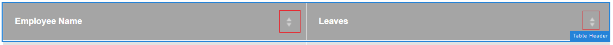
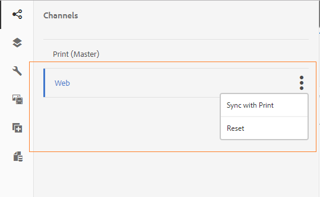
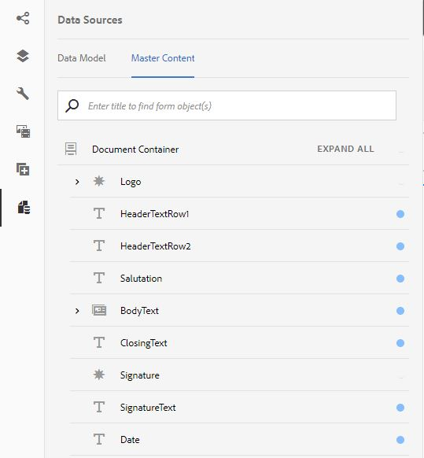
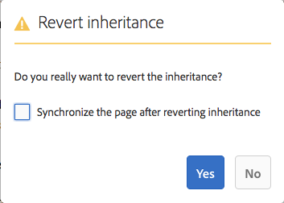

# 创建交互式通信{#create-an-interactive-communication}

## 概述 {#overview}

交互式通信可集中管理个性化交互式信函的创建、编排和交付。 利用打印作为Web的主通道，您可以在创建交互式通信的Web输出时最大限度地减少重复工作。

### 先决条件 {#prerequisites}

以下是创建交互式通信的先决条件：

* 设置包含测试数据或使用实际数据源(如Microsoft® Dynamics的实例)的[表单数据模型](/help/forms/using/data-integration.md)。
* 确保您具有[文档片段](/help/forms/using/document-fragments.md)。
* 确保您有[打印和Web渠道模板](/help/forms/using/web-channel-print-channel.md)。
* 确保您具有Web渠道所需的[主题](/help/forms/using/themes.md)。

## 创建交互式通信 {#createic}

1. 登录到AEM创作实例并导航到&#x200B;**[!UICONTROL Adobe Experience Manager]** > **[!UICONTROL Forms]** > **[!UICONTROL Forms &amp; Documents]**。
1. 选择&#x200B;**[!UICONTROL 创建]**&#x200B;并选择&#x200B;**[!UICONTROL 交互式通信]**。 此时会显示“创建交互式通信”页。

   

1. 输入以下信息。 : 

   * **[!UICONTROL 标题]**：输入交互式通信的标题。
   * **[!UICONTROL 名称]**：交互式通信的名称派生自您输入的标题。 根据需要进行编辑。
   * **[!UICONTROL 描述]**：输入有关交互式通信的描述。
   * **[!UICONTROL 表单数据模型]**：浏览并选择表单数据模型。 有关表单数据模型的详细信息，请参阅[AEM Forms数据集成](/help/forms/using/data-integration.md)。

   * **[!UICONTROL 预填充服务]**：选择预填充服务以检索数据并预填充交互式通信。
   * **[!UICONTROL Post进程类型]**：您可以选择在提交交互式通信时触发的AEM或Forms工作流。 选择要触发的工作流的类型。

   * **[!UICONTROL Post进程]**：选择要触发的工作流的名称。 选择AEM Workflow时，请提供附件路径、布局路径、PDF路径、打印数据路径和Web数据路径。
   * **[!UICONTROL 标记]**：选择要应用于交互式通信的标记。 您还可以键入新的/自定义标记名称并按Enter键以创建它。
   * **[!UICONTROL 作者]**：作者名称将自动从登录用户的用户名中获取。
   * **[!UICONTROL Publish日期：]**&#x200B;输入发布交互式通信的日期。
   * **[!UICONTROL 取消发布日期]**：输入取消发布交互式通信的日期。

1. 选择&#x200B;**[!UICONTROL 下一步]**。 此时会出现用于指定打印和Web渠道详细信息的屏幕。
1. 输入以下内容：

   * **[!UICONTROL 打印]**：选择此选项可生成交互式通信的打印渠道。
   * **[!UICONTROL 打印模板]**：浏览并选择XDP作为打印模板。
   * **[!UICONTROL Web]**：选择此选项可生成Web渠道或交互式通信的响应式输出。
   * **[!UICONTROL 交互式通信Web模板]**：浏览并选择Web模板。
   * **[!UICONTROL 主题]**&#x200B;和&#x200B;**[!UICONTROL 选择主题]**：浏览并选择主题以设置交互式通信的Web渠道的样式。 有关详细信息，请参阅AEM Forms中的[主题](/help/forms/using/themes.md)。

   * **[!UICONTROL 为Web渠道使用“打印为母版”]**：选择此选项以创建与打印渠道同步的Web渠道。 将打印渠道用作Web渠道的主渠道可以确保Web渠道的内容和数据绑定从打印渠道派生，并且当您选择“同步”时，在打印渠道中所做的更改将反映在Web渠道中。 但是，根据需要，作者可以中断Web渠道中特定组件的继承。 有关详细信息，请参阅[将Web渠道与打印渠道同步](../../forms/using/create-interactive-communication.md#synchronize)。
如果选择&#x200B;**[!UICONTROL 为Web渠道使用“打印为母版”]**&#x200B;选项，则可以选择以下任意模式来生成Web渠道：

      * **[!UICONTROL 自动布局]**：选择此模式可从Print channel自动生成Web渠道的占位符、内容和数据绑定。
      * **[!UICONTROL 手动组织]**：选择此模式以使用&#x200B;**[!UICONTROL 数据源]**&#x200B;选项卡中可用的主内容手动选择打印渠道元素并将其添加到Web渠道。 有关详细信息，请参阅[选择“打印渠道元素”以创建Web渠道内容](#selectprintchannelelements)。

   有关打印渠道和Web渠道的详细信息，请参阅[打印渠道和Web渠道](/help/forms/using/web-channel-print-channel.md)。

1. 选择&#x200B;**[!UICONTROL 创建]**。此时会创建交互式通信，并出现一个警告框。 选择&#x200B;**[!UICONTROL 编辑]**&#x200B;开始生成交互式通信的内容，如[使用交互式通信创作用户界面](#step2)添加内容中所述。 或者，您也可以选择&#x200B;**[!UICONTROL 完成]**，然后选择稍后编辑交互式通信。

## 向交互式通信添加内容 {#step2}

创建交互式通信后，可以使用交互式通信创作界面构建其内容。

有关交互式通信创作界面的详细信息，请参阅[交互式通信创作简介](/help/forms/using/introduction-interactive-communication-authoring.md)。

1. 如[创建交互式通信](#createic)中所述，当您选择“编辑”时，将启动交互式通信创作界面。 或者，您也可以导航到AEM上现有的交互式通信资产，选择该资产，然后选择&#x200B;**[!UICONTROL 编辑]**&#x200B;以启动交互式通信创作界面。

   默认情况下，将显示交互式通信的打印渠道，除非交互式通信是仅限Web渠道的。 交互式通信的打印渠道显示目标区域，如所选XDP/打印渠道模板中所示。 在这些目标区域和字段中，您可以添加组件或资源。

1. 选择打印渠道后，选择&#x200B;**[!UICONTROL 组件]**&#x200B;选项卡。 打印渠道中提供了以下组件：

   | **Component** | **功能** |
   |---|---|
   | 图表 | 添加可在交互式通信中使用的图表，用于显示检索自表单数据模型集合的二维数据。 有关详细信息，请参阅[在交互式通信中使用图表](/help/forms/using/chart-component-interactive-communications.md)。 |
   | 文档片段 | 允许向交互式通信添加可重复使用的组件，如文本、列表或条件。 添加的组件可以基于表单数据模型，也可以不使用表单数据模型。 |
   | 图像 | 让您插入图像。 |

   将组件拖放到交互式通信中，并根据需要进行配置。

   您还可以在为打印和Web渠道创作交互式通信时使用撤消和重做操作。

   使用撤消操作可放弃上次执行的操作，使用重做操作可再次合并已放弃的操作。 例如，如果在交互式通信中插入了图像或创建了数据绑定，并且需要将其丢弃，则使用撤消操作。

   

   撤消和重做选项显示在创作UI页面工具栏上。 撤消选项仅在执行操作后显示。 仅当执行撤消操作后，重做选项才会显示在页面工具栏上。 在刷新页面时，将重置这些操作。

1. 选择打印渠道后，转到&#x200B;**[!UICONTROL Assets]**&#x200B;选项卡并应用筛选器以仅显示要查看的资源。

   使用Assets浏览器，您还可以直接将资源拖放到交互式通信目标区域中。

   

1. 将文档片段拖放到交互式通信中。 下面是您可以在交互式通信的打印渠道中使用的文档片段类型。

<table>
 <tbody>
  <tr>
   <td><strong>文档片段类型</strong></td>
   <td><strong>示例用途</strong></td>
  </tr>
  <tr>
   <td><a href="/help/forms/using/texts-interactive-communications.md" target="_blank">文本</a></td>
   <td>用于添加地址、收件人电子邮件和信件正文的文本 </td>
  </tr>
  <tr>
   <td><a href="/help/forms/using/conditions-interactive-communications.md" target="_blank">条件</a></td>
   <td>根据策略类型向通信添加相应标题图像的条件：Standard或Premium。<br /> </td>
  </tr>
  <tr>
   <td>列表</td>
   <td>文档片段组，包括文本、条件、其他列表和图像。<br /> </td>
  </tr>
 </tbody>
</table>

您还可以使用&#x200B;**[!UICONTROL Assets]**&#x200B;选项卡将新片段放置到目标区域上，以替换目标区域与文档片段之间的绑定。 拖动片段时目标区域的蓝色阴影表示文档片段可以拖放到目标区域。

有关文档片段的详细信息，请参阅[文档片段](/help/forms/using/document-fragments.md)。

创作界面使您能够区分交互式通信中未绑定和已绑定的字段和变量。 界面使用橙色边框突出显示未绑定的字段和变量。


此外，当您将鼠标悬停在这些元素上时，将显示工具提示，其中显示“字段”(Field) （未绑定）或“变量”(Variable) （未绑定）消息。

文档片段中使用的未绑定变量有时可能不会显示在创作界面上。 这可能是由于文档片段中的内联文本规则导致的，或者如果有条件片段，也可能发生。 在这种情况下，以蓝色突出显示的工具提示将显示为文档片段的一部分。 工具提示显示文档片段中使用的未绑定变量的数量。


选择文档片段，选择（配置），然后从交互式通信的sidekick中选择&#x200B;**[!UICONTROL 属性]**。 **[!UICONTROL 变量和数据模型对象]**&#x200B;部分列出了变量（包括隐藏的变量）以及文档片段中使用的数据模型对象。 使用每个数据模型对象或变量旁边的（编辑）图标来编辑属性。

1. 要设置变量的绑定，请选择一个变量，然后选择 （配置），然后在侧边栏的“属性”面板中设置绑定属性。

   * **无**：代理将填写变量的值。
   * **文本片段**：如果选定此选项，则可以浏览并选择其内容在字段中呈现的文本文档片段。 只有这些文本文档片段可以绑定到中没有变量的变量。
   * **数据模型对象**：选择其值已填充到字段中的表单数据模型属性。
   * **默认值：**&#x200B;您可以使用此字段为变量定义默认值。 预览交互式通信或在Agent UI中时，将显示该值。
   * **显示模式：**&#x200B;您还可以定义变量的显示格式。 从&#x200B;**类型**&#x200B;下拉列表中选择任何预定义选项，以将显示格式应用于变量。 选择&#x200B;**自定义**&#x200B;以定义列表中不可用的显示模式。 有关详细信息，请参阅[数据显示模式](../../forms/using/create-interactive-communication.md#datadisplaypatterns)。

   导航到[变量和数据模型对象](../../forms/using/create-interactive-communication.md#hiddenvariables)以设置文档片段中隐藏变量的绑定。

   您还可以拖放数据源元素或文本文档片段来设置变量的绑定。  要创建与任何数据源元素的绑定，请选择&#x200B;**数据源**&#x200B;选项卡，并将该元素拖放到变量名称中。 数据源元素和变量的类型必须相同，才能成功设置绑定。 如果将数据源元素拖放到已绑定的变量中，则新元素会替换上一个元素，以便使用变量创建绑定。 同样，选择&#x200B;**Assets**&#x200B;选项卡，并将文本文档片段拖放到变量名称中以设置它们之间的绑定。 文本文档片段不得包含任何变量。

1. 要添加已选择打印渠道的表，请在&#x200B;**[!UICONTROL Assets]**&#x200B;选项卡中应用筛选器以仅显示布局片段。 将所需的布局片段拖放到交互式通信中。 布局片段基于XDP，可用于在交互式通信中创建图形布局或用动态数据填充的静态和动态表。

   示例：显示总溢价、忠诚度折扣百分比以及新旧政策的紧急路边援助可用性的布局表。

   有关布局片段的详细信息，请参阅[文档片段](/help/forms/using/document-fragments.md)。

1. 选择打印渠道后，在&#x200B;**[!UICONTROL Assets]**&#x200B;选项卡中应用过滤器以显示图像。 将所需的图像拖放到交互式通信中，如公司徽标。

   此外，在交互式通信中管理以下内容：

   * [添加和配置图表](/help/forms/using/chart-component-interactive-communications.md)
   * [将Web渠道与打印渠道同步](../../forms/using/create-interactive-communication.md#synchronize)

      * 自动同步
      * 取消继承
      * 重新启用继承
      * 同步

   * [附件和库访问权限](../../forms/using/create-interactive-communication.md#attachmentslibrary)
   * [XDP/布局字段属性](../../forms/using/create-interactive-communication.md#xdplayoutfieldproperties)
   * [将规则添加到组件](../../forms/using/create-interactive-communication.md#rules)

1. 切换到&#x200B;**[!UICONTROL Web渠道]**。 Web渠道显示在交互式通信编辑器中。 首次从Print channel切换到Web channel时，将自动进行同步。 有关详细信息，请参阅[从打印渠道同步Web渠道](../../forms/using/create-interactive-communication.md#synchronize)。

   由于在本例中，我们使用Print作为Web的主页，因此Print channel占位符、内容和数据绑定将同步到Web channel。 但是，您可以在Web渠道中更改和自定义特定内容。 为使用打印渠道生成的目标区域和变量[取消继承](#cancelinheritance)以便能够自定义内容。

   

   选择文档片段，选择（配置），然后从交互式通信的sidekick中选择&#x200B;**[!UICONTROL 属性]**。 **[!UICONTROL 变量和数据模型对象]**&#x200B;部分列出了变量（包括隐藏的变量）以及文档片段中使用的数据模型对象。 使用每个数据模型对象或变量旁边的（编辑）图标来编辑属性。 此外，对于已在Web渠道中使用打印渠道自动生成[的](#synchronize)文档片段，请使用每个数据模型对象和变量旁边的 （取消继承）图标来[取消继承](#cancelinheritance)并能够编辑它们。

1. 若要在Web渠道中添加其他组件，且已选择Web渠道，请选择&#x200B;**[!UICONTROL 组件]**。 根据需要将组件拖放到交互式通信的Web渠道中，然后继续配置它们。

   | 组件 | 功能 |
   |---|---|
   | 图表 | 添加可在交互式通信中使用的图表，用于显示检索自表单数据模型集合的二维数据。 有关详细信息，请参阅[使用图表组件](../../forms/using/chart-component-interactive-communications.md)。 |
   | 文档片段 | 允许向交互式通信添加可重复使用的组件、文本、列表或条件。 添加到交互式通信的可重用组件可以基于表单数据模型，也可以不使用表单数据模型。 |
   | 图像 | 让您插入图像。 |
   | 面板 | 允许您向交互式通信添加[面板](../../forms/using/create-interactive-communication.md#add-panel-component-to-the-web-channel)。 |
   | 表 | 添加表格以便按行和列整理数据。 |
   | 目标区域 | 在Web渠道中插入目标区域以组织特定于Web渠道的组件。 目标区域是一个普通容器，可用于对Web渠道特定的组件进行分组。 |
   | 文本 | 向交互式通信的Web渠道添加富文本。 文本还可以使用表单数据模型对象使内容具有动态性。 |
   | 按钮 | 允许您向交互式通信添加[按钮](../../forms/using/create-interactive-communication.md#add-button-component-to-the-web-channel)。 您可以使用按钮组件导航到其他交互式通信、自适应表单、其他资产（如图像或文档片段）或外部URL。 |
   | 分隔符 | 允许您在交互式通信中插入水平线。 使用此组件可区分通信中的节。 例如，您可以使用分隔符组件区分信用卡对帐单中的“客户详细信息”和“信用卡详细信息”部分。 |

1. 根据需要，在Web渠道中插入资产。

   您可以[预览交互式通信](#previewic)，查看交互式通信的打印和Web输出外观，并根据需要继续更改。

## 预览交互式通信 {#previewic}

您可以使用&#x200B;**预览选项**&#x200B;来评估交互式通信的外观。 交互式通信的Web渠道还提供了为各种设备模拟交互式通信体验的选项。 例如，iPhone、iPad和桌面。 您可以将&#x200B;**预览**&#x200B;和&#x200B;**模拟器** 选项相互结合使用，以预览不同屏幕大小设备的Web输出。 预览中的示例数据由指定的表单数据模型填充。

1. 选择要预览的（打印或Web）渠道，然后选择预览。 此时将出现“交互式通信”。

   >[!NOTE]
   >
   >使用指定的表单数据模型的示例数据填充预览。 有关预览与某些其他数据的交互式通信或使用预填充服务的详细信息，请参阅[使用表单数据模型](/help/forms/using/using-form-data-model.md)和[使用表单数据模型](/help/forms/using/work-with-form-data-model.md)。

1. 对于Web渠道，请使用查看交互式通信在各种设备上的外观。

   

此外，您还可以[使用代理UI](/help/forms/using/prepare-send-interactive-communication.md)准备和发送交互式通信。

## 在交互式通信中配置属性  {#configure-properties-in-interactive-communication}

### 附件和库访问权限 {#attachmentslibrary}

在打印渠道中，您可以配置附件和库访问权限，以允许Agent在交互通信的Agent UI中管理附件：

1. 在打印渠道中，突出显示文档容器并选择&#x200B;**属性**。

   

   “属性”面板将显示在侧栏中。

   

1. 展开&#x200B;**附件**&#x200B;并指定以下属性：

   * **[!UICONTROL 允许库访问]**：选择此项可在代理UI中为代理启用库访问。 如果启用，代理可以在准备交互式通信时从库添加文件。
   * **[!UICONTROL 允许对附件重新排序]**：选择此项可允许代理通过交互式通信对附件重新排序。
   * **[!UICONTROL 允许的最大附件数]**：指定交互式通信允许的最大附件数。
   * **[!UICONTROL 要附加的文件]**：选择&#x200B;**[!UICONTROL 添加]**&#x200B;并浏览以选择要附加的文件并指定以下内容：

      * **[!UICONTROL 默认情况下将此文件附加到文档]**：如果只有附件不是强制性的，则可以更改此选项。
      * **[!UICONTROL 必需：]**&#x200B;代理将无法删除代理UI中的附件。

   

1. 选择&#x200B;**[!UICONTROL 完成]**。

### XDP/布局字段属性 {#xdplayoutfieldproperties}

1. 编辑交互式通信的打印渠道时，将鼠标悬停在打印渠道模板中构建的字段上，然后选择（配置）。

   “属性”对话框显示在侧栏中。

   

1. 指定以下内容：

   * **[!UICONTROL 名称]**： JCR节点名称。
   * **[!UICONTROL 标题]**：输入代理在代理UI和文档容器树中可见的标题。
   * **[!UICONTROL 绑定类型]**：为该字段选择以下绑定类型之一。

      * 无：代理将填充属性的值。
      * 文本片段：如果选定此选项，您可以浏览并选择其内容在字段中呈现的文本文档片段。 或者，将文本文档片段拖放到字段名称以设置它们之间的绑定。 文本文档片段不得包含任何变量。
      * 数据模型对象：选择其值已填充到字段中的表单数据模型属性。 或者，选择&#x200B;**数据源**&#x200B;选项卡，并将该属性拖放到字段中。

   * **[!UICONTROL 默认值]**：默认值可确保指定数据模型对象或文本片段未提供任何值时，该字段不为空。 如果数据绑定类型为none，则默认值会预填充到字段中。
   * **[!UICONTROL 显示模式]**：您还可以定义字段的显示格式。 从&#x200B;**类型**&#x200B;下拉列表中选择任何预定义选项，以将显示格式应用于字段。 选择&#x200B;**自定义**&#x200B;以定义列表中不可用的显示模式。 有关详细信息，请参阅[数据显示模式](../../forms/using/create-interactive-communication.md#datadisplaypatterns)

   * **[!UICONTROL 可由代理编辑]**：选择此项可允许代理在代理UI中编辑字段中的值。 如果绑定类型是文本片段，则此设置不适用。
   * **[!UICONTROL 标签]**：指定在代理UI中向代理显示的文本字符串，该字段包含该字段。 如果绑定类型是文本片段，则此设置不适用。
   * **[!UICONTROL 工具提示]**：输入一个文本字符串，该字符串将鼠标悬停在代理UI中的代理上。 如果绑定类型是文本片段，则此设置不适用。
   * **[!UICONTROL 必需]**：选择使该字段对于代理是必填的。 如果绑定类型是文本片段，则此设置不适用。
   * **[!UICONTROL 允许多行]**：选择该字段以允许在该字段中输入多行文本。 如果绑定类型是文本片段，则此设置不适用。

1. 选择。

### 数据显示模式 {#datadisplaypatterns}

通过创作界面，您可以定义在为打印和Web渠道创建交互式通信时可用的字段、变量和表单数据模型元素的数据显示模式。

要配置数据显示模式，请选择该元素，选择 （配置），然后在侧边栏的&#x200B;**[!UICONTROL 属性]**&#x200B;面板中设置显示模式。 从&#x200B;**[!UICONTROL 类型]**&#x200B;下拉列表中选择任何预定义的选项，以查看与所选类型关联的模式。 从&#x200B;**[!UICONTROL 类型]**&#x200B;下拉列表中选择&#x200B;**[!UICONTROL 自定义]**&#x200B;以定义列表中不可用的模式。 编辑&#x200B;**[!UICONTROL 模式]**&#x200B;字段中的值会自动将类型修改为&#x200B;**[!UICONTROL 自定义]**。

要应用显示模式，在“模式”字段中定义的字符数或数字数必须与字段、变量和表单数据模型元素的值中定义的字符数或数字数匹配或超过该字符数或数字数。 有关详细信息，请参阅[示例](../../forms/using/create-interactive-communication.md#greaternumberofdigits)。


在从打印渠道生成Web内容后，您可以重新定义字段、变量或表单数据模型元素的显示模式。 结果，元素可以具有为打印和Web通道定义的不同显示模式。 如果您没有为打印渠道中的元素定义显示模式并使用打印渠道自动生成Web内容，则为打印渠道中的元素定义的数据绑定将定义&#x200B;**[!UICONTROL 类型]**&#x200B;下拉列表中可用的显示模式选项。 如果没有为元素定义绑定，则元素的数据类型将定义可用的显示模式选项。 例如，如果为打印渠道中的元素创建编号类型的数据绑定，则&#x200B;**[!UICONTROL 类型]**&#x200B;下拉列表中可用的显示模式选项为各种格式的数字类型。

切换到&#x200B;**预览**&#x200B;模式或打开代理UI以查看应用于这些元素的显示模式。

下表列出了在设置变量的数据显示模式后显示的值的示例：

| 类型 | 默认值 | 显示模式 | 显示值 | 描述 |
|---|---|---|---|---|
| 社会安全号码 | 123456789 | 文本{999-99-9999} | 123-45-6789 | 默认值字段中的位数与“模式”字段中的位数匹配。 基于模式的值显示成功。 |
| 社会安全号码 | 1234567 | 文本{999-99-9999} | 1-23-4567 | 默认值字段中的位数小于模式字段中的位数。 该模式适用于7个可用数字。 |
| 社会安全号码 | 1234567890 | 文本{999-99-9999} | 1234567890 | 默认值字段中的位数大于模式字段中的位数。 因此，显示值没有变化。 |

如果没有为变量或表单数据模型元素指定显示模式，则默认使用[全局文档片段配置](https://helpx.adobe.com/cn//experience-manager/6-5/forms/using/interactive-communication-configuration-properties.html)。

如果不将显示模式应用于number数据类型的变量，打印预览将根据全局文档片段配置显示模式。 如果将更改应用于默认全局文档片段配置，则代理UI仍会根据为区域设置定义的默认分隔符显示模式。

同样，对于字段，如果未指定显示模式，则创建打印模板(XDP)时定义的模式将应用于该字段。 如果在创建打印模板时没有模式，则基于XFA规范的默认模式将应用于字段。

此外，如果指定的显示模式不正确或无法应用，则基于XFA规范的默认模式将应用于字段、变量或表单数据模型元素。

## 将规则应用于交互式通信组件 {#rules}

要在交互式通信中条件化组件或内容，请选择组件/内容并选择 （创建规则）以启动规则编辑器。

有关更多信息，请参阅:

* [规则编辑器](/help/forms/using/rule-editor.md)
* [交互式通信创作简介](/help/forms/using/introduction-interactive-communication-authoring.md)

## 使用表 {#tables}

### 交互式通信中的动态表 {#dynamic-tables-in-interactive-communication}

您可以使用布局片段在Interactive Communication中添加动态表。 以下步骤使用信用卡语句的示例来说明如何使用布局片段在交互式通信中创建动态表。

1. 确保创建表所需的布局片段在AEM中可用。
1. 在交互式通信的打印渠道中，从资产浏览器将布局片段（带有多列表格）拖放到目标区域中。

   

   交互式通信布局区域中将显示一个表格。

   

1. 为表的每个单元格指定数据绑定。 要创建可重复的行，请在属于公用集合属性的行中插入表单数据模型属性。

   1. 选择表中的单元格，然后选择 （配置）。

      “属性”对话框显示在侧栏中。

      

   1. 配置属性：

      * **[!UICONTROL 名称]**： JCR节点名称。
      * **[!UICONTROL 标题]**：输入将在交互式通信编辑器中显示的标题。
      * **[!UICONTROL 绑定类型]**：为该字段选择以下绑定类型之一。

         * **[!UICONTROL 无]**
         * **[!UICONTROL 数据模型对象]**：表单数据模型属性的值已填充到字段中。 或者，选择&#x200B;**数据源**&#x200B;选项卡，并将该属性拖放到字段中。

      * **[!UICONTROL 数据模型对象]**：表单数据模型属性，其值已填充到字段中。
      * **[!UICONTROL 默认值]**：默认值可确保指定数据模型对象未提供任何值时，该字段不为空。 默认值会预填充到字段中。

      * **[!UICONTROL 可由代理编辑]**：选择此项可允许代理在代理UI中编辑字段中的值。

   1. 选择。

1. 预览交互式通信以查看使用数据呈现的表。

   

### 仅限Web渠道的表 {#webchanneltables}

选择Web模板中的根面板，然后选择&#x200B;**+**&#x200B;以向交互式通信添加&#x200B;**Table**&#x200B;组件。 在交互式通信中插入包含两行的表。 表的第一行表示表标题。

#### 向表中添加行和列 {#addrowscolumnstable}

**添加或删除列：**

1. 选择表格标题行中的默认文本框以查看组件工具栏。
1. 选择&#x200B;**添加列**&#x200B;或&#x200B;**删除列**&#x200B;以分别添加或删除表列。


**添加或删除行：**

1. 选择任意表行以查看组件工具栏。 您还可以使用交互式通信sidekick中的内容浏览器选择表格行。
1. 选择&#x200B;**添加行**&#x200B;或&#x200B;**删除行**&#x200B;以分别添加或删除表行。 使用工具栏中可用的&#x200B;**上移**&#x200B;和&#x200B;**下移**&#x200B;选项重新排列表中的行。


**A.**&#x200B;添加行&#x200B;**B.**&#x200B;删除行&#x200B;**C.**&#x200B;上移&#x200B;**D.**&#x200B;下移

#### 在表单元格中添加或编辑文本 {#addedittexttable}

1. 选择表单元格中的默认文本框，然后选择 （编辑）。
1. 在表单元格中键入文本，然后选择保存文本。

#### 创建表单元格和数据模型对象元素之间的绑定 {#createbindingtablecells}

1. 选择表格行中的默认文本框并选择 （编辑）。
1. 选择数据模型对象下拉列表，然后选择属性。
1. 选择以保存表单元格和数据模型对象属性之间并创建绑定。


#### 为表单元格中的文本创建超链接 {#createhyperlinktable}

1. 选择表单元格中的默认文本框，然后选择 （编辑）。
1. 选择表格单元格中的文本，然后选择“超链接”图标。
1. 在&#x200B;**路径**&#x200B;字段中指定URL。
1. 选择以保存超链接属性。


#### 创建动态表 {#createdynamictables}

您可以使用类型集合的数据模型属性，在交互式通信中创建仅限Web渠道的动态表。 此类表是集合属性的子属性的表示形式。 您只能编辑表中各种单元格的格式属性。

1. 切换到Web渠道，然后选择显示数据源浏览器。
1. 将收藏集属性拖放到子表单中。 将在子表单中创建表。
1. 在交互式通信的Web预览中预览表。

#### 对表中的列进行排序 {#sortcolumns}

您可以根据交互式通信表中任意列对数据进行排序。 列中的值可以按升序或降序排序。

可以对包含以下内容的表列应用排序：

* 静态文本
* 数据模型对象属性
* 静态文本和数据模型对象属性的组合

要启用排序，请执行以下操作：

1. 选择表并选择 （配置）。 您还可以在交互式通信的Sidekick中使用&#x200B;**Content**&#x200B;浏览器选择表。
1. 选择&#x200B;**启用排序。**
1. 选择以保存表属性。 列标题中的排序图标（向上箭头和向下箭头）表示已启用排序。

   

1. 切换到&#x200B;**预览**&#x200B;模式以查看输出。 该表会根据表的第一列自动排序。
1. 单击列标题可根据列对值进行排序。

   带向上箭头的列标题表示：

   * 表将根据该列进行排序。
   * 列中的值以升序显示。

   

   同样，带有向下箭头的列标题表示列中的值以降序显示。

## 编辑交互式通信属性 {#edit-interactive-communication-properties}

创建交互式通信后，可在以后编辑其属性。

使用&#x200B;**属性**&#x200B;页面可以：

* 编辑在创建交互式通信时指定的字段值，如标题和描述。
* 为现有的交互式通信添加或删除Web渠道。
* 预览、下载或删除交互式通信
* 打开[代理UI](/help/forms/using/prepare-send-interactive-communication.md)。

要访问&#x200B;**属性**&#x200B;页面，请执行以下操作：

1. 登录到AEM创作实例并导航到&#x200B;**Adobe Experience Manager** > **Forms** > **Forms &amp; Documents**。
1. 选择交互式通信并选择&#x200B;**属性**。
1. 选择&#x200B;**常规**&#x200B;选项卡以编辑&#x200B;**标题**&#x200B;和&#x200B;**描述**&#x200B;字段。

### 添加或删除Web渠道 {#add-or-delete-the-web-channel}

执行以下步骤可为现有交互式通信添加Web渠道：

1. 在&#x200B;**属性**&#x200B;页面上，选择&#x200B;**渠道**&#x200B;选项卡。
1. 选中&#x200B;**Web**&#x200B;复选框并为Web渠道选择模板。
1. 选择&#x200B;**使用Web渠道的“打印为主版”**&#x200B;以启用Web渠道和“打印”渠道之间的同步。
1. 选择&#x200B;**保存并关闭**&#x200B;以保存更改。

   同样，您可以选中&#x200B;**渠道**&#x200B;选项卡上的&#x200B;**Web**&#x200B;复选框以从交互式通信中删除Web渠道。

## 将按钮组件添加到Web渠道 {#add-button-component-to-the-web-channel}

您可以将按钮作为组件添加到交互式通信的Web渠道中。 使用[规则编辑器](../../forms/using/rule-editor.md)定义规则，以便能够导航到其他交互式通信、自适应表单、图像或文档片段等其他资产，或按钮选择时的外部URL。

要添加按钮并对其定义规则，请执行以下操作：

1. 选择Web模板中的根面板，然后选择&#x200B;**+**&#x200B;以将&#x200B;**Button**&#x200B;组件添加到交互式通信中。
1. 选择按钮组件并选择以定义按钮选择规则。
1. 在&#x200B;**When**&#x200B;部分中，从按钮下拉列表的状态中选择&#x200B;**clicked**。
1. 在&#x200B;**Then**&#x200B;部分中：

   1. 从下拉列表中选择一个操作。 例如，选择&#x200B;**导航到**&#x200B;作为操作类型。

   1. 指定交互式通信、自适应表单、资产或网页的URL。 例如，使用以下格式指定URL以导航到其他交互式通信： https://&lt;服务器名称>：&lt;端口>/editor.html/content/forms/af/&lt;交互式通信名称>/channels/&lt;渠道名称 — 打印或web>.html
   1. 指定相应选项以在同一选项卡、新选项卡或新窗口中打开资产。
   1. 选择&#x200B;**完成**，然后选择&#x200B;**关闭**&#x200B;以保存规则。

   同样，您可以从操作类型下拉列表中选择其他可用选项，例如“调用服务”和“提交表单”。 有关详细信息，请参阅[规则编辑器](../../forms/using/rule-editor.md)。

1. 预览交互式通信并选择按钮以查看交互式通信、自适应表单、资产或步骤4(b)中指定的网页。

## 将面板组件添加到Web渠道 {#add-panel-component-to-the-web-channel}

面板组件是用于分组其他组件的占位符，可控制一组组件（如折叠面板和选项卡）在交互式通信中的布局方式。 面板组件还允许您使一组组件对最终用户可重复，例如在填写教育凭证所需的多个条目中。

执行以下步骤以将面板组件添加到Web渠道：

1. 使用以下任一选项在Web渠道中插入&#x200B;**面板**&#x200B;组件：

   * 选择一个组件，选择&#x200B;**+**，然后选择&#x200B;**面板**&#x200B;组件。

   * 从&#x200B;**组件**&#x200B;浏览器面板中，将&#x200B;**面板**&#x200B;组件拖放到交互式通信上。

   * 在&#x200B;**内容**&#x200B;浏览器面板中选择&#x200B;**面板**，然后选择&#x200B;**添加子面板**。 选择&#x200B;**添加子面板**&#x200B;选项会显示&#x200B;**添加子面板**&#x200B;对话框。 输入面板组件的标题以及可选描述和名称。

1. 从&#x200B;**Content**&#x200B;浏览器中选择该面板，以在面板上执行其他操作，如配置、编辑规则、复制、删除和插入组件。

   您还可以在&#x200B;**Content**&#x200B;浏览器中拖放一个面板，以反映右侧窗格中交互式通信结构的更改。

## 将Web渠道与打印渠道同步 {#synchronize}

如果在创建交互式通信时选择“打印为Web渠道的主版”，则Web渠道将与“打印”渠道同步创建，并且Web渠道的内容和数据绑定派生自打印渠道，当您选择“同步”时，在打印渠道中所做的更改可能会反映在Web渠道中。

但是，根据需要，作者可以中断Web渠道中组件的继承。

 

### 自动同步 {#autosync}

如果选择&#x200B;**[!UICONTROL 为Web渠道使用“打印为母版”]**&#x200B;选项，则可以选择以下任意模式来生成Web渠道：

* **[!UICONTROL 自动布局]**：选择此模式可从Print channel自动生成Web渠道的占位符、内容和数据绑定。
* **[!UICONTROL 手动组织]**：选择此模式以使用“数据源”选项卡中可用的主内容手动选择打印渠道元素并将其添加到Web渠道。 有关详细信息，请参阅[选择“打印渠道元素”以创建Web渠道内容](#selectprintchannelelements)。


>[!NOTE]
>
>同步渠道仅将文档片段、图像、条件、列表和布局片段从打印渠道同步到Web渠道。 包含此类元素的子表单或父节点不会同步。

### 选择打印渠道元素以创建Web渠道内容 {#selectprintchannelelements}

如果在创建交互式通信时选择“打印为母版”，但未选择“自动同步”选项，则还可以将“打印”渠道元素拖放到Web渠道创作界面中。

导航到&#x200B;**数据源** > **主内容**&#x200B;以查看打印渠道元素。 将目标区域、字段或表拖放到Web渠道创作界面中。 元素名称旁边的蓝色圆圈图标表示Print channel元素已包含在Web channel中。



### 取消继承 {#cancelinheritance}

在Web渠道中，组件嵌入到目标区域中。

将鼠标悬停在Web渠道中的相关目标区域或变量上，选择 （取消继承），然后在“取消继承”对话框中，选择&#x200B;**[!UICONTROL 是]**。

将取消目标区域中组件的继承，现在，您可以根据需要编辑它们。

### 重新启用继承 {#re-enable-inheritance}

在Web渠道中，如果已取消组件的继承，则可以重新启用该继承。 要重新启用继承，请将鼠标悬停在相关目标区域（包括组件）的边界上，然后选择。

将显示“还原继承”对话框。



如有必要，请选择&#x200B;**[!UICONTROL 在恢复继承]**&#x200B;后同步页面。 选择此选项可同步整个交互式通信。 如果不选择此选项，则在恢复继承时，将仅同步相关的目标区域。

选择&#x200B;**[!UICONTROL 是]**。

### 同步 {#synchronize-1}

如果您使用Print as Master for Web Channel并更改Print channel，则可以同步内容以将新所做的更改引入Web channel。

1. 要将Web渠道与打印渠道同步，请切换到Web渠道并选择“更多选项”图标。

   

1. 选择下列选项之一：

   * **[!UICONTROL 与打印同步]**：仅同步继承未取消的目标区域的内容。
   * **[!UICONTROL 重置]**：将Web渠道内容与打印渠道同步，并放弃对Web渠道所做的所有更改。

### 使用组件工具栏对继承的组件执行操作 {#componenttoolbar}

在Web渠道中使用“同步”选项自动生成内容后，可以对组件执行更多操作而不取消继承。


选择组件以查看以下选项：

* **复制：**&#x200B;复制组件并将其粘贴到交互式通信中的其他位置。
* **剪切：**&#x200B;在交互式通信中将组件从一个位置移动到另一个位置。
* **插入组件：**&#x200B;在选定组件上方插入组件。
* **粘贴：**&#x200B;使用上述选项粘贴剪切或复制的组件。
* **组：**&#x200B;如果要剪切、复制或粘贴多个组件，请选择多个组件。
* **父项：**&#x200B;选择组件的父项。
* **查看SOM表达式：**&#x200B;查看组件的[SOM表达式](../../forms/using/using-som-expressions-adaptive-forms.md)。

* **面板中的组对象：**&#x200B;将面板中的组件分组，以便能够对这些组件同时执行操作。 有关详细信息，请参阅面板[&#128279;](#groupobjectspanel)中的组对象。

* **取消继承：** [取消目标区域中的组件继承](#cancelinheritance)以编辑它们。

### 对面板中的对象进行分组 {#groupobjectspanel}

该Web渠道创作界面便于将组件分组到面板中以便能够对这些组件同时执行操作。 **Content**&#x200B;选项卡在内容树中将分组的组件列为面板的子元素。

1. 选择一个组件并选择组（）操作。
1. 选择多个组件并选择&#x200B;**面板中的组对象**。

   

1. 在&#x200B;**面板中的组对象**&#x200B;对话框中，输入面板的名称。
1. 为面板输入可选标题和描述。
1. 单击。

   分组的组件在内容树中显示为面板的子元素。

   

## 打印渠道的输出格式 {#output-format-print-channel}

使用PrintChannel API定义交互式通信打印渠道的输出格式。 如果不定义输出格式，AEM Forms将生成PDF格式的输出。

```javascript
//options for rendering print channel of a multi-channel document
PrintChannelRenderOptions renderOptions = new PrintChannelRenderOptions();
PrintDocument printDocument = printChannel.render(renderOptions);
```

要以任何其他格式生成输出，请指定输出格式类型。 有关支持的输出格式类型的列表，请参阅[PrintChannel API](https://helpx.adobe.com/cn/experience-manager/6-5/forms/javadocs/com/adobe/fd/output/api/PrintConfig.html)。

例如，可以使用以下示例将PCL定义为交互式通信的输出格式：

```javascript
//options for rendering print channel of a multi-channel document
PrintChannelRenderOptions renderOptions = new PrintChannelRenderOptions();
renderOptions.setRenderFormat(PrintConfig.HP_PCL_5e);
PrintDocument printDocument = printChannel.render(renderOptions);
```
