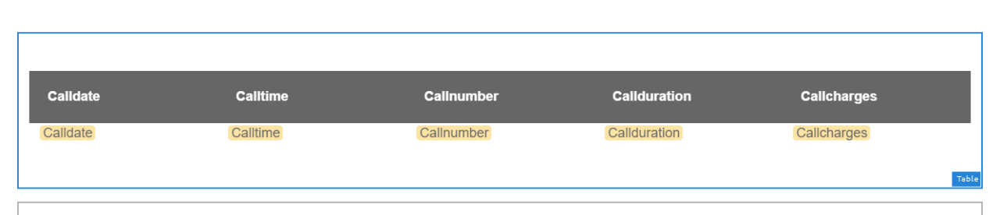

# 教程：创建交互式通信 {#tutorial-create-interactive-communication}

本教程是[创建您的第一个交互式通信](/help/forms/using/create-your-first-interactive-communication.md)系列中的步骤。 建议按时间顺序跟踪系列，以了解、执行和演示完整的教程用例。

为Web版本创建了所有构建块（如表单数据模型、文档片段、模板和主题）后，即可开始创建交互式通信。

交互式通信可通过两种渠道提供：打印和Web。 您还可以创建以Print channel作为母版的交互式通信。 Web渠道的“打印为主文件”选项确保Web渠道的内容、继承和数据绑定派生自“打印”渠道。 它还可确保在Print channel中所做的更改在Web channel中同步。 但是，允许交互式通信作者中断Web渠道中特定组件的继承。

本教程将指导您完成为打印和Web渠道创建交互式通信的步骤。 在本教程结束时，您将能够：

* 为打印渠道创建交互式通信
* 为Web渠道创建交互式通信
* 创建Print和Web交互通信并将Print作为母版

## 为打印和Web创建无同步的交互式通信 {#create-interactive-communications-for-print-and-web-with-no-synchronization}

### 为打印渠道创建交互式通信 {#create-interactive-communication-for-print-channel}

以下是本教程中已创建、且在为打印渠道创建交互式通信时所需的资源列表：

**打印模板：** [create_first_ic_print_template](../../forms/using/create-templates-print-web.md)

**表单数据模型：** [FDM_Create_First_IC](../../forms/using/create-form-data-model0.md)

**文档片段：** [bill_details_first_ic， customer_details_first_ic， bill_summary_first_ic， summary_charges_first_ic](../../forms/using/create-document-fragments.md)

**布局片段：** [table_lf](../../forms/using/create-templates-print-web.md)

**图像：** PayNow和ValueAddedServices

1. 登录到AEM创作实例并导航到&#x200B;**[!UICONTROL Adobe Experience Manager]** > **[!UICONTROL Forms]** > **[!UICONTROL Forms &amp; Documents]**。
1. 选择&#x200B;**创建**&#x200B;并选择&#x200B;**交互式通信**。 将显示&#x200B;**创建交互式通信**&#x200B;向导。
1. 在&#x200B;**标题**&#x200B;和&#x200B;**名称**&#x200B;字段中指定&#x200B;**create_first_ic**。 选择&#x200B;**FDM_Create_First_IC**&#x200B;作为表单数据模型，然后选择&#x200B;**下一步**。
1. 在&#x200B;**渠道**&#x200B;向导中：

   1. 将&#x200B;**create_first_ic_print_template**&#x200B;指定为打印模板，并选择&#x200B;**选择**。 确保未选中&#x200B;**Use Print as Master for Web Channel**&#x200B;复选框。

   1. 将&#x200B;**Create_First_IC_templates**&#x200B;文件夹> **Create_First_IC_Web_Template**&#x200B;指定为Web模板，并选择&#x200B;**选择**。

   1. 选择&#x200B;**创建**。

   此时将显示一条确认消息，表明已成功创建交互式通信。

1. 选择&#x200B;**编辑**&#x200B;以在右窗格中打开交互式通信。
1. 转到&#x200B;**Assets**&#x200B;选项卡并应用筛选器以在左窗格中仅显示文档片段。
1. 将以下文档片段拖放到交互式通信中的目标区域：

   | 文档片段 | 目标区域 |
   |---|---|
   | bill_details_first_ic | 账单详细信息 |
   | customer_details_first_ic | 客户详细信息 |
   | bill_summary_first_ic | 账单摘要 |
   | summary_charges_first_interactive_communication | 费用 |

   

1. 选择&#x200B;**图表**&#x200B;目标区域，然后选择&#x200B;**+**&#x200B;以添加&#x200B;**图表**&#x200B;组件。
1. 选择图表组件并选择 （配置）。 图表属性显示在左窗格中：

   1. 指定图表的名称。
   1. 从&#x200B;**图表类型**&#x200B;下拉列表中选择&#x200B;**饼图**。
   1. 从&#x200B;**X轴**&#x200B;节中的&#x200B;**调用**&#x200B;数据模型对象类型中选择&#x200B;**calltype**&#x200B;属性。 选择。
   1. 从&#x200B;**函数**&#x200B;下拉列表中选择&#x200B;**频率**。
   1. 从&#x200B;**Y轴**&#x200B;节中的&#x200B;**调用**&#x200B;数据模型对象类型中选择&#x200B;**calltype**&#x200B;属性。 选择。
   1. 选择以保存图表属性。

1. 转到&#x200B;**Assets**&#x200B;选项卡并应用筛选器以仅在左窗格中显示布局片段。 将&#x200B;**table_lf**&#x200B;布局片段拖放到&#x200B;**分项调用**&#x200B;目标区域。
1. 选择&#x200B;**Date**&#x200B;列中的文本字段并选择 （配置）。
1. 从&#x200B;**绑定类型**&#x200B;下拉列表中选择&#x200B;**数据模型对象**，然后选择&#x200B;**调用** > **调用日期**。 选择两次以保存属性。

   同样，为&#x200B;**Time**、**Number**、**Duration**&#x200B;和&#x200B;**Charges**&#x200B;列中的文本字段创建具有&#x200B;**calltime**、**callnumber**、**callduration**&#x200B;和&#x200B;**callcharges**&#x200B;的绑定。

1. 选择&#x200B;**PayNow**&#x200B;目标区域，然后选择&#x200B;**+**&#x200B;以添加&#x200B;**Image**&#x200B;组件。
1. 选择图像组件，然后选择 （配置）。 图像属性显示在左窗格中：

   1. 在&#x200B;**Name**&#x200B;字段中指定&#x200B;**PayNow**&#x200B;作为图像的名称。
   1. 选择&#x200B;**上传**，选择保存在本地文件系统中的图像，然后选择&#x200B;**打开**。
   1. 选择以保存图像属性。

1. 重复步骤13和14，将&#x200B;**ValueAddedServices**&#x200B;图像添加到&#x200B;**ValueAddedServices**&#x200B;目标区域。

### 为Web渠道创建交互式通信 {#create-interactive-communication-for-web-channel}

以下是本教程中已创建、且在为Web渠道创建交互式通信时所需的资源列表：

**Web模板：** [Create_First_IC_Web_Template](../../forms/using/create-templates-print-web.md)

**表单数据模型：** [FDM_Create_First_IC](../../forms/using/create-form-data-model0.md)

**文档片段：** [bill_details_first_ic， customer_details_first_ic， bill_summary_first_ic， summary_charges_first_ic](../../forms/using/create-document-fragments.md)

**图像：** PayNowWeb和ValueAddedServicesWeb

1. 登录到AEM创作实例并导航到&#x200B;**[!UICONTROL Adobe Experience Manager]** > **[!UICONTROL Forms]** > **[!UICONTROL Forms &amp; Documents]**。
1. 选择&#x200B;**创建**&#x200B;并选择&#x200B;**交互式通信**。 将显示&#x200B;**创建交互式通信**&#x200B;向导。
1. 在&#x200B;**标题**&#x200B;和&#x200B;**名称**&#x200B;字段中指定&#x200B;**create_first_ic**。 选择&#x200B;**FDM_Create_First_IC**&#x200B;作为表单数据模型，然后选择&#x200B;**下一步**。
1. 在&#x200B;**渠道**&#x200B;向导中：

   1. 将&#x200B;**create_first_ic_print_template**&#x200B;指定为打印模板，并选择&#x200B;**选择**。 确保未选中&#x200B;**Use Print as Master for Web Channel**&#x200B;复选框。

   1. 将&#x200B;**Create_First_IC_templates**&#x200B;文件夹> **Create_First_IC_Web_Template**&#x200B;指定为Web模板，并选择&#x200B;**选择**。

   1. 选择&#x200B;**创建**。

   此时将显示一条确认消息，表明已成功创建交互式通信。

1. 选择&#x200B;**编辑**&#x200B;以在右窗格中打开交互式通信。
1. 从左窗格中选择&#x200B;**渠道**&#x200B;选项卡，然后选择&#x200B;**Web**。
1. 转到&#x200B;**Assets**&#x200B;选项卡并应用筛选器以在左窗格中仅显示文档片段。
1. 将以下文档片段拖放到交互式通信中的目标区域：

   | 文档片段 | 目标区域 |
   |---|---|
   | bill_details_first_ic | 账单详细信息 |
   | customer_details_first_ic | 客户详细信息 |
   | bill_summary_first_ic | 账单摘要 |
   | summary_charges_first_interactive_communication | 费用 |

1. 选择&#x200B;**费用摘要**&#x200B;目标区域，然后选择&#x200B;**+**&#x200B;以添加&#x200B;**图表**&#x200B;组件。
1. 选择图表组件并选择 （配置）。 图表属性显示在左窗格中：

   1. 指定图表的名称。
   1. 从&#x200B;**图表类型**&#x200B;下拉列表中选择&#x200B;**饼图**。

   1. 从&#x200B;**X轴**&#x200B;节中的&#x200B;**调用**&#x200B;数据模型对象类型中选择&#x200B;**calltype**&#x200B;属性。 选择。

   1. 从&#x200B;**函数**&#x200B;下拉列表中选择&#x200B;**频率**。

   1. 从&#x200B;**Y轴**&#x200B;节中的&#x200B;**调用**&#x200B;数据模型对象类型中选择&#x200B;**calltype**&#x200B;属性。 选择。

   1. 选择以保存图表属性。

1. 从左窗格中选择&#x200B;**数据源**&#x200B;选项卡，并将&#x200B;**调用**&#x200B;数据模型对象拖放到&#x200B;**分项调用**&#x200B;目标区域。 **调用**&#x200B;数据模型对象中的所有属性在右窗格的&#x200B;**分项调用**&#x200B;目标区域中显示为表列。

   根据用例，您需要表中的呼叫日期、呼叫时间、呼叫编号、呼叫持续时间和呼叫费用列。

   用于交互式通信的

1. 选择&#x200B;**Mobilenum**&#x200B;表列标题并选择&#x200B;**更多选项** > **删除列**。 同样，删除&#x200B;**Calltype**&#x200B;列。
1. 选择&#x200B;**Calldate**&#x200B;表列标题并选择 （编辑）以将文本重命名为&#x200B;**调用日期**。 同样，重命名表中的其他列标题。
1. 根据用例，在交互式通信中插入一个&#x200B;**立即付款**&#x200B;按钮，该按钮为用户提供了通过单击该按钮进行付款的选项。 执行以下步骤以插入按钮：

   1. 选择&#x200B;**立即付款**&#x200B;目标区域，然后选择&#x200B;**+**&#x200B;以添加&#x200B;**文本**&#x200B;组件。

   1. 选择文本组件并选择 （编辑）。
   1. 将文本重命名为&#x200B;**立即付款**。
   1. 选择文本并选择“超链接”图标。
   1. 在&#x200B;**路径**&#x200B;字段中指定付款URL。
   1. 从&#x200B;**目标**&#x200B;下拉列表中选择&#x200B;**新选项卡**。

   1. 选择以保存超链接属性。

1. 从&#x200B;**预览**&#x200B;选项旁边的下拉列表中选择&#x200B;**样式**。

   

1. 使用以下步骤，将超链接文本设置为在交互式通信中作为按钮显示：

   1. 选择文本组件并选择 （编辑）。
   1. 在&#x200B;**边框**&#x200B;部分中，指定&#x200B;**1.5px**&#x200B;作为&#x200B;**边框宽度**，选择&#x200B;**实线**&#x200B;作为&#x200B;**边框样式**，并指定&#x200B;**46px**&#x200B;作为&#x200B;**边框半径**。

   1. 从&#x200B;**背景**&#x200B;部分中选择红色作为按钮的背景颜色。
   1. 在&#x200B;**Dimension和位置**&#x200B;节的&#x200B;**边距**&#x200B;字段中，选择&#x200B;**同时编辑**&#x200B;图标，并将&#x200B;**右侧**&#x200B;边距设置为&#x200B;**450px**。 “顶部”、“底部”和“左侧”字段设置为空白。

   

1. 选择&#x200B;**立即支付**&#x200B;目标区域，然后选择&#x200B;**+**&#x200B;以添加&#x200B;**Image**&#x200B;组件。
1. 选择图像组件，然后选择 （配置）。 图像属性显示在左窗格中：

   1. 在&#x200B;**Name**&#x200B;字段中指定&#x200B;**PayNow**&#x200B;作为图像的名称。

   1. 选择&#x200B;**上传**，选择保存在本地文件系统上的&#x200B;**PayNowWeb**&#x200B;图像，然后选择&#x200B;**打开**。

   1. 选择以保存图像属性。

1. 根据用例，在交互式通信中插入一个&#x200B;**Subscribe**&#x200B;按钮，该按钮为用户提供了一个通过单击该按钮来订阅增值服务的选项。

   重复步骤13 - 17，将&#x200B;**Subscribe**&#x200B;按钮添加到&#x200B;**增值服务**&#x200B;目标区域并添加&#x200B;**ValueAddedServicesWeb**&#x200B;图像。

## 使用自动同步为打印和Web创建交互式通信 {#create-interactive-communications-for-print-and-web-with-auto-synchronization}

您还可以通过启用打印和Web渠道之间的自动同步来创建交互式通信。 要启用自动同步，请在创建交互式通信时选择打印为主选项。 选择“打印为主文件”选项可以确保Web渠道的内容、继承和数据绑定派生自“打印”渠道。 它还可确保在打印渠道中所做的更改反映在Web渠道中。

执行以下步骤以使用打印渠道获取Web渠道内容：

1. 登录到AEM创作实例并导航到&#x200B;**[!UICONTROL Adobe Experience Manager]** > **[!UICONTROL Forms]** > **[!UICONTROL Forms &amp; Documents]**。
1. 选择&#x200B;**创建**&#x200B;并选择&#x200B;**交互式通信**。 将显示&#x200B;**创建交互式通信**&#x200B;向导。
1. 在&#x200B;**标题**&#x200B;和&#x200B;**名称**&#x200B;字段中指定&#x200B;**create_first_ic**。 选择&#x200B;**FDM_Create_First_IC**&#x200B;作为表单数据模型，然后选择&#x200B;**下一步**。
1. 在&#x200B;**渠道**&#x200B;向导中：

   1. 将&#x200B;**create_first_ic_print_template**&#x200B;指定为打印模板，并选择&#x200B;**选择**。

   1. 选中&#x200B;**为Web Channel使用打印为主页**&#x200B;复选框。
   1. 将&#x200B;**Create_First_IC_templates**&#x200B;文件夹> **Create_First_IC_Web_Template**&#x200B;指定为Web模板，并选择&#x200B;**选择**。

   1. 选择&#x200B;**创建**。

   此时将显示一条确认消息，表明已成功创建交互式通信。

1. 选择&#x200B;**编辑**&#x200B;以在右窗格中打开交互式通信。
1. 执行[为打印渠道](../../forms/using/create-interactive-communication0.md#create-interactive-communication-for-print-channel)节创建交互式通信中的步骤6 - 15。
1. 从左窗格中选择&#x200B;**渠道**&#x200B;选项卡，然后选择&#x200B;**Web**&#x200B;以从打印渠道自动生成Web渠道的内容。
1. 由于已在步骤4中选中&#x200B;**将打印作为Web渠道的主版**&#x200B;复选框，因此内容和绑定将从Print渠道自动为Web渠道生成。

   打印渠道内容插入Web渠道模板内容下方。 要修改已从打印渠道自动生成的Web渠道内容，您可以取消任何目标区域的继承。

   将鼠标悬停在Web渠道中的相关目标区域上并选择 （取消继承），然后在&#x200B;**取消继承**&#x200B;对话框中，选择&#x200B;**是**。

   

   如果已取消组件的继承，则可以重新启用它。 要重新启用继承，请将鼠标悬停在相关目标区域（包括组件）的边界上，然后选择。

1. 在左窗格中选择&#x200B;**Content**&#x200B;选项卡。
1. 使用内容树将自动生成的Web渠道内容拖放到Web模板中的现有面板。 以下是需要重新排列的组件列表：

   * “清单详细信息”面板中的清单详细信息组件
   * “客户详细信息”组件到“客户详细信息”面板
   * “清单汇总”面板中的清单汇总组件
   * “费用汇总”组件到“费用汇总”面板
   * “分项调用”面板的布局片段（表）

   

1. 重复步骤13 - 18（共[步）为Web渠道创建交互式通信](../../forms/using/create-interactive-communication0.md#create-interactive-communication-for-web-channel)，以便在交互式通信的Web渠道中插入&#x200B;**立即付款**&#x200B;和&#x200B;**订阅**&#x200B;超链接。
