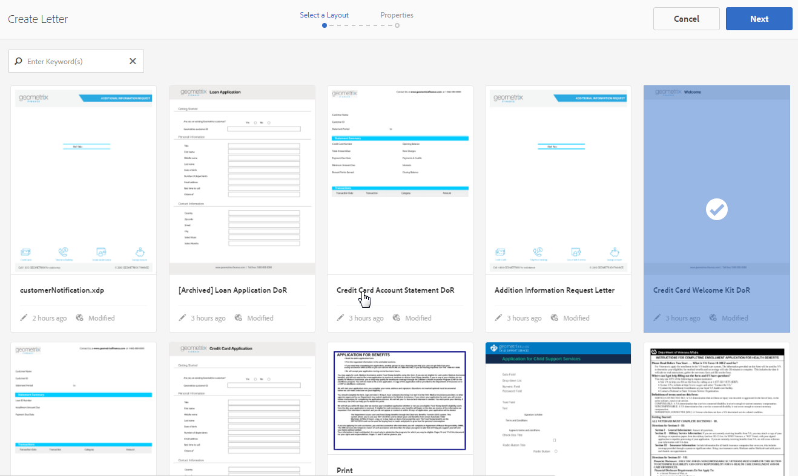

# 创建书信 {#create-letter}

## 通信管理工作流 {#correspondence-management-workflow}

通信管理工作流包括四个阶段：

1. 模板创建
1. 文档片段创建
1. 书信创建
1. 后处理

### 模板创建 {#template-creation}

下图显示了用于创建通信模板的典型工作流。

在此工作流中：

1. 表单设计器使用AdobeForms Designer创建布局和片段布局并将它们上传到CRX存储库。 布局包含典型的表单字段、版面功能（如页眉和页脚）以及用于内容投放的空“目标区域”。 之后，应用程序专家会映射这些目标区域所需的内容。 有关的更多信息 [设计布局](/help/forms/using/layout-design-details.md).
1. 来自法律、财务或营销部门的主题专家，负责创建并上传各种通信模板中重复使用的内容，例如文本条款免责声明、条款和条件以及徽标等图像。
1. 应用程序专家创建通信模板。 应用程序专家

   * 将文本子句和图像映射到布局模板中的目标区域
   * 定义包含内容的条件/规则
   * 将布局字段和变量绑定到基础数据模型

1. 作者预览信件并提交以进行后处理。 有关以下内容的更多信息 [后处理](/help/forms/using/submit-letter-topostprocess.md).

#### 使用随通信管理提供的信件模板 {#using-letter-templates-provided-with-correspondence-management}

您可以选择修改和重用“通信管理”提供的模板，而不是从头开始创建布局模板。 您可以使用设计器快速修改模板的品牌策略以及数据和内容字段，以满足贵组织的需求。 有关通信管理模板的详细信息，请参阅 [参考书信模板](/help/forms/using/reference-cm-layout-templates.md).

### 文档片段创建 {#document-fragment-creation}

文档片段是可重复使用的通信部件\组件，您可以使用它们来撰写信件\通信。

文档片段具有以下类型：

#### 文本 {#text}

文本资产是由一个或多个文本段落组成的一段内容。 段落可以是静态的或动态的。 动态段落包含对运行时提供其值的数据元素的引用。

#### 列表 {#list}

列表是一系列文档片段，包括文本、列表（相同的列表不能“添加在其中）、条件和图像。 列表元素的顺序可以固定或可编辑。 创建信件时，您可以使用部分或所有列表元素来复制可重用元素模式。

#### 条件 {#condition}

条件允许您根据提供的数据定义在创建通信时要包含的内容。 该条件用控制变量描述。 变量可以是数据字典元素或占位符。 添加条件时，您可以选择根据控制变量所具有的值包含资产。 条件具有基于表达式的单个输出。 根据当前条件变量，发现第一个表达式为true。 其值将成为条件的输出。

#### 布局片段 {#layout-fragment}

布局片段是可以在一或多个字母中使用的布局。 布局片段用于创建可重复的模式，尤其是动态表。 布局可包含典型的表单字段，如“Address”和“Reference Number”。 它还包含表示目标区域的空子表单。 布局(XDP)在Designer中创建，然后是 [已上传至Forms和文档](/help/forms/using/get-xdp-pdf-documents-aem.md).

### 书信创建 {#letter-creation}

可通过两种方式生成发送给客户的通信：用户驱动和系统驱动。

#### 用户驱动 {#user-driven}

面向客户的员工（如理赔顾问或案例工作人员）可以创建自定义的通信。 借助简单直观的信件填写界面，企业用户可以向信件添加可选文本，个性化可编辑内容，同时实时预览信件。 然后，他们可以将自定义通信提交到后端流程。

#### 系统驱动 {#system-driven}

通信生成是自动的，由事件触发器驱动。 例如，通过将预定义模板与公民数据合并而生成提醒通知，该提醒通知是发送给公民以提示她进行预缴税。 最终书信可以通过电子邮件发送、打印、传真或存档。

### 后处理 {#post-processing}

最终通信可以发送到后端进程进行后处理。 通信可以是：

1. 处理电子邮件、传真或批量打印，或放入文件夹中打印或发送电子邮件。
1. 已提交进行审查和批准。
1. 通过应用数字签名、认证、加密或权限管理而得到保护。
1. 转换为可搜索的PDF文档，其中包含归档和审核所需的所有元数据。
1. 包含在包含更多文档的PDFPortfolio中，例如营销材料。 然后，可以将PDFPortfolio作为最终通信发送。

### 通信管理解决方案体系结构 {#correspondence-management-solution-architecture}

下图概述了信件解决方案的示例体系结构。

## 解构字母 {#deconstructing-a-letter}

此取消通知文档是典型的通信示例：

<table> 
 <tbody> 
  <tr> 
   <td><strong>书信元素</strong></td> 
   <td><strong>描述</strong></td> 
   <td><strong>形成方式</strong></td> 
  </tr> 
  <tr> 
   <td>来自后端企业系统的数据</td> 
   <td>来自后端企业系统的数据。 数据将与通信模板动态合并。</td> 
   <td>此  根据数据字典创建的数据文件</td> 
  </tr> 
  <tr> 
   <td>数据  由一线员工输入</td> 
   <td>由一线员工提供的数据，该员工在发送信件之前自定义信件。  </td> 
   <td>
未受保护的DD元素  可编辑的文本段落  变量/占位符  
 </td> 
  </tr> 
  <tr> 
   <td>预批准  文本段落</td> 
   <td>预批准的文本内容。 法律、金融或行业专家，他们了解信件的商业背景，通常会创作文本内容。 如页眉、页脚、免责声明和问候语等内容对于大多数信件来说都是通用的。 但是，“终止原因”等内容将特定于特定字母。</td> 
   <td>
文本\列表\  条件\布局
 
 
 </td> 
  </tr> 
  <tr> 
   <td>数据  基于自定义逻辑？</td> 
   <td>对于某些信件（如请求获得有关索赔的更多信息的信件），索赔理算师等用户可以添加自定义文本内容。</td> 
   <td>文档  条件类型的片段 </td> 
  </tr> 
  <tr> 
   <td>存储  来自中央存储库的图像</td> 
   <td>图像，如徽标和签名图像。 公司徽标等图像会出现在大多数或所有通信中。 签名图像专用于信件和代表其发送信件的人。</td> 
   <td>
存储在AEM assets (DAM)中的图像  
 
 
 </td> 
  </tr> 
 </tbody> 
</table>

## 在构建信件之前对其进行分析 {#analyze-a-letter-before-you-construct-it}

分析每封信，找出构成信件的各个部分。 应用程序专家会分析生成的对应。

* 通信中的哪些部分是静态的，哪些部分是动态的。 从后端数据源或由最终用户填充的变量。
* 各种文本段落在通信中出现的顺序，如业务用户是否可以在通信创建期间更改段落。
* 通信是由系统生成的，还是需要最终用户编辑通信？ 有多少交易方是由系统生成的，有多少交易方需要用户干预？
* 通信模板多久更改一次？ 是每年、每季度更新，还是仅在特定法规发生更改时更新？ 需要什么类型的更改？ 是否需要执行更改以修复拼写错误、更改布局、添加更多字段、添加更多段落等。
* 在规划通信需求时，收集新通信模板的列表。 对于每个通信模板，您需要：

   * 文本子句、图像和表
   * 来自后端系统的数据值
   * 通信布局和片段布局
   * 内容在信件中的显示顺序以及包含和排除内容的规则

* 索赔理算员或案例处理员等业务用户修改信件内容或部分的条件。
* 方案是描述使用信件解决方案的用户体验、要求和好处的叙述。
* 方案还提供：项目所需的技能组合和工具。
* 规划实施的最佳实践。 “高级实施概述。

## 执行分析的好处 {#benefits-of-performing-the-analysis}

**内容重用** 您有一个生成通信所需新内容的综合列表。 页眉、页脚、免责声明和简介等内容在许多字母中是通用的，可以在各种字母中重复使用。 所有此类通用内容都可由专家一次创建和批准，然后可在许多信件中重复使用。

**构建数据字典** 将存在“客户ID”和“客户名称”等数据值，这些值对于许多字母通用。 您可以准备所有此类数据值的合并列表。 通常，在规划结构时会咨询企业中间件团队中的某个人。 这是构建数据字典的基础。

**从后端企业系统获取数据** 您还将知道需要的所有数据值以及获取企业系统数据的位置。 然后，您可以构建实施以从企业系统中提取数据并馈送到信件解决方案。

**估计字母的复杂性** 确定创建特定通信内容的复杂程度很重要。 此分析有助于确定创建信件模板所需的时间和技能集。 这反过来将有助于估计实施信件解决方案的资源和成本。

## 通信复杂度 {#correspondence-complexity}

通过分析以下参数可以确定对应的复杂度：

**布局复杂性** 布局有多复杂？ 取消通知等信件的布局非常简单。 而索赔范围确认等信件的布局复杂，包含多个表格和超过60个表单字段。 创建复杂布局需要较长时间，并且需要高级布局设计技能。

**文本段落和条件的数量** 借款合同可以长达10页，包含超过40条文本条款。 其中许多条款将取决于“贷款参数”。 根据确切的条款和条件，这些条款将包括在合同中或排除在合同之外。 创建此类信件需要周密规划和仔细定义复杂条件。

下表提供了一些可用于对信件进行分类的准则：

<table> 
 <tbody> 
  <tr> 
   <td>
<strong>复杂性级别</strong>
 </td> 
   <td>
<strong>布局复杂性（主观）</strong>
 </td> 
   <td>
<strong>文本段落数</strong>
 </td> 
   <td>
<strong>条件文本或图像的数量</strong>
 </td> 
   <td>
<strong>所需技能集</strong>
 </td> 
  </tr> 
  <tr> 
   <td>
低复杂性
 </td> 
   <td>
低。 布局中的表单字段较少(&lt;15)。
 
通常一个页面.
 </td> 
   <td>
8
 </td> 
   <td>
1
 </td> 
   <td>
中型设计人员技能。
 </td> 
  </tr> 
  <tr> 
   <td>
中等复杂性
 </td> 
   <td>
中等复杂布局。 包括表等结构。 通常多个页面长。
 </td> 
   <td>
16
 </td> 
   <td>
2
 </td> 
   <td>
中型设计人员技能。
 
 
 
能够使用用户界面创建复杂表达式。
 </td> 
  </tr> 
  <tr> 
   <td>
高复杂性
 </td> 
   <td>
布局复杂。 可以大于三页。 包含表格和60多个表单字段。
 </td> 
   <td>
40
 </td> 
   <td>
8
 </td> 
   <td>
专家设计人员技能。
 
 
 
能够使用用户界面创建复杂表达式。
 </td> 
  </tr> 
 </tbody> 
</table>

## 创建信件概览 {#overview-of-creating-a-letter}

1. 选择用作信件基础的相应布局并创建信件。
1. 向书信添加数据模块或布局片段并进行配置。
1. 选择以预览通信。
1. 编辑并设置字段、变量、内容和附件。

### 前提条件 {#prerequisites}

创建通信时，首先需要满足以下条件：

* [兼容包](compatibility-package.md). 安装兼容包以查看 **字母** 上的选项 **Forms** 页面。
* 字母XDP ([布局](/help/forms/using/document-fragments.md))。
* 其他XDP ([布局片段](document-fragments.md#document-fragments))构成信件的一部分。 XDP\布局创建于 [设计器](https://www.adobe.com/go/learn_aemforms_designer_65_cn).
* 相关 [数据字典](/help/forms/using/data-dictionary.md) （可选）。
* 此 [数据模块](/help/forms/using/document-fragments.md) 你想在通信中使用。
* [测试数据](/help/forms/using/data-dictionary.md#p-working-with-test-data-p) 是其中移植了测试数据的XML文件。 如果您使用数据字典，则需要测试数据。

## 创建书信模板 {#create-a-letter-template}

### 选择布局并输入书信属性 {#select-a-layout-and-enter-the-letter-properties}

1. 选择 **Forms** > **字母**.

1. 选择 **创建>书信**. 通信管理显示可用的布局(XDP)。 这些布局来自Designer。 布局还包括通信管理提供的现成信件模板。 有关通信管理模板的详细信息，请参阅 [参考书信模板](/help/forms/using/reference-cm-layout-templates.md). 要添加您自己的布局，请在Designer中创建XDP（布局）文件，然后 [将它们上传到AEM Forms](/help/forms/using/get-xdp-pdf-documents-aem.md).

   

1. 通过点按选择布局并选择 **下一个**.

   

1. 输入通信的属性并选择 **保存：**

   * **标题（可选）：** 输入书信的标题。 标题不需要是唯一的，并且可以包含特殊字符和非英语字符。
   * **名称：** 书信的唯一名称。 任何状态下都不能存在两个同名字母。 在“名称”字段中，只能输入英语字符、数字和连字符。 根据“标题”字段自动填充“名称”字段。 在“标题”字段中输入的特殊字符、空格、数字和非英语字符将在“名称”字段中替换为连字符。 虽然“标题”字段中的值会自动复制到“名称”，但您可以编辑该值。
   * **描述（可选）：** 请描述信件以供参考。
   * **数据字典（可选）**：数据字典可与通信相关联。 您稍后插入此通信的资产应当具有与您为此处的通信选择的数据字典相同的数据字典，或者没有数据字典。
   * **标记（可选）：** 选择要应用于通信的标记。 您还可以键入新的/自定义标记名称并按Enter键以创建它。
   * **后处理（可选）：** 选择要应用于信件模板的发布流程。 开箱即用的发布流程，以及您使用AEM创建的发布流程，例如电子邮件和打印流程。

   

1. 系统显示消息：“Letter created successfully（已成功创建信件）”。 （在警报消息中）选择 **打开** 以配置其中的数据模块和布局片段。 或选择 **完成** 以返回上一页。

   

   **下一个**：当您选择时 **打开**，通信管理显示布局的表示形式，其中列出了布局(XDP)中的所有组件。 继续插入 [数据模块和布局片段及其配置](/help/forms/using/create-letter.md#p-insert-data-modules-and-layout-fragments-in-a-letter-and-configure-them-p).

### 在信件中插入数据模块和布局片段并进行配置 {#insert-data-modules-and-layout-fragments-in-a-letter-and-configure-them}

创建通信后，如果选择“打开”，通信管理将显示布局的表示形式，其中列出了布局(XDP)中的所有子表单/目标区域。 在每个目标区域中，您可以选择插入数据模块或布局片段（然后在布局片段中插入数据模块）。

>[!NOTE]
>
>您还可以选择在“信件”页面中选择信件的编辑图标以在信件中插入数据模块和布局片段并进行配置。

1. 选择 **插入** 对于每个子表单，选择要插入每个子表单中的数据模块或布局片段。

   

1. 为每个子表单选择数据模块或布局片段，然后选择要插入的数据模块或布局片段。 布局片段允许您根据自身设计（最多四个级别）进一步将数据模块或布局片段插入其中。

   

1. 如果插入布局片段，则布局片段的名称会显示在子表单中。 根据所选片段，嵌套的子表单会显示在子表单中。
1. 在布局中插入所选数据模块后，您可以选择配置模式，并在为每个模块点按编辑图标后设置以下内容：

   1. **可编辑**：选择此选项时，可以在创建通信用户界面中编辑内容。 仅当需要业务用户（例如理赔人）修改内容时，才将内容标记为可编辑。
   1. **必需**：选择此选项时，需要在“创建通信”用户界面中提供内容。
   1. **已选择**：选择此选项时，将默认在“创建通信”用户界面中选择内容。
   1. **缩进**：增加或减少信件中模块/内容的缩进。 缩进是按级别指定的，从0开始。 每级缩进36分。 有关自定义表单的更多信息，请参阅 **[!UICONTROL 通信管理配置]** 在 [Forms工作流程](submit-letter-topostprocess.md#formsworkflow).
   1. **在此之前分页**：如果将之前分页设置为开，则此模块的内容始终显示在新页面上。
   1. **在以下位置后插入分页符：**：如果为特定模块将Page Break After设置为on ，则下一模块的内容将始终显示在新页面上。

   

1. 要编辑模块，请选择模块旁边的编辑图标。 编辑模块后，选择 **保存**.

   在此页中，您还可以为子表单执行以下操作：

   1. **允许自由文本**：如果启用了允许自由文本，则用户可以在CCR视图的书信中添加内联文本。 在CCR视图中，为启用了允许自由文本的目标区域启用了“T”操作，当用户选择它时，它会询问文本的名称和描述，然后点按确定时，它会以编辑模式打开该文本，用户可以在其中添加文本。 这与其他文本模块类似
   1. **锁定顺序**：锁定信件中子表单的顺序。 创建信件时，不允许作者对子表单/组件重新排序。

   在此页面中，您还可以对子表单中的每个资产执行以下操作：

   1. **更改资产的顺序**：拖放按住资源重新排序图标的资源( )。
   1. **删除资源**：选择资产旁边的删除图标以将其删除。
   1. **预览资源**：选择显示预览图标( )。

1. 选择&#x200B;**下一步**。
1. “数据”页详细介绍了如何在模板中使用数据字段和变量。 数据可以链接到数据源，例如数据字典或用户输入。 每个字段定义数据字典映射数据的属性或为用户输入字段显示的标题。

   链接：

   * 此 **字段** 元素可以链接到文本、数据字典元素、资产或用户指定的值。 您还可以通过将字段元素绑定到“忽略”选项来忽略该字段元素。
   * 此 **变量** 元素可以链接到文本、数据字典元素、字段、变量、资产或用户指定的值。

   以下是关联中的一些主要字段：

   * **多行**：您可以指定字段或变量的数据条目是否为多行。 如果选择此选项，则字段或变量的输入框在数据编辑视图中显示为多行输入框。 在“创建通信”用户界面的“数据”和“内容”视图中，字段或变量也显示为多行。 多行输入字段类似于在TextModule中输入注释的字段。 多行选项仅适用于链接类型为“用户”或未受保护数据字典元素的字段和变量。
   * **可选**：您可以指定字段或变量的值是否为可选值。 可选字段选项适用于链接类型为“用户”或无保护数据字典元素的字段和变量。

   * **字段/变量验证**：要增强对字段或变量值的验证，可向字段或变量分配验证器。 此选项仅适用于链接类型为“用户”或无保护数据字典元素的字段和变量。
   * **题注** 和 **工具提示**：题注是CCR用户界面中字段之前显示的字段标签。 此选项适用于链接类型为“用户”或无保护数据字典元素的字段和变量。

   以下是可用于字段的验证类型：

   * **字符串验证器**：使用字符串验证器指定在字段或变量中输入的字符串的最小和最大长度。 在创建字符串验证器时，请确保指定有效的验证参数。 输入最小值和最大值的有效长度。 对于String验证器，您可以指定可输入值的最小和最大长度。 如果输入的值不是根据指定的最小值和最大值，则CCR用户界面中的相关字段将标记为红色。

   * **数字验证器**：使用数字验证器指定在字段或变量中输入的最小和最大数值。 在创建数字验证器时，请确保指定有效的验证参数。 输入最小值和最大值的数值。

   * **正则表达式验证器**：使用正则表达式验证器定义用于验证字段或变量值的正则表达式。 此外，您还可以自定义错误消息。 在创建正则表达式验证器时，请确保指定有效的正则表达式。

   >[!NOTE]
   >
   >字段和变量验证器仅适用于链接类型为“用户”或无保护数据字典元素的字段或变量。

   

1. 指定链接后，选择 **下一个**. “通信管理”将显示“附件”屏幕。

### 设置附件 {#set-up-the-attachments}

1. 选择 **添加资源**.
1. 在选择资产屏幕中，选择要与字母一起附加的资产，然后选择 **完成**. 您需要先将资产上传到Assets。 建议您仅附加PDF和Microsoft Office文档，但也可以附加图像。 有关在DAM中上传资产的更多信息，请参阅 [正在上传资产](/help/assets/manage-assets.md).
1. 要锁定列表中的资产顺序，以便理赔人不能更改顺序，请选择 **锁定顺序**. 如果不选择此选项，则索赔理算员可以更改列表项的顺序。
1. 要更改资源的顺序，请拖放一个按住资源重新排序图标的资源( )。
1. 选择 **编辑** 前面，如果不希望作者能够删除附件，请将附件指定为必选项。 如果要在CCR界面中预先选择附件，请将附件指定为“已选定”。
1. 选择 **库访问权限** 授予对库的访问权限。 如果启用了“库访问”，则理赔师可以在创建信件并插入附件时访问内容库。
1. 选择 **附件配置** 并指定附件的最大数量。

1. 选择&#x200B;**保存**。您的信件已创建并列在“信件”页面上。

在Correspondence Management中创建信件模板后，最终用户/代理/索赔理算员可以在CCR用户界面中打开信件，并通过输入数据、设置内容和管理附件来创建信件。 有关更多信息，请参阅 [创建通信](/help/forms/using/create-correspondence.md).

## 每个字段可用的链接类型 {#types-of-linkage-available-for-each-of-the-fields}

下表描述了哪些类型的链接可用于各种类型的字段。

表中的以下值

* **是**：最左列的字段类型支持该类型的映射
* **否**：最左列的字段类型不支持该映射类型
* **不适用**：最左列的字段类型不适用

<table> 
 <tbody> 
  <tr> 
   <td> </td> 
   <td><strong>字面值</strong></td> 
   <td><strong>资产</strong></td> 
   <td><strong>数据字典</strong></td> 
   <td><strong>忽略</strong></td> 
   <td><strong>用户</strong></td> 
   <td><strong>字段</strong></td> 
   <td><strong>变量</strong></td> 
  </tr> 
  <tr> 
   <td><strong>日期</strong></td> 
   <td>是</td> 
   <td>否</td> 
   <td>是</td> 
   <td>是</td> 
   <td>是</td> 
   <td>不适用</td> 
   <td>不适用</td> 
  </tr> 
  <tr> 
   <td><strong>时间</strong></td> 
   <td>是</td> 
   <td>否</td> 
   <td>是</td> 
   <td>是</td> 
   <td>是</td> 
   <td>不适用</td> 
   <td>不适用</td> 
  </tr> 
  <tr> 
   <td><strong>日期时间</strong></td> 
   <td>是</td> 
   <td>否</td> 
   <td>是</td> 
   <td>是</td> 
   <td>是</td> 
   <td>不适用</td> 
   <td>不适用</td> 
  </tr> 
  <tr> 
   <td><strong>整数</strong></td> 
   <td>是</td> 
   <td>否</td> 
   <td>是</td> 
   <td>是</td> 
   <td>是  </td> 
   <td>不适用</td> 
   <td>不适用</td> 
  </tr> 
  <tr> 
   <td><strong>浮点数</strong></td> 
   <td>是</td> 
   <td>否</td> 
   <td>是</td> 
   <td>是</td> 
   <td>是  </td> 
   <td>不适用</td> 
   <td>不适用  </td> 
  </tr> 
  <tr> 
   <td><strong>富文本</strong></td> 
   <td>是</td> 
   <td>仅限文本</td> 
   <td>是</td> 
   <td>是</td> 
   <td>是</td> 
   <td>不适用</td> 
   <td>不适用</td> 
  </tr> 
  <tr> 
   <td><strong>普通</strong> <strong>文本</strong></td> 
   <td>是</td> 
   <td>仅限文本</td> 
   <td>是</td> 
   <td>是</td> 
   <td>是</td> 
   <td>不适用</td> 
   <td>不适用</td> 
  </tr> 
  <tr> 
   <td><strong>图像</strong></td> 
   <td>否</td> 
   <td>仅图像</td> 
   <td>否</td> 
   <td>是</td> 
   <td>否</td> 
   <td>不适用</td> 
   <td>不适用</td> 
  </tr> 
  <tr> 
   <td><strong>签名</strong></td> 
   <td>否</td> 
   <td>否</td> 
   <td>否  </td> 
   <td>是</td> 
   <td>否</td> 
   <td>不适用</td> 
   <td>不适用  </td> 
  </tr> 
 </tbody> 
</table>

## 创建信件模板的副本 {#createcopylettertemplate}

您可以使用现有的信件模板快速创建具有相似属性、内容和继承资产（如文档片段和数据字典）的信件模板。 要执行此操作，请复制并粘贴信件。

1. 在“字母”页中，选择一个或多个字母。 UI会显示复制图标。
1. 选择复制。 UI将显示“粘贴”图标。 您也可以选择在粘贴之前进入文件夹。 不同的文件夹可以包含具有相同名称的资源。 有关文件夹的详细信息，请参阅 [文件夹和组织资源](/help/forms/using/import-export-forms-templates.md#folders-and-organizing-assets).
1. 选择“粘贴”。 将显示“粘贴”对话框。 如果在同一位置复制和粘贴字母，系统会自动为新的字母副本指定名称和标题，但您可以编辑字母的标题和名称。
1. 如有必要，请编辑要用于保存信件副本的标题和名称。
1. 选择“粘贴”。 将创建信件的副本。 现在，您可以在新建的信件中进行所需的更改。
