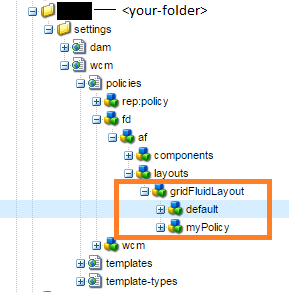

# 根据使用的模板显示组件{#displaying-components-based-on-the-template-used}

当表单作者使用[模板](../../forms/using/template-editor.md)创建自适应表单时，表单作者可以查看和使用基于模板策略的特定组件。 您可以指定一个模板内容策略，以便选择表单作者在表单创作时看到的一组组件。

## 更改模板的内容策略 {#changing-the-content-policy-of-a-template}

创建模板时，该模板在内容存储库中的`/conf`下创建。 根据您在`/conf`目录中创建的文件夹，模板的路径为： `/conf/<your-folder>/settings/wcm/templates/<your-template>`。

执行以下步骤，根据模板的内容策略在侧栏中显示组件：

1. 打开CRXDE Lite。\
   URL： `https://<server>:<port>/crx/de/index.jsp`
1. 在CRXDE中，导航到创建模板的文件夹。

   例如：`/conf/<your-folder>/`

1. 在CRXDE中，导航到： `/conf/<your-folder>/settings/wcm/policies/fd/af/layouts/gridFluidLayout/`

   要选择一组组件，需要新的内容策略。 要创建策略，请复制粘贴默认策略，然后对其进行重命名。

   默认内容策略的路径为： `/conf/<your-folder>/settings/wcm/policies/fd/af/layouts/gridFluidLayout/default`

   在`gridFluidLayout`文件夹中，复制粘贴默认策略并对其进行重命名。 例如：`myPolicy`。

   

1. 选择您创建的新策略，然后在右侧面板中选择类型为`string[]`的&#x200B;**组件**&#x200B;属性。

   选择并打开组件属性时，您将看到编辑组件对话框。 通过“编辑组件”对话框，您可以使用&#x200B;**+**&#x200B;和&#x200B;**-**&#x200B;按钮添加或删除组件组。 您可以添加组件组，其中包含您希望作者使用的组件。

   

   添加组件组后，单击“**确定**”以更新列表，然后单击CRXDE地址栏上方的“**全部保存**”并刷新。

1. 在模板中，将内容策略从默认策略更改为您创建的新策略。 （在此示例中为`myPolicy`。）

   要更改策略，请在CRXDE中导航到`/conf/<your-folder>/settings/wcm/templates/<your-template>/policies/jcr:content/guideContainer/rootPanel/items`。

   在`cq:policy`属性中，将`default`更改为新的策略名称( `myPolicy`)。

   

   在使用模板创作表单时，您可以在侧栏中看到添加的组件。
