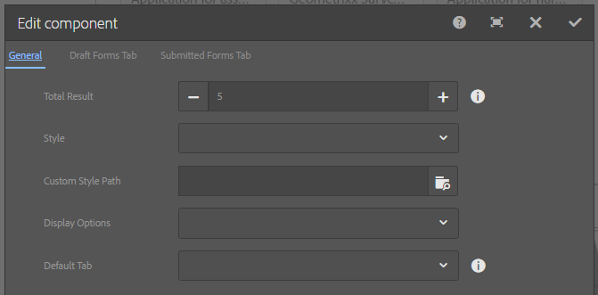

# 草稿和提交组件{#drafts-and-submissions-component}

“草稿和提交”组件列出处于草稿状态的所有表单以及已提交的表单。 该组件具有单独的草稿和已提交表单部分（选项卡）。 用户只能查看其草稿和提交的表单。

## 配置组件 {#configuring-the-component}

“草稿和提交”组件有两个选项卡：草稿和提交。

要允许提交自适应表单以显示在提交选项卡中，请将“提交”操 **作设置为** “表 **[单门户提交操作”](../../forms/using/configuring-submit-actions.md)。 或者，**启用Forms Portal提交选项。 每当用户提交表单时，表单就会添加到提交选项卡。

草稿功能现已启用。 当用户单击自适 **应表单** “保存”时，表单将添加到草稿选项卡。

执行以下步骤以添加和配置草稿和提交组件：

1. 将“草稿和提交”组 **件拖放到组件浏览器中** “文档服务”类别下的“草稿和提交”组件到您的页面。
1. 点按组件，然后点  ，打开组件的编辑对话框。

   

1. 在“编辑”对话框中，指定以下详细信息，然后点 **按完成** ，以保存设置。

<table>
 <tbody>
  <tr>
   <th>选项卡·</th>
   <th>配置</th>
   <th>描述</th>
  </tr>
  <tr>
   <td>常规</td>
   <td>总结果</td>
   <td>指定要显示的最大结果数。 如果结果计数增加了“总结果”限制，则组件 <strong>的 </strong>底部将显示“更多”链接。 单击 <strong>更 </strong>多可显示所有表单。 </td>
  </tr>
  <tr>
   <td> </td>
   <td>样式类型</td>
   <td>指定组件的样式。 可指定“无 <strong>样式</strong>”、“默 <strong>认样式”</strong>或“自 <strong>定义样式</strong> ”来列出表单。 对于“自定义样式选项”，可以在“自定义样式路径”字段中指定自定义CSS <strong>文件的 </strong>路径<strong>。</strong></td>
  </tr>
  <tr>
   <td> </td>
   <td>自定义样式路径</td>
   <td>如果在“样 <strong>式类型</strong> ”字段中选择“自定样式 <strong>”选项</strong> ，则使用“自定样式路径 <strong></strong> ”字段指定自定义CSS文件的路径。 </td>
  </tr>
  <tr>
   <td> </td>
   <td>显示选项</td>
   <td>
指定要显示的选项卡。 您可以选择显示草稿表单、已提交表单或两者。 
 
<strong></strong> 注意<em>:对于 <strong>显示选项</strong>，如果您选择了“两者”以外的选项 <strong>，则不会使用“</strong>默认选项卡 <strong></strong> ”字段选项。</em>
 </td>
  </tr>
  <tr>
   <td> </td>
   <td>默认选项卡</td>
   <td>指定加载表单门户页面时要显示的选项卡。 您可以在“草稿表 <strong>单”选项卡和“提交的表</strong> 单” <strong>选项卡之间进行选择</strong>。</td>
  </tr>
  <tr>
   <td>草稿表单选项卡配置</td>
   <td>自定义标题</td>
   <td>指定“草稿表单” <strong>选项卡的标</strong> 题。 默认值为“草 <strong>稿表单”。</strong></td>
  </tr>
  <tr>
   <td> </td>
   <td>布局模板</td>
   <td>指定用于“草稿表单”列表的布局。</td>
  </tr>
  <tr>
   <td>已提交的表单选项卡配置</td>
   <td>自定义标题 </td>
   <td>指定“已提交的表 <strong>单”选项卡 </strong>的标题。 默认值为“已提 <strong>交表单”。</strong></td>
  </tr>
  <tr>
   <td> </td>
   <td>布局模板</td>
   <td>指定用于“已提交表单”列表的布<strong></strong>局。 </td>
  </tr>
 </tbody>
</table>

## 自定义存储 {#customizing-the-storage}

当您使用Forms Portal提交操作或在自适应表单中启用“在表单门户中存储数据”选项时，表单数据将存储在AEM存储库中。 在生产环境中，建议不要在AEM存储库中存储草稿或提交的表单数据。 相反，您必须将草稿和提交组件与安全存储（如企业数据库）集成，以存储草稿和提交的表单数据。

Forms Portal允许您在本地AEM存储库、远程AEM存储库或数据库中存储数据。 AEM Forms允许您自定义为草稿和提交存储用户数据的实施。 您可以覆盖默认方法以指定草稿和提交数据在您选择的存储器中的存储方式。 例如，您可以将数据存储在单位中当前实施的数据存储中。

Forms Portal提供开箱即用服务(API)，以在本地和远程AEM Forms发布实例的crx-repository上存储数据。 您可以将默认实施(如为草稿和提交配置 [存储服务一文中所述)替换为自定义实施](/help/forms/using/configuring-draft-submission-storage.md) ，以替换默认功能。 有关在安全位置存储内容的自定义实施中所需的方法的详细信息，请参阅自定义草稿和提交数据服务 [以及草稿和提交组件的自定义存储。](/help/forms/using/adding-custom-storage-provider-forms.md)

AEM Forms文档提供了将草稿和 [提交组件与数据库集成的示例](integrate-draft-submission-database.md)。 您可以使用示例实现来开发您自己的自定义实现。

## 相关文章

* [启用表单门户组件](/help/forms/using/enabling-forms-portal-components.md)
* [创建表单门户页面](/help/forms/using/creating-form-portal-page.md)
* [使用API在网页上列出表单](/help/forms/using/listing-forms-webpage-using-apis.md)
* [使用草稿和提交组件](/help/forms/using/draft-submission-component.md)
* [自定义草稿和已提交表单的存储](/help/forms/using/draft-submission-component.md)
* [将草稿和提交组件与数据库集成的示例](/help/forms/using/integrate-draft-submission-database.md)
* [自定义表单门户组件的模板](/help/forms/using/customizing-templates-forms-portal-components.md)
* [在门户上发布表单的简介](/help/forms/using/introduction-publishing-forms.md)
