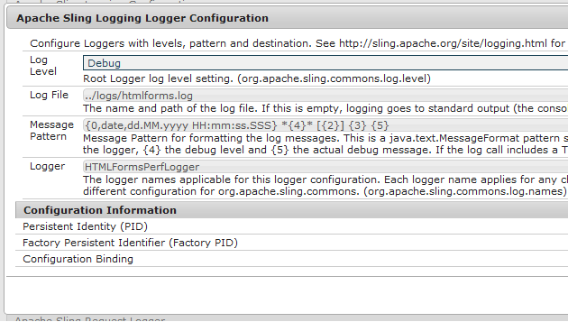

# 为HTML5表单启用日志记录{#enable-logging-for-html-forms}

您可以配置记录器实用程序，以开始创建HTML5表单的日志。 记录器实用程序有各种级别，您可以根据需要设置一个级别。 HTML5表单包含服务器和客户端组件。 您可以为两个组件配置日志。

## 配置服务器端日志记录 {#configuring-server-side-logging}

执行以下步骤以配置服务器端日志：

1. 转到 `https://'[server]:[port]'/system/console/configMgr`. 找到并打开 *Apace Sling日志记录器配置* 选项。 此时将显示一个对话框：

   

   Apace Sling日志记录器配置选项

1. 更改 **日志级别** 到 **调试**.

1. 指定以下项的名称和路径： **日志文件**.

   >[!NOTE]
   >
   >要在HTML5表单log目录中生成日志，请在文件名之前添加……/logs/ 。

1. 更改 **Logger** 到 **HTMLFormsPerfLogger**. 单击&#x200B;**保存**。

## 配置客户端日志记录 {#configuring-client-logging}

可以使用以下方法在HTML5表单中启用客户端日志记录：

* 使用名为的请求参数 `log`
* 使用CQ Configuration Manager

### 使用请求参数启用日志记录 {#enabling-logging-using-request-parameter}

使用此方法，可以为特定请求生成日志。 请求参数的名称为 `log`. 日志URL如下所示：

`https://<server>:<port>/content/xfaforms/profiles/test.html?contentRoot=<path of the folder containing form xdp>&template=<name of the xdp>&log=<log configuration>.`

日志配置由日志级别和记录器类别组成。

#### 日志目标 {#log-destination}

<table>
 <tbody>
  <tr>
   <th><strong>日志目标</strong></th>
   <th><strong>描述</strong></th>
  </tr>
  <tr>
   <td>1</td>
   <td>日志将定向到浏览器 <strong>控制台</strong></td>
  </tr>
  <tr>
   <td>2</td>
   <td>日志收集在客户端的JavaScript对象中，并可发布到 <strong>服务器</strong> </td>
  </tr>
  <tr>
   <td>3</td>
   <td>以上两个选项  </td>
  </tr>
 </tbody>
</table>

#### 日志级别 {#log-levels}

<table>
 <tbody>
  <tr>
   <th>日志级别</th>
   <th>描述</th>
  </tr>
  <tr>
   <td>0</td>
   <td>关闭  </td>
  </tr>
  <tr>
   <td>1</td>
   <td>致命  </td>
  </tr>
  <tr>
   <td>2</td>
   <td>错误  </td>
  </tr>
  <tr>
   <td>3</td>
   <td>警告  </td>
  </tr>
  <tr>
   <td>4</td>
   <td>信息  </td>
  </tr>
  <tr>
   <td>5</td>
   <td>调试  </td>
  </tr>
  <tr>
   <td>6</td>
   <td>TRACE  </td>
  </tr>
  <tr>
   <td>7</td>
   <td>所有  </td>
  </tr>
 </tbody>
</table>

#### 记录器类别 {#logger-categories}

<table>
 <tbody>
  <tr>
   <th>日志类别</th>
   <th>描述</th>
  </tr>
  <tr>
   <td>a</td>
   <td>xfa（脚本引擎相关的日志）</td>
  </tr>
  <tr>
   <td>b</td>
   <td>xfaView（布局引擎相关的日志）  </td>
  </tr>
  <tr>
   <td>c</td>
   <td>xfaPerf（与性能相关的日志）  </td>
  </tr>
 </tbody>
</table>

#### 日志配置 {#log-configuration}

在日志URL中，日志配置查询字符串参数的定义如下：

`{destination}-{a level}-{b level}-{c level}`

例如：

<table>
 <tbody>
  <tr>
   <th>日志配置</th>
   <th>描述</th>
  </tr>
  <tr>
   <td>2-a4-b5-c6  </td>
   <td>目标：服务器  xfa级别： INFO  xfaView级别： DEBUG  xfaPerf级别：TRACE</td>
  </tr>
 </tbody>
</table>

>[!NOTE]
>
>每个日志类别a (xfa)、b (xfaView)和c (xfaPerf)的默认日志级别为2 (ERROR)。 因此，对于日志配置：2-b6，不同类别的日志级别为：
>a (xfa)：2（默认级别错误）
>b (xfaView)：6(用户指定的TRACE)
>a (xfaPerf)：2（默认级别错误）

### 使用Configuration Manager启用记录 {#enabling-logging-using-configuration-manager}

如果使用Configuration Manager启用日志记录，则会为每个渲染请求生成日志，直到再次禁用日志记录为止。

1. 登录到CQ配置管理器，网址为 `https://'[server]:[port]'/system/console/configMgr` 并使用管理员凭据登录。
1. 搜索并单击 **移动Forms配置**.
1. 在“调试选项”文本框中，按上一节所述输入日志配置，例如， **2-a4-b5-c6**

   

   表单配置

## 上传日志 {#uploading-logs}

如果目标设置为1，则所有客户端脚本日志消息都将定向到控制台。 如果管理员需要这些日志以及服务器日志，请将目标级别设置为2。 在此级别，所有日志都将在客户端的JS对象中收集，如果表单以默认配置文件呈现，则 **发送日志** 按钮显示在的左侧 **突出显示现有字段** 工具栏中的按钮。 当用户单击该链接时，所有收集的日志都将发布到服务器，并记录在服务器上配置的错误日志文件中。

默认情况下，所有信息都会添加到/crx-repository/logs/目录下的error.log文件中。

要更改日志文件的位置和名称，请执行以下操作：

1. 以管理员身份登录Configuration Manager。 Configuration Manager的默认URL为 `https://'[server]:[port]'/system/console/configMgr`.
1. 单击 **Apache Sling日志记录器配置**. 将显示一个对话框。

   

1. 更改 **日志级别** 以调试。

1. 指定路径和名称 **日志文件**.

   >[!NOTE]
   >
   >要在保留其他日志文件的同一目录中创建日志，请指定……/logs/&lt;filename> 在“日志文件”属性中。

1. 更改 **Logger** 到 **HTMLFormsPerfLogger** 并单击 **保存**.
