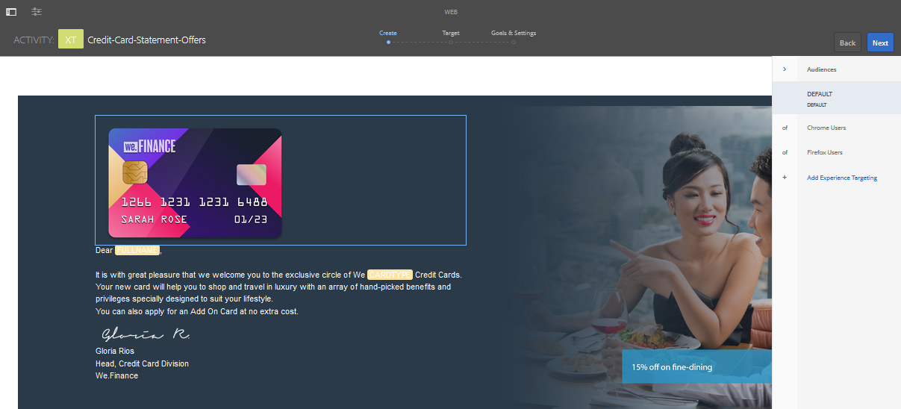

# 在AEM Forms中创建定位体验 {#create-targeted-experiences-in-aem-forms}

## 将Adobe Target与AEM Forms集成 {#integrate-adobe-target-with-aem-forms}

Adobe Target与AEM集成，让您能够为target受众创建自定义的体验。 借助Adobe Target，您可以创建A/B测试、测量用户响应并为目标用户生成自定义Web内容。 您可以将Adobe Target与AEM Forms集成，以定位自适应表单和交互式通信的图像组件。

在AEM中配置Adobe Target以将其与自适应表单和交互式通信结合使用，请参阅 [在AEM中创建Target配置](/help/sites-administering/target.md) 和 [添加框架](/help/sites-administering/target.md).

>[!NOTE]
>
>使用主机名或IP地址呈现自适应表单或交互式通信时，可以进行定位。 当使用本地主机呈现自适应表单或交互式通信时，该请求失败。

## 创建Target活动 {#creating-a-target-activity}

1. 点按 **Adobe Experience Manager >个性化>活动**.

   `https://<hostname>:<port>/libs/cq/personalization/touch-ui/content/v2/activities.html`

1. 在活动页面中，点按 **创建>创建品牌**.
1. 系统会要求您选择模板并输入属性。

   选择模板，点按 **下一个。** 在属性部分中输入品牌的标题，然后点按 **创建。**
您的品牌现在已列在“活动”页面中。

1. 在“活动”页面中点按您的品牌。
1. 在品牌的主控区域中，点按 **创建** > **创建活动**.

   在创建活动时，您可以指定其详细信息、目标和设置。

   “详细信息”部分包括名称、定位引擎和目标。 选择Adobe Target作为定位引擎时，将启用Target云配置选项。 选择Target云配置，选择活动类型，提供活动目标，然后点按 **下一个**. 交互式通信仅支持体验定位活动类型。

   通过Target部分，您可以添加受众体验并对其进行命名。 单击 **添加体验** 启用 **选择受众** 和 **命名体验** 选项。 点按 **选择受众** 查看受众及其来源的列表。 从受众名称列表中选择受众。 点按 **添加体验** 命名体验，然后点按 **下一个**.

   通过目标和设置部分，您可以计划活动并排定其优先级。 设置活动、目标量度、其他量度的开始日期、结束日期和优先级，然后点按 **保存**.

   现在，活动已列在您的品牌页面中。

   >[!NOTE]
   >
   >您可以忽略错误“您的活动已保存，但未同步到Target。 原因：在保存活动时遇到以下体验没有选件”的情况。

1. 要启用target，请编辑.jsp文件以包含自适应表单模板使用的客户端库。

   例如，在现成的实施中，单击 **工具** >  **CRXDE Lite**.

   在CRXDE Lite地址栏中，键入/libs/fd/af/components/page/base/head.jsp以编辑head.jsp文件。

   此实施使用simpleEnrollment模板。 在此实现中，修改head.jsp文件以包含以下客户端库：

   `<cq:include script="/libs/cq/cloudserviceconfigs/components/servicelibs/servicelibs.jsp"/>`

   `<cq:include path="clientcontext_optimized" resourceType="/libs/cq/personalization/components/clientcontext_optimized"/>`

   `<cq:include path="config" resourceType="cq/personalization/components/clientcontext_optimized/config"/>`

1. 要为自适应表单启用目标框架，请导航到您的表单或交互式通信，然后在编辑模式下将其打开。

   要在编辑模式下打开表单或交互式通信，请点按 **选择** 然后点按 **打开**.

   或者，当您将指针移动到表单或交互式通信图标上而未选择它时，会显示四个按钮。 您可以点按 **编辑** 按钮，以在编辑模式下打开表单。

1. 在页面工具栏中，点按 **页面信息**  > **打开属性**.
1. 在“常规”选项卡中，为 **Adobe Target** 字段。 点按 **保存并关闭**.

## 将创建的活动应用到自适应表单图像或交互式通信图像 {#applying-created-activity-to-an-adaptive-form-image-or-an-interactive-communication-image}

1. 打开自适应表单和交互式通信进行编辑。 如果要打开交互式通信，请打开Web渠道。

1. 在交互式通信或自适应表单的创作模式下，添加要定向的图像。

   >[!NOTE]
   >
   >AEM Forms仅支持定位图像组件。 确保托管图像组件的面板不包含任何其他组件，并且该面板的列数设置为1。

1. 从 **编辑** to **定位** 模式。 切换模式的选项位于右上角附近。
1. 选择 **品牌**，选择 **活动**，然后点按 **开始定位**. 的 **受众** 菜单。

   

1. 从 **受众** ，然后点按要定位的图像。 此时会出现一个菜单。 在菜单中，点按 **Target**. 点按图像并点按 **配置**. 在“属性”窗口中，选择要为选定受众显示的图像。 对所有受众重复该步骤。 交互式通信或自适应表单中为图像启用了体验定位。

## 检查创建的活动是否与Target服务器同步 {#check-if-the-created-activity-syncs-with-the-target-server}

用于定位与Target服务器同步的活动。 要检查您的活动是否与目标服务器同步，请在品牌页面中检查活动的状态。

确保活动的状态已同步。

## 验证Target行为 {#validate-target-behavior}

要验证Target行为，请执行以下操作：

* 将定位与 `wcmmode preview` 在创作模式下
* 将定位与 `wcmmode preview` 和 `wcmmode disabled` 在发布模式下

## 监视图像组件的定位 {#monitor-targeting-for-the-image-component}

要监控表单上图像组件的定位，请发布图像、活动和自适应表单。

## 未结问题 {#open-issues}

可见性表达式中，自适应表单上目标图像的焦点设置失败。
