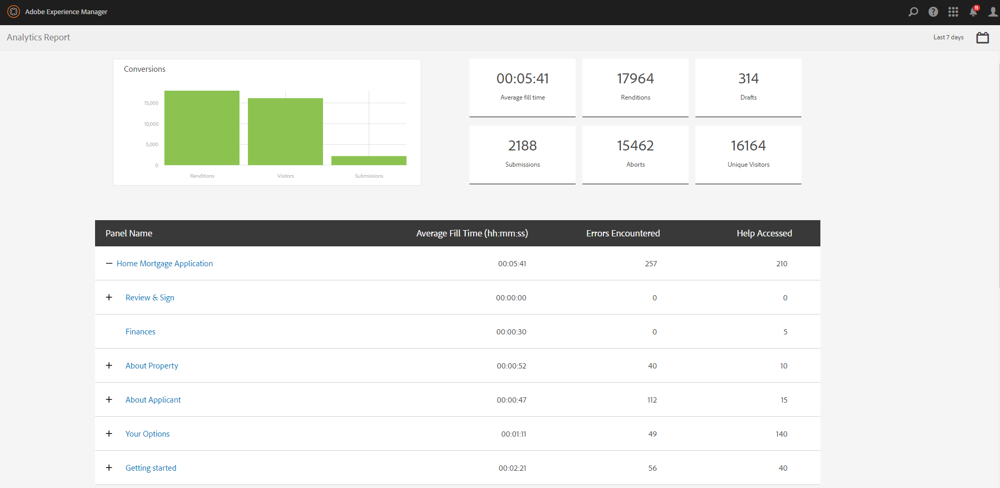
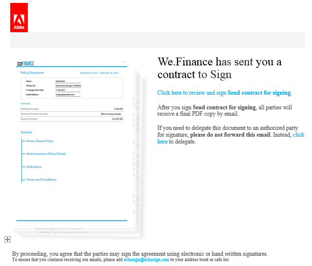
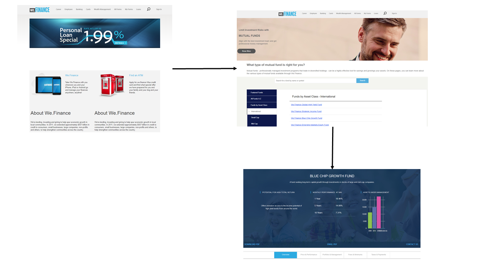
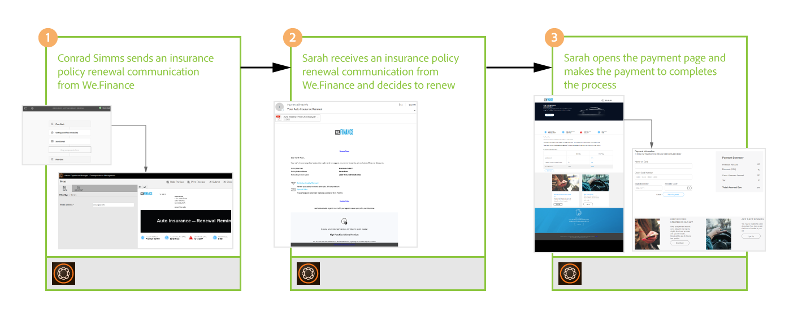

# We.Finance参考站点演练{#we-finance-reference-site-walkthrough}

## Pre-requisites {#pre-requisites}

按照设置和配置AEM Forms参考站 [点中的说明设置参考站点](../../forms/using/setup-reference-sites.md)。

## We.Finance Reference站点方案 {#we-finance-reference-site-scenarios}

We.Finance是金融服务领域的领先组织，它可以优惠全面、个性化的财务解决方案以满足不同客户用户档案的需求。 他们优惠信用卡、住房抵押和住房保险服务。

他们的目标是通过自己喜欢的设备接触现有客户和潜在客户，解释其服务的优势，并帮助他们注册其服务。 此外，他们还希望推销更多金融产品，如客户可能会觉得有趣的附加卡。

阅读详细的We.Finance使用案例演练，了解AEM Forms如何帮助金融组织实现其目标。 下面介绍了以下演练：

* [信用卡申请演练](#credit-card-application-walkthrough)
* [住房抵押申请演练](#home-mortgage-application-walkthrough)
* [Microsoft Dynamics的家庭抵押应用程序演练](#home-mortgage-application-walkthrough-with-microsoft-dynamics)
* [家庭保险申请演练](#home-insurance-application-walkthrough)
* [财富管理演练](#wealthmanagementwalkthrough)
* [汽车保险申请演练](#autoinsuranceapplicationwalkthrough)

## 信用卡申请演练 {#credit-card-application-walkthrough}

We.Finance信用卡应用方案涉及以下角色：

* Sarah Rose,We.Finance客户
* Gloria Rios,We.Finance信用卡和抵押业务主管

以下信息图描述了信用卡应用程序的分步工作流程。

让我们详细了解参考站点场景，了解AEM Forms如何帮助We.Finance实现其目标。

### Sarah从We.Finance收到新闻稿并申请信用卡 {#sarah-receives-a-newsletter-from-we-finance-and-applies-for-a-credit-card}

莎拉·罗丝是We.Finance的现有客户。 她收到We.Finance发来的关于优惠上新信用卡的新闻稿。 她觉得这些优惠令人兴奋，并决定申请信用卡。 她单击新闻稿中的“立即应用”按钮，然后转到We.Finance门户上的信用卡应用程序。

#### 工作方式 {#how-it-works}

发送到Sarah的Newsletter是一个自定义实施，它会触发到指定电子邮件ID的电子邮件。 电子邮件中的“立即应用”按钮链接到信用卡应用程序，该应用程序是发布实例上的自适应表单。

#### 亲自查看 {#see-it-yourself}

在发布实例上打开以下URL以触发Newsletter电子邮件。 确保替换为有 `[emailID]` 效的电子邮件帐户以接收新闻稿。 打开新闻稿，然 **[!UICONTROL 后单击]** “立即应用”以转到信用卡应用程序。

`https://[publishServer]:[publsihPort]/content/campaigns/we-finance/start.html?app=cc&email=[emailID]&givenName=Sarah&familyName=Rose`

### 莎拉觉得优惠很有趣，并选择 {#sarah-finds-the-offer-interesting-and-chooses-to-apply}

Sarah决定申请信用卡，并点击电 **子邮件上** 的“立即申请”按钮。 Sarah将转到We.Finance门户上的信用卡应用程序。 应用程序表单按使用卡布局的章节进行组织。

Sarah从可用选项中选择信用卡并单击“继 **[!UICONTROL 续”]**。

在“个人信息”页面上，当Sarah提供其社会保险号时，她会收到一个提示，提示她使用凭据登录。

Sarah是We.Finance的现有客户。 她使用自己的We.Finance帐户凭据登录，表单中会自动填充她的个人详细信息。 Sarah继续填写申请表，这时弹出提醒，她必须出席会议。 她单击“ **[!UICONTROL 保存我在应用]** 程序表单上的进度”。 它保存了Sarah迄今填写的所有信息，并弹出一个对话框，确认她是否希望收到一封电子邮件，其中附有指向她日后要完成的草稿应用程序的链接。

Sarah单击“ **[!UICONTROL 发送邮件]**”。 她收到一封电子邮件，其中附有继续申请信用卡的链接。

**Sarah通过移动设备访问信用卡应用程序**

如果Sarah正从其移动设备访问信用卡应用程序，则响应式应用程序将在为移动设备优化的视图中打开。 在此视图中，应用程序表单一次呈现为一个部分。 它允许Sarah在导航应用程序时逐步视图和提供信息。

**工作方式**

“立 **即申请** ”按钮将Sarah定向到信用卡应用程序。 应用程序是自适应表单，您可以在的创作实例中查看该表单 `https://[host]:'port'/editor.html/content/forms/af/we-finance/cc-app.html`。

您可以在自适应表单中查看的一些主要功能包括：

* 它基于XSD模式。
* 它使用We Finance主题A构建，用于样式，使用We.Finance模板构建布局。 此外，它还在移动导航中使用表单标题布局中不带面板标题的布局。 当从移动设备打开时，它显示渐进式移动布局。 您可以在上查看模 `https://[host]:'port'/libs/wcm/core/content/sites/templates.html/conf/we-finance` 板和在查看主题 `https://[host]:'port'/editor.html/content/dam/formsanddocuments-themes/we-finance/we-finance-theme-a/jcr:content`。
* 它包括自适应表单规则，用于调用表单数据模型服务来预填已登录用户的用户详细信息。 它还调用服务，按社会保险号或表单中提供的电子邮件地址预填信息。 您可以在查看表单数据模型及其服务 `https://[host]:'port'/aem/forms.html/content/dam/formsanddocuments-fdm`。
* 它使用各种自适应表单组件来捕获输入并适应用户响应。 它还使用支持HTML5输入类型的电子邮件等组件。
* 它使用签名步骤组件显示完成的表单，并允许在表单上进行电子签名。
* “保存我的进度”按钮为用户生成唯一的ID，并将部分填写的应用程序作为草稿保存在AEM存储库中的节点中。 此外，它还显示一个对话框，其中搜索允许发送电子邮件，其中包含指向包含草稿应用程序的节点的链接。 确认对话框上的“发送邮件”按钮会触发一封电子邮件，其中包含指向包含草稿的节点的链接。
* 它使用调用AEM工作流提交操作来触发信用卡批准工作流。 您可以在以下位置查看此表单中使用的工作流： `https://[host]:'port'/editor.html/conf/global/settings/workflow/models/we-finance-credit-card-workflow.html`

建议查看表单以了解用于构建表单的模式、组件、规则、表单数据模型、表单工作流和提交操作。

另外，请参阅以下文档以了解有关信用卡应用程序自适应表单中使用的功能的更多信息：

* [自适应表单创作简介](../../forms/using/introduction-forms-authoring.md)
* [使用XML模式创建自适应表单](../../forms/using/adaptive-form-xml-schema-form-model.md)
* [规则编辑器](../../forms/using/rule-editor.md)
* [主题](../../forms/using/themes.md)
* [数据集成](../../forms/using/data-integration.md)
* [在自适应表单中使用Adobe Sign](../../forms/using/working-with-adobe-sign.md)
* [OSGi上以Forms为中心的工作流程](../../forms/using/aem-forms-workflow.md)

**亲自查看**

以Sarah Rose身份登录时，单击信 **用卡应用** 程序上的“立即应用”按钮。 填写一些详细信息，浏览各种自适应表单组件，单 **击“保存我的进度** ”，收到一封电子邮件，其中 **带有链接至** 草稿应用程序的“继续”按钮。 请确保在应用程序表单中指定电子邮件ID以接收电子邮件。

查看We.Finance主题：

`https://<host>:<AuthorPort>/editor.html/content/dam/formsanddocuments-themes/we-Finance/we-Finance-Theme-A/jcr:content`

您可以在以下位置查看We.Finance模板：

`https://<host>:<AuthorPort>/editor.html/conf/we-finance/settings/wcm/templates/we-finance-template/structure.html`

### Sarah恢复并提交申请 {#sarah-resumes-and-submits-the-application}

Sarah稍后回来，找到We.Finance的一封电子邮件。 她单击电 **子邮件** 中的“继续”按钮，转到信用卡申请草稿。 她之前填写的信息预先填充。 她填写剩余的申请表，签署申请并提交。

或者，她也可以在We.Finance主页的“我 **的Forms** ”下访问她的申请草案。

#### 工作方式 {#how-it-works-1}

电子邮件中的“继续”按钮将Sarah重定向到包含其草稿应用程序的节点。

#### 亲自查看 {#see-it-yourself-1}

您必须已收到一封电子邮件，其中包含您在填写申请表时指定的电子邮件ID上指向草稿应用程序的链接。 继续，填写申请中的其余部分并提交。

### We.Finance接收并批准此申请 {#approving-the-application}

We.Finance收到Sarah提交的信用卡申请。 任务被分配给Gloria Rios。 她查看AEM收件箱中的任务并批准它。

#### 工作方式 {#how-it-works-2}

当Sarah填写并提交信用卡应用程序时，将在Gloria的AEM收件箱中创建Forms Workflow触发器和任务。

AEM FormsOSGi提供以表单为中心的工作流，使您能够构建基于表单的自适应工作流。 这些工作流可用于审核和批准、业务流程流、开始文档服务、与Adobe Sign签名工作流集成等。 有关详细信息，请参 [阅OSGi上以Forms为中心的工作流程](../../forms/using/aem-forms-workflow.md)。

下图描述了处理信用卡应用程序并生成应用程序PDF输出的AEM工作流。

#### 亲自查看 {#see-it-yourself-2}

您可以访问位于https://&lt;hostname>:&lt;PublishPort>/content/we-finance/global/en.html的&#x200B;*we.finance站点的* AEM *收件箱*。 在页面上，点按 **登录**，选中登 **录为代表复选框** ，使用Gloria Rios的用户名／口令 `grios/password` 登录AEM收件箱，并批准信用卡应用程序。 有关将AEM收件箱用于以表单为中心的工作流任务的信息，请参 [阅在AEM收件箱中管理Forms应](../../forms/using/manage-applications-inbox.md)用程序和任务。

当您批准该应用程序时，Sarah会收到一封包含欢迎工具包的电子邮件。

### Sarah收到欢迎工具包并申请附加卡 {#sarah-receives-the-welcome-kit-and-applies-for-an-add-on-card}

当Sarah的信用卡申请获得批准时，她会收到一封电子邮件，其中包含指向欢迎工具包的链接。 她打开欢迎信件包，其中包含她的信用卡帐户详细信息。 欢迎工具包还显示为Sarah个性化的促销优惠。 当她向下滚动时，欢迎工具包包含一个嵌入表单以申请附加卡。 Sarah很快从欢迎工具包中填写了所需的详细信息并申请附加卡。 此时将显示加载项卡应用程序的确认对话框。

欢迎工具包为Sarah个性化，并显示与她相关的信息。 它为她提供了下载PDF版欢迎工具包的选项。

欢迎工具包中包含另一个申请表，Sarah无需访问We.Finance门户即可填写并提交该表单，从欢迎工具包中申请附加卡。

#### 工作方式 {#how-it-works-3}

欢迎工具包是包中包含的交互式 `cq-we-finance-content-pkg.zip` 通信。 桌面版本中用于展示欢迎工具包中信用卡优势的交互式卡是使用文档片段的默认卡布局创建的自定义布局。

附加卡应用程序是欢迎工具包交互通信中的嵌入自适应表单。

#### 亲自查看 {#see-it-yourself-3}

单击您在上一步中收到的电子邮件中的“继续”按钮。 它打开草稿应用程序。 填写所有详细信息并提交申请。 然后您将收到一个欢迎工具包。 查看欢迎工具包。

您还可以视图位于以下URL的欢迎工具包：

https://&lt;*host*>: &lt;*port*>/content/aemforms-refsite/doclink.html?文档=/content/forms/af/we-finance/credit-card/creditcardwelcomkit&amp;customerId=197&amp;渠道=web

您可以在创作和发布实例上访问它。

### Sarah收到信用卡对帐单 {#sarah-receives-a-credit-card-statement}

当Sarah开始使用信用卡时，她会收到来自We.Finance的另一封电子邮件，其中包含她的信用卡报表。 下图显示了手机上包含信用卡对帐单链接的电子邮件。

Sarah在电子邮件中单击“视图对帐单”以视图信用卡对帐单。 该语句是一个交互式通信。 它具有Web和打印(PDF)版本。 该语句与Forms数据模型集成，从数据库检索特定于客户的数据。 交互式语句包含各种元素：

* 语句摘要
* 详细费用报告
* 图形费用分析
* 从报表内支付到期金额的选项
* 下载付款收据

Sarah无需进入门户或在电子邮件中搜索信用卡对帐单的PDF版本，以便脱机存档。 她只需单击“下载语句”即可下载PDF版本的语句。

详细语句在响应式表中列出。 报表还提供从报表内支付部分或全部到期金额的选项。

Sarah计划从报表中付款。 Sarah还可以使用Flexi Pay选项将支付分为等额支付。

#### 工作方式 {#how-it-works-4}

信用卡对帐单是一种交互式通信。 语句中的详细费用表是响应式表。 费用分析的图形是图表组件，它读取费用表并生成饼图。

#### 亲自查看 {#see-it-yourself-4}

您可以通过以下URL查看交互式信用卡对帐单：

https://&lt;*hostname*>:&lt;*port*>/content/aemforms-refsite/doclink.html?文档=/content/forms/af/we-finance/credit-card/credit-card-statement&amp;customerId=197&amp;渠道=web

您可以在创作和发布实例上访问它。

信用卡对帐单在对帐单末尾显示促销优惠。 您可以将Adobe Target与AEM Forms互动通信相集成，根据特定客户细分投放促销目标优惠。 要将您的交互式通信配置为使用Adobe Target进行自定义和定向优惠，请参 [阅创建定向体验](/help/forms/using/experience-targeting-forms.md)。

### We.Finance对信用卡应用的性能分析 {#we-finance-analyzes-the-performance-of-the-credit-card-application}

We.Finance会不时检查其信用卡应用程序的性能，以检查客户可能遇到的任何问题。 他们使用此分析对信用卡应用程序中所需的更改做出明智决策，以增强用户体验，降低表单的弃用率，从而提高转化率。 他们利用AEM Forms和Adobe Analytics的融合来分析。 以下图像描绘了其分析仪表板。

有关如何解释分析仪表板的更多信息，请参阅查 [看和了解AEM Forms分析报告](../../forms/using/view-understand-aem-forms-analytics-reports.md)。

#### 工作方式 {#how-it-works-5}

信用卡申请表的性能指标使用Adobe Analytics进行跟踪。 有关配置Adobe Analytics和查看报告的详细信息，请参 [阅配置表单和文档的分析](../../forms/using/configure-analytics-forms-documents.md)。

#### 亲自查看 {#see-it-yourself-br}

为了视图和浏览分析报告，我们将在参考站点为信用卡应用程序提供种子数据。 在使用种子数据之前，请参 [阅配置分析](../../forms/using/setup-reference-sites.md#configureanalytics)。 在创作实例中执行以下步骤，将报表视图为种子数据：

1. 转至 **Forms和文档** UI，网址&#x200B;*为https://&lt;hostname*>:&lt;*AuthorPort*>/aem/forms.html/content/dam/formsanddocuments。

1. 单击以打开 **We.Finance文件** 夹。
1. 选择 **信用卡自适应表单** ，然后在工具栏中单击启用 **[!UICONTROL 分析]**。

1. 再次选择自适应表单，然后单 **[!UICONTROL 击工具栏]** 中的分析报表以生成报表。 您最初将看到一个空白报告。

要使用种子数据生成分析报告，请执行以下操作：

1. 在CRXDE lite的地址浏览器中，键入： `/apps/we-finance/demo-artifacts/analyticsTestData/Credit card Analytics Test Data`
1. 测试数据在左侧目录结构中被选中。
1. 多次单击所选文件以在右侧面板中打开其内容。
1. 复制种子数据文件中的所有内容。
1. 在CRXDE中，导航到： `/content/dam/formsanddocuments/we-finance/cc-app/jcr:content/analyticsdatanode/lastsevendays`
1. 在“属 **[!UICONTROL 性]** ”下的“分 **[!UICONTROL 析数据]**”字段中，粘贴种子数据文件的复制内容。

1. 选择 **信用卡自适应表单** ，然后单击工具 **[!UICONTROL 栏中的“分析报表]** ”，以生成包含种子数据的报表。

**信用卡申请的A/B测试**

除了分析信用卡应用程序的性能并不断改进，We.Finance还利用AEM Forms与目标的集成来创建A/B测试。 它允许他们提供信用卡申请表的不同体验，并确定在填写和提交表单方面可以更好地转化率的体验。

要在AEM Forms服务器中配置目标，请参 [阅在AEM Forms设置和集成目标](../../forms/using/ab-testing-adaptive-forms.md#set%20up%20and%20integrate%20target%20in%20aem%20forms)。

执行以下步骤以体验创建We.Finance信用卡申请表的A/B测试：

1. 转至 **Forms和文档** ，网址为&#x200B;*https://&lt;hostname*>:&lt;*AuthorPort*>/aem/forms.html/content/dam/formsanddocuments。

1. 单击以打开 **We.Finance文件** 夹。
1. 选择 **信用卡自适应表单** 的申请。
1. 单击 **工具栏** 中的“更多”，然 **后选择“配置A/B测试”**。 此时将打开“配置A/B测试”页。

1. 指定 **活动名**。
1. 从“受众”下拉列表中，选择您要向其提供表单不同体验的受众。 例如，使 **用Chrome的访客**。
1. 在体 **验A** 和B的“体验分发”字段中，按百分比指定分发，以确定体验在总受众中的分布。 例如，如果您为体验A和B分别指定40、60，则体验A将提供给40%的受众，其余60%将看到体验B。
1. 单击 **配置**。 将出现一个对话框，确认A/B测试的创建。
1. 单击&#x200B;**完成**。
1. 选择“信 **用卡申请”表** ，然后单击 **编辑**。 它提供了打开其中一种体验的选项。 单击 **体验B**。 表单将在编辑模式下打开。

1. 根据需要修改表单以创建与默认体验A不同的体验。
1. 转到Forms和文档UI，选择表单，单 **击更多**，然后选择 **开始A/B测试**。
1. 现在，使用以下URL在铬黄浏览器中多次打开表单：

   `https://[hostname]:[port]/content/dam/formsanddocuments/we-finance/cc-app/jcr:content?wcmmode=disabled`

   >[!NOTE]
   > 
   >在下次打开表单之前 **，从** 浏览器的cookie持久性中删除名为mbox的cookie。 您将随机看到表单的体验A和B。

1. 选择表单，单击 **更多**，然后单 **击A/B测试报告**。 您在报告中找不到太多数据，因为您刚刚开始测试。 现在，让我们提供一些种子数据，了解A/B测试报告的外观。
1. 打开CRXDE Lite并备份以下文件： /libs/fd/fmaddon/gui/components/admin/targetreport/clientlibs/targetreport/js/targetreport.js
1. 将上述文件中 `onReportLoadSuccess` 的函数定义替换为以下文件中的函数定义： /apps/we-finance/demo-artifacts/targetreport.js

   >[!NOTE]
   >
   >这些更改仅用于演示目的。 确保完成此过程后恢复文件内容。

1. 刷新您生成的报表，您将看到类似以下内容的内容。 查看报告仪表板。

要结束A/B测试，请单 **击报告仪表板上** 的“End A/B test”按钮。 此时，将出现一个对话框，提示您声明体验。 选择入选方并确认结束A/B测试。

如果您选择体验A作为赢家，A/B测试将结束，并且在今后，只有体验A将提供给所有受众，包括Chrome上的客户。

## 住房抵押申请演练 {#home-mortgage-application-walkthrough}

We.Finance住房抵押方案涉及以下角色：

* Sarah Rose,We.Finance客户
* Gloria Rios,We.Finance信用卡和抵押业务主管
* John Doe,We.Finance客户关怀代表

以下信息图描述了住房抵押贷款应用程序的分步工作流程。

现在，让我们详细了解参考站点场景中的步骤，以了解AEM Forms如何帮助We.Finance实现其目标。

### Sarah访问We.Finance网站并申请住房抵押 {#sarah-visits-we-finance-website-and-applies-for-home-mortgage}

莎拉·罗斯计划买一套房，并寻找住房抵押计划。 她是We.Finance客户，因此访问We.Finance门户来探索家庭抵押优惠。 她转到“贷款”部分，在门户上找到一个按揭贷款计算器。 她填写详细信息，点击“计算我的抵押贷款”，这会返回抵押计划。

抵押计算器

按揭贷款计算器结果

#### 工作方式 {#how-it-works-6}

“贷款”页面上的住房抵押计算器是AEM Sites页面中嵌入的自适应表单。 您可以在编辑模式下查看“贷款”页面 `https://[authorHost]:[authorPort]/editor.html/content/we-finance/global/en/loan-landing-page.html`。

嵌入式按揭贷款计算器是一种自适应表单，它使用规则根据计算器字段中提供的贷款详细信息计算EMI金额。 您可以在查看自适应表单 `https://[authorHost]:[authorPort]/editor.html/content/forms/af/we-finance/hm-calc.html`。

#### 亲自查看 {#see-it-yourself-5}

转到We.Finance门户， `https://<publishHost>:<publishPort>/content/we-finance/global/en.html` 单击“贷 **[!UICONTROL 款”]**。 在按揭贷款计算器中提供详细信息并查看结果。

### 莎拉觉得优惠很有趣，并选择 {#sarah-finds-the-offer-interesting-and-chooses-to-apply-1}

Sarah选择申请住房抵押，并单击“立即 **[!UICONTROL 应用”]** （在住房抵押计算器结果上）。 它打开了住房抵押申请。

如果Sarah正在通过其移动设备访问家庭按揭贷款应用程序，则应用程序表单将在为在移动设备上查看而优化的视图中打开。 在此视图中，应用程序表单一次渲染一个部分。 它允许Sarah在浏览应用程序表单时逐步视图和提供信息。

以下图像显示了Sarah在其移动设备上浏览家庭按揭贷款应用程序时的工作流。

如果Sarah从桌 **面单击** “立即应用”，则按揭抵押申请表将打开，如下所示。 按揭贷款计算器中Sarah提供的信息预填在申请表中。 Sarah将填充剩余的详细信息并单击“ **继续**”。

根据Sarah填写的按揭计算器信息，她会得到几个按揭计划。 她选择符合自己要求的计划并继续填写申请。 她终于签了字，提交了申请。

提交的申请将交由We.Finance批准。

#### 工作方式 {#how-it-works-7}

“立 **即申请** ”按钮将Sarah引导至家庭抵押申请。 应用程序是自适应表单，您可以在的创作实例中查看该表单 `https://[host]:'port'/editor.html/content/forms/af/we-finance/hm-app.html`。

您可以在自适应表单中查看的一些主要功能包括：

* 它基于XSD模式 `homeMortgageApplication.xsd`。
* 它使用We Finance Theme B构建，用于样式，使用We.Finance模板构建布局。 此外，它还在移动导航中使用表单标题布局中不带面板标题的布局。 当从移动设备打开时，它显示渐进式移动布局。 您可以在AEM作者实例的以下位置查看自适应表单中使用的模板和主题：

   * `https://[host]:'port'/libs/wcm/core/content/sites/templates.html/conf/we-finance`
   * `https://[host]:'port'/editor.html/content/dam/formsanddocuments-themes/we-finance/we-finance-theme-b/jcr:content`

* 应用程序中的第一个选项卡“入门”是一个动态按揭贷款计算器，它根据用户选择显示选项。 例如，“购买”和“再融资”选项的字段和值不同。 此功能是使用show-hide规则实现的。 此外，当您单击继续并初始化“计划”选项卡时，它会调用在表单数据模型中配置的Web服务，以获取和显示抵押计划。 您可以在查看表单数据模型和配置的服务 `https://[host]:'port'/aem/forms.html/content/dam/formsanddocuments-fdm`。
* 它使用各种自适应表单组件来捕获输入并适应用户响应。 它还使用支持HTML5输入类型的电子邮件等组件。
* 它使用签名步骤组件显示完成的表单，并允许在表单上进行电子签名。
* 它使用调用AEM工作流提交操作来触发We Finance Home MortgageAEM工作流。 您可以在以下位置查看此表单中使用的工作流： `https://[host]:'port'/editor.html/conf/global/settings/workflow/models/we-finance-home-mortgage-workflow.html`

建议查看表单以了解用于构建表单的模式、组件、规则、表单数据模型、表单工作流和提交操作。

另外，请参阅以下文档以了解有关家庭按揭贷款应用程序自适应表单中使用的功能的更多信息：

* [自适应表单创作简介](../../forms/using/introduction-forms-authoring.md)
* [使用XML模式创建自适应表单](../../forms/using/adaptive-form-xml-schema-form-model.md)
* [规则编辑器](../../forms/using/rule-editor.md)
* [主题](../../forms/using/themes.md)
* [数据集成](../../forms/using/data-integration.md)
* [在自适应表单中使用Adobe Sign](../../forms/using/working-with-adobe-sign.md)
* [OSGi上以Forms为中心的工作流程](../../forms/using/aem-forms-workflow.md)

#### 亲自查看 {#see-it-yourself-6}

转到并 `https://'[server]:[port]'/content/we-finance/global/en/all-forms.html` 单击“Home Mortgage Application **(家庭抵押** 应用程序)”上的“Apply now（立即应用）”按钮。 填写“入门”选项卡中的详细信息，尝试其他选项，然后提交应用程序。

请确保在应用程序中指定有效的电子邮件ID，以便在您的收件箱中接收确认邮件。

### We.Finance接收应用程序 {#approving_the_application-1}

We.Finance收到Sarah提交的抵押申请。 批准或拒绝应用程序的任务被分配给Gloria Rios。 她审核了申请，发现Sarah的政府ID缺失。

Gloria打开任务，单击“需要更多信息”，并对缺少的政府ID发表评论。

任务现已分配给We.Finance的客户关怀代表John Doe。 他打开任务，评论格洛丽亚的评论。 他联系了莎拉，要求她寄一份身份证。 在收到Sarah身份证的副本后，他将其附加到任务，并提交重新评估申请。

任务被重新分配给格洛丽亚。 她查看附加的ID并批准该应用程序。

#### 工作方式 {#how-it-works-8}

当Sarah填写并提交住房抵押申请时，将在Gloria的AEM收件箱中创建Forms Workflow触发器和任务。 当Gloria查看应用程序并请求更多信息时，该任务将分配给John Doe。 当John Doe附加该ID并重新提交该应用程序时，它将分配给Gloria。 这在与按揭贷款应用程序关联的AEM工作流中定义。

AEM FormsOSGi提供以表单为中心的工作流，使您能够构建基于表单的自适应工作流。 这些工作流可用于审核和批准、业务流程流、开始文档服务、与Adobe Sign签名工作流集成等。 有关详细信息，请参 [阅OSGi上以Forms为中心的工作流程](../../forms/using/aem-forms-workflow.md)。

下图描述了与按揭贷款应用程序关联的AEM工作流。

#### 亲自查看 {#see-it-yourself-7}

您可以访问AEM收件箱 `https://<hostname>:<AuthorPort>/content/we-finance/global/en/login.html?resource=/aem/inbox.html`。 使用Gloria Rios和John Doe的 `grios/password` 用户名／密码登录AEM收件 `jdoe/jdoe` 箱，并浏览家庭按揭贷款应用程序工作流程。

有关将AEM收件箱用于以表单为中心的工作流任务的信息，请参 [阅在AEM收件箱中管理Forms应](../../forms/using/manage-applications-inbox.md)用程序和任务。

### Sarah收到欢迎信件 {#sarah-receives-the-welcome-kit}

当Sarah的抵押申请获得批准时，她会收到一封电子邮件，其中包含指向欢迎工具包的链接。 她打开了欢迎包，包括一个轮盘，展示专为莎拉设计的促销优惠。

欢迎工具包为Sarah个性化，并显示与她相关的信息。 它为她提供了下载PDF版欢迎工具包的选项。 底部的箭头按钮允许Sarah向下滚动并浏览欢迎套件中的其他部分。

#### 工作方式 {#how-it-works-9}

欢迎工具包是包中包含的交互式 `cq-we-finance-content-pkg.zip` 通信。 欢迎包中的促销优惠由Adobe Target服务器提供。 优惠是针对特定客户细分进行自定义和定位的。 欢迎工具包从预配置的Adobe Target服务器中为女性客户的受众区段获取优惠。

欢迎工具包的桌面版本中的交互式卡使用使用文档片段的默认卡布局创建的自定义布局。

#### 亲自查看 {#see-it-yourself-8}

如果您在填写抵押申请时提供了电子邮件ID，则您应已收到一封电子邮件，其中包含指向欢迎工具包的链接。 检查您的收件箱并查看欢迎工具包。

您可以在AEM发布实例中视图它，其URL如下：

`https://[host]:'port'/content/forms/af/we-finance/mortgage-loan-welcome-kit.html`

### Sarah收到一个帐户声明 {#sarah-receives-an-account-statement}

当Sarah获得贷款和支付分期付款的开始时，她收到We.Finance的另一封电子邮件，其中包含她的月度帐户报表。

Sarah在电子邮件中单击“视图声明”以视图按揭贷款帐户声明。 交互式语句包含各种元素：

* 语句摘要
* 语句详细信息

下图显示了Desktop上帐户语句的不同部分。

详细的报表将列在响应式表中，并提供从报表中支付部分或整个到期金额的选项。

#### 工作方式 {#how-it-works-10}

抵押声明是一个交互式通信。 它使用JSON批处理流程生成。 语句中的详细费用表是响应式表。

#### 亲自查看 {#see-it-yourself-9}

您可以通过以下URL查看交互式按揭贷款帐户报表：

https://&lt;*hostname*>:&lt;*port*>/content/forms/af/we-finance/mortgage-account-statement.html?wcmmode=disabled

您可以在创作和发布实例上访问它。

### We.Finance分析抵押申请的绩效 {#we-finance-analyzes-the-performance-of-the-mortgage-application}

We.Finance会不时检查其抵押申请的表现，以检查客户可能面临的任何问题。 他们使用此分析对抵押申请中所需的更改做出明智决策，以增强用户体验、降低表单放弃率，从而提高转化率。 他们利用AEM Forms和Adobe Analytics的融合来分析。 以下图像描绘了其分析仪表板。

有关如何解释分析仪表板的更多信息，请参阅查 [看和了解AEM Forms分析报告](../../forms/using/view-understand-aem-forms-analytics-reports.md)。

#### 工作方式 {#how-it-works-11}

使用Adobe Analytics跟踪抵押申请表的性能指标。 有关配置Adobe Analytics和查看报告的详细信息，请参 [阅配置表单和文档的分析](../../forms/using/configure-analytics-forms-documents.md)。

#### 亲自查看 {#see-it-yourself-br-1}

为了视图和浏览分析报告，我们将在参考站点中提供按揭贷款应用程序的种子数据。 在使用种子数据之前，请参 [阅配置分析](../../forms/using/setup-reference-sites.md#configureanalytics)。 在创作实例中执行以下步骤，将报表视图为种子数据：

1. 转至 **Forms和文档** UI，网址&#x200B;*为https://&lt;hostname*>:&lt;*AuthorPort*>/aem/forms.html/content/dam/formsanddocuments。

1. 单击以打开 **we-finance文件** 夹。
1. 选择 **[!UICONTROL “家庭抵押贷款]** ”自适应表单的应用程序，然后在工具栏中单击“启 **[!UICONTROL 用分析”]**。

1. 再次选择表单，然后单 **[!UICONTROL 击工具栏]** 中的分析报表以生成报表。 您最初将看到一个空白报告。

要使用种子数据生成分析报告，请执行以下操作：

1. 在CRXDE lite的地址浏览器中，键入以下内容： `/apps/we-finance/demo-artifacts/analyticsTestData/HomeMortgageAnalyticsTestData`
1. 测试数据在左侧目录结构中被选中。
1. 多次单击选定文件以在右侧面板中打开其内容。
1. 复制种子数据文件中的所有内容。
1. 在CRXDE中，导航到： `/content/dam/formsanddocuments/we-finance/hm-app/jcr:content/analyticsdatanode/lastsevendays`
1. 在“属性”(Properties)下的“分析数据”(Analyticsdata)字段中，粘贴种子数据文件的复制内容。
1. 现在，为“家庭抵押申请表”再次生成分析报告。 您将看到包含种子数据的报表。

**抵押申请的A/B测试**

除了分析抵押应用程序的性能并不断改进它，We.Finance还利用AEM Forms与目标的集成来创建A/B测试。 它允许他们提供不同的申请表体验，并确定在填写和提交表单方面可带来更好转化率的体验。

要在AEM Forms服务器中配置目标，请参 [阅在AEM Forms设置和集成目标](../../forms/using/ab-testing-adaptive-forms.md#set%20up%20and%20integrate%20target%20in%20aem%20forms)。

在创作实例中执行以下步骤以体验创建We.Finance抵押申请表的A/B测试：

1. 转至 **Forms和文档** ，网址为&#x200B;*https://&lt;hostname*>:&lt;*AuthorPort*>/aem/forms.html/content/dam/formsanddocuments。

1. 单击以打开 **We.Finance文件** 夹。
1. 选择“ **适用于住房抵押** ”自适应表单。
1. 单击 **工具栏** 中的“更多”，然 **后选择“配置A/B测试”**。 此时将打开“配置A/B测试”页。

1. 指定 **活动名**。
1. 从“受众”下拉列表中，选择您要向其提供表单不同体验的受众。 例如，使 **用Chrome的访客**。
1. 在体 **验A** 和B的“体验分发”字段中，按百分比指定分发，以确定体验在总受众中的分布。 例如，如果您为体验A和B分别指定40、60，则体验A将提供给40%的受众，其余60%将看到体验B。
1. 单击 **配置**。 将出现一个对话框，确认A/B测试的创建。
1. 单击&#x200B;**完成**。
1. 选择“适用 **于住房抵押的应用程序** ”自适应表单，然 **后单击“编辑”**。 它提供了打开其中一种体验的选项。 单击 **体验B**。 表单将在编辑模式下打开。
1. 根据需要修改表单以创建与默认体验A不同的体验。
1. 转到Forms和文档UI，选择表单，单 **击更多**，然后选择 **开始A/B测试**。
1. 现在，使用以下URL在Chrome浏览器中多次打开表单：
   `https://[hostname]:[port]/content/dam/formsanddocuments/we-finance/hm-app/jcr:content?wcmmode=disabled`

   >[!NOTE]
   > 在下次打开表单之前 **，从** 浏览器的cookie持久性中删除名为mbox的cookie。 您将随机看到表单的体验A和B。

1. 选择表单，单击 **更多**，然后单 **击A/B测试报告**。 您在报告中找不到太多数据，因为您刚刚开始测试。 现在，让我们提供一些种子数据，了解A/B测试报告的外观。
1. 打开CRXDE Lite并备份以下文件： /libs/fd/fmaddon/gui/components/admin/targetreport/clientlibs/targetreport/js/targetreport.js
1. 将上述文件中 `onReportLoadSuccess` 的函数定义替换为以下文件中的函数定义： /apps/we-finance/demo-artifacts/targetreport.js

   >[!NOTE]
   >
   >这些更改仅用于演示目的。 确保完成此过程后恢复文件内容。

1. 刷新您生成的报表，您将看到类似以下内容的内容。 查看报告仪表板。

要结束A/B测试，请单 **击报告仪表板上** 的“End A/B test”按钮。 此时，将出现一个对话框，提示您声明体验。 选择入选方并确认结束A/B测试。

如果您选择体验A作为赢家，A/B测试将结束，并且在今后，只有体验A将提供给所有受众，包括Chrome上的客户。

## Microsoft Dynamics的家庭抵押应用程序演练 {#home-mortgage-application-walkthrough-with-microsoft-dynamics}

We.Finance的Microsoft Dynamics住房抵押方案涉及以下角色：

* Sarah Rose,We.Finance客户
* We.Finance Microsoft Dynamics实例的管理员

Microsoft Dynamics的住房抵押应用程序演练演示了当参考站点使用Microsoft Dynamics进行数据集成时，We.Finance客户如何使用该站点申请住房抵押。 演练结束时，Microsoft Dynamics将用户接收的数据填入。 在继续执行此方案之前，您需要完 [成We.Finance参考站点的家庭抵押工作流程的Microsoft Dynamics 365配置](/help/forms/using/ms-dynamics-configuration-home-mortgage.md)。

### Sarah访问We.Finance网站并申请住房抵押 {#sarah-visits-we-finance-website-and-applies-for-home-mortgage-1}

莎拉·罗斯计划买一套房，并寻找住房抵押计划。 她是We.Finance客户，因此访问We.Finance门户来探索家庭抵押优惠。 她转到“贷款”部分，在门户上找到一个按揭贷款计算器。 她填写详细信息，点击“计算我的抵押贷款”，这会返回抵押计划。

抵押计算器

按揭贷款计算器结果

#### 工作方式 {#how-it-works-12}

“贷款”页面上的住房抵押计算器是AEM Sites页面中嵌入的自适应表单。 您可以在编辑模式下查看“贷款”页面 `https://[authorHost]:[authorPort]/editor.html/content/we-finance/global/en/loan-landing-page.html`。

嵌入式按揭贷款计算器是一种自适应表单，它使用规则根据计算器字段中提供的贷款详细信息计算EMI金额。 您可以在查看自适应表单 `https://[authorHost]:[authorPort]/editor.html/content/forms/af/we-finance/ms-dynamics/home-mortgage-calculator.html`。

#### 亲自查看 {#see-it-yourself-10}

转到We.Finance门户， `https://<publishHost>:<publishPort>/content/we-finance/global/en.html` 单击“贷 **[!UICONTROL 款”]**。 在按揭贷款计算器中提供详细信息并查看结果。

### 莎拉觉得优惠很有趣，并选择 {#sarah-finds-the-offer-interesting-and-chooses-to-apply-2}

Sarah选择申请住房抵押，并单击“立即 **[!UICONTROL 应用”]** （在住房抵押计算器结果上）。 它打开了住房抵押申请。

如果Sarah正在通过其移动设备访问家庭按揭贷款应用程序，则应用程序表单将在为在移动设备上查看而优化的视图中打开。 在此视图中，应用程序表单一次渲染一个部分。 它允许Sarah在浏览应用程序表单时逐步视图和提供信息。

以下图像显示了Sarah在其移动设备上浏览家庭按揭贷款应用程序时的工作流。

如果Sarah从桌 **面单击** “立即应用”，则按揭抵押申请表将打开，如下所示。 按揭贷款计算器中Sarah提供的信息预填在申请表中。 Sarah将填充剩余的详细信息并单击“ **继续**”。

根据Sarah填写的按揭计算器信息，她会得到几个按揭计划。 她选择符合自己要求的计划并继续填写申请。 她终于签了字，提交了申请。

提交的申请将交由We.Finance批准。

#### 工作方式 {#how-it-works-13}

“立 **即申请** ”按钮将Sarah引导至家庭抵押申请。 应用程序是自适应表单，您可以在的创作实例中查看该表单 `https://[host]:'port'/editor.html/content/forms/af/we-finance/ms-dynamics/application-for-home-mortgage.html`。

您可以在自适应表单中查看的一些主要功能包括：

* 它基于XSD模式 `homeMortgageApplication.xsd`。
* 它使用We Finance Theme B构建，用于样式，使用We.Finance模板构建布局。 此外，它还在移动导航中使用表单标题布局中不带面板标题的布局。 当从移动设备打开时，它显示渐进式移动布局。 您可以在AEM作者实例的以下位置查看自适应表单中使用的模板和主题：

   * `https://[host]:'port'/libs/wcm/core/content/sites/templates.html/conf/we-finance`
   * `https://[host]:'port'/editor.html/content/dam/formsanddocuments-themes/we-finance/we-finance-theme-b/jcr:content`

* 应用程序中的第一个选项卡“入门”是一个动态按揭贷款计算器，它根据用户选择显示选项。 例如，“购买”和“再融资”选项的字段和值不同。 此功能是使用show-hide规则实现的。 此外，当您单击继续并初始化“计划”选项卡时，它会调用在表单数据模型中配置的Web服务，以获取和显示抵押计划。 您可以在查看表单数据模型和配置的服务 `https://[host]:'port'/aem/forms.html/content/dam/formsanddocuments-fdm`。
* 它使用各种自适应表单组件来捕获输入并适应用户响应。 它还使用支持HTML5输入类型的电子邮件等组件。
* 它使用签名步骤组件显示完成的表单，并允许在表单上进行电子签名。

建议查看表单以了解用于构建表单的模式、组件、规则、表单数据模型、表单工作流和提交操作。

### 管理员视图Microsoft Dynamics实例中提交的数据 {#the-administrator-views-the-submitted-data-in-the-microsoft-dynamics-instance}

We.Finance接收Sarah在Microsoft Dynamics实例上提交的抵押申请。 管理员点击潜在客户列中的条目以转到为Sarah Rose创建的潜在客户记录。

## 家庭保险申请演练 {#home-insurance-application-walkthrough}

We.Finance家庭保险方案涉及以下人员：

* Sarah Rose,We.Finance客户
* Gloria Rios,We.Finance信用卡和抵押业务主管
* Frank De Costa,We.Finance保险代理

以下信息图描述了家庭保险应用程序方案的分步工作流程。

现在，让我们详细了解参考站点场景中的步骤，以了解AEM Forms如何帮助We.Finance实现其目标。

### Sarah收到We.Finance的新闻稿，申请家庭保险 {#sarah-receives-a-newsletter-from-we-finance-and-applies-for-home-insurance}

莎拉·罗斯是We.Finance的住房抵押贷款客户，希望在住房保险方面达成一笔好交易。 她访问We.Finance门户，探索家庭保险计划。 We.Finance将她确定为现有客户，并在其电子邮件上向她发送有针对性的新闻稿。 新闻稿包含家庭保险优惠。

#### 工作方式 {#how-it-works-14}

发送到Sarah的Newsletter是一个自定义实施，它会触发到指定电子邮件ID的电子邮件。 新闻稿中的“立即应用”按钮链接到家庭保险应用程序，该应用程序是发布实例上的自适应表单。

#### 亲自查看 {#see-it-yourself-11}

打开以下URL以触发新闻稿电子邮件。 确保替换为有 `[emailID]` 效的电子邮件帐户以接收新闻稿。 打开新闻稿，然 **[!UICONTROL 后单击]** “立即应用”转至主页保险应用程序。

`https://[authorServer]:[authorPort]/content/campaigns/we-finance/start.html?app=ins&email=[emailID]&givenName=Sarah&familyName=Rose`

### 莎拉认为家庭保险优惠很有趣，并选择申请 {#sarah-finds-the-home-insurance-offer-interesting-and-chooses-to-apply}

Sarah喜欢新闻快讯中的家庭保险计划，并决定申请该计划。 她单击新闻稿中的“立即申请”，该新闻稿在We.Finance门户上打开家庭保险应用程序。 应用程序表单按使用卡布局的章节进行组织。

在“个人信息”页面上，当Sarah提供其社会保险号时，她会收到一个提示，提示她使用凭据登录。

Sarah是We.Finance的现有客户。 她使用自己的We.Finance帐户凭据登录，表单中会自动填充她的个人详细信息。 她继续填写并提交申请。

如果Sarah在移动设备上提交了该应用程序，她将浏览以下屏幕。

#### 工作方式 {#how-it-works-15}

新闻 **稿中的** “立即申请”按钮将Sarah定向到We.Finance门户上的家庭保险应用程序。 应用程序是自适应表单，您可以在的创作实例中查看该表单 `https://[host]:'port'/editor.html/content/forms/af/we-finance/insurance/application-for-insurance.html`。

您可以在自适应表单中查看的一些主要功能包括：

* 它基于XSD模式 `insurance.xsd`。
* 它使用Insurance主题为样式构建，并在表单标题布局中使用没有面板标题的布局进行移动导航。 当从移动设备打开时，它显示渐进式移动布局。 您可以在上查看模 `https://[host]:'port'/libs/wcm/core/content/sites/templates.html/conf/we-finance` 板和在查看主题 `https://[host]:'port'/editor.html/content/dam/formsanddocuments-themes/we-finance/insurance/jcr:content`。

* 它包括自适应表单规则，用于调用表单数据模型服务来预填已登录用户的用户详细信息。 它还调用服务，按社会保险号或表单中提供的电子邮件地址预填信息。 您可以在查看表单数据模型及其服务 `https://[host]:'port'/aem/forms.html/content/dam/formsanddocuments-fdm`。
* 它使用各种自适应表单组件来捕获输入并适应用户响应。 它还使用支持HTML5输入类型的电子邮件等组件。
* “保存我的进度”按钮为用户生成唯一的ID，并将部分填写的应用程序作为草稿保存在AEM存储库中的节点中。 此外，它还显示一个对话框，其中搜索允许发送电子邮件，其中包含指向包含草稿应用程序的节点的链接。 确认对话框上的“发送邮件”按钮会触发一封电子邮件，其中包含指向包含草稿的节点的链接。
* 它使用调用AEM工作流提交操作来触发主保险批准工作流。 您可以在以下位置查看此表单中使用的工作流： `https://[host]:'port'/editor.html/conf/global/settings/workflow/models/we-finance-insurance-workflow.html`

建议查看表单以了解用于构建表单的模式、组件、规则、表单数据模型、表单工作流和提交操作。

另外，请参阅以下文档以了解有关家庭保险应用程序自适应表单中使用的功能的更多信息：

* [自适应表单创作简介](../../forms/using/introduction-forms-authoring.md)
* [使用XML模式创建自适应表单](../../forms/using/adaptive-form-xml-schema-form-model.md)
* [规则编辑器](../../forms/using/rule-editor.md)
* [主题](../../forms/using/themes.md)
* [数据集成](../../forms/using/data-integration.md)
* [在自适应表单中使用Adobe Sign](../../forms/using/working-with-adobe-sign.md)
* [OSGi上以Forms为中心的工作流程](../../forms/using/aem-forms-workflow.md)

#### 亲自查看 {#see-it-yourself-12}

单击 **您在电子邮** 件上收到的新闻稿上的“立即应用”按钮。 或者，也可以转 `https://[publishHost]:[publishPort]/content/we-finance/global/en/all-forms.html` 到并单 **[!UICONTROL 击保险]** 申请的“申请”。 在“ `123456789` 社会保险编号”字段中指定。 出现提示时，使用 `srose/srose` 用户名／口令登录。

填写详细信息，浏览各种自适应表单组件，并提交应用程序。 您可以在查看自适应表单 `https://[authorHost]:[authorPort]/editor.html/content/forms/af/we-finance/insurance/application-for-insurance.html`。

### We.Finance批准申请并签订合同 {#we-finance-approves-the-application-and-a-contract-is-signed}

We.Finance收到Sarah提交的家庭保险申请。 任务被分配给Gloria Rios。 她在AEM收件箱中查看应用程序并批准它。

当Gloria批准Sarah的家庭保险申请时，Frank De Costa的AEM收件箱中会创建一个任务。 弗兰克审阅任务。 他为莎拉准备一份家庭保险单合同，将合同附在她的申请上，并将合同发给莎拉，请她签订合同。 代理UI中显示的合同是交互式通信的打印版本。

Sarah会收到一封电子邮件，其中附有用于签署家庭保险单合同的链接。 Sarah审阅并签署合同。

#### 工作方式 {#how-it-works-16}

当Sarah提交家庭保险申请时，Forms Workflow会触发，任务会在Gloria的AEM收件箱中创建。 当Gloria审阅并批准该应用程序时，任务将分配给Frank De Costa。 在与保险应用程序关联的AEM工作流中，将任务从一个人物流定义到另一个人物流。 有关工作流的更多信息，请参 [阅OSGi上以Forms为中心的工作流](../../forms/using/aem-forms-workflow.md)。

下图描述了与保险应用程序关联的AEM工作流。

弗兰克用信件管理来准备一份家庭保险单合同。 他下载合同PDF并将其附加到Sarah的应用程序，然后单击“发送合同”。 该工作流会触发一封给Sarah的邮件，邮件中附有家庭保险单合同供其签署。

#### 亲自查看 {#see-it-yourself-13}

执行以下操作：

1. 转到AEM Inbox, `https://[publishHost]:[publishPort]/content/we-finance/global/en/login.html?resource=/aem/inbox.html`然后以Gloria角色 `grios/grios` 的用户名密码身份登录。 批准Sarah的家庭保险申请的任务。

1. 然后，以Frank角色的用 `fdcosta/password` 户名密码身份登录到AEM收件箱。 视图任务。
1. 现在，转到并 `https://[authorHost]:[authorPort]/aem/forms.html/content/dam/formsanddocuments/we-finance/insurance` 预览HomeInsuranceWelcomeKit的字母模板。
1. 在“数据”面板中指定信息。 单击 **[!UICONTROL 预览]** ，然后将PDF下载到您的本地文件系统。 确保PDF文件以contract.pdf文件名保存。
1. 转到Frank的AEM收件箱，打开任务，附加下载的合同PDF，然后单击“发 **[!UICONTROL 送合同”]**。
1. 打开包含合同的电子邮件并签署文档。

### Sarah收到欢迎信件 {#sarah-receives-a-welcome-kit}

当莎拉签署家庭保险合同时，她收到一封包含保单详情的电子邮件。

不久，她收到We.Finance发来的另一封电子邮件，上面还附有她的保单的欢迎信件。 从欢迎工具包中，Sarah可以访问她的政策文档和视图声明。

#### 亲自查看 {#see-it-yourself-14}

如果您在应用程序中指定了电子邮件ID，您会收到一封电子邮件，其中包含指向欢迎工具包的链接。 单击 **[!UICONTROL “我的欢迎工具包]** ”以打开欢迎工具包。

## 理财说明书演练 {#wealth-management-prospectus-walkthrough}

We.Finance财富管理方案涉及以下角色：

* Sarah Rose,We.Finance客户

财富管理演练展示了We.Finance客户如何利用网站了解共同基金——蓝筹增长基金。 该参考站点使用交互式通信来显示有关该基金的信息。 该信息可以采用Web和PDF格式。 最后，客户将PDF版本的信息通过电子邮件发送给她的兄弟。

下图显示了财富管理演练的工作流：

### 莎拉访问We.Finance网站并开放Blue Chip Growth Fund招股说明书 {#sarah-visits-we-finance-website-and-opens-the-blue-chip-growth-fund-prospectus}

莎拉·罗丝计划投资一只共同基金。 她是现有的We.Finance客户，因此访问We.Finance门户以探索可用的共同基金。 她进入财富管理部，打开We.Finance蓝筹股增长基金页面。 本页包含招股说明书链接，其中包含有关当前和历史价格、月度表现、行业多元化、费用、费用、税金的详细信息，以及更多有关基金的信息。

#### 工作方式 {#how-it-works-17}

蓝筹增长基金的招股说明书是一种互动交流。 它使用文本、图像、图表和表组件(文档片段)来显示产品摘要、股票风格、基金业绩、基金详细信息和其他相关信息。 您可以在以下位置的编辑模式下查看交互式通信： `https://[authorHost]:[ authorPort]/editor.html/content/forms/af/we-finance/wealth-management/wealth-management/channels/web.html`

图表和表从表单数据模型检索数据。 表单数据模型连接到配置的数据源，即本演练中的数据库，以检索特定于基金的信息。 您可以在 `https://[authorHost]:[authorPort]/aem/fdm/editor.html/content/dam/formsanddocuments-fdm/we-finance/wealth-management`

#### 亲自查看  {#see-it-yourself-15}

访问We.Finance门户，点 `https://[publishHost]:[publishPort]/wefinance`击Wealth Management，按资产类别扩展Funds，然后点击We.Finance Blue Chip Growth Fund。 We.Finance Blue Chip Growth Fund招股说明书开幕。

### Sarah探索Blue Chip Growth Fund招股说明书，了解该基金 {#sarah-explores-the-blue-chip-growth-fund-prospectus-to-learn-about-the-fund}

Sarah浏览了招股说明书的“概述”、“价格与绩效”、“Portfolio管理”、“费用与最低值”以及“税金与支付”标签，以了解当前和历史价格、历史增长、与标准普尔500指数的比较、行业多元化、基金管理人员以及与基金相关的开支。 相关信息被隔离到不同的标签中。 招股说明书是一种互动交流。 交互式通信具有响应式设计。 她可以在任何屏幕尺寸的设备上打开交互式通信，交互式通信会重排设计以适合底层设备。

#### 工作方式 {#how-it-works-18}

蓝筹成长基金互动通讯使用母子面板将相关资讯分成不同部分。 父面板将所有子面板组织到选项卡中。

父选项卡的布局设置为顶部的选项卡，以将所有子面板转换为选项卡。 您可以在的编辑模式下查看交互式通信的面板 `https://[authorHost]:[ authorPort]/editor.html/content/forms/af/we-finance/wealth-management/wealth-management/channels/web.html`。

#### 亲自查看  {#see-it-yourself-16}

请访问Blue Chip Growth Fund互动交流 `https://[publishHost]:[ publishPort]/content/forms/af/we-finance/wealth-management/wealth-management/channels/web.html?wcmmode=disabled`。 浏览所有选项卡。

### Sarah视图并通过电子邮件发送PDF版本的Blue Chip Growth Fund页面 {#sarah-views-and-emails-the-pdf-version-of-the-blue-chip-growth-fund-page}

萨拉周末要去乡下旅行。 她计划与哥哥讨论蓝筹基金。 她的哥哥在一家银行工作，帮助她做出与金融相关的决策。 Sarah在笔记本电脑上下载了一份PDF版的蓝筹股增长基金页面，供脱机阅读。 她还通过电子邮件将PDF版本副本发送给她哥哥。

#### 工作方式 {#how-it-works-19}

蓝筹增长基金的招股说明书是一种互动交流。 它具有Web和PDF渠道。 交互通信与AEM工作流集成，通过电子邮件发送PDF版本。 您可以在上查看工作流模型 `https://[authorHost]:[ authorPort]/editor.html/conf/global/settings/workflow/models/wealthmanagement.html`。

#### 亲自查看  {#see-it-yourself-17}

要下载PDF版本，请转至Blue Chip Growth Fund交互通信，点 `https://[publishHost]:[ publishPort]/content/forms/af/we-finance/wealth-management/wealth-management/channels/web.html`按下载PDF。

要通过电子邮件发送PDF，请转至Blue Chip Growth Fund交互式通信，点 `https://[publishHost]:[ publishPort]/content/forms/af/we-finance/wealth-management/wealth-management/channels/web.html`按EMAIL PDF。 指定 **全名** 和电 **子邮件地址**。 单击“ **发送电子邮件**”。

## 汽车保险申请演练 {#auto-insurance-application-walkthrough}

We.Finance汽车保险应用方案涉及以下角色：

* Sarah Rose,We.Finance客户
* Conrad Simms,We.Finance保险代理

Sarah Rose是We.Finance的现有客户，已购买汽车保险。 现在是她续签保险单的时候。 We.Finance保险代理康拉德·西姆斯向莎拉发送了关于她保单续签的提醒。 提醒电子邮件包含一个PDF，其中包含策略续订详细信息以及指向交互式通信的Web版本的链接。 交互式通信采用适合移动设备的响应式设计。 她可以在任何设备上打开交互通信，并重排交互通信以适合底层设备的屏幕大小。 附加到电子邮件的交互式通信的PDF版本对脱机阅读很有帮助。

Sarah按照电子邮件中提供的说明操作并成功重新发布该过程。 下图显示了汽车保险应用程序演练的工作流：  

### 康拉德向We.Finance发送保险单续订通讯 {#conrad-sends-an-insurance-policy-renewal-communication-from-we-finance}

Conrad登录AEM实例，打开“自动保险”仪表板，指定Sarah的 **客户ID**，然后单击“ **续订策略**”。 此 **时将打开** “代理UI”，其中显示已填写的Sarah Rose的策略详细信息。 Conrad指定了Sarah的电子邮件地址，并单击“ **提交**”。 Sarah会收到一封电子邮件，主题 **为“您的汽车保险续订**”。

#### 工作方式 {#how-it-works-20}

保险单续订通信是一种交互通信。 Conrad Simms使用代理UI将保险单续订通信发送给Sarah。 通信包括打印(PDF)和指向交互通信的Web渠道的链接。 交互通信使用AEM Workflow发送电子邮件。 您可以在 `https://[authorHost]:[ authorPort]/editor.html/conf/global/settings/workflow/models/we-finance-auto-insurance-renewal.html`

#### 亲自查看  {#see-it-yourself-18}

以Conrad Simms( **csims/密码)的身份登录** We.Finance汽车保险仪表板。 URL为 `https://[publishhost]:[publishport]/content/we-finance/global/en/login.html?resource=/content/we-finance/ccdashboard.html`。 指定 **客户ID**。 Sarah Rose的客户ID为900001。 单击 **续订策略**。 交互式通信在代理UI中打开。 在代理UI中，输入有效的电子邮件地址以发送附加了策略文档的电子邮件，然后单击“ **提交**”。 屏幕上会显示一条消息“已启动提交”，几秒后会显示另一条消息“已成功提交”。 一封电子邮件，主题 **为“您的自动保险续订** ”，它以指定的电子邮件地址发送。 萨拉·罗斯的政策是高级政策。

汽车保险演练中还包含另一位客户艾莉森·琼斯。 Alison Jones的客户ID为900002。 当您将交互式通信发送给Alison Jones时，会发送标准策略。 标准和高级策略的区别在于：

* 高级策略有横幅图像，标准策略只有地址块下方的文本。
* 标准政策比高级政策成本低。
* 优惠政策有防盗奖励，标准政策有聪明的骑行奖励

这两个策略都使用相同的交互式通信。 策略中的部分会根据策略类型条件进行更改或隐藏。 您可以直接从 `https://[authorHost]: authorPort]/aem/formdetails.html/content/dam/formsanddocuments/we-finance/autoinsurance/auto-insurance-renewal`

**将Microsoft Dynamics用作数据源**

该参考站点还提供交互通信，该通信使用Microsoft Dynamics作为表单数据模型的数据源。 执行以下步骤，为汽车保险演练配置交互式通信：

1. 登录 `https://[author]:'port'/crx/de as an administrator`。
1. Open the `/apps/we-finance/components/ccrui/ccrui.jsp`file.
1. Set the value of `FormFieldRequestParameter`to `/content/dam/formsanddocuments/we-finance/autoinsurance/auto-insurance-renewal-dynamics`
1. 点按 **全部保存**。 该参考站点被配置为使用交互通信，该交互通信使用MS Dynamics作为数据源。

现在，以Conrad Simms( **csimms/密码)的身份登录** We.Finance汽车保险仪表板。 URL为 `https://[publishhost]:[publishport]/content/we-finance/global/en/login.html?resource=/content/we-finance/ccdashboard.html`。 指定 **客户ID**。 Sarah Rose的客户ID为900001。 单击 **续订策略**。 交互式通信在代理UI中打开。 在代理UI中，输入有效的电子邮件地址以发送附加了策略文档的电子邮件，然后单击“ **提交**”。 屏幕上会显示一条消息“已启动提交”，几秒后会显示另一条消息“已成功提交”。 以您的自动保险续 **订为主题的电子邮件** ，会以指定的电子邮件地址发送。

>[!NOTE]
>
>当您使用使用Microsoft Dynamics作为数据源的交互式通信时，发送到Sarah的电子邮件中的链接指向不使用Microsoft Dynamics的交互式通信。 要解决此问题，请手动更改电子邮件模板中的链接。

### Sarah收到We.Finance发来的保险单续订通信，并决定续订 {#sarah-receives-an-insurance-policy-renewal-communication-from-we-finance-and-decides-to-renew}

Sarah收到一封附有We.Finance附件的电子邮件，提醒她汽车保险保单即将过期。 附件是其汽车保险单续订详细信息的打印版本。

Sarah单击 **“立即续订** ”并转到其汽车保险信件的Web版本。 在这封信上，Sarah找到了她的政策到期的剩余天数。 本页概述了Sarah的保险单详细信息，如保单编号、到期金额，以及折扣优惠和忠诚度奖励等其他信息。 Sarah再次单 **击策略** 底部的“立即续订”。

#### 工作方式  {#how-it-works-21}

汽车保险信的Web和打印输出是使用Interactive Communications的多渠道功能创建的。 电&#x200B;**子邮件中** 的“立即续订”按钮链接到自动保险续订应用程序，该应用程序是发布实例上的交互式通信。

#### 亲自查看  {#see-it-yourself-19}

您必须已收到一封附有PDF的电子邮件。 PDF是您的汽车保险信的印刷版。 单 **击“** Renew Now（立即续订）”以访问Web版本的策略。 检查您的个人信息和策略详细信息，然后单击“ **立即续订**”。 您需要使用自适应表单进行付款。

电 **子邮件** 中的“立即续订”按钮将Sarah引导至策略的Web版本。 您可以访问以下URL:

`https://[publishServer]:[publishPort]/content/document.html?schema=fdm&documentId=/content/forms/af/we-finance/autoinsurance/auto-insurance-renewal/channels/web.html&customerId=900001`

您可以检查汽车保险续订的详细摘要，并 **单击页** 面底部的“立即续订”。

### Sarah打开付款页面并进行付款并完成该流程 {#sarah-opens-the-payment-page-and-makes-the-payment-and-completes-the-process}

当Sarah在交 **互式通信** 的Web版本上单击“立即续订”时，将打开付款页面。 Sarah会重新检查其政策编号和到期日，并记录其记录。 在页面右侧，她以总金额的10%溢价折扣检查续订的“付款摘要”。 Sarah会填写她的信用卡详细信息并单击“ **付款”**。

#### 工作方式  {#how-it-works-22}

Renew Now（立即续订）按钮将Sarah转到付款页面。 付款页面是自适应表单。 Sarah会填写信用卡详细信息并单击“ **提交**”。 系统会处理她的信用卡付款，屏幕上会显示在自适应表单中配置的感谢信。

#### 亲自查看  {#see-it-yourself-20}

单击 **立即续订** ，以访问付款页面。 填写您的信用卡信息，然后单击“ **付款”**。 您可以访问创作实例中的付款页面：

`https://[authorServer]:[authorPort]/content/document.html?documentId=/content/forms/af/we-finance/credit-card/ccbillpayment.html&schema=fdm&customerId=900001`

单击“付款”按钮后，将显示感谢信。
