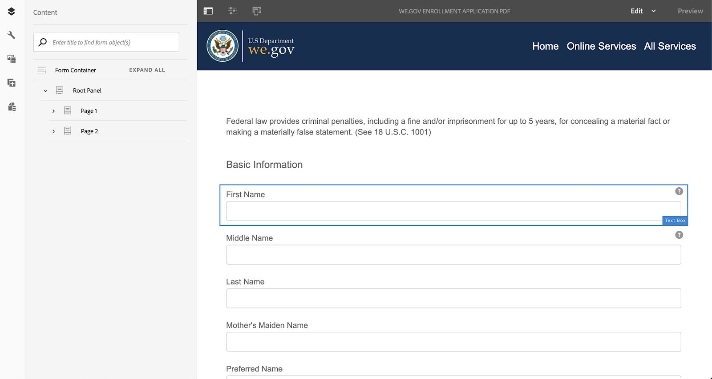

# We.Gov和We.Finance参考站点演练 {#we-gov-reference-site-walkthrough}

## Pre-requisites {#pre-requisites}

按照设置和配置We.Gov和 [We.Finance参考站点中的说明设置参考站点](../../forms/using/forms-install-configure-gov-reference-site.md)。

## 用户案例 {#user-story}

* AEM Forms

   * 自动化表单转换
   * 创作
   * 表单数据模型／数据源

* AEM Forms

   * 数据捕获
   * （可选）数据集成(MS Dynamics)
   * （可选）Adobe Sign

* 工作流
* 电子邮件通知
* （可选）客户通信

   * 打印渠道
   * Web 渠道

* Adobe Analytics
* 数据源集成

### Fictitious users and groups {#fictitious-users-and-groups}

We.Gov演示包随附以下内置虚拟用户：

* **谭雅**:有资格从政府机构获得服务的公民


* **乔治·朗**:We.Gov机构业务分析师


* **卡米拉·桑托斯**:We.Gov代理CX主管


还包括以下组：

* **We.GovForms用户**

   * George Lang（成员）
   * 卡米拉·桑托斯（成员）

* **We.Gov用户**

   * George Lang（成员）
   * 卡米拉·桑托斯（成员）
   * 谭雅（会员）

### 演示概述术语图例 {#demo-overview-terms-legend}

1. **模拟**:AEM演示中定义的用户和用户组。
1. **按钮**:用于导航的彩色矩形或带圆圈箭头。
1. **单击**:在用户案例中执行操作。
1. **链接**:位于We.Gov站点的主菜单顶部。
1. **用户说明**:浏览用户故事时要遵循的一组数字步骤。
1. **Forms门**: *https://&lt;aemserver>:&lt;port>/content/we-gov/formsportal.html*
1. **移动视图**:We.Gov用户使用重新调整大小的浏览器复制移动视图。
1. **桌面视图**:We.gov用户在笔记本电脑或台式机上视图演示。
1. **预屏幕表单**:在We.Gov网站的主页上填写。
1. **自适应表单**:We.gov演示的注册申请表。

   *https://&lt;aemserver>:&lt;port>/content/forms/af/adobe-gov-forms/enrollment-application-for-health-benefits.html*

1. **AdobeWe.Gov网站**: *https://&lt;aemserver>:&lt;port>/content/we-gov/home.html*
1. **Adobe收件箱**:位于AEM后端的顶 [部菜单栏](assets/bell.svg) “铃”图标。

   *https://&lt;aemserver>:&lt;port>/aem/start.html*

1. **电子邮件客户端**:视图电子邮件的首选方式(Gmail、Outlook)
1. **CTA**:行动动员
1. **导航**:在浏览器页面上查找特定引用点。
1. **AFC**:自动化Forms转化

## 自动化Forms转化(Camila) {#automated-forms-conversion}

**本节**:CX潜在客户已有一个基于PDF的表单，该表单用作基于纸张的流程的一部分。 作为现代化努力的一部分，她希望使用此PDF表单自动创建新的现代自适应Forms。

### 自动化Forms转化- We.Gov(Camila) {#automated-forms-conversion-wegov}

1. 导航到 *https://&lt;aemserver>:&lt;port>/aem/start.html*

1. 登录方式：
   * **用户**:卡米拉·桑托斯
   * **密码**:口令
1. 从主页选择Forms>Forms和文档>AEM Forms州政府Forms> AFC。
1. 卡米拉将PDF上载到AEM Forms。

   

1. 然后，Camilla选择PDF表单并单击“ **开始自动转换** ”以开始转换过程。 如果已转换表单， **则可能需** 要单击“覆盖转换”。

   >[!NOTE]
   >
   >请注意，AFC中的设置为最终用户预配置，这意味着不应更改这些设置。

   * **可选**:如果您希望使用“可访问的Ultramarine”主题，只需单击“指定自适应表单主题”，然后选择选项列表中显示的“可访问的Ultramarine”主题。

   

   

   转换过程中将显示完成百分比状态。 状态显示“已转 **换**”后，单击 **输出文件夹** ，选择自适应表单并单击 **“编辑** ”以打开已转换的表单。

1. 然后，Camilla会查看表单并确保所有字段都存在

   

1. 然后，卡米拉开始编辑表单。 她选择“根面板”>“编辑”（扳手）>从“面板布局”下拉菜单中选择“顶部的选项卡”>选中“复选框”。

   

1. 然后，Camilla添加所有必要的CSS和字段改动，以制作最终产品。

   

### 表单数据模型和数据源(Camila) {#data-sources}

**本节**:转换文档并生成自适应表单后，Camila需要将自适应表单连接到数据源。

1. Camila以在“自动Forms转化- We.Gov”中转 [换的表单打开“属性”](#automated-forms-conversion-wegov)。

1. 然后，从选项列表中选择“表单模型”>“从选择位置选择表单数据模型”>“选择We.gov登记FDM”。

1. 单击“保存并关闭”按钮。

   

1. 卡米拉单击 **输出文** 件夹，选择自适应表单， **然后单击“编** 辑”以打开完成的We.Gov表单。
1. Camila选择自适应表单字段并单击“ 。 她使用“绑定引用”(Bind Reference)字段创建与表单数据模型 **实体的** 绑定。 她在自适应表单中对所有字段重复此步骤。

### 表单辅助功能测试(Camila) {#form-accessibility-testing}

Camila还验证创建的内容是否根据公司标准构建正确且完全可访问。

1. 卡米拉单击 **输出文** 件夹，选择自适应表单，并 **单击** 预览，以打开完成的We.Gov表单。

1. 在Chrome Developer Tool中打开“审核”选项卡。

1. 执行辅助功能检查以验证自适应表单。

   

## 自适应表单移动视图演示(Aya) {#mobile-view-demo}

**此部分必须在演示之前执行。**

**用户说明：**

1. 导航到： *https://&lt;aemserver>:&lt;port>/content/we-gov/home.html*
1. 登录方式：

   1. **用户**:aya.tan
   1. **密码**:口令

1. 重新调整浏览器窗口的大小或使用浏览器的模拟器复制移动设备的大小。

### We.Gov网站(Aya) {#aya-user-story-we-gov-website}


**本节**:阿亚是公民。 她从朋友那里得知她可能有资格从政府机构获得服务。 Aya通过手机导航至We.Gov网站，进一步了解她有资格提供的服务。

### We.Gov Pre-Screener(Aya) {#aya-user-story-we-gov-pre-screener}

Aya回答了几个问题，通过在手机上填写一份简短的自适应表格来确认她的资格。

**用户说明：**

1. 在每个下拉字段中进行选择。

   >[!NOTE]
   >
   >如果用户年收入超过200,000美元，则他们没有资格。

1. 单击“我&#x200B;**是否符合条件？**” 按钮.
1. 单击“立&#x200B;**即应用**”按钮以继续。

   

### We.Gov自适应表单(Aya) {#aya-user-story-we-gov-adaptive-form}

Aya发现她符合条件，开始填写她的应用程序，在她的移动设备上请求服务。

Aya需要在家查看一些文档，然后才能完成服务请求申请。 她保存应用程序并从移动设备退出。

**用户说明：**

1. 填写“基本信息”字段，其中包括必填字段和下拉列表：

   1. 基本信息

      1. 名字
      1. 姓氏
      1. DOB
      1. 电子邮件

1. 使用以下动 **态逻辑** ，使用“系列状态”下拉 **菜单演示动** 态功能：

   1. **单一**:显示外观面板的旁边
   1. **已婚**:显示婚姻相关面板
   1. **离婚**:显示外观面板的旁边
   1. **丧偶**:显示外观面板的旁边
   1. **你有孩子吗？**:（是／否）单选按钮以显示子依赖面板。

      1. （添加／删除）按钮，添加／删除多个子依赖面板。

1. 单击灰色菜单栏中的右箭头。
1. 单击底部的“保存”按钮。

   

## 桌面演示 {#desktop-demo}

**本节：** 回到家后，Aya找到了所需的信息，并从桌面恢复应用程序。 Aya导航到在线表单门户以恢复其应用程序。 借助一些简单的自定义功能，机构还可以自动生成一个链接并通过电子邮件发送该链接以恢复应用程序。

### 连续自适应表单(Aya) {#aya-user-story-continued-adaptive-form}

**用户说明：**

1. 导航到 *https://&lt;aemserver>:&lt;port>/content/we-gov/home.html*
1. 在导航栏中，单击“在&#x200B;**线服务**”。
1. 从“Forms草案”面板中，选择现有的“健康福利登记申请”。

   

   外观和感觉是相同的，她无需重新输入任何数据。

   **用户说明：**

1. 单击右侧的“圈子CTA”移至下一节。

   

   表单会填充到Aya最后一个入口的位置。 Aya已输入她的所有信息并准备提交。

   

   >[!NOTE]
   >
   >当Aya填写电话号码字段时，她必须将其作为连续的11位数字，不带虚线、空格或连字符。

   提交Aya后，将收到“感谢”页面。 （可选）她还会收到一封电子邮件，可以打开它，与Adobe Sign以电子方式签署记录文档。

### 可选：Adobe Sign(Aya) {#adobe-sign}

**用户说明：**

1. 导航到您的电子邮件客户端并找到Adobe Sign电子邮件。
1. 单击指向Adobe Sign的链接。

   

**用户说明：**

1. 选中“我&#x200B;**同意**”框。
1. 单击“**接受**”。
1. 滚动到审阅文档的底部。
1. 单击突出显示的黄色选项卡，对文档进行签名。

   

## 政府代理(George) {#government-agent-george}


**本节：** George是政府机构Aya的业务分析师，请求提供服务。 George有一个仪表板，他可以看到分配给他审阅的所有服务请求应用程序。

### AEM收件箱(George) {#george-user-story-aem-inbox}

**用户说明：**

1. 导航到 *https://&lt;aemserver>:&lt;port>/aem/start.html*
1. 单击用户图标（右上角），然后使用“**注销**”或“模拟为&#x200B;****”菜单选项（如果您当前使用管理用户登录）。

   1. 登录方式：

      1. **用户：** george.lang
      1. **密码：** 口令
   1. 或模拟：

      1. 在“模&#x200B;**拟**”字段中键&#x200B;**入“George**”。

      1. 单击“确定”以模拟。


1. 从右上角，单击通知（铃）图标。
1. 单击“**全部视图**”导航到收件箱。
1. 从收件箱中，打开最新的“健&#x200B;**康优势应用程序审**&#x200B;阅”任务。

   

### 可选：AEM Inbox &amp; MS Dynamics(George) {#george-user-story-aem-inbox-and-ms-dynamics}

借助数据集成和自动工作流,Aya的应用程序以及在提交数据时自动生成的CRM记录一起出现。

**用户说明：**

1. 打开并检查只读自适应表单。
1. 单击“Open MS **Dynamics**”按钮，在新窗口中打开MS Dynamics记录。
1. 在CRM中，您可以看到所有信息都可以更新

   1. （可选）在Dynamics中直接添加一些审阅注释。

1. 关闭并返回AEM收件箱。

   

### 返回AEM收件箱(George) {#george-user-story-back-to-aem-inbox}

George批准Aya的应用程序，并且由于现有的自动工作流程，还会向Aya发送确认电子邮件。

**用户说明：**

1. 导航到左上角，单击“批&#x200B;**准**”以批准申请。
1. 在该模式中，您可以留言给CX潜在客户。
1. 单击完成。
1. （市民角色）打开电子邮件客户端，视图发送给Aya的电子邮件。

   

## CX Lead(Camila) {#cx-lead-camila}


**本节：** Camila CX Lead与Aya建立了欢迎电话，以说明如何利用她获得批准的政府服务。

### （可选）AEM Inbox &amp; MS Dynamics {#camila-user-story-aem-inbox-ms-dynamics}

**用户说明：**

1. 导航到 *https://&lt;aemserver>:&lt;port>/aem/start.html*
1. 单击用户图标（右上角），然后使用“**注销**”或“模拟为&#x200B;****”菜单选项（如果您当前使用管理用户登录）。

   1. 登录方式：

      1. **用户**:卡米拉·桑托斯
      1. **密码**:口令
   1. 或模拟：

      1. 在“模&#x200B;**拟**&#x200B;为”字段中&#x200B;**键入“Camila**”。

      1. 单击“确定”以模拟。


1. 从右上角，单击通知（铃）图标。
1. 单击“**全部视图**”导航到收件箱。
1. 从收件箱中，打开最新的“**新联系人批准**”任务。


**（可选）用户说明：**

1. 打开并检查只读自适应表单。
1. 单击“Open MS **Dynamics**”按钮，在新窗口中打开MS Dynamics记录。
1. 在CRM中，您可以看到所有信息都可以更新

   1. （可选）在Dynamics中直接添加新呼叫活动。
   1. 打开“**活动**”部分。
   1. 单击“新&#x200B;**电话呼叫**”选项。
   1. 添加电话呼叫详细信息。
   1. 保存并关闭窗口。

1. 返回AEM，导航到左上角，单击“**提交**”以提交应用程序。
1. 在该模式中，您可以留言。
1. 单击完成。

   

## （可选）欢迎工具包公民(Aya) {#welcome-kit-citizen-aya}

**本节：** Aya收到一封电子邮件，其中包含指向交互式通信的链接，该链接概括了Aya的优点，还包括要填写的表单字段。 附加PDF优势声明并链接到邮件中的交互式通信信件（与交互式通信具有相同的主题／品牌）。

### 电子邮件客户端通知(Aya) {#aya-user-story-email-client}

**用户说明：**

1. 找到并打开欢迎工具包电子邮件。
1. 滚动到页面底部的PDF附件。
1. 单击以打开PDF附件。
1. 在电子邮件客户端中向上滚动，然后单击“**在线视图欢迎工具**&#x200B;包”。

   1. 这将打开同一渠道的Web文档版本。

1. 要直接快速参考PDF:

   *https://&lt;aemserver>:&lt;port>/aem/formdetails.html/content/dam/formsanddocuments/adobe-gov-forms/welcome-handbook/we-gov-welcome-handbook*

1. 要直接快速参考IC:

   *https://&lt;aemserver>:&lt;port>/content/dam/formsanddocuments/adobe-gov-forms/welcome-handbook/we-gov-welcome-handbook/jcr:content?渠道=web&amp;mode=disabled*

    

## 续订提醒市民(Aya) {#renewal-reminder-citizen-aya}

**本节：** 卡米拉还计划了一年后的一次沟通提醒。 （自动／执行和通过电子邮件发送的工作流步骤）。

### 电子邮件客户端通知(Aya) {#aya-user-story-email-client-updated}

**用户说明：**

1. 导航到您的电子邮件客户端。
1. 找到并打开续订提醒电子邮件。
1. 单击“提交&#x200B;**新应用程序**”按钮以打开自适应表单。

   1. 此部分有意留空以支持第2阶段的数据预填。

   

## （可选）表单数据模型(Camila) {#form-data-model}

**本节**:卡米拉导航到AEM Forms数据集成，在那里她可以运行快速测试，看是否确实存在通过表单数据模型集成发送到外部数据源的信息。

### 表单数据模型(Camila) {#form-data-model-camila}

**本节**:Camila导航到“数据源”页以验证服务器在Derby数据库中复制的数据。

1. 用户体验完成且用户提交完成后，Camila将导航到AEM Forms的“数据源”选项卡(“**Forms** ”>“ **数据集成**”)

1. 然后，Camila选 **择AEM FormsWe.gov** FDM，然 **后编辑We.gov Engroment FDM**。

1. 然后，Camila选择“ **联系** ”>“ **读取服务** ”进行测试。

   

1. 然后，Camila为测试服务提供联系人id，然后单击“测试”按钮。 例如，1或2，如果您提交了表单。 如果您尚未提交表单，则不返回任何数据。

   

1. 然后，Camila可以验证数据是否已成功插入数据源。

   * Derby DS中的数据类似于以下格式：

   ```xml
      [
         {
         "ADDRESS_COUNTRY": "USA",
         "LAST_NAME": "Tan",
         "ADDRESS_CITY": "New York",
         "FIRST_NAME": "Aya",
         "ADDRESS_STATE": "AL",
         "ADDRESS_LINE1": "123 Street crescent",
         "GENDER_CODE": "2",
         "ADDRESS_LINE2": "123 Street crescent",
         "ADDRESS_POSTAL_CODE": "90210",
         "BIRTH_DATE": "1991-12-12",
         "CONTACT_ID": 1,
         "MIDDLE_NAME": "M",
         "HAS_CHILDREN_CODE": "0"
         }
   ]
   ```

## （可选）分析(Camila) {#analytics-cx-lead-camila}

**本节：** 卡米拉导航到一个仪表板，在该中，她可以看到机构KPI的各个方面，如开始填写服务请求表并放弃的公民百分比、从请求提交到批准／拒绝响应的平均时间以及她发送给公民的福利手册的参与统计。

### Adobe Analytics站点报告（卡米拉） {#camila-reviews-sites-reporting-we-gov-adobe-analytics}

1. 导航到 *https://&lt;aemserver>:&lt;port>/sites.html/content*
1. 选择“**AEM FormsWe.Gov网站**”以视图网页。
1. 选择其中一个网站页面（例如“主页”），然后选择“**Analytics &amp; Recommendations**”。

   

1. 在此页上，您将看到从Adobe Analytics获取的与AEM Sites页面相关的信息(注：设计时，此信息将定期从Adobe Analytics更新，不会实时显示)。

   

1. 返回页面视图页面（在步骤3中访问），您还可以通过将显示设置更改为“列表视图”中的视图项来视图页面&#x200B;**视图信息**。
1. 找到“**视图**”下拉菜单并选择“**列表视图**”。

   

1. 从同一菜单中，选择“**视图设置**”，并从“分析”部分选择要显&#x200B;**示的列**。

   

1. 单击“**更新**”以使新列可用。

   

### Adobe AnalyticsForms报告（卡米拉） {#camila-reviews-forms-reporting-we-gov-adobe-analytics}

1. 导航至

   *https://&lt;aemserver>:&lt;port>/aem/forms.html/content/dam/formsanddocuments/adobe-gov-forms*

1. 选择“健康&#x200B;**优势的注册申请**”自适应表单并选择“**分析报告**”选项。

   

1. 等待页面加载，并视图Analytics报告数据。

   

