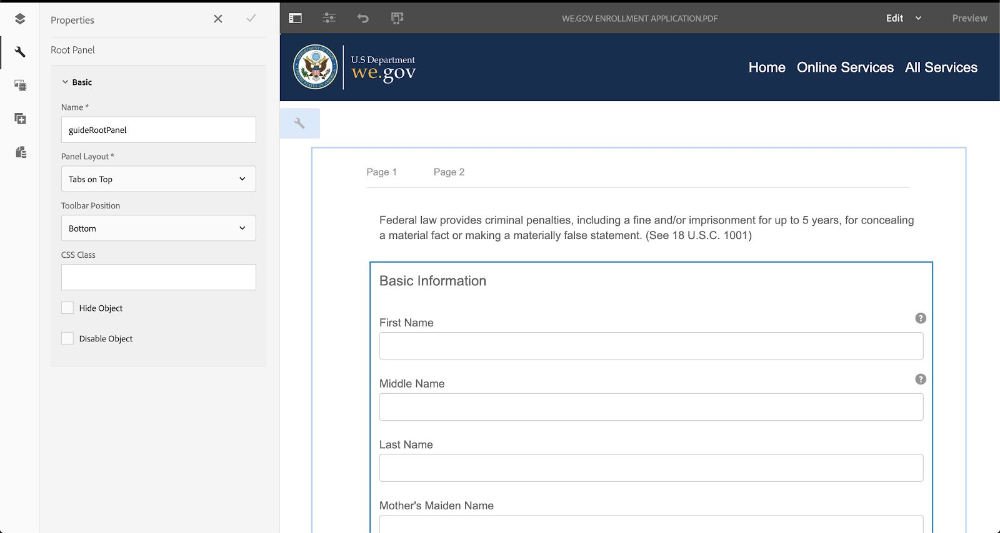

# We.Gov和We.Finance引用站点演练 {#we-gov-reference-site-walkthrough}

## 先决条件 {#pre-requisites}

按照中的说明设置引用站点 [设置和配置We.Gov和We.Finance引用站点](../../forms/using/forms-install-configure-gov-reference-site.md).

## 用户故事 {#user-story}

* AEM Forms

   * 自动化表单转换
   * 创作
   * 表单数据模型/数据源

* AEM Forms

   * 数据捕获
   * （可选）数据集成(MS Dynamics)
   * （可选）Adobe Sign

* 工作流
* 电子邮件通知
* （可选）客户通信

   * 打印渠道
   * Web 渠道

* Adobe Analytics
* 数据源集成

### 虚拟用户和组 {#fictitious-users-and-groups}

We.Gov演示包附带以下内置虚拟用户：

* **谭雅**：有资格从政府机构获得服务的公民


* **乔治·朗**： We.Gov代理业务分析师


* **卡米拉·桑托斯**： We.Gov Agency CX主管


还包括以下组：

* **We.Gov Forms用户**

   * George Lang（会员）
   * Camila Santos（成员）

* **We.Gov用户**

   * George Lang（会员）
   * Camila Santos（成员）
   * Aya Tan（会员）

### 演示概述术语图例 {#demo-overview-terms-legend}

1. **模拟**：AEM演示中定义的用户和组。
1. **按钮**：用于导航的彩色矩形或圆圈箭头。
1. **单击**：在用户故事中执行操作。
1. **链接**：位于We.Gov网站主菜单顶部。
1. **用户说明**：浏览用户故事时要遵循的一组数字步骤。
1. **Forms门户**： *https://&lt;aemserver>：&lt;port>/content/we-gov/formsportal.html*
1. **移动设备视图**：We.Gov用户使用重新调整的浏览器复制移动视图。
1. **桌面视图**：We.gov用户，用于在笔记本电脑或台式机上查看演示。
1. **预屏表单**：We.Gov网站主页上的表单。
1. **自适应表单**：We.gov演示的注册申请表。

   *https://&lt;aemserver>：&lt;port>/content/forms/af/adobe-gov-forms/enrollment-application-for-health-benefits.html*

1. **AdobeWe.Gov站点**： *https://&lt;aemserver>：&lt;port>/content/we-gov/home.html*
1. **Adobe收件箱**：位于顶部菜单栏 [铃铛图标](assets/bell.svg) 在AEM后端中。

   *https://&lt;aemserver>：&lt;port>/aem/start.html*

1. **电子邮件客户端**：查看电子邮件的首选方式(Gmail、Outlook)
1. **CTA**：行动号召
1. **导航**：在浏览器页面上查找特定参考点。
1. **AFC**：Automated forms conversion

## automated forms conversion（卡米拉） {#automated-forms-conversion}

**本节**： Camila CX销售线索有一个基于PDF的现有表单，该表单用作基于纸张的流程的一部分。 作为现代化工作的一部分，她希望使用此PDF表单自动创建新的现代化自适应Forms。

### automated forms conversion- We.Gov （卡米拉） {#automated-forms-conversion-wegov}

1. 导航到 *https://&lt;aemserver>：&lt;port>/aem/start.html*

1. 登录方式：
   * **用户**：camila.santos
   * **密码**：密码
1. 从主页中，选择Forms > Forms &amp; Documents > AEM Forms We.gov Forms > AFC。
1. Camila将PDF上传到AEM Forms。

   

1. 然后，Camilla选择PDF表单并单击 **启动自动转换** 以开始转换过程。 您可能需要单击 **覆盖转换** 如果您已转换表单。

   >[!NOTE]
   >
   >请注意，AFC中的设置是为最终用户预先配置的，这意味着这些设置不应更改。

   * **可选**：如果您希望使用无障碍的Ultramine主题，只需单击指定自适应表单主题，然后选择选项列表中显示的Accessible-Ultramine主题。

   

   

   转化期间会显示完成百分比状态。 状态显示后 **已转换**，单击 **输出** 文件夹，选择自适应表单并单击 **编辑** 以打开转换后的表单。

1. 然后，Camilla查看表单并确保所有字段都存在

   

1. 然后，Camilla开始编辑表单。 她选择“根面板”>“编辑（扳手）”>“从面板布局下拉菜单中选择顶部选项卡”>“选中复选框”。

   

1. 然后，Camilla添加所有必需的CSS和字段更改以生成最终产品。

   

### 表单数据模型和数据源(Camila) {#data-sources}

**本节**：在文档已转换并生成自适应表单后，Camila需要将自适应表单连接到数据源。

1. Camila在转换为的表单上打开属性 [automated forms conversion- We.Gov](#automated-forms-conversion-wegov).

1. 然后，Camila从以下选项列表中选择“表单模型”>“从下拉列表中选择表单数据模型”>“从选项列表中选择We.gov注册FDM”。

1. 单击保存并关闭按钮。

   

1. Camila单击 **输出** 文件夹，选择自适应表单并单击 **编辑** 以打开已完成的We.Gov表单。
1. Camila选择自适应表单字段并单击 . 她使用创建与表单数据模型实体的绑定 **绑定引用** 字段。 她对自适应表单中的所有字段重复此步骤。

### 表单无障碍测试(Camila) {#form-accessibility-testing}

Camila还会验证已创建的内容是否已根据公司标准正确构建并可完全访问。

1. Camila单击 **输出** 文件夹，选择自适应表单并单击 **预览** 以打开已完成的We.Gov表单。

1. 在Chrome开发人员工具中打开“审核”选项卡。

1. 执行辅助功能检查以验证自适应表单。

   

## 自适应表单移动视图演示(Aya) {#mobile-view-demo}

**必须在演示之前执行此部分。**

**用户说明：**

1. 导航到： *https://&lt;aemserver>：&lt;port>/content/we-gov/home.html*
1. 登录方式：

   1. **用户**： aya.tan
   1. **密码**：密码

1. 重新调整浏览器窗口的大小或使用浏览器的模拟器复制移动设备大小。

### We.Gov网站(Aya) {#aya-user-story-we-gov-website}


**本节**：Aya是公民。 她从一位朋友那里听说，她可能有资格获得政府机构提供的服务。 Aya通过手机导航到We.Gov网站，进一步了解她有资格使用的服务。

### We.Gov预屏程序(Aya) {#aya-user-story-we-gov-pre-screener}

Aya回答了一些问题，通过在手机上填写一个简短的自适应表单来确认她的资格。

**用户说明：**

1. 在每个下拉字段中选择。

   >[!NOTE]
   >
   >如果用户每年的收入超过200,000美元，则不符合条件。

1. 单击“**我有资格吗？**&quot; 按钮.
1. 单击“**立即申请**”按钮以继续。

   

### We.Gov自适应表单(Aya) {#aya-user-story-we-gov-adaptive-form}

Aya发现她符合条件，并开始填写她的申请表以请求在她的移动设备上提供服务。

Aya需要先在家中查看一些文档，然后才能完成服务请求申请。 她保存并从移动设备中退出应用程序。

**用户说明：**

1. 填写“基本信息”字段，以下是必填字段和下拉列表：

   1. 基本信息

      1. 名字
      1. 姓氏
      1. 出生日期
      1. 电子邮件

1. 使用以下内容 **动态逻辑** 使用演示动态功能 **家庭状态** 下拉列表：

   1. **单身**：显示亲属面板的旁边
   1. **已婚**：显示婚姻从属面板
   1. **离婚**：显示亲属面板的旁边
   1. **丧偶**：显示亲属面板的旁边
   1. **你有孩子吗？**：（是/否）单选按钮，用于显示子项从属面板。

      1. （添加/删除）按钮，用于添加/删除多个子项从属面板。

1. 单击灰色菜单栏中的向右箭头。
1. 单击底部的“保存”按钮。

   

## 桌面演示 {#desktop-demo}

**本节：** 回到家后，Aya找到了所需的信息，并从桌面上恢复应用程序。 Aya导航到在线表单门户以继续执行其应用程序。 通过一些简单的自定义设置，代理机构还可以自动生成链接并通过电子邮件发送以恢复应用程序。

### 连续自适应表单(Aya) {#aya-user-story-continued-adaptive-form}

**用户说明：**

1. 导航到 *https://&lt;aemserver>：&lt;port>/content/we-gov/home.html*
1. 从导航栏中，选择单击“**联机服务**“。
1. 从“草稿Forms”面板中，选择现有的“健康福利注册申请”。

   

   外观和感觉是相同的，她不需要重新输入任何数据。

   **用户说明：**

1. 单击右侧“圆形CTA”可移动到下一截面。

   

   表单将填充到Aya的最后一个条目点。 Aya已输入她的所有信息并准备提交。

   

   >[!NOTE]
   >
   >当Aya填写“电话号码”字段时，她必须将其填写为不带破折号、空格或连字符的连续11位数。

   提交Aya后，会收到“感谢”页面。 （可选）她还将会收到一封电子邮件，她可以打开该邮件以使用Adobe Sign电子方式签署记录文档。

### 可选：Adobe Sign (Aya) {#adobe-sign}

**用户说明：**

1. 导航到您的电子邮件客户端并找到Adobe Sign电子邮件。
1. 单击链接到Adobe Sign。

   

**用户说明：**

1. 检查&quot;**我同意**”框。
1. 单击“”**接受**“。
1. 滚动到已审阅文档的底部。
1. 单击高亮显示的黄色选项卡以对文档进行签名。

    

## 政府代理(George) {#government-agent-george}


**本节：** George是政府机构Aya的商业分析师，正在向其请求服务。 George有一个仪表板，他可以在其中查看已分配给他进行审阅的所有服务请求应用程序。

### AEM收件箱(George) {#george-user-story-aem-inbox}

**用户说明：**

1. 导航到 *https://&lt;aemserver>：&lt;port>/aem/start.html*
1. 单击用户图标（右上角）并使用&quot;**注销**“或”**模拟为**”菜单选项（如果您当前以管理用户登录）。

   1. 登录方式：

      1. **用户：** george.lang
      1. **密码：** 密码
   1. 或模拟：

      1. 类型&#39;&#39;**George**“（在“”中）**模拟为**”字段。

      1. 单击“确定”进行模拟。


1. 从右上角，单击通知（铃铛）图标。
1. 单击“”**查看全部**”以导航到收件箱。
1. 在收件箱中，打开最新的»**健康益处申请审核**”任务。

   

### 可选：AEM收件箱和MS Dynamics (George) {#george-user-story-aem-inbox-and-ms-dynamics}

借助数据集成和自动化工作流，Aya的应用程序将与在提交数据时自动生成的CRM记录一起显示。

**用户说明：**

1. 打开并检查只读自适应表单。
1. 单击“**打开MS Dynamics**”按钮，在新窗口中打开MS Dynamics记录。
1. 在CRM中，您可以看到所有信息都可以更新

   1. （可选）直接在Dynamics中添加一些审阅注释。

1. 关闭并返回AEM收件箱。

   

### 返回AEM收件箱(George) {#george-user-story-back-to-aem-inbox}

George批准了Aya的申请，并且借助现有的自动化工作流，还向Aya发送确认电子邮件。

**用户说明：**

1. 导航到左上角并单击“**批准**”以批准申请。
1. 在该模式窗口中，您可以为CX销售线索留下一条消息。
1. 单击完成。
1. （公民角色）打开电子邮件客户端以查看发送到Aya的电子邮件。

   

## CX销售线索(Camila) {#cx-lead-camila}


**本节：** Camila CX Lead与Aya建立了欢迎电话，解释如何使用她已获批准的政府服务。

### （可选） AEM收件箱和MS Dynamics {#camila-user-story-aem-inbox-ms-dynamics}

**用户说明：**

1. 导航到 *https://&lt;aemserver>：&lt;port>/aem/start.html*
1. 单击用户图标（右上角）并使用&quot;**注销**“或”**模拟为**”菜单选项（如果您当前以管理用户登录）。

   1. 登录方式：

      1. **用户**：camila.santos
      1. **密码**：密码
   1. 或模拟：

      1. 类型&#39;&#39;**卡米拉**“（在“”中）**模拟为**”字段。

      1. 单击“确定”进行模拟。


1. 从右上角，单击通知（铃铛）图标。
1. 单击“”**查看全部**”以导航到收件箱。
1. 在收件箱中，打开最新的»**新建联系人审批**”任务。


**（可选）用户说明：**

1. 打开并检查只读自适应表单。
1. 单击“**打开MS Dynamics**”按钮，在新窗口中打开MS Dynamics记录。
1. 在CRM中，您可以看到所有信息都可以更新

   1. （可选）直接在Dynamics中添加新的调用活动。
   1. 打开“**活动**”部分。
   1. 单击“**新电话**”选项。
   1. 添加电话呼叫详细信息。
   1. 保存并关闭窗口。

1. 返回AEM，导航到左上角并单击&#39;&#39;**提交**”以提交申请。
1. 在该模式窗口中，您可以留言。
1. 单击完成。

    

## （可选）欢迎套件公民(Aya) {#welcome-kit-citizen-aya}

**本节：** Aya收到一封电子邮件，其中包含指向交互式通信的链接，该链接概述了她的好处，并包括要填写的表单字段。 附带PDF权益声明和邮件中的交互式通信信件链接（主题/品牌与交互式通信相同）。

### 电子邮件客户端通知(Aya) {#aya-user-story-email-client}

**用户说明：**

1. 找到并打开欢迎套件电子邮件。
1. 滚动到页面底部的PDF附件。
1. 单击以打开PDF附件。
1. 在电子邮件客户端中向上滚动，然后单击“**在线查看欢迎套件**“。

   1. 这将打开同一文档的Web渠道版本。

1. 有关直接PDF的快速参考，请执行以下操作：

   *https://&lt;aemserver>：&lt;port>/aem/formdetails.html/content/dam/formsanddocuments/adobe-gov-forms/welcome-handbook/we-gov-welcome-handbook*

1. 要直接快速参考集成电路，请执行以下操作：

   *https://&lt;aemserver>：&lt;port>/content/dam/formsanddocuments/adobe-gov-forms/welcome-handbook/we-gov-welcome-handbook/jcr：content？channel=web&amp;mode=preview&amp;wcmmode=disabled*

    

## 续订提醒公民(Aya) {#renewal-reminder-citizen-aya}

**本节：** Camila还安排了一年后的沟通提醒。 （工作流步骤，可自动化/执行并发送电子邮件）。

### 电子邮件客户端通知(Aya) {#aya-user-story-email-client-updated}

**用户说明：**

1. 导航到您的电子邮件客户端。
1. 找到并打开续订提醒电子邮件。
1. 单击“**提交新申请**”按钮以打开自适应表单。

   1. 此部分故意留空以支持阶段2中的数据预填充。

   

## （可选）表单数据模型(Camila) {#form-data-model}

**本节**： Camila导航到AEM Forms数据集成，她可以在其中运行快速测试，以查看通过Form Data Model集成发送到外部数据源的信息是否确实存在。

### 表单数据模型(Camila) {#form-data-model-camila}

**本节**：Camila将导航到“数据源”页，以验证服务器在Derby数据库中复制的数据。

1. 用户体验完成且用户提交完成后，Camila将导航到AEM Forms中的“数据源”选项卡(**Forms** > **数据集成**)

1. 然后Camila选择AEM Forms **We.gov FDM** 然后编辑 **We.gov注册FDM**.

1. 然后Camila选择 **联系人** > **读取服务** 将进行测试。

   

1. 然后，Camila提供具有联系人ID的测试服务，然后单击“测试”按钮。 例如，1或2（如果您已提交表单）。 如果您尚未提交表单，则不会返回任何数据。

   

1. 然后，Camila可以验证数据是否已成功插入数据源。

   * Derby DS中的数据类似于以下格式：

   ```xml
      [
         {
         "ADDRESS_COUNTRY": "USA",
         "LAST_NAME": "Tan",
         "ADDRESS_CITY": "New York",
         "FIRST_NAME": "Aya",
         "ADDRESS_STATE": "AL",
         "ADDRESS_LINE1": "123 Street crescent",
         "GENDER_CODE": "2",
         "ADDRESS_LINE2": "123 Street crescent",
         "ADDRESS_POSTAL_CODE": "90210",
         "BIRTH_DATE": "1991-12-12",
         "CONTACT_ID": 1,
         "MIDDLE_NAME": "M",
         "HAS_CHILDREN_CODE": "0"
         }
   ]
   ```

## （可选）Analytics (Camila) {#analytics-cx-lead-camila}

**本节：** Camila导航到一个仪表板，她可以看到整个机构的KPI，例如开始填写服务请求表单并放弃的公民百分比，从请求提交到批准/拒绝响应的平均时间长度，以及她发送给公民的福利手册的参与统计数据。

### Adobe Analytics Sites报表(Camila) {#camila-reviews-sites-reporting-we-gov-adobe-analytics}

1. 导航到 *https://&lt;aemserver>：&lt;port>/sites.html/content*
1. 选择&quot;**AEM Forms We.Gov网站**”以查看网站页面。
1. 选择一个站点页面（例如“主页”），然后选择“**Analytics和Recommendations**“。

   

1. 在此页面上，您将看到从Adobe Analytics获取的与AEM Sites页面相关的信息(注意：通过设计，这些信息会定期从Adobe Analytics刷新，并且不会实时显示)。

   

1. 返回页面查看页面（在步骤3中访问），您还可以通过更改显示设置来查看“**列表视图**“。
1. 找到&quot;**视图**”下拉菜单并选择“**列表视图**“。

   

1. 从同一菜单中，选择“**视图设置**”并从“ ”中选择要显示的列&#x200B;**分析**”部分。

   

1. 单击“”**更新**”以使新列可用。

   

### Adobe Analytics Forms Reporting (Camila) {#camila-reviews-forms-reporting-we-gov-adobe-analytics}

1. 导航至

   *https://&lt;aemserver>：&lt;port>/aem/forms.html/content/dam/formsanddocuments/adobe-gov-forms*

1. 选择&quot;**健康福利登记申请**&quot;自适应表单并选择&quot;**Analytics报表**”选项。

   

1. 等待页面加载并查看Analytics报表数据。

   
