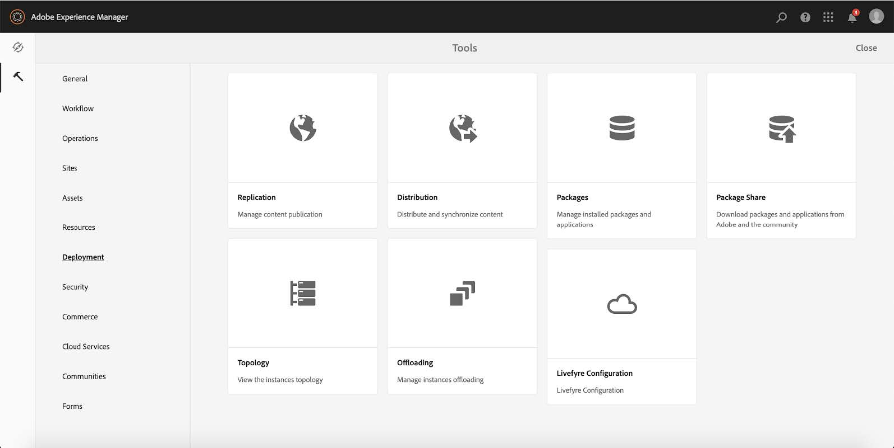

# 设置和配置We.Gov参考站点{#set-up-and-configure-we-gov-reference-site}

## 演示包详细信息 {#demo-package-details}

### 安装先决条件 {#installation-prerequisites}

此包是为 **AEM Forms 6.4 OSGI作者创建的**，已经过测试，因此在以下平台版本上受支持：

| AEM版本 | AEM FORMS包版本 | 状态 |
|---|---|---|
| 6.4 | 5.0.86 | **支持** |
| 6.5 | 6.0.80 | **支持** |

此包中包含支持以下平台版本的云配置：

| 云提供商 | 服务版本 | 状态 |
|---|---|---|
| Adobe Sign | v5 API | **支持** |
| Microsoft Dynamics 365 | 1710 (9.1.0.3020) | **支持** |

**包安装注意事项：**

* 该包应安装在干净的服务器上，无需安装其他演示包或旧的演示包版本
* 该包应安装在OSGI服务器上，该服务器在创作模式下运行

### 此包包含什么 {#what-does-this-package-include}

AEM Forms We.Gov演示包(**we-gov-forms.pkg.all-&lt;version>.zip**)是一个包，其中包含若干其他子包和服务。 该包包含以下模块：

* **we-gov-forms.pkg.all-&lt;version>.zip** —— 完整 *的演示包*

   * **we-gov-forms.ui.apps-&lt;version>.zip** *-包含所有组件、客户端库、示例用户、工作流模型等。*

      * **we-gov-forms.core-&lt;version>.jar** —— 包 *含所有OSGI服务、自定义工作流步骤实现等。*

      * **core.wcm.components.all-2.0.4.zip** —— 示 *例WCM组件集合*

      * **grid-aem.ui.apps-1.0-SNAPSHOT.zip** - *AEM Sites Grid布局包的站点页面列控件*
   * **we-gov-forms.ui.content-&lt;version>.zip** —— 包 *含所有内容、页面、图像、表单、交互式通信资源等。*

   * **we-gov-forms.config.public-&lt;version>.zip***—— 包含所有默认配置节点，包括占位符云配置，以帮助避免表单数据模型和服务绑定问题。*

此包中包含的资产包括：

* 包含可编辑模板的AEM站点页面
* AEM Forms自适应表单
* AEM Forms Interactive Communications(印刷和Web渠道)
* AEM Forms XDP记录文档
* AEM Forms MS Dynamics Forms数据模型
* Adobe Sign集成
* AEM Workflow模型
* AEM Assets示例图像

## 配置选项 {#configuration-options}

本节包括有关配置选项的详细信息。 此时，此部分有意为空。

## 演示包安装 {#demo-package-installation}

本节包含有关安装演示包的信息。

### 从包共享 {#from-package-share}

1. 导航 *到https://&lt;aemserver>:&lt;port>/crx/packageshare/*

   或在AEM中，单击部署，然后导航到包共享图标。

   

1. 使用您的Adobe ID登录。
1. 搜索并找 **到we-gov-forms.pkg.all-&lt;version>包** 。
1. 选择“下载”选项并接受条款与条件。
1. 下载后，选择“已下载”选项，以在包管理器中查找包。
1. 选择“安装”选项以安装该包。

   

1. 允许安装过程完成。
1. 导航到 *https://&lt;aemserver>:&lt;port>/content/we-gov/home.html?wcmmode=disabled* ，以确保安装成功。

### 从本地ZIP文件 {#from-a-local-zip-file}

1. 下载并 **找到we-gov-forms.pkg.all-&lt;version>.zip文件** 。
1. 导航到 *https://&lt;aemserver>:&lt;port>/crx/packmgr/index.jsp*。
1. 选择“上传包”选项。

   

1. 使用文件浏览器导航到下载的ZIP文件并选择该文件。
1. 单击“打开”以上传。
1. 上传后，选择“安装”选项以安装包。

   

1. 允许安装过程完成。
1. 导航到 *https://&lt;aemserver>:&lt;port>/content/we-gov/home.html?wcmmode=disabled* ，以确保安装成功。

### 安装新的包版本 {#installing-new-package-versions}

要安装新的包版本，请按照4.1和4.2中定义的步骤操作。在已安装另一个旧包的情况下安装较新的包版本是可能的，但建议先卸载旧包版本。 为此，请按照以下步骤操作。

1. 导航到 *https://&lt;aemserver>:&lt;port>/crx/packmgr/index.jsp*
1. 找到旧 **的we-gov-forms.pkg.all-&lt;version>.zip文件** 。
1. 选择“更多”选项。
1. 从下拉列表中，选择“卸载”选项。

   

1. 确认后，再次选择“卸载”，并允许卸载过程完成。

## 演示包配置 {#demo-package-configuration}

本节包含演示前演示包的部署后配置的详细信息和说明。

### 虚构用户配置 {#fictional-user-configuration}

1. 导航到 *https://&lt;aemserver>:&lt;port>/libs/granite/security/content/groupadmin.html*
1. 搜索“工&#x200B;**作流**”。
1. 选择“**workflow-users**”组，然后单击“属性”。
1. 导航到“成员”选项卡。
1. 在“选 **择用户** 或用户组”字段中键入wegov。
1. 从“**We.Gov表单用户”下拉菜单中选择**。

   

1. 单击菜单栏中的“保存并关闭”。
1. 重复步骤2-7，方法是搜索“**analytics**”，选择“**Analytics Administrators**”组，并将“**We.Gov Form Users**”组添加为成员。
1. 重复步骤2-7，方法是搜索“**forms users**”，选择“**forms-power-users**”组，并添加“**We.Gov Form Users**”组作为成员。
1. 重复步骤2-7，方法是搜索“**forms users**”，选择“**forms-users**”组，这次将“**We.Gov Users**”组添加为成员。

### 电子邮件服务器配置 {#email-server-configuration}

1. 查看设置文档配 [置电子邮件通知](/help/sites-administering/notification.md)

1. 导航 *到https://&lt;aemserver>:&lt;port>/system/console/configMgr*
1. 找到并单击要 **配置的Day CQ邮件服务** 。

   

1. 配置服务以连接到您选择的SMTP服务器：

   1. **SMTP服务器主机名**:例如(smtp.gmail.com)
   1. **服务器端口**:例如(465)，用于使用SSL的Gmail
   1. **SMTP用户：** demo@ &lt;companyname>
   1. **“发件人”地址**:aemformsdemo@adobe.com
   

1. 单击“保存”以保存配置。

### AEM SSL配置 {#aemsslconfig}

本节包含有关在AEM实例上配置SSL以便能够配置Adobe Sign云配置的详细信息。

**引用:**

1. [默认情况下为SSL](/help/sites-administering/ssl-by-default.md)

**注释:**

1. 导航到https://&lt;aemserver>:&lt;port>/aem/inbox，您将能够在此完成上述参考文档链接中所述的过程。
1. **we-gov-forms.pkg.all-&lt;version>.zip** 包中包括示例SSL密钥和证书，可通过解压作为包一部分的 **we-gov-forms.pkg.all-&lt;version>.zip/ssl** 文件夹来访问该证书。

1. SSL证书和密钥详细信息：

   1. 发布到“CN=localhost”
   1. 10年有效期
   1. 密码值为“password”

### Adobe Sign cloud configuration {#adobe-sign-cloud-configuration}

本节包含有关Adobe Sign云配置的详细信息和说明。

**引用:**

1. [将Adobe Sign与AEM Forms集成](adobe-sign-integration-adaptive-forms.md)

#### Cloud configuration {#cloud-configuration}

1. **查看先决条件。 请参[阅AEM SSL配置](../../forms/using/forms-install-configure-gov-reference-site.md#aemsslconfig)，以获得所需的SSL配置。**
1. 导航至:

   *https://&lt;aemserver>:&lt;port>/libs/adobesign/cloudservices/adobesign.html/conf/we-gov*

   >[!NOTE]
   >
   >用于访问AEM服务器的URL应与在Adobe Sign OAuth重定向URI中配置的URL匹配，以避免出现配置问题(例如 *https://&lt;aemserver>:&lt;port>/mnt/overlay/adobesign/cloudservices/adobesign/properties.html*)

1. 选择“We.gov Adobe Sign”配置。
1. 单击“属性”。
1. 导航到“设置”选项卡。
1. 输入身份验证URL，例如： [https://secure.na1.echosign.com/public/oauth](https://secure.na1.echosign.com/public/oauth)
1. 从已配置的Adobe Sign实例中提供已配置的客户端ID和客户端机密。
1. 单击“连接到Adobe Sign”。
1. 成功连接后，单击“保存并关闭”以完成集成。

### MS Dynamics云配置 {#ms-dynamics-cloud-configuration}

本节包含有关MS Dynamics云配置的详细信息和说明。

**引用:**

1. [Microsoft Dynamics OData配置](https://docs.adobe.com/content/help/en/experience-manager-64/forms/form-data-model/ms-dynamics-odata-configuration.html)
1. [为AEM Forms配置Microsoft Dynamics](https://helpx.adobe.com/experience-manager/kt/forms/using/config-dynamics-for-aem-forms.html)

#### MS Dynamics OData云服务 {#ms-dynamics-odata-cloud-service}

1. 导航至:

   https://&lt;aemserver>:&lt;port>/libs/fd/fdm/gui/components/admin/fdmcloudservice/fdm.html/conf/we-gov

   1. 确保您使用与MS Dynamics应用程序注册中配置的相同重定向URL访问服务器。

1. 选择“Microsoft Dynamics OData云服务”配置。
1. 单击“属性”。

   

1. 导航到“身份验证设置”选项卡。
1. 输入以下详细信息：

   1. **服务根：** 例如https://msdynamicsserver.api.crm3.dynamics.com/api/data/v9.1/
   1. **身份验证类型：** OAuth 2.0
   1. **身份验证设置** (要收 [集此信息，请参阅MS Dynamics云配置设置](../../forms/using/forms-install-configure-gov-reference-site.md#dynamicsconfig) ):

      1. 客户端ID —— 也称为应用程序 ID
      1. 客户端密钥
      1. OAuth URL —— 例如 [https://login.windows.net/common/oauth2/authorize](https://login.windows.net/common/oauth2/authorize)
      1. 刷新令牌URL —— 例如 [https://login.windows.net/common/oauth2/token](https://login.windows.net/common/oauth2/token)
      1. 访问令牌URL —— 例如 [https://login.windows.net/common/oauth2/token](https://login.windows.net/common/oauth2/token)
      1. 授权范围- **openid**
      1. 身份验证头——授 **权承载**
      1. 资源——例如 [https://msdynamicsserver.api.crm3.dynamics.com](https://msdynamicsserver.api.crm3.dynamics.com)
   1. 单击“连接到OAuth”。

1. 成功验证后，单击“保存并关闭”以完成集成。

#### MS Dynamics云配置设置 {#dynamicsconfig}

本节中详细介绍的步骤旨在帮助您从MS Dynamics Cloud实例中查找客户端ID、客户端机密和详细信息。

1. 导航到 [https://portal.azure.com/](https://portal.azure.com/) and login。
1. 从左侧菜单中选择“所有服务”。
1. 搜索或导航到“应用程序注册”。
1. 创建或选择现有的应用程序注册。
1. 复制 **应用程序 ID** ，以在AEM云配置中 **用作OAuth客户端Id**
1. 单击“设置”或“清单”以配置回 **复URL。**

   1. 此URL必须与配置OData服务时用于访问AEM服务器的URL匹配。

1. 在设置视图中，单击“密钥”以视图创建新密钥（在AEM中，此密钥用作客户端机密）。

   1. 确保保留密钥的副本，因为您以后无法在Azure或AEM中视图它。

1. 要找到资源URL/服务根URL，请导航到MS Dynamics实例仪表板。
1. 在顶部导航栏中，单击“销售”或您自己的实例类型和“选择设置”。
1. 单击右下角附近的“自定义”和“开发人员资源”。
1. 您将在此找到服务根URL:e.g

   *[https://msdynamicsserver.api.crm3.dynamics.com/api/data/v9.1/](https://msdynamicsserver.api.crm3.dynamics.com/api/data/v9.1/)*

1. 有关刷新和访问令牌URL的详细信息，请访问：

   *[https://docs.microsoft.com/en-us/rest/api/datacatalog/authenticate-a-client-app](https://docs.microsoft.com/en-us/rest/api/datacatalog/authenticate-a-client-app)*

#### 测试表单数据模型 {#testing-the-form-data-model}

云配置完成后，您可能希望测试表单数据模型。

1. 导航至

   *https://&lt;aemserver>:&lt;port>/aem/forms.html/content/dam/formsanddocuments-fdm/we-gov*

1. 选择“We.gov Microsoft Dynamics CRM FDM”，然后选择“属性”。

   

1. 导航到“更新源”选项卡。
1. 确保“上下文感知配置”设置为“/conf/we-gov”，并确保配置的数据源为“ms-dynamics-odata-cloud-service”。

   

1. 编辑表单数据模型。

   >[!NOTE]
   确保单击“取 **消** ”而不是“保 **存并关闭** ”以避免需要重新安装的问题。

1. 测试服务，确保它们成功连接到已配置的数据源。

   >[!NOTE]
   已报告，数据源成功绑定到FDM需要AEM服务器重新启动。

### Adobe Analytics configuration {#adobe-analytics-configuration}

本节包含有关Adobe Analytics云配置的详细信息和说明。

**引用:**

* [与 Adobe Analytics 集成](../../sites-administering/adobeanalytics.md)

* [连接到Adobe Analytics和创建框架](../../sites-administering/adobeanalytics-connect.md)

* [查看页面分析数据](../../sites-authoring/pa-using.md)

* [配置分析和报告](configure-analytics-forms-documents.md)

* [视图和了解AEM Forms分析报告](view-understand-aem-forms-analytics-reports.md)

### Adobe Analytics云服务配置 {#adobe-analytics-cloud-service-configuration}

此包已预先配置为连接到Adobe Analytics。 提供以下步骤以允许更新此配置。

1. 导航到 *https://&lt;aemserver>:&lt;port>/libs/cq/core/content/tools/cloudservices.html*
1. 找到Adobe Analytics部分，然后选择“显示配置”链接。
1. 选择“We.Gov Adobe Analytics（分析配置）”配置。

   

1. 单击“编辑”按钮以更新Adobe Analytics配置（您需要提供共享机密）。 单击“连接到分析”以连接，单击“确定”以完成。

   

1. 如果要更新框架配置，请在同一页中单击“We.Gov Adobe Analytics Framework(Analytics Framework)”(请参阅启用AEM创作  ，以启用创作)。

### Adobe Analytics报告 {#adobe-analytics-reporting}

#### 视图Adobe Analytics站点报告 {#view-adobe-analytics-sites-reporting}

1. 导航到 *https://&lt;aemserver>:&lt;port>/sites.html/content*
1. 选择“AEM Forms We.Gov站点”以视图站点页面。
1. 选择其中一个网站页面（例如“主页”），然后选择“分析和推荐”。

   

1. 在此页上，您将看到从Adobe Analytics获取的与AEM站点页面相关的信息(注意：设计时，此信息会从Adobe Analytics中定期刷新，不会实时显示)。

   

1. 返回页面视图页面（在步骤3.中访问），您还可以通过将显示设置更改为“列表视图”中的视图项来视图页面视图信息。
1. 找到“视图”下拉菜单并选择“列表视图”。

   

1. 从同一菜单中，选择“视图设置”，然后从“分析”部分选择要显示的列。

   

1. 单击“更新”以使新列可用。

   

#### 视图Adobe Analytics表单报告 {#view-adobe-analytics-forms-reporting}

1. 导航至

   *https://&lt;aemserver>:&lt;port>/aem/forms.html/content/dam/formsanddocuments/adobe-gov-forms*

1. 选择“健康福利的登记申请”自适应表单，然后选择“分析报告”选项。

   

1. 等待页面加载，并视图分析报告数据。

   

#### 视图Adobe Analytics报告 {#view-adobe-analytics-reporting}

或者，您也可以直接导航到Adobe Analytics以查看分析数据。

1. 导航到 [https://my.omniture.com/login/](https://my.omniture.com/login/)
1. 使用凭据登录：

   1. **公司:** AEM Forms演示
   1. **用户：** &lt;请求提供>
   1. **密码：** &lt;请求提供>

1. 从报表包中选择“We.Gov参考站点”。

   

1. 选择其中一个可用报告以显示该报告的分析数据。

   

## 演示包自定义 {#demo-package-customizations}

本节包含有关自定义演示的说明。

### 启用AEM创作 {#enableauthoring}

此演示包包括OSGI服务配置文件，该文件控制WCM过滤器服务在目标作者服务器上的行为。 此配置使服务器在禁用的创作模式下运行（相当于？wcmmode=disabled），以便允许演示。 要更新此配置并启用创作，请执行以下步骤：

1. 导航 *到https://&lt;aemserver>:&lt;port>/system/console/configMgr*
1. 找到并单击要 **配置的Day CQ WCM Filter** Service服务。

   

1. 将“**WCM Mode**”的值设置为“**Edit**”。
1. 单击“**保存**”以应用配置。

### 模板自定义 {#templates-customization}

可编辑的模板位于以下位置：

*https://&lt;aemserver>:&lt;port>/libs/wcm/core/content/sites/templates.html/conf/we-gov*

这些模板包括AEM站点、自适应表单和交互式通信模板，这些模板是使用组件创建和组合的，这些组件位于：

*https://&lt;aemserver>:&lt;port>/crx/de/index.jsp#/apps/we-gov/components*

#### Style system {#customizetemplates}

此站点还提供客户端库，其中一个导入Bootstrap 4( [https://getbootstrap.com/](https://getbootstrap.com/) )。 此客户端库位于

*https://&lt;aemserver>:&lt;port>/crx/de/index.jsp#/apps/we-gov/clientlibs/clientlib-base/css/bootstrap*

此包中包含的可编辑模板还预配置了模板／页面策略，这些策略使用Bootstrap 4 CSS类进行分页、样式设置等。 并非所有类都已添加到模板策略中，但Bootstrap 4支持的任何类都可以添加到策略中。 有关可用类的列表，请参阅入门页面：

[https://getbootstrap.com/docs/4.1/getting-started/introduction/](https://getbootstrap.com/docs/4.1/getting-started/introduction/)

此包中包含的模板还支持样式系统：

[样式系统](../../sites-authoring/style-system.md)

#### 模板徽标 {#template-logos}

项目DAM资产还包括We.Gov徽标和图像。 这些资产可在以下位置获取：

*https://&lt;aemserver>:&lt;port>/assets.html/content/dam/we-gov*

在编辑页面模板和表单模板时，您可以选择通过编辑导航和页脚组件来更新品牌徽标。 这些组件优惠可配置的品牌和徽标对话框，可用于更新徽标：

有关详细信息，请参阅编辑页面内容：

[编辑页面内容](../../sites-authoring/editing-content.md)

### 站点页面自定义 {#sites-pages-customization}

所有站点页面均可从以下位置访问：https://&lt; *aemserver>:&lt;port>/sites.html/content/we-gov*

这些站点页面还利用AEM Grid包控制一些组件的布局。

#### Style system {#style-system}

此包中包含的页面还支持样式系统：

[样式系统](../../sites-authoring/style-system.md)

有关受支持样式的 [文档，您还可以参阅模板自定义样式系统](../../forms/using/forms-install-configure-gov-reference-site.md#customizetemplates) 。

### 自适应表单自定义 {#adaptive-forms-customization}

所有自适应表单均可从以下位置获取：

*https://&lt;aemserver>:&lt;port>/aem/forms.html/content/dam/formsanddocuments/adobe-gov-forms*

可以自定义这些表单以适合某些用例。 请注意，不应修改某些字段和提交逻辑以确保表单继续正常工作。 这包括：

**针对健康益处的注册申请：**

* contact_id —— 用于在提交期间接收MS Dynamics联系人ID的隐藏字段
* 提交——提交按钮逻辑需要自定义以支持回呼。 自定义有文档记录，但在通过表单数据模型向MS Dynamics执行POST和GET操作时，需要一个大型脚本来提交表单。
* 根面板——初始化事件用于以尽可能少的侵入方式向AEM收件箱中添加MS Dynamics按钮，因为所有AEM收件箱Granite UI组件都不可修改。

#### 自适应表单样式 {#adaptive-form-styling}

还可以使用样式编辑器或主题编辑器设置自适应表单的样式：

* [自适应表单组件的内联样式](inline-style-adaptive-forms.md)
* [创建和使用主题](themes.md)

### 工作流自定义 {#workflow-customization}

登记自适应表单提交到OSGI工作流以供处理。 此工作流可在https://&lt;aemserver>:&lt; *port>/conf/we-gov/settings/models/we-gov-process.html中找到*。

由于某些限制，此工作流包含多个脚本和自定义OSGI工作流进程步骤。 这些工作流步骤被创建为通用步骤，并且尚未使用配置对话框创建。 此时，工作流步骤的配置依赖于进程参数。

所有工作流步骤Java代码都 **包含在we-gov-forms.core-&lt;version>.jar包中** 。

## 演示注意事项和已知问题 {#demo-considerations-and-known-issues}

本节包含有关演示功能和设计决策的信息，这些信息在演示过程中可能需要特殊考虑。

### 演示注意事项 {#demo-considerations}

* 根据AGRS-159，确保在登记自适应表单中使用的联系人的姓名（第一名、中名和最后一名）是唯一的。
* 注册自适应表单将向在表单的电子邮件字段中指定的电子邮件发送Adobe Sign电子邮件。 该电子邮件地址不能与用于配置Adobe Sign云配置的电子邮件地址相同。
* 默认情况下，演示包包括若干个OSGI服务配置，以控制承载演示的目标服务器的整体行为。 这些配置包括WCM过滤器服务配置，默认情况下，该配置使服务器在禁用的 **创作模式下运行** （等同于？wcmmode=disabled）。 请参 [阅启用AEM创作](../../forms/using/forms-install-configure-gov-reference-site.md#enableauthoring) ，以允许页面创作。

### 已知问题 {#known-issues}

* (AGRS-120)站点导航组件当前不支持深度超过2级的嵌套子页面。
* (AGRS-159)当前MS Dynamics FDM首先需要执行2个操作，将登记自适应表单数据发布到Dynamics，然后提取用户记录以检索联系人ID。 在其当前状态中，如果Dynamics中存在两个以上同名的用户，则获取联系人ID将失败，这将不允许登记自适应表单提交。

## 后续步骤 {#next-steps}

现在，您已准备好浏览We.Gov参考网站。 有关We.Gov参考站点工作流程和步骤的详细信息，请参 [阅We.Gov参考站点演练](../../forms/using/forms-gov-reference-site-user-demo.md)。
