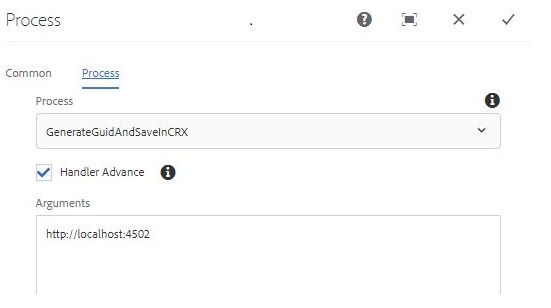
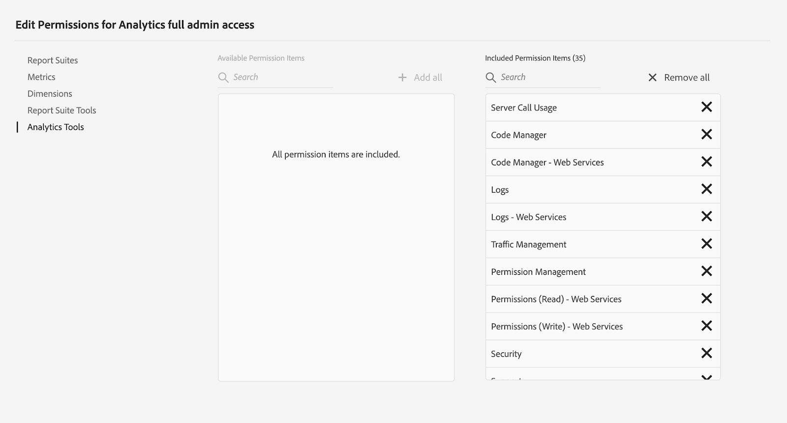

# 设置和配置We.Gov参考站点 {#set-up-and-configure-we-gov-reference-site}

## 演示包详细信息 {#demo-package-details}

### 安装先决条件 {#installation-prerequisites}

此包是为 **AEM Forms6.4 OSGI作者创建的**，经过测试，因此在以下平台版本上受支持：

| AEM版本 | AEM FORMS。包版本 | 状态 |
|---|---|---|
| 6.4 | 5.0.86 | **支持** |
| 6.5 | 6.0.80 | **支持** |
| 6.5.3 | 6.0.122 | **支持** |

此包包含支持以下平台版本的云配置：

| 云提供商 | 服务版本 | 状态 |
|---|---|---|
| Adobe Sign | v5 API | **支持** |
| Microsoft Dynamics 365 | 1710 (9.1.0.3020) | **支持** |
| AdobeAnalytics | v1.4 Rest API | **支持** |
**包安装注意事项：**

* 该包应安装在干净的服务器上，没有其他演示包或旧的演示包版本
* 该包应安装在OSGI服务器上，在创作模式下运行

### 此包包含什么 {#what-does-this-package-include}

AEM FormsWe.Gov演示&#x200B;**包(we-gov-forms.pkg.all-&lt;version>.zip**)作为包提供，包含若干其他子包和服务。 该包包含以下模块：

* **we-gov-forms.pkg.all-&lt;version>.zip** —— 完 *整演示包*

   * **we-gov-forms.ui.apps-&lt;version>.zip** - *包含所有组件、客户端库、示例用户、工作流模型等。*

      * **we-gov-forms.core-&lt;version>.jar** - *包含所有OSGI服务、自定义工作流步骤实现等。*

      * **we-gov-forms.derby&lt;version>.jar** - *包含所有OSGI服务、数据库模式等。*

      * **core.wcm.components.all-2.0.4.zip —— 范例WCM** 组 *件的集合*

      * **grid-aem.ui.ap-1.0-SNAPSHOT.zip -** *AEM Sites网格布局包的“站点”页面列控件*
   * **we-gov-forms.ui.content-&lt;version>.zip** - *包含所有内容、页面、图像、表单、交互式通信资源等。*

   * **we-gov-forms.ui.an Alytics-&lt;version>.zip** - *包含要存储在存储库中的所有We.Gov FormsAnalytics数据。*

   * **we-gov-forms.config.public-&lt;version>.zip** - *包含所有默认配置节点，包括占位符云配置，以帮助避免表单数据模型和服务绑定问题。*

此包中包含的资产包括：

* 包含可编辑模板的AEM站点页面
* AEM Forms自适应表单
* AEM Forms交互通信(印刷和Web渠道)
* AEM FormsXDP记录文档
* AEM FormsMS Dynamics表单数据模型
* Adobe Sign集成
* AEM工作流模型
* AEM Assets示例图像
* 示例（内存中）Apache Derby数据库
* Apache Derby Data Source（与Form Data Model一起使用）

## 演示包安装 {#demo-package-installation}

本节包含有关安装演示包的信息。

### 从包共享 {#from-package-share}

1. 导航 *到https://&lt;aemserver>:&lt;port>/crx/packageshare/*

   或者，在AEM中，单击部署并导航到包共享图标。

   

1. 使用Adobe ID登录。
1. 搜索并找 **到we-gov-forms.pkg.all-&lt;version>软件包** 。
1. 选择“下载”选项并接受条款与条件。
1. 下载后，选择“已下载”选项，在包管理器中查找包。
1. 选择“安装”选项以安装包。

   

1. 允许完成安装过程。
1. 导航 *到https://&lt;aemserver>:&lt;port>/content/we-gov/home.html?wcmmode=disabled* ，确保安装成功。

### 从本地ZIP文件 {#from-a-local-zip-file}

1. 下载并 **找到we-gov-forms.pkg.all-&lt;version>.zip文件** 。
1. 导航到 *https://&lt;aemserver>:&lt;port>/crx/packmgr/index.jsp*。
1. 选择“上传包”选项。

   

1. 使用文件浏览器导航到并选择下载的ZIP文件。
1. 单击“打开”以上传。
1. 上传后，选择“安装”选项以安装包。

   

1. 允许完成安装过程。
1. 导航 *到https://&lt;aemserver>:&lt;port>/content/we-gov/home.html?wcmmode=disabled* ，确保安装成功。

### 安装新的包版本 {#installing-new-package-versions}

要安装新的包版本，请按照4.1和4.2中定义的步骤操作。在已安装其他旧包的情况下安装较新的包版本是可能的，但建议先卸载旧的包版本。 为此，请按照以下步骤操作。

1. 导航到 *https://&lt;aemserver>:&lt;port>/crx/packmgr/index.jsp*
1. 找到旧 **的we-gov-forms.pkg.all-&lt;version>.zip文件** 。
1. 选择“更多”选项。
1. 从下拉菜单中，选择“卸载”选项。

   

1. 确认后，再次选择“卸载”，并允许卸载过程完成。

## 演示包配置 {#demo-package-configuration}

本节包含演示前演示包的部署后配置的详细信息和说明。

### 虚构用户配置 {#fictional-user-configuration}

1. 导航到 *https://&lt;aemserver>:&lt;port>/libs/granite/security/content/groupadmin.html*
1. 以管理员身份登录以执行以下任务。
1. 向下滚动到页面末尾以加载所有用户组。
1. 搜索“工&#x200B;**作流**”。
1. 选择“**工作流用户**”组，然后单击“属性”。
1. 导航到“成员”选项卡。
1. 在“选 **择用** 户或用户组”字段中键入wegov。
1. 从下拉菜单“**We.Gov Forms Users**”中进行选择。

   

1. 单击菜单栏中的“保存并关闭”。
1. 重复步骤2-7，方&#x200B;**法是**&#x200B;搜索“analytics”，选择“**Analytics管理员**”组，并将“We.Gov **Forms Users**”组添加为成员。
1. 重复步骤2-7，方&#x200B;**法为**：搜索“**表单用户**”，选择“表单——高级用户&#x200B;**”组，并将“We.Gov** Forms用户”组添加为成员。
1. 重复步骤2-7，方&#x200B;**法为**：搜索“forms-users”**，选择“forms-users**”组，并&#x200B;**将“We.Gov Users**”组添加为成员。

### 电子邮件服务器配置 {#email-server-configuration}

1. 查看设置文档 [配置电子邮件通知](/help/sites-administering/notification.md)
1. 以管理员身份登录以执行此任务。
1. 导航 *到https://&lt;aemserver>:&lt;port>/system/console/configMgr*
1. 找到并单击要 **配置的Day CQ Mail** Service服务。

   

1. 配置服务以连接到您选择的SMTP服务器：

   1. **SMTP服务器主机名**: 例如(smtp.gmail.com)
   1. **服务器端口**: 例如(465)，用于使用SSL的gmail
   1. **SMTP用户：** demo@ &lt;companyname>
   1. **“发件人”地址**: aemformsdemo@adobe.com

   

1. 单击“保存”以保存配置。

### （可选）AEM SSL配置 {#aemsslconfig}

本节包含有关在AEM实例上配置SSL以便能够配置Adobe Sign Cloud配置的详细信息。

**引用:**

1. [默认情况下为SSL](/help/sites-administering/ssl-by-default.md)

**注释:**

1. 导航到https://&lt;aemserver>:&lt;port>/aem/inbox，您将能够在此处完成上述参考文档链接中所述的过程。
1. 该 `we-gov-forms.pkg.all-[version].zip` 包包括示例SSL密钥和证书，可通过解压作为包一部分的文 `we-gov-forms.pkg.all-[version].zip/ssl` 件夹来访问该证书。

1. SSL证书和密钥详细信息：

   1. 发布到“CN=localhost”
   1. 有效期为10年
   1. 密码值为“password”
1. 私钥是 *localhostprivate.der*。
1. 证书是 *localhost.crt*。
1. 单击下一步。
1. HTTPS主机名应设置为 *localhost*。
1. 端口应设置为系统已公开的端口。

### (Optional) Adobe Sign cloud configuration {#adobe-sign-cloud-configuration}

本节包含有关Adobe Sign云配置的详细信息和说明。

**引用:**

1. [将Adobe Sign与AEM Forms集成](adobe-sign-integration-adaptive-forms.md)

#### Cloud configuration {#cloud-configuration}

1. 查看先决条件。 请参 [阅AEM SSL配置](../../forms/using/forms-install-configure-gov-reference-site.md#aemsslconfig) ，以获得所需的SSL配置。
1. 导航至:

   *https://&lt;aemserver>:&lt;port>/libs/adobesign/cloudservices/adobesign.html/conf/we-gov*

   >[!NOTE]
   >
   >用于访问AEM服务器的URL应与在Adobe Sign OAuth重定向URI中配置的URL匹配，以避免配 *置问题(例如https://&lt;aemserver>:&lt;port>/mnt/overlay/adobesign/cloudservices/adobesign/properties.html*)

1. 选择“We.gov Adobe Sign”配置。
1. 单击“属性”。
1. 导航到“设置”选项卡。
1. 输入身份验证URL，例如： [https://secure.na1.echosign.com/public/oauth](https://secure.na1.echosign.com/public/oauth)
1. 从已配置的Adobe Sign实例提供已配置的客户端ID和客户端机密。
1. 单击“连接到Adobe Sign”。
1. 成功连接后，单击“保存并关闭”以完成集成。

### 填写和签署多个表单 {#fill-sign-multiple-forms}

本文档介绍设置填写和签署多个表单的能力所需的步骤。 您也可以在此处尝 [试相同的功能](https://forms.enablementadobe.com/content/dam/formsanddocuments/formsandsigndemo/refinanceform/jcr:content?wcmmode=disabled)。 此示例将此示例所需的必要数据存储在AME存储库中。 这样做是为了确保在本地服务器上部署演示资源的流畅体验。 在现实生活中，我们将在您选择的RDMS中存储相同的信息。

#### 前提条件 {#pre-requisites-fill-sign-multiple-forms}

* [配置Day CQ邮件服务](https://docs.adobe.com/content/help/en/experience-manager-65/communities/administer/email.html)

* [使用Adobe Sign配置AEM Forms](https://docs.adobe.com/content/help/en/experience-manager-65/forms/adaptive-forms-advanced-authoring/adobe-sign-integration-adaptive-forms.html)

#### 在本地服务器上设置示例 {#setup-sample-local-server}

请执行以下步骤在本地服务器上设置示例：

1. 安装包。 此包包含以下内容：
   * 自适应表单. 表单位于formsandsigndemo文 **件夹中** 。
   * 自定义OSGI捆绑
   * 工作流
1. 配置 [同意表](http://localhost:4502/editor.html/content/forms/af/formsandsigndemo/consentform.html) ，以使用您的Adobe Sign配置。
1. 配置 [多状态兴趣锁](http://localhost:4502/editor.html/content/forms/af/formsandsigndemo/multistateinterestratelock.html) 表单以使用Adobe Sign配置。
1. 打开 [表单和签名演示](http://localhost:4502/editor.html/conf/global/settings/workflow/models/formsandsigningdemo.html) 工作流模型：
   1. 在CRX步骤中打开保存表单。
   1. 将localhost更改为AEM Server的ip地址。
   1. 保存更改。
   1. 同步工作流以生成运行时模型。

      

   1. 打开再 [融资表](http://localhost:4502/content/dam/formsanddocuments/formsandsigndemo/refinanceform/jcr:content?wcmmode=disabled)。
   1. 填写必填字段。 确保提供有效的电子邮件地址，并选择一个或多个表单以签名和提交表单。
您会收到一封电子邮件，其中包含填写和签署表单的链接。

#### 疑难解答 {#troubleshoot-sign-multiple-forms}

* 调试日志将写入服 `signingmultipleforms.log` 务器日志文件夹中的文件。

* 要签名的表单存储在下 `/content/formsforsigning`。

* 确保所有捆绑包处于活动状态。

* 检查电子邮件服务器配置。

### （可选）MS Dynamics云配置 {#ms-dynamics-cloud-configuration}

本节包含有关MS Dynamics云配置的详细信息和说明。

**引用:**

1. [Microsoft Dynamics OData配置](https://docs.adobe.com/content/help/en/experience-manager-64/forms/form-data-model/ms-dynamics-odata-configuration.html)
1. [为AEM Forms配置Microsoft Dynamics](https://helpx.adobe.com/experience-manager/kt/forms/using/config-dynamics-for-aem-forms.html)

#### MS Dynamics OData云服务 {#ms-dynamics-odata-cloud-service}

1. 导航至:

   https://&lt;aemserver>:&lt;port>/libs/fd/fdm/gui/components/admin/fdmcloudservice/fdm.html/conf/we-gov

   1. 确保您使用与MS Dynamics应用程序注册中配置的相同重定向URL访问服务器。

1. 选择“Microsoft Dynamics ODataCloud Service”配置。
1. 单击“属性”。

   

1. 导航到“身份验证设置”选项卡。
1. 输入以下详细信息：

   1. **服务根：** 例如https://msdynamicsserver.api.crm3.dynamics.com/api/data/v9.1/
   1. **身份验证类型：** OAuth 2.0
   1. **身份验证设置** (请参 [阅MS Dynamics云配置设置](../../forms/using/forms-install-configure-gov-reference-site.md#dynamicsconfig) ，以收集此信息):

      1. 客户端ID —— 也称为应用程序 ID
      1. 客户端密钥
      1. OAuth URL —— 例如 [https://login.windows.net/common/oauth2/authorize](https://login.windows.net/common/oauth2/authorize)
      1. 刷新令牌URL —— 例如 [https://login.windows.net/common/oauth2/token](https://login.windows.net/common/oauth2/token)
      1. 访问令牌URL —— 例如 [https://login.windows.net/common/oauth2/token](https://login.windows.net/common/oauth2/token)
      1. 授权范围- **openid**
      1. 身份验证头——授 **权承载**
      1. 资源——例如 [https://msdynamicsserver.api.crm3.dynamics.com](https://msdynamicsserver.api.crm3.dynamics.com)
   1. 单击“连接到OAuth”。

1. 成功验证后，单击“保存并关闭”以完成集成。

#### MS Dynamics云配置设置 {#dynamicsconfig}

本节中详细介绍的步骤旨在帮助您从MS Dynamics Cloud实例中查找客户端ID、客户端机密和详细信息。

1. 导航到 [https://portal.azure.com/](https://portal.azure.com/) 并登录。
1. 从左侧菜单中选择“所有服务”。
1. 搜索或导航至“应用程序注册”。
1. 创建或选择现有的应用程序注册。
1. 复制 **应用程序 ID** ，以在AEM云配置 **中用作OAuth** 客户端ID
1. 单击“设置”或“清单”以配置回 **复URL。**

   1. 此URL必须与配置OData服务时用于访问AEM服务器的URL匹配。

1. 在设置视图中，单击“密钥”以视图创建新密钥（在AEM中，此密钥用作客户端机密）。

   1. 请确保保留密钥的副本，因为您以后无法在Azure或AEM中视图它。

1. 要找到资源URL/服务根URL，请导航到MS Dynamics实例仪表板。
1. 在顶部导航栏中，单击“销售”或您自己的实例类型和“选择设置”。
1. 单击右下方附近的“自定义”和“开发人员资源”。
1. 您会找到服务根URL: e.g

   *[https://msdynamicsserver.api.crm3.dynamics.com/api/data/v9.1/](https://msdynamicsserver.api.crm3.dynamics.com/api/data/v9.1/)*

1. 有关刷新和访问令牌URL的详细信息，请访问：

   *[https://docs.microsoft.com/en-us/rest/api/datacatalog/authenticate-a-client-app](https://docs.microsoft.com/en-us/rest/api/datacatalog/authenticate-a-client-app)*

#### 测试表单数据模型(Dynamics) {#testing-the-form-data-model}

云配置完成后，您可能需要测试表单数据模型。

1. 导航至

   *https://&lt;aemserver>:&lt;port>/aem/forms.html/content/dam/formsanddocuments-fdm/we-gov*

1. 选择“We.gov Microsoft Dynamics CRM FDM”并选择“属性”。

   

1. 导航到“更新源”选项卡。
1. 确保“上下文感知配置”设置为“/conf/we-gov”，并确保配置的数据源为“ms-dynamics-odata-cloud-service”。

   

1. 编辑表单数据模型。

1. 测试服务以确保它们成功连接到已配置的数据源。

   >[!NOTE]
   测试服务后，单击 **取消** ，以确保非自愿更改不会传播到表单数据模型。

   >[!NOTE]
   据报告，数据源成功绑定到FDM需要AEM服务器重新启动。

#### 测试表单数据模型(Derby) {#test-fdm-derby}

云配置完成后，您可能需要测试表单数据模型。

1. 导航 *到https://&lt;aemserver>:&lt;port>/aem/forms.html/content/dam/formsanddocuments-fdm/we-gov*

1. 选择We. **gov Engromment FDM** ，然后选择 **属性**。

   

1. 导航到“更 **新源** ”选项卡。

1. 确保将 **上下文感知配置设** 置为 `/conf/we-gov` ，并确保配置的数据源 **为We.Gov Derby DS**。

   

1. Click on **Save and Close**.

1. [测试服务](work-with-form-data-model.md#test-data-model-objects-and-services) ，确保它们成功连接到已配置的数据源

   * 要测试连接，请选择 **HOMEMORGAGEACCOUNT** ，并为其提供获取服务。 测试服务，系统管理员可以看到正在检索的数据。

### AdobeAnalytics配置（可选） {#adobe-analytics-configuration}

本节包含有关AdobeAnalytics云配置的详细信息和说明。

**引用:**

* [与 Adobe Analytics 集成](../../sites-administering/adobeanalytics.md)

* [连接到AdobeAnalytics并创建框架](../../sites-administering/adobeanalytics-connect.md)

* [查看页面分析数据](../../sites-authoring/pa-using.md)

* [配置分析和报告](configure-analytics-forms-documents.md)

* [视图和了解AEM Forms分析报告](view-understand-aem-forms-analytics-reports.md)

### AdobeAnalytics云服务配置 {#adobe-analytics-cloud-service-configuration}

此包已预配置为连接到AdobeAnalytics。 下面的步骤允许更新此配置。

1. 导航到 *https://&lt;aemserver>:&lt;port>/libs/cq/core/content/tools/cloudservices.html*
1. 找到AdobeAnalytics部分，然后选择“显示配置”链接。
1. 选择“We.Gov AdobeAnalytics(Analytics配置)”配置。

   

1. 单击“编辑”按钮以更新AdobeAnalytics配置（您需要提供共享机密）。 单击“连接到Analytics”以连接，单击“确定”以完成。

   

1. 如果要更新框架配置，请在同一页中单击“We.Gov AdobeAnalytics框架(Analytics框架)”(请参阅启 [用AEM创作](../../forms/using/forms-install-configure-gov-reference-site.md#enableauthoring) 以启用创作)。

#### AdobeAnalytics查找用户凭据 {#analytics-locating-user-credentials}

要查找AdobeAnalytics帐户的用户凭据，帐户管理员必须执行以下任务。

1. 导航到Adobe Experience Cloud门户。
   * 使用管理员凭据登录
1. 在主仪表板中选择AdobeAnalytics图标。
   
1. 导航到“管理员”选项卡，然后选择“用户管理（旧版）”项目
   
1. Select the **Users** tab.
   
1. 从用户列表中选择所需的用户。
1. 滚动到页面底部，用户身份验证信息将显示在页面底部。
   
1. 用户名和共享机密信息将显示在权限框的右侧。
1. 请注意，用户名的名称中将包含冒号，冒号左侧的所有信息都是用户名，冒号右侧的所有信息都是公司名。
   * 以下是一个示例： *用户名： 公司名*

#### 在AdobeAnalytics设置用户身份验证 {#setup-user-authentication}

管理员可以执行以下操作，为用户提供AEM分析权限。

1. 导航到AdobeAdmin Console。

1. 单击向Admin Console公开的Analytics实例。

   * 它位于管理员页面的主页上。

1. 选择“Analytics完全管理员访问权限”。

1. 将用户添加到用户档案。

   

1. 将用户ID映射到用户档案后，单击权限选项卡。

1. 确保所有权限都映射到用户档案。

   

1. 请注意，一旦权限映射到用户登录的功能，可能需要几个小时。

### AdobeAnalytics报告 {#adobe-analytics-reporting}

#### 视图AdobeAnalytics站点报告 {#view-adobe-analytics-sites-reporting}

>[!NOTE]
AEM FormsAnalytics数据在离线时可用，如果安装了包，则不使用AdobeAnalytics云配 `we-gov-forms.ui.analytics-<version>.zip` 置，但AEM Sites数据需要活动云配置。

1. 导航到 *https://&lt;aemserver>:&lt;port>/sites.html/content*
1. 选择“AEM FormsWe.Gov站点”以视图站点页面。
1. 选择一个网站页面（例如主页），然后选择“Analytics和推荐”。

   

1. 在此页上，您将看到从AdobeAnalytics获取的与AEM Sites页面相关的信息(注意： 设计后，此信息将从AdobeAnalytics定期刷新，不会实时显示)。

   

1. 返回页面视图页面（在步骤3中访问），您还可以通过将显示设置更改为“列表视图”中的视图项来视图页面视图信息。
1. 找到“视图”下拉菜单并选择“列表视图”。

   

1. 从同一菜单中，选择“视图设置”，并从“Analytics”部分选择要显示的列。

   

1. 单击“更新”以使新列可用。

   

#### 视图AdobeAnalytics表单报告 {#view-adobe-analytics-forms-reporting}

>[!NOTE]
AEM FormsAnalytics数据在离线时可用，如果安装了包，则不使用AdobeAnalytics云配 `we-gov-forms.ui.analytics-<version>.zip` 置，但AEM Sites数据需要活动云配置。

1. 导航至

   *https://&lt;aemserver>:&lt;port>/aem/forms.html/content/dam/formsanddocuments/adobe-gov-forms*

1. 选择“健康福利登记申请”自适应表单并选择“Analytics报告”选项。

   

1. 等待页面加载并视图Analytics报告数据。

   

### Adobe自动表单配置启用 {#automated-forms-enablement}

要使用Adobe Forms安装和配置AEM Forms，转换工具用户必须具备以下各项。

1. 访问Adobe IO。

1. 创建与Adobe Forms Conversion服务集成的权限。

1. 以作者身份运行的Adobe AEM 6.5最新服务包。

阅读进一步说明前，请查看以下内容：

* [配置自动化表单转换服务](https://docs.adobe.com/content/help/en/aem-forms-automated-conversion-service/using/configure-service.html)

#### 创建IMS配置第1部分 {#creating-ims-config}

要配置服务以正确与表单转换工具通信，用户必须配置Identity Management系统(IMS)服务以能够向Adobe I/O注册。

1. 导航到https://&lt;aemserver>:&lt;port> >单击左上角的Adobe ExperienceManager >工具>安全>Adobe IMS配置。

1. 单击创建。

1. 在下图中执行操作。

   

1. 确保下载证书。

1. 请勿继续执行其余的配置——查看在Adobe I/O [中创建集成部分](#create-integration-adobeio)

>[!NOTE]
本节中创建的证书将用于在Adobe I/O中创建集成服务。 用户在集成服务中创建后，用户可以使用Adobe I/O中的该信息完成配置。

#### 在Adobe I/O中创建集成 {#create-integration-adobeio}

如果您没有与系统管理员联系以便在Adobe域中创建集成，请确保您能够这样做。

1. 导航到 [Adobe I/O控制台](https://console.adobe.io/)。

1. 单击创建集成。

1. 选择访问API。

1. 确保您处于正确的组中(右上下拉列表)。

1. 在“Experience Cloud”部分，选择“表单转换工具”。

1. 单击“继续”。

1. 输入集成的名称和说明。

1. 使用第2.1节中的公钥将其放在密钥集成中。

1. 选择自动表单转换用户档案。

   

#### 创建IMS配置第2部分 {#create-ims-config-part-next}

现在您已创建集成，我们可以完成IMS配置的安装。

1. 单击Adobe I/O中的集成，以显示连接详细信息。

1. 导航到AEM中的IMS配置（“工具”>“安全性”>“IMS”）

1. 在IMS配置屏幕上单击“下一步”。

1. 输入授权服务器（屏幕截图中显示的值）。

1. 输入API密钥。

1. 输入客户端机密（必须单击Adobe I/O中集成的公开，才能显示它）。

1. 单击Adobe I/O中的JWT选项卡，以获取JWT有效负荷并将其粘贴到IMS配置的有效负荷中。

   

1. 创建后，单击IMS配置并选择运行状况检查，用户应看到以下结果。

   

#### 配置云配置（We.Gov AFC生产） {#configure-cloud-configuration}

完成IMS配置后，我们可以继续查看AEM中的云配置。 如果配置不存在，请使用以下步骤在AEM中创建云配置：

1. 打开浏览器并导航到系统URL https://&lt;domain_name>:&lt;system_port>

1. 单击屏幕左上角的Adobe Experience Manager>工具>Cloud Service>自动表单对话配置。

1. 选择要将配置放入的配置文件夹。

1. 单击创建。

1. 在下面的屏幕截图中输入信息。

   

1. 为配置提供标题和名称。

1. 系统的服务URL设置为https://aemformsconversion.adobe.io/。

1. 模板 *URL/conf/we-gov/settings/wcm/templates/we-gov-flamingo-template*。

1. 主题URL: */content/dam/formsanddocuments-主题/adobe-gov-forms-主题/we-gov-theme*

1. 单击下一步。

1. 对于此配置，我们将两个复选框值留空。

   * 要进一步了解这些选项，请参 [阅配置云服务](https://docs.adobe.com/content/help/en/aem-forms-automated-conversion-service/using/configure-service.html#configure-the-cloud-service)。

#### 配置云配置（We.Finance AFC生产） {#configure-cloud-configuration-wefinance}

完成IMS配置后，我们可以继续在AEM中创建云配置。

1. 打开浏览器并导航到系统URL https://&lt;domain_name>:&lt;system_port>

1. 单击屏幕左上角的Adobe Experience Manager>工具>Cloud Service>自动表单对话配置。

1. 选择要将配置放入的配置文件夹。

1. 单击创建。

1. 在下面的屏幕截图中输入信息。

   

1. 为配置提供标题和名称。

1. 系统的服务URL设置为https://aemformsconversion.adobe.io/

1. 模板URL: */conf/we-finance/settings/wcm/templates/we-finance-adaptive-form*

1. 主题URL: */content/dam/formsanddocuments-主题/adobe-finance-forms-主题/we-finance-theme*

1. 单击下一步。

1. 对于此配置，我们将两个复选框值留空。

   * 要进一步了解这些选项，请参 [阅配置云服务](https://docs.adobe.com/content/help/en/aem-forms-automated-conversion-service/using/configure-service.html#configure-the-cloud-service)。

#### 测试表单转换（We.Gov注册应用程序） {#test-forms-conversion}

设置配置后，用户可以通过上传PDF文档来测试配置。

1. 导航到AEM系统https://&lt;domain_name>:&lt;system_port>

1. 单击“表单”>“表单和文档”>“AEM FormsWe.gov表单”>“AFC”。

1. 选择We.Gov注册应用程序PDF。

1. 单击右上 **角的开始** “自动转换”按钮。

1. 用户应能够看到以下选项。

   

1. 选择按钮后，用户将看到以下选项

   * 确保用户选择 *We.Gov AFC生产配置*

   

   

1. 在配置了要使用的所有选项后，选择开始转换。

1. 转换过程开始时，用户应看到以下屏幕：

   

1. 转换完成后，用户将看到以下屏幕：

   

   单击“ **输出** ”文件夹以视图生成的自适应表单。

#### 已知问题和说明 {#known-issues-notes}

自动表单转换服务包括某些 [最佳实践、已知的复杂模式](https://docs.adobe.com/content/help/en/aem-forms-automated-conversion-service/using/styles-and-pattern-considerations-and-best-practices.html)和已 [知问题](https://docs.adobe.com/content/help/en/aem-forms-automated-conversion-service/using/known-issues.html)。 在开始使用AEM Forms自动表单转换服务之前，请先查看这些内容。

1. 如果您希望在转换后将表单绑定到FDM，则在未启用数据绑定的情况下生成具有生成自适应表单的表单。

1. 确保模板文件夹已启用jcr:read for everyone权限，否则服务用户将无法从存储库读取模板，转换将失败。

## 演示包自定义 {#demo-package-customizations}

本部分包含有关自定义演示的说明。

### 模板自定义 {#templates-customization}

可编辑的模板位于以下位置：

*https://&lt;aemserver>:&lt;port>/libs/wcm/core/content/sites/templates.html/conf/we-gov*

这些模板包括AEM站点、自适应表单和交互式通信模板，这些模板是使用组件创建和组合的，这些组件位于：

*https://&lt;aemserver>:&lt;port>/crx/de/index.jsp#/apps/we-gov/components*

#### Style system {#customizetemplates}

此站点还提供客户端库，其中一个导入Bootstrap4( [https://getbootstrap.com/](https://getbootstrap.com/) )。 此客户端库位于

*https://&lt;aemserver>:&lt;port>/crx/de/index.jsp#/apps/we-gov/clientlibs/clientlib/css-bootstrap*

此包中包含的可编辑模板还预配置了模板／页面策略，这些策略使用Bootstrap4 CSS类进行分页、设置样式等。 并非所有类都已添加到模板策略，但Bootstrap4支持的任何类都可以添加到策略中。 有关可用类的列表，请参阅入门页：

[https://getbootstrap.com/docs/4.1/getting-started/introduction/](https://getbootstrap.com/docs/4.1/getting-started/introduction/)

此包中包含的模板还支持样式系统：

[样式系统](../../sites-authoring/style-system.md)

#### 模板徽标 {#template-logos}

项目DAM资产还包括We.Gov徽标和图像。 以下资产可在以下位置获取：

*https://&lt;aemserver>:&lt;port>/assets.html/content/dam/we-gov*

在编辑页面和表单模板时，您可以选择通过编辑导航和页脚组件来更新品牌徽标。 这些组件优惠了可配置的品牌和徽标对话框，可用于更新徽标：

有关详细信息，请参阅编辑页面内容：

[编辑页面内容](../../sites-authoring/editing-content.md)

### 站点页面自定义 {#sites-pages-customization}

所有网站页面均可从以下网页获取： *https://&lt;aemserver>:&lt;port>/sites.html/content/we-gov*

这些站点页面还利用AEM Grid包控制一些组件的布局。

#### Style system {#style-system}

此包中包含的页面还支持样式系统：

[样式系统](../../sites-authoring/style-system.md)

您还可以参阅模板自 [定义样式系统](../../forms/using/forms-install-configure-gov-reference-site.md#customizetemplates) ，以获取有关受支持样式的文档。

### 自适应表单自定义 {#adaptive-forms-customization}

所有自适应表单均可从以下位置获取：

*https://&lt;aemserver>:&lt;port>/aem/forms.html/content/dam/formsanddocuments/adobe-gov-forms*

可以自定义这些表单以适合某些用例。 请注意，不应修改某些字段和提交逻辑以确保表单继续正常工作。 这包括：

**健康福利的注册申请：**

* contact_id —— 用于在提交期间接收MS Dynamics联系人ID的隐藏字段
* 提交——需要自定义提交按钮逻辑以支持回呼。 自定义是有记录的，但在通过表单数据模型向MS Dynamics执行POST和GET操作时，需要一个大型脚本来提交表单。
* 根面板——初始化事件用于以尽可能少的侵入方式向AEM收件箱中添加MS Dynamics按钮，因为所有AEM收件箱Granite UI组件都不可修改。

#### 自适应表单样式 {#adaptive-form-styling}

还可以使用样式编辑器或主题编辑器设置自适应表单的样式：

* [自适应表单组件的内联样式](inline-style-adaptive-forms.md)
* [创建和使用主题](themes.md)

### 工作流自定义 {#workflow-customization}

登记自适应表单提交到OSGI工作流以进行处理。 此工作流程位 *于https://&lt;aemserver>:&lt;port>/conf/we-gov/settings/models/we-gov-process.html*。

由于某些限制，此工作流包含多个脚本和自定义OSGI工作流进程步骤。 这些工作流步骤被创建为通用步骤，尚未使用配置对话框创建。 此时，工作流步骤的配置依赖于进程参数。

所有工作流步骤Java代码 **都包含在we-gov-forms.core-&lt;version>.jar捆绑包中** 。

## 演示注意事项和已知问题 {#demo-considerations-and-known-issues}

本节包含有关演示功能和设计决策的信息，在演示过程中可能需要特殊考虑。

### 演示注意事项 {#demo-considerations}

* 根据AGRS-159，请确保在登记自适应表单中使用的联系人的姓名（第一、中间和最后）是唯一的。
* 注册自适应表单将向表单的电子邮件字段中指定的电子邮件发送Adobe Sign电子邮件。 该电子邮件地址不能与用于配置Adobe Sign云配置的电子邮件地址相同。

### 已知问题 {#known-issues}

* (AGRS-120)站点导航组件当前不支持深度超过2级的嵌套子页面。
* (AGRS-159)当前MS Dynamics FDM首先需要执行2个操作，将注册自适应表单数据发布到Dynamics，然后提取用户记录以检索联系人ID。 在其当前状态下，如果Dynamics中存在两个以上同名用户，则获取联系人ID将失败，这将不允许提交注册自适应表单。

## 配置辅助功能测试 {#configure-accessibility-testing}

### 启用辅助功能测试Chrome Add {#enable-chrome-add-on}

要首先执行辅助功能测试，您需要安装Chrome插件，可以在此处找 [到它](https://chrome.google.com/webstore/detail/accessibility-developer-t/fpkknkljclfencbdbgkenhalefipecmb?hl=en)。

安装后，请在Chrome浏览器中加载要测试的页面(注意： 打开多个选项卡可能会影响您的得分，最好只打开一个选项卡)。 载入页面后&#x200B;**，右键单击** ，然后选择 **审核** 选项卡。 开发人员可以选择要由辅助功能插件执行的审核类型。 选择所有所需选项后，用户便可选择生成报告按钮。 这将生成一个PDF文档，它显示总体辅助工具等级以及可用于提高总体辅助工具等级的内容。

执行报告后，用户将看到以下内容：

用户面前显示的数字是他们获得的总体可访问性等级。 还描述了在得分后如何计算此值。

如果用户希望导出此插件，可以单击屏幕右侧的三个按钮，并从插件优惠的其他选项中进行选择。

### 超海洋主题 {#ultramarine-theme}

Adobe维护的公开Ultramarine主题内置于可安装的ZIP文件中`we-gov-forms.pkg.all-<version>.zip` 。 使用CRX安装此包后。

包管理器，用户可以通过导航到“表单”>“AEM Forms”>“ **主题****”>“参考主题** ”>“ **Ultramarine-Accessible** ”，在 ****&#x200B;中访问Ultramarine主题。

## 配置选项 {#configuration-options}

用户可以配置各种工作流服务选项，这些选项包括：

1. Microsoft Dynamics条目
1. Adobe Sign
1. AEM自定义通信管理
1. AdobeAnalytics

要将其配置为在工作流中启用，用户需要执行以下任务。

1. 导航到[https://&#39;]server[]:port&#39;/system/console/configMgr。

1. 找到WeGov *配置*。

1. 打开服务定义，并启用在工作流中调用的选定服务。

>[!NOTE]
正因为用户在“配置管理器”页面中启用了服务，用户仍需要设置服务配置才能与请求的外部服务通信。

1. 完成后，单击保存按钮以保存设置。

## 后续步骤 {#next-steps}

现在，您已准备好浏览We.Gov参考站点。 有关We.Gov参考站点工作流程和步骤的更多信息，请 [参阅We.Gov参考站点演练](../../forms/using/forms-gov-reference-site-user-demo.md)。
