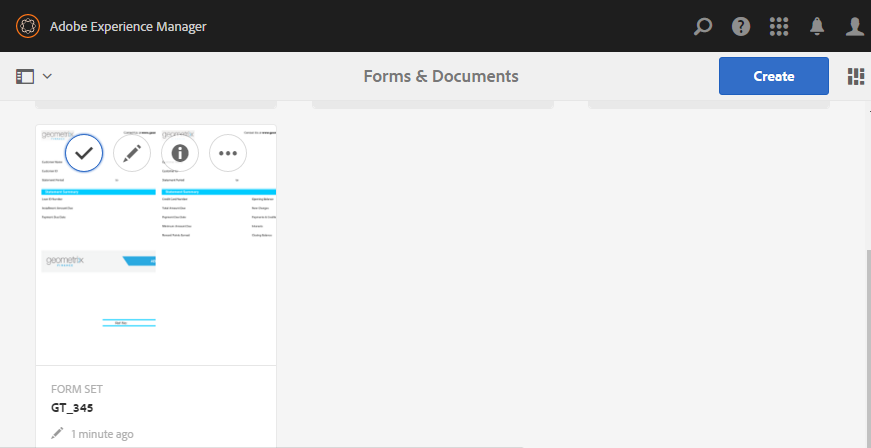

# 在AEM Forms设置的表单{#form-set-in-aem-forms}

## 概述 {#overview}

客户通常需要提交多个表单才能申请服务或优惠。 包括寻找所有相关的形式，并单独填写、提交和跟踪这些内容。 此外，还需要在表单中多次填写常见详细信息。 如果整个过程涉及大量表单，则会变得繁琐且容易出错。 AEM Forms的表单集功能有助于简化此类场景中的用户体验。

表单集是一组HTML5表单，这些表单分组在一起，并作为一组表单提供给最终用户。 当最终用户开始填写表单集时，他们将从一个表单无缝地转换为另一个表单。 最后，只需单击一下即可提交所有表单。

AEM Forms为表单作者提供了一个直观的用户界面，用于创建、配置和管理表单集。 作为作者，您可以按您希望最终用户关注的特定顺序对表单进行订购。 此外，您可以对单个表单应用条件或资格表达式，以根据用户输入控制其可见性。 例如，您可以将配偶详细信息表单配置为仅在婚姻状态指定为“已婚”时显示。

此外，您还可以配置不同表单中的公用字段以共享公用数据绑定。 在适当的数据绑定到位后，最终用户只需填写在后续表单中自动填写的公共信息。

AEM Forms应用程序还支持表单集，让您的现场员工脱机创建表单集、访问客户、输入数据，并稍后与AEM Forms服务器同步，以便将表单数据提交到业务流程。

## 创建和管理表单集{#creating-and-managing-form-set}

您可以将使用设计器创建的多个XDP或表单模板关联到一个表单集中。 然后，可以根据用户在初始表单中输入的值及其用户档案，使用表单集来选择性地呈现XDP。

使用[AEM Forms用户界面](../../forms/using/introduction-managing-forms.md)管理所有表单、表单集和相关资产。

### 创建表单集{#create-a-form-set}

要创建表单集，请执行以下操作：

1. 选择“Forms”>“Forms”和“文档”。
1. 选择“创建”>“表单集”。

1. 在添加属性页面中，添加以下详细信息，然后单击下一步。

   * 标题：指定文档的标题。 标题可帮助您识别在AEM Forms用户界面中设置的表单。
   * 描述：指定有关文档的详细信息。
   * 标记：指定用于唯一标识表单集的标记。 标记有助于搜索表单集。 要创建标记，请在“标记”框中键入新标记名称。
   * 提交URL:指定在单机表单集再现(非AEM Forms应用程序用例)的情况下，将发布提交数据的URL。 数据以多部件／表单数据形式提交到此端点，请求参数如下：
   * dataXML:此参数包含已提交表单集数据的XML表示形式。 如果表单集中的所有表单都使用通用模式，则根据该模式生成XML。 否则，XML根标签包含表单集中每个已填写表单的子标签，该子标签包含表单附件的数据。
   * formsetPath:已提交的CRXDE中格式集的路径。
   * HTML渲染用户档案:您可以配置某些选项，如浮动字段、附件和草稿支持（对于独立表单集再现），以自定义表单集的外观、行为和交互。 您可以自定义或扩展现有用户档案以更改任何HTML表单用户档案设置。

   

1. “选择表单”屏幕显示可用的XDP表单或XDP文件。 搜索并选择要包含在表单集中的表单，然后单击“添加到表单集”。 如有必要，请再次搜索要添加的表单。 将所有表单添加到表单集后，单击“下一步”。

   >[!NOTE]
   >
   >确保XDP表单中的字段名称不包含点字符。 否则，任何尝试解析具有点字符的字段的脚本都无法解析它们。

1. 在“配置表单”页中，您可以执行以下操作：

   * 表单顺序：拖放表单以对其重新排序。 表单顺序定义表单在AEM Forms应用程序和独立再现中显示给最终用户的顺序。
   * 表单标识符：为要在资格表达式中使用的表单指定唯一标识。
   * 数据根：对于表单集中的每个表单，作者可以配置XPATH，在XPATH中，特定表单的数据将放置在提交的XML中。 默认情况下，该值为/。 如果表单集中的所有表单都是模式绑定，并且共享相同的XML模式，则可以更改此值。 建议表单中的每个字段都具有在XDP中指定的正确数据绑定。 如果两个不同表单中的两个字段共享公用数据绑定，则第二个表单中的字段将显示第一个表单中的预填值。 请勿将具有相同内部内容的两个子表单绑定到同一XML节点。 有关表单集的XML结构的详细信息，请参阅[为表单集预填XML](../../forms/using/formset-in-aem-forms.md#p-prefill-xml-for-form-set-p)。
   * 资格表达式:指定一个JavaScript表达式，它计算布尔值并指示表单集中的表单是否有资格填写。 如果为false，则用户不会被要求甚至不显示要填写的表单。 通常，表达式基于在此表单之前捕获的字段的值。 表达式还包含对表单集API fs.valueOf的调用，以提取用户在表单集的字段中填写的值：

   *fs.valueOf(&lt;form Identifier=&quot;&quot;>,  &lt;fieldsom expression=&quot;&quot;>>  &lt;value>*

   例如，如果表单集中有两个表单：商务费用和差旅费用，您可以在“资格表达式”字段中为这两个表单添加一个JavaScript代码片段，以检查用户在表单中输入的费用类型。 如果用户选择“业务费用”，则“业务费用”表单将呈现给最终用户。 或者，如果用户选择旅行费用，则向最终用户呈现不同的表单。 有关详细信息，请参阅资格表达式。

   此外，作者还可以选择使用每行右角的删除图标从表单集中删除表单，或使用工具栏中的“**+**”图标添加另一组表单。 此“**+**”图标将用户引回到向导中的上一步，该步骤用于“选择表单”。 将保留现有选择，并且必须使用该页面上的“添加到表单集”图标将所做的任何其他选择添加到表单集。

   

   >[!NOTE]
   >
   >表单集中使用的所有表单都由AEM Forms用户界面管理。

### 管理表单集{#managing-a-form-set}

创建表单集后，您可以对该表单集执行以下操作：

* 单击：在创建表单集并将其列在主资产页面时，您可以单击表单集以对其进行视图。 此时将打开一个表单集，并显示该表单集中的所有表单模板(XDP)。
* 编辑：在选择表单集后单击编辑时，将打开配置表单屏幕，该屏幕显示在创建表单集的步骤中。 您可以执行此处描述的所有功能。
* 复制+粘贴：这允许您从一个位置复制整个表单集，并将其粘贴到同一位置或任何其他位置或文件夹。
* 下载：您可以下载包含其所有依赖项的表单集。
* 开始/管理审阅：创建表单集后，可以单击“开始审阅”设置其审阅。 对表单集启动审阅后，将向用户显示“管理审阅”选项。 在“管理审阅”屏幕上，您可以更新／结束审阅。 对于您添加的审阅，您可以检查审阅并根据需要添加注释。
* 删除：删除完整的表单集。 已删除的表单集中的表单仍保留在存储库中。
* 发布／取消发布：此组件会发布／取消发布表单集及其包含的所有表单以及这些表单的相关资产。
* 预览:预览提供两个选项：预览为HTML（无数据），自定义预览为示例数据。
* 视图/编辑属性：您可以视图/编辑所选表单集的元数据属性。



### 编辑表单集{#edit-a-form-set}

要编辑表单集，请执行以下操作：

1. 选择“Forms”>“Forms”和“文档”。
1. 找到要编辑的表单集。 将鼠标悬停在它上方，然后选择“编辑”()。
1. 在“配置表单”页中，您可以编辑以下内容：

   * 表单顺序
   * 表单标识符
   * 数据根
   * 资格表达式

   您还可以单击相关的删除图标，从表单集中删除表单。

## 流程管理{#form-set-in-process-management}中设置的表单

在使用AEM Forms管理用户界面创建表单集后，您可以在开始点中使用表单集，或使用工作台分配任务活动。

### 使用任务或开始点{#using-form-set-in-task-or-start-point}中的表单集

1. 设计流程时，在“分配任务/开始点”的“演示和数据”部分下，选择&#x200B;**使用CRX资产**。 出现CRX资产浏览器。

   

1. 选择表单集以过滤AEM存储库(CRX)中的表单集。

   

1. 选择一个表单集，然后单击“确定”。

## 资格表达式{#eligibility-expressions}

表单集中的资格表达式用于定义和动态控制显示给用户的表单。 例如，仅当用户属于特定年龄组时，才显示特定表单。 使用表单管理器指定和编辑资格表达式。

资格表达式可以是任何返回布尔值的有效JavaScript语句。 JavaScript代码片断中的最后一条语句被视为布尔值，该布尔值根据JavaScript代码片断的其余部分（前几行）的处理确定表单的资格。 如果表达式的值为true，则表单有资格显示给用户。 此类表单称为合格表单。

>[!NOTE]
>
>不执行表单集中第一个表单的资格表达式。 无论第一个表单的资格表达式如何，始终显示该表单。

除了标准JavaScript函数外，表单集还公开fs.valueOf API，它提供对表单集中表单字段值的访问。 使用此API访问表单集中表单字段的值。 API语法为fs.valueOf(formUid, fieldSOM)，其中：

* formUid（字符串）:表单集中表单的唯一ID。 您可以在表单管理器用户界面中创建表单集时指定它。 默认情况下，它是表单名称。
* fieldSOM（字符串）:表单Uid所指定格式的字段的SOM表达式。 SOM表达式或脚本对象模型表达式用于引用特定文档对象模型(DOM)中的值、属性和方法。 在选择字段时，您可以在“脚本”选项卡下的表单设计器中视图它。

>[!NOTE]
>
>formUid和fieldSOM参数都必须是字符串文本。

### 示例 {#examples}

API的有效使用：

`fs.valueOf("form1", "xfa.form.form1.subform1.field1")`

API的使用无效：

```javascript
var formUid = "form1";
 var fieldSOM = “xfa.form.form1.subform1.field1"; fs.valueOf(formUid, fieldSOM);
```

## 为表单集{#prefill-xml-for-form-set}预填XML

表单集是多个HTML5表单的集合，这些表单具有通用或不同的模式。 表单集支持使用XML文件预填表单字段。 您可以将XML文件与表单集关联，这样当您在表单集中打开表单时，表单中的一些字段将被预置。

预填XML文件使用表单集URL的dataRef参数指定。 dataRef参数指定与表单集合并的数据XML文件的绝对路径。

例如，表单集中有三个表单（form1、form2和form3），其结构如下：

form1

字段
form1field

form2

字段
form2field

form3

字段
form3field

每个表单都有一个公用的命名字段，名为“field”，一个唯一命名的字段，名为“form&lt;i>field”。

您可以使用具有以下结构的XML预填此表单集：

```xml
<?xml version="1.0" encoding="UTF-8" ?>
<formSetRootTag>
 <field>common field value</field>
 <form1field>value1</form1field>
 <form2field>value2</form2field>
 <form3field>value3</form3field>
</formSetRootTag>
```

>[!NOTE]
>
>XML根标记可以具有任何名称，但与字段对应的元素标记必须与字段同名。 XML的层次结构必须模仿表单的层次结构，这意味着XML必须具有用于封装子表单的相应标记。

上面的XML代码片断显示，表单集的预填XML是单个表单的预填XML代码片段的合并。 如果不同表单中的某些字段具有彼此相似的数据层次结构/模式，则这些字段会预填相同的值。 在此示例中，所有三个表单都预填充了公用字段“field”的相同值。 这是一种将数据从一种形式转发到另一种形式的简单方法。 这也可以通过将字段绑定到同一模式或数据引用来实现。 如果要根据表单的模式来隔离表单集数据。 在创建表单集时，可以通过指定表单的“数据根”属性（默认值为“/”，它映射到表单集根标记）来实现此目的。

在上一个示例中，如果指定数据根：“/form1”、“/form2”和“/form3”分别用于这三个表单，您需要使用以下结构的预填XML:

```xml
<?xml version="1.0" encoding="UTF-8" ?>
<formSetRootTag>
 <form1>
  <field>field value1</field>
  <form1field>value1</form1field>
 </form1>
 <form2>
  <field>field value2</field>
  <form2field>value2</form2field>
 </form2>
 <form3>
  <field>field value3</field>
  <form3field>value3</form3field>
 </form3>
</formSetRootTag>
```

在表单集中，XML使用以下语法定义了XML模式:

```xml
<formset>
 <fs_data>
  <xdp:xdp xmlns:xdp="https://ns.adobe.com/xdp/">
  <xfa:datasets xmlns:xfa="https://www.xfa.org/schema/xfa-data/1.0/">
   <xfa:data>
   <rootElement>
    ... data ....
   </rootElement>
   </xfa:data>
  </xfa:datasets>
  </xdp:xdp>
 </fs_data>
 <fs_draft>
  ... private data...
 </fs_draft>
</formset>
```

>[!NOTE]
>
>如果存在两个具有重叠数据根的表单，或者一个表单的元素层次结构与另一个表单的数据根层次结构重叠，则在预填充xml中，将合并重叠元素的值。 提交XML的结构与预填XML类似，但提交XML有更多包装标签，并在结尾处附加一些表单集上下文数据标签。

### 预填XML元素说明{#prefill-xml-elements-description}

用于创建预填充XML文件的语法规则：

* 父元素：元素（可以是其父元素），其中null表示元素可以位于XML的根。
* 基数：描述元素在其父元素中的使用次数。
* submitXML:指示元素在提交XML中是始终存在(P)还是可选(O)。
* prefillXML:指示预填充XML中是必需(R)还是可选(O)元素。
* 子项：指示哪些元素可以是其子元素。

### FORMSET {#formset}

`parent elements:`

`null`

`cardinality: [0,1]`

`submitXML: P`

`prefillXML: O`

`children: fs_data`

表单集XML的根元素。 建议不要将此单词用作表单集中任何表单的rootSubform的名称。

### FS_DATA {#fs-data}

`parent elements:`

`formset`

基数：[1]

submitXML:P

prefillXML:O

`children: xdp:xdp/rootElement`

子树指示表单集中表单的数据。 仅当表单集元素不存在时，该元素在预填XML中是可选的

### XDP:XDP {#xdp-xdp}

`parent elements: fs_data/null`

`cardinality: [0,1]`

`submitXML: O`

`prefillXML: O`

`children: xfa:datasets`

此标签指示HTML5表单XML的开始。 如果提交XML中存在预填XML或没有预填XML，则会在该XML中添加它。 可从预填XML中删除此标签。

### XFA:DATASETS {#xfa-datasets}

`parent elements: xdp:xdp`

`cardinality: [1]`

`submitXML: O`

`prefillXML: O`

`children: xfa:data`

### XFA:DATA {#xfa-data}

`parent elements: xfa:datasets`

`cardinality: [1]`

`submitXML: O`

`prefillXML: O`

`children: rootElement`

### ROOTELEMENT {#rootelement}

`parent elements: xfa:datasets/fs_data/null`

`cardinality: [0,1]`

`submitXML: P`

`prefillXML: O`

`children: controlled by the Forms in Form set`

名称rootElement只是占位符。 实际名称是从表单集中使用的表单中选取的。 开始了rootElement的子树包含表单集中Forms内的字段和子表单的数据。 有多种因素决定rootElement及其子元素的结构。

在预填XML中，此标记是可选的，但如果缺少，则忽略整个XML。

根元素标记的名称

如果预填充XML中有根元素，则该元素的名称也会在提交XML中使用。 如果没有预填充xml，则rootElement的名称是表单集中第一个表单的根子表单的名称，该表单集中的dataRoot属性设置为“/”。 如果没有这样的形式，则rootElement名称为&#x200B;**fs_dummy_root**，它是保留关键字。

## 在AEM Forms应用程序{#formset-in-workspace-app}中设置表单

AEM Forms应用允许现场工作人员将他们的移动设备与AEM Forms服务器同步并在任务上工作。 即使设备处于脱机状态，应用程序也会通过在设备上本地保存数据而正常工作。 使用照片等注释功能，现场工作人员可以提供准确的信息以集成到业务流程中。

<!-- Update link as it is a 404 - For more information on AEM Forms app, see [AEM Forms app overview](/help/forms/using/mobile-workspace-overview.md).-->

## 已知限制——表单集{#known-limitations-patterns-not-fully-supported-in-form-set}中不完全支持模式

表单集中不完全支持以下数据模式：

<table>
 <tbody>
  <tr>
   <td><strong>表单集中不完全支持模式</strong></td>
   <td><strong>示例</strong></td>
  </tr>
  <tr>
   <td>输入大小和图案大小不匹配</td>
   <td><p>当pattern= num{z,zzz}时</p> <p>输入=</p> <p>12,345或</p> <p>1,23</p> </td>
  </tr>
  <tr>
   <td>带括号"(" ")"的图片子句模式</td>
   <td>num{(zz,zzz)}</td>
  </tr>
  <tr>
   <td>多种数据模式</td>
   <td>num{zz,zzzz} | num{z,zzz,zzzz}</td>
  </tr>
  <tr>
   <td>速记模式 </td>
   <td><p>num.integer{},</p> <p>num.decimal{},</p> <p>num.%{}或</p> <p>num.currency{}</p> </td>
  </tr>
 </tbody>
</table>

