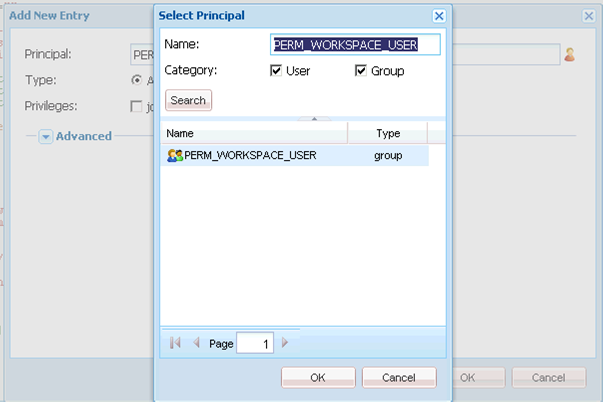

# AEM Forms工作区自定义的常规步骤 {#generic-steps-for-aem-forms-workspace-customization}

执行任何自定义的常规步骤包括：

1. 通过访问`https://'[server]:[port]'/lc/crx/de/index.jsp`登录CRXDE Lite。
1. 在`/apps`处创建一个名为`ws`的`sling:Folder`文件夹（如果它不存在）。 要创建`sling:Folder`文件夹，请右键单击`apps`文件夹并选择&#x200B;**[!UICONTROL 创建]** > **[!UICONTROL 创建节点]**。 将名称指定为`ws`，选择类型为`sling:Folder`，然后单击&#x200B;**[!UICONTROL 确定]**。 单击&#x200B;**[!UICONTROL 全部保存]**。
1. 浏览到`/apps/ws`，然后导航到&#x200B;**[!UICONTROL 访问控制]**&#x200B;选项卡。
1. 选择&#x200B;**[!UICONTROL 存储库]**&#x200B;选项。 在&#x200B;**[!UICONTROL 访问控制]**&#x200B;列表中，单击&#x200B;**[!UICONTROL +]**&#x200B;以添加一个条目。 再次单击&#x200B;**[!UICONTROL +]**。
1. 搜索并选择&#x200B;**PERM_WORKSPACE_USER**&#x200B;主体。

   

1. 将`jcr:read`权限授予主体。
1. 单击&#x200B;**[!UICONTROL 全部保存]**。
1. 将`GET.jsp`、`index`和`html.jsp`文件从`/libs/ws`文件夹复制到`/apps/ws`文件夹。
1. 复制`/apps/ws`文件夹中的`/libs/ws/locales`文件夹。 单击&#x200B;**[!UICONTROL 全部保存]**。
1. 更新`GET.jsp`文件中的引用和相对路径，如下所示，然后单击&#x200B;**[!UICONTROL 全部保存]**。

   ```javascript
   <meta http-equiv="refresh" content="0;URL='/lc/apps/ws/index.html'" />
   ```

1. 对CSS自定义项执行以下操作：

   1. 导航到`/apps/ws`文件夹并创建名为`css`的文件夹。

   1. 在`css`文件夹中，创建一个名为`newStyle.css`的文件。

   1. 打开`/apps/ws/html`.jsp并更改

   ```javascript
   <link lang="en" rel="stylesheet" type="text/css" href="css/style.css" />
   <link lang="en" rel="stylesheet" type="text/css" href="css/jquery-ui.css"/>
   ```

   到

   ```javascript
   <link lang="en" rel="stylesheet" type="text/css" href="../../libs/ws/css/style.css" />
   <link lang="en" rel="stylesheet" type="text/css" href="css/newStyle.css" />
   <link lang="en" rel="stylesheet" type="text/css" href="../../libs/ws/css/jquery-ui.css"/>
   ```

   >[!NOTE]
   >
   >将用户定义CSS文件的条目放在style.css条目之后，如上所示。

1. 在/apps/ws/html.jsp文件中，从

   ```jsp
   <script data-main="js/main" src="js/libs/require/require.js"></script>
   ```

   到

   ```jsp
   <script data-main="js/main" src="../../libs/ws/js/libs/require/require.js"></script>
   ```

1. 执行以下操作：

   1. 在`/apps/ws`处创建名为`js`的文件夹。 单击&#x200B;**[!UICONTROL 全部保存]**。

   1. 在`/apps/ws/js`处创建名为`libs`的文件夹。 单击&#x200B;**[!UICONTROL 全部保存]**。

   1. 将`/libs/ws/js/libs/jqueryui`文件夹复制到`/apps/ws/js/libs`。 单击&#x200B;**[!UICONTROL 全部保存]**。

1. 对HTML自定义执行以下操作：

   1. 在`/apps/ws/js`下，创建名为`runtime`的文件夹。 单击&#x200B;**[!UICONTROL 全部保存]**。

   1. 在`/apps/ws/js/runtime`下，创建名为`templates`的文件夹。 单击&#x200B;**[!UICONTROL 全部保存]**。

   1. 将`/libs/ws/js/main.js`复制到`/apps/ws/js/main.js`。

   1. 将/libs/ws/js/registry.js复制到`/apps/ws/js/registry.js`。

1. 单击&#x200B;**[!UICONTROL 全部保存]**，清除缓存，然后刷新AEM Forms工作区。

   访问URL `https://'[server]:[port]'/lc/ws`并使用管理员/密码凭据登录。 浏览器重定向到`https://'[server]:[port]'/lc/apps/ws/index.html`。
