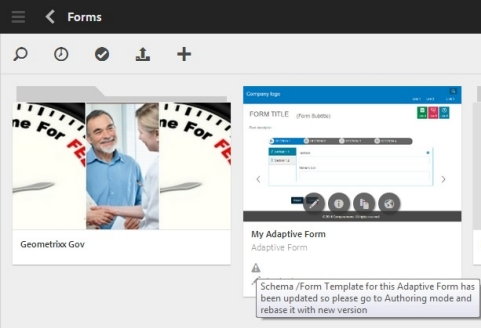

# 在AEM Forms中获取XDP和PDF文档{#getting-xdp-and-pdf-documents-in-aem-forms}

## 概述 {#overview}

您可以通过上传到AEM Forms，将表单从本地文件系统导入到CRX存储库。 以下资产类型支持上传操作：

* 表单模板（XFA表单）
* PDF表单
* 文档(简单PDF文档)

您可以单独上传支持的资产类型，也可以上传为ZIP存档。 您只能在ZIP存档中的XFA表 `Resource`单旁边上传该类型的资产。

>[!NOTE]
>
>确保您是组的成员， `form-power-users` 以便能够上传XDP文件。 请联系您的管理员以成为组成员。

## 上传表单 {#uploading-forms}

1. 通过访问，登录到AEM Forms用户界面 `https://'[server]:[port]'/aem/forms.html`。
1. 导览至要上传表单的文件夹或包含表单的文件夹。
1. 在操作工具栏中，点按创 **建>文件上传**。

   

1. 通过“上传表单”或“包”对话框，您可以浏览并选择要上传的文件。 文件浏览器仅显示支持的文件格式（ZIP、XDP和PDF）。

   >[!NOTE]
   >
   >文件名只能包含字母数字字符、连字符或下划线。

1. 选择文件后单击“上传”以上传文件，或单击“取消”以取消上传。 弹出窗口会列表添加的资产和在当前位置更新的资产。

   >[!NOTE]
   >
   >对于ZIP文件，将显示所有受支持资产的相对路径。 将忽略ZIP中不支持的资源，但不会列出这些资源。 但是，如果ZIP存档仅包含不受支持的资源，则会显示错误消息，而不是弹出对话框。

   

1. 如果一个或多个资产的文件名无效，则会显示错误。 更正以红色突出显示的文件名并重新上传。

   

上传完成后，后台工作流会根据资产的预览为每个资产生成缩略图。 资产的较新版本（如果已上传）会覆盖现有资产。

### 保护模式 {#protected-mode}

AEM Forms服务器允许您运行JavaScript代码。 恶意JavaScript代码可能会损害AEM Forms环境。 “保护”模式将AEM Forms限制为仅从受信任的资产和位置运行XDP文件。 在AEM Forms UI中可用的所有XDP都被视为受信任的资产。

默认情况下，保护模式处于打开状态。 如有必要，您可以禁用保护模式：

1. 以管理员身份登录到AEM Web Console。 URL是https://&#39;[server]:[port]&#39;/system/console/configMgr
1. 打开移动表单配置进行编辑。
1. 取消选择“保护模式”选项，然后单击“ **保存**”。 保护模式被禁用。

## 更新引用的XFA表单 {#updating-referenced-xfa-forms}

在AEM Forms中，XFA表单模板可以由自适应表单或其他XFA表单模板引用。 此外，模板可以引用资源或其他XFA模板。

引用XFA的自适应表单的字段与XFA中可用的字段绑定。 在更新表单模板时，关联的自适应表单会尝试与XFA同步。 有关详细信息，请参 [阅将自适应表单与关联的XFA同步](../../forms/using/synchronizing-adaptive-forms-xfa.md)。

删除表单模板会损坏从属的自适应表单或表单模板。 这种自适应表单有时被非正式地称为脏表单。 在AEM Forms用户界面中，您可以通过以下两种方式查找脏表单。

* 资产列表中的自适应表单缩略图上会显示一个警告图标，当您将指针悬停在警告图标上时，将显示以下消息。\
   `Schema/Form Template for this adaptive form has been updated so please go to Authoring mode and rebase it with new version.`

将保留一个标志，以指示自适应表单是否脏。 此信息可在表单属性页面上找到，并与表单元数据一起提供。 只有对于脏自适应表单，元数据属性才会 `Model Refresh` 显示 `Recommended` 值。

