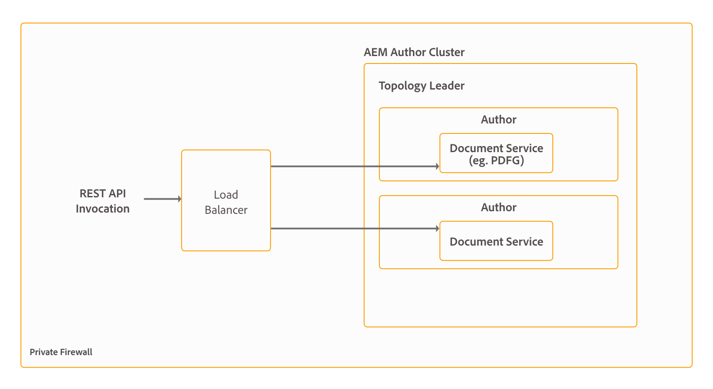

# 安装和配置文档服务 {#installing-and-configuring-document-services}

AEM Forms提供一套OSGi服务来完成不同的文档级别操作，例如，用于创建、汇编、分发和存档PDF文档，添加数字签名以限制对文档的访问，以及对条形码Forms进行解码的服务。 这些服务包含在AEM Forms附加组件包中。 这些服务统称为文档服务。 可用文档服务及其主要功能的列表如下：

* **汇编程序服务：**&#x200B;允许您组合、重新排列和扩充PDF和XDP文档，并获取有关PDF文档的信息。 它还有助于将PDF文档转换并验证为PDF/A标准，将PDF forms、XML表单和PDF forms转换为PDF/A-1b、PDF/A-2b和PDFA/A-3b。 有关详细信息，请参阅[汇编程序服务](/help/forms/using/assembler-service.md)。

* **ConvertPDF服务：**&#x200B;允许您将PDF文档转换为PostScript或图像文件(JPEG、JPEG 2000、PNG和TIFF)。 有关详细信息，请参阅[转换PDF服务](/help/forms/using/using-convertpdf-service.md)。

* **条码Forms服务：**&#x200B;允许您从条码的电子图像中提取数据。 该服务接受包含一个或多个条形码作为输入的TIFF和PDF文件，并提取条形码数据。 有关详细信息，请参阅[条码式Forms服务](/help/forms/using/using-barcoded-forms-service.md)。

* **DocAssurance服务：**&#x200B;使您能够加密和解密文档，使用其他使用权限扩展Adobe Reader的功能，并向文档添加数字签名。 Doc Assurance服务包含三个服务：签名、加密和读取器扩展。 有关详细信息，请参阅[DocAssurance服务](/help/forms/using/overview-aem-document-services.md)。

* **加密服务：**&#x200B;允许您加密和解密文档。 文档加密后，其内容将变得不可读。 授权用户可以解密文档以获取对其内容的访问权限。 有关详细信息，请参阅[加密服务](/help/forms/using/overview-aem-document-services.md#encryption-service)。

* **Forms服务：**&#x200B;允许您创建交互式数据捕获客户端应用程序，这些应用程序验证、处理、转换并交付通常在Forms Designer中创建的表单。 Forms服务会将您开发的任何表单设计渲染到PDF文档。 有关详细信息，请参阅[Forms服务](/help/forms/using/forms-service.md)。

* **输出服务：**&#x200B;允许您创建不同格式的文档，包括PDF、激光打印机格式和标签打印机格式。 激光打印机格式包括PostScript和打印机控制语言(PCL)。 有关详细信息，请参阅[输出服务](/help/forms/using/output-service.md)。

* **PDF Generator服务：** PDF Generator服务提供用于将本机文件格式转换为PDF的API。 它还会将PDF转换为其他文件格式并优化PDF文档的大小。 有关详细信息，请参阅[PDF Generator服务](aem-document-services-programmatically.md#pdfgeneratorservice)。

* **Reader扩展服务：**&#x200B;通过扩展具有附加使用权限的Adobe Reader的功能，使您的组织可以轻松共享交互式PDF文档。 该服务激活在使用Adobe Reader打开PDF文档时不可用的功能，例如向文档添加注释、填写表单和保存文档。 有关详细信息，请参阅[Reader扩展服务](/help/forms/using/overview-aem-document-services.md#reader-extension-service)。

* **签名服务：**&#x200B;允许您在AEM服务器上处理数字签名和文档。 例如，签名服务通常用于以下情况：

   * AEM服务器在将表单发送到用户以使用Acrobat或Adobe Reader打开之前对表单进行认证。
   * AEM服务器使用Acrobat或Adobe Reader验证已添加到表单的签名。
   * AEM服务器代表公共公证人签署表单。

  签名服务访问存储在信任存储中的证书和凭据。 有关详细信息，请参阅[签名服务](/help/forms/using/aem-document-services-programmatically.md)。

AEM Forms是一个功能强大的企业级平台，而文档服务只是AEM Forms的功能之一。 有关功能的完整列表，请参阅[AEM Forms简介](/help/forms/using/introduction-aem-forms.md)。

## 部署拓扑 {#deployment-topology}

AEM Forms附加组件包是部署在AEM上的应用程序。 通常，您只需要一个AEM实例（创作或发布）即可运行AEM Forms文档服务。 建议通过以下拓扑来运行AEM Forms文档服务。 有关拓扑的详细信息，请参阅[AEM Forms的架构和部署拓扑](/help/forms/using/aem-forms-architecture-deployment.md)。



>[!NOTE]
>
>虽然AEM Forms允许您从一台服务器设置和运行所有功能，但您应该进行容量规划、负载平衡，并为生产环境中的特定功能设置专用服务器。 例如，对于使用PDF Generator服务每天转换数千页数据和使用多个自适应表单捕获数据的环境，请为PDF Generator服务和自适应表单功能设置单独的AEM Forms服务器。 它有助于提供最佳性能并扩展相互独立的服务器。

## 系统要求 {#system-requirements}

在开始安装和配置AEM Forms文档服务之前，请确保：

* 硬件和软件基础架构已准备就绪。 有关支持的硬件和软件的详细列表，请参阅[技术要求](/help/sites-deploying/technical-requirements.md)。

* AEM实例的安装路径不包含空格。
* AEM实例已启动并正在运行。 在AEM术语中，“实例”是指以创作或发布模式在服务器上运行的AEM副本。 通常，您只需要一个AEM实例（创作或发布）即可运行AEM Forms文档服务：

   * **作者**：用于创建、上载和编辑内容以及管理网站的AEM实例。 内容准备好上线后，即会复制到发布实例。
   * **发布**：通过Internet或内部网络向公众提供已发布内容的AEM实例。

* 满足内存要求。 AEM Forms附加组件包需要：

   * 用于基于Microsoft® Windows的安装的15 GB临时空间。
   * 用于基于UNIX的安装的6 GB临时空间。

* 已安装在Microsoft®Windows和Linux®上执行PDF生成器转换所需的客户端软件：

   * **Microsoft® Windows**：安装[Microsoft® Office](/help/forms/using/aem-forms-jee-supported-platforms.md#p-software-support-for-pdf-generator-p)或[Apache OpenOffice](/help/forms/using/aem-forms-jee-supported-platforms.md#software-support-for-pdf-generator)
   * **Linux®**：安装[Apache OpenOffice](/help/forms/using/aem-forms-jee-supported-platforms.md#p-software-support-for-pdf-generator-p)

>[!NOTE]
>
>* 在Microsoft® Windows上，PDF Generator支持WebKit、Acrobat WebCapture和WebToPDF转换路径以将HTML文件转换为PDF文档。
>* 在基于UNIX的操作系统上，PDF Generator支持将HTML文件转换为PDF文档的WebKit和WebToPDF转换途径。
>

### 基于UNIX的操作系统的额外要求 {#extrarequirements}

如果使用的是基于UNIX的操作系统，请从相应操作系统的安装介质安装以下32位软件包：
<table>
 <tbody>
  <tr>
   <td>
    <ul>
     <li>外派人员</li>
    </ul> </td>
   <td>
    <ul>
     <li>libxcb</li>
    </ul> </td>
   <td>
    <ul>
     <li>自由类型</li>
    </ul> </td>
   <td>
    <ul>
     <li>libXau</li>
    </ul> </td>
  </tr>
  <tr>
   <td>
    <ul>
     <li>libSM</li>
    </ul> </td>
   <td>
    <ul>
     <li>zlib</li>
    </ul> </td>
   <td>
    <ul>
     <li>libICE</li>
    </ul> </td>
   <td>
    <ul>
     <li>libuuid</li>
    </ul> </td>
  </tr>
  <tr>
   <td>
    <ul>
     <li>glibc</li>
    </ul> </td>
   <td>
    <ul>
     <li>libXext</li>
    </ul> </td>
   <td>
    <ul>
     <li>nss-softokn-freebl</li>
    </ul> </td>
   <td>
    <ul>
     <li>fontconfig</li>
    </ul> </td>
  </tr>
  <tr>
   <td>
    <ul>
     <li>libX11</li>
    </ul> </td>
   <td>
    <ul>
     <li>libXrender</li>
    </ul> </td>
   <td>
    <ul>
     <li>libXrandr</li>
    </ul> </td>
   <td>
    <ul>
     <li>libXinerama</li>
    </ul> </td>
  </tr>
 </tbody>
</table>

* **(仅限PDF Generator**)安装32位版本的libcurl、libcrypto和libssl库并创建以下符号链接。 符号链接指向各个库的最新版本：

   * /usr/lib/libcurl.so
   * /usr/lib/libcrypto.so
   * /usr/lib/libssl.so

* **(仅限PDF Generator)** PDF Generator服务支持将HTML文件转换为PDF文档的WebKit和WebToPDF路由。 要启用WebToPDF路由的转换，请安装下面列出的64位库。 通常，这些库已经安装。 如果缺少任何库，请手动进行安装：

   * linux-gate.so.1
   * libz.so.1
   * libfontconfig.so.1
   * libfreetype.so.6
   * libdl.so.2
   * librt.so.1
   * libpthread.so.0
   * libstdc++.so.6
   * libm.so.6
   * libgcc_s.so.1
   * libc.so.6
   * ld-linux.so.2
   * libexpat.so.1
* (仅限PDF Generator)要在RHEL 8或RHEL 9设置中启用WebKit路由，32位`nspr`库可能默认不可用；如果不存在，请安装它。

* (仅限PDF Generator)如果WebToPDF转换在Unix®服务器上失败，并出现以下错误：

  ```Auto configuration failed 4143511872:error:0E079065:configuration file routines:DEF_LOAD_BIO:missing equal sign:conf_def.c:362:line 57```
然后设置以下环境变量并重新启动服务器：
  `OPENSSL_CONF=/etc/ssl`

>[!NOTE]
>
> WebToPDF还被交互式通信中的“图表”功能使用。 因此，上面提到的WebToPDF的所有配置步骤都可用于确保“图表”功能正常工作。

## 安装前配置 {#preinstallationconfigurations}

预安装配置部分中列出的配置仅适用于PDF Generator服务。 如果未配置PDF Generator服务，则可以跳过安装前配置部分。

### 安装Adobe Acrobat和第三方应用程序 {#install-adobe-acrobat-and-third-party-applications}

如果您要使用PDF Generator服务将本机文件格式(如Microsoft®Word、Microsoft®Excel、Microsoft®PowerPoint、OpenOffice和Adobe Acrobat)转换为PDF文档，请确保在AEM Forms服务器上安装了这些应用程序。

>[!NOTE]
>
><!-- * If your AEM Forms Server is in an offline or secure environment and internet is not available to activate Adobe Acrobat, see [Offline Activation](https://exception.licenses.adobe.com/aoes/aoes/v1/t1?locale=en) for instructions to activate such instances of Adobe Acrobat. -->
>* Adobe Acrobat、Microsoft®Word、Excel和Powerpoint仅适用于Microsoft®Windows。 如果您使用的是基于UNIX的操作系统，请安装OpenOffice以将RTF文件和支持的Microsoft® Office文件转换为PDF文档。
>* 关闭在安装Adobe Acrobat和第三方软件后显示的所有对话框，这些对话框适用于配置为使用PDF Generator服务的所有用户。
>* 至少启动一次所有已安装的软件。 关闭配置为使用PDF Generator服务的所有用户的所有对话框。
>* [检查Adobe Acrobat序列号到期日期](https://helpx.adobe.com/cn/enterprise/kb/volume-license-expiration-check.html)并设置更新许可证的日期，或[根据到期日期迁移序列号](https://www.adobe.com/devnet-docs/acrobatetk/tools/AdminGuide/licensing.html#migrating-your-serial-number)。

### 安装Adobe Acrobat Pro DC

#### 先决条件

在安装Acrobat之前，请查看这些基本要求。 您应该拥有：

* 熟悉[Adobe Admin Console](https://helpx.adobe.com/in/enterprise/admin-guide.html)
* 了解[AEM Forms部署架构](/help/forms/using/aem-forms-architecture-deployment.md)
* Adobe Admin Console和运行AEM Forms的服务器的管理权限。
* 具有Adobe [Admin Console](https://helpx.adobe.com/in/enterprise/using/admin-roles.html)的[管理员访问权限](https://adminconsole.adobe.com)的用户。 通常，组织的管理员已经拥有具有管理员访问权限的用户。 您可以观看此[指导视频](https://www.youtube.com/watch?v=xO2T0I6SvsU&list=PLHRegP5ZOj7CpijZyD8pB9rIMJkvO6FnI&t=81s)，以了解添加管理员的步骤。
* Adobe Admin Console中具有[部署管理员](https://helpx.adobe.com/in/enterprise/global-admin-console/manage-administrators.html)角色的用户帐户。 同一个[说明性视频](https://www.youtube.com/watch?v=xO2T0I6SvsU&list=PLHRegP5ZOj7CpijZyD8pB9rIMJkvO6FnI&t=81s)演示了如何添加部署管理员。
* 运行AEM Forms的计算机上的本地管理员权限
* Windows 64位操作系统
* 用于许可证激活的稳定互联网连接
<!-- Backup solution for existing Acrobat settings
 Supported version of Adobe Acrobat (see [Adobe documentation](https://helpx.adobe.com/acrobat/kb/acrobat-dc-compatibility-with-windows-macos.html) for details) -->


#### 实施工作流程和时间表

根据您的环境，完成此过程通常需要1-2个小时：

| 步骤 | 估计时间 | 先决条件 |
|------|----------------|---------------|
| 1.在Admin Console中创建FRL包) | 15-20 分钟 | [Admin Console访问权限](https://helpx.adobe.com/in/enterprise/admin-guide.html) |
| 2.授予下载权限 | 5-10 分钟 | [Admin Console访问权限](https://helpx.adobe.com/in/enterprise/global-admin-console/manage-administrators.html) |
| 3.卸载以前的Acrobat | 10-15 分钟 | 服务器管理员访问权限 |
| 4.下载并安装Adobe Acrobat Pro | 10-15 分钟 | 服务器管理员访问权限 |
| 5.下载并部署FRL包 | 20-30 分钟 | 服务器管理员访问权限 |
| 6.验证安装 | 5-10 分钟 | 服务器访问 |

<!--  -->

**选择安装路径**

Adobe Acrobat Pro DC for Microsoft Office的安装过程会因您的许可证类型和部署方案而略有不同。 要确保您遵循特定环境的正确步骤，请选择与您的配置匹配的选项卡：

* **许可证类型**：零售或批量许可证
* **部署类型**：单个用户或多个用户

每个选项卡都包含针对特定设置而优化的定制说明，帮助您避免配置问题并确保适当的许可合规性。

>[!VIDEO](https://video.tv.adobe.com/v/3469669)

>[!NOTE]
>
>此视频演示了“零售许可证 — 单用户”配置的安装过程。 对于其他部署方案（零售 — 多个用户、批量许可 — 单个用户或批量许可 — 多个用户），请参阅以下相应选项卡中的具体步骤9说明，以确保针对您的部署类型正确启动服务器和激活许可证。

>[!BEGINTABS]

>[!TAB 零售许可证 — 单个用户]

#### 在您的AEM Forms服务器上为Adobe Acrobat设置功能限制许可(FRL)

这些步骤假定您对Adobe Admin Console和运行AEM Forms的服务器都拥有必要的管理权限。

##### 准备FRL包(Adobe Admin Console)

这些步骤将通过对Adobe Admin Console的&#x200B;*系统管理员*&#x200B;访问权限来执行。

###### 步骤1：登录到Adobe Admin Console

1. 打开Web浏览器并导航到[Adobe Admin Console](https://adminconsole.adobe.com/)
1. 使用具有&#x200B;*系统管理员*&#x200B;权限的帐户登录。
1. （可选）如果您的组织有权访问多个IMS组织，请使用Admin Console右上角的组织选择选项来选择正确的组织。 在大多数客户情景中，这已设置为贵组织的默认值，因为用户通常只能访问自己的组织。

###### 步骤2：创建FRL包

1. 在Admin Console中，导航到“包”选项卡。 这是一个Adobe Admin Console包，而不是AEM包。
1. 选择&#x200B;**功能受限许可证**&#x200B;卡并单击&#x200B;**开始**&#x200B;按钮。 请确保选择正确的许可证类型。
1. 在&#x200B;**创建包**&#x200B;屏幕上，配置包设置：

   | 设置 | 建议值 | 注释 |
   |---------|-------------------|-------|
   | 激活方法 | 离线 | 推荐的选项 |
   | 权利 | PDF生成(PDFG) | AEM Forms PDF Generator功能需要 |
   | 配置平台 | Windows 64位 | 当前不支持Apple macOS |
   | 启用本地 | “使用OS语言” | 默认设置 |
   | 语言 | 您的首选语言 | 对于Acrobat界面 |
   | 选择应用程序 — 可用的应用程序 | 将Adobe Acrobat保留在可用应用程序中。 不移动到选定的应用程序 | 在步骤6中，您需要[从Adobe Experience League页面](#step-6-download-and-install-adobe-acrobat-pro)下载Adobe Acrobat。 |
   | 选择应用程序 — 选定的应用程序 | 仅保留选定应用程序中的许可证文件 | FRL部署的默认设置 |
   | 插件 | 不在此屏幕上做任何更改 | |
   | 选项 | 不在此屏幕上做任何更改 | |
   | 完成 | 包名称：“Acrobat FRL AEM Forms” | 使用描述性名称 |

1. 单击&#x200B;**创建**&#x200B;以创建包。

###### 步骤3：向用户提供下载权限

建议创建一个专用服务帐户来管理FRL包。 如果您还没有专用帐户，可以关注[本指导视频](https://www.youtube.com/watch?v=w8b36YX2TEM&t=59s)以了解如何向Adobe组织添加新用户。

拥有相应的帐户后，请按照以下步骤授予下载权限：

1. 在Admin Console中，导航到&#x200B;**用户**&#x200B;选项卡。
2. 查找或创建用户帐户以授予下载权限。
3. 单击用户的名称以打开其配置文件。
4. 单击用户&#x200B;**编辑管理权限**&#x200B;旁边的图标。
5. 将&#x200B;**部署管理员**&#x200B;角色分配给用户。 其他管理员角色也可以使用，但部署管理员是推荐的角色。 单击&#x200B;**保存**。


##### 部署FRL包(AEM Forms Server)

在AEM Forms服务器上执行以下步骤，并拥有对该计算机的&#x200B;*本地管理员*&#x200B;权限。

###### 步骤4：以管理员身份登录到运行AEM Forms的服务器

使用适当的方法访问运行AEM Forms的服务器。 确保使用具有本地管理员权限的帐户来访问服务器。

###### 步骤5：卸载以前版本的Acrobat（如果有）

**关键：**&#x200B;在卸载之前备份任何自定义Acrobat设置、配置文件或配置。

1. 打开Windows控制面板。
2. 导航到&#x200B;**设置**&#x200B;并打开&#x200B;**应用**。
3. 在已安装程序列表中找到&#x200B;**Adobe Acrobat**
4. 选择&#x200B;**卸载**，然后按照提示删除应用程序。 如果出现提示，请重新启动服务器
5. 确保卸载该程序的所有Classic版本。 如果需要完全删除，请使用[Adobe Acrobat清洁器工具](https://helpx.adobe.com/acrobat/kb/remove-reader-dc-acrobat-dc.html)。

###### 步骤6：下载并安装Adobe Acrobat Pro

卸载以前的版本后，您需要下载并安装兼容的Adobe Acrobat Pro版本：

1. 转到[Adobe Acrobat DC下载页面](https://helpx.adobe.com/in/acrobat/kb/acrobat-dc-downloads.html)。
2. 导航到&#x200B;**Acrobat Pro安装程序**&#x200B;部分。
3. 要与AEM Forms PDF Generator一起使用，请下载“适用于Windows（32位）”安装程序，因为这是AEM Forms PDF Generator支持的版本。
4. 按照页面上的安装说明进行操作：
   * 将下载的zip文件解压到计算机上的文件夹中
   * 导航到Setup.exe文件（不要从zip文件中运行Setup.exe文件）
   * 双击Setup.exe开始安装
   * 按照屏幕上的说明完成安装
5. 安装后，打开Adobe Acrobat Pro并通过取消任何欢迎对话框完成初始设置。
6. 通过创建一个简单的PDF来验证安装。

###### 步骤7：下载FRL包

1. 使用您在步骤3中向提供的[用户帐户](https://adminconsole.adobe.com/)登录到&#x200B;*Adobe Admin Console*。
1. 导航到&#x200B;**包**&#x200B;选项卡。
1. 找到您在步骤2中创建的FRL包(名为“Acrobat FRL AEM Forms”或您的自定义包名称)。
1. 单击&#x200B;**下载**&#x200B;以将包下载到服务器。

###### 步骤8：部署包

1. **解压缩包：**&#x200B;将下载的ZIP文件的内容解压缩到服务器上的目录（例如，`C:\AcrobatFRL`）。 确保可轻松访问提取目录。

2. **以管理员身份打开命令提示符(Windows)：**&#x200B;右键单击“开始”按钮并选择“命令提示符(Admin)”或“Windows PowerShell (Admin)”

3. **导航到提取目录：**

   ```cmd
   cd C:\AcrobatFRL
   ```

4. **运行激活命令：**

   ```cmd
   # Command syntax
   adobe-licensing-toolkit.exe -p -i -f [JSON_FILE_NAME].json
   
   # Example with actual values
   adobe-licensing-toolkit.exe -p -i -f ngl-preconditioning-data.json
   ```

   > **重要信息：**
   > * 将`<JSON_FILE_NAME>.json`替换为提取包中JSON文件的&#x200B;*确切*&#x200B;文件名。
   > * JSON文件名区分大小写。
   > * 双击文件名以查看拼写错误。

   **预期输出：**

   ```
   Adobe Licensing Toolkit (1.1.0.130)
   Operation Successfully Completed
   ```

   > ℹ️ **注意：**&#x200B;激活过程可能需要大约30秒。

5. **了解命令参数：**

   | 参数 | 描述 |
   |-----------|-------------|
   | `-p` | 指定平台（自动检测操作系统） |
   | `-i` | 指示工具安装和激活许可证 |
   | `-f` | 指定JSON许可证文件的路径 |

###### 步骤9：测试PDF Generator服务

完成所有流程后，请执行快速操作测试以确认安装有效：

1. 打开AEM Forms管理界面
2. 导航到PDF Generator服务
3. 尝试将简单的Microsoft Office文档转换为PDF
4. 验证转换是否成功完成

#### 在FRL激活后验证Acrobat版本

1. 在服务器上打开Adobe Acrobat Pro DC
2. 转到有关Adobe Acrobat Pro DC的帮助→
3. 验证版本号是否与预期版本匹配
4. 确认许可证状态显示为已激活

>[!TAB 零售许可证 — 多个用户]

#### 在您的AEM Forms服务器上为Adobe Acrobat设置功能限制许可(FRL)

这些步骤假定您对Adobe Admin Console和运行AEM Forms的服务器都拥有必要的管理权限。

##### 准备FRL包(Adobe Admin Console)

这些步骤将通过对Adobe Admin Console的&#x200B;*系统管理员*&#x200B;访问权限来执行。

###### 步骤1：登录到Adobe Admin Console

1. 打开Web浏览器并导航到[Adobe Admin Console](https://adminconsole.adobe.com/)
1. 使用具有&#x200B;*系统管理员*&#x200B;权限的帐户登录。
1. （可选）如果您的组织有权访问多个IMS组织，请使用Admin Console右上角的组织选择选项来选择正确的组织。 在大多数客户情景中，这已设置为贵组织的默认值，因为用户通常只能访问自己的组织。

###### 步骤2：创建FRL包

1. 在Admin Console中，导航到“包”选项卡。 这是一个Adobe Admin Console包，而不是AEM包。
1. 选择&#x200B;**功能受限许可证**&#x200B;卡并单击&#x200B;**开始**&#x200B;按钮。 请确保选择正确的许可证类型。
1. 在&#x200B;**创建包**&#x200B;屏幕上，配置包设置：

   | 设置 | 建议值 | 注释 |
   |---------|-------------------|-------|
   | 激活方法 | 离线 | 推荐的选项 |
   | 权利 | PDF生成(PDFG) | AEM Forms PDF Generator功能需要 |
   | 配置平台 | Windows 64位 | 当前不支持Apple macOS |
   | 启用本地 | “使用OS语言” | 默认设置 |
   | 语言 | 您的首选语言 | 对于Acrobat界面 |
   | 选择应用程序 — 可用的应用程序 | 将Adobe Acrobat保留在可用应用程序中。 不移动到选定的应用程序 | 在步骤6中，您需要[从Adobe Experience League页面](#step-6-download-and-install-adobe-acrobat-pro)下载Adobe Acrobat。 |
   | 选择应用程序 — 选定的应用程序 | 仅保留选定应用程序中的许可证文件 | FRL部署的默认设置 |
   | 插件 | 不在此屏幕上做任何更改 | |
   | 选项 | 不在此屏幕上做任何更改 | |
   | 完成 | 包名称：“Acrobat FRL AEM Forms” | 使用描述性名称 |

1. 单击&#x200B;**创建**&#x200B;以创建包。

###### 步骤3：向用户提供下载权限

建议创建一个专用服务帐户来管理FRL包。 如果您还没有专用帐户，可以关注[本指导视频](https://www.youtube.com/watch?v=w8b36YX2TEM&t=59s)以了解如何向Adobe组织添加新用户。

拥有相应的帐户后，请按照以下步骤授予下载权限：

1. 在Admin Console中，导航到&#x200B;**用户**&#x200B;选项卡。
2. 查找或创建用户帐户以授予下载权限。
3. 单击用户的名称以打开其配置文件。
4. 单击用户&#x200B;**编辑管理权限**&#x200B;旁边的图标。
5. 将&#x200B;**部署管理员**&#x200B;角色分配给用户。 其他管理员角色也可以使用，但部署管理员是推荐的角色。 单击&#x200B;**保存**。


##### 部署FRL包(AEM Forms Server)

在AEM Forms服务器上执行以下步骤，并拥有对该计算机的&#x200B;*本地管理员*&#x200B;权限。

###### 步骤4：以管理员身份登录到运行AEM Forms的服务器

使用适当的方法访问运行AEM Forms的服务器。 确保使用具有本地管理员权限的帐户来访问服务器。

###### 步骤5：卸载以前版本的Acrobat（如果有）

**关键：**&#x200B;在卸载之前备份任何自定义Acrobat设置、配置文件或配置。

1. 打开Windows控制面板。
2. 导航到&#x200B;**设置**&#x200B;并打开&#x200B;**应用**。
3. 在已安装程序列表中找到&#x200B;**Adobe Acrobat**
4. 选择&#x200B;**卸载**，然后按照提示删除应用程序。 如果出现提示，请重新启动服务器
5. 确保卸载该程序的所有Classic版本。 如果需要完全删除，请使用[Adobe Acrobat清洁器工具](https://helpx.adobe.com/acrobat/kb/remove-reader-dc-acrobat-dc.html)。

###### 步骤6：下载并安装Adobe Acrobat Pro

卸载以前的版本后，您需要下载并安装兼容的Adobe Acrobat Pro版本：

1. 转到[Adobe Acrobat DC下载页面](https://helpx.adobe.com/in/acrobat/kb/acrobat-dc-downloads.html)。
2. 导航到&#x200B;**Acrobat Pro安装程序**&#x200B;部分。
3. 要与AEM Forms PDF Generator一起使用，请下载“适用于Windows（32位）”安装程序，因为这是AEM Forms PDF Generator支持的版本。
4. 按照页面上的安装说明进行操作：
   * 将下载的zip文件解压到计算机上的文件夹中
   * 导航到Setup.exe文件（不要从zip文件中运行Setup.exe文件）
   * 双击Setup.exe开始安装
   * 按照屏幕上的说明完成安装
5. 安装后，打开Adobe Acrobat Pro并通过取消任何欢迎对话框完成初始设置。
6. 通过创建一个简单的PDF来验证安装。

###### 步骤7：下载FRL包

1. 使用您在步骤3中向提供的[用户帐户](https://adminconsole.adobe.com/)登录到&#x200B;*Adobe Admin Console*。
1. 导航到&#x200B;**包**&#x200B;选项卡。
1. 找到您在步骤2中创建的FRL包(名为“Acrobat FRL AEM Forms”或您的自定义包名称)。
1. 单击&#x200B;**下载**&#x200B;以将包下载到服务器。

###### 步骤8：部署包

1. **解压缩包：**&#x200B;将下载的ZIP文件的内容解压缩到服务器上的目录（例如，`C:\AcrobatFRL`）。 确保可轻松访问提取目录。

2. **以管理员身份打开命令提示符(Windows)：**&#x200B;右键单击“开始”按钮并选择“命令提示符(Admin)”或“Windows PowerShell (Admin)”

3. **导航到提取目录：**

   ```cmd
   cd C:\AcrobatFRL
   ```

4. **运行激活命令：**

   ```cmd
   # Command syntax
   adobe-licensing-toolkit.exe -p -i -f [JSON_FILE_NAME].json
   
   # Example with actual values
   adobe-licensing-toolkit.exe -p -i -f ngl-preconditioning-data.json
   ```

   > **重要信息：**
   > * 将`<JSON_FILE_NAME>.json`替换为提取包中JSON文件的&#x200B;*确切*&#x200B;文件名。
   > * JSON文件名区分大小写。
   > * 双击文件名以查看拼写错误。

   **预期输出：**

   ```
   Adobe Licensing Toolkit (1.1.0.130)
   Operation Successfully Completed
   ```

   > ℹ️ **注意：**&#x200B;激活过程可能需要大约30秒。

5. **了解命令参数：**

   | 参数 | 描述 |
   |-----------|-------------|
   | `-p` | 指定平台（自动检测操作系统） |
   | `-i` | 指示工具安装和激活许可证 |
   | `-f` | 指定JSON许可证文件的路径 |

###### 步骤9：启动AEM Forms服务器

完成所有流程后，请执行快速操作测试以确认安装有效：

1. 从交互式用户会话中的命令行控制台启动AEM Forms服务器。 (登录到服务器并从命令行手动启动AEM Forms。)
2. 启动服务器后，使用户会话保持活动状态。 请勿注销计算机，因为这将终止服务器进程。 您可以安全地关闭远程桌面(RDP)窗口而不注销；只要会话保持活动状态，服务器就会继续运行。
3. 为了提高可靠性，请将启动任务或计划任务配置为在用户登录时自动启动AEM Forms服务器。

###### 步骤10测试PDF Generator服务

1. 打开AEM Forms管理界面
2. 导航到PDF Generator服务
3. 尝试将简单的Microsoft Office文档转换为PDF
4. 验证转换是否成功完成

#### 在FRL激活后验证Acrobat版本

1. 在服务器上打开Adobe Acrobat Pro DC
2. 转到有关Adobe Acrobat Pro DC的帮助→
3. 验证版本号是否与预期版本匹配
4. 确认许可证状态显示为已激活

>[!TAB 批量许可证 — 单个用户]

#### 在您的AEM Forms服务器上为Adobe Acrobat设置功能限制许可(FRL)

这些步骤假定您对Adobe Admin Console和运行AEM Forms的服务器都拥有必要的管理权限。

##### 准备FRL包(Adobe Admin Console)

这些步骤将通过对Adobe Admin Console的&#x200B;*系统管理员*&#x200B;访问权限来执行。

###### 步骤1：登录到Adobe Admin Console

1. 打开Web浏览器并导航到[Adobe Admin Console](https://adminconsole.adobe.com/)
1. 使用具有&#x200B;*系统管理员*&#x200B;权限的帐户登录。
1. （可选）如果您的组织有权访问多个IMS组织，请使用Admin Console右上角的组织选择选项来选择正确的组织。 在大多数客户情景中，这已设置为贵组织的默认值，因为用户通常只能访问自己的组织。

###### 步骤2：创建FRL包

1. 在Admin Console中，导航到“包”选项卡。 这是一个Adobe Admin Console包，而不是AEM包。
1. 选择&#x200B;**功能受限许可证**&#x200B;卡并单击&#x200B;**开始**&#x200B;按钮。 请确保选择正确的许可证类型。
1. 在&#x200B;**创建包**&#x200B;屏幕上，配置包设置：

   | 设置 | 建议值 | 注释 |
   |---------|-------------------|-------|
   | 激活方法 | 离线 | 推荐的选项 |
   | 权利 | PDF生成(PDFG) | AEM Forms PDF Generator功能需要 |
   | 配置平台 | Windows 64位 | 当前不支持Apple macOS |
   | 启用本地 | “使用OS语言” | 默认设置 |
   | 语言 | 您的首选语言 | 对于Acrobat界面 |
   | 选择应用程序 — 可用的应用程序 | 将Adobe Acrobat保留在可用应用程序中。 不移动到选定的应用程序 | 在步骤6中，您需要[从Adobe Experience League页面](#step-6-download-and-install-adobe-acrobat-pro)下载Adobe Acrobat。 |
   | 选择应用程序 — 选定的应用程序 | 仅保留选定应用程序中的许可证文件 | FRL部署的默认设置 |
   | 插件 | 不在此屏幕上做任何更改 | |
   | 选项 | 不在此屏幕上做任何更改 | |
   | 完成 | 包名称：“Acrobat FRL AEM Forms” | 使用描述性名称 |

1. 单击&#x200B;**创建**&#x200B;以创建包。

###### 步骤3：向用户提供下载权限

建议创建一个专用服务帐户来管理FRL包。 如果您还没有专用帐户，可以关注[本指导视频](https://www.youtube.com/watch?v=w8b36YX2TEM&t=59s)以了解如何向Adobe组织添加新用户。

拥有相应的帐户后，请按照以下步骤授予下载权限：

1. 在Admin Console中，导航到&#x200B;**用户**&#x200B;选项卡。
2. 查找或创建用户帐户以授予下载权限。
3. 单击用户的名称以打开其配置文件。
4. 单击用户&#x200B;**编辑管理权限**&#x200B;旁边的图标。
5. 将&#x200B;**部署管理员**&#x200B;角色分配给用户。 其他管理员角色也可以使用，但部署管理员是推荐的角色。 单击&#x200B;**保存**。


##### 部署FRL包(AEM Forms Server)

在AEM Forms服务器上执行以下步骤，并拥有对该计算机的&#x200B;*本地管理员*&#x200B;权限。

###### 步骤4：以管理员身份登录到运行AEM Forms的服务器

使用适当的方法访问运行AEM Forms的服务器。 确保使用具有本地管理员权限的帐户来访问服务器。

###### 步骤5：卸载以前版本的Acrobat（如果有）

**关键：**&#x200B;在卸载之前备份任何自定义Acrobat设置、配置文件或配置。

1. 打开Windows控制面板。
2. 导航到&#x200B;**设置**&#x200B;并打开&#x200B;**应用**。
3. 在已安装程序列表中找到&#x200B;**Adobe Acrobat**
4. 选择&#x200B;**卸载**，然后按照提示删除应用程序。 如果出现提示，请重新启动服务器
5. 确保卸载该程序的所有Classic版本。 如果需要完全删除，请使用[Adobe Acrobat清洁器工具](https://helpx.adobe.com/acrobat/kb/remove-reader-dc-acrobat-dc.html)。

###### 步骤6：下载并安装Adobe Acrobat Pro

卸载以前的版本后，您需要下载并安装兼容的Adobe Acrobat Pro版本：

1. 转到[Adobe Acrobat DC下载页面](https://helpx.adobe.com/in/acrobat/kb/acrobat-dc-downloads.html)。
2. 导航到&#x200B;**Acrobat Pro安装程序**&#x200B;部分。
3. 要与AEM Forms PDF Generator一起使用，请下载“适用于Windows（32位）”安装程序，因为这是AEM Forms PDF Generator支持的版本。
4. 按照页面上的安装说明进行操作：
   * 将下载的zip文件解压到计算机上的文件夹中
   * 导航到Setup.exe文件（不要从zip文件中运行Setup.exe文件）
   * 双击Setup.exe开始安装
   * 按照屏幕上的说明完成安装
5. 安装后，打开Adobe Acrobat Pro并通过取消任何欢迎对话框完成初始设置。
6. 通过创建一个简单的PDF来验证安装。

###### 步骤7：下载FRL包

1. 使用您在步骤3中向提供的[用户帐户](https://adminconsole.adobe.com/)登录到&#x200B;*Adobe Admin Console*。
1. 导航到&#x200B;**包**&#x200B;选项卡。
1. 找到您在步骤2中创建的FRL包(名为“Acrobat FRL AEM Forms”或您的自定义包名称)。
1. 单击&#x200B;**下载**&#x200B;以将包下载到服务器。

###### 步骤8：部署包

1. **解压缩包：**&#x200B;将下载的ZIP文件的内容解压缩到服务器上的目录（例如，`C:\AcrobatFRL`）。 确保可轻松访问提取目录。

2. **以管理员身份打开命令提示符(Windows)：**&#x200B;右键单击“开始”按钮并选择“命令提示符(Admin)”或“Windows PowerShell (Admin)”

3. **导航到提取目录：**

   ```cmd
   cd C:\AcrobatFRL
   ```

4. **运行激活命令：**

   ```cmd
   # Command syntax
   adobe-licensing-toolkit.exe -p -i -f [JSON_FILE_NAME].json
   
   # Example with actual values
   adobe-licensing-toolkit.exe -p -i -f ngl-preconditioning-data.json
   ```

   > **重要信息：**
   > * 将`<JSON_FILE_NAME>.json`替换为提取包中JSON文件的&#x200B;*确切*&#x200B;文件名。
   > * JSON文件名区分大小写。
   > * 双击文件名以查看拼写错误。

   **预期输出：**

   ```
   Adobe Licensing Toolkit (1.1.0.130)
   Operation Successfully Completed
   ```

   > ℹ️ **注意：**&#x200B;激活过程可能需要大约30秒。

5. **了解命令参数：**

   | 参数 | 描述 |
   |-----------|-------------|
   | `-p` | 指定平台（自动检测操作系统） |
   | `-i` | 指示工具安装和激活许可证 |
   | `-f` | 指定JSON许可证文件的路径 |

###### 步骤9：启动AEM Forms服务器

完成所有流程后，请执行快速操作测试以确认安装有效：

1. 使用远程桌面(RDP)登录到服务器并使用服务启动AEM Forms服务器。
2. 服务器运行后，不要简单地关闭RDP窗口。 相反，通过注销用户来正常注销 — 这可以确保会话完全结束，同时服务继续在后台运行。

###### 步骤10：测试PDF Generator服务

完成所有流程后，请执行快速操作测试以确认安装有效：

1. 打开AEM Forms管理界面
2. 导航到PDF Generator服务
3. 尝试将简单的Microsoft Office文档转换为PDF
4. 验证转换是否成功完成

###### 步骤11：在FRL激活后验证Acrobat版本

1. 在服务器上打开Adobe Acrobat Pro DC
2. 转到有关Adobe Acrobat Pro DC的帮助→
3. 验证版本号是否与预期版本匹配
4. 确认许可证状态显示为已激活

>[!TAB 批量许可证 — 多个用户]

#### 在您的AEM Forms服务器上为Adobe Acrobat设置功能限制许可(FRL)

这些步骤假定您对Adobe Admin Console和运行AEM Forms的服务器都拥有必要的管理权限。

##### 准备FRL包(Adobe Admin Console)

这些步骤将通过对Adobe Admin Console的&#x200B;*系统管理员*&#x200B;访问权限来执行。

###### 步骤1：登录到Adobe Admin Console

1. 打开Web浏览器并导航到[Adobe Admin Console](https://adminconsole.adobe.com/)
1. 使用具有&#x200B;*系统管理员*&#x200B;权限的帐户登录。
1. （可选）如果您的组织有权访问多个IMS组织，请使用Admin Console右上角的组织选择选项来选择正确的组织。 在大多数客户情景中，这已设置为贵组织的默认值，因为用户通常只能访问自己的组织。

###### 步骤2：创建FRL包

1. 在Admin Console中，导航到“包”选项卡。 这是一个Adobe Admin Console包，而不是AEM包。
1. 选择&#x200B;**功能受限许可证**&#x200B;卡并单击&#x200B;**开始**&#x200B;按钮。 请确保选择正确的许可证类型。
1. 在&#x200B;**创建包**&#x200B;屏幕上，配置包设置：

   | 设置 | 建议值 | 注释 |
   |---------|-------------------|-------|
   | 激活方法 | 离线 | 推荐的选项 |
   | 权利 | PDF生成(PDFG) | AEM Forms PDF Generator功能需要 |
   | 配置平台 | Windows 64位 | 当前不支持Apple macOS |
   | 启用本地 | “使用OS语言” | 默认设置 |
   | 语言 | 您的首选语言 | 对于Acrobat界面 |
   | 选择应用程序 — 可用的应用程序 | 将Adobe Acrobat保留在可用应用程序中。 不移动到选定的应用程序 | 在步骤6中，您需要[从Adobe Experience League页面](#step-6-download-and-install-adobe-acrobat-pro)下载Adobe Acrobat。 |
   | 选择应用程序 — 选定的应用程序 | 仅保留选定应用程序中的许可证文件 | FRL部署的默认设置 |
   | 插件 | 不在此屏幕上做任何更改 | |
   | 选项 | 不在此屏幕上做任何更改 | |
   | 完成 | 包名称：“Acrobat FRL AEM Forms” | 使用描述性名称 |

1. 单击&#x200B;**创建**&#x200B;以创建包。

###### 步骤3：向用户提供下载权限

建议创建一个专用服务帐户来管理FRL包。 如果您还没有专用帐户，可以关注[本指导视频](https://www.youtube.com/watch?v=w8b36YX2TEM&t=59s)以了解如何向Adobe组织添加新用户。

拥有相应的帐户后，请按照以下步骤授予下载权限：

1. 在Admin Console中，导航到&#x200B;**用户**&#x200B;选项卡。
2. 查找或创建用户帐户以授予下载权限。
3. 单击用户的名称以打开其配置文件。
4. 单击用户&#x200B;**编辑管理权限**&#x200B;旁边的图标。
5. 将&#x200B;**部署管理员**&#x200B;角色分配给用户。 其他管理员角色也可以使用，但部署管理员是推荐的角色。 单击&#x200B;**保存**。


##### 部署FRL包(AEM Forms Server)

在AEM Forms服务器上执行以下步骤，并拥有对该计算机的&#x200B;*本地管理员*&#x200B;权限。

###### 步骤4：以管理员身份登录到运行AEM Forms的服务器

使用适当的方法访问运行AEM Forms的服务器。 确保使用具有本地管理员权限的帐户来访问服务器。

###### 步骤5：卸载以前版本的Acrobat（如果有）

**关键：**&#x200B;在卸载之前备份任何自定义Acrobat设置、配置文件或配置。

1. 打开Windows控制面板。
2. 导航到&#x200B;**设置**&#x200B;并打开&#x200B;**应用**。
3. 在已安装程序列表中找到&#x200B;**Adobe Acrobat**
4. 选择&#x200B;**卸载**，然后按照提示删除应用程序。 如果出现提示，请重新启动服务器
5. 确保卸载该程序的所有Classic版本。 如果需要完全删除，请使用[Adobe Acrobat清洁器工具](https://helpx.adobe.com/acrobat/kb/remove-reader-dc-acrobat-dc.html)。

###### 步骤6：下载并安装Adobe Acrobat Pro

卸载以前的版本后，您需要下载并安装兼容的Adobe Acrobat Pro版本：

1. 转到[Adobe Acrobat DC下载页面](https://helpx.adobe.com/in/acrobat/kb/acrobat-dc-downloads.html)。
2. 导航到&#x200B;**Acrobat Pro安装程序**&#x200B;部分。
3. 要与AEM Forms PDF Generator一起使用，请下载“适用于Windows（32位）”安装程序，因为这是AEM Forms PDF Generator支持的版本。
4. 按照页面上的安装说明进行操作：
   * 将下载的zip文件解压到计算机上的文件夹中
   * 导航到Setup.exe文件（不要从zip文件中运行Setup.exe文件）
   * 双击Setup.exe开始安装
   * 按照屏幕上的说明完成安装
5. 安装后，打开Adobe Acrobat Pro并通过取消任何欢迎对话框完成初始设置。
6. 通过创建一个简单的PDF来验证安装。

###### 步骤7：下载FRL包

1. 使用您在步骤3中向提供的[用户帐户](https://adminconsole.adobe.com/)登录到&#x200B;*Adobe Admin Console*。
1. 导航到&#x200B;**包**&#x200B;选项卡。
1. 找到您在步骤2中创建的FRL包(名为“Acrobat FRL AEM Forms”或您的自定义包名称)。
1. 单击&#x200B;**下载**&#x200B;以将包下载到服务器。

###### 步骤8：部署包

1. **解压缩包：**&#x200B;将下载的ZIP文件的内容解压缩到服务器上的目录（例如，`C:\AcrobatFRL`）。 确保可轻松访问提取目录。

2. **以管理员身份打开命令提示符(Windows)：**&#x200B;右键单击“开始”按钮并选择“命令提示符(Admin)”或“Windows PowerShell (Admin)”

3. **导航到提取目录：**

   ```cmd
   cd C:\AcrobatFRL
   ```

4. **运行激活命令：**

   ```cmd
   # Command syntax
   adobe-licensing-toolkit.exe -p -i -f [JSON_FILE_NAME].json
   
   # Example with actual values
   adobe-licensing-toolkit.exe -p -i -f ngl-preconditioning-data.json
   ```

   > **重要信息：**
   > * 将`<JSON_FILE_NAME>.json`替换为提取包中JSON文件的&#x200B;*确切*&#x200B;文件名。
   > * JSON文件名区分大小写。
   > * 双击文件名以查看拼写错误。

   **预期输出：**

   ```
   Adobe Licensing Toolkit (1.1.0.130)
   Operation Successfully Completed
   ```

   > ℹ️ **注意：**&#x200B;激活过程可能需要大约30秒。

5. **了解命令参数：**

   | 参数 | 描述 |
   |-----------|-------------|
   | `-p` | 指定平台（自动检测操作系统） |
   | `-i` | 指示工具安装和激活许可证 |
   | `-f` | 指定JSON许可证文件的路径 |

###### 步骤9：启动AEM Forms服务器

完成所有流程后，请执行快速操作测试以确认安装有效：

1. 从交互式用户会话中的命令行控制台启动AEM Forms服务器。 (登录到服务器并从命令行手动启动AEM Forms。)
2. 启动服务器后，使用户会话保持活动状态。 请勿注销计算机，因为这将终止服务器进程。 您可以安全地关闭远程桌面(RDP)窗口而不注销；只要会话保持活动状态，服务器就会继续运行。
3. 为了提高可靠性，请将启动任务或计划任务配置为在用户登录时自动启动AEM Forms服务器。

###### 步骤10：测试PDF Generator服务

完成所有流程后，请执行快速操作测试以确认安装有效：

1. 打开AEM Forms管理界面
2. 导航到PDF Generator服务
3. 尝试将简单的Microsoft Office文档转换为PDF
4. 验证转换是否成功完成

#### 在FRL激活后验证Acrobat版本

1. 在服务器上打开Adobe Acrobat Pro DC
2. 转到有关Adobe Acrobat Pro DC的帮助→
3. 验证版本号是否与预期版本匹配
4. 确认许可证状态显示为已激活

>[!ENDTABS]


### 在Acrobat中启动时禁用保护模式

在启用功能限制许可(FRL)并验证Acrobat激活后，建议在Adobe Acrobat中禁用“启动时保护模式”，以确保与AEM Forms PDF Generator兼容。

请按照以下步骤操作：

1. 在服务器上打开&#x200B;**Adobe Acrobat Pro DC**。
2. 转到&#x200B;**菜单** > **首选项**。
3. 在“首选项”窗口中，从左窗格中选择&#x200B;**安全性（增强型）**。
4. 在&#x200B;**沙盒保护**&#x200B;部分中，**取消选中**&#x200B;选项&#x200B;**“启动时启用保护模式”**。
5. 如果提示确认，请单击&#x200B;**是**。
6. 单击&#x200B;**确定**&#x200B;保存更改并关闭“首选项”窗口。
7. 重新启动Adobe Acrobat Pro DC以使更改生效。

>[!NOTE]
>
>服务器端自动化方案(如AEM Forms PDF Generator)需要禁用保护模式。 此设置只能在专用服务器环境中更改，不能在最终用户桌面上更改。

有关详细信息，请参阅[有关保护模式的Adobe文档](https://helpx.adobe.com/cn/acrobat/kb/protected-mode-troubleshooting-reader.html)。


### 设置环境变量 {#setup-environment-variables}

为64位Java开发工具包、第三方应用程序和Adobe Acrobat设置环境变量。 环境变量应包含用于启动相应应用程序的可执行文件的绝对路径，例如，下表列出了一些应用程序的环境变量：

<table>
 <tbody>
  <tr>
   <td><p><strong>应用程序</strong></p> </td>
   <td><p><strong>环境变量</strong></p> </td>
   <td><p><strong>示例</strong></p> </td>
  </tr>
  <tr>
   <td><p><strong>JDK（64位）</strong></p> </td>
   <td><p>JAVA_HOME</p> </td>
   <td><p>C:\Program Files\Java\jdk11</p> </td>
  </tr>
  <tr>
   <td><p><strong>Adobe Acrobat</strong></p> </td>
   <td><p>Acrobat_PATH</p> </td>
   <td><p>C:\Program Files (x86)\Adobe\Acrobat 2015\Acrobat\Acrobat.exe</p> </td>
  </tr>
  <tr>
   <td><p><strong>笔记本</strong></p> </td>
   <td><p>记事本_路径</p> </td>
   <td><p>C:\WINDOWS\notepad.exe<br /> <strong></strong></p> </td>
  </tr>
  <tr>
   <td><p><strong>OpenOffice</strong></p> </td>
   <td><p>OpenOffice路径</p> </td>
   <td><p>C:\Program Files (x86)\OpenOffice 4</p> </td>
  </tr>
 </tbody>
</table>

>[!NOTE]
>
>* 所有环境变量和相应的路径都区分大小写。
>* JAVA_HOME和Acrobat_PATH（仅限Windows）是强制环境变量。
>* 环境变量OpenOffice_PATH设置为安装文件夹，而不是设置为可执行文件的路径。
>* 请勿为Microsoft® Office应用程序（如Word、PowerPoint、Excel和Project）或AutoCAD设置环境变量。 如果这些应用程序安装在服务器上，则生成PDF服务会自动启动这些应用程序。
>* 在基于UNIX的平台上，将OpenOffice安装为/root。 如果OpenOffice未安装为root，则PDF Generator服务无法将OpenOffice文档转换为PDF文档。 如果需要以非根用户身份安装和运行OpenOffice，请向非根用户提供sudo权限。
>* 如果在基于UNIX的平台上使用OpenOffice，请运行以下命令来设置路径变量：\
> `export OpenOffice_PATH=/opt/openoffice.org4`
>* 在基于SUSE® Linux® （SLES 15 SP6或更高版本）的平台上，执行以下步骤来设置OpenOffice：
>     * 将`OpenOffice 4.1.x`的最新可用32位变体安装到诸如`/opt/openoffice4`之类的目录中。
>     * 将`OpenOffice_PATH`环境变量设置为指向此位置。 例如：`OpenOffice_PATH=/opt/openoffice4`。
>     * 确保全局设置`OpenOffice_PATH`变量（例如，使用`/etc/profile`或特定于系统的等效变量），以便在登录时可供所有用户使用。

### (仅适用于IBM® WebSphere®)配置IBM® SSL套接字提供程序 {#only-for-ibm-websphere-configure-ibm-ssl-socket-provider}

执行以下步骤来配置IBM® SSL套接字提供程序：

1. 创建java.security文件的副本。 文件的默认位置为`[WebSphere_installation_directory]\Appserver\java_[version]\jre\lib\security`。
1. 打开复制的java.security文件进行编辑。
1. 将默认SSL套接字工厂更改为使用JSSE2工厂，而不是默认的IBM® WebSphere®工厂：

   **默认内容：**

   ```shell
   #ssl.SocketFactory.provider=com.ibm.jsse2.SSLSocketFactoryImpl
   #ssl.ServerSocketFactory.provider=com.ibm.jsse2.SSLServerSocketFactoryImpl
   #WebSphere socket factories (in cryptosf.jar)
   ssl.SocketFactory.provider=com.ibm.websphere.ssl.protocol.SSLSocketFactory
   ssl.ServerSocketFactory.provider=com.ibm.websphere.ssl.protocol.SSLServerSocketFactory
   ```

   **修改的内容：**

   ```shell
   ssl.SocketFactory.provider=com.ibm.jsse2.SSLSocketFactoryImpl
   ssl.ServerSocketFactory.provider=com.ibm.jsse2.SSLServerSocketFactoryImpl
   
   #WebSphere socket factories (in cryptosf.jar)
   #ssl.SocketFactory.provider=com.ibm.websphere.ssl.protocol.SSLSocketFactory
   #ssl.ServerSocketFactory.provider=com.ibm.websphere.ssl.protocol.SSLServerSocketFactory
   ```

1. 要使AEM Forms服务器能够使用更新后的java.security文件，请在启动AEM Forms服务器时添加以下java参数：

   `-Djava.security.properties= [path of newly created Java.security file].`

### （仅限Windows）为Microsoft® Office配置文件块设置 {#configure-the-file-block-settings-for-microsoft-office}

更改Microsoft® Office信任中心设置，以使PDF Generator服务能够转换使用旧版Microsoft® Office创建的文件。

1. 打开Microsoft® Office应用程序。 例如，Microsoft®Word。 导航到&#x200B;**[!UICONTROL 文件]**> **[!UICONTROL 选项]**。 出现“选项”对话框。

1. 单击&#x200B;**[!UICONTROL 信任中心]**，然后单击&#x200B;**[!UICONTROL 信任中心设置]**。
1. 在&#x200B;**[!UICONTROL 信任中心设置]**&#x200B;中，单击&#x200B;**[!UICONTROL 文件块设置]**。
1. 在&#x200B;**[!UICONTROL 文件类型]**&#x200B;列表中，取消选择&#x200B;**[!UICONTROL 打开]**，以获取应允许PDF Generator服务转换为PDF文档的文件类型。

### （仅限Windows）授予Replace a process level token权限 {#grant-the-replace-a-process-level-token-privilege}

用于启动应用服务器的用户帐户需要&#x200B;**替换进程级令牌**&#x200B;权限。 默认情况下，本地系统帐户具有&#x200B;**替换进程级令牌**&#x200B;权限。 对于使用Local Administrators组的用户运行的服务器，必须明确授予权限。 执行以下步骤可授予权限：

1. 打开Microsoft® Windows的组策略编辑器。 若要打开组策略编辑器，请单击&#x200B;**[!UICONTROL 开始]**，在“开始搜索”框中键入&#x200B;**gpedit.msc**，然后单击&#x200B;**[!UICONTROL 组策略编辑器]**。
1. 导航到&#x200B;**[!UICONTROL 本地计算机策略]** > **[!UICONTROL 计算机配置]** > **[!UICONTROL Windows设置]** > **[!UICONTROL 安全设置]** > **[!UICONTROL 本地策略]** > **[!UICONTROL 用户权限分配]**，并编辑&#x200B;**[!UICONTROL 替换进程级别令牌]**&#x200B;策略并包含Administrators组。
1. 将用户添加到“替换进程级令牌”条目。

>[!NOTE]
>
> 如上所示，如果AEM服务器是以LocalSystem帐户(LSA)下的服务形式运行的，则不必向用户显式分配此权限。

### （仅限Windows）为非管理员启用PDF Generator服务 {#enable-the-pdf-generator-service-for-non-administrators}

您可以允许非管理员用户使用PDF Generator服务。 通常，只有具有管理权限的用户才能使用该服务：

1. 创建环境变量PDFG_NON_ADMIN_ENABLED。
1. 将环境变量的值设置为TRUE。
1. 重新启动AEM Forms实例。

>[!NOTE]
>
> 建议使用“Ctrl + C”命令重新启动SDK。 使用替代方法（例如，停止Java流程）重新启动AEM SDK可能会导致AEM开发环境不一致。

### （仅限Windows）禁用用户帐户控制(UAC) {#disable-user-account-control-uac}

1. 要访问系统配置实用程序，请转到&#x200B;**[!UICONTROL 开始>运行]**，然后输入&#x200B;**[!UICONTROL MSCONFIG]**。
1. 单击&#x200B;**[!UICONTROL 工具]**&#x200B;选项卡，向下滚动并选择&#x200B;**[!UICONTROL 更改UAC设置]**。 单击&#x200B;**[!UICONTROL 启动]**&#x200B;以在新窗口中运行该命令。
1. 将滑块调整为从不通知级别。 完成后，关闭命令窗口并关闭“System Configuration（系统配置）”窗口。
1. 验证UAC的注册表设置是否设置为0（零）。 执行以下步骤进行验证：

   1. Microsoft®建议在修改注册表之前对其进行备份。 有关详细步骤，请参阅[如何在Windows中备份和还原注册表](https://support.microsoft.com/en-us/help/322756)。
   1. 打开Microsoft® Windows注册表编辑器。 要打开注册表编辑器，请转到“开始”>“运行”，键入regedit ，然后单击“确定”。
   1. 导航到`HKEY_LOCAL_MACHINE\SOFTWARE\Microsoft\Windows\CurrentVersion\policies\system\`。 确保EnableLUA的值设置为0（零）。
   1. 确保&#x200B;**EnableLUA**&#x200B;的值设置为0（零）。 如果该值不为0，则将该值更改为0。 关闭注册表编辑器。

1. 重新启动计算机。

### （仅限Windows）禁用错误报告服务 {#disable-error-reporting-service}

使用Windows Server上的PDF Generator服务将文档转换为PDF时，Windows Server有时报告可执行文件遇到问题且必须关闭。 但是，它不会影响PDF转化，因为它会在后台继续。

要避免收到错误，可以禁用Windows错误报告。 有关禁用错误报告的详细信息，请参阅[https://technet.microsoft.com/en-us/library/cc754364.aspx](https://technet.microsoft.com/en-us/library/cc754364.aspx)。

### （仅限Windows）配置HTML到PDF的转换 {#configure-html-to-pdf-conversion}

PDF Generator服务提供了用于将HTML文件转换为PDF文档的WebKit、WebCapture和WebToPDF路径或方法。 在Windows上，要启用WebKit和Acrobat WebCapture路由的转换，请将Unicode字体复制到%windir%\fonts目录。

>[!NOTE]
>
>每当您将新字体安装到fonts文件夹时，请重新启动AEM Forms实例。

### （仅限基于UNIX的平台）HTML到PDF转换的额外配置  {#extra-configurations-for-html-to-pdf-conversion}

在基于UNIX的平台上，PDF Generator服务支持WebKit和WebToPDF路径以将HTML文件转换为PDF文档。 要启用HTML到PDF的转换，请执行以下适用于您的首选转换路由的配置：

### （仅限基于UNIX的平台）启用对Unicode字体的支持（仅限WebKit） {#enable-support-for-unicode-fonts-webkit-only}

根据您的系统将Unicode字体复制到以下任何目录中：

* /usr/lib/X11/fonts/TrueType
* /usr/share/fonts/default/TrueType
* /usr/X11R6/lib/X11/fonts/ttf
* /usr/X11R6/lib/X11/fonts/truetype
* /usr/X11R6/lib/X11/fonts/TrueType
* /usr/X11R6/lib/X11/fonts/TTF
* /usr/openwin/lib/X11/fonts/TrueType (Solaris™)

>[!NOTE]
>
>* 在Red Hat® Enterprise Linux® 6.x及更高版本上，Courier字体不可用。 要安装courier字体，请下载font-ibm-type1-1.0.3.zip存档。 在/usr/share/fonts处提取存档。 创建从/usr/share/X11/fonts到/usr/share/fonts的符号链接。
>* 从Html2PdfSvc/bin和/usr/share/fonts目录中删除所有.lst字体缓存文件。
>* 确保目录/usr/lib/X11/fonts和/usr/share/fonts存在。 如果目录不存在，则使用ln命令创建从/usr/share/X11/fonts到/usr/lib/X11/fonts的符号链接，以及从/usr/share/fonts到/usr/share/X11/fonts的另一个符号链接。 另外，请确保在/usr/lib/X11/fonts中提供courier字体。
>* 确保/usr/share/fonts或/usr/share/X11/fonts目录中的所有字体（Unicode和非Unicode）均可用。
>* 以非根用户身份运行PDF Generator服务时，请向非根用户提供对所有字体目录的读写访问权限。
>* 每当您将新字体安装到fonts文件夹时，请重新启动AEM Forms实例。
>

## 安装AEM Forms附加组件包 {#install-aem-forms-add-on-package}

AEM Forms附加组件包是部署在AEM上的应用程序。 该资源包中包含AEM Forms Document Services及其他AEM Forms功能。 执行以下步骤来安装软件包：

1. 打开 [Software Distribution](https://experience.adobe.com/downloads)。您需要 Adobe ID 才能登录 Software Distribution。
1. 选择标题菜单中的&#x200B;**[!UICONTROL Adobe Experience Manager]**。
1. 在&#x200B;**[!UICONTROL 筛选器]**&#x200B;部分中：
   1. 从&#x200B;**[!UICONTROL 解决方案]**&#x200B;下拉列表中选择&#x200B;**[!UICONTROL Forms]**。
   2. 选择包的版本和类型。 您还可以使用&#x200B;**[!UICONTROL 搜索下载]**&#x200B;选项来筛选结果。
1. 选择适用于您的操作系统的包名称，选择&#x200B;**[!UICONTROL 接受EULA条款]**，然后选择&#x200B;**[!UICONTROL 下载]**。
1. 打开[包管理器](https://experienceleague.adobe.com/docs/experience-manager-65/administering/contentmanagement/package-manager.html?lang=zh-Hans)，然后单击&#x200B;**[!UICONTROL 上传包]**&#x200B;以上传包。
1. 选择包并单击&#x200B;**[!UICONTROL 安装]**。

   您还可以通过[AEM Forms发行版](https://experienceleague.adobe.com/docs/experience-manager-release-information/aem-release-updates/forms-updates/aem-forms-releases.html?lang=zh-Hans)文章中列出的直接链接下载包。

1. 安装包后，系统会提示您重新启动AEM实例。 **不立即停止服务器。**&#x200B;在停止AEM Forms服务器之前，请等待ServiceEvent REGISTERED和ServiceEvent UNREGISTERED消息停止出现在`[AEM-Installation-Directory]/crx-quickstart/logs/error`.log文件中并且日志稳定。

## 安装后配置 {#post-installation-configurations}

### 为RSA/BouncyCastle库配置引导委派  {#configure-boot-delegation-for-rsa-bouncycastle-libraries}

1. 停止AEM实例。 导航到[AEM安装目录]\crx-quickstart\conf\文件夹。 打开sling.properties文件进行编辑。

   如果您使用`[AEM installation directory]\crx-quickstart\bin\start.bat`启动AEM实例，请编辑位于`[AEM_root]\crx-quickstart\`的sling.properties。

1. 将以下属性添加到sling.properties文件：

   ```shell
   sling.bootdelegation.class.com.rsa.jsafe.provider.JsafeJCE=com.rsa.*
   ```

1. (仅限AIX®)将以下属性添加到sling.properties文件：

   ```shell
   sling.bootdelegation.xerces=org.apache.xerces.*
   ```

1. 保存并关闭该文件。

### 配置字体管理器服务  {#configuring-the-font-manager-service}

1. 以管理员身份登录到[AEM Configuration Manager](http://localhost:4502/system/console/configMgr)。
1. 找到并打开&#x200B;**[!UICONTROL CQ-DAM-Handler-Gibson字体管理器]**&#x200B;服务。 指定System Fonts、Adobe Server Fonts和Customer Fonts目录的路径。 单击&#x200B;**[!UICONTROL 保存]**。

   >[!NOTE]
   >
   >您使用Adobe以外的其他各方提供的字体的权利受这些各方向您提供的这些字体的许可协议管辖，并且不在您使用Adobe软件的许可范围内。 Adobe建议您查看并确保在将non-Adobe字体与Adobe软件结合使用之前，遵守所有适用的非Adobe许可协议，特别是在服务器环境中使用字体时。
   >在将新字体安装到fonts文件夹时，请重新启动AEM Forms实例。
   >

### 配置本地用户帐户以运行PDF Generator服务  {#configure-a-local-user-account-to-run-the-pdf-generator-service}

运行PDF Generator服务需要本地用户帐户。 有关创建本地用户的步骤，请参阅[在Windows](https://support.microsoft.com/en-us/help/13951/windows-create-user-account)中创建用户帐户，或在基于UNIX的平台上创建用户帐户。

1. 打开[AEM Forms PDF Generator配置](http://localhost:4502/libs/fd/pdfg/config/ui.html)页面。

1. 在&#x200B;**[!UICONTROL 用户帐户]**&#x200B;选项卡中提供本地用户帐户的凭据，然后单击&#x200B;**[!UICONTROL 提交]**。 如果Microsoft®Windows提示，则允许用户访问。 成功添加后，配置的用户显示在&#x200B;**[!UICONTROL 用户帐户]**&#x200B;选项卡的&#x200B;**[!UICONTROL 您的用户帐户]**&#x200B;部分下。

### 配置超时设置 {#configure-the-time-out-settings}

1. 在[AEM配置管理器](http://localhost:4502/system/console/configMgr)中，找到并打开&#x200B;**[!UICONTROL Jacorb ORB提供程序]**&#x200B;服务。

   将以下内容添加到&#x200B;**[!UICONTROL Custom Properties.name]**&#x200B;字段，然后单击&#x200B;**[!UICONTROL 保存]**。 它将挂起回复超时（也称为CORBA客户端超时）设置为600秒。

   `jacorb.connection.client.pending_reply_timeout=600000`

1. 登录到AEM创作实例并导航到&#x200B;**[!UICONTROL Adobe Experience Manager]** > **[!UICONTROL 工具]** > **[!UICONTROL Forms]** > **[!UICONTROL 配置PDF Generator]**。 默认URL为<http://localhost:4502/libs/fd/pdfg/config/ui.html>。

   打开&#x200B;**[!UICONTROL 常规配置]**&#x200B;选项卡，并修改以下字段的值以用于环境：

<table>
 <tbody>
  <tr>
   <td>字段</td>
   <td>描述</td>
   <td>默认值</td>
  </tr>
  <tr>
   <td>服务器转换超时</td>
   <td>PDFG转换在服务器转换超时中定义的秒数内保持活动状态</td>
   <td>270秒<br /> </td>
  </tr>
  <tr>
   <td>PDFG 清理扫描秒数</td>
   <td>执行转换后操作所需的秒数。<br /> </td>
   <td>3600秒</td>
  </tr>
  <tr>
   <td>作业盗取秒数</td>
   <td>允许PDF Generator服务运行转换的持续时间。 确保“作业过期时间（秒）”的值大于“PDFG清理扫描时间（秒）”值。</td>
   <td>7200秒</td>
  </tr>
 </tbody>
</table>

### （仅限Windows）为PDF Generator服务配置Acrobat {#configure-acrobat-for-the-pdf-generator-service}

在Microsoft® Windows上，PDF Generator服务使用Adobe Acrobat将支持的文件格式转换为PDF文档。 执行以下步骤可为PDF Generator服务配置Adobe Acrobat：

1. 打开Acrobat并选择&#x200B;**[!UICONTROL 编辑]**> **[!UICONTROL 首选项]**> **[!UICONTROL 更新程序]**。 在检查更新中，取消选择&#x200B;**[!UICONTROL 自动安装更新]**，然后单击&#x200B;**[!UICONTROL 确定]**。 关闭Acrobat。
1. 双击系统上的PDF文档。 当Acrobat首次启动时，将显示登录、欢迎屏幕和EULA对话框。 为所有配置为使用PDF Generator的用户关闭这些对话框。
1. 运行PDF Generator实用程序批处理文件，为PDF Generator服务配置Acrobat：

   1. 打开[AEM包管理器](http://localhost:4502/crx/packmgr/index.jsp)并从包管理器下载`adobe-aemfd-pdfg-common-pkg-[version].zip`文件。
   1. 解压缩下载的.zip文件。 使用管理权限打开命令提示符。
   1. 导航到`[extracted-zip-file]\jcr_root\etc\packages\day\cq60\fd\adobe-aemds-common-pkg-[version]\jcr_root\etc\packages\day\cq60\fd\`
   1. 解压缩`adobe-aemfd-pdfg-common-pkg-[version]`。
   1. 导航到`[downloaded-adobe-aemfd-pdfg-common-pkg]\jcr_root\libs\fd\pdfg\tools\adobe-aemfd-pdfg-utilities-[version]`目录。 运行以下批处理文件：

      `Acrobat_for_PDFG_Configuration.bat`

      Acrobat配置为使用PDF Generator服务运行。

1. 运行[系统就绪工具(SRT)](#SRT)以验证Acrobat安装。


### （仅限Windows）为HTML到PDF的转换配置主路由 {#configure-primary-route-for-html-to-pdf-conversion-windows-only}

PDF Generator服务提供将HTML文件转换为PDF文档的多种途径：Webkit、Acrobat WebCapture（仅限Windows）和WebToPDF。 Adobe建议使用WebToPDF路由，因为它能够处理动态内容，并且不依赖于32位库或不需要额外字体。 此外，WebToPDF路由不需要sudo或root访问权限即可运行转换。

HTML到PDF转换的默认主要路由是Webkit。 要更改转换路线，请执行以下操作：

1. 在AEM创作实例上，导航到&#x200B;**[!UICONTROL 工具]**> **[!UICONTROL Forms]**> **[!UICONTROL 配置PDF Generator]**。

1. 在&#x200B;**[!UICONTROL 常规配置]**&#x200B;选项卡中，从&#x200B;**[!UICONTROL HTML到PDF转换的主要路由]**&#x200B;下拉列表中选择首选的转换路由。

### 初始化全局信任存储区 {#intialize-global-trust-store}

使用信任存储区管理，您可以导入、编辑和删除信任在服务器上的证书，以验证数字签名和证书身份验证。 您可以导入和导出任意数量的证书。 导入证书后，可以编辑信任设置和信任存储类型。 执行以下步骤以初始化信任存储：

1. 以管理员身份登录到AEM Forms实例。
1. 转到&#x200B;**[!UICONTROL 工具]** > **[!UICONTROL 安全性]** > **[!UICONTROL 信任存储区]**。
1. 单击&#x200B;**[!UICONTROL 创建TrustStore]**。 设置密码并选择&#x200B;**[!UICONTROL 保存]**。

### 为Reader扩展和加密服务设置证书 {#set-up-certificates-for-reader-extension-and-encryption-service}

DocAssurance服务可以对PDF文档应用使用权限。 要对PDF文档应用使用权限，请配置证书。

在设置证书之前，请确保您拥有：

* 证书文件(.pfx)。

* 证书附带的私钥密码。

* 私钥别名。 您可以执行Java keytool命令以查看私钥别名：
  `keytool -list -v -keystore [keystore-file] -storetype pkcs12`

* Keystore文件密码。 如果您使用Adobe的Reader扩展证书，则Keystore文件密码始终与“私钥”密码相同。

执行以下步骤来配置证书：

1. 以管理员身份登录到AEM创作实例。 转到&#x200B;**[!UICONTROL 工具]** > **[!UICONTROL 安全性]** > **[!UICONTROL 用户]**。
1. 单击用户帐户的&#x200B;**[!UICONTROL 名称]**&#x200B;字段。 将打开&#x200B;**[!UICONTROL 编辑用户设置]**&#x200B;页。 在AEM创作实例上，证书驻留在KeyStore中。 如果您之前未创建KeyStore，请单击&#x200B;**[!UICONTROL 创建KeyStore]**&#x200B;并为KeyStore设置新密码。 如果服务器已包含KeyStore，请跳过此步骤。  如果您使用Adobe的Reader扩展证书，则Keystore文件密码始终与“私钥”密码相同。
1. 在&#x200B;**[!UICONTROL 编辑用户设置]**&#x200B;页面上，选择&#x200B;**[!UICONTROL KeyStore]**&#x200B;选项卡。 展开&#x200B;**[!UICONTROL 从密钥库文件添加私钥]**&#x200B;选项并提供别名。 别名用于执行Reader扩展操作。
1. 要上传证书文件，请单击&#x200B;**[!UICONTROL 选择密钥存储文件]**&#x200B;并上传&lt;filename>.pfx文件。

   将与证书关联的&#x200B;**[!UICONTROL 密钥存储密码]**、**[!UICONTROL 私钥密码]**&#x200B;和&#x200B;**[!UICONTROL 私钥别名]**&#x200B;添加到相应的字段中。 单击&#x200B;**[!UICONTROL “提交”。]**

   >[!NOTE]
   >
   >在生产环境中，将评估凭据替换为生产凭据。 在更新已过期或评估凭据之前，请确保删除旧的Reader扩展凭据。

1. 在&#x200B;**[!UICONTROL 编辑用户设置]**&#x200B;页面上单击&#x200B;**[!UICONTROL 保存并关闭]**。

### 启用AES-256 {#enable-aes}

要对PDF文件使用AES 256加密，请获取并安装Java加密扩展(JCE)无限强度管辖策略文件。 替换jre/lib/security文件夹中的local_policy.jar和US_export_policy.jar文件。 例如，如果您使用的是Sun JDK，请将下载的文件复制到`[JAVA_HOME]/jre/lib/security`文件夹。

Assembler服务依赖于Reader扩展服务、签名服务、Forms服务和输出服务。 执行以下步骤，验证所需的服务是否已启动并正在运行：

1. 以管理员身份登录到URL `https://'[server]:[port]'/system/console/bundles`。
1. 搜索以下服务，并确保这些服务已启动并正在运行：

<table>
 <tbody>
  <tr>
   <th>服务名称</th>
   <th>包名称</th>
  </tr>
  <tr>
   <td>签名服务</td>
   <td>adobe-aemfd-signatures</td>
  </tr>
  <tr>
   <td>Reader 扩展服务</td>
   <td>com.adobe.aemfd.adobe-aemfd-readerextensions<br /> </td>
  </tr>
  <tr>
   <td>表单服务</td>
   <td>com.adobe.livecycle.adobe-lc-forms-bedrock-connector<br /> </td>
  </tr>
  <tr>
   <td>输出服务</td>
   <td>com.adobe.livecycle.adobe-lc-forms-bedrock-connector</td>
  </tr>
 </tbody>
</table>

### （仅限Windows）为Microsoft®项目配置注册表项 {#configure-registry-entry-for-microsoft-project}

在您的计算机上安装AEM Forms加载项和Microsoft®项目后，请在64位位置注册Microsoft®项目的条目。 它有助于执行从Project到PDFG的转换测试。 下面是概述注册表输入过程的步骤：

1. 打开Microsoft® Windows注册表编辑器(regedit)，要打开注册表编辑器，请转到“开始”>“运行”，键入regedit，然后单击“确定”。
1. 导航到`Computer\HKEY_LOCAL_MACHINE\SOFTWARE\Adobe\Acrobat PDFMaker\<version>\Office\SupportedApp`，创建新的&#x200B;**二进制值**&#x200B;注册表并将其重命名为&#x200B;**项目**。
1. 将已创建的二进制注册表的数据值修改为01，然后单击“确定”。
1. 关闭注册表项。


## 已知问题和疑难解答 {#known-issues-and-troubleshooting}

* 如果压缩的输入文件包含文件名中包含双字节字符的HTML文件，则HTML到PDF的转换将失败。 要避免出现此问题，在命名HTML文件时请勿使用双字节字符。

* 在基于UNIX的操作系统上，执行以下操作以查找任何缺少的库：

1. 导航到 `[crx-repository]/bedrock/svcnative/HtmlToPdfSvc/bin/`。

1. 运行以下命令以列出WebToPDF转换为PDF所需的所有HTML库。

   `ldd phantomjs`

   运行以下命令列出缺少的库。

   `ldd phantomjs | grep not`

1. 手动安装缺少的库。

## 系统就绪工具(SRT) {#SRT}

[系统就绪工具](#srt-configuration)检查计算机是否正确配置为运行PDF Generator转换。 该工具在指定的路径处生成报告。 要运行该工具，请执行以下操作：

1. 打开命令提示符。 导航到 `[extracted-adobe-aemfd-pdfg-common-pkg]\jcr_root\libs\fd\pdfg\tools` 文件夹。

1. 从命令提示符运行以下命令：

   `java -jar forms-srt-[version].jar [Path_of_reports_folder] en`

   该命令会生成报告并创建srt_config.yaml文件。 可以使用它为SRT工具配置选项。 为SRT工具配置选项是可选的。

   >[!NOTE]
   >
   >* 如果系统就绪工具报告pdfgen.api文件在Acrobat插件文件夹中不可用，则将pdfgen.api文件从`[extracted-adobe-aemfd-pdfg-common-pkg]\jcr_root\libs\fd\pdfg\tools\adobe-aemfd-pdfg-utilities-[version]\plugins\x86_win32`目录复制到`[Acrobat_root]\Acrobat\plug_ins`目录。

1. 导航到`[Path_of_reports_folder]`。 打开SystemReadinessTool.html文件。 验证报告并修复上述问题。

### 配置SRT工具的选项 {#srt-configuration}

可以使用srt_config.yaml文件为SRT工具配置各种设置。 文件的格式为：

```shell
   # =================================================================
   # SRT Configuration
   # =================================================================
   #Note - follow correct format to avoid parsing failures
   #for example, <param name>:<space><param value> 
   #locale: (mandatory field)Locale to be used for SRT. Supported locales [en/fr/de/ja].
   locale: en
   
   #aemTempDir: AEM Temp direcotry
   aemTempDir:
   
   #users: provide PDFG converting users list
   #users:
   # - user1
   # - user2
   users:
   
   #profile: select profile to run specific checks. Choose from [LCM], more will be added soon 
   profile:
   
   #outputDir: directory where output files will be saved
   outputDir:
```

* **区域设置：**&#x200B;它是必需的参数。 它支持英语(en)、德语(de)、法语(fr)和日语(ja)。 默认值为en。 这对OSGi上的AEM Forms上运行的PDF Generator服务没有影响。
* **aemTempDir：**&#x200B;它是一个可选参数。 它指定Adobe Experience Manager的临时存储位置。
* **用户：**&#x200B;它是一个可选参数。 您可以指定一个用户来检查该用户是否具有运行PDF Generator所需的目录所需的权限和读/写访问权限。 如果未指定用户，则会跳过特定于用户的检查，并在报表中显示为失败。
* **outputDir：**&#x200B;指定保存SRT报告的位置。 缺省位置是SRT工具的当前工作目录。

## 疑难解答

如果在修复SRT工具报告的所有问题后仍遇到问题，请执行以下检查：

在执行以下检查之前，请确保[系统就绪工具](#SRT)未报告任何错误。

+++ Adobe Acrobat

* 请确保仅安装了[支持的Microsoft® Office （32位）和Adobe Acrobat版本](aem-forms-jee-supported-platforms.md#software-support-for-pdf-generator)，并取消打开对话框。
<!-- (Acrobat 2020 only) Ensure that Adobe Acrobat Update Service is disabled. -->
* 确保[Acrobat_for_PDFG_Configuration.bat](#configure-acrobat-for-the-pdf-generator-service)批处理文件以管理员权限运行。
* 确保在PDF Generator配置UI中添加了PDF用户。
* 请确保已为PDF Generator用户添加[替换进程级令牌](#grant-the-replace-a-process-level-token-privilege)权限。
* 确保为Acrobat Office应用程序启用了Microsoft PDFMaker Office COM加载项。

+++

+++OpenOffice

**Microsoft® Windows**

* 请确保已安装32位[支持的Microsoft Office版本](aem-forms-jee-supported-platforms.md#software-support-for-pdf-generator)，并取消所有应用程序的打开对话框。
* 确保在PDF Generator配置UI中添加了PDF用户。
* 确保PDF Generator用户是管理员组的成员，并且已为该用户设置了[替换进程级别令牌](#grant-the-replace-a-process-level-token-privilege)权限。
* 确保已在PDF Generator UI中配置用户，并执行以下操作：
   1. 使用PDF Generator用户登录Microsoft® Windows。
   1. 打开Microsoft® Office或OpenOffice应用程序并取消所有对话框。
   1. 将AdobePDF设置为默认打印机。
   1. 将Acrobat设置为PDF文件的默认程序。
   1. 在Microsoft Office应用程序中使用选项“文件”>“打印”和“Acrobat”功能区执行手动转换，并取消所有对话框。
   1. 结束与转换相关的所有进程，如winword.exe、powerpoint.exe和excel.exe。
   1. 重新启动AEM Forms服务器。

**Linux®**

* 安装[支持的OpenOffice版本](aem-forms-jee-supported-platforms.md#software-support-for-pdf-generator)。 AEM Forms支持32位和64位版本。 安装后，打开所有OpenOffice应用程序，取消所有对话框窗口，然后关闭应用程序。 重新打开应用程序，并确保打开OpenOffice应用程序时不会显示任何对话框。

* 在`OpenOffice_PATH`控制台[或dt （设备树）配置文件中，创建环境变量](https://linuxize.com/post/how-to-set-and-list-environment-variables-in-linux/)并将其设置为指向已设置的OpenOffice安装。
* 如果安装OpenOffice时出现问题，请确保OpenOffice安装所需的[32位库](#extrarequirements)可用。

+++

+++HTML到PDF的转换问题

* 确保在PDF Generator配置UI中添加了字体目录。

**Linux和Solaris（WebToPDF转换路由）**

* 确保对于基于Webkit的HTMLToPDF转换可用32位库(libicudata.so.42)，对于基于WebToPDF的HTMLToPDF转换可用64位（libicudata.so.42库）。

* 运行以下命令列出WebToPDF缺少的库：

  ```
  ldd phantomjs | grep not
  ```

**Linux®和Solaris™ （WebKit转换路由）**

* 确保目录`/usr/lib/X11/fonts`和`/usr/share/fonts`存在。 如果目录不存在，请创建从`/usr/share/X11/fonts`到`/usr/lib/X11/fonts`的符号链接以及从`/usr/share/fonts`到`/usr/share/X11/fonts`的另一个符号链接。

  ```
  ln -s /usr/share/fonts /usr/share/X11/fonts
  
  ln -s /usr/share/X11/fonts /usr/lib/X11/fonts
  ```

* 确保在usr/share/fonts下复制IBM字体。
* 确保计算机上有幽灵漏洞修复glibc。 使用默认包管理器更新到最新版本的glibc。 它包括Ghost漏洞修复。
* 确保在系统上安装了32位lib curl、libcrypto和libssl库的最新版本。 同时创建指向各个库的最新版本（32位）的符号链接`/usr/lib/libcurl.so` (或libcurl.a (对于AIX®)、`/usr/lib/libcrypto.so` (或libcrypto.a (对于AIX®)和`/usr/lib/libssl.so` (或libssl.a (对于AIX®))。

* 对IBM® SSL套接字提供程序执行以下步骤：
   1. 将java.security文件从`<WAS_Installed_JAVA>\jre\lib\security`复制到AEM Forms服务器上的任何位置。 默认位置为“默认位置”= `<WAS_Installed>\Appserver\java_[version]\jre\lib\security`。

   1. 在复制的位置编辑java.security文件，并使用JSSE2工厂更改默认的SSL套接字工厂(使用JSSE2工厂而非WebSphere®)。

      更改以下默认JSSE套接字工厂：

      ```
      #ssl.SocketFactory.provider=com.ibm.jsse2.SSLSocketFactoryImpl
      #ssl.ServerSocketFactory.provider=com.ibm.jsse2.SSLServerSocketFactoryImpl
      WebSphere socket factories (in cryptosf.jar)
      ssl.SocketFactory.provider=com.ibm.websphere.ssl.protocol.SSLSocketFactory
      ssl.ServerSocketFactory.provider=com.ibm.websphere.ssl.protocol.SSLServerSocketFactory
      ```

      替换为

      ```
      ssl.SocketFactory.provider=com.ibm.jsse2.SSLSocketFactoryImpl
      ssl.ServerSocketFactory.provider=com.ibm.jsse2.SSLServerSocketFactoryImpl
      WebSphere socket factories (in cryptosf.jar)
      #ssl.SocketFactory.provider=com.ibm.websphere.ssl.protocol.SSLSocketFactory
      #ssl.ServerSocketFactory.provider=com.ibm.websphere.ssl.protocol.SSLServerSocketFactory
      ```

+++

<!-- +++ Unable to add a PDF Generator (PDFG) user

* (Acrobat 2020 only) Ensure Microsoft&reg; Visual C++ 2012 x86 and Microsoft&reg; Visual C++ 2013 x86 (32-bit) redistributable are installed on Windows.

+++
-->
+++自动化测试失败

* 对于Microsoft® Office和OpenOffice，请手动执行至少一次转换（作为每个用户），以确保在转换期间不会弹出任何对话框。 如果出现任何对话框，则将其关闭。 在自动转换期间不应显示此类对话框。

* 在OSGi环境上的AEM Forms上运行自动化之前，请确保测试包已安装并处于活动状态。

+++

<!-- +++ (Acrobat 2020 only) Multiple user conversion failures 

* Verify the server logs to check if the conversion is failing for a particular user.(Process Explorer can help you check running process for different users)

* Ensure that the user configured for PDF Generator has local admin rights.

* Ensure that PDF Generator user has read, write, and execute permissions on LC temp and PDFG temp users.

* For Microsoft&reg; Office and OpenOffice, perform at least one conversion manually (as each user) to ensure that no dialogue pops up during conversion. If any dialogue appears, dismissed it. No such dialogue should appear during automated conversion.

* Perform a sample conversion.

+++ -->

<!-- (Acrobat 2020 only) License of Adobe Acrobat installed on AEM Forms Server expires

* If you have an existing license of Adobe Acrobat and it has expired, [Download the latest version of Adobe Application Manager](https://helpx.adobe.com/in/creative-suite/kb/aam-troubleshoot-download-install.html), and migrating your serial number. Before [migrating your serial number](https://www.adobe.com/devnet-docs/acrobatetk/tools/AdminGuide/licensing.html#migrating-your-serial-number).

   * Use the following commands to generate prov.xml and reserialize the existing install using the prov.xml file instead of commands provided in [migrating your serial number](https://www.adobe.com/devnet-docs/acrobatetk/tools/AdminGuide/licensing.html#migrating-your-serial-number) number article.

      ```

         adobe_prtk --tool=VolumeSerialize --generate --serial=<serialnum> [--leid=<LEID>] [--regsuppress=ss] [--eulasuppress] [--locales=limited list of locales in xx_XX format or ALL>] [--provfile=<Absolute path to prov.xml>]

      ```

   * Volume serialize the package (Re-serialize the existing install using the prov.xml file and the new serial): Run the following command from the PRTK installation folder as an administrator to serialize and activate the deployed packages on client machines:

      ```
         adobe_prtk --tool=VolumeSerialize --provfile=C:\prov.xml –stream
         
      ```

* For large-scale installations, use the [Acrobat Customization Wizard](https://www.adobe.com/devnet-docs/acrobatetk/tools/Wizard/index.html) to remove previous versions of Reader and Acrobat. Customize the installer and deploy it to all the machines of your organization.

(Acrobat 2020 only) AEM Forms Server is in an offline or secure environment and internet is not available to activate Acrobat.

* You can go online within 7 days of the first launch of your Adobe product to complete an online activation and registration or use an internet-enabled device and your product's serial number to complete this process. For detailed instructions, see [Offline Activation](https://exception.licenses.adobe.com/aoes/aoes/v1/t1?locale=en).

+++ -->

+++ 无法在Windows Server上将Word或Excel文件转换为PDF

当用户尝试在Microsoft Windows Server上将Word或Excel文件转换为PDF时，遇到以下错误：

*来自主转换器的错误消息：
ALC-PDG-015-003 — 系统无法打开输入文件。 再次提交文件或联系系统管理员。*

若要解决此问题，请参阅[无法将Word或Excel文件转换为Windows Server上的PDF](/help/forms/using/disable-uac-for-pdfgconfiguration.md)。

+++

+++ 无法在Windows Server 2019上将Excel文件转换为PDF

在Microsoft Windows Server 2019上将Microsoft Excel 2019转换为PDF时，必须确保以下各项：

* 使用PDF Generator服务时，您的Windows计算机不应与AEM服务器（Windows RDP会话）有任何活动的远程连接。
* 默认打印机必须设置为Adobe PDF。

  >[!NOTE]
  >* 对于Apple macOS和Ubuntu操作系统，您无需配置上述设置。

+++

+++ 无法将XPS文件转换为PDF

要解决此问题，请在Windows[上](https://helpx.adobe.com/in/acrobat/kb/unable-convert-xps-to-pdfs.html)创建特定于功能的注册表项。

+++


## 后续步骤 {#next-steps}

您有一个有效的AEM Forms文档服务环境。 您可以通过以下方式使用文档服务：

* [OSGi上以表单为中心的工作流](/help/forms/using/aem-forms-workflow.md)
* [观察文件夹](/help/forms/using/watched-folder-in-aem-forms.md)
* [文档服务API](/help/forms/using/aem-document-services-programmatically.md)
