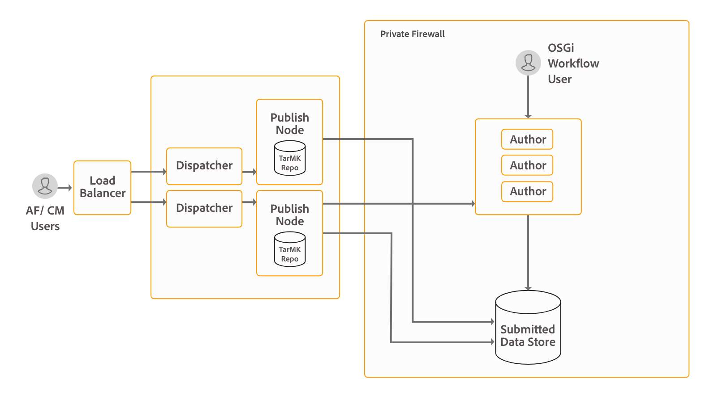

# 安装和配置数据捕获功能{#install-and-configure-data-capture-capabilities}

## 简介 {#introduction}

AEM Forms提供了一组表单以从最终用户获取数据：自适应表单、HTML5 Forms和PDF forms。 它还提供了用于列出网页上所有可用表单、分析表单使用情况以及根据用户档案定位用户的工具。 这些功能包含在AEM Forms附加组件包中。 附加组件包部署在AEM的Author或Publish实例上。

**自适应表单：**&#x200B;这些表单会根据设备的屏幕大小更改外观，非常吸引人，并且本质上具有交互性。 自适应Forms还可以与Adobe Analytics、Adobe Sign和Adobe Target集成。 它使您能够根据用户的人口统计和其他功能，为其提供个性化的表单和面向流程的体验。 您还可以将自适应表单与Adobe Sign集成。

**PDF forms**&#x200B;适用于PDF文档中的像素完美打印和数字信息捕获。 在数字头像中，您可以使用Adobe Acrobat或Acrobat Reader填写这些表单。 您可以在网站上托管这些表单，或者使用表单门户在AEM网站上列出这些表单。 您还可以将这些表单作为附件通过电子邮件发送给其他人。 这些表单最适合桌面环境。

**HTML5 Forms**&#x200B;是PDF forms的浏览器友好版本。 HTML5 Forms适用于不支持PDF插件的环境。 HTML5 Forms支持在不支持基于XFA的表单的移动设备和桌面PDF上渲染基于XFA的表单。 这些表单最适合平板电脑和桌面环境。

AEM Forms是一个功能强大的企业级平台，数据捕获(自适应表单、PDF forms和HTML5 Forms)只是AEM Forms的功能之一。 有关功能的完整列表，请参阅[AEM Forms简介](/help/forms/using/introduction-aem-forms.md)。

## 部署拓扑 {#deployment-topology}

AEM Forms附加组件包是部署在AEM上的应用程序。 您只需要至少一个AEM Author和AEM Publish实例即可运行AEM Forms数据捕获功能。 建议通过以下拓扑来运行AEM Forms AEM Forms数据捕获功能。 有关拓扑的详细信息，请参阅[AEM Forms的架构和部署拓扑](/help/forms/using/aem-forms-architecture-deployment.md)。



## 系统要求 {#system-requirements}

在开始安装和配置AEM Forms的数据捕获功能之前，请确保：

* 硬件和软件基础架构已准备就绪。 有关支持的硬件和软件的详细列表，请参阅[技术要求](/help/sites-deploying/technical-requirements.md)。

* AEM实例的安装路径不包含空格。
* AEM实例已启动并正在运行。 对于Windows用户，请在提升的模式下安装AEM实例。 在AEM术语中，“实例”是在创作或发布模式下在服务器上运行的AEM的副本。 您需要至少两个[AEM实例(一个作者和一个Publish)](/help/sites-deploying/deploy.md)才能运行AEM Forms数据捕获功能：

   * **作者**：用于创建、上载和编辑内容以及管理网站的AEM实例。 内容准备好上线后，即会复制到发布实例。
   * **Publish**：通过Internet或内部网络向公众提供已发布内容的AEM实例。

* 满足内存要求。 AEM Forms附加组件包需要：

   * 用于基于Microsoft Windows的安装的15 GB临时空间。
   * 用于基于UNIX的安装的6 GB临时空间。

* 已设置创作实例和发布实例的复制和反向复制。 有关详细信息，请参阅[复制](/help/sites-deploying/replication.md)。
* 对于基于UNIX的系统：

   * 从安装介质安装以下32位软件包：

<table>
 <tbody>
  <tr>
   <td>外派人员</td>
   <td>fontconfig</td>
   <td>自由类型</td>
   <td>glibc</td>
  </tr>
  <tr>
   <td>libcurl</td>
   <td>libICE</td>
   <td>利比库</td>
   <td>libSM</td>
  </tr>
  <tr>
   <td>libuuid</td>
   <td>libX11</td>
   <td><p>libXau</p> </td>
   <td>libxcb</td>
  </tr>
  <tr>
   <td>libXext</td>
   <td>libXinerama</td>
   <td>libXrandr</td>
   <td>libXrender</td>
  </tr>
  <tr>
   <td>nss-softokn-freebl</td>
   <td>OpenSSL</td>
   <td>zlib</td>
   <td> </td>
  </tr>
 </tbody>
</table>

>[!NOTE]
>
>* 如果服务器上已安装OpenSSL，请将其升级到最新版本。
>* 创建libcurl.so 、 libcrypto.so和libssl.so symlink ，分别指向最新版本的libcurl 、 libcrypto和libssl库。
>

* 从安装介质安装以下64位软件包：

   * 利比库

* 安装[Microsoft Visual Studio 2019 32位可再发行组件](https://learn.microsoft.com/en-us/cpp/windows/latest-supported-vc-redist?view=msvc-170)。


## 安装AEM Forms附加组件包 {#install-aem-forms-add-on-package}

AEM Forms附加组件包是部署在AEM上的应用程序。 该资源包中包含AEM Forms数据捕获和其他功能。 执行以下步骤以安装附加组件包：

1. 打开 [Software Distribution](https://experience.adobe.com/downloads)。您需要 Adobe ID 才能登录 Software Distribution。
1. 选择标题菜单中的&#x200B;**[!UICONTROL Adobe Experience Manager]**。
1. 在&#x200B;**[!UICONTROL 筛选器]**&#x200B;部分中：
   1. 从&#x200B;**[!UICONTROL 解决方案]**&#x200B;下拉列表中选择&#x200B;**[!UICONTROL Forms]**。
   2. 选择包的版本和类型。 您还可以使用&#x200B;**[!UICONTROL 搜索下载]**&#x200B;选项来筛选结果。
1. 选择适用于您的操作系统的包名称，选择&#x200B;**[!UICONTROL 接受EULA条款]**，然后选择&#x200B;**[!UICONTROL 下载]**。
1. 打开[包管理器](https://experienceleague.adobe.com/docs/experience-manager-65/administering/contentmanagement/package-manager.html?lang=zh-Hans)，然后单击&#x200B;**[!UICONTROL 上传包]**&#x200B;以上传包。
1. 选择包并单击&#x200B;**[!UICONTROL 安装]**。

   您还可以通过[AEM Forms发行版](https://helpx.adobe.com/cn/aem-forms/kb/aem-forms-releases.html)文章中列出的直接链接下载包。
1. 安装软件包后，系统会提示您重新启动AEM实例。 **不要立即重新启动服务器。**&#x200B;在停止AEM Forms服务器之前，请等待ServiceEvent REGISTERED和ServiceEvent UNREGISTERED消息停止出现在`[AEM-Installation-Directory]/crx-quickstart/logs/error.log`文件中并且日志稳定。

   >[!NOTE]
   >
   > 建议使用“Ctrl + C”命令重新启动SDK。 使用替代方法（例如，停止Java进程）重新启动AEM SDK可能会导致AEM开发环境不一致。

1. 对所有Author和Publish实例重复步骤1-7。

### （仅限Windows）自动安装Visual Studio可再发行组件 {#automatic-installation-visual-studio-redistributables}

如果在提升的模式下安装AEM实例，则在安装AEM Forms附加组件包期间会自动安装32位Visual Studio可再发行组件。

若要评估Visual Studio可再发行组件是否已自动安装，请打开`/crx-repository/logs/`目录中的`error.log`文件。 日志包含以下消息：

`Redist <service name> already installed on system, will not attempt re-installation`

如果无法安装可再发行组件，日志将包含以下消息：

`Current user does not have elevated privileges, aborting installation of redist <service name>`

要解决此问题，请重新启动AEM服务器，以提升模式安装AEM，然后安装AEM Forms附加组件包。

如果权限检查失败，日志将包含以下消息：

`Privilege escalation check failed with error: <error message>`

## Post安装配置 {#post-installation-configurations}

AEM Forms具有一些强制和可选配置。 强制配置包括配置BouncyCastle库和序列化代理。 可选配置包括配置Dispatcher、Forms Portal、Adobe Sign、Adobe Analytics和Adobe Target。

### 强制性安装后配置 {#mandatory-post-installation-configurations}

#### 配置RSA和BouncyCastle库  {#configure-rsa-and-bouncycastle-libraries}

在所有Author和Publish实例上执行以下步骤以引导委派库：

1. 停止基础AEM实例。
1. 打开 `[AEM installation directory]\crx-quickstart\conf\sling.properties` 文件以供编辑。

   如果您使用`[AEM installation directory]\crx-quickstart\bin\start.bat`启动AEM，则编辑位于`[AEM_root]\crx-quickstart\`的sling.properties。

1. 将以下属性添加到sling.properties文件：

   ```shell
   sling.bootdelegation.class.com.rsa.jsafe.provider.JsafeJCE=com.rsa.*  
   ```

1. 保存并关闭文件，然后启动AEM实例。
1. 对所有Author和Publish实例重复步骤1-4。

#### 配置序列化代理 {#configure-the-serialization-agent}

对所有Author和Publish列入允许列表实例执行以下步骤，将包添加到Author中：

1. 在浏览器窗口中打开AEM Configuration Manager。 默认URL为`https://'[server]:[port]'/system/console/configMgr`。
1. 搜索&#x200B;**com.adobe.cq.deserfw.impl.DeserializationFirewallImpl.name**&#x200B;并打开配置。
1. 将&#x200B;**sun.util.calendar**&#x200B;程序包添加到&#x200B;**允许列表**&#x200B;字段。 单击&#x200B;**保存**。
1. 对所有Author和Publish实例重复步骤1-3。

### 可选安装后配置 {#optional-post-installation-configurations}

#### 配置Dispatcher {#configure-dispatcher}

Dispatcher是Adobe Experience Manager的缓存和/或负载平衡工具，可与企业级Web服务器结合使用。 如果您使用[Dispatcher](https://helpx.adobe.com/cn/experience-manager/dispatcher/using/dispatcher-configuration.html)，请为AEM Forms执行以下配置：

1. 配置AEM Forms的访问权限：

   打开dispatcher.any文件进行编辑。 导航到过滤器部分，并将以下过滤器添加到过滤器部分：

   `/0025 { /type "allow" /glob "* /bin/xfaforms/submitaction*" } # to enable AEM Forms submission`

   保存并关闭文件。 有关筛选器的详细信息，请参阅[Dispatcher文档](https://helpx.adobe.com/cn/experience-manager/dispatcher/using/dispatcher-configuration.html)。

1. 配置反向链接筛选服务：

   以管理员身份登录Apache Felix配置管理器。 配置管理器的默认URL为`https://[server]:[port_number]/system/console/configMgr`。 在&#x200B;**配置**&#x200B;菜单中，选择&#x200B;**Apache Sling引用过滤器**&#x200B;选项。 在“允许主机”字段中，输入Dispatcher的主机名以允许其作为反向链接，然后单击&#x200B;**保存**。 条目的格式为`https://[server]:[port]`。

#### 配置缓存 {#configure-cache}

缓存是一种缩短数据访问时间、减少延迟并提高输入/输出(I/O)速度的机制。 自适应表单缓存仅存储自适应表单的HTML内容和JSON结构，而不保存任何预填数据。 它有助于减少渲染自适应表单所需的时间。

* 使用自适应表单缓存时，请使用[AEM Dispatcher](https://helpx.adobe.com/cn/experience-manager/dispatcher/using/dispatcher-configuration.html)来缓存自适应表单的客户端库(CSS和JavaScript)。
* 开发自定义组件时，在用于开发的服务器上禁用自适应表单缓存。

执行以下步骤以配置自适应表单缓存：

1. 转到https://&#39;[server]：[port]&#39;/system/console/configMgr上的AEM Web控制台配置管理器。
1. 单击&#x200B;**自适应表单和交互式通信Web渠道配置**&#x200B;以编辑其配置值。 在“编辑配置值”对话框中，在&#x200B;**自适应Forms的数量**&#x200B;字段中指定AEM Forms服务器实例可以缓存的最大表单或文档数。 默认值为 100。单击&#x200B;**保存**。

   >[!NOTE]
   >
   >要禁用缓存，请将“自适应Forms数量”字段中的值设置为&#x200B;**0**。 禁用或更改缓存配置时，将重置缓存并从缓存中删除所有表单和文档。

#### 为表单数据模型配置SSL通信 {#configure-ssl-communcation-for-form-data-model}

您可以为表单数据模型启用SSL通信。 要为表单数据模型启用SSL通信，请在启动任何AEM Forms实例之前，向所有实例的Java信任存储区添加证书。 您可以运行以下命令来添加证书： ”

`keytool -import -alias <alias-name> -file <pathTo .cer certificate file> -keystore <<pathToJRE>\lib\security\cacerts>`

#### 配置Adobe Sign {#configure-adobe-sign}

Adobe Sign支持自适应表单的电子签名工作流程。 电子签名改进了法律、销售、工资单、人力资源管理和其他许多方面的文档的处理工作流。

在典型的Adobe Sign和自适应表单方案中，用户填写自适应表单以&#x200B;**申请服务**。 例如，信用卡申请表和公民权益表。在用户填写、签署和提交申请表后，该表将发送给服务提供商以执行后续操作。服务提供商将审核申请，并使用Adobe Sign将申请标记为已批准。 要支持类似的电子签名工作流，您可以将Adobe Sign与AEM Forms集成。

要将Adobe Sign与AEM Forms结合使用，请[将Adobe Sign与AEM Forms集成](/help/forms/using/adobe-sign-integration-adaptive-forms.md)。

#### 配置Adobe Analytics {#configure-adobe-analytics}

AEM Forms与Adobe Analytics集成，允许您捕获和跟踪已发布表单和文档的性能指标。 分析这些量度背后的目的是，根据有关提高表单或文档可用性的更改数据做出明智的决策。

要将Adobe Analytics与AEM Forms结合使用，请参阅[配置Analytics和报表](/help/forms/using/configure-analytics-forms-documents.md)。

#### 集成Adobe Target {#integrate-adobe-target}

如果您的表单提供的体验不吸引人，则客户可能会放弃表单。 虽然这令客户感到沮丧，但也可能会增加贵组织的支持量和成本。 确定并提供提高转化率的正确客户体验是关键而富有挑战性的。 AEM forms拥有解决此问题的关键。

AEM forms与Adobe Marketing Cloud解决方案Adobe Target集成，跨多个数字渠道提供个性化且引人入胜的客户体验。 要使用Adobe Target对自适应表单进行A/B测试，[将Adobe Target与AEM Forms集成](/help/forms/using/ab-testing-adaptive-forms.md#setupandintegratetargetinaemforms)。

## 后续步骤 {#next-steps}

您已将环境配置为使用AEM Forms数据捕获功能。 现在，使用该功能的后续步骤包括：

* [创建您的第一个自适应表单](/help/forms/using/create-your-first-adaptive-form.md)
* [创建您的第一个PDF表单](https://www.adobe.com/go/learn_aemforms_designer_quick_start_65)
* [HTML5 Forms简介](/help/forms/using/introduction.md)
