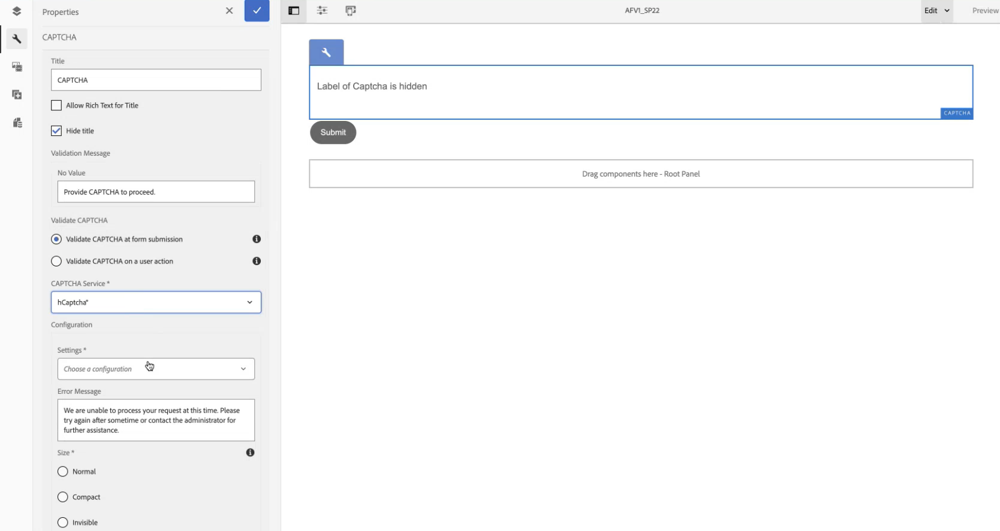

# 使用hCaptcha连接AEM Forms环境® {#connect-your-forms-environment-with-hcaptcha-service}

<!--

 This feature is under the Early Adopter Program. You can write to aem-forms-ea@adobe.com from your official email id to join the early adopter program and request access to the capability. 

-->

此功能在早期采用者计划下。 如果您有兴趣加入我们针对此功能的抢先访问计划，请从您的官方地址发送电子邮件至aem-forms-ea@adobe.com以请求访问

CAPTCHA（区分计算机和人类的完全自动化公共图灵测试）是一种在线交易中常用的程序，用于区分人类和自动化程序或机器人。它提出了一个挑战，并评估用户响应以确定是人还是机器人与网站交互。如果测试失败，它会阻止用户继续操作，并通过阻止机器人发布垃圾邮件或恶意目的来帮助确保在线交易的安全。

除了hCaptcha®之外，AEM Forms 6.5还支持以下CAPTCHA解决方案：

* [Google reCAPTCHA](/help/forms/using/captcha-adaptive-forms.md)
* [Cloudflare Turnstile](/help/forms/using/integrate-adaptive-forms-turnstile.md)

## 将AEM Forms环境与hCaptcha集成®

hCaptcha® 服务项目可保护您的表单免受机器人、垃圾邮件和自动滥用的侵害。它提出一个复选框小部件挑战，并评估用户响应以确定与表单交互的是人还是机器人。如果测试失败，它会阻止用户继续操作，并通过阻止机器人发布垃圾邮件或恶意活动来帮助确保在线交易的安全。

AEM 6.5自适应Forms支持hCaptcha&amp;reg。 您可以用它来在提交表单时显示复选框构件质询。

<!-- -->

### 将AEM Forms环境与hCaptcha集成的先决条件® {#prerequisite}

要使用AEM Forms配置hCaptcha®，您需要从hCaptcha®网站获取[hCaptcha®站点密钥和密钥](https://docs.hcaptcha.com/switch/#get-your-hcaptcha-sitekey-and-secret-key)。

### 配置验证码® {#steps-to-configure-hcaptcha}

要将AEM Forms与hCaptcha®服务集成，请执行以下步骤：

1. 在您的AEM Forms环境中创建一个配置容器，其中包含用于将AEM连接到外部服务的云配置。 要创建配置容器，请执行以下操作：
   1. 打开您的AEM Forms环境。
   1. 转到&#x200B;**[!UICONTROL 工具>常规>配置浏览器]**。
   1. 在配置浏览器中，您可以选择现有文件夹或创建新文件夹：
      * 要创建新文件夹并启用云配置，请执行以下操作：
         1. 在配置浏览器中，单击&#x200B;**[!UICONTROL 创建]**。
         1. 在创建配置对话框中，指定名称、标题，并检查&#x200B;**[!UICONTROL 云配置]**。
         1. 单击&#x200B;**[!UICONTROL 创建]**。
      * 要为现有文件夹启用云配置，请执行以下操作：
         1. 在配置浏览器中，选择文件夹，然后选择&#x200B;**[!UICONTROL 属性]**。
         1. 在配置属性对话框中，启用&#x200B;**[!UICONTROL 云配置]**。
         1. 单击&#x200B;**[!UICONTROL 保存并关闭]**&#x200B;以保存配置并退出对话框。

1. 配置Cloud Service：
   1. 在您的AEM创作实例上，转到 > **[!UICONTROL Cloud Service]**，然后单击&#x200B;**[!UICONTROL hCaptcha®]**。
      ui中的
   1. 选择已创建或已更新的配置容器，如上一节所述。 选择&#x200B;**[!UICONTROL 创建]**。
      
   1. 指定&#x200B;**[!UICONTROL 标题]**，<!--**[!UICONTROL Name]**--> 在必备项](#prerequisite)中获取的hCaptcha®服务[的&#x200B;**[!UICONTROL 站点密钥]**&#x200B;和&#x200B;**[!UICONTROL 密钥]**。
   1. 单击&#x200B;**[!UICONTROL 创建]**。

      

   >[!NOTE]
   > 用户无需修改[客户端JavaScript验证URL](https://docs.hcaptcha.com/#add-the-hcaptcha-widget-to-your-webpage)和[服务器端验证URL](https://docs.hcaptcha.com/#verify-the-user-response-server-side)，因为它们已预填充hCaptcha®验证。

   配置hCAPTCHA服务后，即可在自适应表单中使用。

## 在自适应Forms {#using-hCaptcha-in-aem-6.5}中使用hCaptcha®

1. 打开您的AEM Forms环境。
1. 转到&#x200B;**[!UICONTROL Forms]** > **[!UICONTROL Forms和文档]**。
1. 选择自适应表单并单击&#x200B;**[!UICONTROL 属性]**。
1. 在&#x200B;**[!UICONTROL 配置容器]**&#x200B;中，选择hCaptcha®的云配置。
1. 单击“**[!UICONTROL 保存并关闭]**”。

   如果您没有此类配置容器，请参阅部分[使用hCaptcha®](#connect-your-forms-environment-with-hcaptcha-service)连接您的AEM Forms环境，以了解如何创建配置容器。

   

1. 选择自适应表单并单击&#x200B;**[!UICONTROL 编辑]**&#x200B;以在编辑器中打开该表单。
1. 从组件浏览器中，拖放&#x200B;**[!UICONTROL 自适应表单hCaptcha®]**&#x200B;组件或将其添加到自适应表单上。
1. 选择&#x200B;**[!UICONTROL 自适应表单hCaptcha®]**&#x200B;组件，然后单击属性以打开属性对话框。 指定以下属性：

   

   * **[!UICONTROL 标题]：**&#x200B;指定验证码组件的标题。
   * **[!UICONTROL 验证消息]：**&#x200B;在提交表单或执行用户操作时提供验证码验证的验证消息。
   * **[!UICONTROL Captcha服务]：**&#x200B;为您的表单提交选择CAPTCHA服务，此处选择hCaptcha®。
   * **[!UICONTROL 配置设置]：**&#x200B;选择为hCaptcha®配置的云配置。
     >[!NOTE]
     >出于类似目的，您的环境中可以有多个云配置。 所以，请仔细选择服务。 如果未列出任何服务，请参阅[使用hCaptcha®连接您的AEM Forms环境](#connect-your-forms-environment-with-hcaptcha-service)，了解如何创建将AEM Forms环境与hCaptcha®服务连接的Cloud Service。
   * **错误消息：**&#x200B;提供验证码提交失败时向用户显示的错误消息。
   * **验证码大小：**&#x200B;您可以选择hCaptcha®质询对话框的显示大小。 使用&#x200B;**[!UICONTROL 紧凑]**&#x200B;选项显示较小的大小，使用&#x200B;**[!UICONTROL 普通]**&#x200B;显示相对较大的hCaptcha®质询对话框，或使用&#x200B;**[!UICONTROL 不可见]**&#x200B;验证hCaptcha®而不在用户界面上显式呈现复选框小组件。

1. 选择&#x200B;**[!UICONTROL 完成]**。

现在，只有合法表单(表单填充程序成功清除hCaptcha®服务带来的挑战)才允许表单提交。 hCaptcha®

**hCaptcha® 是 Intuition Machines, Inc. 的注册商标。**

## 常见问题解答

* **问：能否在自适应表单中使用多个Captcha组件？**
* 不支持在自适应表单中使用多个Captcha组件的&#x200B;**Ans：**。 此外，不建议在标记为延迟加载的片段或面板中使用验证码组件。

## 另请参阅 {#see-also}

* [在自适应表单中使用CAPTCHA](/help/forms/using/captcha-adaptive-forms.md)
* [在自适应表单中使用Turnstile验证码](/help/forms/using/integrate-adaptive-forms-turnstile.md)
