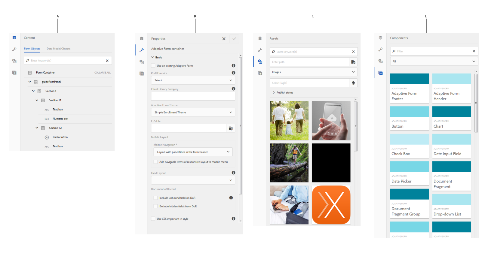

# Introduction to authoring adaptive forms {#introduction-to-authoring-adaptive-forms}

## 概述 {#overview}

自适应表单允许您创建具有吸引力、响应式、动态和自适应性的表单。 AEM Forms提供直观的用户界面和现成组件，用于创建和使用自适应表单。 您可以选择基于表单模型或模式创建自适应表单，也可以不使用表单模型。 必须仔细选择不仅符合您要求、而且扩展现有基础设施投资和资产的表单模型。 您可以从以下选项中进行选择，以创建自适应表单：

* **使用表单数据模型**
   [数据集成](../../forms/using/data-integration.md) 允许您将来自不同数据源的实体和服务集成到表单数据模型中，以用于创建自适应表单。 如果要创建的自适应表单涉及从多个数据源获取和写入数据，请选择表单数据模型。

* **使用XDP表单模板**&#x200B;如果您对基于XFA或XDP表单有投资，它是理想的表单模型。 它提供了一种将基于XFA的表单转换为自适应表单的直接方法。 任何现有的XFA规则都将保留在关联的自适应表单中。 生成的自适应表单支持XFA构造，如验证、事件、属性和模式。

* **使用XML模式定义(XSD)或JSON模式** XML和JSON模式表示组织中后端系统生成或使用数据的结构。 您可以将模式与自适应表单关联，并使用其元素将动态内容添加到自适应表单。 创作自适应表单时，模式的元素将可在内容浏览器的“数据模型对象”选项卡中使用。

* **不使用表单模型或不使用**&#x200B;使用此选项创建的自适应表单不使用任何表单模型。 从这种表单生成的数据XML具有带字段和相应值的平面结构。

有关创建自适应表单的详细信息，请参 [阅创建自适应表单](../../forms/using/creating-adaptive-form.md)。

## 自适应表单创作UI {#adaptive-form-authoring-ui}

用于创作自适应表单的触屏优化UI是直观的，它提供：

* 拖放功能
* 标准表单组件
* 集成的资产存储库

在创建新表单或编辑现有自适应表单时，您使用以下UI元素：

* [侧栏](#sidebar)
* [页面工具栏](#page-toolbar)
* [组件工具栏](#component-toolbar)
* [自适应表单页](#af-page)

**A.侧栏** B. **页面工具栏** C. **自适应表** 单页面

### 侧栏 {#sidebar}

侧栏允许您

* 查看表单内容，如面板、组件、字段和布局。
* 编辑组件属性。
* 在AEM数字资产管理(DAM)存储库中搜索、视图和使用资产。
* 在表单上添加组件。

**A.内容** 浏览器 **B.属性浏** 览器C. **Assets浏览器** D. **组件浏** 览器D.C.

<!--Click to enlarge

](assets/sidebar-comps-1.png) -->

提要栏包含以下浏览器：

* **内容浏**&#x200B;览器在内容浏览器中，您可以

   * **表单对象**&#x200B;显示表单的对象层次结构。 作者可以通过在表单对象树中点击该元素来导航到特定的表单组件。 作者可以搜索对象并从此树中重新排列它们。

   * **数据模型对**象允许您查看表单模型层次结构。
它允许您在自适应表单上拖放表单模型元素。 添加的元素会自动转换为表单组件，同时保留其原始属性。 当您的表单使用XML模式、JSON模式或XDP模板时，您可以看到数据模型对象。

* **属性浏览器**

   允许您编辑组件的属性。 属性会根据组件而发生更改。 要查看自适应表单容器的属性，请执行以下操作：

   选择一个组件，然后点  > **[!UICONTROL 自适应表单容器]**，然后 按cmppr。

* **资产浏览器**

   隔离不同类型的内容，如图像、文档、页面、电影等。

* **组件浏览器**

   包括可用于构建自适应表单的组件。 您可以将组件从拖动到自适应表单上以添加表单元素，并根据要求配置添加的元素。 下表描述了组件浏览器中列出的组件。

<table>
 <tbody>
  <tr>
   <th><strong>组件</strong></th>
   <th><strong>功能</strong></th>
  </tr>
  <tr>
   <td>Adobe Sign Block</td>
   <td>添加一个文本块，其中带有占位符，以在使用Adobe Sign进行签名时填写字段。</td>
  </tr>
  <tr>
   <td>按钮</td>
   <td>添加一个按钮，您可以配置该按钮以执行保存、重置、转到下一步、转到上一步等操作。</td>
  </tr>
  <tr>
   <td>Captcha</td>
   <td>添加使用Google reCAPTCHA服务的CAPTCHA验证。 有关详细信息，请 <a href="../../forms/using/captcha-adaptive-forms.md" target="_blank">参阅在自适应表单中使用CAPTCHA</a>。</td>
  </tr>
  <tr>
   <td>图表</td>
   <td>添加一个图表，您可以在自适应表单和文档中使用它，在可重复面板和表行中直观地表示二维数据。</td>
  </tr>
  <tr>
   <td>复选框</td>
   <td>添加复选框。</td>
  </tr>
  <tr>
   <td>数据输入字段</td>
   <td>使用表单中的日期输入字段组件，让客户在三个框中分别填写日、月和年。 您可以自定义组件的外观，并更改日期格式。 例如，您可让客户输入MM/DD/YYYY或DD/MM/YYYY格式的日期。</td>
  </tr>
  <tr>
   <td>日期选取器</td>
   <td>添加日历字段以选择日期。</td>
  </tr>
  <tr>
   <td>文档片段</td>
   <td>允许您添加通信的可重用组件。</td>
  </tr>
  <tr>
   <td>文档片段组</td>
   <td>允许您将相关文档片段组添加为单个单元，在字母模板中使用这些片段。</td>
  </tr>
  <tr>
   <td>下拉列表</td>
   <td>添加下拉列表-单选或多选</td>
  </tr>
  <tr>
   <td>电子邮件</td>
   <td>
添加字段以捕获电子邮件地址。 默认情况下，电子邮件组件使用以下常规表达式验证电子邮件地址。
 
<code>^[a-zA-Z0-9.!#$%&amp;’*+/=?^_`{|}~-]+@[a-zA-Z0-9-]+(?:.[a-zA-Z0-9-]+)*$</code>
 </td>
  </tr>
  <tr>
   <td>文件附件</td>
   <td>
添加一个按钮，允许用户浏览支持文档并将其附加到表单。 可将多个文件附加到文件附件组件。
 
<strong> 注意: </strong><ul> <li> 该组件不支持附加文件名以字符(.)开头、包含字符\ / :* ? " &lt; &gt; |;% $，或包含为Windows操作系统保留的特殊文件名，如nul、prn、con、lpt或com。 </li> <li> 要将多个文件附加到在Apple Safari浏览器中打开的文件附件组件，请逐个选择并附加文件。 不能同时选择并附加多个文件。</li> <li>文件附件组件支持为Adobe Sign启用的自适应表单中的预定义文件格式集。 有关详细信息，请参 <a href="https://helpx.adobe.com/document-cloud/help/supported-file-formats-fill-sign.html#main-pars_text">阅支持的文件格式</a>。 </li> </ul>
 </td>
  </tr>
  <tr>
   <td>文件附件列表</td>
   <td>添加一个字段，用于列表使用文件附件组件上传的所有附件。</td>
  </tr>
  <tr>
   <td>页脚  </td>
   <td>添加页眉，该页眉通常包括公司徽标、表单标题和摘要。  </td>
  </tr>
  <tr>
   <td>标题</td>
   <td>添加页脚，页脚通常包括版权信息和指向其他页面的链接。 </td>
  </tr>
  <tr>
   <td>图像</td>
   <td>允许插入图像。</td>
  </tr>
  <tr>
   <td>图像选择</td>
   <td>允许客户选择图像以提供信息。 您可以使用这些信息为客户提供个性化服务。</td>
  </tr>
  <tr>
   <td>“下一个”按钮</td>
   <td>添加一个按钮以导航到表单中的下一个面板。</td>
  </tr>
  <tr>
   <td>数值框</td>
   <td>添加用于捕获数值的字段</td>
  </tr>
  <tr>
   <td>数值步进器</td>
   <td>在表单中使用Numeric Stepper让客户输入数字值，客户可以根据预定义的步骤增加或减少该值。</td>
  </tr>
  <tr>
   <td>面板</td>
   <td>
添加面板或子面板。
 
您还可以使用添加子面板按钮从父面板工具栏 添加面板组件</code> 。 同样，您也可以使用“添加面板工具栏”按钮添加 特定于面板的工</code> 具栏。 您可以使用编辑面板对话框配置面板工具栏的位置。</code></code>
 </td>
  </tr>
  <tr>
   <td>密码框</td>
   <td>添加用于捕获口令的字段。</td>
  </tr>
  <tr>
   <td>“上一步”按钮</td>
   <td>添加用户需要返回上一页或上一个面板的按钮。</td>
  </tr>
  <tr>
   <td>单选按钮</td>
   <td>添加单选按钮。</td>
  </tr>
  <tr>
   <td>重置按钮</td>
   <td>添加用于重置表单字段的按钮。</td>
  </tr>
  <tr>
   <td>保存按钮</td>
   <td>添加用于保存表单数据的按钮。</td>
  </tr>
  <tr>
   <td>连笔签名</td>
   <td>添加用于捕获涂写签名的字段。</td>
  </tr>
  <tr>
   <td>分隔符</td>
   <td>以您的形式实现面板的可视隔离。</td>
  </tr>
  <tr>
   <td>签名步骤</td>
   <td>显示表单中提供的信息以及用户验证和签署表单的签名字段。</td>
  </tr>
  <tr>
   <td>文本</td>
   <td>允许您指定静态文本。</td>
  </tr>
  <tr>
   <td>提交按钮</td>
   <td>添加提交按钮以将表单提交到配置的提交操作。</td>
  </tr>
  <tr>
   <td>摘要步骤</td>
   <td>提交表单并显示提交表单后作者指定的摘要文本。 </td>
  </tr>
  <tr>
   <td>切换</td>
   <td>添加执行切换或启用／禁用操作的开关。 在Switch组件中不能添加两个以上的选项。 由于交换机只能有两个值：“开”或“关”,“强制”不适用。 无论用户输入如何，都保存至少一个值。   </td>
  </tr>
  <tr>
   <td>表</td>
   <td>添加表格以便按行和列整理数据。 </td>
  </tr>
  <tr>
   <td>电话</td>
   <td>
添加一个字段以捕获电话号码。 电话组件允许作者配置以下电话号码类型之一。 每种类型都与验证的默认常规表达式关联。

    <ul>
     <li>Type International由验证 <code>^[+][0-9]{0,14}$</code>。</li>
     <li>类型USPhoneNumber由验证 <code>{'+1 ('999') '999-9999}</code>。</li>
     <li>键入UKPhoneNumber由验证 <code>text{'+'99 999 999 9999}</code>。</li>
     <li>类型自定义不提供默认验证模式。 它采用上次选择的电话号码类型的值。 您还可以指定您自己的自定义验证模式。</li>
    </ul> </td>
  </tr>
  <tr>
   <td>条款和条件  </td>
   <td>添加一个字段，作者可以使用该字段指定在填写表单之前用户要查看的条款和条件。</td>
  </tr>
  <tr>
   <td>文本框 </td>
   <td>
添加一个文本框，用户可在其中指定所需的信息。 
 
默认情况下，文本框组件只接受纯文本。 您可以启用文本框组件以接受富文本。 启用富文本的文本组件提供了添加页眉、更改字符样式（粗体、斜体、为字符加下划线）、创建有序和无序列表、更改文本背景和文本颜色以及添加超链接的选项。 要为文本框启用富文本，请在组件属性中<strong> 启用</strong> “允许富文本”选项。
 </td>
  </tr>
  <tr>
   <td>标题</td>
   <td>指定自适应表单的标题。</td>
  </tr>
  <tr>
   <td>验证步骤</td>
   <td>
添加一个占位符以显示已填写的表单以供用户验证。
 
<strong>注意</strong>:包含验证组件的自适应表单不支持匿名用户。 此外，不建议在自适应表单片段中使用验证组件。
 </td>
  </tr>
 </tbody>
</table>

#### 使用组件的最佳实践 {#best-practices}

使用自适应表单组件时要记住的一些最佳实践和要点如下：

* 每个组件都具有控制其外观和功能的关联属性。 要配置组件的属性，请点按组件，然后点  cmppr以在属性浏览器中打开组件属性。
* 组件使用其元素名称进行标识。 点按 时 **[!UICONTROL ，可以通过更改属性浏览器中的元素]** 名称字段值来更改组件名称。 元素名称字段仅接受字母、数字、连字符(-)和下划线(_)。 不允许使用其他特殊字符，元素名称应以字母开头。

* 只要标题在表单上可见，您就可以在表单编辑器中内联修改自适应表单组件的标题属性，而无需打开属性浏览器。 为此，请执行以下操作：

   1. 点按以选择具有“标题”属 **[!UICONTROL 性]** 且其“隐 **[!UICONTROL 藏标题]** ”属性被禁用的组件。

   1. 点  ，使标题可编辑。

   1. 修改标题并点按返回键或点按组件外的任意位置以保存更改。 点按Esc键可放弃更改。

* 一些自适应表单组件（如电子邮件和电话）包括现成的验证模式。 但是，您可以通过更新组件属性中“模 **[!UICONTROL 式”折叠面板]** 下的“验证模式”字段来指定自定义验证。 有关默认验证的详细信息，请参阅上表中的组件说明。

* 自适应表单字段（如数字框和电子邮件）可配置为包括专用的HTML5输入类型。 当这些字段集中在移动设备和平板电脑上时，键盘会在前面显示特定的字母、数字和字符，这些字段通常用于输入字段中的信息。 它帮助用户快速输入信息，而无需在键盘上的字符集之间切换。 要允许对组件进行特殊输入，请在组 **[!UICONTROL 件属性中启用]** “使用HTML类型编号”复选框。

* 您可以启用文本框组件以接受富文本。 要为文本框启用富文本，请在组件属 **[!UICONTROL 性中启用]** “允许富文本”复选框。

* 您可以启用文本框、电子邮件和电话组件，以根据浏览器自动填写设置中存储的信息自动填写名称、地址、信用卡、电话和电子邮件等字段的值。 要启用此功能，请在组件 **[!UICONTROL 属性中选]** 择“启用自动填充”，然后选择 **[!UICONTROL “自动填充属性”]**。 当用户填写自适应表单时，会从浏览器中的自动填写用户档案中或根据用户之前填写的值来建议这些值。 请注意，如果用户浏览器中的自动填写设置处于打开状态，则自动填写功能有效。

* 在组件属性中以格式指定单选按钮和 `{value}={text}` 复选框项的值。
* 默认情况下，文件附件组件只允许用户附加一个文件。 但是，您可以配置组件属性以支持多个附件。 此外，如果用户附加了多个具有相同文件名的文件，则附件可能会引起一些问题。 因此，建议在提交表单时为每个提交的附件关联唯一标识符。 为此，请执行以下操作：

   1. 在您的AEM Forms服务器上，导 **[!UICONTROL 航到]** Adobe Experience Manager **[!UICONTROL >工]** 具 **[!UICONTROL >]** 操作 **[!UICONTROL >]** Web控制台。
   1. 查找并点 **[!UICONTROL 按自适应Forms配置服务]**。
   1. 在自适应Forms配置服务对话框中，启 **[!UICONTROL 用使文件名唯一]**。 默认情况下，它处于禁用状态。

* 要使用户能够使用Safari浏览器附加PDF，请确 **保将application** /pdf添加到“文件”附件组件的“支持的文件类型”属性。 使用先前的AEM Forms版本创建的自适应表单 **可能包含。pdf** ，而 **不是“支持的文件类型** ”属性中的application/pdf。

有关自适应表单的更多最佳实践，请参 [阅使用自适应表单的最佳实践](/help/forms/using/adaptive-forms-best-practices.md)。

>[!NOTE]
>
>自适应表单组件不支持从右到左(RTL)语言。 例如，希伯来语。

### 页面工具栏 {#page-toolbar}

顶部的页面工具栏提供了用于预览表单、更改表单属性和编辑表单布局的选项。 您可以在创作表单时预览表单，并相应地进行更改。 在页面工具栏中，您会看到：

* **切换侧面板**:用于显示或隐藏提要栏。

* **页面信息**:允许您视图页面属性、发布／取消发布表单、开始表单工作流，以及在经典UI中打开表单。

* **模拟器**:可模拟表单外观，以适应平板电脑和手机等不同的显示尺寸。

* **编辑**:允许您选择其他模式，如： **[!UICONTROL 编辑]**、 **[!UICONTROL 样式]**、 **[!UICONTROL 开发]**&#x200B;人员 **[!UICONTROL 和]**&#x200B;设计。

   * **编辑**:允许您编辑表单及其组件的属性。 例如，添加组件、删除图像以及指定必填字段。
   * **样式**:允许您设置表单组件外观的样式。 例如，在样式模式下，您可以选择面板并指定其背景颜色。

   * **开发人员**:允许开发人员：

      * 了解表单的组成。
      * 调试发生在何处和何时的情况，这反过来有助于解决问题。
   * **设计**. 允许您启用或禁用自定义组件或未列在提要栏中的现成组件。

* **预览**:允许您预览表单在发布时的外观。

### Component toolbar {#component-toolbar}

选择组件时，您会看到一个工具栏，通过该工具栏可以处理组件。 您可以选择剪切、粘贴、移动和指定组件的属性。 您的选择包括：

A.**配置**:点按配置 **[!UICONTROL 时]**，组件属性显示在提要栏中。 通过配置这些属性，您可以自定义数据捕获体验。 您可以更改组件的元素名称，在组件的标题字段中指定标签文本。 元素名称允许您捕获用户使用组件输入的值。 在组件属性中，您可以指定组件的行为并管理用户输入。 在提要栏中配置属性以捕获用户数据并使用它进行进一步处理。 自适应表单容器的属性允许您指定客户端库、布局、主题、记录文档设置、保存设置、提交设置和元数据设置。

B.**复制**:您可以使用复制选项复制组件并将其粘贴到表单的其他位置。 粘贴组件时，粘贴的组件将获得新元素名称，但保留复制的组件的属性。

C.**Cut**:您可以使用剪切选项在自适应表单中将组件从一个位置移动到另一个位置。

D.删 **除**:允许您从表单中删除组件。

E.插 **入**:允许您在选定组件上方插入组件。

F.粘 **贴**:允许您使用上述选项粘贴您剪切或复制的组件。

G.编 **辑规则**:允许您打开规则编辑器。 有关详细信息，请参阅 [规则编辑器](../../forms/using/rule-editor.md)。

H. **组**:如果要剪切、复制或粘贴多个组件，可选择多个组件。

一、 **家长**:允许您选择组件的父项。 例如，文本字段位于位于某个部分的子部分内，该子部分位于某个部分内。 该部分位于引导根面板中，自适应表单容器是引导根面板的父项。 对于组件，您可以看到层次结构从底部向上排序的所有选项。

例如，如果点按父 **[!UICONTROL 项]** ，您可以看到：

* 子部分
* 区域
* guideRootPanel
* 自适应表单容器

J.其 **他**:提供更多用于使用选定组件的选项。

* 视图SOM表达式
* 将面板另存为片段（仅限面板）
* 添加子面板（仅限面板）
* 添加面板工具栏（仅限面板）
* 替换（不适用于面板）

### Adaptive form page {#af-page}

自适应表单页面是实际的表单。 它类似于任何其他建模为WCM组件的WCM `cq:Page` 页面。 下图显示了典型自适应表单的内容结构。

内容结构通常包含以下主要组件：

* **guideContainer**:自适应表单的根，在自适应表单 **[!UICONTROL UI中标记为自]** 适应表单的开始。 在此组件中，您可以指定：

   * *自适应表单的移动布局*:定义表单在移动设备上的外观。
   * *感谢页面*:定义提交表单后用户被重定向的页面。
   * *提交操作*:定义用户提交表单后在服务器上处理表单的方式。
   * *样式*:指定用于自定义表单外观的CSS文件的路径。

* **rootPanel:** 自适应表单的根面板。 它可以在项目节点下包含子面板。 每个包含根面板的面板都可以具有与其关联的布局。 面板的布局指示表单的布局。 例如，在Accordion布局中，其项目布局为Accordion步骤。

* **工具栏：** 自适应表单容器具有关联的全局工具栏，该工具栏对表单是全局的。 可以使用编辑栏中的 **[!UICONTROL 添加工具栏]** （允许作者添加提交、保存、重置等操作）来添加此工具栏。

* **资产：** 此节点包含用于表单创作的其他信息。 例如，表单模型详细信息、本地化详细信息等)。

