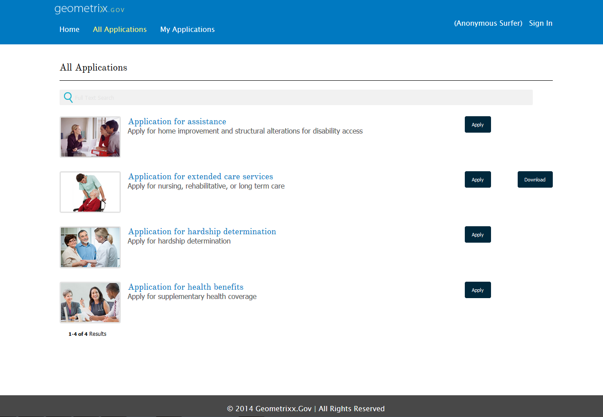

# 在门户上发布表单简介{#introduction-to-publishing-forms-on-a-portal}

## AEM Forms门户组件概述{#aem-forms-portal-components-overview}

在典型的以表单为中心的门户部署场景中，表单开发和门户开发是两个不相干的活动。 当表单设计人员在存储库中设计和存储表单时，Web开发人员创建一个Web应用程序来列表表单和处理表单提交。 Forms被复制到web层，因为表单存储库和web应用程序之间没有通信。

这种情况往往导致管理问题和生产延迟。 例如，如果存储库中有可用的表单的较新版本，您需要替换Web层上的表单，修改Web应用程序，并在公共站点上重新部署表单。 重新部署Web应用程序可能会导致服务器停机。 通常，服务器停机是计划活动，因此更改不能即时推送到公共站点。

AEM Forms公司提供门户部件，以减少管理费用和生产延迟。 这些组件使Web开发人员能够在使用Adobe Experience Manager(AEM)创作的网站上创建和自定义表单门户。

表单门户组件允许您添加以下功能：

* 列表自定义布局中的表单。 开箱即用，提供列表视图、卡视图和面板视图布局。 您可以创建自己的自定义布局。
* 允许您在列出自定义元数据和自定义操作时显示这些元数据。
* 列表表单由AEM FormsUI在使用Forms门户组件的发布实例上发布。
* 允许最终用户以HTML和PDF格式呈现表单。
* 使用自定义HTML用户档案渲染表单。
* 支持根据各种条件（如表单属性、元数据和标记）搜索表单。
* 将表单数据提交到servlet。
* 使用自定义CSS自定义门户的外观。
* 创建表单链接。
* 列表由最终用户创建的与自适应表单相关的草稿和提交。

## 可用的AEM Forms门户组件{#available-aem-forms-portal-components}

AEM Forms提供以下现成的门户组件，它们分组在&#x200B;**文档服务**&#x200B;和&#x200B;**文档服务谓词**&#x200B;组件组下：

### 搜索和制表人 {#search-amp-lister}

搜索和制表人组件允许您将表单从表单存储库列表到门户页面，并提供配置选项以根据指定条件列表表单。 它还允许您指定搜索条件，使门户用户能够在表单列表中进行搜索。

### 草稿和提交 {#drafts-amp-submissions}

“搜索和制表人”组件显示由Forms作者公开的表单，而“草稿和提交”组件则显示保存为草稿的表单，供以后完成和提交的表单。 此组件可为任何登录用户提供个性化体验。

### 链接 {#link}

链接组件允许您创建指向页面上任意位置的表单的链接。 考虑您提供培训项目并希望用户提交表单以注册培训的情况。 您已在您的网站上发布了项目详细信息。 在详细信息下，您希望提供指向注册表单的链接。 链接组件可以帮助您创建该链接。

## Forms门户工作流{#forms-portal-workflow}

Forms门户允许您将表单从表单存储库列表到门户页面。 它还允许您指定搜索条件，使门户用户能够在表单列表中进行搜索。 您还可以使用草稿和提交组件显示保存为草稿的表单，以供以后完成和提交的表单。 您必须先执行一组特定操作，这些功能才能在站点页面上使用。 执行所列顺序中的步骤，使组件和相应功能在站点页面上可用：

1. **启用Forms门户组件**:现成的表单门户组件不可用。[从AEM Sidekick中为](/help/forms/using/enabling-forms-portal-components.md) AEM Sites页面启用组件。
1. **列表页面上的表单（创建表单门户页面）：您** 可以在AEM Sites和非AEM站点页面上列表表单。该列表包含发布实例上可用的表单。 用户可以打开表单并开始填写这些表单。 每当用户打开表单时，都会创建表单的新实例：

   1. **列表表单在AEM Sites页面**:将“搜 **[索和列](../../forms/using/creating-form-portal-page.md)** 表”组件添加到页面，并在其 **[中配](../../forms/using/creating-form-portal-page.md#p-list-pane-p)** 置列表面板，以列表页面上的表单。将&#x200B;**搜索窗格**&#x200B;组件添加并配置到&#x200B;**搜索和制表人**&#x200B;组件，以便向页面添加搜索功能。 具有表单门户组件的页面称为[表单门户页面](../../forms/using/creating-form-portal-page.md)。

   1. **列表非AEM Sites页面上的表** 单：使 [用表单门户](/help/forms/using/listing-forms-webpage-using-apis.md) 搜索API在非AEM Sites页面上查询、检索和列表表单。

1. **列表表单门户页面上的表单草稿和提交的表单**:将草稿和提交组件添加并配置到表单门户页面。该组件列表处于草稿状态的所有表单以及已提交的表单。

   要使提交的自适应表单显示在提交选项卡中，请将&#x200B;**提交操作**&#x200B;设置为&#x200B;**[Forms门户提交操作](configuring-submit-actions.md)。** 或者，启用“Forms门户提交”选项。每当用户提交表单时，表单都会添加到提交选项卡。

1. **为草稿和提交的表单数据配置存储:** 默认情况下，草稿和提交数据存储在AEM存储库中。在生产环境中，建议不要将草稿或提交的表单数据存储在AEM存储库中。 [配置表单门户组件以将数据保存到安全位置](../../forms/using/draft-submission-component.md#customizing-the-storage)。
1. **（可选）自定义表单门户组件：自** [定义表单门户页面](../../forms/using/customizing-templates-forms-portal-components.md) 模板，为组件提供独具匠心的外观。
1. **（可选）将自定义元数据添加到表单：将自** [定义元数据添](../../forms/using/customizing-templates-forms-portal-components.md) 加到表单以改进列表和搜索体验。
1. **发布表单门户页面：** 您的表单门户页面现已准备就绪。发布页面。

## 相关文章{#related-articles}

* [启用表单门户组件](/help/forms/using/enabling-forms-portal-components.md)
* [创建表单门户页面](../../forms/using/creating-form-portal-page.md)
* [使用API在网页上列表表单](/help/forms/using/listing-forms-webpage-using-apis.md)
* [使用草稿和提交组件](../../forms/using/draft-submission-component.md)
* [自定义草稿和已提交表单的存储](../../forms/using/draft-submission-component.md#customizing-the-storage)
* [将草稿和提交组件与数据库集成的示例](integrate-draft-submission-database.md)
* [自定义表单门户组件的模板](../../forms/using/customizing-templates-forms-portal-components.md)
* [在门户上发布表单简介](../../forms/using/introduction-publishing-forms.md)

