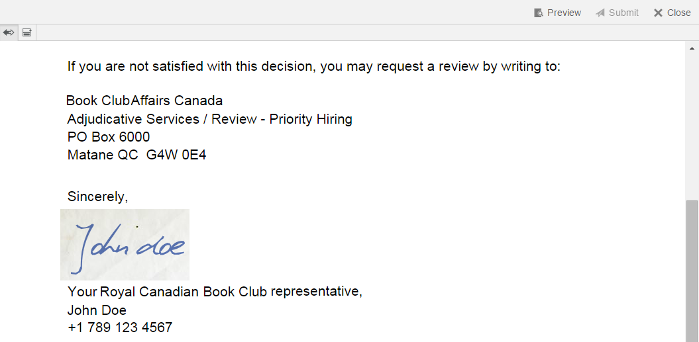

# 管理代理签名图像{#manage-agent-signature-images}

## 概述 {#overview}

在通信管理中，您可以使用图像来呈现信件中的代理签名。 设置代理签名图像后，在创建信件时，可以将信件中的代理签名图像渲染为发件人代理的签名。

agentSignatureImage DDE是一个计算的DDE，表示代理的签名图像。 此计算DDE的表达式使用表达式管理器构建块公开的新自定义函数。 此自定义函数将agentID和agentFolder作为输入参数，并根据这些参数获取图像内容。 SystemContext系统数据字典允许“通信管理”中的信件访问当前系统上下文中的信息。 系统上下文包括有关当前登录的用户和活动配置参数的信息。

您可以在cmuserroot文件夹下添加图像。 在[通信管理配置属性](/help/forms/using/cm-configuration-properties.md)中，使用CM User Root属性，您可以更改获取代理签名图像的文件夹。

agentFolder DDE的值从Correspondence Management配置属性的CMUserRoot配置参数中获取。 默认情况下，此配置参数指向CRX存储库中的/content/cmUserRoot。 您可以在配置属性中更改CMUserRoot配置的值。
您还可以覆盖默认自定义函数，以定义您自己的用于获取用户签名图像的逻辑。

## 添加代理签名图像 {#adding-agent-signature-image}

1. 确保代理签名映像的名称与用户的AEM用户名相同。 （图像文件名不需要扩展名。）
1. 在CRX的内容文件夹中，创建一个名为`cmUserRoot`的文件夹。

   1. 转到`https://'[server]:[port]'/crx/de`。 如有必要，请以管理员身份登录。

   1. 右键单击&#x200B;**content**&#x200B;文件夹，然后选择&#x200B;**创建** > **创建文件夹**。

      

   1. 在“创建文件夹”对话框中，将文件夹名称输入为`cmUserRoot`。 单击&#x200B;**全部保存**。

      >[!NOTE]
      >
      >cmUserRoot是AEM查找代理签名映像的默认位置。 但是，您可以通过编辑[通信管理配置属性](/help/forms/using/cm-configuration-properties.md)中的CM用户根属性来更改它。

1. 在内容资源管理器中，导航到cmUserRoot文件夹并在其中添加代理签名图像。

   1. 转到`https://'[server]:[port]'/crx/explorer/index.jsp`。 如有必要，以管理员身份登录。
   1. 单击&#x200B;**内容资源管理器**。 内容资源管理器将在新窗口中打开。
   1. 在内容资源管理器中，导航到cmUserRoot文件夹并将其选定。 右键单击&#x200B;**cmUserRoot**&#x200B;文件夹并选择&#x200B;**新建节点**。

      cmUserRoot中的

      在新节点的行中生成以下条目，然后单击绿色复选标记。

      **名称：** JohnDoe（或代理签名文件的名称）

      **类型：** nt：file

      在`cmUserRoot`文件夹下，将创建一个名为`JohnDoe`的新文件夹（或您在上一步中提供的名称）。

   1. 单击您已创建的新文件夹（此处`JohnDoe`）。 内容资源管理器将文件夹的内容显示为灰色。

   1. 双击&#x200B;**jcr：content**&#x200B;属性，将其类型设置为&#x200B;**nt：resource**，然后单击绿色复选标记保存该条目。

      如果属性不存在，请先创建一个名为jcr：content的属性。

      

      jcr：content的子属性中包括jcr：data，它呈灰显状态。 双击jcr：data。 该属性将变为可编辑，并且条目中会显示“选择文件”按钮。 单击&#x200B;**选择文件**，然后选择要用作徽标的图像文件。 图像文件无需扩展名。

      

   单击&#x200B;**全部保存**。

1. 确保您在信件中使用的XDP\layout在左下方（或您要呈现签名的布局中的其他适当位置）有一个图像字段来呈现签名图像。
1. 创建通信时，在“数据”选项卡中，使用以下步骤为签名图像选择一个图像字段：

   1. 从右窗格的“链接类型”弹出菜单中选择“系统”。

   1. 从SystemContext DD的“数据元素”面板的列表中选择agentSignatureImage DDE。

   1. 保存书信。

1. 呈现信件时，您可以在信件预览中看到您根据布局在图像字段中签名。

   书信中的
