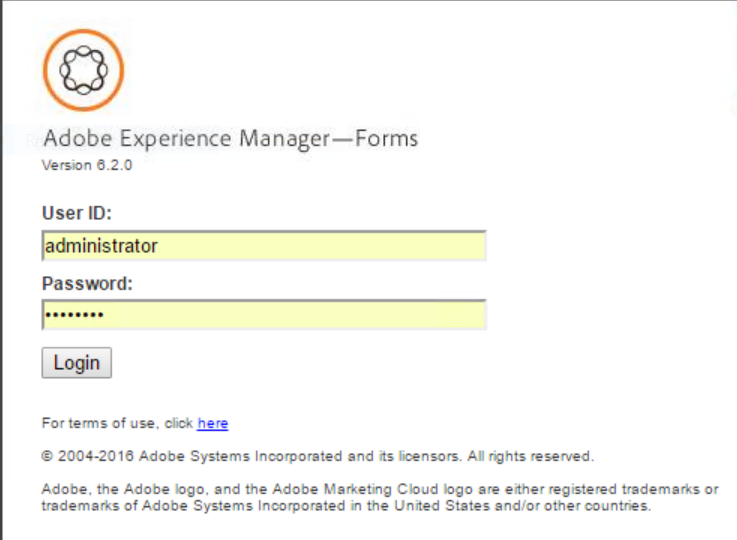

# 进程报告入门{#getting-started-with-process-reporting}

进程报告使AEM Forms用户能够查询有关AEM Forms执行中目前定义的AEM Forms进程的信息。 但是，“流程报告”不直接从AEM Forms存储库访问数据。 数据首先按计划发布到“进程报告”存储库（*由ProcessDataPublisher和ProcessDataStorage服务* s）。 然后，将从发布到存储库的流程查询数据中生成“正在处理报告”中的报告和报告。 进程报告作为Forms Workflow模块的一部分安装。

本文详细介绍了启用将AEM Forms数据发布到流程报告库的步骤。 之后，您将能够使用“流程报告”运行报告和查询。 本文还介绍了配置流程报告服务的可用选项。

## 流程报告先决条件{#process-reporting-pre-requisites}

### 清除非必要进程{#purge-non-essential-processes}

如果您当前使用Forms Workflow,AEM Forms数据库可能包含大量数据

进程报告发布服务将发布数据库中当前可用的所有AEM Forms数据。 这意味着，如果数据库包含您不想运行报告和查询的旧数据，则所有这些数据也将发布到存储库，即使报告不需要它。 建议您在运行服务之前清除此数据，以将数据发布到“流程报告”存储库。 这将改善发布服务和查询报告数据的服务的性能。

有关清除AEM Forms进程数据的详细信息，请参阅[清除进程数据](https://help.adobe.com/en_US/livecycle/11.0/AdminHelp/WS92d06802c76abadb-5145d5d12905ce07e7-7cb2.2.html)。

>[!NOTE]
>
>有关清除实用程序的提示和技巧，请参阅Adobe Developer Connection文章[清除进程和作业](https://www.adobe.com/content/dam/Adobe/en/devnet/livecycle/pdfs/purging_processes_jobs.pdf)。

## 配置进程报告服务{#configuring-process-reporting-services}

### 计划进程数据发布{#schedule-process-data-publishing}

进程报告服务按计划将数据从AEM Forms数据库发布到进程报告库。

此操作会占用大量资源，并会影响AEM Forms服务器的性能。 建议您在AEM Forms服务器忙时段之外计划此设置。

默认情况下，计划发布数据的时间为每天凌晨2点。

请执行以下步骤来更改发布计划:

>[!NOTE]
>
>如果您正在群集上运行AEM Forms实施，请在群集的每个节点上执行以下步骤。

1. 停止AEM Forms服务器实例。
1. &#x200B;

   * （对于Windows）在编辑器中打开`[JBoss root]/bin/run.conf.bat`文件。
   * （对于Linux、AIX和Solaris）编辑器中的`[JBoss root]/bin/run.conf.sh`文件。

1. 添加JVM参数`-Dreporting.publisher.cron = <expression>.`

   示例：以下cron表达式导致流程报告每5小时将AEM Forms数据发布到流程报告存储库：

   * `-Dreporting.publisher.cron = 0_0_0/5_*_*_?`

1. 保存并关闭`run.conf.bat`文件。

1. 重新启动AEM Forms服务器实例。

1. 停止AEM Forms服务器实例。
1. 登录到WebSphere管理控制台。 在导航树中，单击&#x200B;**服务器** > **应用程序服务器**，然后在右窗格中单击服务器名称。

1. 在“服务器基础架构”下，单击&#x200B;**Java and Process Management** > **Process Definition**。

1. 在“其他属性”下，单击&#x200B;**Java虚拟机**。

   在“通用JVM参数”框中，添加参数`-Dreporting.publisher.cron = <expression>.`

   **示例**:以下cron表达式导致流程报告每5小时将AEM Forms数据发布到流程报告存储库：

   * `-Dreporting.publisher.cron = 0_0_0/5_*_*_?`

1. 单击&#x200B;**应用**，单击确定，然后单击直接保存到主控配置&#x200B;**。**
1. 重新启动AEM Forms服务器实例。
1. 停止AEM Forms服务器实例。
1. 登录到WebLogic管理控制台。 WebLogic管理控制台的默认地址为`https://[hostname]:[port]/console`。
1. 在“更改中心”下，单击&#x200B;**“锁定并编辑”**。
1. 在“域结构”下，单击“**环境** > **服务器**”，在右窗格中单击受控服务器名称。
1. 在下一个屏幕上，单击&#x200B;**配置**&#x200B;选项卡> **服务器开始**&#x200B;选项卡。
1. 在“参数”框中，添加JVM参数`-Dreporting.publisher.cron = <expression>`。

   **示例**:以下cron表达式导致流程报告每5小时将AEM Forms数据发布到流程报告存储库：

   `-Dreporting.publisher.cron = 0_0_0/5_*_*_?`

1. 单击&#x200B;**保存**，然后单击&#x200B;**激活更改**。
1. 重新启动AEM Forms服务器实例。

### ProcessDataStorage服务{#processdatastorage-service}

ProcessDataStorageProvider服务从ProcessDataPublisher服务接收进程数据并将数据保存到进程报告库。

在每个发布周期，数据都保存到预定义根文件夹的子文件夹中。

您可以使用管理控制台配置根(**default**):`/content/reporting/pm`位置和子文件夹(**default**):`/yyyy/mm/dd/hh/mi/ss`)层次结构格式，其中存储流程数据。

#### 配置进程报告存储库位置{#to-configure-the-process-reporting-repository-locations}

1. 使用管理员凭据登录到&#x200B;**管理控制台**。 管理控制台的默认URL为`https://'[server]:[port]'/adminui`
1. 导航到&#x200B;**主页**>**服务**>**应用程序和服务****服务管理**&#x200B;并打开&#x200B;**ProcessDataStorageProvider**&#x200B;服务。

   

   **根文件夹**

   存储流程数据以供报告的CRX位置。

   `Default`: `/content/reporting/pm`

   **文件夹层次结构**

   根据流程创建时间存储流程数据的文件夹层次结构。

   `Default`:  `/yyyy/mm/dd/hh/mi/ss`

1. 单击&#x200B;**保存**。

### ReportConfiguration服务{#reportconfiguration-service}

进程报告使用ReportConfiguration服务配置进程报告查询服务。

#### 配置ReportingConfiguration服务{#to-configure-the-reportingconfiguration-service}

1. 使用CRX管理员凭据登录到&#x200B;**Configuration Manager**。 Configuration Manager的默认URL为`https://'[server]:[port]'/lc/system/console/configMgr`
1. 打开&#x200B;**ReportingConfiguration**&#x200B;服务。
1. **记录数**

   在存储库上运行查询时，结果可能包含大量记录。 如果结果集很大，查询执行可能会占用服务器资源。

   要处理大的结果集，ReportConfiguration服务会将查询处理拆分为多批记录。 这样可减轻系统负载。

   `Default`:  `1000`

   **CRX存储路径**

   存储流程数据的CRX位置，用于报告。

   `Default`:  `/content/reporting/pm`

   >[!NOTE]
   >
   >这与ProcessDataStorage配置选项&#x200B;**根文件夹**&#x200B;中指定的位置相同。
   >
   >
   >如果更新ProcessDataStorage配置中的“根文件夹”选项，则需要更新ReportConfiguration服务中的CRX存储路径位置。

1. 单击&#x200B;**保存**&#x200B;并关闭&#x200B;**CQ Configuration Manager**。

### ProcessDataPublisher服务{#processdatapublisher-service}

ProcessDataPublisher服务从AEM Forms数据库导入进程数据，并将数据发布到ProcessDataStorageProvider服务以供存储。

#### 配置ProcessDataPublisher服务   {#to-configure-processdatapublisher-service-nbsp}

1. 使用管理员凭据登录到&#x200B;**管理控制台**。

   默认URL为`https://'server':port]/adminui/`。

1. 导航到&#x200B;**主页**>**服务**>**应用程序和服务****服务管理**&#x200B;并打开&#x200B;**ProcessDataPublisher**&#x200B;服务。

**发布数据**

启用此选项可开始发布流程数据。 默认情况下，该选项处于禁用状态。

仅当与流程报告组件相关的所有配置都设置得当时，才启用流程报告。

或者，当不再需要进程数据发布时，也可使用此选项来禁用进程数据发布。

`Default`:  `Off`

**批处理间隔（秒）**

每次运行ProcessDataPublisher服务时，服务首先按批处理时间间隔拆分自上次运行服务以来的时间。 然后，该服务单独处理AEM Forms数据的每个间隔。

这有助于控制发布者进程在周期内的每次运行（批处理）期间端到端的数据大小。

例如，如果发布者每天运行，则默认情况下，它将处理过程分解为24批，每批1小时。

`Default`:  `3600`

`Unit`:  `Seconds`

**锁定超时（秒）**

当发布者服务开始处理数据时，该发布者服务获取锁，使得该发布者的多个实例不开始同时运行和处理数据。

如果已获得锁的发布者服务在“锁超时”值定义的秒数内处于空闲状态，则释放其锁，以便其他发布者服务实例可以继续处理。

`Default`:  `3600`

`Unit`:  `Seconds`

**发布数据自**

AEM Forms环境包含环境建立时的数据。

默认情况下，ProcessDataPublisher服务从AEM Forms数据库导入所有数据。

根据报告需求，如果您计划在特定日期和时间后对数据运行报告和查询，建议您指定日期和时间。 然后，发布服务将从该时间开始发布日期。

`Default`:  `01-01-1970 00:00:00`

`Format`:  `dd-MM-yyyy HH:mm:ss`

## 访问进程报告用户界面{#accessing-the-process-reporting-user-interface}

流程报告的用户界面基于浏览器。

在设置“流程报告”后，您可以在AEM Forms安装中的以下位置开始处理“流程报告”:

`https://<server>:<port>/lc/pr`

### 登录到进程报告{#log-in-to-process-reporting}

当您导航到“进程报告URL”(https://&lt;server>:&lt;port>/lc/pr)时，将显示登录屏幕。

指定要登录到“进程报告”模块的凭据。

>[!NOTE]
>
>要登录“进程报告”用户界面，您需要以下“AEM Forms”权限：
>
>`PERM_PROCESS_REPORTING_USER`

登录“进程”报告时，将显示&#x200B;**[!UICONTROL “主页”]**&#x200B;屏幕。

### 进程报告主屏幕{#process-reporting-home-screen}

**流程报告树视图** :“主页”屏幕左侧的树视图包含“流程报告”模块的项。

树视图包含以下顶级项：

**报表：** 此项目包含随“流程”报告一起提供的现成报表。

有关预定义报告的详细信息，请参阅[流程中预定义报告报告](/help/forms/using/process-reporting/pre-defined-reports-in-process-reporting.md)。

**临时查询:** 此项目包含用于对进程和任务执行基于筛选器的搜索的选项。

有关点对点查询的详细信息，请参阅[处理报告中的点对点查询](/help/forms/using/process-reporting/adhoc-queries-in-process-reporting.md)。

**自定义：** 自定义节点显示您创建的自定义报告。

有关创建和显示自定义报告的过程，请参阅[处理中的自定义报告报告](/help/forms/using/process-reporting/process-reporting-custom-reports.md)。

**流程报告标题栏：** “流程报告”标题栏包含在用户界面中工作时可以使用的一些通用选项。

**流程报告标** 题：“流程报告”标题显示在标题栏的左角。

随时单击标题以返回主屏幕。

**上次更新时** 间：流程数据按计划从AEM Forms报告库发布到流程数据库。

上次更新时间显示将数据更新推送到流程报告存储库的最后日期和时间。

有关数据发布服务以及如何计划此服务的详细信息，请参阅“流程快速入门”报告中的[计划流程数据发布](/help/forms/using/process-reporting/install-start-process-reporting.md#p-schedule-process-data-publishing-p)。

**进程报告** 用户：上次更新时间的右侧显示登录用户名。

**流程报告标题栏下拉列表:** “流程报告”标题栏右角的下拉列表包含以下选项：

* **[!UICONTROL 同步]**:将嵌入式进程报告库与AEM Forms数据库同步。
* **[!UICONTROL 帮助]**:视图“流程”报告的帮助文档。
* **[!UICONTROL 注销]**:注销进程报告
