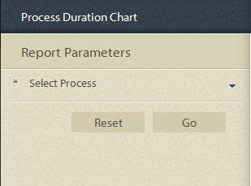

# 进程报告中的预定义报告 {#pre-defined-reports-in-process-reporting}

## 正在报告的预定义报告 {#pre-defined-reports-in-process-reporting-1}

AEM Forms Process Reporting随以下&#x200B;*个现成报告*&#x200B;提供：

* **[长时间运行的进程](#long-running-processes)**：完成时间超过指定时间的所有AEM Forms进程的报告
* **[进程持续时间图表](#process-duration-report)**：按持续时间列出的指定AEM Forms进程的报告
* **[工作流卷](#workflow-volume-report)**：按日期显示指定进程的运行实例和已完成实例的报告

## 长时间运行的进程 {#long-running-processes}

“长时间运行的进程”报表显示已花费超过指定时间完成的AEM Forms进程。

### 执行长时间运行的进程报告 {#to-execute-a-long-running-process-report}

1. 要查看进程报告中的预定义报告列表，请在&#x200B;**进程报告**&#x200B;树视图中，单击&#x200B;**报告**&#x200B;节点。
1. 单击&#x200B;**长时间运行的进程**&#x200B;报告节点。

   

   选择报告时，**报告参数**&#x200B;面板会显示在树视图的右侧。

   

   参数：

   * **持续时间** （*必需*）：指定持续时间和时间单位。 显示已运行超过指定持续时间的所有AEM Forms进程。
   * **开始于**&#x200B;之后（*可选*）：选择日期。 筛选报告以显示在指定日期之后开始的进程实例。
   * **在**&#x200B;之前开始（*可选*）：选择日期。 筛选报告以显示在指定日期之前开始的进程实例。

1. 单击&#x200B;**转到**&#x200B;以执行报告。

   报告显示在&#x200B;**进程报告**&#x200B;窗口右侧的&#x200B;**报告**&#x200B;面板中。

   

   使用&#x200B;**报告**&#x200B;面板右上角的选项对报告执行以下操作。

   * **刷新**：使用存储中的最新数据刷新报告
   * **更改图例颜色**：选择并更改报表图例的颜色
   * **导出到CSV**：将数据从报表导出并下载到以逗号分隔的文件中

## 进程持续时间报表  {#process-duration-report}

进程持续时间报表按每个实例已运行的天数显示Forms进程的实例数。

### 执行进程持续时间报告 {#to-execute-a-process-duration-report}

1. 要查看进程报告中的预定义报告，请在&#x200B;**进程报告**&#x200B;树视图中，单击&#x200B;**报告**&#x200B;节点。
1. 单击&#x200B;**进程持续时间**&#x200B;报告节点。

   

   选择报告时，**报告参数**&#x200B;面板会显示在树视图的右侧。

   

   参数：

   * **选择进程** （*强制*）：选择AEM Forms进程。

1. 单击&#x200B;**转到**&#x200B;以执行报告。

   报告显示在“进程报告”窗口右侧的&#x200B;**报告**&#x200B;面板中。

   

   使用&#x200B;**报告**&#x200B;面板右上角的选项对报告执行以下操作。

   * **刷新**：使用存储中的最新数据刷新报告
   * **更改图例颜色**：选择并更改报表图例的颜色
   * **导出到CSV**：将数据从报表导出并下载到以逗号分隔的文件中

## “Workflow Volume”报告 {#workflow-volume-report}

“工作流量”报表按日历日显示当前运行和已完成的AEM Forms进程实例数。

### 执行工作流卷报告 {#to-execute-a-workflow-volume-report}

1. 要查看进程报告中的预定义报告，请在&#x200B;**进程报告**&#x200B;树视图中，单击&#x200B;**报告**&#x200B;节点。
1. 单击&#x200B;**工作流卷**&#x200B;报告节点。

   

   选择报告时，**报告参数**&#x200B;面板会显示在树视图的右侧。

   

   参数：

   * **选择进程** （*强制*）：选择AEM Forms进程。

   * **开始于**&#x200B;之后（*可选*）：选择日期。 筛选报告以显示在指定日期之后开始的进程实例。

   * **在**&#x200B;之前开始（*可选*）：选择日期。 筛选报告以显示在指定日期之前开始的进程实例。

1. 单击&#x200B;**转到**&#x200B;以执行报告。

   报告显示在&#x200B;**进程报告**&#x200B;窗口右侧的&#x200B;**报告**&#x200B;面板中。

   

   使用&#x200B;**报告**&#x200B;面板右上角的选项对报告执行以下操作。

   * **刷新**：使用存储中的最新数据刷新报告
   * **更改图例颜色**：选择并更改报表图例的颜色
   * **导出到CSV**：将数据从报表导出并下载到以逗号分隔的文件中
