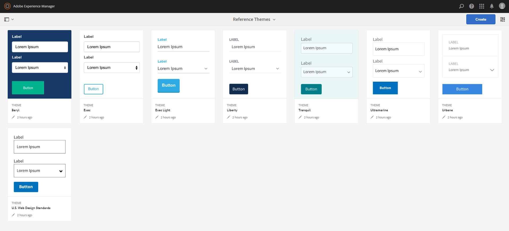
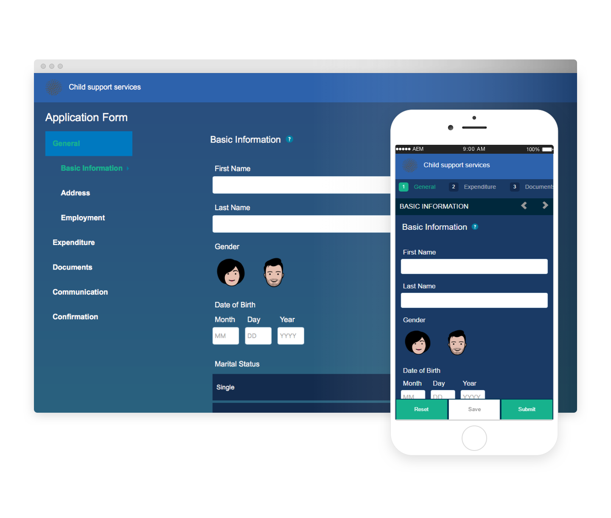
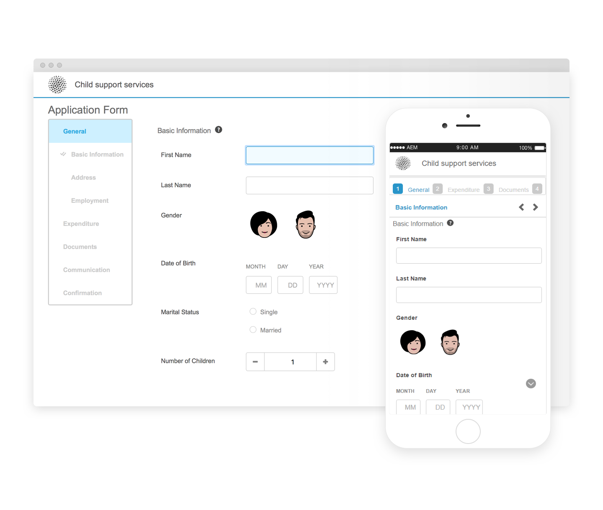
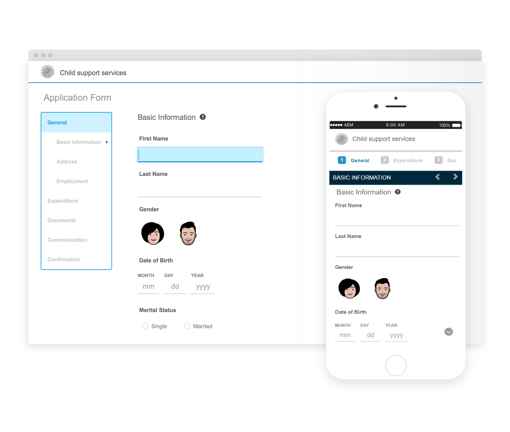
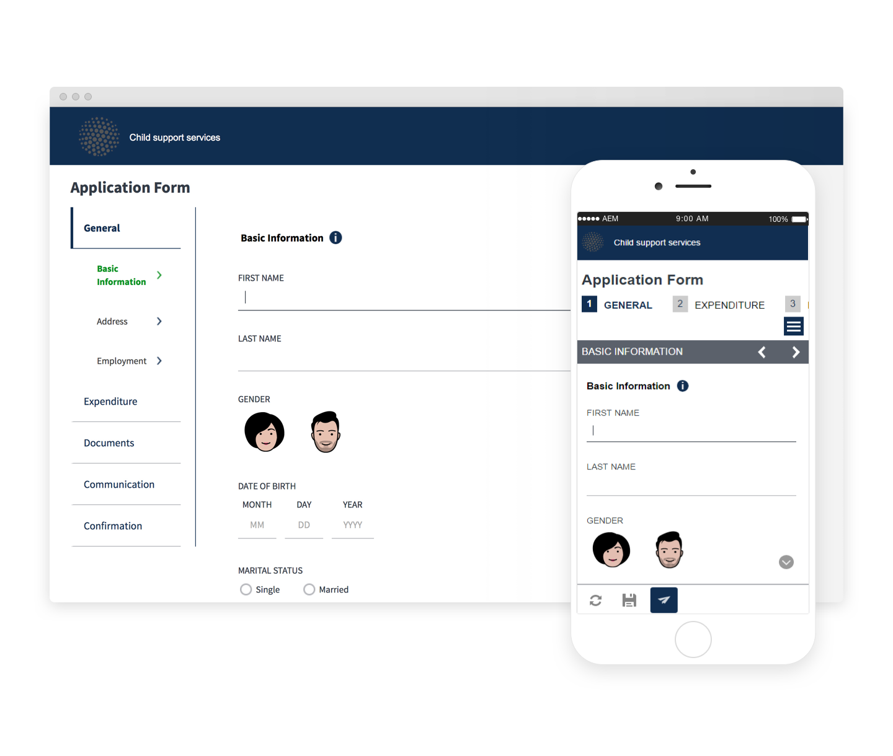
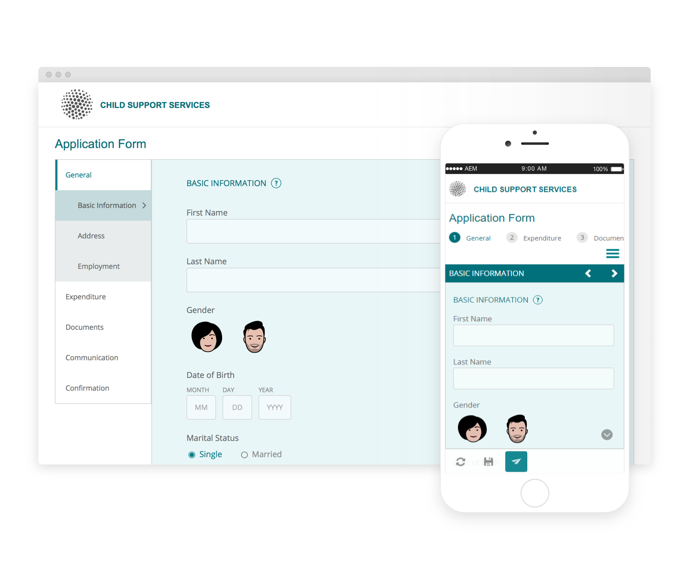
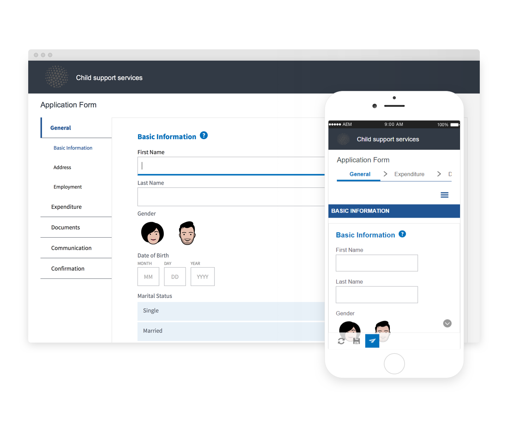
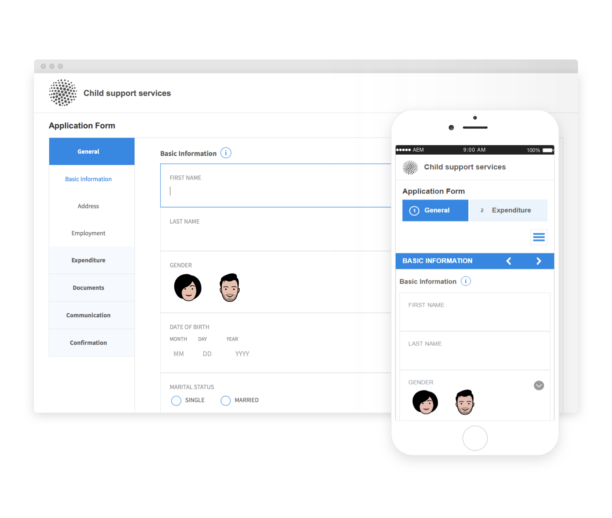
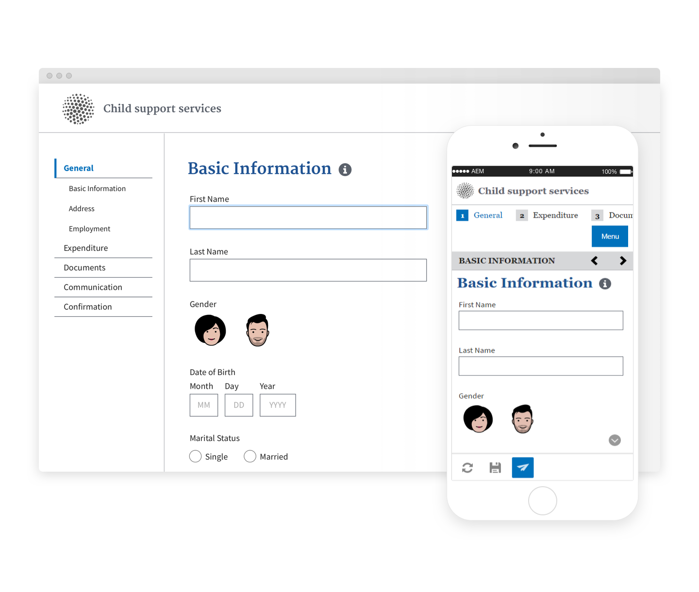

# 参考主题{#reference-themes}

[主题](../../forms/using/themes.md)允许您在不了解CSS的情况下设置表单样式。 除了默认主题之外，您还可以通过安装[AEM Forms附加组件包](https://experienceleague.adobe.com/docs/experience-manager-release-information/aem-release-updates/forms-updates/aem-forms-releases.html?lang=en)获取以下主题：

* 贝里尔
* 执行
* Exec-Light
* 自由
* 超海洋
* 城镇
* 美国Web设计标准
* 宁静

每个主题都包含独特而优雅的样式，可用于为用户创建令人愉悦的自适应表单。 它包含面板、文本框、数字框、单选按钮、表格和开关等选择器的独特样式。 这些主题中的样式是根据需求而定的。 例如，在特定场景中，您需要使用简洁字体的最小主题。 自由主题可让您获得这样的外观。

此包中包含的主题是响应式的，这些主题中的样式是为移动和桌面显示定义的。 各种设备上的大多数现代浏览器都可以轻松渲染应用了这些主题之一的表单。

有关安装包的详细信息，请参阅[如何使用包](/help/sites-administering/package-manager.md)。

## 贝里尔 {#beryl}

We.Gov自适应表单使用Beryl主题，并强调使用背景图像、透明度以及大平面图标。 在下面的屏幕截图中，您可以看到贝里尔主题的外观，以及它如何增强表单的样式。

<!--
[Click to enlarge

](assets/beryl-1.png)
-->

## 执行 {#exec}

Exec theme avoids solid background fills to emphasize form components. Selecting and clicking components changes font colors. In comparison to the default Canvas theme, font color of the text in the selected tab changes to dark blue. Notice how the navigation and submit buttons are different from the Beryl theme.

<!--
[Click to enlarge

](assets/exec-1.png)
-->

## Exec Light {#exec-light}

Exec Light theme uses white space to create a seamless experience. The Next and Submit buttons get a solid fill and 3D shadow. Selected tabs on the left get an arrow instead of double-check marks.

<!--
[Click to enlarge

](assets/exec-light-1.png)
-->

## 自由 {#liberty}

Liberty theme uses a minimalist approach to highlight the important. For example, the font color of the visited tab changes to green. You can only see the bottom-outline of the text box which emulates the look of a paper-based form with lines. The active text box has a black bottom-outline while others get light gray bottom-outline.

<!--
[Click to enlarge

](assets/liberty-1.png)
-->

## 宁静 {#tranquil}

Tranquil theme provides light and dark shades of the Tranquil color scheme to highlight different components of a form. For example, radio buttons, panels, and tabs get a different shade of green.

<!--
[Click to enlarge

](assets/tranquil-1.png)
-->

## 超海洋 {#ultramarine}

Ultramarine theme uses deep blue shades to highlight components such as tabs, panels, text boxes, and buttons.

<!--[Click to enlarge](assets/ultramarine-1.png)-->

## 城镇 {#urbane}

都市化主题强调您的外表应具有极简和功能性的风格。 将Urbane主题应用于表单时，您可以看到组件是平面的。 这些面板具有细的外框，可创建现代外观。

<!--
[Click to enlarge

](assets/urbane-1.png)
-->

## 美国Web设计标准 {#u-s-web-design-standards}

顾名思义，美国Web设计标准主题使用美国Web设计标准草案站点中描述的字体和样式。 联邦机构使用Web标准来跨联邦政府网站创建一致的Web体验。

<!--
[Click to enlarge

](assets/usgov.png)
-->
