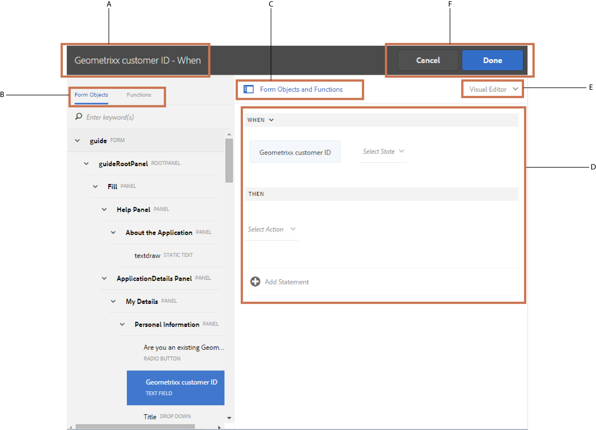
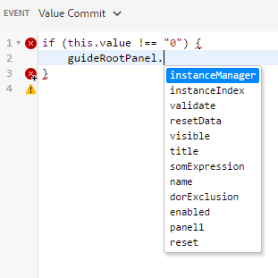

# 自适应表单规则编辑器{#adaptive-forms-rule-editor}

## 概述 {#overview}

Adobe Experience Manager Forms中的规则编辑器功能使表单业务用户和开发人员能够编写关于自适应表单对象的规则。 这些规则根据表单上的预设条件、用户输入和用户操作定义要在表单对象上触发的操作。 它有助于进一步简化表单填写体验，确保准确性和速度。

规则编辑器提供了一个直观且简化的用户界面来编写规则。 规则编辑器为所有用户提供了一个可视化编辑器。 此外，规则编辑器仅为高级表单用户提供代码编辑器来编写规则和脚本。 您可以使用规则对自适应表单对象执行的一些关键操作包括：

* 显示或隐藏对象
* 启用或禁用对象
* 为对象设置值
* 验证对象的值
* 执行函数以计算对象的值
* 调用表单数据模型服务并执行操作
* 对象的set属性

规则编辑器取代了AEM 6.1 Forms及更早版本中的脚本编写功能。 但是，现有脚本将保留在新规则编辑器中。 有关在规则编辑器中使用现有脚本的更多信息，请参阅 [规则编辑器对现有脚本的影响](#impact-of-rule-editor-on-existing-scripts).

添加到表单高级用户组的用户可以创建新脚本并编辑现有脚本。 表单用户组中的用户可以使用脚本，但不能创建或编辑脚本。

## 了解规则 {#understanding-a-rule}

规则是操作和条件的组合。 在规则编辑器中，操作包括隐藏、显示、启用、禁用或计算表单中对象的值等活动。 条件是布尔表达式，通过对表单对象的状态、值或属性执行检查和操作来计算这些表达式。 根据值( `True` 或 `False`)返回。

规则编辑器提供了一组预定义的规则类型，如“时间”、“显示”、“隐藏”、“启用”、“禁用”、“设置值”和“验证”，以帮助您编写规则。 每种规则类型都允许您定义规则中的条件和操作。 本文档进一步详细说明了每种规则类型。

规则通常遵循以下任一结构：

**条件 — 操作** 在此结构中，规则首先定义一个条件，然后定义要触发的操作。 该结构类似于编程语言中的if-then语句。

在规则编辑器中， **When** 规则类型强制使用条件操作结构。

**Action-Condition** 在此结构中，规则首先定义要触发的操作，其后是要评估的条件。 此结构的另一个变体是action-condition-alternate操作，该操作还定义了在条件返回False时要触发的替代操作。

规则编辑器中的显示、隐藏、启用、禁用、设置值和验证规则类型可强制使用操作条件规则结构。 默认情况下，“显示”的替代操作为“隐藏”，“启用”的替代操作为“禁用”，反之亦然。 您无法更改默认的替代操作。

>[!NOTE]
>
>可用的规则类型（包括您在规则编辑器中定义的条件和操作）还取决于您创建规则时所在的表单对象类型。 规则编辑器仅显示用于为特定表单对象类型编写条件和操作语句的有效规则类型和选项。 例如，您看不到面板对象的“验证”、“设置值”、“启用”和“禁用”规则类型。

有关规则编辑器中可用的规则类型的更多信息，请参阅 [规则编辑器中可用的规则类型](#available-rule-types-in-rule-editor).

### 选择规则结构的准则 {#guidelines-for-choosing-a-rule-construct}

虽然您可以使用任何规则结构实现大多数用例，但以下是选择一个结构而不是另一个结构的一些准则。 有关规则编辑器中可用规则的更多信息，请参阅 [规则编辑器中可用的规则类型](#available-rule-types-in-rule-editor).

* 创建规则时的一条典型经验法则是，在要在其上编写规则的对象的上下文中考虑该规则。 考虑您要根据用户在字段A中指定的值隐藏或显示字段B。在这种情况下，您将评估字段A的条件，并根据它返回的值，触发对字段B的操作。

   因此，如果您在字段B（用于评估条件的对象）上编写规则，请使用条件 — 操作结构或When规则类型。 同样，在字段A中使用action-condition结构或显示或隐藏规则类型。

* 有时，您需要根据一个条件执行多个操作。 在这种情况下，建议使用条件操作结构。 在此结构中，您只需评估一次条件，即可指定多个action语句。

   例如，要根据用户在字段A中指定的值检查条件来隐藏字段B、C和D，请在字段A中使用条件 — 操作结构或When规则类型编写一个规则，并指定操作以控制字段B、C和D的可见性。否则，您需要在字段B、C和D中使用三个单独的规则，其中每个规则检查条件并显示或隐藏相应的字段。 在此示例中，在一个对象上写入When规则类型比在三个对象上显示或隐藏规则类型更有效。

* 要触发基于多个条件的操作，建议使用操作条件结构。 例如，要通过评估字段B、C和D上的条件来显示和隐藏字段A，请对字段A使用显示或隐藏规则类型。
* 如果规则包含一个条件的操作，则使用条件 — 操作或操作条件结构。
* 如果规则检查某个条件，并在字段中提供值或退出字段时立即执行操作，则建议在评估该条件的字段上编写包含条件 — 操作结构或When规则类型的规则。
* 当用户更改应用When规则的对象的值时，将评估When规则中的条件。 但是，如果您希望操作在服务器端值发生更改时触发，例如在预填充值的情况下，建议编写一个When规则，该规则在初始化字段时触发操作。
* 编写下拉列表、单选按钮或复选框对象的规则时，表单中这些表单对象的选项或值会预填充到规则编辑器中。

## 规则编辑器中可用的运算符类型和事件 {#available-operator-types-and-events-in-rule-editor}

规则编辑器提供了以下逻辑运算符和事件，您可以使用它们创建规则。

* **等于**
* **不等于**
* **开头**
* **结束于**
* **包含**
* **为空**
* **不为空**
* **已选择：** 当用户为复选框、下拉菜单、单选按钮选择特定选项时，返回true。
* **初始化（事件）：** 表单对象在浏览器中呈现时返回true。
* **已更改（事件）：** 当用户更改表单对象的输入值或选定选项时，返回true。

## 规则编辑器中可用的规则类型 {#available-rule-types-in-rule-editor}

规则编辑器提供了一组可用于编写规则的预定义规则类型。 让我们详细查看每个规则类型。 有关在规则编辑器中编写规则的更多信息，请参阅 [写入规则](#write-rules).

### 当 {#whenruletype}

的 **When** 规则类型如下 **condition-action-alternate操作** 规则的构造，有时只是 **condition-action** 构造。 在此规则类型中，您首先指定一个评估条件，然后指定一个满足该条件时要触发的操作( `True`)。 使用When规则类型时，您可以使用多个AND和OR运算符来创建 [嵌套表达式](#nestedexpressions).

使用When规则类型，您可以评估表单对象上的条件并对一个或多个对象执行操作。

简而言之，典型的When规则的结构如下所示：

`When on Object A:`

`(Condition 1 AND Condition 2 OR Condition 3) is TRUE;`

`Then, do the following:`

对对象B采取行动2;对C的第3项行动；

_

当您拥有多值组件（如单选按钮或列表）时，在为该组件创建规则时，系统会自动检索选项，并将其提供给规则创建者。 您无需再次键入选项值。

例如，列表有四个选项：红色、蓝色、绿色和黄色。 创建规则时，会自动检索选项（单选按钮），并将其提供给规则创建者，如下所示：


在编写When规则时，您可以触发“清除值”操作。 Clear Value Of（清除的值）操作会清除指定对象的值。 将Clear Value作为When语句中的选项，允许您创建包含多个字段的复杂条件。


**隐藏** 隐藏指定的对象。

**显示** 显示指定的对象。

**启用** 启用指定的对象。

**禁用** 禁用指定的对象。

**调用服务** 调用在表单数据模型中配置的服务。 选择“调用服务”操作时，将显示一个字段。 点按该字段时，它会显示在您的AEM实例上以所有表单数据模型配置的所有服务。 在选择表单数据模型服务时，会显示其他字段，您可以在这些字段中使用指定服务的输入和输出参数映射表单对象。 请参阅用于调用表单数据模型服务的示例规则。

除了表单数据模型服务之外，您还可以指定直接WSDL URL来调用Web服务。 但是，表单数据模型服务具有许多好处，并且建议采用调用服务的方法。

有关在表单数据模型中配置服务的更多信息，请参阅 [AEM Forms数据集成](/help/forms/using/data-integration.md).

**设置值** 计算并设置指定对象的值。 您可以将对象值设置为字符串、另一个对象的值、使用数学表达式或函数的计算值、对象的属性值或配置表单数据模型服务的输出值。 当您选择Web服务选项时，它将显示在AEM实例上以所有表单数据模型配置的所有服务。 在选择表单数据模型服务时，会显示其他字段，您可以在这些字段中使用指定服务的输入和输出参数映射表单对象。

有关在表单数据模型中配置服务的更多信息，请参阅 [AEM Forms数据集成](/help/forms/using/data-integration.md).

的 **设置属性** 利用规则类型，可根据条件操作设置指定对象的属性值。

它允许您定义规则以动态地向自适应表单添加复选框。 您可以使用自定义函数、表单对象或对象属性来定义规则。


要根据自定义函数定义规则，请选择 **函数输出** 从下拉列表中，并从 **函数** 选项卡。 如果满足条件操作，则将自定义函数中定义的复选框数量添加到自适应表单。

要根据表单对象定义规则，请选择 **表单对象** 从下拉列表中，并从 **表单对象** 选项卡。 如果满足条件操作，则表单对象中定义的复选框数量将添加到自适应表单。

基于对象属性的设置属性规则允许您基于自适应表单中包含的其他对象属性在自适应表单中添加复选框数量。

下图描述了根据自适应表单中的下拉列表数量动态添加复选框的示例：


**清除值** 清除指定对象的值。

**集中** 将焦点设置在指定的对象上。

**保存表单** 保存表单。

**提交Forms** 提交表单。

**重置表单** 重置表单。

**验证表单** 验证表单。

**添加实例** 添加指定可重复面板或表行的实例。

**删除实例** 删除指定的可重复面板或表行的实例。

**导航到** 导航到其他交互式通信、自适应表单、其他资产（如图像或文档片段）或外部URL。 有关更多信息，请参阅 [向交互式通信添加按钮](../../forms/using/create-interactive-communication.md#addbuttontothewebchannel).

### 设置值 {#set-value-of}

的 **[!UICONTROL 设置值]** 规则类型允许您根据是否满足指定的条件来设置表单对象的值。 该值可以设置为另一个对象的值、文字字符串、从数学表达式或函数派生的值、另一个对象的属性的值或表单数据模型服务的输出。 同样，您可以检查组件、字符串、属性或从函数或数学表达式派生的值的条件。

请注意，“设置值”规则类型并非适用于所有表单对象，如面板和工具栏按钮。 规则的标准集值具有以下结构：


将对象A的值设置为：

（字符串ABC）OR（对象C的对象属性X）OR（来自函数的值）OR（来自数学表达式的值）OR（数据模型服务或Web服务的输出值）；

时间（可选）：

（条件1和条件2和条件3）为TRUE;


以下示例采用 `dependentid` 字段，并设置 `Relation` 的 `Relation` 论据 `getDependent` 表单数据模型服务。


使用表单数据模型服务的设置值规则示例

>[!NOTE]
>
>此外，您还可以使用“设置值”规则从表单数据模型服务或Web服务的输出填充下拉列表组件中的所有值。 但是，请确保您选择的输出参数是数组类型。 数组中返回的所有值都将在指定的下拉列表中可用。

### 显示 {#show}

使用 **显示** 规则类型中，您可以编写规则以根据是否满足条件来显示或隐藏表单对象。 如果不满足条件或返回，则显示规则类型还会触发隐藏操作 `False`.

典型的显示规则的结构如下所示：


`Show Object A;`

`When:`

`(Condition 1 OR Condition 2 OR Condition 3) is TRUE;`

`Else:`

`Hide Object A;`


### 隐藏 {#hide}

与显示规则类型类似，您可以使用 **隐藏** 规则类型，用于根据是否满足条件显示或隐藏表单对象。 如果不满足条件或返回，则“隐藏”规则类型还会触发“显示”操作 `False`.

典型的隐藏规则的结构如下所示：


`Hide Object A;`

`When:`

`(Condition 1 AND Condition 2 AND Condition 3) is TRUE;`

`Else:`

`Show Object A;`


### 启用 {#enable}

的 **启用** 规则类型允许您根据是否满足条件来启用或禁用表单对象。 如果不满足条件或返回，则启用规则类型还会触发禁用操作 `False`.

典型的“启用”规则的结构如下所示：


`Enable Object A;`

`When:`

`(Condition 1 AND Condition 2 AND Condition 3) is TRUE;`

`Else:`

`Disable Object A;`


### 禁用 {#disable}

与启用规则类型类似， **禁用** 规则类型允许您根据是否满足条件来启用或禁用表单对象。 如果不满足条件或返回，则Disable规则类型还会触发Enable操作 `False`.

典型的禁用规则的结构如下所示：


`Disable Object A;`

`When:`

`(Condition 1 OR Condition 2 OR Condition 3) is TRUE;`

`Else:`

`Enable Object A;`

### 验证 {#validate}

的 **验证** 规则类型使用表达式验证字段中的值。 例如，您可以编写表达式来检查用于指定名称的文本框是否不包含特殊字符或数字。

典型的验证规则的结构如下所示：

`Validate Object A;`

`Using:`

`(Expression 1 AND Expression 2 AND Expression 3) is TRUE;`

>[!NOTE]
>
>如果指定的值与“验证”规则不符，则可以向用户显示验证消息。 您可以在 **[!UICONTROL 脚本验证消息]** 字段。


### 设置选项 {#setoptionsof}

的 **设置选项** 规则类型允许您定义规则以动态地将复选框添加到自适应表单。 您可以使用表单数据模型或自定义函数来定义规则。

要根据自定义函数定义规则，请选择 **函数输出** 从下拉列表中，并从 **函数** 选项卡。 自定义函数中定义的复选框数将添加到自适应表单中。


要创建自定义函数，请参阅 [规则编辑器中的自定义函数](#custom-functions).

要根据表单数据模型定义规则，请执行以下操作：

1. 选择 **服务输出** 从下拉列表中。
1. 选择数据模型对象。
1. 从 **显示值** 下拉列表。 自适应表单中的复选框数量源自数据库中为该属性定义的实例数。
1. 从 **保存值** 下拉列表。


## 了解规则编辑器用户界面 {#understanding-the-rule-editor-user-interface}

规则编辑器提供了一个完整而简单的用户界面，用于编写和管理规则。 在创作模式下，您可以从自适应表单中启动规则编辑器用户界面。

要启动规则编辑器用户界面，请执行以下操作：

1. 在创作模式下打开自适应表单。
1. 点按要为其写入规则的表单对象，然后点按组件工具栏中的 . 将显示规则编辑器用户界面。

   

   此视图中列出了所选表单对象上的任何现有规则。 有关管理现有规则的信息，请参阅 [管理规则](#manage-rules).

1. 点按 **[!UICONTROL 创建]** 来编写新规则。 默认情况下，当您首次启动规则编辑器时，将打开规则编辑器用户界面的可视编辑器。

   

让我们详细查看规则编辑器UI的每个组件。

### A.组件规则显示 {#a-component-rule-display}

显示用于启动规则编辑器的自适应表单对象的标题以及当前选定的规则类型。 在上例中，规则编辑器从名为“薪金”的自适应表单对象启动，所选的规则类型为“时间”。

### B.表单对象和职能 {#b-form-objects-and-functions-br}

规则编辑器用户界面左侧的窗格包含两个选项卡： **[!UICONTROL Forms对象]** 和 **[!UICONTROL 函数]**.

“表单对象”选项卡显示自适应表单中包含的所有对象的分层视图。 它显示对象的标题和类型。 编写规则时，可以将表单对象拖放到规则编辑器中。 在创建或编辑规则时，将对象或函数拖放到占位符中时，占位符会自动采用相应的值类型。

应用了一个或多个有效规则的表单对象将标记为绿色圆点。 如果应用于表单对象的任何规则无效，则表单对象将标有黄色圆点。

“函数”选项卡包含一组内置函数，如“总和”、“最小值”、“最大值”、“平均值”、“数量”和“验证表单”。 您可以使用这些函数在可重复面板和表行中计算值，并在编写规则时在action和condition语句中使用它们。 但是，您可以创建 [自定义函数](#custom-functions) 也是。


>[!NOTE]
>
>您可以在“Forms对象和函数”选项卡中对对象和函数名称和标题执行文本搜索。

在表单对象的左树中，您可以点按表单对象以显示应用于每个对象的规则。 您不仅可以浏览各种表单对象的规则，还可以在表单对象之间复制粘贴规则。 有关更多信息，请参阅 [复制粘贴规则](#copy-paste-rules).

### C.表单对象和函数切换 {#c-form-objects-and-functions-toggle-br}

点按时，切换按钮可切换表单对象和功能窗格。

### D.可视规则编辑器 {#d-visual-rule-editor}

可视化规则编辑器是规则编辑器用户界面的可视化编辑器模式下用于写入规则的区域。 它允许您选择规则类型并相应地定义条件和操作。 在规则中定义条件和操作时，可以从“表单对象和函数”窗格中拖放表单对象和函数。

有关使用可视化规则编辑器的更多信息，请参阅 [写入规则](#write-rules).

### E.可视代码编辑器切换器 {#e-visual-code-editors-switcher}

表单级用户组中的用户可以访问代码编辑器。 对于其他用户，代码编辑器不可用。 如果您有权限，则可以使用规则编辑器上方的切换器，从可视编辑器模式切换到规则编辑器的代码编辑器模式，反之亦然。 首次启动规则编辑器时，该编辑器会在可视编辑器模式下打开。 您可以在可视编辑器模式下写入规则，或切换到代码编辑器模式以写入规则脚本。 但是，请注意，如果您修改规则或在代码编辑器中写入规则，则无法切换回该规则的可视编辑器，除非清除代码编辑器。

AEM Forms会跟踪您上次用于写入规则的规则编辑器模式。 下次启动规则编辑器时，该编辑器将在该模式下打开。 但是，您还可以配置默认模式以在指定模式下打开规则编辑器。 为此，请执行以下操作：

1. 转到AEM Web控制台(位于 `https://[host]:[port]/system/console/configMgr`.
1. 单击以编辑 **[!UICONTROL 自适应表单与交互式通信Web信道配置]**.
1. 选择 **[!UICONTROL 可视编辑器]** 或 **[!UICONTROL 代码编辑器]** 从 **[!UICONTROL 规则编辑器的默认模式]** 下拉列表

1. 单击“**[!UICONTROL 保存]**”。

### F.完成和取消按钮 {#f-done-and-cancel-buttons}

的 **[!UICONTROL 完成]** 按钮来保存规则。 您可以保存不完整的规则。 但是，不完整无效且不执行。 下次从同一表单对象启动规则编辑器时，将列出表单对象上保存的规则。 您可以在该视图中管理现有规则。 有关更多信息，请参阅 [管理规则](#manage-rules).

的 **[!UICONTROL 取消]** 按钮会放弃您对规则所做的任何更改并关闭规则编辑器。

## 写入规则 {#write-rules}

您可以使用可视化规则编辑器或代码编辑器来编写规则。 首次启动规则编辑器时，该编辑器会在可视编辑器模式下打开。 您可以切换到代码编辑器模式并写入规则。 但是，请注意，如果您在代码编辑器中编写或修改了规则，则无法切换到该规则的可视编辑器，除非清除代码编辑器。 下次启动规则编辑器时，该编辑器将以您上次创建规则时所用的模式打开。

让我们首先了解如何使用可视化编辑器编写规则。

### 使用可视编辑器 {#using-visual-editor}

让我们使用以下示例表单了解如何在可视化编辑器中创建规则。


贷款申请表示例中的“贷款要求”部分要求申请人指定其婚姻状况、薪金，如果已婚，其配偶的工资。 规则将根据用户输入计算贷款资格金额，并显示在“贷款资格”字段中。 应用以下规则以实施方案：

* “配偶的薪金”字段仅在“婚姻状况”为“已婚”时显示。
* 贷款资格金额是总工资的50%。

执行以下步骤来编写规则：

1. 首先，根据用户为“婚姻状态”单选按钮选择的选项，编写规则以控制“配偶薪金”字段的可见性。

   在创作模式下打开贷款申请表单。 点按 **婚姻状况** 组件和点按 . 接下来，点按 **[!UICONTROL 创建]** 以启动规则编辑器。

   

   启动规则编辑器时，默认情况下会选中When规则。 此外，在When语句中指定了从中启动规则编辑器的表单对象（在本例中为婚姻状态）。

   虽然您无法更改或修改所选对象，但可以使用规则下拉列表（如下所示）选择其他规则类型。 如果要在另一个对象上创建规则，请点按取消以退出规则编辑器，然后从所需的表单对象中再次启动该编辑器。

1. 点按 **[!UICONTROL 选择状态]** 下拉框并选择 **[!UICONTROL 等于]**. 的 **[!UICONTROL 输入字符串]** 字段。

   

   在婚姻状态单选按钮中， **已婚** 和 **单个** 已分配选项 **0** 和 **1** 值。 您可以在“编辑”单选按钮对话框的“标题”选项卡中验证分配的值，如下所示。

   

1. 在 **输入字符串** 字段，请指定 **0**.

   

   您已将条件定义为 `When Marital Status is equal to Married`. 接下来，定义在此条件为True时要执行的操作。

1. 在Then语句中，选择 **[!UICONTROL 显示]** 从 **[!UICONTROL 选择操作]** 下拉菜单。

   

1. 拖放 **配偶薪金** 字段 **放置对象或选择此处** 字段。 或者，点按 **放置对象或选择此处** 字段，然后选择 **配偶薪金** 字段，其中列出了表单中的所有表单对象。

   

   规则在规则编辑器中显示如下。

   

   点按 **完成** 来保存规则。

1. 重复步骤1至5，以定义另一个规则，以在婚姻状态为“单身”时隐藏“配偶薪金”字段。 规则在规则编辑器中显示如下。

   

   >[!NOTE]
   >
   >或者，您可以在“配偶薪金”字段上写一个显示规则，而不是在“婚姻状态”字段上写两个When规则，以实施相同的行为。

   

1. 接下来，编写一条规则来计算贷款资格金额（贷款资格金额占总工资的50%），并将其显示在“贷款资格”字段中。 要实现此目的，请创建 **设置值为** 贷款资格字段的规则。

   在创作模式下，点按 **[!UICONTROL 贷款资格]** 字段和点按 . 接下来，点按 **[!UICONTROL 创建]** 以启动规则编辑器。

1. 选择 **[!UICONTROL 设置值]** 规则。

   

1. 点按 **[!UICONTROL 选择选项]** 选择 **[!UICONTROL 数学表达式]**. 将打开一个用于写入数学表达式的字段。

   

1. 在表达式字段中：

   * 从Forms对象选项卡中选择或拖放 **薪金** 字段 **放置对象或选择此处** 字段。

   * 选择 **加号** 从 **选择运算符** 字段。

   * 从Forms对象选项卡中选择或拖放 **配偶薪金** 字段 **放置对象或选择此处** 字段。

   

1. 接下来，点按表达式字段周围突出显示的区域，然后点按 **扩展表达式**.

   

   在扩展表达式字段中，选择 **除以** 从 **选择运算符** 字段和 **数值** 从 **选择选项** 字段。 然后，指定 **2** 在“数字”字段中。

   

   >[!NOTE]
   >
   >您可以使用“选择选项”字段中的组件、函数、数学表达式和属性值来创建复杂的表达式。

   接下来，创建一个条件，当返回True时，表达式将执行该条件。

1. 点按 **添加条件** 添加When语句。

   

   在When语句中：

   * 从Forms对象选项卡中选择或拖放 **婚姻状况** 字段 **放置对象或选择此处** 字段。

   * 选择i **s等于** 从 **选择运算符** 字段。

   * 在另一个 **放置对象或选择此处** 字段和指定 **已婚** 在 **输入字符串** 字段。

   规则最终在规则编辑器中显示如下。  

   点按 **完成** 来保存规则。

1. 重复步骤7至12，以定义另一条规则，以在婚姻状态为“单一”时计算贷款资格。 规则在规则编辑器中显示如下。

   

>[!NOTE]
>
>或者，您也可以使用“设置值”规则在您创建的When规则中计算贷款资格，以显示 — 隐藏“配偶薪金”字段。 “婚姻状态”为“单一”时生成的组合规则在规则编辑器中如下所示。
>
>同样，您可以编写一个组合规则来控制“配偶薪金”字段的可见性，并在“婚姻状态”为“已婚”时计算贷款资格。


### 使用代码编辑器 {#using-code-editor}

添加到表单高级用户组的用户可以使用代码编辑器。 规则编辑器会自动为您使用可视化编辑器创建的任何规则生成JavaScript代码。 您可以从可视化编辑器切换到代码编辑器，以查看生成的代码。 但是，如果在代码编辑器中修改规则代码，则无法切换回可视编辑器。 如果您希望在代码编辑器而不是可视化编辑器中编写规则，则可以在代码编辑器中重新编写规则。 可视代码编辑器切换器可帮助您在两种模式之间切换。

代码编辑器JavaScript是自适应表单的表达式语言。 所有表达式都是有效的JavaScript表达式，且使用自适应表单脚本模型API。 这些表达式返回某些类型的值。 有关自适应表单类、事件、对象和公共API的完整列表，请参阅 [自适应表单的JavaScript库API引用](https://helpx.adobe.com/experience-manager/6-5/forms/javascript-api/index.html).

有关在代码编辑器中写入规则的准则的更多信息，请参阅 [自适应表单表达式](/help/forms/using/adaptive-form-expressions.md).

在规则编辑器中编写JavaScript代码时，以下可视提示可帮助您了解结构和语法：

* 语法亮点
* 自动缩进
* 表单对象、函数及其属性的提示和建议
* 自动完成表单组件名称和常用JavaScript函数



#### 规则编辑器中的自定义函数 {#custom-functions}

除了开箱即用的功能，如 *总和* 函数输出下，您可以编写您经常需要的自定义函数。 确保您编写的函数与 `jsdoc` 在上面。

随附 `jsdoc` 是必需的：

* 如果您需要自定义配置和描述。
* 因为有多种方法可在 `JavaScript,` 和注释可让您跟踪功能。

有关更多信息，请参阅 [usejsdoc.org](https://jsdoc.app/).

支持 `jsdoc` 标记：

* **私有**
语法：私有函数不作为自定义函数包含在内。`@private`
私有函数不作为自定义函数包含在内。

* **名称**
语法：或者， `@name funcName <Function Name>`
或者， `,` 您可以使用： `@function funcName <Function Name>` **或** `@func` `funcName <Function Name>`.
   `funcName` 是函数的名称（不允许有空格）。
   `<Function Name>` 是函数的显示名称。

* **会员**
语法：将命名空间附加到函数。`@memberof namespace`
将命名空间附加到函数。

* **参数**
语法：或者，您也可以使用： `@param {type} name <Parameter Description>`
或者，您也可以使用： `@argument` `{type} name <Parameter Description>` **或** `@arg` `{type}` `name <Parameter Description>`.
显示函数使用的参数。 一个函数可以具有多个参数标记，每个参数的标记按发生顺序排列。
   `{type}` 表示参数类型。 允许的参数类型包括：

   1. 字符串
   1. 数字
   1. 布尔型

   所有其他参数类型都属于上述任一类型。 不支持“无”。 确保您选择以上类型之一。 类型不区分大小写。 参数中不允许有空格 `name`. `<Parameter Descrption>` `<parameter>  can have multiple words. </parameter>`

* **返回类型**
语法：或者，您也可以使用 `@return {type}`
或者，您也可以使用 `@returns {type}`.
添加有关函数的信息，如其目标。
{type}表示函数的返回类型。 允许的返回类型包括：

   1. 字符串
   1. 数字
   1. 布尔型

   所有其他回访类型均按上述任一类型分类。 不支持“无”。 确保您选择以上类型之一。 返回类型不区分大小写。

>[!NOTE]
>
>自定义函数前的注释用于摘要。 摘要可扩展到多行，直到遇到标记。 在规则生成器中，为简洁说明将大小限制为单个。

**添加自定义函数**

例如，您要添加一个计算正方形面积的自定义函数。 侧长是用户对自定义函数的输入，可使用表单中的数字框接受此输入。 计算输出将显示在表单的另一个数字框中。 要添加自定义函数，您必须先创建客户端库，然后将其添加到CRX存储库。

执行以下步骤以创建客户端库并将其添加到CRX存储库中。

1. 创建客户端库。 有关更多信息，请参阅 [使用客户端库](/help/sites-developing/clientlibs.md).
1. 在CRXDE中，添加属性 `categories`将字符串类型值设置为 `customfunction` 到 `clientlib` 文件夹。

   >[!NOTE]
   >
   >`customfunction`是一个类别示例。 您可以为在 `clientlib`文件夹。

在CRX存储库中添加客户端库后，请在自适应表单中使用该库。 它允许您将自定义函数用作表单中的规则。 执行以下步骤以在自适应表单中添加客户端库。

1. 在编辑模式下打开您的表单。
要在编辑模式下打开表单，请选择一个表单并点按 **打开**.
1. 在编辑模式下，选择一个组件，然后点按  > **自适应表单容器**，然后点按 .
1. 在侧栏的“客户端库的名称”下，添加您的客户端库。 ( `customfunction` )。

   

1. 选择输入数字框，然后点按  以打开规则编辑器。
1. 点按 **创建规则**. 使用下面显示的选项，创建一个规则以保存表单“输出”字段中输入的平方值。
   [ ](assets/add-custom-rule.png)点按 **完成**. 您的自定义函数已添加。

#### 支持的函数声明类型 {#function-declaration-supported-types}

**函数语句**

```javascript
function area(len) {
    return len*len;
}
```

此函数包含时，不包含 `jsdoc` 注释。

**函数表达式**

```javascript
var area;
//Some codes later
/** */
area = function(len) {
    return len*len;
};
```

**函数表达式和语句**

```javascript
var b={};
/** */
b.area = function(len) {
    return len*len;
}
```

**函数声明为变量**

```javascript
/** */
var x1,
    area = function(len) {
        return len*len;
    },
    x2 =5, x3 =true;
```

限制：自定义函数仅从变量列表中选取第一个函数声明（如果一起）。 您可以对声明的每个函数使用函数表达式。

**函数声明为对象**

```javascript
var c = {
    b : {
        /** */
        area : function(len) {
            return len*len;
        }
    }
};
```

>[!NOTE]
>
>确保使用 `jsdoc` 每个自定义函数。 尽管 `jsdoc`鼓励您提出意见，包括空的 `jsdoc`注释，将您的函数标记为自定义函数。 它启用对自定义函数的默认处理。

## 管理规则 {#manage-rules}

点按表单对象并点按时，将列出该对象上的任何现有规则 . 您可以查看标题并预览规则摘要。 此外，UI还允许您展开和查看完整的规则摘要、更改规则的顺序、编辑规则和删除规则。


您可以对规则执行以下操作：

* **展开/折叠**:规则列表中的“内容”列显示规则内容。 如果整个规则内容在默认视图中不可见，请点按  来扩展。

* **重新排序**:您创建的任何新规则都会堆叠在规则列表的底部。 规则从上到下执行。 顶部的规则首先执行，然后是同一类型的其他规则。 例如，如果您分别在从上到下的第一、二、三和四个位置具有When、Show、Enable和When规则，则首先执行位于顶部的When规则，然后在第四个位置使用When规则。 然后，将执行显示和启用规则。
您可以通过点按  ，或将其拖放到列表中的所需顺序。

* **编辑**:要编辑规则，请选中规则标题旁边的复选框。 此时会显示其他用于编辑和删除规则的选项。 点按 **编辑** 在规则编辑器中以可视模式或代码编辑器模式打开选定的规则，具体取决于用于创建规则的模式。

* **删除**:要删除规则，请选择规则并点按 **删除**.

* **启用/禁用**:您可能需要临时暂停规则的使用。 您可以选择一个或多个规则，然后点按“操作”工具栏中的禁用以禁用它们。 如果某个规则处于禁用状态，则它不会在运行时执行。 要启用已禁用的规则，您可以选择该规则，然后点按操作工具栏中的启用。 规则的状态列显示是启用还是禁用该规则。


## 复制粘贴规则 {#copy-paste-rules}

您可以将规则从一个字段复制并粘贴到其他类似的字段，以节省时间。

要复制并粘贴规则，请执行以下操作：

1. 点按要从中复制规则的表单对象，然后在组件工具栏中点按 . 将显示规则编辑器用户界面，其中选择了表单对象，并且会显示现有规则。

   

   有关管理现有规则的信息，请参阅 [管理规则](#manage-rules).

1. 选中规则标题旁边的复选框。 此时会显示用于管理规则的其他选项。 点按&#x200B;**复制**。

   

1. 选择要将规则粘贴到的另一个表单对象，然后点按 **粘贴**. 此外，您还可以编辑规则以对其进行更改。

   >[!NOTE]
   >
   >仅当表单对象支持复制的规则事件时，才可以将规则粘贴到其他表单对象。 例如，按钮支持点击事件。 您可以将包含点击事件的规则粘贴到按钮，但不粘贴到复选框。

1. 点按 **完成** 来保存规则。

## 嵌套表达式 {#nestedexpressions}

规则编辑器允许您使用多个AND和OR运算符来创建嵌套规则。 您可以在规则中混合使用多个AND和OR运算符。

以下是嵌套规则的示例，该规则在满足所需条件时向用户显示有关子女监护资格的消息。


您还可以在规则中拖放条件以对其进行编辑。 点按并将鼠标悬停在手柄( )。 当指针变为如下所示的手形符号后，将条件拖放到规则中的任意位置。 规则结构会发生更改。


## 日期表达式条件 {#dateexpression}

规则编辑器允许您使用日期比较来创建条件。

以下是一个示例条件，如果房子上的抵押贷款已被抵押，则该条件会显示一个静态文本对象，用户通过填写日期字段表示该对象。

如果用户填写的资产抵押日期为过去，自适应表单会显示有关收入计算的注释。 以下规则将用户填写的日期与当前日期进行比较，如果用户填写的日期早于当前日期，则表单会显示文本消息（名为“收入”）。


填写日期早于当前日期时，表单将显示短信（收入），如下所示：


## 数量比较条件 {#number-comparison-conditions}

规则编辑器允许您创建比较两个数字的条件。

以下示例条件显示一个静态文本对象，前提是申请人在当前地址停留的月数少于36。


当用户表示他在其现居住地址居住不到36个月时，表格显示通知，可请求额外的居住证明。


## 规则编辑器对现有脚本的影响 {#impact-of-rule-editor-on-existing-scripts}

在AEM 6.1 Forms功能包1之前的AEM Forms版本中，表单作者和开发人员使用在“编辑组件”对话框的“脚本”选项卡中编写表达式，以向自适应表单添加动态行为。 “脚本”选项卡现在由规则编辑器替换。

您必须在“脚本”选项卡中编写的任何脚本或表达式均可在规则编辑器中使用。 虽然无法在可视化编辑器中查看或编辑脚本，但如果您是Forms-power-users组的成员，则可以在代码编辑器中编辑脚本。

## 示例规则 {#example}

### 调用表单数据模型服务 {#invoke}

以Web服务为例 `GetInterestRates` 以贷款金额、保有权和申请人的信用评分作为输入，并返回包括EMI金额和利率在内的贷款计划。 使用Web服务作为数据源创建表单数据模型。 添加数据模型对象和 `get` 服务到表单模型。 该服务显示在表单数据模型的“服务”选项卡中。 然后，创建一个自适应表单，该表单包含来自数据模型对象的字段，以捕获贷款金额、保有权和信用评分的用户输入。 添加触发Web服务以获取计划详细信息的按钮。 输出将填充在相应的字段中。

以下规则显示如何配置调用服务操作以完成示例方案。


使用自适应表单规则调用表单数据模型服务

### 使用When规则触发多个操作 {#triggering-multiple-actions-using-the-when-rule}

在贷款申请表中，您希望捕获贷款申请人是否是现有客户。 根据用户提供的信息，应显示或隐藏客户ID字段。 此外，如果用户是现有客户，您还希望将焦点设置在客户ID字段上。 贷款申请表包括以下部分：

* 一个单选按钮， **您是现有Geometrixx客户吗？**，其中提供了“是”和“否”选项。 “是”的值为 **0** 否为 **1**.

* 文本字段， **Geometrixx客户ID**，以指定客户ID。

在单选按钮上写入When规则以实施此行为时，该规则在可视规则编辑器中如下所示。  

可视编辑器中的规则

在示例规则中，When部分中的语句是条件，当返回True时，该条件将执行Then部分中指定的操作。

规则在代码编辑器中如下所示。


代码编辑器中的规则

### 在规则中使用函数输出 {#using-a-function-output-in-a-rule}

在采购订单表单中，您有下表，用户将在该表中填写其订单。 在此表中：

* 第一行是可重复的，因此用户可以订购多个产品并指定不同的数量。 其元素名称为 `Row1`.
* 可重复行的“产品数量”列中单元格的标题为“数量”。 此单元格的元素名称为 `productquantity`.
* 表中的第二行是非可重复的，该行中“产品数量”列中单元格的标题是“总数量”。


**A.** Row1 **B.** 数量 **C.** 总数量

现在，您要在“产品数量”列中为所有产品添加指定数量，并在“总数量”单元格中显示总数。 您可以通过在“总数量”单元格中写入“设置值”规则来实现此目的，如下所示。


可视编辑器中的规则

规则在代码编辑器中如下所示。


代码编辑器中的规则

### 使用表达式验证字段值 {#validating-a-field-value-using-expression}

在上例中说明的采购订单表中，您希望限制用户订购超过一个数量且价格超过10000的任何产品。 为此，您可以编写如下所示的验证规则。


可视编辑器中的规则

规则在代码编辑器中如下所示。


代码编辑器中的规则
