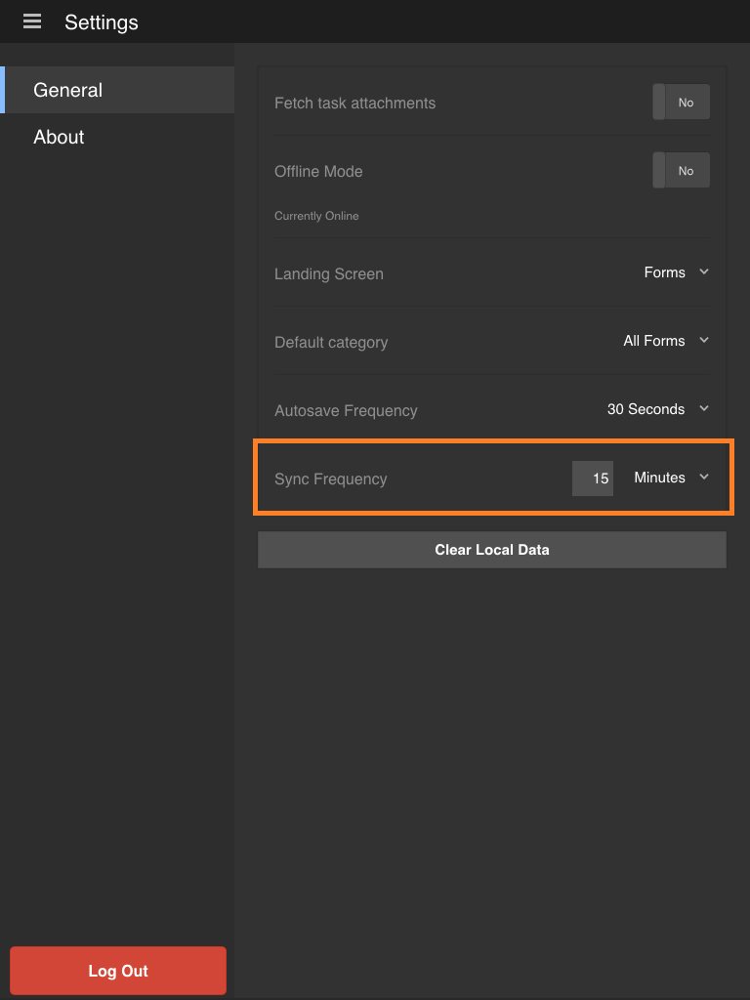

# 同步应用程序{#synchronizing-the-app}

## 同步应用程序 {#synchronizing-the-app-1}

可从AEM Forms服务器下载应用程序中的表单。 这些表单下载到“任务”和“Forms”选项卡下。 从表单创建的草稿将下载到草稿选项卡中，从任务创建的草稿将下载到任务选项卡中。 对于OSGi服务器上的独立表单，表单和草稿分别在Forms和草稿选项卡中下载。

完成并提交表单后，如果应用程序处于在线状态，则表单会立即上传回AEM Forms服务器。 在应用程序同步时，将从服务器获取表单。 但是，如果应用程序联机，草稿会立即与服务器同步。

当您与AEM Forms服务器联机时，默认情况下，您的应用程序每15分钟同步一次。 但是，您可以选择更改同步频率。 或者，您可以随时手动同步应用程序。

**手动同步应用**

选择主屏幕右下角的“同步”按钮。

**更改同步频率**

1. 要转到“设置”屏幕，请选择“主页”屏幕左上角的菜单按钮，然后选择&#x200B;**设置**。
1. 在“设置”屏幕中，选择“常规”选项卡。

   在“常规设置”窗口中

1. 在“同步频率”选项上，选择“同步频率”右边的值。
1. 在下拉列表中，选择新的同步频率。

### 技术规范 {#technical-specifications}

* 将离线应用程序数据提交到AEM Forms服务器的主要逻辑包含在runtime/offline/util/offline.js中。
* 在.js中，对processOfflineSubmittedSavedTasks(...)函数的调用将已保存/已提交的任务发送到服务器。 它还可以处理同步过程中的任何错误或冲突。 如果任务提交失败，应用程序上的任务将标记为失败。 此外，任务仍保留在“发件箱”中。
* syncSubmittedTask()和syncSavedTask()函数对各个任务执行操作。
* 在用户选择将脱机状态同步到服务器或由后台线程自动同步后，任务列表组件会启动对processOfflineSubmittedSavedTasks()函数的调用。
