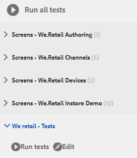

# 教程： 测试自适应表单{#tutorial-testing-your-adaptive-form}


本教程是创建第一个自 [适应表单系列中的一个步骤](https://helpx.adobe.com/experience-manager/6-3/forms/using/create-your-first-adaptive-form.html) 。 建议按照时间顺序按照系列来了解、执行和演示完整的教程用例。

自适应表单准备就绪后，在将自适应表单推出给最终用户之前，务必先测试它。 您可以手动测试每个字段（功能测试）或自动测试自适应表单。 当您有多个自适应表单时，手动测试所有自适应表单的每个字段将变得令人望而生畏的任务。

AEM Forms提供测试框架Calvin，以自动测试自适应表单。 使用框架，您可以直接在Web浏览器中编写和运行UI测试。 该框架提供用于创建测试的JavaScript API。 自动测试允许您测试自适应表单的预填体验、提交自适应表单的体验、表达式规则、验证、延迟加载和UI交互。 本教程将指导您逐步在自适应表单上创建和运行自动测试。 在本教程的结尾，您将能够：

* [为自适应表单创建测试套件](../../forms/using/testing-your-adaptive-form.md#step-create-a-test-suite)
* [为自适应表单创建测试](../../forms/using/testing-your-adaptive-form.md#step-create-a-test-case-to-prefill-values-in-an-adaptive-form)
* [运行为自适应表单创建的测试套件和测试](#step-run-all-the-tests-in-a-suite-or-individual-tests-cases)

## 第1步： 创建测试套件 {#step-create-a-test-suite}

测试套件包含一组测试用例。 您可以有多个测试套件。 建议为每个表单单独提供一个测试套件。 要创建测试套件，请执行以下操作：

1. 以管理员身份登录到AEM Forms作者实例。 打开CRXDE Lite。 您可以点击“AEM徽标”>“ **工具** ”>“常 **规** ” **>“** CRXDE Lite [”，或在浏](https://localhost:4502/crx/de/index.jsp) 览器中打开https://localhost:4502/crx/de/index.jsp  URL以打开CRXDE Lite。

1. 导航到CRXDE Lite中的/etc/clientlibs。 右键单击/etc/clientlibs子文件夹，然后单击“创 **建** ”>“ **创建节点”。** 在“名称”字段中， **键入WeRetailFormTestCases**。 选择类型( **cq:ClientLibraryFolder** )，然后单 **击“确定”**。 它创建一个节点。 您可以使用任何名称代替WeRetailFormTestCases。
1. 将以下属性添加到WeRetailFormTestCases节点并点按保 **存全部**。

<table>
 <tbody>
  <tr>
   <td><strong>属性</strong></td>
   <td><strong>类型</strong></td>
   <td><strong>多个</strong></td>
   <td><strong>值</strong></td>
  </tr>
  <tr>
   <td>类别</td>
   <td>字符串</td>
   <td>启用</td>
   <td>
    <ul>
     <li>granite.testing.hobbes.tests<br /> </li>
     <li>granite.testing.calvin.tests</li>
    </ul> </td>
  </tr>
  <tr>
   <td>依赖</td>
   <td>字符串</td>
   <td>启用</td>
   <td>
    <ul>
     <li>granite.testing.hobbes.testrunner <br /> </li>
     <li>granite.testing.calvin <br /> </li>
     <li>apps.testframework.all</li>
    </ul> </td>
  </tr>
 </tbody>
</table>

确保将每个属性添加到单独的框中，如下所示：


1. 右键单击WeRetailFormTestCases **[!UICONTROL 节点]** ，单击 **创建** > **创建文件**。 在“名称”字段中，键入 `js.txt` 并单 **击确定**。
1. 打开js.txt文件进行编辑，添加以下代码并保存文件：

   ```text
   #base=.
    init.js
   ```

1. 在节点中创建一个init.js `WeRetailFormTestCases`文件。 将以下代码添加到文件，然后点 **[!UICONTROL 按全部保存]**。

   ```javascript
   (function(window, hobs) {
       'use strict';
       window.testsuites = window.testsuites || {};
     // Registering the test form suite to the sytem
     // If there are other forms, all registration should be done here
       window.testsuites.testForm3 = new hobs.TestSuite("We retail - Tests", {
           path: '/etc/clientlibs/WeRetailFormTestCases/init.js',
           register: true
       });
    // window.testsuites.testForm2 = new hobs.TestSuite("testForm2");
   }(window, window.hobs));
   ```

   以上代码创建名为We retail - **Tests的测试套件**。

1. 打开AEM测试UI（AEM >工具>操作>测试）。 UI中列出 **测试套件** - We retail - Tests。

   

## 第2步： 创建测试用例以在自适应表单中预填值 {#step-create-a-test-case-to-prefill-values-in-an-adaptive-form}

测试用例是测试特定功能的一组操作。 例如，预填表单的所有字段并验证几个字段，以确保输入正确的值。

操作是自适应表单上的特定活动，如单击按钮。 要创建测试用例和操作以验证每个自适应表单字段的用户输入，请执行以下操作：

1. 在CRXDE lite中，导览至该文 `/content/forms/af/create-first-adaptive-form` 件夹。 右键单击 **[!UICONTROL create-first-adaptive-form文件夹节点]** ，然后单击“ **[!UICONTROL 创建]**”>“ **[!UICONTROL 创建文件”]**。 在“名称”字段中，键入 `prefill.xml` 并单 **[!UICONTROL 击确定]**。 将以下代码添加到文件：

   ```xml
   <?xml version="1.0" encoding="UTF-8"?><afData>
     <afUnboundData>
       <data>
         <customer_ID>371767</customer_ID>
         <customer_Name>John Jacobs</customer_Name>
         <customer_Shipping_Address>1657 1657 Riverside Drive Redding</customer_Shipping_Address>
         <customer_State>California</customer_State>
         <customer_ZIPCode>096001</customer_ZIPCode>
        </data>
     </afUnboundData>
     <afBoundData>
       <data xmlns:xfa="https://www.xfa.org/schema/xfa-data/1.0/"/>
     </afBoundData>
   </afData>
   ```

1. 导航至 `/etc/clientlibs`. 右键单击子文 `/etc/clientlibs` 件夹，然后单 **[!UICONTROL 击]**“创 **[!UICONTROL 建节点”]**。

   在“名 **[!UICONTROL 称]** ”字段类型 `WeRetailFormTests`中。 选择类型，然 `cq:ClientLibraryFolder` 后单 **[!UICONTROL 击确定]**。

1. 将以下属性添加 **[!UICONTROL 到WeRetailFormTests节]** 点。

<table>
 <tbody>
  <tr>
   <td><strong>属性</strong></td>
   <td><strong>类型</strong></td>
   <td><strong>多个</strong></td>
   <td><strong>值</strong></td>
  </tr>
  <tr>
   <td>类别</td>
   <td>字符串</td>
   <td>启用</td>
   <td>
    <ul>
     <li>granite.testing.hobbes.tests<br /> </li>
     <li>granite.testing.hobbes.tests.testForm</li>
    </ul> </td>
  </tr>
  <tr>
   <td>依赖</td>
   <td>字符串</td>
   <td>启用</td>
   <td>
    <ul>
     <li>granite.testing.calvin.tests</li>
    </ul> </td>
  </tr>
 </tbody>
</table>

1. 在WeRetailFormTests节点中创建一个 **[!UICONTROL 文件js]** .txt。 将以下内容添加到文件：

   ```shell
   #base=.
   prefillTest.js
   ```

   单击“ **[!UICONTROL 全部保存]**”。

1. 在WeRetailFormTests节 `prefillTest.js`点中创 **[!UICONTROL 建文件]** 。 将以下代码添加到文件。 代码创建测试用例。 测试用例预填表单的所有字段并验证某些字段，以确保输入正确的值。

   ```
   (function (window, hobs) {
       'use strict';
   
       var ts = new hobs.TestSuite("Prefill Test", {
           path: '/etc/clientlibs/WeRetailFormTests/prefillTest.js',
           register: false
       })
   
       .addTestCase(new hobs.TestCase("Prefill Test")
           // navigate to the testForm which is to be test
           .navigateTo("/content/forms/af/create-first-adaptive-form/shipping-address-add-update-form.html?wcmmode=disabled&dataRef=crx:///content/forms/af/create-first-adaptive-form/prefill.xml")
           // check if adaptive form is loaded
           .asserts.isTrue(function () {
               return calvin.isFormLoaded()
           })
           .asserts.isTrue(function () {
               return calvin.model("customer_ID").value == 371767;
           })
           .asserts.isTrue(function () {
               return calvin.model("customer_ZIPCode").value == 96001;
           })
       );
   
       // register the test suite with testForm
       window.testsuites.testForm3.add(ts);
   
   }(window, window.hobs));
   ```

   已创建测试用例并准备运行。 您可以创建测试用例来验证自适应表单的各个方面，如检查计算脚本的执行、验证模式以及验证自适应表单的提交体验。 有关自适应表单测试各个方面的信息，请参阅自动测试自适应表单。

## 第3步： 在套件或单个测试用例中运行所有测试 {#step-run-all-the-tests-in-a-suite-or-individual-tests-cases}

测试套件可以有多个测试用例。 可以一次或单独运行测试套件中的所有测试用例。 运行测试时，图标会指示结果：

* 复选标记图标指示通过的测试： 
* “X”图标表示测试失败： 

1. 导航到AEM图标> **[!UICONTROL 工具]**> **[!UICONTROL 操作]**>测 **[!UICONTROL 试]**
1. 要运行测试套件的所有测试，请执行以下操作：

   1. 在“Tests（测试）”面板 **[!UICONTROL 中，点按We retail - Tests(1)]**。 它该套件扩展为显示测试列表。
   1. 点击“ **[!UICONTROL Run tests]** （运行测试）”按钮。 测试执行时，屏幕右侧的空白区域将替换为自适应表单。

   

1. 要从测试套件运行单个测试，请执行以下操作：

   1. 在“Tests（测试）”面板 **[!UICONTROL 中，点按We retail - Tests(1)]**。 它该套件扩展为显示测试列表。
   1. 点按预 **[!UICONTROL 填测试]** ，然后点 **[!UICONTROL 按运行测]** 试。 测试执行时，屏幕右侧的空白区域将替换为自适应表单。

1. 点按测试名称“Prefill test”，查看测试用例的结果。 它打开“结果”面板。 点按“结果”面板中测试用例的名称，视图测试的所有详细信息。

   

现在，自适应表单已准备好发布。
